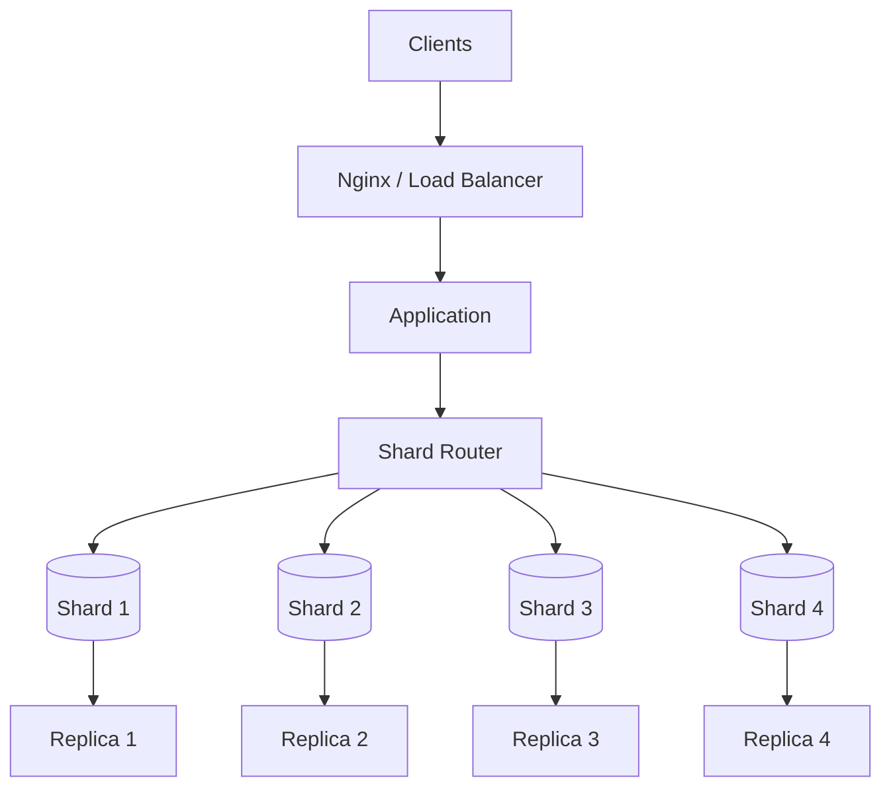
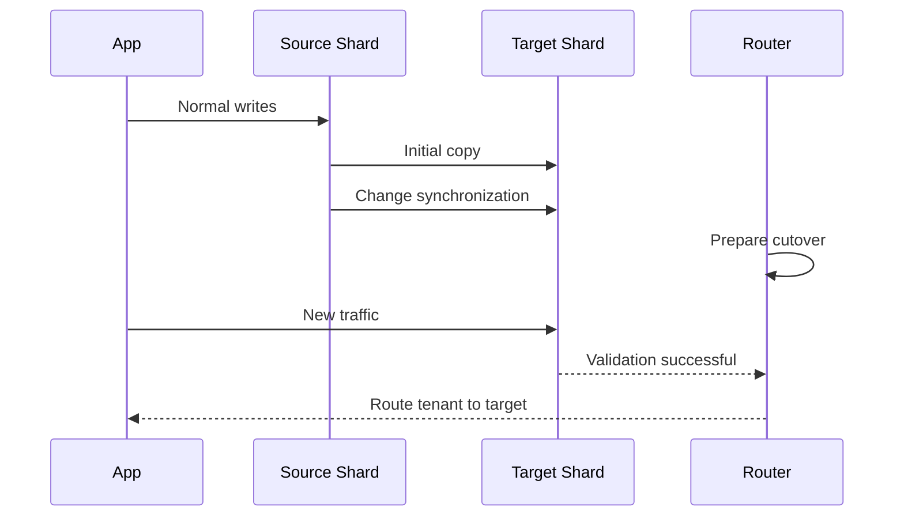
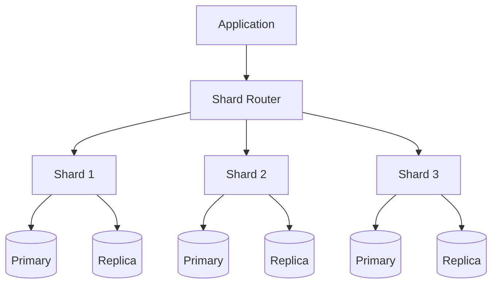

# 20- Sharding Architecture

## Overview

Sharding distributes a dataset across multiple independent database nodes so that no single database instance must contain or process the entire workload.

```text
                         Application
                              │
                              ▼
                        Shard Router
                     ┌────────┼────────┐
                     │        │        │
                     ▼        ▼        ▼
                  Shard 1  Shard 2  Shard 3
                     │        │        │
                  PostgreSQL PostgreSQL PostgreSQL
```

Sharding is primarily a strategy for scaling beyond the practical limits of a single database node.

It can address:

- Very large datasets
- High write throughput
- High per-node storage requirements
- Tenant isolation
- Workload distribution
- Geographic data placement

However, sharding is fundamentally a distributed-systems architecture. It introduces complexity around:

- Data placement
- Routing
- Transactions
- Joins
- Aggregations
- Schema migrations
- Rebalancing
- Backups
- Failover
- Observability

A useful progression is:

```text
SQL optimization
      ↓
Index optimization
      ↓
Connection pooling
      ↓
Caching
      ↓
Vertical scaling
      ↓
Read replicas
      ↓
Partitioning / workload isolation
      ↓
Sharding
```

Sharding should generally be introduced only when simpler approaches cannot satisfy the workload requirements.

---

## Why Sharding Exists

A single database eventually reaches practical limits.

```text
                    Single Database
                          │
          ┌───────────────┼───────────────┐
          ▼               ▼               ▼
      CPU limit       Storage limit    Write limit
```

Vertical scaling can postpone these limits:

```text
8 vCPU / 32 GB
      ↓
32 vCPU / 128 GB
      ↓
64 vCPU / 256 GB
```

But hardware capacity, cost, and workload characteristics eventually make a single-node architecture impractical.

Sharding distributes the data and workload:

```text
                 Total Dataset
                      │
          ┌───────────┼───────────┐
          ▼           ▼           ▼
       Shard 1     Shard 2     Shard 3
         1/3         1/3         1/3
```

Each shard can then be independently scaled and operated.

---

## Sharding vs Replication vs Partitioning

These concepts are related but solve different problems.

| Technique | Data Distribution | Primary Purpose |
|---|---|---|
| Replication | Copies same data | HA, read scaling, DR |
| Partitioning | Splits tables within database architecture | Large-table management, pruning, lifecycle |
| Sharding | Splits dataset across independent databases | Horizontal data/write scaling |
| Caching | Temporary copies | Reduce database reads |

Example:

```text
Replication:

Primary
 ├── Replica 1
 └── Replica 2


Partitioning:

Database
 └── orders
      ├── orders_2026_01
      ├── orders_2026_02
      └── orders_2026_03


Sharding:

Shard 1 → Customers A-D
Shard 2 → Customers E-H
Shard 3 → Customers I-L
```

A production system can use all of these simultaneously.

---

## What Is a Shard?

A shard is an independent database unit containing part of the overall dataset.

For example:

```text
Logical orders dataset

orders(customer_id, order_id, amount, created_at)
```

could be distributed as:

```text
Shard 1
customer_id = 1-1,000,000

Shard 2
customer_id = 1,000,001-2,000,000

Shard 3
customer_id = 2,000,001-3,000,000
```

Each shard is responsible for only part of the data.

The application needs a deterministic way to identify the correct shard.

---

## Shard Key

The **shard key** determines where a record belongs.

Common candidates include:

- `tenant_id`
- `customer_id`
- `account_id`
- `user_id`
- Geographic region
- Organization ID

For a multi-tenant SaaS application:

```text
tenant_id
    ↓
Shard routing
    ↓
Database containing tenant
```

The shard key is one of the most consequential decisions in a sharded architecture because changing it later can require substantial data movement.

---

## Properties of a Good Shard Key

A good shard key should generally provide:

### High Cardinality

There should be many possible values.

```text
tenant_id
customer_id
user_id
```

are usually better candidates than:

```text
country
status
is_active
```

### Even Distribution

The key should avoid concentrating most records on one shard.

### Query Locality

Common queries should be answerable from one shard.

### Stable Ownership

A record should not frequently move between shards.

### Predictable Routing

The application should be able to determine the target shard efficiently.

---

## Poor Shard Key Example

Suppose an application shards by country:

```text
US → 70%
IN → 15%
GB → 5%
Other → 10%
```

The US shard becomes a hotspot.

```text
Shard 1 → 70% workload
Shard 2 → 15%
Shard 3 → 5%
Shard 4 → 10%
```

Even though four shards exist, the system's effective capacity is constrained by the busiest shard.

This is **shard skew**.

---

## Query Locality

Consider:

```sql
SELECT *
FROM orders
WHERE customer_id = $1;
```

If `customer_id` is the shard key:

```text
customer_id
     ↓
Shard Router
     ↓
One shard
     ↓
Query
```

This is ideal.

Compare:

```sql
SELECT SUM(amount)
FROM orders;
```

The query may require:

```text
Shard 1 ─┐
Shard 2 ─┤
Shard 3 ─┼──→ Aggregate results
Shard 4 ─┘
```

This is a **scatter-gather query**.

The more queries that require scatter-gather behavior, the less attractive the shard design becomes.

---

## Sharding Architecture

A typical architecture is:



Each shard can independently have:

- A primary
- Read replicas
- Backups
- Monitoring
- Storage
- Connection pools
- Failover

Sharding therefore multiplies operational responsibilities.

---

## Request Lifecycle

A typical request might follow:

```text
HTTP request
     ↓
Nginx / Load Balancer
     ↓
Django / FastAPI
     ↓
Extract tenant/customer ID
     ↓
Shard router
     ↓
Determine shard
     ↓
Acquire connection
     ↓
Execute SQL
     ↓
Return result
```

The routing decision should happen before executing the database query.

---

## Shard Routing

A routing function conceptually looks like:

```python
def get_shard(customer_id: int, shard_count: int) -> int:
    return customer_id % shard_count
```

This demonstrates deterministic routing, but simple modulo routing has an important problem.

If:

```text
4 shards
```

becomes:

```text
8 shards
```

many keys map to different shards.

That means resharding can require significant data movement.

Production systems therefore often use more flexible placement mechanisms.

---

## Consistent Hashing

Consistent hashing reduces the amount of data that must move when nodes are added or removed.

Conceptually:

```text
                Hash Ring

             Shard A
                ●
          ┌────────────┐
          │            │
     ●────┘            └────●
 Shard D                  Shard B
          │            │
          └────●───────┘
             Shard C
```

Keys are mapped onto the ring and assigned to the next appropriate shard.

Consistent hashing can simplify rebalancing, but it does not automatically solve:

- Hotspots
- Cross-shard transactions
- Schema migrations
- Query routing
- Operational failures

---

## Directory-Based Sharding

Another approach uses a directory that maps shard keys to shards.

```text
tenant_id
    ↓
Shard Directory
    ↓
Shard 7
```

Example:

```text
tenant-001 → shard-01
tenant-002 → shard-03
tenant-003 → shard-02
```

Advantages:

- Flexible placement
- Easier tenant migration
- Explicit control
- Can support gradual rebalancing

Limitations:

- Additional dependency
- Directory availability matters
- Routing metadata must remain consistent

For tenant-based SaaS architectures, directory-based placement can be particularly useful.

---

## Range-Based Sharding

Range sharding divides keys into ranges.

```text
1 - 1M        → Shard 1
1M - 2M       → Shard 2
2M - 3M       → Shard 3
```

Advantages:

- Efficient range queries
- Predictable data locality
- Easy conceptual routing

Limitations:

- Sequential keys can create hotspots
- Data distribution may become uneven
- Rebalancing can be operationally expensive

Range sharding is useful when range locality is important.

---

## Hash-Based Sharding

Hash sharding uses a hash of the shard key.

```text
hash(customer_id)
       ↓
Shard number
```

Advantages:

- Usually good distribution
- Reduces sequential-key hotspots
- Simple routing

Limitations:

- Range queries become difficult
- Rebalancing requires careful design
- Cross-shard operations remain expensive

Hash sharding is often a good default when even distribution matters more than range locality.

---

## Range vs Hash Sharding

| Property | Range | Hash |
|---|---|---|
| Distribution | Can become uneven | Usually more even |
| Range queries | Strong | Weak |
| Sequential inserts | Potential hotspots | Better distribution |
| Routing | Simple | Simple |
| Rebalancing | Potentially easier conceptually | Can be complex |
| Data locality | Strong | Lower |
| Typical use | Time/range locality | General workload distribution |

---

## Tenant-Based Sharding

Multi-tenant applications are a common sharding candidate.

```text
Tenant A ──→ Shard 1
Tenant B ──→ Shard 1
Tenant C ──→ Shard 2
Tenant D ──→ Shard 3
```

Advantages:

- Tenant-local queries
- Strong data locality
- Easier tenant isolation
- Potentially easier tenant migration

A large tenant can still become a hotspot.

For example:

```text
Shard 1
 ├── Tenant A: 5%
 ├── Tenant B: 3%
 └── Tenant C: 60%
```

Tenant-level sharding may therefore require a strategy for **large tenants**.

---

## Tenant Isolation

Sharding can provide stronger operational isolation.

For example:

```text
Enterprise tenants
    ↓
Dedicated shards

Smaller tenants
    ↓
Shared shards
```

This can support:

- Performance isolation
- Compliance requirements
- Different backup policies
- Dedicated scaling
- Tenant-specific maintenance

However, physical separation is not a replacement for application authorization.

Every request must still verify tenant ownership.

---

## Large Tenant Problem

A tenant may outgrow its shard.

Initial:

```text
Tenant A → Shared Shard 1
```

Later:

```text
Tenant A → Dedicated Shard 10
```

This requires tenant migration.

A production architecture should consider this possibility before choosing tenant-based sharding.

---

## Data Rebalancing

As the system grows, shards may become uneven.

```text
Shard 1 → 90%
Shard 2 → 40%
Shard 3 → 35%
Shard 4 → 20%
```

Rebalancing moves data between shards.

```text
Shard 1
   │
   │ Move selected data
   ▼
Shard 4
```

Rebalancing is one of the major operational challenges of sharding.

It must account for:

- Consistency
- Application traffic
- Duplicate writes
- Cutover
- Validation
- Rollback
- Network bandwidth

---

## Online Shard Migration

A common migration pattern is:

```text
1. Select migration range
2. Copy existing data
3. Start change capture
4. Keep source and destination synchronized
5. Validate destination
6. Switch routing
7. Monitor
8. Remove source data later
```

Conceptually:



The exact mechanism depends on the database and tooling.

---

## Dual Writes

During migrations, systems sometimes write to both source and destination.

```text
Application
   │
   ├──→ Source
   │
   └──→ Target
```

Dual writes can help with migration but introduce consistency risks.

Potential failures:

```text
Source write succeeds
Target write fails
```

Now the databases diverge.

If dual writes are used, reconciliation and idempotency mechanisms are essential.

---

## Cross-Shard Transactions

A normal PostgreSQL transaction is straightforward:

```sql
BEGIN;

UPDATE accounts
SET balance = balance - 100
WHERE id = 1;

UPDATE accounts
SET balance = balance + 100
WHERE id = 2;

COMMIT;
```

If both accounts are on one shard, the transaction remains local.

If they are on different shards:

```text
Transaction
   │
   ├── Shard 1
   └── Shard 2
```

atomicity becomes a distributed transaction problem.

This is significantly more complex.

---

## Avoiding Cross-Shard Transactions

The preferred approach is often to design data ownership so important transactions remain shard-local.

For example:

```text
customer_id
    ↓
Customer shard
    ↓
Orders + customer-specific state
```

Then:

```text
Create Order
+
Update Customer State
```

can potentially remain on one shard.

This is a major reason shard-key selection must consider transaction boundaries, not just data distribution.

---

## Distributed Transactions

If cross-shard atomicity is unavoidable, options include:

- Two-phase commit
- Saga patterns
- Event-driven workflows
- Compensating transactions

Two-phase commit can provide distributed atomicity but introduces coordination and availability costs.

For many microservice architectures, a Saga is more practical:

```text
Service A
   ↓
Service B
   ↓
Service C
```

with compensating actions when a later step fails.

The correct approach depends on the business invariant.

---

## Cross-Shard Joins

A query such as:

```sql
SELECT *
FROM orders o
JOIN customers c
    ON c.id = o.customer_id;
```

is easy when both tables are on one database.

With sharding:

```text
Customers → Shard A
Orders    → Shard B
```

the database cannot simply perform a normal local join.

Possible strategies include:

- Co-locating related data
- Duplicating reference data
- Application-side joins
- Dedicated read models
- OLAP pipelines

Frequent cross-shard joins are usually a sign that the data model or shard key needs reconsideration.

---

## Reference Data

Small, relatively static tables can sometimes be replicated to every shard.

For example:

```text
countries
currencies
product_categories
```

could exist on every shard.

```text
Shard 1 → reference data
Shard 2 → reference data
Shard 3 → reference data
```

This avoids cross-shard lookups.

The trade-off is that updates must be propagated consistently.

---

## Global Identifiers

Distributed systems need globally unique identifiers.

A simple database sequence is local to a shard.

Possible approaches include:

- UUIDs
- ULIDs
- Snowflake-style IDs
- Application-generated identifiers

For example:

```python
from uuid import uuid4

order_id = uuid4()
```

Globally unique identifiers simplify:

- Cross-shard references
- Event processing
- Idempotency
- Data migration

However, identifier choice should also consider index locality, storage size, ordering, and workload characteristics.

---

## Primary Keys and Sharding

A primary key does not automatically determine shard placement.

For example:

```text
order_id = UUID
customer_id = shard key
```

The order ID can be globally unique while the customer ID determines the database location.

This separation can be useful:

```text
Identity:
order_id

Placement:
customer_id
```

---

## Foreign Keys Across Shards

Database-level foreign keys generally work naturally within one database.

Across independent shards:

```text
Shard A
customers

Shard B
orders
```

the database cannot enforce a normal local foreign key between them.

The application or data architecture must enforce the invariant.

Possible approaches include:

- Co-locate related data
- Application validation
- Event-driven consistency
- Reference-data replication
- Periodic integrity checks

Cross-shard referential integrity is therefore a major design consideration.

---

## Sharding and Django

Django's database routing mechanisms can support multiple database connections.

Conceptually:

```python
DATABASES = {
    "shard_1": {
        "ENGINE": "django.db.backends.postgresql",
        "NAME": "app",
        "HOST": "shard-1",
    },
    "shard_2": {
        "ENGINE": "django.db.backends.postgresql",
        "NAME": "app",
        "HOST": "shard-2",
    },
}
```

A router can determine the target database.

However, Django's ORM does not make distributed transactions transparent.

Application code must explicitly understand:

- Shard ownership
- Routing
- Transaction boundaries
- Cross-shard operations
- Migration behavior

Sharding should not be hidden behind an abstraction so aggressively that developers cannot reason about its consistency model.

---

## Sharding and FastAPI

A FastAPI service can implement a shard-routing layer:

```text
FastAPI
   ↓
Dependency / Service Layer
   ↓
Shard Resolver
   ↓
SQLAlchemy Session / Engine
   ↓
Target Shard
```

The resolver should be deterministic and observable.

For example:

```python
def resolve_shard(tenant_id: str) -> str:
    # Production implementations may consult a shard directory.
    return shard_directory.lookup(tenant_id)
```

A real implementation should also handle:

- Missing routing metadata
- Shard health
- Connection failures
- Migration states
- Retries

---

## Connection Pooling

Every shard can have its own connection pool.

```text
Application
 ├── Pool → Shard 1
 ├── Pool → Shard 2
 ├── Pool → Shard 3
 └── Pool → Shard 4
```

This can create a serious connection explosion.

For example:

```text
20 application pods
×
4 shards
×
10 connections
=
800 potential connections
```

The application must not blindly create a full pool for every shard.

Possible strategies include:

- Lazy pool creation
- Smaller per-shard pools
- PgBouncer
- Connection routing services
- Limiting active shard concurrency

Connection capacity becomes more complex as shard count increases.

---

## Sharding with Celery

Background workers can accidentally amplify shard load.

```text
Celery
 ├── Worker 1 → Shard 1
 ├── Worker 2 → Shard 2
 ├── Worker 3 → Shard 3
 └── Worker 4 → Shard 4
```

Tasks should carry enough information to route deterministically.

For example:

```text
task payload
{
    "tenant_id": "...",
    "operation": "process_order"
}
```

The worker resolves the tenant's shard before accessing the database.

---

## Sharding with Kafka

Kafka can distribute events while the shard key preserves ordering or locality.

For example:

```text
Kafka key = tenant_id
```

can help route events for a tenant consistently to a partition.

```text
tenant_id
    ↓
Kafka partition
    ↓
Consumer
    ↓
Tenant shard
```

This can align event processing with database ownership.

The database shard key and Kafka partitioning strategy should be intentionally designed rather than coincidentally chosen.

---

## Idempotency in Sharded Systems

Retries become more important because there are more failure points.

A request can fail during:

```text
Application
   ↓
Router
   ↓
Network
   ↓
Shard
   ↓
Transaction
   ↓
Response
```

The database operation may succeed even if the response is lost.

Use idempotency keys and database constraints where appropriate.

```sql
CREATE UNIQUE INDEX payment_idempotency_idx
ON payments(idempotency_key);
```

This prevents a retry from creating duplicate business records.

---

## Shard Failures

Each shard becomes an independent failure domain.

A typical production architecture uses replication within each shard:

```text
Shard 1
 ├── Primary
 └── Replica

Shard 2
 ├── Primary
 └── Replica

Shard 3
 ├── Primary
 └── Replica
```

If Shard 2 fails:

```text
Shard 1 → Healthy
Shard 2 → Failed
Shard 3 → Healthy
```

only part of the dataset may be affected, depending on the HA architecture.

However, this is useful only if the application can correctly detect and handle shard-level failures.

---

## Shard-Level High Availability

A robust design often combines sharding and replication:



This means:

```text
Sharding
→ Distributes data

Replication
→ Protects each shard
```

The two mechanisms solve different problems and are often combined.

---

## Monitoring

Monitoring must operate at both cluster and shard levels.

### Database Metrics

Monitor per shard:

- CPU
- Memory
- Storage
- IOPS
- Query latency
- Connections
- Locks
- Deadlocks
- WAL generation
- Replication lag

### Sharding Metrics

Also monitor:

- Data distribution
- Traffic distribution
- Hot shards
- Cross-shard queries
- Routing errors
- Migration progress
- Rebalancing progress

### Application Metrics

Track:

- Requests per shard
- Errors per shard
- p95/p99 latency per shard
- Pool wait time
- Primary/replica routing
- Scatter-gather frequency

Aggregate metrics can hide a single overloaded shard.

---

## Hot Shards

Suppose:

```text
Shard 1 → 25% traffic
Shard 2 → 25%
Shard 3 → 25%
Shard 4 → 25%
```

This is balanced.

Now:

```text
Shard 1 → 10%
Shard 2 → 10%
Shard 3 → 10%
Shard 4 → 70%
```

The cluster may appear healthy in aggregate while Shard 4 is overloaded.

Always monitor per-shard metrics.

---

## Capacity Planning

Sharding requires capacity planning around:

```text
Current data
+
Current traffic
+
Growth rate
+
Peak traffic
+
Shard distribution
+
Future migrations
```

Avoid designing shards to run near maximum capacity.

Leave room for:

- Growth
- Rebalancing
- Failover
- Maintenance
- Traffic skew

---

## Schema Migrations

A sharded architecture multiplies migration work.

Instead of:

```text
1 database
```

you may have:

```text
50 shards
```

A schema migration must now be safely applied to all shards.

Potential approaches include:

- Automated migration orchestration
- Version tracking per shard
- Rolling migrations
- Expand-and-contract deployment
- Compatibility checks

Example:

```text
Migration Controller
      │
      ├── Shard 1 → v42
      ├── Shard 2 → v42
      ├── Shard 3 → v42
      └── Shard 4 → v42
```

Do not assume every shard will migrate successfully at exactly the same time.

---

## Shard Version Tracking

Maintain explicit migration state.

```text
Shard 1 → schema v42
Shard 2 → schema v42
Shard 3 → schema v41
Shard 4 → schema v42
```

The application must remain compatible with the supported schema versions during rolling deployment.

This is especially important for large fleets.

---

## Backups and Restore

Each shard needs a recoverability strategy.

```text
Shard 1 → Backup
Shard 2 → Backup
Shard 3 → Backup
Shard 4 → Backup
```

Recovery questions include:

- Can an individual shard be restored?
- Can the entire dataset be reconstructed?
- Are backups consistent with related data?
- How long does restoring one shard take?
- How is routing updated after restoration?

Sharding can reduce the size of individual backup units but increases backup orchestration complexity.

---

## Disaster Recovery

A multi-shard DR architecture may look like:

```text
Primary Region
 ├── Shard 1
 ├── Shard 2
 └── Shard 3
       │
       │ Replication / Backup
       ▼
DR Region
 ├── Shard 1
 ├── Shard 2
 └── Shard 3
```

DR must preserve the mapping between shard keys and shard locations.

The recovery process should explicitly define:

- Which shards must be restored
- Restoration order
- Routing activation
- Data validation
- Application recovery
- RPO/RTO

---

## Security

Sharding can improve isolation but also increases the number of database endpoints.

Use:

- Private networking
- TLS
- Least-privilege database roles
- Secrets management
- Network policies
- Encryption at rest
- Encryption in transit
- Audit logging

For multi-tenant systems, never trust a client-provided shard or tenant identifier without authorization validation.

A secure request path is:

```text
Authenticated user
      ↓
Authorized tenant
      ↓
Trusted tenant ID
      ↓
Shard resolver
      ↓
Target database
```

---

## Cost Considerations

Sharding increases infrastructure and operational costs.

Costs can include:

- More database instances
- More storage
- More replicas
- More backups
- More network traffic
- More monitoring
- Data migration infrastructure
- Engineering effort

A four-shard system may require:

```text
4 primary databases
+
4 replicas
+
8 connection pools
+
Migration orchestration
+
Monitoring
+
Backup infrastructure
```

The actual architecture depends on the deployment model, but the operational multiplication is real.

---

## When Sharding Is Appropriate

Sharding becomes attractive when:

- A single database cannot provide required write throughput.
- Dataset size exceeds practical single-node limits.
- Tenants require strong workload isolation.
- Data locality requirements justify distribution.
- Vertical scaling is no longer economically or technically sufficient.
- Partitioning cannot adequately address the workload.
- Read replicas do not solve the primary bottleneck.

Sharding should not be introduced simply because a system is "large."

---

## When Sharding Is Not Appropriate

Avoid sharding when:

- The database is still comfortably within single-node limits.
- The primary problem is inefficient SQL.
- Read replicas solve the actual bottleneck.
- Redis can eliminate unnecessary reads.
- Partitioning solves table-size and lifecycle concerns.
- Cross-entity transactions dominate the workload.
- The team cannot operate distributed database infrastructure reliably.

Complexity should be justified by measurable requirements.

---

## Production Architecture Decision

A useful decision sequence is:

```text
Is SQL efficient?
       │
       ├── No → Optimize
       │
       ▼
Is the workload read-heavy?
       │
       ├── Yes → Cache / replicas
       │
       ▼
Is one node resource-bound?
       │
       ├── Yes → Vertical scaling
       │
       ▼
Are tables too large?
       │
       ├── Yes → Partitioning
       │
       ▼
Can workloads be isolated?
       │
       ├── Yes → Separate workloads
       │
       ▼
Does a single node still limit writes/data?
       │
       ├── Yes → Evaluate sharding
       │
       ▼
Design shard key + routing + HA + migration
```

---

## Production Best Practices

- Choose the shard key based on both distribution and access locality.
- Design important transactions to remain shard-local where possible.
- Avoid frequent cross-shard joins.
- Avoid distributed transactions unless the business requirement genuinely requires them.
- Use globally unique identifiers when appropriate.
- Monitor each shard independently.
- Design for shard rebalancing before the first shard becomes overloaded.
- Plan for large tenants becoming dedicated shards when using tenant-based sharding.
- Use replication within shards for HA where required.
- Maintain independent backups for every shard.
- Automate schema migrations across the shard fleet.
- Use idempotency for retryable operations.
- Make routing observable and auditable.
- Test shard failure, migration, and rebalancing procedures.
- Keep application abstractions explicit enough that engineers understand shard-local versus distributed operations.

## Common Mistakes

### Sharding Before Optimization

Poor SQL distributed across 20 shards remains poor SQL.

**Better:** optimize queries, indexes, transactions, and connection usage first.

### Choosing the Shard Key Only for Even Distribution

A mathematically balanced key can still produce expensive cross-shard queries.

**Better:** optimize for distribution, locality, and transaction boundaries.

### Using a Low-Cardinality Key

Sharding by `country`, `status`, or another low-cardinality field can produce severe skew.

**Better:** prefer high-cardinality keys aligned with access patterns.

### Ignoring Hot Shards

A single overloaded shard can become the system bottleneck.

**Better:** monitor per-shard traffic and resource utilization.

### Using Modulo Hashing Without a Rebalancing Strategy

Changing shard count can remap a large percentage of records.

**Better:** design placement and migration mechanisms before scaling the shard fleet.

### Allowing Cross-Shard Joins Everywhere

This effectively turns every query into a distributed query.

**Better:** co-locate related data or build dedicated read models.

### Assuming Django ORM Hides Complexity

Django can route queries to databases, but it does not make distributed transactions or cross-shard consistency disappear.

**Better:** expose shard boundaries at the service/data-access layer.

### Creating Full Connection Pools for Every Shard

Connection counts multiply rapidly.

**Better:** use bounded pools, lazy connections, and appropriate pooling infrastructure.

### Treating Sharding as a Backup Strategy

Sharding distributes data but does not provide recoverability.

**Better:** implement independent backup and restore procedures.

### Forgetting Schema Migration Complexity

One migration across 100 shards is an operational workflow, not a single database command.

**Better:** automate migration orchestration and track schema versions per shard.

### Ignoring Large-Tenant Migration

A tenant may eventually outgrow its shared shard.

**Better:** design tenant relocation and dedicated-shard workflows early.

### Blind Retries

Network failures can make the client uncertain whether a shard transaction committed.

**Better:** use idempotency keys and database constraints where business operations are retryable.

## Interview Traps

### What is database sharding?

Sharding distributes a logical dataset across multiple independent database nodes so that data and workload can scale beyond the practical limits of one database.

### What is the difference between sharding and replication?

Replication creates copies of the same dataset, primarily for HA, DR, and read scaling. Sharding divides the dataset across independent nodes to distribute data and workload.

### What is the difference between partitioning and sharding?

Partitioning divides data within a database architecture, while sharding distributes data across independent database instances or nodes. Sharding introduces substantially more distributed-system complexity.

### Why is shard-key selection so important?

The shard key determines data placement. A poor key can create hotspots, expensive cross-shard queries, difficult transactions, and painful rebalancing.

### What makes a good shard key?

High cardinality, balanced distribution, predictable routing, stable ownership, and strong alignment with common query and transaction boundaries.

### Why is write scaling harder than read scaling?

Read replicas can independently serve reads from replicated state. Write scaling requires distributing authoritative state while preserving transactions, constraints, consistency, and conflict handling.

### What is a hot shard?

A shard receiving disproportionately high traffic or data volume. It can become the bottleneck even when other shards have substantial unused capacity.

### What is scatter-gather?

A query is sent to multiple shards and the results are combined.

```text
Query
 ├── Shard 1
 ├── Shard 2
 ├── Shard 3
 └── Shard 4
       ↓
   Aggregate
```

It increases network traffic, latency, and failure complexity.

### How do you avoid cross-shard transactions?

Choose a shard key that keeps related state and important transaction boundaries together. If cross-shard workflows are unavoidable, consider Saga-style workflows or other distributed coordination mechanisms.

### Why are cross-shard joins expensive?

The data may reside on different database nodes, requiring network requests and distributed result processing instead of a local database join.

### Why isn't modulo hashing always sufficient?

Changing the shard count changes the mapping for many keys, potentially requiring extensive data movement.

### How would you rebalance shards?

Copy selected data to the target shard, capture or synchronize changes, validate the destination, perform a controlled routing cutover, monitor the new placement, and remove old data only after verification.

### How does sharding affect Django?

Django can route queries across configured databases, but application architecture must explicitly manage shard ownership, transaction boundaries, migrations, connection pools, and cross-shard operations.

### How does sharding affect Kubernetes?

Application scaling multiplies connections and query traffic across potentially many shards. Autoscaling must therefore account for aggregate database capacity and per-shard hotspots.

### How does Kafka fit into a sharded architecture?

Kafka can partition events using a key such as `tenant_id`, allowing event processing to preserve locality and align with database shard ownership. The Kafka partitioning strategy and database shard strategy should be intentionally coordinated.

### Does sharding automatically provide high availability?

No. Sharding distributes data, while replication and failover mechanisms provide availability for individual shards.

### What happens if one shard fails?

The data assigned to that shard may become unavailable unless the shard has its own HA/failover architecture. Sharding therefore needs to be combined with replication or another recovery strategy.

### What is the biggest operational challenge with sharding?

The system becomes a fleet of databases rather than one database. Migrations, monitoring, backups, rebalancing, failover, routing, and debugging must all operate across that fleet.

### When would you choose sharding over vertical scaling?

When a single database node has reached practical or economic limits and the workload or dataset can be divided with acceptable consistency and query complexity. Sharding should follow measurement rather than serve as a default scaling strategy.

### What is the senior-level answer to "How would you design a sharded PostgreSQL system?"

Start with workload characterization and prove that simpler strategies are insufficient. Select a shard key based on distribution, query locality, and transaction boundaries; design deterministic routing; keep critical operations shard-local; provide replication and failover per shard; automate migrations and rebalancing; monitor per-shard health; use idempotency for retries; and explicitly address cross-shard queries, backups, DR, security, and operational cost.

## Key Takeaways

- **Sharding distributes data across independent database nodes**, making it possible to scale datasets and write workloads beyond the practical limits of a single database.
- **The shard key is the central architectural decision** and must balance distribution, query locality, transaction boundaries, tenant behavior, and future rebalancing requirements.
- **Sharding introduces distributed-system complexity** around cross-shard transactions, joins, routing, migrations, consistency, failure handling, and backups.
- **A production sharded system commonly combines sharding with replication, pooling, caching, observability, and automated operational tooling** rather than relying on sharding alone.
- **Sharding should be the result of measured capacity requirements**, not the first response to database growth; optimize and exhaust simpler scaling strategies before accepting its operational complexity.