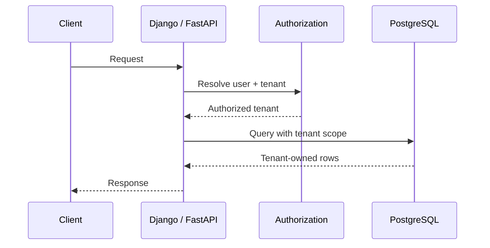
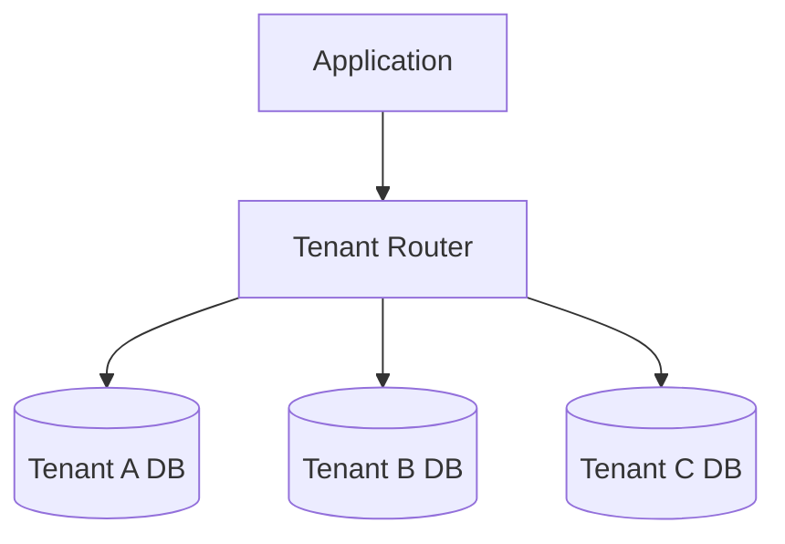
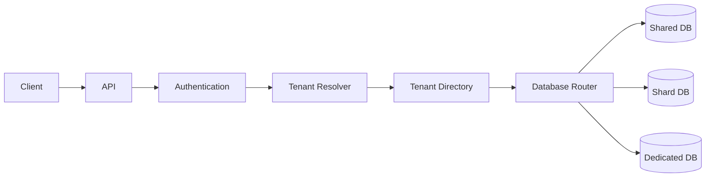
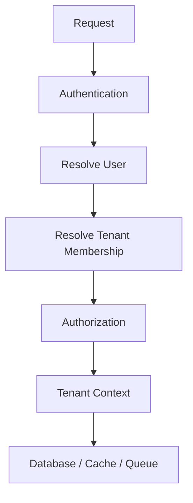
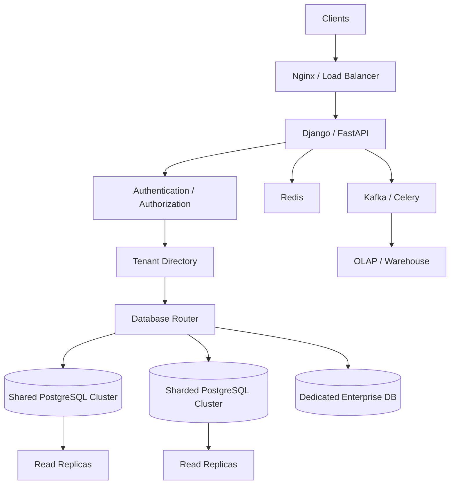

# 21- Multi-Tenant Database Architecture

## Overview

A multi-tenant database architecture stores data for multiple customers, organizations, or tenants within a shared application.

A **tenant** is an independently managed customer or organizational boundary within the application.

For example:

```text
SaaS Application
       │
       ├── Tenant A
       ├── Tenant B
       ├── Tenant C
       └── Tenant D
```

The central architectural question is:

> How should tenant data be isolated, stored, queried, scaled, backed up, and secured?

Common database models are:

```text
Shared Database
      │
      ├── Shared Schema
      │
      └── Tenant-specific Schema
              
Separate Database
      │
      └── One Database per Tenant
```

There is no universally correct model. The appropriate design depends on:

- Tenant count
- Tenant size
- Security requirements
- Compliance requirements
- Isolation requirements
- Query patterns
- Operational maturity
- Cost
- Scaling requirements
- Backup and recovery requirements

A mature system may even use a **hybrid model**, where small tenants share infrastructure while large or regulated tenants receive dedicated databases.

---

## Tenant Isolation

Tenant isolation means preventing one tenant from accessing or modifying another tenant's data.

Consider:

```text
Tenant A
  └── orders

Tenant B
  └── orders
```

The application must guarantee:

```text
Tenant A request → Tenant A data only
Tenant B request → Tenant B data only
```

This is primarily a **security boundary**, not merely a database organization technique.

A scaling strategy that improves performance but weakens tenant isolation is unacceptable.

---

## Multi-Tenant Architecture Models

The three common models are:

| Model | Database | Schema | Data Isolation | Operational Complexity | Typical Cost |
|---|---|---|---|---|---|
| Shared database/shared schema | Shared | Shared | Logical | Low | Lowest |
| Shared database/separate schema | Shared | Per tenant | Schema-level | Medium | Medium |
| Database per tenant | Separate | Separate | Strong physical | High | Highest |

A fourth practical model is:

```text
Hybrid
├── Small tenants → Shared database
├── Large tenants → Dedicated database
└── Regulated tenants → Dedicated infrastructure
```

---

## Shared Database and Shared Schema

This is the most common SaaS model at scale for large numbers of relatively small tenants.

Tables contain a tenant identifier:

```sql
CREATE TABLE orders (
    id BIGINT GENERATED ALWAYS AS IDENTITY PRIMARY KEY,
    tenant_id UUID NOT NULL,
    customer_id UUID NOT NULL,
    amount NUMERIC(12, 2) NOT NULL,
    created_at TIMESTAMPTZ NOT NULL DEFAULT now()
);
```

Every tenant-owned table contains:

```text
tenant_id
```

Example data:

```text
orders
------------------------------------------------
id    tenant_id       customer_id    amount
1     tenant-A        customer-1     100.00
2     tenant-B        customer-7     250.00
3     tenant-A        customer-3      50.00
```

Queries must always constrain by tenant:

```sql
SELECT *
FROM orders
WHERE tenant_id = $1
  AND id = $2;
```

---

## Advantages of Shared Schema

### Lower Cost

Many tenants can share the same database infrastructure.

### Simpler Provisioning

Creating a tenant may only require:

```sql
INSERT INTO tenants (...);
```

rather than provisioning an entire database.

### Easier Fleet Management

One schema migration can apply to all tenants.

### Efficient Resource Utilization

Small tenants do not require dedicated database resources.

### Easy Cross-Tenant Administration

Platform-level analytics and operational queries can be easier.

---

## Limitations of Shared Schema

The major challenge is logical isolation.

A missing predicate can become a security incident:

```sql
SELECT *
FROM orders
WHERE id = $1;
```

The query may return another tenant's record if IDs are not globally scoped correctly.

The safer pattern is:

```sql
SELECT *
FROM orders
WHERE tenant_id = $1
  AND id = $2;
```

Tenant filtering should be treated as a mandatory data-access invariant.

---

## Tenant-Aware Data Model

A typical SaaS schema might contain:

```text
tenants
   │
   ├── users
   ├── customers
   ├── orders
   ├── invoices
   └── projects
```

Tenant-owned tables should usually contain a tenant identifier.

```sql
CREATE TABLE projects (
    id UUID PRIMARY KEY,
    tenant_id UUID NOT NULL REFERENCES tenants(id),
    name TEXT NOT NULL,
    created_at TIMESTAMPTZ NOT NULL DEFAULT now()
);
```

The tenant identifier should be part of the application's authorization and data-access model.

---

## Composite Uniqueness

Global uniqueness and tenant-local uniqueness are different requirements.

Suppose project names only need to be unique within a tenant.

Use:

```sql
CREATE UNIQUE INDEX projects_tenant_name_uidx
ON projects (tenant_id, name);
```

This permits:

```text
Tenant A → "Production"
Tenant B → "Production"
```

while preventing:

```text
Tenant A → "Production"
Tenant A → "Production"
```

This is an important multi-tenant database design pattern.

---

## Tenant-Scoped Foreign Keys

A simple foreign key may not always express the desired tenant invariant.

Consider:

```text
orders
tenant_id
customer_id
```

and:

```text
customers
tenant_id
id
```

If `customer_id` is only meaningful within a tenant, the relationship should enforce tenant consistency.

One approach is to create a composite uniqueness constraint:

```sql
ALTER TABLE customers
ADD CONSTRAINT customers_tenant_id_id_key
UNIQUE (tenant_id, id);
```

Then the child table can reference both:

```sql
ALTER TABLE orders
ADD CONSTRAINT orders_customer_tenant_fk
FOREIGN KEY (tenant_id, customer_id)
REFERENCES customers (tenant_id, id);
```

This prevents an order belonging to Tenant A from referencing a customer belonging to Tenant B.

---

## Row-Level Security

PostgreSQL provides Row-Level Security (RLS), which can enforce row visibility at the database layer.

Conceptually:

```text
Application
    │
    ▼
PostgreSQL
    │
    ▼
RLS Policy
    │
    ├── Tenant A → Tenant A rows
    └── Tenant B → Tenant B rows
```

Example:

```sql
ALTER TABLE orders ENABLE ROW LEVEL SECURITY;

CREATE POLICY tenant_isolation
ON orders
USING (tenant_id = current_setting('app.tenant_id')::uuid);
```

The application can establish the tenant context for the database session.

RLS provides defense in depth, but it requires careful handling of:

- Database roles
- Session settings
- Connection pooling
- Privileged users
- Administrative operations
- Testing

---

## RLS and Connection Pooling

Connection pooling creates an important operational concern.

Suppose:

```text
Request A
tenant_id = A
    ↓
Connection 1

Request B
tenant_id = B
    ↓
Same Connection 1
```

If tenant context is stored as session state and not correctly reset, Tenant B could accidentally inherit Tenant A's context.

Therefore, tenant context must be scoped and reset safely.

Transaction-scoped configuration is often safer for request-specific state:

```sql
SET LOCAL app.tenant_id = '...';
```

The exact implementation should be tested with the selected pooling mode and transaction boundaries.

---

## Application-Level Tenant Isolation

The application should determine the authenticated tenant before accessing tenant-owned data.



The client should not be trusted to choose an arbitrary tenant.

For example, this is unsafe:

```text
GET /orders?tenant_id=tenant-b
```

if the server simply trusts the supplied tenant ID.

The server should derive tenant access from authenticated identity and authorization rules.

---

## Tenant Context

A request typically needs a trusted tenant context.

```text
Authentication
      ↓
User identity
      ↓
Tenant membership
      ↓
Authorization
      ↓
Tenant context
      ↓
Database query
```

In a Django or FastAPI application, tenant context should be established early and passed explicitly through service/data-access layers.

Avoid hidden global state where possible because it makes testing and asynchronous execution harder to reason about.

---

## Tenant Membership

A user may belong to multiple tenants.

```text
User
 ├── Tenant A
 ├── Tenant B
 └── Tenant C
```

A common model is:

```sql
CREATE TABLE tenant_memberships (
    tenant_id UUID NOT NULL REFERENCES tenants(id),
    user_id UUID NOT NULL REFERENCES users(id),
    role TEXT NOT NULL,
    PRIMARY KEY (tenant_id, user_id)
);
```

Authorization then determines:

```text
User
  ↓
Membership
  ↓
Role
  ↓
Allowed operation
```

Tenant membership should be evaluated independently from authentication.

Being authenticated does not automatically authorize access to every tenant.

---

## Tenant-Aware Indexing

Indexes must reflect tenant-aware access patterns.

For example:

```sql
CREATE INDEX orders_tenant_created_idx
ON orders (tenant_id, created_at DESC);
```

This is often more useful for a SaaS query such as:

```sql
SELECT *
FROM orders
WHERE tenant_id = $1
ORDER BY created_at DESC
LIMIT 50;
```

The tenant column often belongs early in composite indexes when tenant-scoped queries are dominant.

---

## Index Selectivity and Tenant Distribution

Tenant size matters.

Suppose:

```text
Tenant A → 1 million rows
Tenant B → 10 rows
Tenant C → 5 rows
```

A shared schema can have very uneven tenant workloads.

A composite index such as:

```sql
(tenant_id, created_at)
```

may work well for tenant-local queries, but query plans should still be verified with realistic data distributions.

Do not assume all tenants behave similarly.

---

## Noisy Neighbor Problem

A large tenant can consume disproportionate resources.

```text
Shared Database
├── Tenant A → 5%
├── Tenant B → 5%
├── Tenant C → 80%
└── Others  → 10%
```

Tenant C can become a **noisy neighbor**.

Possible mitigation strategies include:

- Query limits
- Rate limiting
- Per-tenant quotas
- Background job controls
- Dedicated read capacity
- Dedicated database
- Tenant sharding

Multi-tenancy therefore has both security and resource-isolation dimensions.

---

## Tenant Quotas

Quotas can protect shared infrastructure.

Examples:

```text
Maximum users
Maximum storage
Maximum API requests
Maximum background jobs
Maximum records
Maximum concurrent exports
```

Enforcement can happen at multiple layers:

```text
API rate limiter
      ↓
Application quota
      ↓
Database constraints
      ↓
Infrastructure limits
```

Database constraints should enforce correctness, while application/infrastructure controls can protect capacity.

---

## Separate Schema per Tenant

Another model uses one schema per tenant:

```text
Database
├── tenant_a
│    ├── users
│    ├── orders
│    └── projects
│
├── tenant_b
│    ├── users
│    ├── orders
│    └── projects
```

Advantages:

- Stronger structural isolation
- Tenant-specific schema management
- Reduced accidental cross-tenant queries

Limitations:

- Many schemas become difficult to operate
- Migrations multiply
- Schema count can become large
- Connection/search-path behavior becomes more complex
- Cross-tenant analytics becomes harder

This model can work for moderate tenant counts but becomes operationally expensive at very large scale.

---

## Database per Tenant

The strongest traditional isolation model is:

```text
Tenant A → Database A
Tenant B → Database B
Tenant C → Database C
```

Architecture:



Advantages:

- Strong physical isolation
- Independent scaling
- Tenant-specific backups
- Tenant-specific restore
- Easier compliance isolation
- Reduced noisy-neighbor impact

Limitations:

- High operational overhead
- More connections
- More migrations
- More backups
- Higher cost
- More infrastructure to monitor

This model is often appropriate for large enterprise or highly regulated tenants.

---

## Hybrid Multi-Tenant Architecture

A practical SaaS architecture may combine models.

```text
                    Tenant Router
                         │
          ┌──────────────┼──────────────┐
          ▼              ▼              ▼
    Shared Cluster   Dedicated DB   Dedicated DB
    Small tenants    Enterprise A   Enterprise B
```

For example:

```text
Tier
├── Standard → Shared PostgreSQL
├── Enterprise → Dedicated database
└── Regulated → Dedicated infrastructure
```

This provides a balance between cost and isolation.

---

## Tenant Placement

A tenant placement service can maintain:

```text
tenant_id
database_cluster
shard_id
region
status
```

Example:

```text
tenant-A → cluster-01 / shard-02
tenant-B → cluster-01 / shard-04
tenant-C → cluster-07 / dedicated
```

The application asks the placement layer where the tenant's data lives.

This becomes especially useful when tenants can migrate between databases.

---

## Tenant Routing Architecture



The routing layer should be deterministic, observable, and resilient.

It should not become an opaque source of unexpected database selection.

---

## Tenant Sharding

Multi-tenancy naturally aligns with sharding.

```text
tenant_id
    ↓
Shard Resolver
    ↓
Shard
```

Example:

```text
Tenant A → Shard 1
Tenant B → Shard 1
Tenant C → Shard 2
Tenant D → Shard 3
```

The tenant becomes the shard key.

This works particularly well when most operations are tenant-local.

---

## Large Tenant Migration

A tenant may eventually outgrow a shared shard.

Initial:

```text
Tenant A → Shared Shard 1
```

Later:

```text
Tenant A → Dedicated Shard 10
```

A production migration can follow:

```text
Initial data copy
      ↓
Change synchronization
      ↓
Validation
      ↓
Routing cutover
      ↓
Monitor
      ↓
Remove old data
```

The migration should be designed to minimize downtime and preserve consistency.

---

## Tenant Database Migration

A robust tenant migration needs explicit states.

```text
ACTIVE
  ↓
MIGRATING
  ↓
VALIDATING
  ↓
CUTOVER
  ↓
ACTIVE_ON_NEW_LOCATION
```

A failed migration should have a clear recovery state.

Do not model migration as a single boolean such as:

```text
migrated = true
```

when the operation involves multiple asynchronous steps.

---

## Data Migration Strategies

Possible approaches include:

| Strategy | Downtime | Complexity | Typical Use |
|---|---:|---:|---|
| Offline copy | Higher | Low | Small tenants |
| Dual write | Low | High | Controlled migrations |
| CDC | Low | High | Large datasets |
| Logical replication | Low | High | PostgreSQL migration |
| Snapshot + delta | Low | Medium/High | Large tenant movement |

The migration mechanism should be selected based on tenant size, consistency requirements, and acceptable downtime.

---

## Tenant Lifecycle

Tenant lifecycle should be represented explicitly.

```text
Provisioning
    ↓
Active
    ↓
Suspended
    ↓
Migrating
    ↓
Archived
    ↓
Deleted
```

Each state may affect:

- API access
- Database routing
- Background jobs
- Billing
- Data retention
- Backups
- Deletion workflows

---

## Tenant Provisioning

A new tenant may require:

```text
Create tenant record
      ↓
Assign placement
      ↓
Initialize data
      ↓
Configure limits
      ↓
Create indexes/configuration if required
      ↓
Activate tenant
```

For shared-schema architectures, provisioning may be lightweight.

For dedicated databases, provisioning may include:

- Database creation
- Credentials
- Network configuration
- Monitoring
- Backup policy
- Migration
- Secret creation

---

## Tenant Deprovisioning

Tenant deletion is more complicated than:

```sql
DELETE FROM tenants
WHERE id = $1;
```

Tenant data may exist in:

- PostgreSQL
- Redis
- Kafka
- Object storage
- Search indexes
- Data warehouses
- Backups

A production deletion workflow should identify all tenant-owned data stores.

---

## Soft Delete vs Hard Delete

Soft deletion:

```sql
UPDATE tenants
SET deleted_at = now()
WHERE id = $1;
```

provides recoverability and can support staged deletion.

Hard deletion permanently removes data.

For privacy or regulatory requirements, retention policies may require eventual hard deletion or cryptographic destruction.

The deletion strategy should be explicitly defined rather than allowing data to accumulate indefinitely.

---

## Tenant Data Retention

Different tenants may have different retention requirements.

For example:

```text
Standard:
90 days

Enterprise:
1 year

Regulated:
7 years
```

Retention should be implemented through explicit policies.

Partitioning can help with large time-based datasets:

```text
events_2026_01
events_2026_02
events_2026_03
```

Old partitions can be archived or removed efficiently where appropriate.

---

## Multi-Tenant Analytics

Cross-tenant analytics is easier with shared schemas but can create heavy database workloads.

For example:

```sql
SELECT tenant_id, COUNT(*)
FROM orders
GROUP BY tenant_id;
```

Running large analytics directly against the OLTP database can affect application traffic.

A more scalable architecture is:

```text
PostgreSQL
    │
    │ CDC / events
    ▼
Kafka
    │
    ▼
OLAP / Warehouse
```

Analytics can then run independently from transactional workloads.

---

## Tenant-Aware Caching

Redis keys should include tenant identity when data is tenant-scoped.

Good:

```text
tenant:{tenant_id}:project:{project_id}
```

Risky:

```text
project:{project_id}
```

if `project_id` is not globally unique and tenant isolation depends on the key.

Tenant identity should be part of the cache namespace when required.

---

## Cache Isolation

A cache bug can bypass database authorization.

For example:

```text
Tenant A
GET /dashboard
→ cache key: dashboard
```

Then:

```text
Tenant B
GET /dashboard
→ cache key: dashboard
→ Tenant A's response
```

The correct design is:

```text
dashboard:{tenant_id}
```

Tenant isolation must therefore apply to every data layer, not just PostgreSQL.

---

## Tenant-Aware Kafka

Kafka messages should carry tenant identity when events are tenant-specific.

Example:

```json
{
  "tenant_id": "tenant-123",
  "event_type": "order.created",
  "order_id": "order-456"
}
```

Kafka partitioning can use `tenant_id` when ordering or locality is important.

```text
tenant_id
    ↓
Kafka partition
    ↓
Consumer
    ↓
Tenant database/shard
```

Consumers should not trust arbitrary tenant identifiers without validating event authenticity and authorization boundaries.

---

## Celery and Multi-Tenancy

Background tasks should preserve tenant context explicitly.

```python
def process_invoice(tenant_id: str, invoice_id: str) -> None:
    tenant = tenant_directory.get(tenant_id)
    db = get_database_for_tenant(tenant)
    process_invoice_in_database(db, invoice_id)
```

Avoid relying on process-global tenant state because workers may process tasks for many tenants.

Tasks should be:

- Tenant-aware
- Idempotent
- Retry-safe
- Observable

---

## API Design

Tenant context can be represented through:

- Authenticated user claims
- Subdomain
- URL path
- Request headers
- Access token claims

For example:

```text
https://tenant-a.example.com/orders
```

or:

```text
GET /tenants/{tenant_id}/orders
```

The API design should not allow the client to bypass authorization simply by changing a tenant identifier.

The server must validate:

```text
Authenticated principal
        ↓
Tenant membership
        ↓
Requested tenant
        ↓
Authorization
```

---

## Security Architecture

A secure multi-tenant request path is:



Security must exist at multiple layers:

- API authorization
- Database constraints
- RLS where appropriate
- Cache namespacing
- Event validation
- Object storage prefixes
- Search filtering
- Audit logging

Defense in depth is particularly important in shared-schema systems.

---

## Object Storage Isolation

Tenant isolation is not limited to SQL.

For S3-style storage, keys can include tenant identity:

```text
tenants/{tenant_id}/documents/{document_id}
```

Authorization should ensure the application cannot access another tenant's prefix.

The same tenant boundary should be consistently applied across:

```text
PostgreSQL
Redis
Kafka
S3
Search
OLAP
```

---

## Audit Logging

Multi-tenant systems should record:

- Tenant ID
- User ID
- Action
- Resource ID
- Timestamp
- Result
- Request/correlation ID

Example:

```text
tenant_id=tenant-123
user_id=user-456
action=order.updated
resource=order-789
result=success
```

Audit logs are useful for:

- Security investigations
- Compliance
- Debugging
- Tenant support
- Incident response

---

## Tenant-Aware Observability

Metrics should be partitionable by tenant where appropriate.

Useful dimensions include:

```text
tenant_id
region
shard
database
endpoint
operation
```

However, avoid blindly adding high-cardinality tenant IDs to every metrics system.

High-cardinality data may be better handled through:

- Structured logs
- Traces
- Exemplars
- Aggregated tenant tiers

Observability must balance debugging value with monitoring-system cost.

---

## Noisy Neighbor Monitoring

Track per-tenant usage where appropriate:

- API requests
- Database queries
- Storage
- Background jobs
- Queue lag
- Cache usage
- Export jobs

Example:

```text
Tenant A → 100 req/sec
Tenant B → 120 req/sec
Tenant C → 5,000 req/sec
```

Tenant C may require:

- Rate limiting
- Quotas
- Dedicated workers
- Dedicated database
- Shard migration

---

## Connection Pooling

Multi-tenant systems must distinguish between:

```text
Shared database
```

and:

```text
Database-per-tenant
```

For shared databases:

```text
Application
   ↓
Shared connection pool
   ↓
PostgreSQL
```

For database-per-tenant:

```text
Application
 ├── Pool → Tenant A DB
 ├── Pool → Tenant B DB
 ├── Pool → Tenant C DB
 └── ...
```

Creating a full connection pool for every tenant is usually impractical.

Use strategies such as:

- Lazy connections
- Pool eviction
- Small per-database pools
- PgBouncer
- Tenant activity-based connection management

Connection count can become a major scalability constraint.

---

## Database Per Tenant and Kubernetes

If every tenant gets a dedicated database, Kubernetes does not eliminate the operational burden.

You may have:

```text
10,000 tenants
10,000 databases
```

This can create enormous complexity around:

- Provisioning
- Credentials
- Monitoring
- Backups
- Upgrades
- Migrations
- Connection management
- Disaster recovery

Database-per-tenant architectures should therefore be reserved for situations where the isolation benefits justify the fleet-management cost.

---

## High Availability

Shared database architecture can use standard HA:

```text
Application
    │
    ▼
Database Endpoint
    │
    ▼
Primary
    │
    ▼
Standby
```

For sharded multi-tenant systems:

```text
Shard 1
 ├── Primary
 └── Replica

Shard 2
 ├── Primary
 └── Replica
```

For database-per-tenant architectures, every tenant database may need its own HA strategy.

This can multiply infrastructure requirements dramatically.

---

## Disaster Recovery

DR planning should answer:

- Can one tenant be restored independently?
- Can an entire database be restored?
- Can one shard be restored?
- How long does restoration take?
- Does tenant routing survive database failure?
- Are backups encrypted?
- Are backups geographically redundant?
- What are tenant-specific RPO/RTO requirements?

A dedicated enterprise tenant may have different recovery requirements from a small shared tenant.

---

## Tenant-Specific RPO and RTO

A hybrid architecture can support different service levels.

Example:

| Tenant Tier | Database | RPO | RTO |
|---|---|---:|---:|
| Standard | Shared | 15 min | 1 hr |
| Enterprise | Dedicated | 5 min | 30 min |
| Critical | Dedicated + regional DR | Near-zero target | Minutes |

The exact values depend on system requirements.

The architecture should not promise an RPO/RTO that the underlying replication and backup system cannot actually provide.

---

## Compliance and Isolation

Some tenants may require:

- Dedicated databases
- Dedicated encryption keys
- Regional data residency
- Dedicated backups
- Restricted administrative access
- Strong audit trails

A hybrid architecture can support this:

```text
Standard tenants
→ Shared infrastructure

Regulated tenants
→ Dedicated infrastructure
```

Compliance requirements should be translated into concrete technical controls rather than handled only through contractual language.

---

## Encryption

Protect tenant data using:

- Encryption in transit
- Encryption at rest
- Managed secrets
- Key management
- Least-privilege roles

For highly sensitive tenants, dedicated encryption keys can provide stronger separation.

Key ownership and rotation procedures should be part of the operational design.

---

## Tenant-Aware Authorization

Authorization should answer:

```text
Who is the user?
Which tenant are they acting for?
What role do they have?
What resource are they accessing?
Is that resource owned by the tenant?
Is the requested operation permitted?
```

A simple ownership check might look like:

```sql
SELECT id
FROM projects
WHERE tenant_id = $1
  AND id = $2;
```

The tenant predicate should be part of the authorization boundary, not an optional filter added by individual developers.

---

## ORM Considerations

ORMs can make tenant filtering convenient but can also hide mistakes.

A Django queryset such as:

```python
Order.objects.filter(
    tenant_id=tenant_id,
    id=order_id,
)
```

is explicit and easy to review.

A custom tenant-aware manager can reduce repetition, but critical authorization logic should remain understandable.

Do not rely on developers remembering tenant filters manually across hundreds of queries without additional safeguards.

---

## Testing Tenant Isolation

Multi-tenant systems require dedicated isolation tests.

Test cases should include:

```text
Tenant A user → Tenant A data → allowed

Tenant A user → Tenant B data → denied

Tenant B user → Tenant A data → denied

Unauthenticated user → tenant data → denied
```

Also test:

- Cache isolation
- Background jobs
- Export jobs
- Search
- File access
- Webhooks
- Kafka consumers
- Administrative APIs

Tenant isolation should be tested as a security property.

---

## Production Testing Strategy

Use automated tests that intentionally attempt cross-tenant access.

Example:

```python
def test_tenant_cannot_access_another_tenant_order(api_client):
    api_client.authenticate(user=tenant_a_user)

    response = api_client.get(
        f"/orders/{tenant_b_order.id}/"
    )

    assert response.status_code in {403, 404}
```

The exact status code depends on API semantics.

The important property is:

```text
Tenant A cannot obtain Tenant B's data.
```

---

## Common Mistakes

### Forgetting tenant filters

This is the most dangerous shared-schema mistake.

**Better:** enforce tenant scoping through data-access patterns, tests, database constraints, and RLS where appropriate.

### Trusting client-supplied tenant IDs

A user can modify:

```text
tenant_id=tenant-B
```

**Better:** derive authorized tenant access from authenticated identity and membership.

### Using cache keys without tenant identity

This can leak one tenant's cached data to another.

**Better:** namespace tenant-scoped cache keys.

### Assuming primary keys provide tenant isolation

A globally unique ID does not replace authorization.

**Better:** enforce tenant ownership explicitly.

### Using globally unique names unnecessarily

Tenant-local resources often should use composite uniqueness:

```text
(tenant_id, name)
```

### Creating one connection pool per tenant

Thousands of tenants can produce an unmanageable number of connections.

**Better:** use lazy connections, bounded pools, and appropriate pooling infrastructure.

### Treating database-per-tenant as automatically more secure

Physical isolation can reduce risk, but application authorization, credentials, networking, and operational controls are still required.

### Ignoring noisy neighbors

One tenant can consume most shared resources.

**Better:** measure per-tenant usage and provide quotas, rate limits, or dedicated placement where required.

### Running cross-tenant analytics on OLTP

Large analytics queries can affect production traffic.

**Better:** stream data to an OLAP/warehouse system.

### Hard-coding tenant-to-database mappings

Static mappings become difficult to change during rebalancing.

**Better:** use a tenant placement/directory service.

### Ignoring tenant migration

Large tenants can outgrow shared infrastructure.

**Better:** design tenant relocation before it becomes an emergency.

### Forgetting background workers

A Celery worker may process tasks for many tenants.

**Better:** carry tenant identity explicitly in task payloads and resolve database placement safely.

### Ignoring tenant isolation outside PostgreSQL

Data may also exist in Redis, Kafka, S3, search indexes, and analytics systems.

**Better:** define the tenant boundary consistently across the entire architecture.

---

## Production Architecture Example

A scalable SaaS platform can use a hybrid architecture:



Possible placement policy:

```text
Small tenants
→ Shared PostgreSQL

Growing tenants
→ Sharded PostgreSQL

Large / regulated tenants
→ Dedicated database
```

This allows infrastructure placement to evolve with tenant requirements.

---

## Architecture Decision Matrix

| Requirement | Shared Schema | Separate Schema | Database per Tenant | Hybrid |
|---|---:|---:|---:|---:|
| Many small tenants | Excellent | Good | Poor | Excellent |
| Strong isolation | Medium | Good | Excellent | Excellent |
| Low cost | Excellent | Good | Poor | Excellent |
| Simple migrations | Excellent | Medium | Poor | Medium |
| Tenant-specific scaling | Poor | Medium | Excellent | Excellent |
| Noisy-neighbor protection | Poor | Medium | Excellent | Excellent |
| Tenant-specific backup | Difficult | Medium | Excellent | Excellent |
| Operational simplicity | Excellent | Medium | Poor | Medium |
| Enterprise isolation | Limited | Good | Excellent | Excellent |
| Large tenant support | Limited | Medium | Excellent | Excellent |

---

## Choosing the Right Architecture

### Choose Shared Schema When

- Tenant count is high.
- Tenants are relatively small.
- Cost efficiency matters.
- Most workloads are tenant-local.
- Strong application-level isolation can be enforced.

### Choose Separate Schemas When

- Tenant count is moderate.
- Structural separation provides meaningful value.
- Schema-level customization is useful.
- Operational tooling can handle many schemas.

### Choose Database per Tenant When

- Strong physical isolation is required.
- Tenants have substantially different workloads.
- Compliance requires dedicated infrastructure.
- Tenant-specific recovery or scaling is important.

### Choose Hybrid When

- Tenant sizes vary significantly.
- Some customers require dedicated infrastructure.
- The platform needs a cost-efficient default model.
- Tenants may graduate from shared to dedicated infrastructure.

---

## Migration Between Models

A SaaS platform may evolve:

```text
Shared Schema
      ↓
Partitioned / Sharded
      ↓
Dedicated Database
```

A tenant should not need to change application behavior when its storage placement changes.

The routing abstraction can provide:

```text
tenant_id
    ↓
Placement service
    ↓
Current database location
```

This allows storage architecture to evolve independently of API contracts.

---

## Operational Best Practices

- Treat tenant identity as a first-class architectural concept.
- Make tenant ownership explicit in the data model.
- Use tenant-aware indexes and uniqueness constraints.
- Derive tenant authorization from authenticated identity.
- Consider PostgreSQL RLS as defense in depth for shared-schema systems.
- Namespace tenant-scoped Redis keys.
- Carry tenant identity through Kafka and Celery workflows.
- Test cross-tenant access deliberately.
- Monitor noisy-neighbor behavior.
- Design tenant quotas and rate limits.
- Maintain a tenant placement directory when tenants can move.
- Automate provisioning, migration, and deprovisioning.
- Plan for large tenants becoming dedicated databases or shards.
- Maintain tenant-aware backups and recovery procedures.
- Isolate heavy analytics from OLTP.
- Keep database connection pools bounded.
- Treat tenant deletion as a distributed data-lifecycle workflow.
- Include tenant identity in structured logs and traces where useful.
- Apply security controls consistently across PostgreSQL, Redis, Kafka, object storage, search, and analytics systems.

## Interview Traps

### What is a multi-tenant database?

A database architecture where multiple customers or organizational tenants share application infrastructure while their data remains logically or physically isolated.

### What are the main multi-tenancy models?

The common models are shared database/shared schema, shared database/separate schema, and database-per-tenant. Hybrid architectures combine these approaches based on tenant requirements.

### Which model is cheapest?

Shared database/shared schema generally has the lowest infrastructure and operational cost because many tenants share the same database resources.

### Which model provides the strongest isolation?

Database-per-tenant generally provides stronger physical isolation, although security still depends on correct authentication, authorization, credentials, networking, and operational controls.

### What is the biggest risk with shared-schema multi-tenancy?

An incorrect query or authorization check can expose one tenant's data to another tenant.

### How do you prevent cross-tenant data access?

Derive tenant context from authenticated identity, enforce authorization, include tenant predicates in data access, use tenant-aware constraints and indexes, test isolation aggressively, and consider database-level RLS as defense in depth.

### Why should `tenant_id` often appear in composite indexes?

Because many SaaS queries are scoped by tenant. An index such as `(tenant_id, created_at)` can efficiently support tenant-local filtering and ordering.

### Why use `(tenant_id, name)` for uniqueness?

Because many resources need names that are unique only within a tenant rather than globally.

### What is a noisy neighbor?

A tenant whose workload consumes disproportionate shared resources and degrades performance for other tenants.

### How do you solve noisy neighbors?

Use quotas, rate limits, workload controls, dedicated workers, dedicated read capacity, tenant sharding, or dedicated databases depending on severity and requirements.

### What is tenant-aware caching?

Including tenant identity in cache keys so cached data cannot be accidentally shared across tenant boundaries.

### Why is database-per-tenant expensive?

Every tenant can require independent connections, backups, monitoring, migrations, credentials, upgrades, and recovery procedures. At large tenant counts, operational overhead can dominate infrastructure cost.

### When would you use a hybrid architecture?

When tenant sizes and requirements vary significantly. Small tenants can share infrastructure while large or regulated tenants receive dedicated databases or shards.

### How does multi-tenancy relate to sharding?

Tenant identity can be used as a shard key, allowing most tenant-local queries and transactions to remain within one shard.

### What makes tenant-based sharding attractive?

Most SaaS operations are naturally tenant-scoped, so routing by tenant can provide strong data locality and reduce cross-shard queries.

### What happens when a tenant outgrows its shard?

The tenant can be migrated to a dedicated shard or database. A placement directory and controlled migration workflow make this possible without changing the external API.

### How does multi-tenancy affect connection pooling?

Shared-schema systems can use a common pool, while database-per-tenant systems can create a large number of pools. Lazy connections, bounded pools, and pooling infrastructure become important at scale.

### How should background jobs handle tenants?

Tasks should carry tenant identity explicitly and resolve the correct tenant placement before accessing data. Workers should not rely on process-global tenant context.

### How should tenant data be deleted?

Deletion should account for every tenant-owned data store, including PostgreSQL, Redis, object storage, Kafka-derived systems, search indexes, analytics stores, and applicable backups/retention policies.

### Is Row-Level Security sufficient for multi-tenancy?

RLS can provide strong database-level defense in depth, but it does not replace correct authentication, authorization, application design, cache isolation, event validation, or operational controls.

### How would you design a production SaaS multi-tenant database?

Start with shared-schema PostgreSQL when tenant workloads are small and similar, enforce tenant isolation through application authorization and database constraints, use RLS where appropriate, design tenant-aware indexes and cache keys, monitor noisy neighbors, and introduce sharding or dedicated databases for tenants whose scale, compliance, or isolation requirements justify them. Maintain a placement layer so tenant storage can evolve without changing API contracts.

## Key Takeaways

- **Tenant isolation is a security boundary**, not merely a database organization choice; authentication, authorization, database constraints, caching, events, and storage must consistently enforce it.
- **Shared-schema multi-tenancy provides excellent cost and operational efficiency**, but requires rigorous tenant-aware queries, indexes, uniqueness constraints, testing, and potentially PostgreSQL RLS for defense in depth.
- **Database-per-tenant provides stronger physical isolation and tenant-specific scaling**, but multiplies provisioning, connections, migrations, backups, monitoring, and recovery complexity.
- **Hybrid architectures are often the most practical at scale**, allowing small tenants to share infrastructure while large, high-value, or regulated tenants receive dedicated databases or shards.
- **A production multi-tenant design should treat tenant placement as dynamic infrastructure**, supporting quotas, noisy-neighbor protection, tenant migration, HA/DR, observability, and eventual movement between shared, sharded, and dedicated storage.