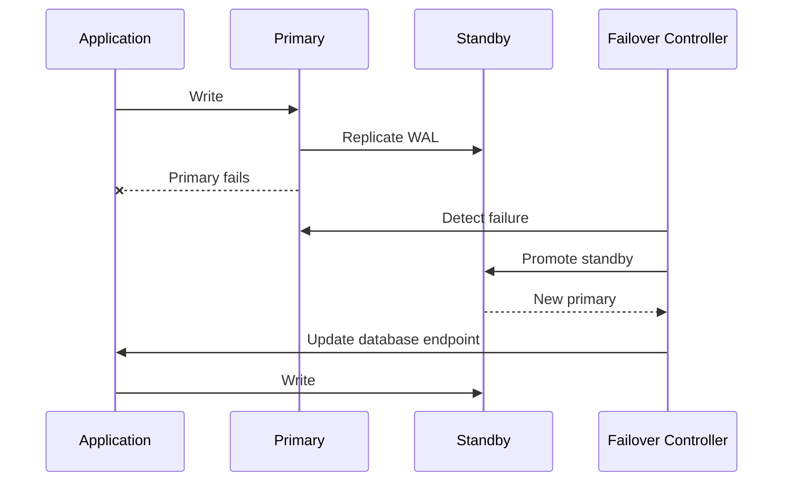
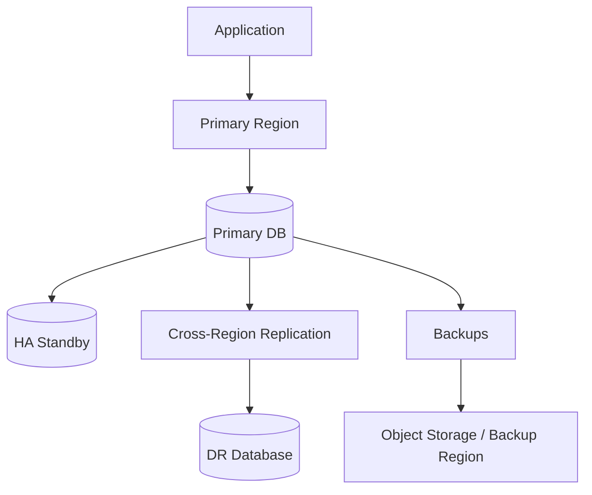

# 22- High Availability Database Architecture

## Overview

High Availability (HA) database architecture is designed to keep database-backed applications operational when database components fail.

A production database can fail because of:

- Hardware failure
- Storage failure
- Network failure
- Database process failure
- Host failure
- Availability-zone failure
- Software defects
- Configuration mistakes
- Resource exhaustion
- Operational errors

HA does not mean "the database never fails." It means the architecture is designed so that failure of a component does not unnecessarily become application downtime.

A typical PostgreSQL HA architecture looks like:

```text
                    Application
                         │
                         ▼
                Database Endpoint
                         │
                         ▼
                    ┌────────┐
                    │ Primary│
                    └────┬───┘
                         │
                  WAL Replication
                         │
             ┌───────────┴───────────┐
             ▼                       ▼
        ┌──────────┐            ┌──────────┐
        │ Standby  │            │ Standby  │
        └──────────┘            └──────────┘
```

The architecture must answer more than "what happens if PostgreSQL crashes?"

It must define:

- How failures are detected
- How a new primary is selected
- How clients discover the new primary
- How writes are protected
- What happens to in-flight transactions
- How replication lag is handled
- How split-brain is prevented
- How recovery is validated
- How backups complement HA
- What RPO and RTO are achievable

---

## High Availability vs Disaster Recovery

HA and Disaster Recovery (DR) solve different problems.

| Property | High Availability | Disaster Recovery |
|---|---|---|
| Primary goal | Minimize service interruption | Recover from major failures |
| Typical failure | Host/database failure | Region/site/data-loss event |
| Recovery location | Usually same region | Often another region |
| Recovery time | Seconds to minutes | Minutes to hours |
| Replication | Common | Common |
| Backups | Required | Required |
| RPO | Low | Depends on design |
| RTO | Low | Depends on design |

A system can have HA without strong regional DR.

For example:

```text
Region A
 ├── Primary
 └── Standby
```

provides protection against instance failure but may not protect against a complete regional outage.

A stronger architecture can use:

```text
Region A
 ├── Primary
 └── Standby

       │

       ▼

Region B
 └── DR Replica / Backup
```

---

## Availability Model

HA is fundamentally about removing single points of failure.

A simple architecture:

```text
Application
     │
     ▼
Database
```

has one database failure domain.

A more resilient architecture:

```text
              Application
                   │
                   ▼
             DB Endpoint
                   │
              ┌────┴────┐
              ▼         ▼
           Primary   Standby
```

The application should not need to know the physical identity of the current primary.

Instead, it should connect through a stable database endpoint or service-discovery mechanism.

---

## Failure Domains

A production HA design should consider multiple failure domains.

```text
Region
 ├── Availability Zone A
 │    ├── DB Primary
 │    └── Network
 │
 └── Availability Zone B
      ├── DB Standby
      └── Network
```

The standby should not share the same failure domain as the primary when the goal is infrastructure-level resilience.

For AWS deployments, this commonly means distributing database instances across Availability Zones.

---

## Replication

Replication maintains another copy of database state.

For PostgreSQL, physical streaming replication uses WAL.

```text
Application
    │
    ▼
Primary PostgreSQL
    │
    │ WAL
    ▼
Standby PostgreSQL
```

The primary generates WAL records as transactions modify the database.

The standby receives and replays those WAL records.

Replication can be:

- Synchronous
- Asynchronous

The choice affects durability, latency, and failover behavior.

---

## Synchronous Replication

With synchronous replication, a transaction can be required to wait for confirmation from a synchronous standby before being considered committed.

Conceptually:

```text
Application
    │
    ▼
Primary
    │
    │ WAL
    ▼
Synchronous Standby
    │
    │ ACK
    ▼
Primary
    │
    ▼
Application
```

Advantages:

- Lower potential data loss
- Stronger durability guarantees

Limitations:

- Higher write latency
- Network dependency
- Reduced availability if required synchronous standbys are unavailable

Synchronous replication should therefore be used when the business requires its stronger durability semantics and can tolerate the latency/availability trade-off.

---

## Asynchronous Replication

With asynchronous replication:

```text
Primary
   │
   │ WAL
   ▼
Standby
```

The primary does not necessarily wait for the standby to replay the transaction before acknowledging the client.

Advantages:

- Lower write latency
- Better availability
- Greater geographic flexibility

Limitation:

If the primary fails before WAL has reached or been safely replayed by the standby, some recently committed transactions may not exist on the promoted standby.

This is replication lag.

---

## RPO and RTO

Two important HA/DR metrics are:

### Recovery Point Objective

**RPO** defines how much data loss is acceptable.

```text
RPO = 0
```

means the system aims for no data loss within the defined failure model.

An asynchronous replica may have:

```text
RPO > 0
```

because some recently committed data can be missing after failover.

### Recovery Time Objective

**RTO** defines how quickly the service must recover.

```text
RTO = 30 seconds
```

means the architecture must be capable of restoring service within approximately that target under the defined failure scenario.

RPO and RTO should be measurable requirements, not vague claims such as "highly available."

---

## Failover

Failover moves database write responsibility from a failed primary to a standby.



A successful failover requires more than promoting a replica.

The system also needs:

- Failure detection
- Promotion
- Old-primary fencing
- Endpoint redirection
- Connection recovery
- Application retry behavior
- Validation

---

## Automatic vs Manual Failover

| Approach | Advantages | Limitations |
|---|---|---|
| Automatic | Fast recovery | Risk of incorrect failure decisions |
| Manual | More operator control | Slower recovery |
| Semi-automatic | Balances control and speed | More operational complexity |

Automatic failover is useful when downtime requirements are strict, but it must be designed carefully to avoid promoting an incorrect node.

---

## Failure Detection

The failover system may monitor:

- Database health
- TCP connectivity
- Replication status
- WAL progress
- Query responsiveness
- Host health
- Storage health
- Network reachability

A database process being unreachable does not always mean the entire primary is dead.

For example:

```text
Application → Primary
                X
             Network failure

Primary → Standby
          healthy
```

The primary may still be running.

This is why failure detection and fencing are critical.

---

## Split Brain

Split brain occurs when multiple database nodes believe they are authoritative primaries.

```text
             Network Partition
              /            \
             ▼              ▼
        Primary A       Primary B
          accepts         accepts
          writes          writes
```

Now the system can produce divergent writes.

Split brain is one of the most dangerous HA failure modes.

Prevent it through:

- Quorum-based decision making
- Fencing
- Leader election
- External coordination
- Controlled promotion
- Reliable endpoint management

Never allow two nodes to independently accept writes simply because they cannot see each other.

---

## Fencing

Fencing prevents an old primary from continuing to serve writes after failover.

Conceptually:

```text
Old Primary
     │
     ▼
Fenced / Isolated
     X
     
New Primary
     │
     ▼
Accepts writes
```

Possible mechanisms include:

- Cloud instance termination
- Network isolation
- Power fencing
- Storage fencing
- Database-level safeguards
- Orchestrator-controlled demotion

The exact mechanism depends on the infrastructure.

Fencing is especially important in automatic failover systems.

---

## Quorum

Distributed HA systems often use quorum to make decisions.

For example:

```text
Node A
Node B
Node C
```

A majority requires:

```text
2 of 3
```

This reduces the risk of independent groups both deciding they are authoritative.

Quorum concepts are common in HA orchestration systems even when the database itself is not implementing consensus directly.

---

## Connection Handling During Failover

Existing database connections to the failed primary usually cannot continue normally.

A typical sequence is:

```text
Application
    │
    ▼
Connection Pool
    │
    X
Failed Primary
```

After failover:

```text
Application
    │
    ▼
Connection Pool
    │
    ▼
New Primary
```

The pool must discard broken connections and establish new ones.

Application code should therefore expect transient connection failures during failover.

---

## Connection Pooling and HA

Connection pooling can complicate failover.

A pool may contain connections established before promotion:

```text
Pool
├── Connection → old primary
├── Connection → old primary
└── Connection → old primary
```

After failover, these connections may be invalid.

Production systems should use:

- Connection health checks
- Appropriate connection timeouts
- Pool recycling
- Broken-connection detection
- Retry policies

Do not blindly retry every failed database operation.

---

## Transaction Behavior During Failover

Suppose:

```text
BEGIN
UPDATE ...
COMMIT
```

The connection fails immediately after the client sends `COMMIT`.

The application may not know whether the transaction committed.

```text
Application
     │
     │ COMMIT
     ▼
Primary
     │
     X
Connection lost
```

This is an **uncertain commit outcome**.

The application must not blindly execute the business operation again if doing so could create duplicates.

Use:

- Idempotency keys
- Unique constraints
- Reconciliation
- Business-level request IDs

---

## Idempotency

For retryable operations, create an idempotency constraint.

For example:

```sql
CREATE TABLE payments (
    id UUID PRIMARY KEY,
    idempotency_key TEXT NOT NULL UNIQUE,
    amount NUMERIC(12, 2) NOT NULL,
    created_at TIMESTAMPTZ NOT NULL DEFAULT now()
);
```

If a failover causes a client retry:

```text
Request 1
→ transaction may have committed

Request 2
→ same idempotency key
```

The database can prevent duplicate business operations.

---

## Read Replicas and HA Standbys

A standby can potentially serve read traffic depending on the PostgreSQL architecture and operational requirements.

However:

```text
Read scaling
≠
High availability
```

A replica can provide both benefits, but the architectural requirements are different.

HA asks:

> Can another node take over when the primary fails?

Read scaling asks:

> Can additional nodes serve read traffic?

Do not assume every read replica is configured or safe for automatic promotion.

---

## Primary Endpoint

Applications should preferably use a stable logical endpoint:

```text
db-primary.internal
```

rather than hard-coding:

```text
10.0.1.25
```

During failover:

```text
db-primary.internal
        ↓
New primary
```

This minimizes application changes.

Cloud-managed database services commonly provide equivalent abstractions through managed endpoints.

---

## Database Routing

For systems with separate read and write paths:

```text
Write
  ↓
Primary endpoint

Read
  ↓
Replica endpoint
```

After failover:

```text
Primary endpoint
  ↓
New primary
```

The application should not have to manually update database IP addresses.

---

## Read-After-Write Consistency

Consider:

```text
POST /orders
   ↓
Primary
   ↓
201 Created

GET /orders/123
   ↓
Replica
   ↓
Replica is behind
   ↓
404 / stale response
```

This is replication lag, not necessarily an application bug.

For operations requiring immediate visibility, route reads appropriately.

Possible strategies include:

- Read from primary
- LSN-aware routing
- Sticky reads
- Session consistency
- Delay-sensitive routing

---

## Replication Lag

Monitor replication lag continuously.

```text
Primary WAL position
        │
        │ Δ
        ▼
Standby replay position
```

Lag can increase because of:

- Network problems
- Heavy write workload
- Slow storage
- Long-running queries
- Replica resource exhaustion
- WAL generation spikes

A standby with significant lag may not be a safe failover target for workloads with strict RPO requirements.

---

## Long-Running Queries on Standbys

Read-only replicas can have conflicts with WAL replay.

For example:

```text
Replica query
    │
    ├── Holds snapshot
    │
    ▼
WAL replay needs cleanup
```

The replica may delay replay or terminate conflicting queries depending on configuration and workload.

This can create a trade-off between:

- Query stability
- Replication freshness

Long-running analytical queries should generally be isolated from critical HA replicas.

---

## Synchronous Standby Selection

PostgreSQL can be configured with synchronous replication requirements.

Conceptually:

```text
Primary
  │
  ├── Sync standby
  └── Async standby
```

The synchronous standby should be selected based on:

- Availability
- Network latency
- Failure-domain separation
- Durability requirements

Using a remote synchronous standby can significantly increase write latency.

---

## Local vs Cross-Region Replication

### Same Availability Zone

```text
Primary ── Standby
```

Low latency, but weaker protection against AZ failure.

### Cross-AZ

```text
AZ-A
Primary
   │
   ▼
AZ-B
Standby
```

Better infrastructure failure isolation.

### Cross-Region

```text
Region A
Primary
   │
   ▼
Region B
Standby
```

Strong DR characteristics but higher latency and operational complexity.

---

## AWS Architecture

A managed AWS design might use:

```text
                     Application
                          │
                          ▼
                 Managed DB Endpoint
                          │
                    ┌─────┴─────┐
                    ▼           ▼
                Primary      Standby
                 AZ-A         AZ-B
                    │
                    ▼
              Backups / DR
                    │
                    ▼
                Region B
```

Managed database services can automate portions of:

- Failover
- Replication
- Backups
- Monitoring
- Endpoint management

However, application-level correctness still remains the responsibility of the application.

---

## Kubernetes Considerations

Running PostgreSQL inside Kubernetes requires careful handling of:

- Persistent volumes
- Pod scheduling
- Node failures
- Storage availability
- Pod disruption
- Network identity
- Leader election
- Backups
- Replication
- Fencing

A simplistic StatefulSet:

```text
PostgreSQL Pod
     ↓
Persistent Volume
```

does not automatically provide production-grade database HA.

A Kubernetes database architecture generally needs a database-aware operator or equivalent operational automation when self-managing PostgreSQL.

---

## Self-Managed PostgreSQL HA

A self-managed architecture might contain:

```text
PostgreSQL Primary
       │
       ├── PostgreSQL Standby
       │
       └── PostgreSQL Standby

HA Controller
       │
       ▼
Leader / Primary State
```

Common responsibilities of an HA controller include:

- Health checks
- Leader detection
- Promotion
- Fencing coordination
- Replication management
- Service discovery

Database HA should not depend solely on Kubernetes restarting a failed PostgreSQL process.

---

## Automated Failover Controller

An HA controller should answer:

```text
Is primary healthy?
        │
        ├── Yes → Continue
        │
        └── No
             ↓
       Is failure confirmed?
             ↓
       Fence old primary
             ↓
       Select suitable standby
             ↓
       Promote standby
             ↓
       Update endpoint
             ↓
       Validate writes
```

Promotion should consider replica freshness rather than simply choosing the first available standby.

---

## Failover Candidate Selection

A candidate standby should be evaluated using:

- Replication freshness
- WAL availability
- Health
- Storage state
- Network reachability
- Configuration
- Region/AZ placement

Example:

```text
Standby A → 1 MB lag
Standby B → 5 GB lag
Standby C → unhealthy
```

Standby A is generally the preferable promotion candidate, assuming other requirements are satisfied.

---

## Backups Are Still Required

Replication is not a backup.

Replication can propagate:

```text
Accidental DELETE
      ↓
Primary
      ↓
Replica
      ↓
Accidental DELETE
```

The replica faithfully reproduces the mistake.

Backups provide a recovery point independent from the live replicated state.

A robust architecture therefore uses:

```text
HA Replication
+
Point-in-Time Recovery
+
Backup Retention
```

---

## Point-in-Time Recovery

PITR allows recovery to a selected point in time when sufficient base backups and WAL are retained.

Conceptually:

```text
Base Backup
    +
WAL
    +
Target Timestamp
    ↓
Recovered Database
```

This is particularly important for:

- Accidental deletes
- Application bugs
- Corrupted data
- Operational mistakes

HA minimizes downtime; PITR provides a recovery mechanism for data-level incidents.

---

## Backup Validation

A backup is not a recovery strategy until restoration has been tested.

Production procedures should periodically verify:

- Backup availability
- Backup integrity
- Restore duration
- WAL availability
- Application compatibility
- Credentials
- Network access
- Recovery procedures

Measure actual restore time rather than assuming it meets the RTO.

---

## Disaster Recovery Architecture

A stronger DR design may use:



The DR strategy should define whether recovery is:

- Pilot light
- Warm standby
- Active-passive
- Active-active

For relational databases, active-active write architectures are substantially more complex than standard primary/standby designs.

---

## Active-Passive vs Active-Active

| Architecture | Writes | Complexity | Typical Use |
|---|---|---:|---|
| Active-passive | One primary | Lower | Most PostgreSQL HA |
| Active-active | Multiple writers | Very high | Specialized distributed systems |
| Read-active/write-passive | One writer, many readers | Medium | Read-heavy systems |

PostgreSQL primary/standby architectures are naturally suited to active-passive HA.

Do not introduce multi-writer database designs unless the business and technical requirements justify the additional consistency complexity.

---

## Application-Level Retry Strategy

Transient failures during failover are expected.

A retry policy should distinguish:

### Usually Retryable

- Connection establishment failure
- Connection reset
- Temporary unavailable endpoint
- Certain serialization failures
- Certain deadlock failures

### Potentially Dangerous to Retry Blindly

- Unknown commit result
- Non-idempotent writes
- External side effects
- Partial distributed workflows

Use:

```text
Bounded retries
+
Exponential backoff
+
Jitter
+
Idempotency
```

Avoid infinite retries.

---

## Retry Storms

Suppose 1,000 application requests fail simultaneously during failover.

If every request retries immediately:

```text
1,000 failures
     ↓
1,000 immediate retries
     ↓
New primary overloaded
     ↓
More failures
     ↓
More retries
```

This creates a retry storm.

Use exponential backoff and jitter:

```text
Failure
  ↓
Small delay
  ↓
Retry
  ↓
Longer delay
  ↓
Retry
```

Connection pools and request concurrency limits should also provide backpressure.

---

## Timeouts

HA depends heavily on correctly configured timeouts.

Relevant timeout categories include:

| Timeout | Purpose |
|---|---|
| Connection timeout | Limit connection establishment |
| Statement timeout | Limit query execution |
| Lock timeout | Limit lock waiting |
| Pool timeout | Limit waiting for a connection |
| HTTP timeout | Limit API request duration |
| Failover detection timeout | Detect unhealthy primary |

Timeouts should reflect actual workload requirements.

Extremely aggressive failure detection can cause false failovers.

---

## Monitoring

HA requires monitoring of both database health and failover health.

### PostgreSQL

Monitor:

- Replication lag
- WAL generation
- WAL retention
- Connections
- CPU
- Memory
- Storage
- IOPS
- Locks
- Deadlocks
- Query latency
- Checkpoints
- Long-running transactions

### HA System

Monitor:

- Current primary
- Standby health
- Promotion events
- Failover count
- Failover duration
- Fencing events
- Endpoint changes
- Replication state

### Application

Monitor:

- Database connection failures
- Request errors
- Retry counts
- Retry latency
- p95/p99 latency
- Connection-pool exhaustion

---

## Failover Observability

A useful incident timeline is:

```text
12:00:00 Primary becomes unhealthy
12:00:05 Failure detected
12:00:07 Primary fenced
12:00:09 Standby promoted
12:00:11 Endpoint updated
12:00:14 Application reconnects
12:00:20 Traffic normal
```

This allows engineers to calculate actual failover duration.

Track:

```text
MTTD
Mean Time To Detect

MTTR
Mean Time To Recover
```

against the RTO requirement.

---

## Health Checks

Health checks should test meaningful functionality.

A basic TCP check:

```text
Port 5432 reachable
```

does not prove the database is healthy enough to serve production traffic.

A stronger check may validate:

```text
Connection
    ↓
Authentication
    ↓
Simple query
    ↓
Expected database role
    ↓
Replication state
```

Health checks should also distinguish:

```text
Healthy primary
Healthy standby
Unhealthy primary
Lagging standby
Recovering standby
```

---

## Readiness During Promotion

A promoted database should not immediately receive production traffic simply because PostgreSQL started accepting connections.

Validation may include:

- Correct database role
- Expected schema version
- Required extensions
- Recovery completion
- Replication state
- Application connectivity

Only then should the endpoint be considered ready.

---

## Schema Compatibility

During rolling application deployments, the database may serve requests from:

```text
Old application version
New application version
```

HA failover should not introduce schema incompatibility.

Use expand-and-contract migrations:

```text
Expand
  ↓
Deploy compatible application
  ↓
Backfill
  ↓
Switch reads/writes
  ↓
Contract
```

This also makes failover safer during deployments.

---

## Deployment and HA

A deployment should avoid simultaneously risking:

```text
Application rollout
+
Database migration
+
Failover event
```

Use controlled sequencing.

For example:

```text
Deploy compatible schema
      ↓
Deploy application
      ↓
Verify
      ↓
Perform cleanup migration
```

Avoid destructive schema changes that old application instances cannot tolerate.

---

## Maintenance and Planned Failover

HA should support planned failover as well as emergency failover.

Planned failover can be used for:

- Database upgrades
- Host maintenance
- AZ maintenance
- Infrastructure migration
- Capacity changes

A planned procedure is usually safer because the primary is still available and replication state can be verified before promotion.

---

## HA Testing

HA must be tested through failure injection.

Test scenarios include:

- Kill database process
- Terminate primary instance
- Break network connectivity
- Introduce replication lag
- Fill storage
- Exhaust connections
- Fail an availability zone
- Simulate application reconnect storms

The goal is to verify actual behavior rather than trust configuration.

---

## Game Days

A database HA game day can follow:

```text
Prepare
  ↓
Define expected behavior
  ↓
Inject failure
  ↓
Observe detection
  ↓
Observe promotion
  ↓
Verify application recovery
  ↓
Measure RTO/RPO
  ↓
Document gaps
```

Failure testing should happen in environments where the impact is controlled.

Production failure drills should be carefully scoped and approved.

---

## Security

HA infrastructure increases the number of database components and communication paths.

Protect:

- Replication connections
- Database endpoints
- HA controller
- Management interfaces
- Backup storage
- Credentials
- Monitoring systems

Use:

- TLS
- Private networking
- IAM/least privilege
- Secret management
- Encryption at rest
- Encryption in transit
- Audit logging

The failover controller itself is a privileged component and should have tightly scoped permissions.

---

## Security During Failover

Failover must preserve security controls.

The promoted standby should have:

- Correct authentication configuration
- Correct authorization roles
- Correct network policy
- Correct encryption settings
- Correct audit configuration

A database should never become less secure simply because it became the new primary.

---

## Cost Considerations

HA generally costs more than a single database.

Costs may include:

```text
Primary database
+
Standby database
+
Additional storage
+
Cross-AZ network traffic
+
Backups
+
Monitoring
+
DR infrastructure
```

The correct number of replicas should be based on:

- RPO
- RTO
- Read workload
- Failure-domain requirements
- Recovery requirements

Do not deploy unnecessary replicas simply because more replicas appear more resilient.

---

## Common Mistakes

### Treating Replication as Backup

Replication reproduces data changes, including destructive changes.

**Better:** maintain independent backups and PITR.

### Using the Same Failure Domain

Primary and standby on the same host or AZ can fail together.

**Better:** separate critical HA components across failure domains.

### Ignoring Replication Lag

A lagging standby may not contain the latest committed data.

**Better:** monitor lag and include freshness in failover decisions.

### No Fencing

Promoting a standby without preventing the old primary from writing can create split brain.

**Better:** implement reliable fencing.

### Hard-Coding Database IP Addresses

Failover becomes an application deployment problem.

**Better:** use stable endpoints or service discovery.

### Blindly Retrying Writes

A connection failure does not prove the transaction failed.

**Better:** use idempotency and reconciliation for uncertain outcomes.

### Immediate Retries

Large-scale retries can overload the newly promoted primary.

**Better:** use bounded exponential backoff with jitter.

### Overly Aggressive Health Checks

Temporary network latency can trigger unnecessary failovers.

**Better:** use multiple signals and carefully tuned detection thresholds.

### Assuming Kubernetes Provides Database HA

Restarting a PostgreSQL pod does not solve replication, promotion, fencing, or data consistency.

**Better:** use database-aware HA automation.

### Running Heavy Analytics on HA Replicas

Long-running queries can interfere with replication freshness.

**Better:** isolate analytical workloads into appropriate systems.

### Never Testing Failover

Untested HA often fails during the exact incident it was designed to handle.

**Better:** run controlled failure tests and measure actual RTO/RPO.

### Ignoring Connection Pools

Pools may retain connections to the old primary.

**Better:** configure connection health checks and make applications resilient to reconnect events.

---

## Production HA Checklist

### Architecture

- [ ] Primary and standby use separate failure domains.
- [ ] Database endpoint is independent of the physical primary.
- [ ] Failover mechanism is explicitly defined.
- [ ] Split-brain prevention is implemented.
- [ ] Fencing behavior is understood and tested.
- [ ] Replication mode matches durability requirements.

### Data Protection

- [ ] Replication lag is monitored.
- [ ] Backups are independent from replicas.
- [ ] PITR is configured where required.
- [ ] Restore procedures are tested.
- [ ] RPO is measurable.
- [ ] RTO is measurable.

### Application

- [ ] Connection pools recover after failover.
- [ ] Transient connection failures are handled.
- [ ] Retry policies are bounded.
- [ ] Exponential backoff and jitter are used where appropriate.
- [ ] Non-idempotent operations are protected.
- [ ] Uncertain commit outcomes are handled.

### Operations

- [ ] Failover events are observable.
- [ ] Promotion is audited.
- [ ] Replication health is monitored.
- [ ] Schema migrations are HA-safe.
- [ ] Planned failover procedures exist.
- [ ] Failure drills are performed periodically.

---

## Interview Traps

### What does high availability mean for a database?

HA means designing the database system so that failures of individual components do not unnecessarily cause prolonged service interruption.

### Is replication the same as HA?

No. Replication provides another copy of database state. HA additionally requires failure detection, promotion, client redirection, split-brain prevention, recovery behavior, and operational procedures.

### What is the difference between synchronous and asynchronous replication?

Synchronous replication can require commit acknowledgment from a synchronous standby, improving durability but potentially increasing write latency and reducing availability. Asynchronous replication usually provides lower latency but can lose recently committed data during failover if the standby has not received or replayed it.

### What is RPO?

Recovery Point Objective defines the amount of data loss the system can tolerate under a specified failure scenario.

### What is RTO?

Recovery Time Objective defines how quickly service must be restored after a failure.

### Why isn't a read replica automatically a good failover target?

It may be lagging, may not have the correct configuration, may not be healthy, or may not be configured for promotion. Failover selection must consider freshness and operational state.

### What is split brain?

Split brain occurs when multiple nodes believe they are authoritative primaries and accept writes independently, potentially producing divergent database state.

### How do you prevent split brain?

Use reliable failure detection, quorum/coordination where appropriate, fencing, controlled promotion, and stable endpoint management.

### What is fencing?

Fencing prevents the old primary from continuing to serve writes after another node has been promoted.

### Why are backups still required when using synchronous replication?

Replication protects availability and maintains another live copy, but it does not protect against logical mistakes such as accidental deletes or application bugs. Backups and PITR provide independent recovery points.

### What happens to existing connections after failover?

Connections to the failed primary may become invalid. Application connection pools must discard failed connections and establish connections to the new primary.

### Why can retries be dangerous?

A database connection failure does not necessarily mean a transaction failed. Retrying a non-idempotent operation can create duplicates if the original transaction actually committed.

### How does read-after-write consistency relate to HA?

After a write succeeds on the primary, a subsequent read routed to a lagging replica may not immediately observe that write. HA and replication therefore require explicit application-level consistency decisions.

### Does more replicas always mean better HA?

No. More replicas increase cost and operational complexity. They can improve redundancy and read capacity, but the architecture should match actual RPO, RTO, and workload requirements.

### How would you design PostgreSQL HA on AWS?

Use a managed PostgreSQL deployment with multi-AZ HA where appropriate, stable database endpoints, automated or controlled failover, backups/PITR, monitoring, application connection recovery, and a separate regional DR strategy when required. Validate actual RPO/RTO through testing.

### How would you design PostgreSQL HA on Kubernetes?

Use persistent storage and database-aware HA automation rather than relying only on StatefulSet restarts. The design must address replication, leader election, promotion, fencing, service discovery, backups, and failure testing.

### What happens if the primary fails during `COMMIT`?

The client may not know whether the commit succeeded. This is an uncertain commit outcome. The correct response is not to blindly retry a non-idempotent operation; use idempotency, unique constraints, reconciliation, or business-level confirmation.

### How do you test database HA?

Inject controlled failures such as terminating the primary, breaking connectivity, introducing replication lag, exhausting connections, or simulating infrastructure failure. Measure detection time, promotion time, application recovery time, and data loss against the defined RPO/RTO.

### What is the senior-level answer to "How would you build a highly available database?"

Start with explicit RPO/RTO and failure-domain requirements. Use replication appropriate to the durability requirement, separate primary and standby failure domains, provide reliable failure detection and fencing, expose a stable endpoint, make application connection pools and retries failover-aware, maintain independent backups/PITR, monitor replication and failover health, and continuously test the complete recovery path.

## Key Takeaways

- **High availability is a complete system design, not simply database replication**; failure detection, promotion, fencing, endpoint management, connection recovery, and application behavior are equally important.
- **RPO and RTO determine the appropriate HA architecture** and expose the trade-offs between synchronous replication, asynchronous replication, latency, availability, and cost.
- **Replication does not replace backups**; independent backups and PITR are required to recover from logical mistakes, corruption, and other data-level incidents.
- **Split brain and uncertain commit outcomes are critical failure modes** that require fencing, controlled promotion, idempotency, reconciliation, and bounded retry strategies.
- **HA must be continuously tested and measured** through controlled failovers, monitoring, restore exercises, and failure drills rather than being treated as a configuration that can simply be assumed to work.