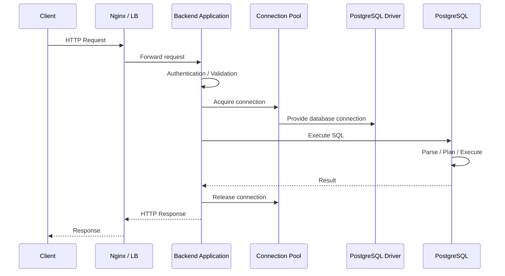
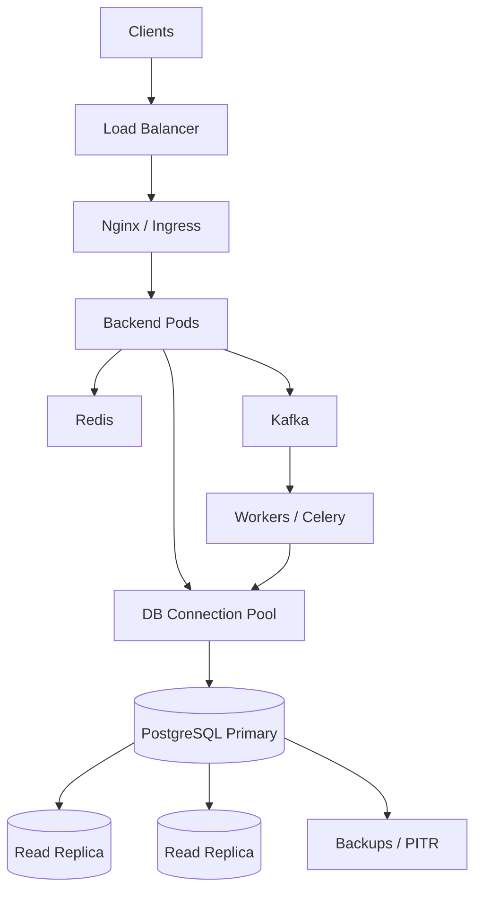

# 23- Backend Application to Database Architecture

## Overview

Backend applications rarely communicate with a database through a single direct function call. A production request passes through multiple layers responsible for networking, connection management, transactions, query generation, database execution, and result handling.

A typical architecture is:

```text
Client
  │
  ▼
Nginx / Load Balancer
  │
  ▼
Backend Application
  │
  ├── API / Service Layer
  │
  ├── ORM / Query Builder
  │
  ├── Connection Pool
  │
  ▼
Database Driver
  │
  ▼
PostgreSQL
  │
  ├── Parser
  ├── Planner / Optimizer
  ├── Executor
  ├── Buffer / Storage
  └── WAL / Replication
```

Understanding this architecture is important because many database performance and reliability problems originate outside the SQL statement itself.

For example:

- A fast query can still produce a slow API if the application waits for a connection.
- An indexed query can still be slow because of poor cardinality estimates.
- A healthy database can become unavailable because applications exhaust its connection limit.
- A correctly configured replica can still produce stale API responses because of replication lag.
- A transaction can be logically incorrect even when every individual SQL statement succeeds.

Senior backend engineers therefore need to understand the complete **application → database lifecycle**, not just SQL syntax.

---

## End-to-End Request Lifecycle

A typical REST request might follow this path:



Each stage contributes to latency.

A useful mental model is:

```text
Total API latency
    =
Network latency
+
Application processing
+
Connection acquisition
+
Database execution
+
Result transfer
+
Serialization
```

This distinction is critical during production troubleshooting.

---

## Application and Database Responsibilities

The application and database should each own responsibilities appropriate to their strengths.

| Responsibility | Backend Application | Database |
|---|---|---|
| HTTP handling | Yes | No |
| Authentication | Yes | Partially |
| Business workflow | Yes | Partially |
| Input validation | Yes | Limited |
| Query generation | Yes | No |
| Query optimization | No | Yes |
| Data integrity | Partially | Yes |
| Transactions | Controls boundary | Enforces semantics |
| Constraints | Uses | Enforces |
| Persistence | Requests | Owns |
| Index execution | No | Yes |
| Replication | Usually coordinates | Executes |
| Connection management | Yes | Limits/accepts |
| Caching | Often | Limited |

The application should not assume that database constraints can be replaced with application validation.

For example:

```python
if not User.objects.filter(email=email).exists():
    User.objects.create(email=email)
```

is vulnerable to a race condition if `email` must be unique.

The database should enforce the invariant:

```sql
CREATE UNIQUE INDEX users_email_unique
ON users (email);
```

Application validation improves user experience; database constraints protect correctness.

---

## Database Driver

The application normally communicates with PostgreSQL through a database driver.

Examples include:

- `psycopg`
- `asyncpg`
- SQLAlchemy-compatible drivers
- Django database backends

The driver is responsible for translating application-level database operations into the PostgreSQL wire protocol.

Conceptually:

```text
Python Application
       │
       ▼
ORM / Query Builder
       │
       ▼
Database Driver
       │
       ▼
PostgreSQL Protocol
       │
       ▼
PostgreSQL Server
```

The driver handles concerns such as:

- Connection establishment
- Authentication protocol
- Parameter binding
- Query execution
- Result decoding
- Transactions
- Error handling
- Connection closure

---

## ORM Architecture

Frameworks such as Django often introduce an ORM between application code and the database.

```text
Business Logic
     │
     ▼
Django ORM
     │
     ▼
Generated SQL
     │
     ▼
psycopg
     │
     ▼
PostgreSQL
```

For example:

```python
orders = (
    Order.objects
    .filter(customer_id=customer_id, status="pending")
    .select_related("customer")
)
```

The ORM eventually generates SQL.

The database does not know that the query originated from Django.

It receives SQL and processes it through the normal PostgreSQL query pipeline.

---

## ORM Is Not a Database Abstraction Boundary

An ORM abstracts SQL syntax, but it does not eliminate database behavior.

The following still matter:

- Indexes
- Joins
- Query plans
- Transactions
- Locking
- Isolation
- Constraints
- Cardinality
- Connection limits
- Replication
- Query latency

A senior Django engineer should therefore be comfortable inspecting generated SQL.

For example:

```python
query = (
    Order.objects
    .filter(customer_id=customer_id)
    .select_related("customer")
)

print(query.query)
```

For production systems, SQL should also be investigated through database observability tools rather than relying only on ORM output.

---

## Query Execution Boundary

The application eventually sends SQL to PostgreSQL.

For example:

```sql
SELECT id, status, total
FROM orders
WHERE customer_id = $1
  AND status = $2;
```

PostgreSQL then performs:

```text
SQL
 │
 ▼
Parser
 │
 ▼
Analyzer / Rewriter
 │
 ▼
Planner / Optimizer
 │
 ▼
Executor
 │
 ▼
Storage / Buffer Cache
 │
 ▼
Result
```

The application should not assume that SQL execution is equivalent to reading a row from memory.

The database may perform:

- Sequential scans
- Index scans
- Bitmap scans
- Nested-loop joins
- Hash joins
- Merge joins
- Sorting
- Aggregation
- Parallel execution
- Disk I/O

---

## Connection Lifecycle

A database connection typically progresses through:

```text
Create
  ↓
Authenticate
  ↓
Idle
  ↓
Acquire
  ↓
Execute
  ↓
Transaction
  ↓
Commit / Rollback
  ↓
Return to Pool
  ↓
Idle
  ↓
Reuse
```

A production application should avoid opening a new database connection for every SQL statement.

Connection establishment involves network communication and authentication overhead.

Instead, connection pooling allows multiple requests to reuse established connections.

---

## Connection Pooling

A connection pool maintains a controlled number of database connections.

```text
Application Workers
 ├── Request A ──┐
 ├── Request B ──┤
 ├── Request C ──┼──> Connection Pool
 └── Request D ──┘          │
                            ├── DB Connection 1
                            ├── DB Connection 2
                            ├── DB Connection 3
                            └── DB Connection 4
```

The basic lifecycle is:

```text
Request
  ↓
Acquire connection
  ↓
Execute database work
  ↓
Commit / rollback
  ↓
Release connection
```

The connection should be returned to the pool as soon as the database work is complete.

---

## Connection Pool Sizing

More connections do not necessarily mean more throughput.

Suppose:

```text
10 Kubernetes pods
×
20 database connections per pod
=
200 database connections
```

If PostgreSQL can efficiently serve only a fraction of those concurrently, the remaining connections may create:

- Memory pressure
- CPU contention
- Context switching
- Lock contention
- Queueing
- Higher tail latency

Pool size should therefore be based on workload and database capacity rather than application instance count alone.

---

## Connection Pool Exhaustion

A request may be waiting for a connection rather than waiting for SQL execution.

```text
Request
   │
   ▼
Connection Pool
   │
   ├── Connection 1 busy
   ├── Connection 2 busy
   ├── Connection 3 busy
   └── Connection 4 busy
          │
          ▼
      Request waits
```

This produces a subtle failure mode:

```text
API latency ↑
Database CPU = normal
Query latency = normal
Pool wait time = high
```

Always distinguish **database latency** from **connection acquisition latency**.

---

## Transaction Boundary

Transactions should correspond to a meaningful unit of business consistency.

For Django:

```python
from django.db import transaction

with transaction.atomic():
    order = Order.objects.create(
        customer_id=customer_id,
        status="pending",
    )

    OrderEvent.objects.create(
        order=order,
        event_type="created",
    )
```

The transaction ensures both writes commit or roll back together.

The transaction boundary should generally be:

```text
Begin
  ↓
Required database operations
  ↓
Commit
```

Avoid keeping a transaction open while performing unrelated work.

---

## Transactions and External Services

A database transaction cannot automatically roll back an external HTTP request.

For example:

```text
BEGIN
  ↓
UPDATE database
  ↓
Call payment service
  ↓
Payment service fails
  ↓
ROLLBACK
```

The database rollback does not undo a payment request that already reached another system.

For workflows spanning systems, consider:

- Transactional outbox
- Idempotency
- Saga/workflow patterns
- Compensation
- Reconciliation

---

## Transactional Outbox

A common architecture is:

```text
Application
    │
    ▼
Database Transaction
 ┌───────────────────────┐
 │ Update business data  │
 │ Insert outbox event   │
 └───────────────────────┘
    │
    ▼
Commit
    │
    ▼
Outbox Publisher
    │
    ▼
Kafka
```

Example:

```sql
BEGIN;

INSERT INTO orders (
    id,
    customer_id,
    status
)
VALUES (
    $1,
    $2,
    'created'
);

INSERT INTO outbox_events (
    id,
    event_type,
    aggregate_id,
    payload
)
VALUES (
    $3,
    'order.created',
    $1,
    $4
);

COMMIT;
```

Both records become durable together.

A background worker can then publish the outbox event to Kafka.

---

## Read and Write Paths

A production architecture may separate read and write traffic:

```text
                 Backend
                    │
          ┌─────────┴─────────┐
          ▼                   ▼
       Writes               Reads
          │                   │
          ▼                   ▼
       Primary             Replicas
```

This is useful for read-heavy systems.

However, replica reads introduce consistency considerations.

A successful write followed immediately by a replica read may return stale data because replication is asynchronous.

---

## Read-After-Write

Consider:

```text
POST /orders
      │
      ▼
Primary
      │
      ▼
201 Created

GET /orders/123
      │
      ▼
Replica
      │
      ▼
Replication lag
      │
      ▼
Old state
```

Possible solutions include:

- Read from primary after a write
- Sticky reads
- Session-level consistency
- LSN-aware routing
- Explicitly accepting eventual consistency

The correct choice depends on the business operation.

---

## Django Database Routing

Django can route different database operations to different database connections.

Conceptually:

```text
Django ORM
    │
    ├── Writes ──> Primary
    │
    └── Reads ───> Replica
```

A router can implement policies such as:

```python
class DatabaseRouter:
    def db_for_read(self, model, **hints):
        return "replica"

    def db_for_write(self, model, **hints):
        return "default"
```

A production implementation must also handle consistency-sensitive operations.

Blindly sending every read to a replica can create stale-read bugs.

---

## FastAPI and SQLAlchemy

A FastAPI application commonly uses SQLAlchemy with a PostgreSQL driver.

```python
from sqlalchemy import create_engine

engine = create_engine(
    "postgresql+psycopg://user:password@db:5432/app",
    pool_size=10,
    max_overflow=5,
    pool_timeout=10,
    pool_recycle=1800,
    pool_pre_ping=True,
)
```

The application should manage transaction scope explicitly.

For example:

```python
from sqlalchemy.orm import Session

def create_order(session: Session, customer_id: int) -> int:
    order = Order(
        customer_id=customer_id,
        status="pending",
    )

    session.add(order)
    session.commit()

    return order.id
```

In larger services, transaction boundaries should normally be owned by the service/use-case layer rather than scattered throughout low-level repository functions.

---

## Repository and Service Layers

A production backend may separate:

```text
HTTP Layer
    │
    ▼
Service Layer
    │
    ▼
Repository / Data Access Layer
    │
    ▼
ORM / SQL
    │
    ▼
Database
```

Responsibilities can be separated as:

| Layer | Responsibility |
|---|---|
| API | HTTP, authentication, validation |
| Service | Business workflow and transaction boundary |
| Repository | Persistence operations |
| ORM/SQL | Query representation |
| Database | Data integrity and execution |

This is not a mandatory architecture.

The important principle is to keep transaction and business consistency decisions at an appropriate level.

---

## N+1 Query Problem

A common ORM failure is N+1 querying.

Example:

```python
orders = Order.objects.all()

for order in orders:
    print(order.customer.name)
```

Potential query pattern:

```text
SELECT * FROM orders;

SELECT * FROM customers WHERE id = 1;
SELECT * FROM customers WHERE id = 2;
SELECT * FROM customers WHERE id = 3;
...
```

If 1,000 orders are returned, the application may issue approximately 1,001 queries.

Use appropriate ORM loading strategies.

For Django:

```python
orders = Order.objects.select_related("customer")
```

For collection relationships:

```python
orders = Order.objects.prefetch_related("items")
```

The correct strategy depends on relationship cardinality and query shape.

---

## Query Count vs Query Latency

Reducing query count is useful but not sufficient.

Compare:

```text
100 fast queries
```

with:

```text
1 extremely expensive query
```

The second may still be slower.

Database performance analysis should consider:

- Query count
- Query duration
- Rows returned
- Rows scanned
- Query plan
- Network transfer
- Connection wait
- Lock wait
- CPU
- I/O

---

## Parameterized Queries

Applications should use parameter binding rather than string concatenation.

Unsafe:

```python
query = f"SELECT * FROM users WHERE email = '{email}'"
```

Safe:

```python
cursor.execute(
    "SELECT id, email FROM users WHERE email = %s",
    (email,),
)
```

Parameterization provides:

- SQL injection protection
- Correct escaping
- Better query handling
- Clear separation between SQL and data

ORMs normally parameterize values automatically when used correctly.

---

## SQL Injection

Never construct SQL by concatenating untrusted input.

Dangerous:

```python
query = "SELECT * FROM users WHERE name = '" + name + "'"
```

Use:

- ORM query parameters
- Driver parameter binding
- Carefully validated dynamic identifiers
- Allow-lists for dynamic SQL fragments

Parameter binding does not make arbitrary SQL identifiers safe.

For example, table names and column names generally cannot be supplied as normal query parameters and must be handled using safe allow-listed construction.

---

## Dynamic Query Construction

Production APIs often have filters such as:

```text
GET /orders?status=pending&sort=created_at
```

Values should be parameterized.

Dynamic identifiers should be allow-listed.

Example:

```python
ALLOWED_SORT_FIELDS = {
    "created_at": Order.created_at,
    "total": Order.total,
}

sort_field = ALLOWED_SORT_FIELDS.get(sort)
if sort is None:
    raise ValueError("Unsupported sort field")
```

This prevents arbitrary SQL fragments from entering the query.

---

## Pagination

Offset pagination is simple:

```sql
SELECT id, created_at
FROM orders
ORDER BY created_at DESC
LIMIT 50 OFFSET 50000;
```

Large offsets can become increasingly expensive because the database may need to process and discard many preceding rows.

Keyset pagination is often better for large datasets:

```sql
SELECT id, created_at
FROM orders
WHERE created_at < $1
ORDER BY created_at DESC
LIMIT 50;
```

For deterministic ordering, use a unique tie-breaker:

```sql
ORDER BY created_at DESC, id DESC
```

Keyset pagination is particularly useful for high-volume APIs.

---

## Result Set Size

Returning too many rows can make the database appear slow when the real bottleneck is data transfer.

For example:

```text
Database
   │
   │ 2 million rows
   ▼
Driver
   │
   ▼
Python process
   │
   ▼
JSON serialization
   │
   ▼
HTTP response
```

Prefer:

- Pagination
- Projections
- Aggregation
- Streaming where appropriate
- Explicit API limits

Avoid:

```python
users = list(User.objects.all())
```

for unbounded production datasets.

---

## Selecting Only Required Columns

Avoid retrieving unnecessary data.

Instead of:

```sql
SELECT *
FROM orders;
```

prefer:

```sql
SELECT id, status, total
FROM orders;
```

Benefits include:

- Less I/O
- Less network traffic
- Less memory
- Less serialization work
- Potentially better index-only scan opportunities

---

## Database Constraints

Important invariants should be enforced by the database.

Examples:

```sql
ALTER TABLE orders
ADD CONSTRAINT orders_total_nonnegative
CHECK (total >= 0);
```

And:

```sql
ALTER TABLE orders
ADD CONSTRAINT orders_customer_fk
FOREIGN KEY (customer_id)
REFERENCES customers(id);
```

Common database constraints include:

- Primary keys
- Foreign keys
- Unique constraints
- Check constraints
- Not-null constraints

Application validation and database constraints should complement each other.

---

## Atomic Updates

Avoid read-modify-write patterns when the operation can be expressed atomically.

Risky:

```text
SELECT stock
UPDATE stock = stock - 1
```

Two concurrent requests can race.

Prefer:

```sql
UPDATE inventory
SET available = available - 1
WHERE product_id = $1
  AND available > 0;
```

Then verify the affected row count.

This lets PostgreSQL perform the concurrency-sensitive update atomically.

---

## Optimistic Concurrency

For frequently updated records, optimistic concurrency can use a version field.

Example:

```sql
UPDATE orders
SET status = $1,
    version = version + 1
WHERE id = $2
  AND version = $3;
```

If zero rows are updated, another transaction changed the record.

The application can then:

- Reload
- Return a conflict
- Retry where appropriate

This avoids holding database locks for long application workflows.

---

## Pessimistic Concurrency

When a transaction must protect a row from concurrent modification, PostgreSQL supports row-level locking.

Example:

```sql
SELECT id, available
FROM inventory
WHERE product_id = $1
FOR UPDATE;
```

In Django:

```python
inventory = (
    Inventory.objects
    .select_for_update()
    .get(product_id=product_id)
)
```

The lock is held until the transaction ends.

Keep the transaction short.

---

## Lock Contention

Consider:

```text
1,000 requests
      │
      ▼
Same inventory row
      │
      ▼
Lock contention
      │
      ▼
Increasing latency
```

A highly contended row can become a throughput bottleneck even when CPU and storage are healthy.

Possible solutions include:

- Atomic updates
- Optimistic concurrency
- Queueing
- Partitioning work
- Reducing critical-section size
- Redesigning hot records

---

## Redis and Database Interaction

Redis can reduce database load:

```text
Application
    │
    ▼
Redis Cache
    │
    ├── Hit ──> Response
    │
    └── Miss
          │
          ▼
       PostgreSQL
          │
          ▼
       Redis
```

However, Redis does not replace the database as the source of truth for most transactional data.

Common patterns include:

- Cache-aside
- Explicit invalidation
- Short TTLs
- Distributed coordination

Cache invalidation must be designed around correctness requirements.

---

## Cache-Aside

Typical cache-aside flow:

```text
Request
  ↓
Redis GET
  │
  ├── Hit → Return
  │
  └── Miss
       ↓
    PostgreSQL
       ↓
    Redis SET
       ↓
    Return
```

Potential problems include:

- Stale data
- Cache stampedes
- Invalidation races
- Memory pressure
- Serialization overhead

Do not cache data automatically simply because database reads are expensive.

---

## Kafka and Database Writes

Kafka can decouple high-volume ingestion from database writes.

```text
Producer
   │
   ▼
Kafka
   │
   ▼
Consumer
   │
   ▼
Batch / Transaction
   │
   ▼
PostgreSQL
```

Benefits include:

- Backpressure
- Buffering
- Asynchronous processing
- Batch writes
- Independent scaling

Consumers must be designed for:

- Idempotency
- Duplicate delivery
- Retry
- Dead-letter handling
- Ordering requirements

Kafka should not be treated as an automatic replacement for database transactions.

---

## Celery and Database Work

Celery is useful for work that does not need to block the API request.

For example:

```text
POST /reports
      │
      ▼
Create report job
      │
      ▼
Commit
      │
      ▼
Celery
      │
      ▼
Long-running database query
      │
      ▼
Store result
```

Avoid holding a database transaction while waiting for a background task.

A safer pattern is:

```text
Transaction
   ↓
Commit job state
   ↓
Enqueue / trigger work
   ↓
Worker processes task
```

Use a transactional outbox when reliable event publication is required.

---

## Microservices and Database Ownership

A common production architecture is:

```text
Order Service ──> Orders DB

Payment Service ──> Payments DB

Inventory Service ──> Inventory DB
```

This creates clear ownership boundaries.

A service should generally own the schema and persistence model of its data.

Avoid:

```text
Service A ──┐
Service B ──┼──> Shared tables
Service C ──┘
```

when independent service ownership is a core architectural requirement.

Cross-service consistency should normally be handled through APIs, events, workflows, or Saga-style coordination rather than direct cross-service table access.

---

## REST and gRPC Database Access

Both REST and gRPC services commonly use the same database architecture:

```text
REST / gRPC
     │
     ▼
Application Service
     │
     ▼
Connection Pool
     │
     ▼
PostgreSQL
```

The transport protocol does not eliminate database concerns.

A gRPC service can still suffer from:

- N+1 queries
- Connection exhaustion
- Lock contention
- Slow plans
- Large result sets
- Transaction mistakes

---

## Network Architecture

A production deployment may look like:

```text
Internet
   │
   ▼
Load Balancer
   │
   ▼
Nginx / Ingress
   │
   ▼
Kubernetes Service
   │
   ▼
Application Pods
   │
   ▼
Private Network
   │
   ▼
PostgreSQL
```

The database should generally not be publicly exposed.

Use private networking and restrict access to application workloads.

---

## Docker Considerations

Docker packages the application but does not remove database networking requirements.

For local development:

```text
Application Container
        │
        ▼
PostgreSQL Container
```

For production:

```text
Application Container
        │
        ▼
Managed / Dedicated PostgreSQL
```

Running a production database inside the same ephemeral application deployment environment introduces additional operational concerns around:

- Storage
- Backups
- HA
- Upgrades
- Scheduling
- Failure recovery

Managed database services are often preferred when operational requirements justify them.

---

## Kubernetes Connection Scaling

Kubernetes can multiply database connections unintentionally.

For example:

```text
Deployment
├── Pod 1 → 20 connections
├── Pod 2 → 20 connections
├── Pod 3 → 20 connections
├── Pod 4 → 20 connections
└── Pod 5 → 20 connections
```

Scaling from 5 to 50 pods changes:

```text
100 connections
→
1,000 connections
```

The database may become the bottleneck before application CPU becomes the bottleneck.

Always calculate:

```text
Maximum application instances
×
Connections per instance
```

and compare that with database capacity.

---

## PgBouncer

For PostgreSQL workloads with large numbers of application clients, PgBouncer can provide external connection pooling.

```text
Applications
    │
    ▼
PgBouncer
    │
    ▼
PostgreSQL
```

Common pooling modes include:

| Mode | Connection Lifetime | Typical Use |
|---|---|---|
| Session | Client session | Applications needing session state |
| Transaction | Transaction | High connection multiplexing |
| Statement | Statement | Highly restricted workloads |

Transaction pooling can substantially reduce the number of backend PostgreSQL connections, but applications must not depend on session state surviving across transactions.

Examples of problematic assumptions include:

- Session-local settings
- Temporary tables
- Session-level advisory locks
- Session-bound prepared statements depending on client/proxy behavior

Validate application compatibility before switching pooling modes.

---

## Database Connection Limits

PostgreSQL has a finite connection capacity.

A useful conceptual model is:

```text
DB connection budget
    │
    ├── Application traffic
    ├── Background workers
    ├── Admin connections
    ├── Monitoring
    └── Maintenance
```

Do not allocate the entire database connection budget to application pools.

Reserve capacity for operational access and critical workloads.

---

## Connection Leaks

A connection leak occurs when application code fails to release database resources.

Symptoms include:

- Growing active connections
- Pool exhaustion
- Requests waiting indefinitely
- Database connection-limit errors

Use framework-managed lifecycle handling and context managers where appropriate.

Example:

```python
with connection.cursor() as cursor:
    cursor.execute(
        "SELECT id FROM users WHERE email = %s",
        [email],
    )
```

---

## Transaction Leaks

An especially dangerous problem is leaving transactions open.

Long-running transactions can prevent PostgreSQL from reclaiming old row versions efficiently.

They can contribute to:

- Table/index bloat
- WAL retention
- Replica lag
- Lock retention
- Resource pressure

Monitor long-running transactions in production.

---

## Query Timeouts

Database queries should have appropriate timeout boundaries.

A request should not hold a connection indefinitely because a query has become stuck.

Use appropriate combinations of:

- Application request timeout
- Connection timeout
- Pool timeout
- `statement_timeout`
- `lock_timeout`

Timeouts should be designed together rather than configured independently.

---

## Observability

A useful database request trace should connect:

```text
HTTP request
   │
   ▼
Application trace
   │
   ├── Connection acquisition
   │
   ├── SQL query
   │
   ├── Lock wait
   │
   └── Serialization
   │
   ▼
PostgreSQL
```

Useful metrics include:

### Application

- Request latency
- Error rate
- Database query count
- Query duration
- Pool utilization
- Pool wait time
- Connection errors
- Retry count

### PostgreSQL

- Active connections
- Transactions
- Query latency
- Lock waits
- Deadlocks
- Cache hit ratio
- CPU
- Memory
- I/O
- WAL generation
- Replication lag

---

## PostgreSQL Query Investigation

For expensive queries, inspect the actual execution plan.

```sql
EXPLAIN (ANALYZE, BUFFERS)
SELECT id, status, total
FROM orders
WHERE customer_id = 42
  AND status = 'pending';
```

Compare:

```text
Estimated rows
vs
Actual rows
```

Large differences often indicate estimation or statistics problems.

Also inspect:

- Scan type
- Join strategy
- Buffer usage
- Sort operations
- Execution time
- Rows removed by filters

---

## Query Observability

Production systems should aggregate query behavior rather than relying only on application logs.

Useful information includes:

```text
Query fingerprint
Execution count
Total execution time
Mean execution time
p95 / p99 latency
Rows returned
```

PostgreSQL extensions and monitoring systems can provide query-level visibility.

This allows engineers to identify high-impact queries based on aggregate cost rather than investigating only the slowest individual request.

---

## Logging

Avoid logging sensitive SQL parameters indiscriminately.

Database logs and application logs may contain:

- Emails
- Tokens
- User IDs
- Payment information
- Business data

Logging should balance troubleshooting value with:

- Privacy
- Security
- Compliance
- Storage cost

Prefer query fingerprints and structured metadata where possible.

---

## Security Architecture

A production application-to-database path should enforce:

```text
Application
    │
    │ TLS
    ▼
Private Database Network
    │
    ▼
PostgreSQL
```

Use:

- TLS where required
- Private subnets
- Security groups / network policies
- Least-privilege database roles
- Secret management
- Credential rotation
- Encryption at rest
- Audit logging

Do not embed production database credentials directly in source code or container images.

---

## Database Roles

Avoid using a superuser from the application.

Instead:

```text
Application Role
 ├── SELECT
 ├── INSERT
 ├── UPDATE
 └── DELETE
```

Administrative operations should use separate privileged credentials.

Different services may also use separate database roles where isolation requirements justify it.

---

## Secrets Management

Production credentials should be stored in an appropriate secrets system.

Possible AWS-oriented architecture:

```text
Application
    │
    ▼
Secrets Manager
    │
    ▼
Database Credentials
    │
    ▼
Connection Pool
    │
    ▼
PostgreSQL
```

Do not expose credentials through:

- Git repositories
- Docker images
- Public configuration files
- Application logs
- Error responses

---

## High Availability

The application-to-database architecture must account for database failover.

```text
Application
     │
     ▼
Stable DB Endpoint
     │
     ▼
Current Primary
     │
     ├── WAL ──> Standby A
     └── WAL ──> Standby B
```

During failover:

```text
Old Primary
    X

Standby
    ↓
Promoted Primary
    ↓
Stable Endpoint
    ↓
Application reconnects
```

The application should tolerate transient connection failures during this transition.

---

## Read Replica Architecture

For read-heavy workloads:

```text
                    Application
                         │
               ┌─────────┴─────────┐
               ▼                   ▼
            Writes               Reads
               │                   │
               ▼                   ▼
            Primary          Read Replicas
                                 │
                         ┌───────┴───────┐
                         ▼               ▼
                      Replica A       Replica B
```

Replica routing should consider:

- Replication lag
- Read consistency
- Connection capacity
- Geographic locality
- Query workload

Do not send consistency-sensitive reads to replicas without understanding their freshness.

---

## Scaling the Application and Database Together

Scaling should be coordinated.

Example:

```text
Application scale-out
        │
        ▼
More concurrent requests
        │
        ▼
More DB connections
        │
        ▼
Higher DB CPU / I/O
        │
        ▼
Database becomes bottleneck
```

Possible responses include:

- Query optimization
- Better indexes
- Connection pool tuning
- Read replicas
- Redis caching
- Async processing
- Partitioning
- Vertical database scaling
- Sharding

Do not scale application pods indefinitely when PostgreSQL is already saturated.

---

## Backpressure

The database is often the final bottleneck in a backend system.

A resilient architecture controls load:

```text
Client
  ↓
API Rate Limit
  ↓
Application Concurrency
  ↓
Connection Pool
  ↓
Database
```

Background systems can add:

```text
Kafka / Celery
      ↓
Consumer Concurrency
      ↓
Database
```

Backpressure prevents upstream traffic from overwhelming the database.

---

## Cost Optimization

Database architecture affects infrastructure cost.

Potential cost drivers include:

- Oversized database instances
- Excessive replicas
- Large indexes
- Unbounded storage
- High cross-AZ traffic
- Excessive connection infrastructure
- Inefficient queries
- Unnecessary cache infrastructure

Optimize based on workload measurements.

A smaller, well-tuned database can outperform a larger database running inefficient queries.

---

## Disaster Recovery

The application layer must be compatible with database recovery.

After restoring a database:

```text
Restore DB
   ↓
Validate schema
   ↓
Validate application compatibility
   ↓
Validate credentials
   ↓
Validate migrations
   ↓
Enable traffic
```

Database recovery should be tested together with the application.

A successful database restore is not enough if the application cannot connect or expects a different schema.

---

## Deployment Strategy

Database changes should be compatible with application rollout.

A safer migration strategy is:

```text
Expand
  ↓
Deploy compatible application
  ↓
Backfill
  ↓
Switch application behavior
  ↓
Contract
```

Avoid migrations that require all application instances to stop simultaneously unless the operational requirements explicitly allow downtime.

---

## Production Architecture Example

A mature backend system might look like:



The responsibilities are separated:

- Nginx/load balancer handles traffic distribution.
- Backend services implement business logic.
- Redis handles selected low-latency cached workloads.
- PostgreSQL remains the transactional source of truth.
- Read replicas provide read scaling where appropriate.
- Kafka/Celery handle asynchronous workloads.
- Backups provide disaster recovery.
- Connection pooling protects database capacity.

---

## Request-to-Database Performance Model

When an API is slow, decompose the latency:

```text
API latency
│
├── Network
├── Authentication
├── Application logic
├── Connection acquisition
├── SQL execution
├── Lock wait
├── Result transfer
└── Serialization
```

For example:

```text
Total = 300 ms

Network          20 ms
Application      30 ms
Pool wait        100 ms
SQL execution    120 ms
Serialization     30 ms
```

Optimizing the SQL from 120 ms to 80 ms improves total latency only modestly if connection pool contention remains the dominant bottleneck.

This is why senior-level performance work starts with measurement.

---

## Architecture Decision Framework

When designing application-to-database communication, evaluate:

### Workload

- Read/write ratio
- Query complexity
- Request concurrency
- Transaction frequency
- Data volume

### Consistency

- Strong consistency requirements
- Read-after-write requirements
- Eventual consistency tolerance

### Availability

- RTO
- RPO
- Multi-AZ requirements
- Multi-region requirements

### Scaling

- Vertical scaling limits
- Read replicas
- Caching
- Partitioning
- Sharding

### Operational

- Backup strategy
- Migration strategy
- Observability
- Failover testing
- Capacity planning

---

## Common Production Pitfalls

### Treating the ORM as a Performance Abstraction

ORMs can generate inefficient SQL.

**Avoidance:** inspect SQL and execution plans.

### Creating Too Many Connections

Application scaling can accidentally overwhelm PostgreSQL.

**Avoidance:** calculate aggregate connection capacity and use pooling.

### Keeping Transactions Open During HTTP Calls

External calls can hold database locks and connections unnecessarily.

**Avoidance:** keep database transactions short and use asynchronous workflow patterns where required.

### Sending All Reads to Replicas

This can create stale-read bugs.

**Avoidance:** route consistency-sensitive reads appropriately.

### Using Redis as the Source of Truth

Cache eviction or inconsistency can corrupt application behavior.

**Avoidance:** keep authoritative transactional state in PostgreSQL unless the architecture explicitly defines another source of truth.

### Retrying Unknown Commits

The operation may already have committed.

**Avoidance:** use idempotency and reconciliation.

### Returning Unbounded Result Sets

Large responses consume database, application, and network resources.

**Avoidance:** paginate and project only required columns.

### Sharing Database Tables Across Independent Services

This creates tight coupling and makes schema ownership unclear.

**Avoidance:** define explicit data ownership and service interfaces.

### Assuming Database CPU Is the Only Bottleneck

Pool waits, locks, I/O, network transfer, and application serialization can dominate latency.

**Avoidance:** trace the entire request path.

---

## Production Best Practices

- Keep database transactions short and explicit.
- Treat the database as a concurrency and integrity boundary, not just storage.
- Use connection pooling and size pools against total database capacity.
- Inspect generated SQL for ORM-heavy applications.
- Use `EXPLAIN (ANALYZE, BUFFERS)` for important query investigations.
- Enforce critical invariants with database constraints.
- Prefer atomic SQL for simple concurrency-sensitive updates.
- Design idempotency before implementing retry logic.
- Separate transactional workloads from analytical workloads.
- Use replicas for appropriate read scaling, not as a universal consistency solution.
- Use Redis selectively for workloads that benefit from caching.
- Use Kafka/Celery for asynchronous work that should not block request paths.
- Keep database credentials out of application source code and images.
- Monitor connection pools as well as PostgreSQL itself.
- Test failover, backup restoration, and migration procedures.
- Design schema changes for backward-compatible deployments.
- Calculate aggregate connection capacity before scaling Kubernetes workloads.

## Key Takeaways

- **The application-to-database path is a complete distributed system boundary** involving networking, drivers, ORM behavior, connection pools, transactions, query execution, and result processing.
- **Database performance must be diagnosed end-to-end**; connection waits, lock contention, network transfer, serialization, and application behavior can be as important as SQL execution time.
- **Correctness belongs across layers**: application validation handles workflow and user experience, while database constraints, transactions, and atomic operations protect critical invariants.
- **Scaling the application can directly overload the database** through connection growth and concurrency, so pooling, backpressure, caching, replicas, and workload isolation must be designed together.
- **Production reliability requires failover-aware applications, independent backups, safe retries, secure connectivity, observability, and tested recovery procedures**, not merely a healthy PostgreSQL instance.