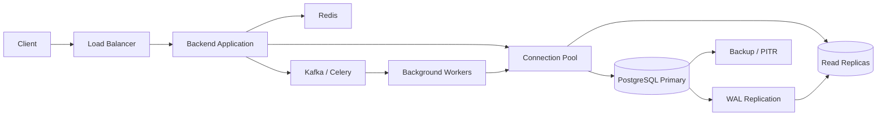

# 24- Production SQL Architecture Patterns

## Overview

Production SQL architecture is less about writing individual queries and more about designing how application workloads interact with relational data under real-world conditions.

A production system must simultaneously handle:

- Concurrent requests
- Transactions
- Data integrity
- Query performance
- Connection limits
- Failures
- Replication
- Caching
- Background processing
- Schema evolution
- Increasing data volume
- Operational maintenance

A typical backend architecture looks like:

```text
                    Clients
                       │
                       ▼
                Load Balancer
                       │
                       ▼
                Nginx / Ingress
                       │
                       ▼
              Backend Applications
                 │          │
                 │          ├──────────> Redis
                 │
                 ├──────────> Kafka / Celery
                 │
                 ▼
             Connection Pool
                 │
        ┌────────┴─────────┐
        ▼                  ▼
     Primary            Replicas
   PostgreSQL          PostgreSQL
        │
        ├──────────> WAL / Replication
        │
        └──────────> Backup / PITR
```

The most important principle is:

> **Treat the database as a critical part of the distributed system, not merely a persistence layer.**

Production SQL architecture combines database internals with application architecture, workload characteristics, consistency requirements, and operational constraints.

---

## Architecture Patterns vs SQL Techniques

SQL optimization and SQL architecture operate at different levels.

| Level | Concern | Example |
|---|---|---|
| Query | Individual SQL efficiency | `EXPLAIN ANALYZE` |
| Schema | Data representation | Normalization |
| Index | Access paths | B-tree index |
| Transaction | Consistency | `SERIALIZABLE` |
| Connection | Database capacity | Connection pooling |
| Workload | Read/write behavior | Read replicas |
| Data lifecycle | Large datasets | Partitioning |
| Application | Database interaction | Repository/service layer |
| Distributed system | Multiple services | Database-per-service |
| Infrastructure | Availability | Multi-AZ PostgreSQL |
| Data platform | Analytics | OLTP → OLAP |

Senior engineers need to reason across these layers rather than optimizing one layer in isolation.

---

## Core Production Architecture

A robust application-to-database architecture typically separates responsibilities:



The exact architecture depends on workload and requirements.

Do not add every component simply because it is common in production systems.

---

## Pattern: Keep PostgreSQL as the Source of Truth

For transactional systems, PostgreSQL should normally own authoritative business state.

```text
Application
    │
    ├── Redis → Cache
    ├── Kafka → Event transport
    └── PostgreSQL → Source of truth
```

Redis may contain:

```text
Cached user profile
Cached product
Rate-limit counter
Session data
```

Kafka may contain:

```text
order.created
payment.completed
inventory.updated
```

Neither automatically replaces PostgreSQL's role as the transactional source of truth.

### When to Use

Use PostgreSQL as the authoritative store when the workload requires:

- Transactions
- Relational integrity
- Constraints
- Strong consistency
- Complex relationships
- Durable state

### Production Considerations

Define explicitly:

- Which system owns the data
- Which systems contain derived copies
- How derived data is rebuilt
- How stale data is handled
- How data is recovered

---

## Pattern: Normalize Transactional Data

Normalization reduces unnecessary duplication and protects data integrity.

Example:

```text
customers
---------
id
name
email

orders
------
id
customer_id
status
total
```

Relationship:

```text
customers 1 ──────── N orders
```

Use foreign keys:

```sql
CREATE TABLE orders (
    id BIGINT GENERATED ALWAYS AS IDENTITY PRIMARY KEY,
    customer_id BIGINT NOT NULL,
    status TEXT NOT NULL,
    total NUMERIC(12, 2) NOT NULL,
    CONSTRAINT orders_customer_fk
        FOREIGN KEY (customer_id)
        REFERENCES customers(id)
);
```

### Advantages

- Strong integrity
- Less duplication
- Easier updates
- Clear ownership

### Limitations

Highly normalized schemas can require more joins.

For transactional systems, correctness should generally be established first. Denormalization should be introduced based on measured workload requirements.

---

## Pattern: Controlled Denormalization

Denormalization duplicates data intentionally to improve read performance or simplify query paths.

For example:

```text
orders
------
id
customer_id
customer_name
customer_email
```

instead of always joining:

```text
orders
   │
   └── customers
```

### When to Use

Consider denormalization when:

- A read path is extremely frequent
- Joins are demonstrably expensive
- Data changes less frequently than it is read
- The duplicated value has clear ownership
- The consistency model is understood

### Risks

- Duplicate data
- Synchronization complexity
- Stale values
- Larger writes
- More complex migrations

A senior engineer should be able to explain **why the duplication exists and how it stays correct**.

---

## Pattern: Enforce Invariants in the Database

Critical business invariants should not depend exclusively on application code.

Examples:

```sql
CREATE TABLE accounts (
    id BIGINT GENERATED ALWAYS AS IDENTITY PRIMARY KEY,
    balance NUMERIC(12, 2) NOT NULL,
    CONSTRAINT balance_nonnegative
        CHECK (balance >= 0)
);
```

Unique business keys:

```sql
CREATE UNIQUE INDEX users_email_unique
ON users (email);
```

Foreign-key integrity:

```sql
ALTER TABLE orders
ADD CONSTRAINT orders_customer_fk
FOREIGN KEY (customer_id)
REFERENCES customers(id);
```

### Why It Matters

Application instances can race:

```text
Application A ──┐
                ├──> Database
Application B ──┘
```

The database is the shared concurrency boundary.

---

## Pattern: Use Atomic SQL for Concurrency

Avoid:

```text
SELECT available
UPDATE available
```

when the operation can be performed atomically.

Prefer:

```sql
UPDATE inventory
SET available = available - 1
WHERE product_id = $1
  AND available > 0;
```

Then verify the affected row count.

```text
Rows updated = 1 → reservation succeeded

Rows updated = 0 → unavailable
```

This pattern avoids unnecessary application-side race windows.

---

## Pattern: Explicit Transaction Boundaries

A transaction should represent a meaningful consistency boundary.

```python
from django.db import transaction

with transaction.atomic():
    order = Order.objects.create(
        customer_id=customer_id,
        status="pending",
    )

    OrderItem.objects.create(
        order=order,
        product_id=product_id,
        quantity=quantity,
    )
```

The transaction should contain only the operations that must commit or roll back together.

Avoid:

```text
BEGIN
  ↓
Database operation
  ↓
HTTP request to another service
  ↓
Wait 5 seconds
  ↓
Another database operation
  ↓
COMMIT
```

Long transactions increase:

- Lock duration
- Connection usage
- MVCC retention
- WAL pressure
- Failure impact

---

## Pattern: Keep Transactions Short

A production transaction should generally look like:

```text
Acquire connection
      ↓
BEGIN
      ↓
Required database operations
      ↓
COMMIT
      ↓
Release connection
```

Avoid holding transactions while:

- Calling external APIs
- Waiting for user input
- Performing large unrelated computations
- Sleeping/retrying
- Processing huge batches unnecessarily

Short transactions improve concurrency and operational behavior.

---

## Pattern: Use Idempotency for Retryable Writes

Network failures create uncertainty.

```text
Application
    │
    │ COMMIT
    ▼
Database
    X
Connection lost
```

The application cannot always determine whether the transaction committed.

Use an idempotency key:

```sql
CREATE TABLE payment_requests (
    id BIGINT GENERATED ALWAYS AS IDENTITY PRIMARY KEY,
    idempotency_key TEXT NOT NULL UNIQUE,
    amount NUMERIC(12, 2) NOT NULL,
    created_at TIMESTAMPTZ NOT NULL DEFAULT now()
);
```

A retry using the same key cannot silently create a second logical operation.

---

## Pattern: Transactional Outbox

When a database transaction must reliably produce an event:

```text
Database Transaction
 ┌──────────────────────┐
 │ Business state       │
 │ Outbox event         │
 └──────────────────────┘
          │
        COMMIT
          │
          ▼
    Outbox Publisher
          │
          ▼
        Kafka
```

Example:

```sql
BEGIN;

INSERT INTO orders (
    id,
    customer_id,
    status
)
VALUES ($1, $2, 'created');

INSERT INTO outbox_events (
    id,
    event_type,
    aggregate_id,
    payload
)
VALUES ($3, 'order.created', $1, $4);

COMMIT;
```

The publisher can safely retry Kafka publication because the outbox record remains durable.

---

## Pattern: Connection Pooling

A production application should reuse database connections.

```text
Application Pods
       │
       ▼
Connection Pool
 ┌─────┼─────┐
 ▼     ▼     ▼
Conn  Conn  Conn
 └─────┼─────┘
       ▼
   PostgreSQL
```

Pooling reduces connection establishment overhead and controls concurrency.

### Capacity Planning

Suppose:

```text
20 application pods
×
10 connections/pod
=
200 possible connections
```

If PostgreSQL can safely support only a smaller operational connection budget, application scaling can overload the database.

Pool sizing must therefore consider:

- Maximum pod count
- Worker count
- Background jobs
- Administrative connections
- Database memory
- Query concurrency

---

## Pattern: Backpressure at the Database Boundary

The database often becomes the final bottleneck.

```text
Clients
   ↓
API concurrency
   ↓
Connection pool
   ↓
PostgreSQL
```

When database capacity is exhausted, upstream components should not continue increasing concurrency indefinitely.

Use:

- Bounded worker pools
- Connection pool limits
- Request timeouts
- Queue limits
- Rate limiting
- Kafka buffering
- Celery concurrency controls

Backpressure protects the database from overload cascades.

---

## Pattern: Optimize Queries Before Scaling Infrastructure

When a query is slow:

```text
Slow API
   ↓
Inspect query count
   ↓
Inspect SQL
   ↓
EXPLAIN (ANALYZE, BUFFERS)
   ↓
Inspect indexes
   ↓
Inspect statistics
   ↓
Inspect locks / I/O
   ↓
Optimize
```

Example:

```sql
EXPLAIN (ANALYZE, BUFFERS)
SELECT id, status, total
FROM orders
WHERE customer_id = 42
  AND status = 'pending';
```

Look at:

- Estimated rows
- Actual rows
- Scan method
- Join strategy
- Buffer activity
- Execution time

Do not add indexes blindly.

---

## Pattern: Design Indexes Around Access Patterns

Indexes should reflect actual query patterns.

For:

```sql
SELECT id, created_at, total
FROM orders
WHERE customer_id = $1
ORDER BY created_at DESC
LIMIT 50;
```

a useful index may be:

```sql
CREATE INDEX orders_customer_created_idx
ON orders (customer_id, created_at DESC);
```

The column order matters.

Composite indexes should be designed around:

- Equality predicates
- Range predicates
- Ordering
- Selectivity
- Query frequency

An index is useful only if its maintenance and storage cost is justified by the workload.

---

## Pattern: Cover Important Read Paths

If a query repeatedly needs a small set of columns, PostgreSQL's `INCLUDE` can sometimes reduce heap access.

```sql
CREATE INDEX orders_customer_status_idx
ON orders (customer_id, status)
INCLUDE (total, created_at);
```

This can enable index-only scans when PostgreSQL's visibility information allows them.

Do not treat covering indexes as universally better.

They increase:

- Index size
- Write amplification
- Storage usage
- Maintenance cost

---

## Pattern: Avoid N+1 Queries

A common ORM architecture problem is:

```text
1 query for orders
+
N queries for customers
```

Django:

```python
orders = Order.objects.select_related("customer")
```

For one-to-many or many-to-many relationships:

```python
orders = Order.objects.prefetch_related("items")
```

The correct strategy depends on relationship cardinality and the required result shape.

Query count should be measured, not optimized mechanically.

---

## Pattern: Project Only Required Columns

Avoid:

```sql
SELECT *
FROM orders;
```

Prefer:

```sql
SELECT id, status, total
FROM orders;
```

This reduces:

- Data transfer
- Memory usage
- Serialization work
- Application object size

It can also improve the usefulness of covering indexes.

---

## Pattern: Paginate Large Datasets

Offset pagination:

```sql
SELECT id, created_at
FROM orders
ORDER BY created_at DESC
LIMIT 50 OFFSET 50000;
```

can become expensive at large offsets.

Keyset pagination is often more scalable:

```sql
SELECT id, created_at
FROM orders
WHERE (created_at, id) < ($1, $2)
ORDER BY created_at DESC, id DESC
LIMIT 50;
```

The cursor should contain enough ordering information to make the result deterministic.

---

## Pattern: Separate Read and Write Workloads

For read-heavy systems:

```text
                 Application
                 /          \
                /            \
           Writes            Reads
              │                │
              ▼                ▼
           Primary          Replicas
```

Read replicas can increase read capacity.

However:

```text
Read scaling
≠
Write scaling
```

Replicas also introduce replication lag and read-after-write consistency concerns.

---

## Pattern: Lag-Aware Replica Routing

Do not assume every replica is equally useful.

```text
Replica A → 20 ms lag
Replica B → 3 seconds lag
Replica C → unhealthy
```

Routing decisions should consider:

- Replication lag
- Query type
- Consistency requirements
- Geographic locality
- Replica capacity

For critical reads immediately following writes, use the primary or an appropriate consistency mechanism.

---

## Pattern: Cache-Aside with Redis

A common production cache architecture:

```text
Request
   │
   ▼
Redis
   │
   ├── Hit ──> Return
   │
   └── Miss
        ↓
    PostgreSQL
        ↓
      Redis
        ↓
      Return
```

Example:

```python
value = redis.get(cache_key)

if value is None:
    value = load_from_database()
    redis.set(cache_key, serialize(value), ex=60)

return value
```

The exact serialization and cache policy should match the data.

### Production Risks

- Stale values
- Cache stampedes
- Invalidations
- Memory pressure
- Hot keys

Caching should be introduced based on measured workload characteristics.

---

## Pattern: Protect Against Cache Stampedes

Suppose an expensive cache entry expires:

```text
1000 requests
     │
     ▼
Cache miss
     │
     ├──> DB
     ├──> DB
     ├──> DB
     └──> ...
```

The database receives a sudden burst.

Possible approaches include:

- TTL jitter
- Request coalescing
- Distributed locks
- Background refresh
- Stale-while-revalidate behavior

The correct strategy depends on freshness requirements.

---

## Pattern: Move Long Work to Asynchronous Processing

Do not keep an HTTP request open for expensive database work when the business process does not require synchronous completion.

```text
POST /reports
      │
      ▼
Create job
      │
      ▼
Commit
      │
      ▼
202 Accepted
      │
      ▼
Celery / Kafka
      │
      ▼
Database processing
```

This improves:

- API latency
- Request reliability
- Worker isolation
- Backpressure

The job state should itself be persisted reliably.

---

## Pattern: Batch Writes

For high-volume ingestion, individual transactions can be inefficient:

```text
INSERT
COMMIT

INSERT
COMMIT

INSERT
COMMIT
```

Batching can reduce transaction and network overhead:

```text
Batch
  ↓
Single transaction
  ↓
Database
```

For PostgreSQL bulk ingestion, `COPY` is often substantially more efficient than issuing large numbers of individual inserts.

Batch sizes should still be bounded to avoid creating oversized transactions.

---

## Pattern: Partition Large Tables

Partitioning divides a logical table into physical partitions.

Example:

```text
orders
 ├── orders_2026_01
 ├── orders_2026_02
 ├── orders_2026_03
 └── orders_2026_04
```

Range partitioning is useful for time-oriented data.

Benefits include:

- Partition pruning
- Easier retention
- Smaller indexes per partition
- Faster lifecycle operations

Partitioning is not automatically a performance solution.

A poor partition key or excessive partition count can make the system more complex.

---

## Pattern: Use Partitioning for Data Lifecycle

Partitioning is especially valuable when data expires by time.

For example:

```text
Current
  ↓
Hot partition
  ↓
Older partition
  ↓
Archive
  ↓
Drop
```

Dropping or detaching an old partition can be much simpler than deleting millions of rows individually.

This can reduce:

- WAL generation
- Lock duration
- Vacuum workload
- Index maintenance

---

## Pattern: Isolate OLTP and OLAP

Do not run heavy analytics against the transactional primary when the workload can be isolated.

```text
                    PostgreSQL OLTP
                          │
                     CDC / ETL
                          │
                          ▼
                    Analytics Store
                          │
                          ▼
                    BI / Reporting
```

OLTP systems optimize for:

- Short transactions
- Concurrent writes
- Point lookups
- Transactional integrity

OLAP systems optimize for:

- Large scans
- Aggregations
- Historical analysis
- Analytical joins

Separating the workloads protects transactional latency.

---

## Pattern: Database per Service

Microservices often benefit from explicit database ownership.

```text
Order Service ─────> Orders DB

Payment Service ───> Payments DB

Inventory Service ─> Inventory DB
```

Advantages:

- Clear ownership
- Independent schema evolution
- Independent scaling
- Reduced coupling

Limitations:

- Cross-service queries become harder
- Distributed transactions become harder
- Data duplication may increase
- Operational complexity increases

Do not split databases simply because the system uses microservices.

The service boundary should justify the persistence boundary.

---

## Pattern: Use Events for Cross-Service Data

Instead of directly querying another service's tables:

```text
Order Service
      │
      ▼
Kafka
      │
      ▼
Reporting / Inventory / Notification
```

Events can distribute state changes.

For example:

```text
order.created
order.cancelled
payment.completed
```

Consumers should be idempotent because event delivery may be duplicated.

---

## Pattern: Handle Distributed Transactions Explicitly

A transaction across two independent databases is fundamentally different from a local PostgreSQL transaction.

Avoid pretending this is atomic:

```text
BEGIN DB-A
    ↓
UPDATE A
    ↓
UPDATE DB-B
    ↓
COMMIT
```

Instead consider:

- Saga
- Outbox
- Compensation
- Idempotency
- Workflow orchestration

Example:

```text
Order Created
     ↓
Payment Requested
     ↓
Payment Completed
     ↓
Inventory Reserved
```

Each step can have its own transaction and failure recovery strategy.

---

## Pattern: Use Optimistic Concurrency Where Appropriate

For records with relatively low contention, optimistic concurrency can avoid unnecessary locking.

Example:

```sql
UPDATE orders
SET status = $1,
    version = version + 1
WHERE id = $2
  AND version = $3;
```

If zero rows are affected, the record changed concurrently.

Use this when:

- Conflicts are relatively rare
- Long-lived application workflows are involved
- Locking would be expensive

For heavily contended records, pessimistic locking or atomic updates may be more appropriate.

---

## Pattern: Use Pessimistic Locking for Critical Rows

When concurrent modifications must be serialized:

```sql
SELECT id, available
FROM inventory
WHERE product_id = $1
FOR UPDATE;
```

Django:

```python
with transaction.atomic():
    inventory = (
        Inventory.objects
        .select_for_update()
        .get(product_id=product_id)
    )

    if inventory.available <= 0:
        raise OutOfStock

    inventory.available -= 1
    inventory.save(update_fields=["available"])
```

The transaction should remain small.

Avoid holding the lock while calling external services.

---

## Pattern: Control Lock Ordering

Deadlocks can occur when transactions acquire locks in different orders.

Unsafe:

```text
Transaction A:
  Lock row 1
  Lock row 2

Transaction B:
  Lock row 2
  Lock row 1
```

Possible deadlock:

```text
A waits for B
B waits for A
```

Use a consistent lock ordering.

For example:

```text
Always lock lower ID first.
```

Deadlock handling should still exist because not all deadlocks can be eliminated through application ordering.

Retry the entire transaction with bounded backoff when retrying is appropriate.

---

## Pattern: Use Timeouts as Safety Boundaries

A production database path should have bounded waiting.

Useful controls include:

- Connection timeout
- Pool acquisition timeout
- Statement timeout
- Lock timeout
- HTTP request timeout

For example:

```sql
SET LOCAL lock_timeout = '2s';
SET LOCAL statement_timeout = '10s';
```

Use `SET LOCAL` when the setting should apply only to the current transaction.

Timeouts should prevent pathological resource consumption without incorrectly terminating legitimate workloads.

---

## Pattern: Use Stable Database Endpoints

Applications should not depend on database IP addresses.

Prefer:

```text
db-primary.internal
```

over:

```text
10.0.4.27
```

A stable endpoint allows infrastructure to change underneath the application.

This is particularly important for:

- HA failover
- Cloud-managed databases
- Kubernetes
- Database migrations
- Infrastructure replacement

---

## Pattern: Multi-AZ High Availability

A production PostgreSQL deployment may use:

```text
              Application
                   │
                   ▼
             DB Endpoint
                   │
             ┌─────┴─────┐
             ▼           ▼
          Primary      Standby
           AZ-A          AZ-B
```

The standby protects against infrastructure failures affecting the primary.

HA should also include:

- Failure detection
- Promotion
- Endpoint redirection
- Connection recovery
- Split-brain prevention
- Backup/PITR

Replication alone is not a complete HA architecture.

---

## Pattern: Independent Backups and PITR

Even a highly available database needs independent backups.

```text
Primary
  │
  ├── Standby
  │
  └── Backup + WAL
          │
          ▼
         PITR
```

Backups protect against:

- Accidental deletion
- Application bugs
- Data corruption
- Operational mistakes

Replication protects availability; backups provide historical recovery points.

---

## Pattern: Expand-and-Contract Schema Changes

Production deployments should tolerate multiple application versions.

Use:

```text
Expand
  ↓
Deploy compatible code
  ↓
Backfill
  ↓
Switch behavior
  ↓
Contract
```

Example:

```text
Old column
    │
    ├── New column added
    │
    ├── Application writes both
    │
    ├── Backfill new column
    │
    ├── Application reads new column
    │
    └── Remove old column later
```

Avoid destructive migrations that require all application instances to upgrade simultaneously.

---

## Pattern: Separate Schema Migration from Data Migration

Schema changes and large data transformations have different operational characteristics.

Schema migration:

```sql
ALTER TABLE orders
ADD COLUMN processed_at TIMESTAMPTZ;
```

Large backfill:

```text
Millions of rows
      ↓
Batch processing
      ↓
Commit small batches
```

Avoid a single massive transaction for large backfills unless the operational impact has been evaluated.

Batching improves:

- Lock duration
- Rollback impact
- WAL behavior
- Operational control

---

## Pattern: Observe the Entire Database Path

Database observability should correlate:

```text
HTTP request
    │
    ▼
Application trace
    │
    ├── Pool wait
    ├── SQL execution
    ├── Lock wait
    └── Serialization
            │
            ▼
        PostgreSQL
```

Track:

### Application

- Request latency
- Query count
- Query latency
- Connection-pool utilization
- Pool wait time
- Database errors
- Retry count

### PostgreSQL

- CPU
- Memory
- I/O
- Connections
- Locks
- Deadlocks
- Long-running transactions
- Query latency
- WAL generation
- Replication lag

---

## Pattern: Capacity Planning

Database capacity should be measured before the system reaches its limits.

Track:

```text
Current utilization
+
Growth rate
+
Peak load
+
Failure headroom
```

Consider:

- CPU headroom
- Memory headroom
- Storage growth
- IOPS
- Connections
- WAL generation
- Replica capacity

A system operating permanently at 95–100% capacity has little room for:

- Traffic spikes
- Failovers
- Maintenance
- Background jobs

---

## Pattern: Design for Failover

A production system should assume database failures will happen.

During failover:

```text
Primary fails
     ↓
Standby promoted
     ↓
Endpoint updated
     ↓
Connections fail
     ↓
Pool reconnects
     ↓
Requests recover
```

Applications should support:

- Connection retries
- Bounded backoff
- Idempotency
- Transaction retry where appropriate
- Graceful error handling

Do not retry unknown commit outcomes blindly.

---

## Pattern: Protect Against Retry Storms

A database failover can cause many simultaneous requests to fail.

Without backoff:

```text
Failure
  ↓
1000 immediate retries
  ↓
New primary overloaded
  ↓
More failures
  ↓
More retries
```

Use:

```text
Bounded retries
+
Exponential backoff
+
Jitter
+
Concurrency limits
```

This is particularly important in Kubernetes environments where many replicas may restart or reconnect simultaneously.

---

## Pattern: Use Read Models for Specialized Queries

For complex APIs, repeatedly executing expensive joins against transactional tables may not be appropriate.

A read model can be built from transactional events:

```text
Transactional DB
      │
      ▼
    Events
      │
      ▼
 Read Model
      │
      ▼
Fast API Queries
```

The read model may be:

- PostgreSQL tables
- Elasticsearch
- Redis
- Analytical storage

The trade-off is additional complexity and potentially eventual consistency.

---

## Pattern: Use Keyset Pagination for High-Volume APIs

For APIs serving large datasets:

```text
GET /orders?cursor=...
```

is often preferable to:

```text
GET /orders?page=10000
```

Use a stable ordering:

```sql
SELECT id, created_at, total
FROM orders
WHERE (created_at, id) < ($1, $2)
ORDER BY created_at DESC, id DESC
LIMIT 100;
```

This provides predictable traversal without requiring increasingly large offsets.

---

## Pattern: Protect Hot Rows

A single highly contended row can become a serialization bottleneck.

Example:

```text
1000 requests
      │
      ▼
same account row
      │
      ▼
lock contention
```

Possible approaches:

- Atomic updates
- Optimistic concurrency
- Queueing
- Sharding counters
- Partitioning workload
- Redesigning the aggregate

The correct solution depends on the business invariant.

---

## Pattern: Use Queue-Based Write Serialization

When a particular operation requires serialized processing, a queue can control concurrency.

```text
API
 │
 ▼
Kafka
 │
 ▼
Consumer Group
 │
 ▼
Database
```

Partitioning can provide ordering for a specific key.

For example:

```text
account_id = 42
     ↓
same Kafka partition
     ↓
ordered processing
```

This can reduce database contention but introduces asynchronous processing and operational complexity.

---

## Pattern: Database Sharding as a Last-Level Scaling Strategy

Sharding distributes data across independent database instances.

```text
Application
    │
    ▼
Shard Router
 ┌──┼──┐
 ▼  ▼  ▼
DB1 DB2 DB3
```

Use sharding when:

- A single database cannot provide required capacity
- Data volume exceeds practical limits
- Workload can be partitioned effectively
- Cross-shard operations are manageable

Do not shard prematurely.

It introduces complexity around:

- Transactions
- Joins
- Global uniqueness
- Rebalancing
- Backups
- Monitoring
- Schema migrations

---

## Pattern: Tenant-Based Data Placement

Multi-tenant systems can use tenant-aware database placement:

```text
Tenant A ──> DB 1
Tenant B ──> DB 1
Tenant C ──> DB 2
Tenant D ──> DB 3
```

This can provide:

- Isolation
- Independent scaling
- Noisy-neighbor control
- Tenant migration

The routing layer must reliably determine the tenant before accessing the database.

---

## Pattern: Rate Limit Database-Heavy APIs

An API that triggers expensive SQL should not be allowed unlimited concurrency.

```text
Client
  ↓
Rate Limiter
  ↓
Application
  ↓
Database
```

Use rate limiting for:

- Expensive search
- Reporting
- Bulk operations
- Export endpoints
- Administrative APIs

Redis can be useful for distributed rate limiting.

---

## Pattern: Separate Analytical Exports

Large exports should not necessarily execute synchronously through an API.

Instead:

```text
POST /exports
      ↓
Create export job
      ↓
Celery / Kafka
      ↓
Query data
      ↓
Generate file
      ↓
Object storage
      ↓
Download URL
```

This prevents a large export from consuming API workers and database connections for an extended period.

---

## Pattern: Control Large Deletes

Avoid:

```sql
DELETE FROM events
WHERE created_at < now() - interval '1 year';
```

when the operation affects enormous numbers of rows.

Possible approaches include:

- Partition lifecycle management
- Batched deletes
- Archival
- Retention policies

For time-partitioned data, dropping an obsolete partition can be much more operationally efficient.

---

## Pattern: Use Partial Indexes for Targeted Workloads

If an API repeatedly accesses only a subset of records:

```sql
CREATE INDEX orders_pending_idx
ON orders (customer_id, created_at DESC)
WHERE status = 'pending';
```

This can reduce index size and write overhead compared with indexing all rows.

Partial indexes are especially useful for:

- Active records
- Pending jobs
- Soft-deleted exclusions
- Queue tables

The query predicate must align with the index predicate for the planner to use it effectively.

---

## Pattern: Queue Tables Carefully

A PostgreSQL table can sometimes be used as a work queue.

For concurrent consumers:

```sql
SELECT id
FROM jobs
WHERE status = 'pending'
ORDER BY created_at
FOR UPDATE SKIP LOCKED
LIMIT 100;
```

`SKIP LOCKED` allows workers to avoid waiting on rows already claimed by another worker.

This can work well for moderate workloads but may be less appropriate than Kafka or another dedicated queue for very high-throughput event processing.

---

## Pattern: Make Background Workers Database-Aware

Celery workers multiply database concurrency.

```text
Celery
├── Worker 1 ──> DB
├── Worker 2 ──> DB
├── Worker 3 ──> DB
└── Worker N ──> DB
```

Worker concurrency must be included in database capacity calculations.

Otherwise:

```text
API traffic
+
Celery traffic
=
Unexpected DB saturation
```

Use bounded worker concurrency and appropriate connection pools.

---

## Pattern: Secure Database Access

A production database should generally be reachable only through private networking.

```text
Internet
   X
   │
   │ no direct access
   ▼
Private Database Network
   ▲
   │
Application
```

Use:

- Private subnets
- Security groups
- Network policies
- TLS
- Least-privilege roles
- Secret management
- Credential rotation
- Encryption at rest

Never use a PostgreSQL superuser from the application unless there is an exceptional and explicitly justified requirement.

---

## Pattern: Separate Application and Administrative Roles

Use different credentials for different responsibilities.

```text
Application Role
 ├── SELECT
 ├── INSERT
 ├── UPDATE
 └── DELETE

Migration Role
 ├── Schema changes
 └── DDL

Admin Role
 └── Operational administration
```

This limits the blast radius of application compromise.

---

## Pattern: Treat Database Logs as Sensitive

Database logs can contain:

- Query text
- Identifiers
- User information
- Operational details

Avoid indiscriminate logging of sensitive parameters.

Use structured logging and controlled retention.

---

## Pattern: Test Production SQL Under Production-Like Load

A query that works against:

```text
10,000 rows
```

may behave very differently against:

```text
500 million rows
```

Test with realistic:

- Data volume
- Cardinality
- Index distribution
- Concurrency
- Query mix
- Cache state

Performance testing should validate the complete workload rather than one isolated query.

---

## Pattern: Monitor Query Regression

A query can become slower without its SQL changing.

Possible causes:

- Data growth
- Changed data distribution
- Statistics changes
- New indexes
- Dropped indexes
- Different parameter values
- Plan changes
- Increased concurrency

Monitor query fingerprints over time.

Important measurements include:

- Execution count
- Total execution time
- Mean latency
- p95/p99 latency
- Rows processed

---

## Pattern: Control Plan Instability

Prepared statements and changing parameter distributions can sometimes result in different plan choices.

For example:

```text
Parameter A
   ↓
Index scan is efficient

Parameter B
   ↓
Sequential scan is efficient
```

The planner's choice can therefore depend on data distribution and statistics.

Investigate:

- Estimated vs actual rows
- Generic vs custom plans
- Statistics
- Parameter distribution
- Query selectivity

Do not force a particular plan without understanding the underlying workload.

---

## Pattern: Treat Statistics as Production Infrastructure

PostgreSQL's planner depends heavily on statistics.

Statistics influence:

- Cardinality estimates
- Join ordering
- Scan selection
- Join algorithms
- Parallel plans

After significant data distribution changes, statistics quality matters.

Monitor and investigate cases where:

```text
Estimated rows ≠ Actual rows
```

by a large factor.

---

## Pattern: Control Index Growth

Every index has a cost.

```text
INSERT / UPDATE / DELETE
        │
        ├── Table
        ├── Index 1
        ├── Index 2
        └── Index N
```

More indexes can improve reads but increase:

- Write cost
- Storage
- Vacuum work
- Cache pressure
- Maintenance time

Before adding an index, ask:

1. Which production query needs it?
2. How frequently does that query execute?
3. What is its current plan?
4. What latency improvement is expected?
5. What write/storage cost will it introduce?

---

## Pattern: Use Concurrent Index Operations Carefully

On large production PostgreSQL tables, creating an index concurrently can reduce blocking of normal writes.

Example:

```sql
CREATE INDEX CONCURRENTLY orders_customer_idx
ON orders (customer_id);
```

It has different operational behavior from normal index creation and should be planned accordingly.

For Django migrations, large index changes should be reviewed carefully rather than automatically generated and deployed without workload analysis.

---

## Pattern: Design for Operational Failure

Every important database operation should have a failure story.

Ask:

```text
What happens if:
- Database connection fails?
- Query times out?
- Transaction deadlocks?
- Primary fails?
- Replica lags?
- Redis is unavailable?
- Kafka is delayed?
- Worker crashes?
- Migration fails?
```

Production architecture is largely the discipline of answering these questions before the incident happens.

---

## Production Decision Matrix

| Requirement | Preferred Pattern |
|---|---|
| Strong transactional integrity | PostgreSQL transactions + constraints |
| High read volume | Read replicas / caching |
| Very frequent cached reads | Redis |
| High write ingestion | Batching / `COPY` / async processing |
| Large time-series-like table | Partitioning |
| Cross-service events | Transactional outbox + Kafka |
| Long-running jobs | Celery / Kafka workers |
| Large analytical workload | OLAP system |
| High availability | Multi-AZ primary/standby |
| Historical recovery | Backup + PITR |
| Large API datasets | Keyset pagination |
| High contention | Atomic updates / locking / queueing |
| Multiple independent service domains | Database-per-service |
| Beyond single-database capacity | Sharding |
| Zero-downtime schema evolution | Expand-and-contract |

---

## Production Anti-Patterns

| Anti-Pattern | Why It Fails | Better Approach |
|---|---|---|
| `SELECT *` everywhere | Excessive data transfer | Explicit projection |
| N+1 ORM queries | Excessive round trips | `select_related` / `prefetch_related` |
| Unlimited DB connections | Database exhaustion | Pool limits |
| Long transactions | Locks and MVCC pressure | Short transactions |
| Blind write retries | Duplicate operations | Idempotency |
| Replica reads everywhere | Stale reads | Consistency-aware routing |
| Redis as source of truth | Data correctness risk | PostgreSQL authority |
| Huge synchronous exports | API/DB resource exhaustion | Async jobs |
| One massive backfill transaction | High lock/WAL impact | Bounded batches |
| Index every column | Write/storage overhead | Query-driven indexes |
| Shard immediately | Distributed complexity | Scale progressively |
| Shared tables across services | Tight coupling | Explicit ownership |
| Replica as backup | Logical errors replicate | Independent backups/PITR |
| No failover testing | HA assumptions remain unverified | Failure drills |
| Heavy analytics on primary | OLTP performance degradation | Workload isolation |

---

## Production Review Checklist

### Data Model

- [ ] Data ownership is clearly defined.
- [ ] Critical invariants are enforced with constraints.
- [ ] Foreign keys are used where appropriate.
- [ ] Denormalization has a documented reason.
- [ ] Large tables have a lifecycle strategy.

### Queries

- [ ] Important queries have been analyzed with execution plans.
- [ ] N+1 queries are controlled.
- [ ] Large result sets are paginated.
- [ ] Only required columns are selected.
- [ ] Query timeouts are configured appropriately.

### Indexes

- [ ] Indexes correspond to real access patterns.
- [ ] Composite index ordering is intentional.
- [ ] Partial/covering indexes are justified.
- [ ] Redundant indexes are periodically reviewed.
- [ ] Index maintenance cost is understood.

### Transactions

- [ ] Transaction boundaries are explicit.
- [ ] Transactions are short.
- [ ] External calls are outside critical transaction sections.
- [ ] Retryable transactions are bounded.
- [ ] Idempotency exists for uncertain write outcomes.

### Scaling

- [ ] Connection pools are sized against total capacity.
- [ ] Read replicas are used only where appropriate.
- [ ] Cache usage is measured.
- [ ] Background workers have bounded concurrency.
- [ ] Partitioning/sharding decisions are workload-driven.

### Reliability

- [ ] HA failover is configured where required.
- [ ] Independent backups exist.
- [ ] PITR is tested.
- [ ] RPO and RTO are defined.
- [ ] Failover is tested.
- [ ] Restore procedures are tested.

### Security

- [ ] Database access uses private networking.
- [ ] TLS is configured where required.
- [ ] Application roles use least privilege.
- [ ] Secrets are centrally managed.
- [ ] Sensitive database information is not unnecessarily logged.

### Operations

- [ ] Query performance is monitored.
- [ ] Connection pool utilization is monitored.
- [ ] Lock contention is observable.
- [ ] Replication lag is monitored.
- [ ] Storage and WAL growth are monitored.
- [ ] Schema migrations are deployment-safe.

---

## Interview Traps

### Is adding an index always the correct solution for a slow query?

No. The query may be slow because of poor cardinality estimates, inefficient joins, large result sets, lock waits, I/O, network transfer, or application-level issues.

### Should every application use Redis in front of PostgreSQL?

No. Caching should solve a measured workload problem and must have an explicit consistency and invalidation strategy.

### Why can adding more database connections make performance worse?

More connections increase concurrency and can increase CPU contention, memory usage, context switching, lock contention, and queueing. Database throughput is not unlimited.

### Why is a replica not a backup?

Replication reproduces changes. An accidental delete or corrupted update can therefore propagate to replicas. Backups provide independent historical recovery points.

### Why are transactions kept short?

Long transactions hold locks longer, consume connections, retain old MVCC versions, can increase WAL pressure, and make failures more expensive.

### When should you use a read replica?

When the workload is sufficiently read-heavy and replica lag is compatible with the application's consistency requirements.

### When should you use partitioning?

When table size, query patterns, partition pruning, maintenance, or data lifecycle operations benefit from physically separating data. Partitioning should not be introduced simply because a table is large.

### When should you shard?

When a single database cannot provide the required capacity or isolation and the workload can be partitioned effectively. Sharding should normally come after simpler scaling strategies have been evaluated.

### How do you handle a database failure during `COMMIT`?

Treat the result as potentially unknown. Do not blindly retry a non-idempotent operation. Use idempotency keys, unique constraints, reconciliation, or business-level confirmation.

### How do you prevent N+1 queries in Django?

Use appropriate loading strategies such as `select_related()` for suitable foreign-key/one-to-one relationships and `prefetch_related()` for collection relationships, then verify query count and performance.

### How do you safely process millions of rows?

Use bounded batches, appropriate indexing, controlled transaction sizes, and workload-aware scheduling. For ingestion, PostgreSQL `COPY` may be preferable to individual inserts.

### How do you design database architecture for microservices?

Give services clear ownership of their data and use APIs/events for cross-service communication. Avoid creating a distributed shared schema that couples independent services.

### How do you keep OLTP queries fast when reporting requirements grow?

Separate analytical workloads using replicas, read models, CDC/ETL pipelines, or dedicated OLAP infrastructure rather than allowing heavy analytical queries to compete with transactional traffic.

### What is the senior-level approach to production SQL architecture?

Start with workload and business requirements, then design data ownership, transactions, indexes, connection capacity, scaling, consistency, HA/DR, observability, and failure behavior together. Optimize measured bottlenecks before introducing architectural complexity.

## Key Takeaways

- **Production SQL architecture is a workload and reliability problem, not just a query-writing problem**; transactions, indexes, connections, caching, replication, scaling, and operations must be designed together.
- **Correctness should be enforced at the database boundary** through constraints, transactions, atomic operations, and carefully designed concurrency control.
- **Scale progressively**: optimize queries and indexes first, then use pooling, caching, replicas, batching, partitioning, and workload isolation before introducing sharding-level complexity.
- **Reliability requires explicit failure handling** including idempotency, bounded retries, HA failover, independent backups, PITR, safe migrations, and tested recovery procedures.
- **Senior SQL architecture is driven by measurement**: execution plans, query latency, pool utilization, lock waits, replication lag, storage growth, and real production workload characteristics should guide architectural decisions.