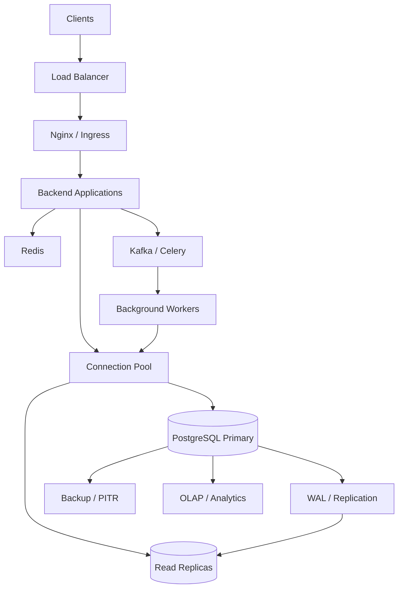

# README

## Overview

The **Architecture** section of the SQL playbook explains how relational databases operate as production backend systems and how application workloads interact with them.

The focus is not limited to SQL syntax. It covers the architecture behind:

- Query processing
- Storage and memory
- Transactions
- Concurrency
- Indexes
- Partitioning
- Replication
- Read scaling
- Sharding
- Multi-tenancy
- OLTP and OLAP
- Connection management
- High availability
- Application-to-database communication
- Production SQL architecture patterns

The goal is to build the architectural reasoning required to design, operate, troubleshoot, and scale PostgreSQL-backed backend systems.

## Navigation

- [01- Relational Database Architecture](./01-%20Relational%20Database%20Architecture.md) — Overall relational database internals and architecture
- [02- Database Server and Client Architecture](./02-%20Database%20Server%20and%20Client%20Architecture.md) — Client/server communication, drivers, sessions, and protocols
- [03- Storage Engine Concepts](./03-%20Storage%20Engine%20Concepts.md) — Pages, tuples, storage layout, WAL, vacuum, and persistence
- [04- Buffer Pool and Memory](./04-%20Buffer%20Pool%20and%20Memory.md) — Database memory, caching, shared buffers, and working memory
- [05- Query Parser Planner and Executor](./05-%20Query%20Parser%20Planner%20and%20Executor.md) — SQL processing lifecycle from parsing to execution
- [06- Query Optimizer Architecture](./06-%20Query%20Optimizer%20Architecture.md) — Cost-based optimization, cardinality, plans, and statistics
- [07- Transaction Architecture](./07-%20Transaction%20Architecture.md) — Transaction boundaries, atomicity, isolation, and failure handling
- [08- Locking and Concurrency Architecture](./08-%20Locking%20and%20Concurrency%20Architecture.md) — MVCC, locks, contention, deadlocks, and concurrency control
- [09- Index Architecture](./09-%20Index%20Architecture.md) — Index structures, access paths, composite indexes, and maintenance
- [10- Partitioned Table Architecture](./10-%20Partitioned%20Table%20Architecture.md) — Partitioning strategies, pruning, lifecycle, and large tables
- [11- Read Heavy vs Write Heavy Database Architecture](./11-%20Read%20Heavy%20vs%20Write%20Heavy%20Database%20Architecture.md) — Workload characteristics and architecture selection
- [12- OLTP Architecture](./12-%20OLTP%20Architecture.md) — Transaction-oriented database workloads
- [13- OLAP Architecture](./13-%20OLAP%20Architecture.md) — Analytical workloads, aggregation, and analytical storage
- [14- OLTP vs OLAP Architecture](./14-%20OLTP%20vs%20OLAP%20Architecture.md) — Architectural differences and workload isolation
- [15- Primary Database and Read Replica Architecture](./15-%20Primary%20Database%20and%20Read%20Replica%20Architecture.md) — Primary/replica topology and read scaling
- [16- Connection Pooling Architecture](./16-%20Connection%20Pooling%20Architecture.md) — Connection lifecycle, pooling, capacity, and exhaustion
- [17- Database Scaling Architecture](./17-%20Database%20Scaling%20Architecture.md) — Progressive strategies for database scaling
- [18- Vertical vs Horizontal Database Scaling](./18-%20Vertical%20vs%20Horizontal%20Database%20Scaling.md) — Scaling strategy trade-offs
- [19- Replication Architecture](./19-%20Replication%20Architecture.md) — WAL replication, synchronous/asynchronous replication, and lag
- [20- Sharding Architecture](./20-%20Sharding%20Architecture.md) — Distributed data placement, shard keys, routing, and rebalancing
- [21- Multi-Tenant Database Architecture](./21-%20Multi-Tenant%20Database%20Architecture.md) — Tenant isolation, routing, scaling, and security
- [22- High Availability Database Architecture](./22-%20High%20Availability%20Database%20Architecture.md) — Failover, fencing, RPO/RTO, backups, and HA operations
- [23- Backend Application to Database Architecture](./23-%20Backend%20Application%20to%20Database%20Architecture.md) — Application/database boundaries, drivers, pools, transactions, and scaling
- [24- Production SQL Architecture Patterns](./24-%20Production%20SQL%20Architecture%20Patterns.md) — Practical production patterns combining database and backend architecture

---

## Architecture at a Glance

A production relational database sits inside a larger distributed system:



A senior backend engineer should be able to reason about the complete path:

```text
HTTP / gRPC request
        ↓
Application
        ↓
ORM / SQL
        ↓
Connection Pool
        ↓
Database Driver
        ↓
PostgreSQL Protocol
        ↓
Parser / Planner / Executor
        ↓
Buffer / Storage
        ↓
Transaction / WAL
        ↓
Replication / Recovery
```

---

## Architecture Topics

| File | Topic | Primary Focus |
|---|---|---|
| `01- Relational Database Architecture.md` | Relational Database Architecture | Overall relational database internals and architecture |
| `02- Database Server and Client Architecture.md` | Database Server and Client Architecture | Client/server communication, drivers, sessions, and protocols |
| `03- Storage Engine Concepts.md` | Storage Engine Concepts | Pages, tuples, storage layout, WAL, vacuum, and persistence |
| `04- Buffer Pool and Memory.md` | Buffer Pool and Memory | Database memory, caching, shared buffers, and working memory |
| `05- Query Parser Planner and Executor.md` | Query Parser, Planner and Executor | SQL processing lifecycle from parsing to execution |
| `06- Query Optimizer Architecture.md` | Query Optimizer Architecture | Cost-based optimization, cardinality, plans, and statistics |
| `07- Transaction Architecture.md` | Transaction Architecture | Transaction boundaries, atomicity, isolation, and failure handling |
| `08- Locking and Concurrency Architecture.md` | Locking and Concurrency Architecture | MVCC, locks, contention, deadlocks, and concurrency control |
| `09- Index Architecture.md` | Index Architecture | Index structures, access paths, composite indexes, and maintenance |
| `10- Partitioned Table Architecture.md` | Partitioned Table Architecture | Partitioning strategies, pruning, lifecycle, and large tables |
| `11- Read Heavy vs Write Heavy Database Architecture.md` | Read-Heavy vs Write-Heavy Architecture | Workload characteristics and architecture selection |
| `12- OLTP Architecture.md` | OLTP Architecture | Transaction-oriented database workloads |
| `13- OLAP Architecture.md` | OLAP Architecture | Analytical workloads, aggregation, and analytical storage |
| `14- OLTP vs OLAP Architecture.md` | OLTP vs OLAP Architecture | Architectural differences and workload isolation |
| `15- Primary Database and Read Replica Architecture.md` | Primary Database and Read Replica Architecture | Primary/replica topology and read scaling |
| `16- Connection Pooling Architecture.md` | Connection Pooling Architecture | Connection lifecycle, pooling, capacity, and exhaustion |
| `17- Database Scaling Architecture.md` | Database Scaling Architecture | Progressive strategies for database scaling |
| `18- Vertical vs Horizontal Database Scaling.md` | Vertical vs Horizontal Database Scaling | Scaling strategy trade-offs |
| `19- Replication Architecture.md` | Replication Architecture | WAL replication, synchronous/asynchronous replication, and lag |
| `20- Sharding Architecture.md` | Sharding Architecture | Distributed data placement, shard keys, routing, and rebalancing |
| `21- Multi-Tenant Database Architecture.md` | Multi-Tenant Database Architecture | Tenant isolation, routing, scaling, and security |
| `22- High Availability Database Architecture.md` | High Availability Database Architecture | Failover, fencing, RPO/RTO, backups, and HA operations |
| `23- Backend Application to Database Architecture.md` | Backend Application to Database Architecture | Application/database boundaries, drivers, pools, transactions, and scaling |
| `24- Production SQL Architecture Patterns.md` | Production SQL Architecture Patterns | Practical production patterns combining database and backend architecture |

---

## Recommended Learning Flow

The documents are ordered to progressively move from database internals toward production architecture.

```text
Relational Fundamentals
        │
        ▼
Server / Client
        │
        ▼
Storage + Memory
        │
        ▼
Query Processing
        │
        ▼
Transactions + Concurrency
        │
        ▼
Indexes + Partitioning
        │
        ▼
Workload Architecture
        │
        ├── OLTP
        └── OLAP
        │
        ▼
Replication + Read Scaling
        │
        ▼
Connection Scaling
        │
        ▼
Database Scaling
        │
        ├── Vertical
        ├── Horizontal
        ├── Partitioning
        └── Sharding
        │
        ▼
Multi-Tenancy
        │
        ▼
High Availability
        │
        ▼
Application ↔ Database Architecture
        │
        ▼
Production SQL Patterns
```

This progression is intentional:

1. Understand how the database works internally.
2. Understand how SQL becomes an execution plan.
3. Understand how transactions and concurrency preserve correctness.
4. Understand how indexes and partitioning affect access paths.
5. Understand workload-specific architecture.
6. Understand replication and scaling.
7. Understand distributed database architectures.
8. Understand availability and failure recovery.
9. Connect database architecture to real backend applications.
10. Apply the concepts through production architecture patterns.

---

## Database Internals

The first part of the section focuses on what happens inside PostgreSQL.

### Relational Database Architecture

Understand the major database components:

```text
Client
  ↓
Connection
  ↓
Parser
  ↓
Planner
  ↓
Executor
  ↓
Buffer / Storage
  ↓
WAL
```

Key concepts include:

- Relational model
- Database server
- Sessions
- Query processing
- Storage
- Memory
- Transactions
- WAL
- Recovery

---

### Storage Engine Concepts

Understand how logical rows become physical database storage.

Key concepts include:

- Pages
- Tuples
- Heap storage
- Index storage
- WAL
- Vacuum
- MVCC storage implications
- Table and index bloat

The goal is to understand why operations such as updates, deletes, vacuuming, and indexing have physical consequences.

---

### Buffer Pool and Memory

Database performance depends heavily on memory.

Understand:

- Shared buffers
- Operating-system cache
- Work memory
- Sort memory
- Hash operations
- Cache hit behavior
- Memory pressure

A useful mental model is:

```text
Query
  ↓
Planner
  ↓
Executor
  ↓
Memory
  ├── Shared buffers
  ├── Work memory
  └── OS cache
       ↓
     Storage
```

---

## Query Processing

SQL statements pass through multiple stages.

```text
SQL
 ↓
Parse
 ↓
Analyze / Rewrite
 ↓
Plan
 ↓
Execute
 ↓
Result
```

### Parser, Planner and Executor

Understand:

- SQL parsing
- Semantic analysis
- Query rewriting
- Logical planning
- Physical execution plans
- Scan operators
- Join algorithms
- Aggregation
- Sorting

---

### Query Optimizer

The optimizer chooses an execution strategy based on:

- Statistics
- Cardinality estimates
- Available indexes
- Cost parameters
- Join possibilities
- Data distribution
- Query structure

Important tools include:

```sql
EXPLAIN
```

and:

```sql
EXPLAIN (ANALYZE, BUFFERS)
```

The architectural principle is:

> **SQL expresses what data is required; the optimizer decides how to obtain it.**

---

## Transactions and Concurrency

Transactions define consistency boundaries.

Understand:

- Atomicity
- Consistency
- Isolation
- Durability
- Transaction boundaries
- MVCC
- Isolation levels
- Row-level locking
- Deadlocks
- Serialization failures
- Optimistic concurrency
- Pessimistic concurrency

Typical backend flow:

```text
API Request
    ↓
Service Layer
    ↓
Transaction
 ┌──────────────────┐
 │ Read / Write     │
 │ Validate         │
 │ Update state     │
 └──────────────────┘
    ↓
Commit
```

Transactions should normally be short and contain only the work required for the consistency boundary.

---

## Index Architecture

Indexes provide alternative access paths into table data.

Understand:

- B-tree indexes
- Composite indexes
- Partial indexes
- Expression indexes
- Covering indexes
- GIN
- GiST
- BRIN
- Index-only scans
- Bitmap scans
- Index maintenance
- Write amplification

The most important production principle is:

> **Design indexes around real query patterns, not around columns in isolation.**

---

## Partitioning

Partitioning divides a logical table into multiple physical partitions.

Common strategies include:

- Range partitioning
- List partitioning
- Hash partitioning

Typical use cases include:

- Large tables
- Time-based data
- Retention management
- Partition pruning
- Operational lifecycle management

Partitioning is particularly useful when data lifecycle operations are important.

For example:

```text
orders
 ├── 2026-01
 ├── 2026-02
 ├── 2026-03
 └── 2026-04
```

Old partitions can be archived, detached, or dropped without deleting individual rows from a massive table.

---

## Workload Architecture

Database architecture should be driven by workload characteristics.

### Read-Heavy

Typical characteristics:

```text
Many reads
Few writes
```

Common techniques:

- Read replicas
- Redis
- Covering indexes
- Materialized views
- Read models
- Query optimization

### Write-Heavy

Typical characteristics:

```text
Many inserts / updates
High concurrency
```

Common techniques:

- Minimal required indexes
- Batch writes
- `COPY`
- Async processing
- Queue-based ingestion
- Partitioning
- Write contention reduction

---

## OLTP Architecture

OLTP systems optimize for:

- Short transactions
- High concurrency
- Point lookups
- Frequent writes
- Strong transactional integrity

Typical example:

```text
REST API
   ↓
Backend Service
   ↓
PostgreSQL
```

Examples include:

- Orders
- Payments
- Inventory
- User accounts
- Booking systems

The database is usually the transactional source of truth.

---

## OLAP Architecture

OLAP systems optimize for:

- Large scans
- Aggregation
- Historical analysis
- Analytical joins
- Reporting

Typical architecture:

```text
OLTP Database
      │
      ▼
CDC / ETL
      │
      ▼
Analytics Store
      │
      ▼
BI / Reporting
```

Do not allow heavy analytical workloads to compete directly with latency-sensitive OLTP traffic unless the workload is demonstrably safe.

---

## OLTP vs OLAP

| Characteristic | OLTP | OLAP |
|---|---|---|
| Primary goal | Transactions | Analysis |
| Query size | Small | Large |
| Writes | Frequent | Usually batch/stream ingestion |
| Reads | Point/range queries | Large scans |
| Latency | Low | Often higher |
| Data model | Normalized | Often denormalized |
| Concurrency | High | Analytical workloads |
| Typical output | Individual records | Aggregated datasets |

Separating these workloads is a common production architecture pattern.

---

## Primary and Read Replica Architecture

A common scaling architecture is:

```text
                 Application
                 /          \
                ▼            ▼
             Writes         Reads
                │            │
                ▼            ▼
             Primary      Replicas
                │
                ▼
               WAL
```

Understand:

- Primary/standby roles
- WAL replication
- Replication lag
- Read routing
- Read-after-write consistency
- Failover
- Replica health
- Multiple replicas

A read replica is not automatically a consistency-safe destination for every read.

---

## Connection Pooling

Database connections are expensive resources.

A typical architecture is:

```text
Application Pods
      │
      ▼
Connection Pool
      │
      ▼
PostgreSQL
```

Connection pools provide:

- Connection reuse
- Concurrency control
- Reduced connection setup overhead
- Database protection

Capacity planning must account for all application instances and workers:

```text
Application pods
×
Connections per pod
+
Background workers
+
Administrative capacity
```

More connections do not automatically produce more throughput.

---

## Database Scaling

Scaling should normally progress from simple to complex.

```text
Query Optimization
       ↓
Index Optimization
       ↓
Connection Pooling
       ↓
Vertical Scaling
       ↓
Caching
       ↓
Read Replicas
       ↓
Partitioning
       ↓
Workload Isolation
       ↓
Sharding
```

The correct sequence depends on the bottleneck.

Do not introduce distributed database architecture to solve a query that could have been fixed with an appropriate index.

---

## Vertical Scaling

Vertical scaling increases resources for one database system.

Examples:

- More CPU
- More RAM
- Faster storage
- Higher IOPS
- Larger storage capacity

Advantages:

- Simple
- Low application complexity
- Preserves a single database model

Limitations:

- Hardware ceiling
- Larger failure domain
- Cost can grow significantly
- Does not automatically solve every workload bottleneck

---

## Horizontal Scaling

Horizontal scaling distributes workload across multiple database instances.

Examples:

```text
Primary + replicas
```

or:

```text
Shard A
Shard B
Shard C
```

Horizontal scaling provides more capacity but introduces additional distributed-system concerns.

---

## Replication

Replication creates additional database copies.

Understand:

- Physical replication
- Logical replication
- Synchronous replication
- Asynchronous replication
- Replication slots
- WAL retention
- Replica lag
- Promotion
- Failover

Replication can provide:

- High availability
- Read scaling
- Disaster recovery
- Data distribution

It does not automatically provide backup protection.

---

## Sharding

Sharding distributes data across independent database instances.

```text
Application
     ↓
Shard Router
 ┌───┼───┐
 ▼   ▼   ▼
DB-A DB-B DB-C
```

Important concepts include:

- Shard key
- Data locality
- Routing
- Scatter-gather queries
- Rebalancing
- Cross-shard transactions
- Global identifiers
- Tenant-based sharding

Sharding should normally be considered only after simpler scaling strategies have been evaluated.

---

## Multi-Tenant Architecture

Multi-tenant systems require explicit data-isolation decisions.

Common models:

| Model | Isolation | Operational Complexity | Typical Use |
|---|---|---:|---|
| Shared DB / shared schema | Low | Low | Large SaaS platforms |
| Shared DB / separate schema | Medium | Medium | Stronger tenant isolation |
| Database per tenant | High | High | High-isolation workloads |
| Hybrid | Configurable | High | Mixed tenant requirements |

Important concerns include:

- Tenant identification
- Authorization
- Row-level security
- Index design
- Noisy neighbors
- Tenant-specific quotas
- Tenant migration
- Backup/restore
- Compliance

---

## High Availability

HA architecture protects against database component failures.

Typical design:

```text
               DB Endpoint
                   │
              ┌────┴────┐
              ▼         ▼
           Primary    Standby
             AZ-A       AZ-B
```

Important concepts include:

- Failure detection
- Promotion
- Fencing
- Split-brain prevention
- Stable endpoints
- Connection recovery
- RPO
- RTO
- Failover testing

Replication alone is not a complete HA strategy.

---

## Backup and Disaster Recovery

HA and backups solve different problems.

```text
Primary
 ├── Standby → Availability
 │
 └── Backup + WAL → Recovery
```

Backups protect against:

- Accidental deletion
- Application bugs
- Corruption
- Operational mistakes

Important concepts include:

- Full/base backups
- WAL archiving
- Point-in-time recovery
- Retention
- Restore testing
- Cross-region recovery

A backup that has never been restored should not be treated as a fully validated recovery strategy.

---

## Backend Application to Database Architecture

The database is part of the application request path.

```text
Client
  ↓
Nginx / Load Balancer
  ↓
Backend Application
  ↓
Service Layer
  ↓
ORM / SQL
  ↓
Connection Pool
  ↓
Database Driver
  ↓
PostgreSQL
```

A senior backend engineer should understand:

- ORM-generated SQL
- Connection pooling
- Transaction boundaries
- Query performance
- N+1 queries
- Parameter binding
- Read/write routing
- Retry behavior
- Database timeouts
- Connection failures

---

## Django and PostgreSQL

Typical Django architecture:

```text
Django View / API
       ↓
Service Layer
       ↓
Django ORM
       ↓
Database Backend
       ↓
PostgreSQL
```

Important ORM patterns include:

```python
Order.objects.select_related("customer")
```

for suitable single-valued relationships and:

```python
Order.objects.prefetch_related("items")
```

for collection relationships.

Always validate the generated query behavior rather than assuming ORM code is efficient.

---

## FastAPI and PostgreSQL

A FastAPI service commonly uses SQLAlchemy with a PostgreSQL driver.

Typical architecture:

```text
FastAPI
   ↓
Dependency / Service Layer
   ↓
SQLAlchemy
   ↓
Connection Pool
   ↓
PostgreSQL
```

Transaction scope should be explicit and aligned with business consistency requirements.

---

## Redis Integration

Redis is commonly used as a cache or low-latency data structure store.

```text
Application
    │
    ▼
Redis
    │
    ├── Hit → Response
    │
    └── Miss
         ↓
      PostgreSQL
```

Important concerns include:

- Cache invalidation
- TTLs
- Stampedes
- Hot keys
- Stale data
- Memory limits

Redis should not automatically become the authoritative store for transactional data.

---

## Kafka and Celery Integration

Asynchronous processing can protect the database from synchronous workload pressure.

```text
Application
    │
    ▼
Kafka / Celery
    │
    ▼
Workers
    │
    ▼
PostgreSQL
```

Workers must be included in database capacity planning.

Important concepts include:

- Idempotency
- Retry
- Backpressure
- Batch writes
- Dead-letter handling
- Transactional outbox

---

## Production SQL Architecture Patterns

The final document in this section consolidates practical production patterns.

Key patterns include:

- Keep PostgreSQL as the source of truth.
- Enforce invariants with database constraints.
- Keep transactions short.
- Use atomic SQL for concurrency-sensitive operations.
- Use idempotency for retryable writes.
- Use transactional outbox for reliable event publication.
- Size connection pools against total database capacity.
- Optimize queries before scaling infrastructure.
- Design indexes around access patterns.
- Use read replicas for appropriate read workloads.
- Use Redis selectively for caching.
- Move long-running work to background processing.
- Batch high-volume writes.
- Partition large tables where lifecycle or query patterns justify it.
- Isolate OLTP and OLAP workloads.
- Use HA and PITR together.
- Test failover and recovery procedures.

---

## Cross-Cutting Production Concerns

Architecture decisions should consistently consider the following dimensions.

### Performance

Evaluate:

- Query execution time
- Connection wait
- Lock wait
- Network latency
- Result size
- CPU
- Memory
- I/O

Do not optimize SQL without measuring the complete request path.

---

### Scalability

Consider:

- Data volume
- Request concurrency
- Connection count
- Read/write ratio
- Storage growth
- WAL generation
- Replica capacity
- Background workload

Scaling the application layer without considering database capacity can simply move the bottleneck downstream.

---

### Reliability

Design for:

- Database failure
- Connection failure
- Transaction failure
- Deadlocks
- Replica lag
- Worker failure
- Cache failure
- Network failure

Every important operation should have an explicit failure behavior.

---

### High Availability

Where required:

- Separate failure domains.
- Use stable database endpoints.
- Monitor replication.
- Implement reliable failover.
- Prevent split brain.
- Handle connection recovery.
- Test promotion.
- Measure actual RTO.

---

### Disaster Recovery

Maintain:

- Independent backups
- WAL/PITR capability where required
- Appropriate retention
- Cross-region recovery where required
- Documented recovery procedures
- Regular restore tests

---

### Security

Use:

- Private database networking
- TLS
- Least-privilege database roles
- Secret management
- Credential rotation
- Encryption at rest
- Audit logging

Do not use administrative database credentials from normal application workloads.

---

### Observability

Monitor both the application and database.

```text
Application
 ├── Request latency
 ├── DB query latency
 ├── Pool wait
 ├── Connection errors
 └── Retry count

PostgreSQL
 ├── CPU
 ├── Memory
 ├── I/O
 ├── Connections
 ├── Locks
 ├── Deadlocks
 ├── Query latency
 ├── WAL
 └── Replication lag
```

The most useful database investigations correlate application traces with database-level behavior.

---

## Common Architecture Mistakes

### Adding Complexity Before Measuring

Introducing replicas, Redis, Kafka, or sharding without identifying the actual bottleneck increases operational cost.

**Better:** measure first, then introduce the simplest architecture that solves the problem.

### Treating ORM Code as SQL Performance

ORM code can hide expensive joins and N+1 queries.

**Better:** inspect generated SQL and execution plans.

### Scaling Connections Indefinitely

More application pods can unintentionally create excessive database connections.

**Better:** calculate aggregate connection capacity and use bounded pools.

### Using Replicas Without Understanding Consistency

Replica lag can produce stale reads.

**Better:** make read consistency an explicit architectural decision.

### Using Replication as Backup

Logical mistakes can replicate to every standby.

**Better:** maintain independent backups and PITR.

### Holding Transactions Across External Calls

This consumes connections and may hold locks for unnecessary periods.

**Better:** keep transactions short and use outbox/workflow patterns.

### Sharding Too Early

Sharding adds substantial distributed-system complexity.

**Better:** exhaust query, index, pooling, vertical scaling, caching, replication, and partitioning options first.

### Running Analytics Against OLTP Primary

Large scans and aggregations can interfere with transactional latency.

**Better:** isolate analytical workloads.

### Ignoring Background Workers

Celery and Kafka consumers can generate significant database load.

**Better:** include all workers in capacity planning.

---

## Architecture Review Questions

When reviewing a production SQL architecture, ask:

### Data

- What is the source of truth?
- Who owns each dataset?
- Which invariants must the database enforce?
- How large will the data become?

### Queries

- What are the highest-volume queries?
- What are the most expensive queries?
- Are execution plans understood?
- Are indexes workload-driven?

### Transactions

- What defines the transaction boundary?
- What happens during concurrent updates?
- How are deadlocks handled?
- What happens when commit outcome is unknown?

### Connections

- How many application instances can exist?
- How many connections can each instance create?
- Are background workers included?
- What happens when the pool is exhausted?

### Scaling

- Is the workload read-heavy or write-heavy?
- Is caching appropriate?
- Are replicas required?
- Is partitioning justified?
- Is sharding actually necessary?

### Reliability

- What happens if the primary fails?
- How quickly can traffic recover?
- What is the RPO?
- What is the RTO?
- How is split brain prevented?

### Recovery

- Are backups independent?
- Is PITR available?
- Has restoration been tested?
- Can the application reconnect after recovery?

### Security

- Is the database private?
- Are credentials managed securely?
- Are application roles least-privileged?
- Are sensitive query details protected from excessive logging?

### Operations

- What metrics are monitored?
- How are slow queries detected?
- How is replication lag detected?
- How are migrations deployed?
- How is failover tested?

---

## Interview Perspective

A strong senior-level SQL architecture discussion should move beyond:

> "Use indexes and replicas."

A stronger reasoning process is:

```text
Understand workload
       ↓
Define correctness requirements
       ↓
Define availability requirements
       ↓
Measure current bottlenecks
       ↓
Optimize queries / schema
       ↓
Control connections
       ↓
Scale reads / writes appropriately
       ↓
Design HA / DR
       ↓
Add distributed architecture only when justified
       ↓
Monitor and test continuously
```

Typical senior interview areas include:

- Why a query chooses a sequential scan
- How PostgreSQL executes SQL
- Transaction isolation
- MVCC
- Lock contention
- Deadlocks
- Composite indexes
- Read replicas
- Replica lag
- Connection pool sizing
- HA failover
- RPO/RTO
- Partitioning vs sharding
- OLTP vs OLAP
- Database-per-service
- Transactional outbox
- Idempotency
- Cache consistency
- Database scaling strategies

---

## Practical Architecture Heuristic

For a new production PostgreSQL-backed backend, start with:

```text
Backend Application
       │
       ▼
Connection Pool
       │
       ▼
PostgreSQL Primary
       │
       ├── Backup / PITR
       └── HA Standby
```

Then add components only when requirements justify them:

```text
Need faster repeated reads?
        ↓
      Redis

Need read scaling?
        ↓
   Read replicas

Need async processing?
        ↓
 Kafka / Celery

Need large-table lifecycle?
        ↓
   Partitioning

Need analytical workloads?
        ↓
    OLAP system

Single DB capacity insufficient?
        ↓
      Sharding
```

This approach minimizes unnecessary distributed-system complexity while preserving a clear path for growth.

## Key Takeaways

- **Database architecture should be workload-driven**: understand query patterns, consistency, concurrency, availability, and growth before introducing infrastructure complexity.
- **PostgreSQL is part of the complete backend system**: application code, ORM behavior, connection pools, transactions, caching, queues, replicas, and database internals must be considered together.
- **Scale progressively** from query/schema optimization and connection control through caching, replicas, partitioning, and workload isolation before adopting sharding.
- **Production reliability requires more than replication**: HA, independent backups, PITR, failover handling, idempotency, observability, and recovery testing must work together.
- **Senior SQL architecture is fundamentally about trade-offs** between correctness, performance, scalability, availability, operational complexity, security, and cost.