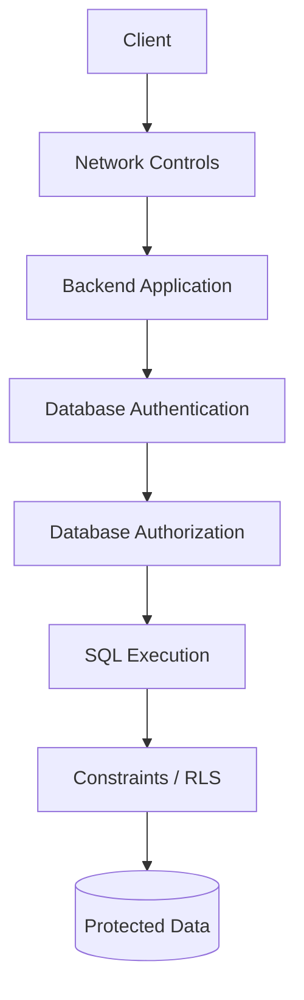
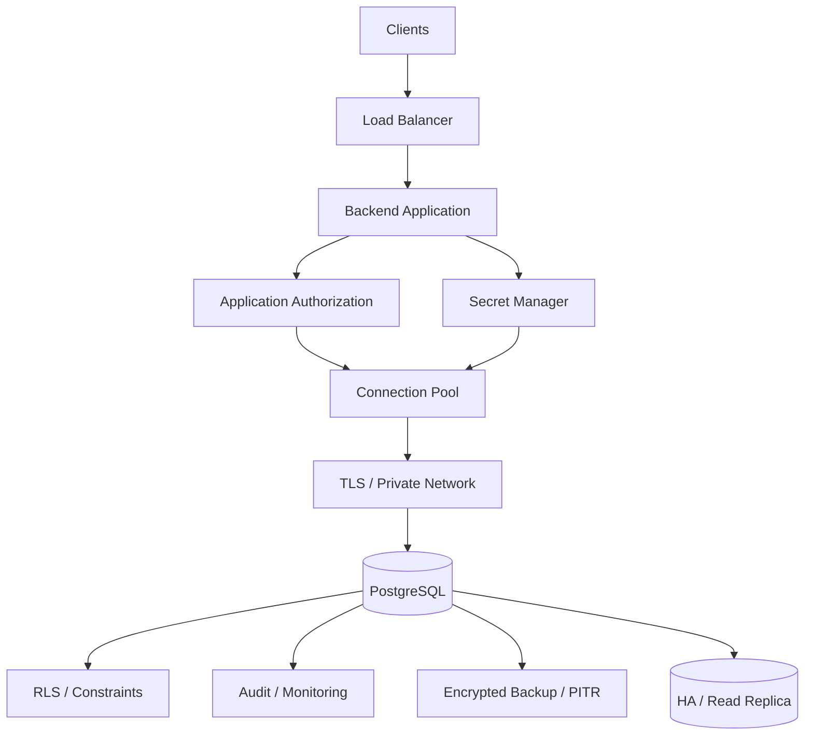

# 01- SQL Security Fundamentals

## Overview

SQL security protects the confidentiality, integrity, and availability of data stored in relational databases.

For backend systems, database security is not limited to preventing SQL injection. A production security model must address the entire path:

```text
Client
  │
  ▼
Nginx / Load Balancer
  │
  ▼
Backend Application
  │
  ├── Authentication
  ├── Authorization
  ├── Input Validation
  └── Query Construction
  │
  ▼
Database Driver
  │
  ▼
PostgreSQL
  │
  ├── Authentication
  ├── Authorization
  ├── Roles
  ├── Row-Level Security
  ├── Constraints
  └── Auditing
```

The most important security principle is:

> **Assume every layer can fail and enforce critical security boundaries as close to the data as practical.**

A secure SQL architecture therefore combines:

- Secure application code
- Parameterized queries
- Strong database authentication
- Least-privilege authorization
- Secure network placement
- Encryption
- Secret management
- Database constraints
- Row-level security where appropriate
- Auditing and monitoring
- Safe operational practices
- Backup and recovery protection

---

## Security Objectives

Database security generally protects three properties.

| Property | Goal | Example |
|---|---|---|
| Confidentiality | Prevent unauthorized access | User cannot read another tenant's data |
| Integrity | Prevent unauthorized modification | Application cannot modify protected records |
| Availability | Keep database usable | Prevent connection exhaustion or destructive operations |

These properties overlap.

For example, SQL injection can compromise:

```text
Confidentiality → Read sensitive data
Integrity       → Modify/delete data
Availability    → Execute expensive or destructive operations
```

---

## Database Security Model

A production PostgreSQL security model typically contains several layers:



Each layer answers a different question:

- **Network:** Who can reach the database?
- **Authentication:** Who is connecting?
- **Authorization:** What can that identity do?
- **SQL safety:** Can input alter query meaning?
- **RLS:** Which rows can the identity access?
- **Constraints:** Which data states are valid?
- **Auditing:** What happened and who did it?

No single control should be expected to provide complete protection.

---

## Threat Model

Before choosing controls, identify what must be protected.

Typical database assets include:

- Customer information
- Authentication data
- Financial records
- Business transactions
- Internal configuration
- Audit records
- Personally identifiable information
- API-related data
- Credentials and secrets

Potential threats include:

- SQL injection
- Credential theft
- Excessive database privileges
- Compromised application servers
- Public database exposure
- Insider misuse
- Data exfiltration
- Accidental destructive queries
- Vulnerable dependencies
- Insecure backups
- Misconfigured replicas
- Tenant-isolation failures

Security controls should be selected based on the actual threat model rather than applied mechanically.

---

## SQL Injection

SQL injection occurs when untrusted input changes the structure or meaning of a SQL statement.

Unsafe construction:

```python
query = f"""
    SELECT id, email
    FROM users
    WHERE email = '{email}'
"""
```

If `email` contains SQL syntax, the resulting query can become structurally different from what the application intended.

The fundamental problem is:

```text
SQL structure + untrusted data
          ↓
Ambiguous interpretation
```

---

## Parameterized Queries

Parameterized queries keep SQL structure separate from values.

```python
cursor.execute(
    """
    SELECT id, email
    FROM users
    WHERE email = %s
    """,
    (email,),
)
```

The driver sends the query and parameter values using the database protocol rather than constructing SQL by string concatenation.

Conceptually:

```text
SQL template
     +
Parameter value
     ↓
Database Driver
     ↓
PostgreSQL
```

### Advantages

- Prevents common SQL injection attacks
- Separates query structure from data
- Handles escaping correctly
- Improves code clarity

### Production Rule

Use parameter binding for values whenever the database driver or ORM supports it.

---

## ORM Security

Django ORM and other mature ORMs normally parameterize values when used through their standard APIs.

Safe:

```python
User.objects.filter(email=email)
```

The ORM generates SQL with parameters rather than interpolating the value directly.

However, raw SQL remains possible:

```python
from django.db import connection

with connection.cursor() as cursor:
    cursor.execute(
        "SELECT id FROM users WHERE email = %s",
        [email],
    )
```

The security boundary still applies.

Using an ORM does not mean the application is automatically immune to SQL injection.

---

## Raw SQL

Raw SQL is sometimes appropriate for:

- Complex queries
- Database-specific functionality
- Performance-sensitive operations
- Administrative tasks
- Features not exposed conveniently by an ORM

The correct approach is still parameter binding.

Unsafe:

```python
cursor.execute(
    f"SELECT id FROM orders WHERE customer_id = {customer_id}"
)
```

Safe:

```python
cursor.execute(
    "SELECT id FROM orders WHERE customer_id = %s",
    [customer_id],
)
```

---

## Dynamic SQL Identifiers

Parameterized values and SQL identifiers are different.

This is valid:

```sql
SELECT *
FROM orders
WHERE customer_id = $1;
```

But a table or column identifier generally cannot be supplied as an ordinary value parameter.

For dynamic identifiers, use an explicit allow-list.

```python
ALLOWED_SORT_FIELDS = {
    "created_at": "created_at",
    "total": "total",
    "status": "status",
}

sort_field = ALLOWED_SORT_FIELDS.get(sort_field)
if sort_field is None:
    raise ValueError("Unsupported sort field")
```

Then construct only from trusted allow-listed identifiers.

Never accept arbitrary SQL fragments from clients.

---

## Authentication vs Authorization

These concepts must remain separate.

### Authentication

Answers:

> Who are you?

Examples:

- Database username/password
- IAM-based authentication
- Certificates
- Service identity

### Authorization

Answers:

> What are you allowed to do?

Examples:

- `SELECT`
- `INSERT`
- `UPDATE`
- `DELETE`
- Schema access
- Table access
- Row-level policies

A valid database login does not imply unrestricted access.

---

## PostgreSQL Roles

PostgreSQL uses roles to represent database identities and permissions.

A role may be used for:

- Application access
- Read-only access
- Migrations
- Administration
- Reporting
- Operations

Example:

```sql
CREATE ROLE app_readwrite
LOGIN PASSWORD 'use-a-secret-manager';

CREATE ROLE reporting
LOGIN PASSWORD 'use-a-secret-manager';
```

In production, credentials should not be embedded directly in SQL migration files or source code.

---

## Least Privilege

The application should have only the permissions it needs.

A normal application role might require:

```text
SELECT
INSERT
UPDATE
DELETE
```

but should not normally require:

```text
CREATE DATABASE
SUPERUSER
ALTER SYSTEM
```

Least privilege limits blast radius.

If an application is compromised:

```text
Attacker
   ↓
Application credentials
   ↓
Application role
   ↓
Limited database privileges
```

The attacker should not automatically gain administrative database control.

---

## Role Separation

Separate operational responsibilities when practical.

```text
Application Role
      │
      ├── CRUD on application data
      │
Migration Role
      │
      ├── Schema changes
      │
Admin Role
      │
      └── Full administration
```

This prevents normal application traffic from having unnecessary administrative privileges.

---

## Read-Only Roles

Reporting workloads often benefit from dedicated read-only roles.

```sql
GRANT CONNECT ON DATABASE app TO reporting;
GRANT USAGE ON SCHEMA public TO reporting;
GRANT SELECT ON ALL TABLES IN SCHEMA public TO reporting;
```

Future tables require appropriate default privileges if this role should automatically receive access to them.

Read-only roles reduce the risk of accidental or malicious modifications.

---

## Schema-Level Permissions

Permissions exist at multiple levels.

Conceptually:

```text
Database
   ↓
Schema
   ↓
Table
   ↓
Sequence / Function
   ↓
Rows
```

A role may have permission to connect to a database but still lack access to a particular schema or table.

Security reviews should therefore inspect effective privileges rather than only database login credentials.

---

## Row-Level Security

PostgreSQL Row-Level Security (RLS) allows access policies to restrict which rows a role can access.

For example:

```sql
ALTER TABLE orders ENABLE ROW LEVEL SECURITY;

CREATE POLICY tenant_isolation
ON orders
USING (
    tenant_id = current_setting('app.tenant_id')::uuid
);
```

Conceptually:

```text
Query
  ↓
Table
  ↓
RLS Policy
  ↓
Only authorized rows
```

This can provide defense in depth for multi-tenant systems.

---

## RLS and Application Context

A common pattern is to establish tenant context inside a transaction:

```sql
BEGIN;

SET LOCAL app.tenant_id = '00000000-0000-0000-0000-000000000001';

SELECT id, total
FROM orders;

COMMIT;
```

`SET LOCAL` limits the setting to the current transaction.

This is important with connection pooling because a PostgreSQL connection may later be reused by another request.

---

## RLS Production Considerations

RLS requires careful design.

Consider:

- Which roles are subject to policies
- Whether privileged roles can bypass RLS
- Policy behavior for reads
- Policy behavior for writes
- `USING` vs `WITH CHECK`
- Connection-pool lifecycle
- Tenant context propagation
- Testing unauthorized access

Do not assume enabling RLS alone guarantees complete tenant isolation.

Application authorization should remain explicit.

---

## `USING` vs `WITH CHECK`

RLS policies can control both which rows are visible and which rows can be created or modified.

Conceptually:

```sql
CREATE POLICY tenant_orders
ON orders
USING (
    tenant_id = current_setting('app.tenant_id')::uuid
)
WITH CHECK (
    tenant_id = current_setting('app.tenant_id')::uuid
);
```

`USING` controls rows available to operations such as `SELECT`, `UPDATE`, and `DELETE`.

`WITH CHECK` controls whether new or modified rows satisfy the policy.

This distinction matters for preventing cross-tenant inserts or updates.

---

## Application Authorization

Database permissions are not a replacement for application authorization.

For example:

```text
Authenticated user
      ↓
Application authorization
      ↓
Can user access order 123?
      ↓
Database query
```

The application should enforce business-level authorization such as:

- User owns the resource
- User belongs to the tenant
- User has the required role
- User has the required capability

RLS can provide defense in depth where appropriate.

---

## Tenant Isolation

Multi-tenant applications require especially careful authorization.

A vulnerable pattern is:

```python
Order.objects.get(id=order_id)
```

when the application should also enforce tenant ownership.

Prefer a tenant-scoped query:

```python
Order.objects.get(
    id=order_id,
    tenant_id=request.tenant.id,
)
```

The database can additionally enforce tenant isolation through constraints or RLS when appropriate.

---

## Network Security

The database should generally not be publicly reachable.

A safer architecture is:

```text
Internet
   │
   ▼
Load Balancer
   │
   ▼
Backend
   │
   ▼
Private Network
   │
   ▼
PostgreSQL
```

Restrict database network access using:

- Private subnets
- Security groups
- Network ACLs where appropriate
- Kubernetes NetworkPolicies
- Firewall rules
- Private endpoints

The principle is:

> **If a component does not need network access to PostgreSQL, it should not have it.**

---

## Public Database Exposure

A common dangerous configuration is:

```text
Internet
   │
   ▼
PostgreSQL :5432
```

Even strong passwords do not make public exposure desirable.

Publicly reachable databases increase:

- Attack surface
- Credential attack opportunities
- Scanning exposure
- Exploitation risk
- Operational risk

Prefer private connectivity and tightly controlled administrative access.

---

## TLS and Encryption in Transit

Database traffic can contain sensitive information.

Without encryption:

```text
Application ── plaintext ──> Database
```

With TLS:

```text
Application ═══ encrypted ═══> PostgreSQL
```

TLS protects data while it travels across the network.

Production considerations include:

- Certificate validation
- Certificate rotation
- Minimum TLS configuration
- Internal CA management where applicable
- Driver configuration

Encryption in transit does not replace authorization.

---

## Encryption at Rest

Database storage should generally use encryption at rest.

For cloud deployments this commonly includes:

- Encrypted database storage
- Encrypted snapshots
- Encrypted backup storage
- Key-management controls

Encryption at rest protects storage media if it is accessed outside the intended database security boundary.

It does not protect data from an authorized application role that is already able to query it.

---

## Secrets Management

Database credentials should be managed as secrets.

Avoid:

```python
DATABASE_PASSWORD = "production-password"
```

inside source code.

Avoid storing credentials in:

- Git repositories
- Docker images
- Public configuration
- CI logs
- Application logs

A cloud-oriented architecture might use:

```text
Application
    │
    ▼
AWS Secrets Manager
    │
    ▼
Database Credentials
    │
    ▼
Connection Pool
    │
    ▼
PostgreSQL
```

Other secret-management systems can provide the same architectural capability.

---

## Credential Rotation

Credentials should be rotatable without requiring source-code changes.

A production rotation process should consider:

```text
Create / rotate credential
        ↓
Update secret store
        ↓
Application refreshes configuration
        ↓
Existing connections drain
        ↓
New connections use new credential
        ↓
Old credential revoked
```

Connection pooling makes this particularly important because existing connections may continue using the old credentials until they are replaced.

---

## Password Storage

Passwords should not be stored as plaintext database values.

For application authentication, store passwords using a password-hashing algorithm designed for password storage, such as:

- Argon2id
- bcrypt
- scrypt

Do not use:

```text
MD5(password)
SHA256(password)
```

as a general password-storage strategy.

Password hashing and database encryption solve different problems.

---

## Sensitive Data Classification

Not every column requires the same controls.

Classify data based on sensitivity.

| Data | Typical Sensitivity | Example Control |
|---|---|---|
| Public product name | Low | Standard access control |
| User email | Moderate | Least privilege |
| Authentication secrets | High | Strong hashing / secret controls |
| Financial data | High | Encryption + strict access |
| Security audit records | High | Restricted write/read access |
| Tenant business data | High | Tenant isolation |

Security architecture should follow data sensitivity.

---

## SQL Injection Beyond `SELECT`

Injection is not limited to read queries.

Attackers may attempt to manipulate:

- `SELECT`
- `INSERT`
- `UPDATE`
- `DELETE`
- `ORDER BY`
- Filtering
- Search conditions
- Dynamic SQL
- Administrative statements

The impact can therefore include:

```text
Read
Write
Delete
Privilege abuse
Availability degradation
```

---

## Search and Filtering APIs

Search endpoints often construct dynamic queries.

For example:

```text
GET /orders?status=pending&customer_id=42
```

Values should be parameterized.

```python
filters = []

if status:
    filters.append(("status", status))

if customer_id:
    filters.append(("customer_id", customer_id))
```

With an ORM, construct expressions through its parameterized APIs rather than building SQL strings manually.

---

## Dynamic Sorting

A common security mistake is allowing arbitrary SQL in sorting.

Unsafe:

```text
GET /orders?sort=created_at DESC, pg_sleep(10)
```

Use an allow-list:

```python
ALLOWED_SORT_FIELDS = {
    "created_at": "created_at",
    "total": "total",
    "status": "status",
}
```

Then separately validate direction:

```python
if direction not in {"asc", "desc"}:
    raise ValueError("Invalid sort direction")
```

The important distinction is between **data values** and **SQL structure**.

---

## Stored Functions and Procedures

Database functions can also become security boundaries.

Consider:

- Who can execute the function?
- What tables can it access?
- Does it use dynamic SQL?
- Does it execute with invoker or definer privileges?
- Can untrusted users influence its inputs?

Dynamic SQL inside database functions must also use safe parameterization or identifier handling.

---

## `SECURITY DEFINER`

PostgreSQL functions can execute with the privileges of the function owner.

This is powerful and potentially dangerous.

A `SECURITY DEFINER` function can unintentionally become a privilege-escalation path if poorly designed.

Production considerations include:

- Secure `search_path`
- Restricting function execution privileges
- Avoiding unsafe dynamic SQL
- Validating inputs
- Minimizing owner privileges

Use elevated execution privileges only when the security model explicitly requires them.

---

## Search Path Security

Database object resolution can depend on `search_path`.

Security-sensitive functions should avoid relying on an attacker-controlled or unexpected search path.

Prefer schema-qualified object references where appropriate:

```sql
SELECT app_data.orders.id
FROM app_data.orders;
```

This reduces ambiguity in security-sensitive SQL.

---

## Database Extensions

PostgreSQL extensions can add powerful capabilities.

However, extensions should be treated as privileged infrastructure.

Review:

- Source and provenance
- Required privileges
- Version
- Security posture
- Upgrade process
- Compatibility

Do not allow arbitrary application users to install extensions.

---

## Database Constraints as Security Boundaries

Constraints primarily protect integrity, but they also provide security value by preventing invalid state.

Examples:

```sql
CHECK (amount >= 0)
```

and:

```sql
UNIQUE (idempotency_key)
```

Constraints reduce the impact of application bugs and concurrency races.

They should not be treated as authorization controls, but they are an important defense layer.

---

## Foreign Keys

Foreign keys prevent references to nonexistent records.

```sql
ALTER TABLE orders
ADD CONSTRAINT orders_customer_fk
FOREIGN KEY (customer_id)
REFERENCES customers(id);
```

They protect relational integrity even when multiple application processes modify the database concurrently.

---

## Secure Transactions

Transactions should be kept short and explicit.

Example:

```python
from django.db import transaction

with transaction.atomic():
    order = Order.objects.create(
        customer_id=customer_id,
        status="pending",
    )

    OrderEvent.objects.create(
        order=order,
        event_type="created",
    )
```

Avoid holding a transaction while performing:

- External HTTP requests
- Long computations
- User interaction
- Unbounded retries

Long transactions increase the impact of failures and can retain locks and database resources.

---

## Privilege Escalation

A database compromise becomes more severe when application credentials have excessive privileges.

Dangerous architecture:

```text
Application
    ↓
SUPERUSER
    ↓
Entire database
```

Better:

```text
Application
    ↓
Limited Role
    ↓
Required schemas/tables
```

Privilege escalation can occur through:

- Overly broad grants
- Unsafe functions
- Misconfigured ownership
- Excessive role inheritance
- Compromised administrative credentials

Review effective privileges periodically.

---

## Role Inheritance

PostgreSQL roles can inherit privileges from other roles.

This is useful for managing permissions but can make the effective authorization model difficult to understand.

Security reviews should consider:

```text
Direct grants
+
Role memberships
+
Inherited privileges
+
Object ownership
+
Function privileges
```

Do not inspect only direct grants when determining what an identity can actually do.

---

## Database Ownership

Object ownership provides significant authority.

A role that owns a table has privileges beyond ordinary application CRUD.

Avoid using a highly privileged migration/owner identity for normal application traffic.

Separate:

```text
Object owner
Application role
Migration role
Administrative role
```

when operationally practical.

---

## Audit Logging

Sensitive systems may require database-level auditing.

Useful audit information includes:

- Identity
- Timestamp
- Operation
- Object
- Result
- Source
- Request or correlation ID where available

A complete audit architecture may combine:

```text
Application Audit
       +
Database Audit
       +
Infrastructure Logs
```

Application logs provide business context; database logs provide database-level evidence.

---

## Logging and Sensitive Data

Do not blindly log every SQL parameter.

Logs can expose:

- Emails
- Tokens
- Personal information
- Financial information
- Secrets
- Internal identifiers

Use structured logging and appropriate redaction.

Security logs should also have controlled:

- Retention
- Access
- Encryption
- Export
- Monitoring

---

## Monitoring Security Events

Monitor for unusual behavior such as:

- Repeated authentication failures
- Unexpected privilege changes
- Unusual query volume
- Unexpected schema changes
- Large data exports
- New database roles
- Unusual administrative operations
- Sudden connection spikes

Database security monitoring should be correlated with application and infrastructure telemetry.

---

## SQL Injection Detection

Preventing injection is more important than detecting it after the fact.

Useful monitoring signals include:

- Database errors
- Unexpected query patterns
- WAF events
- Application validation failures
- Suspicious request parameters
- Unusual database access

Monitoring should supplement, not replace, parameterized queries.

---

## Denial of Service Through SQL

SQL injection is not the only SQL-related availability threat.

An authenticated user may also trigger expensive queries through legitimate functionality.

Examples:

```text
Unbounded search
Large export
Expensive aggregation
Huge OFFSET
Unrestricted reporting
```

Protect database capacity through:

- Pagination
- Query limits
- Statement timeouts
- Rate limiting
- Concurrency limits
- Async processing
- Resource isolation

---

## Connection Exhaustion

An attacker or faulty application can exhaust database connections.

```text
Requests
  │
  ▼
Application
  │
  ▼
Connection Pool
  │
  ├── Conn
  ├── Conn
  ├── Conn
  └── Conn
       ↓
   PostgreSQL limit
```

Use:

- Bounded connection pools
- Pool timeouts
- Request limits
- Database connection monitoring
- Separate operational capacity

Do not let application concurrency grow without bound.

---

## Backup Security

Backups contain the database's data and therefore require equivalent security consideration.

Protect:

- Backup storage
- Snapshots
- WAL archives
- Encryption keys
- Restore credentials
- Cross-region copies

Use appropriate:

- Encryption
- Access control
- Retention policies
- Audit logging
- Backup lifecycle management

---

## Backup Access

A backup repository should not be writable by every application role.

Prefer:

```text
Application
    X
    │
    │ no direct backup administration
    ▼

Backup System
    │
    ├── Restricted access
    ├── Encryption
    └── Audit
```

Separating application and backup privileges reduces the blast radius of an application compromise.

---

## High Availability Security

HA adds additional security-sensitive components:

```text
Primary
   │
   ├── Standby
   ├── Replication
   └── Failover Controller
```

Protect:

- Replication credentials
- Failover controller
- Promotion mechanisms
- Database endpoints
- Administrative APIs

A compromised failover mechanism could potentially redirect application traffic or promote an unauthorized node.

---

## Replication Security

Replication traffic should be protected using appropriate authentication and encryption.

Review:

- Replication user privileges
- Allowed replication sources
- TLS
- Network access
- Replication slot management
- Monitoring

Replication roles should have only the privileges necessary for replication.

---

## Read Replica Security

Read replicas can contain the same sensitive data as the primary.

Therefore:

```text
Primary security
≈
Replica security
```

Do not assume a replica is safe to expose broadly merely because it is read-only.

Apply appropriate:

- Network controls
- Authentication
- Authorization
- Encryption
- Monitoring

---

## Kubernetes Security

For PostgreSQL workloads running with Kubernetes, consider:

- NetworkPolicies
- Secrets management
- Service accounts
- Pod security
- Persistent volume access
- TLS
- RBAC
- Database operator permissions

The Kubernetes control plane and database security model are separate layers.

A Kubernetes workload being internal does not automatically make database access secure.

---

## Docker Security

Do not bake database credentials into images.

Unsafe:

```dockerfile
ENV DATABASE_PASSWORD=production-secret
```

Prefer runtime secret injection through the deployment environment or a dedicated secrets system.

Also avoid logging environment variables or connection strings containing credentials.

---

## CI/CD Security

CI/CD systems frequently have access to database credentials for migrations.

Separate responsibilities:

```text
CI/CD
  │
  ├── Migration credentials
  │
  └── Deployment credentials
```

Production migration credentials should be:

- Restricted
- Audited
- Rotated
- Available only to appropriate deployment jobs

Never expose secrets in build logs.

---

## Migration Security

Schema migrations can perform destructive operations.

Examples:

```sql
DROP TABLE
DELETE
ALTER TABLE
```

Production migration pipelines should include:

- Review
- Testing
- Approval where appropriate
- Backups
- Rollout planning
- Lock impact analysis

Avoid running arbitrary SQL from untrusted inputs through migration systems.

---

## Production Security Checklist

### Query Construction

- [ ] Values use parameterized queries.
- [ ] ORM APIs are used safely.
- [ ] Raw SQL is reviewed.
- [ ] Dynamic identifiers use allow-lists.
- [ ] Arbitrary SQL fragments are never accepted from clients.

### Authentication

- [ ] Database authentication is enabled.
- [ ] Credentials are centrally managed.
- [ ] Credentials can be rotated.
- [ ] Administrative access is separated.
- [ ] Authentication failures are monitored.

### Authorization

- [ ] Application roles use least privilege.
- [ ] Read-only roles exist where appropriate.
- [ ] Migration and application roles are separated.
- [ ] Role inheritance is understood.
- [ ] Object ownership is controlled.

### Data Isolation

- [ ] Tenant isolation is explicit.
- [ ] Application authorization is enforced.
- [ ] RLS is used where appropriate.
- [ ] `USING` and `WITH CHECK` policies are reviewed.
- [ ] Pooled connection context cannot leak between requests.

### Network

- [ ] PostgreSQL is not unnecessarily public.
- [ ] Private networking is used.
- [ ] Firewall/security-group rules are restrictive.
- [ ] Database traffic uses appropriate TLS protection.
- [ ] Administrative access is controlled.

### Data Protection

- [ ] Storage encryption is enabled where required.
- [ ] Backups are encrypted.
- [ ] Backup access is restricted.
- [ ] Sensitive data is classified.
- [ ] Passwords use appropriate password hashing.

### Operations

- [ ] Database activity is monitored.
- [ ] Privilege changes are auditable.
- [ ] Security-sensitive operations are logged.
- [ ] Query resource usage is controlled.
- [ ] Failover infrastructure is secured.
- [ ] Restore procedures are tested.

---

## Common Security Mistakes

### Building SQL with String Interpolation

**Problem:** untrusted input can change SQL structure.

**Better:** use parameterized queries.

### Assuming ORM Means Automatic Security

**Problem:** raw SQL, unsafe expressions, and dynamic SQL can still introduce vulnerabilities.

**Better:** understand the generated SQL and driver behavior.

### Using a Superuser for the Application

**Problem:** database compromise becomes total database compromise.

**Better:** use a narrowly privileged application role.

### Exposing PostgreSQL to the Internet

**Problem:** dramatically increases attack surface.

**Better:** use private networking and controlled administrative access.

### Storing Credentials in Git

**Problem:** secrets can persist in repository history even after deletion.

**Better:** use dedicated secret management and rotate compromised credentials.

### Logging Sensitive Query Parameters

**Problem:** logs become an alternative data-exfiltration path.

**Better:** redact sensitive values and control log access.

### Relying Only on Application Tenant Filtering

**Problem:** one missed filter can expose another tenant's data.

**Better:** use defense in depth, potentially including PostgreSQL RLS.

### Reusing Tenant Context on Pooled Connections

**Problem:** session state can accidentally affect a later request.

**Better:** use transaction-scoped context such as `SET LOCAL` and test pool behavior carefully.

### Giving Migration Permissions to the Application

**Problem:** an application compromise can become a schema-level compromise.

**Better:** separate migration and application roles.

### Treating Read Replicas as Less Sensitive

**Problem:** replicas usually contain the same sensitive data.

**Better:** apply equivalent security controls.

### Assuming Encryption Solves Authorization

**Problem:** encrypted storage does not prevent an authorized application from reading data.

**Better:** combine encryption with least privilege and access controls.

---

## Production Security Architecture

A mature backend architecture can look like:



The architecture provides multiple independent controls:

```text
Network isolation
      +
Authentication
      +
Least privilege
      +
Parameterized queries
      +
Application authorization
      +
RLS where appropriate
      +
Constraints
      +
Encryption
      +
Auditing
      +
Backup protection
```

---

## Security Testing

Security should be tested at multiple layers.

### Application Tests

Test:

- SQL injection attempts
- Authorization bypass
- Tenant isolation
- Invalid filters
- Dynamic sorting
- Large query inputs

### Database Tests

Verify:

- Role permissions
- RLS policies
- Constraint enforcement
- Function privileges
- Read-only roles
- Migration permissions

### Infrastructure Tests

Verify:

- Network reachability
- TLS configuration
- Security-group rules
- Secret access
- Backup access

A useful principle is:

> **Test that an unauthorized action fails, not only that an authorized action succeeds.**

---

## Security and Performance Trade-offs

Security controls can introduce operational cost.

Examples:

| Control | Security Benefit | Potential Cost |
|---|---|---|
| TLS | Protects network traffic | Encryption overhead |
| RLS | Row-level isolation | Policy evaluation complexity |
| Audit logging | Forensics | Storage / processing |
| Encryption | Data protection | Key management |
| Least privilege | Limits blast radius | Permission administration |
| Rate limiting | Protects capacity | Additional infrastructure |
| Query limits | Prevents abuse | Restricts some workloads |

The objective is not maximum restriction everywhere.

The objective is **appropriate security for the workload and threat model**.

---

## Security Review Questions

Before deploying a PostgreSQL-backed service, ask:

### Query Safety

- Are all user-controlled values parameterized?
- Can users influence SQL identifiers?
- Are dynamic SQL paths allow-listed?
- Are raw queries reviewed?

### Authorization

- Which database role does the application use?
- What can that role actually access?
- Are migration privileges separated?
- Can users access another tenant's rows?

### Network

- Is PostgreSQL private?
- Which workloads can connect?
- Is TLS configured appropriately?
- How is administrative access controlled?

### Secrets

- Where are credentials stored?
- How are they rotated?
- Can CI/CD expose them?
- Can application logs expose them?

### Data

- Which data is sensitive?
- Is it encrypted appropriately?
- Who can read it?
- Are backups protected?

### Operations

- Are privilege changes audited?
- Are suspicious access patterns monitored?
- Are backups restorable?
- Has the security model been tested during failover?

---

## Interview Traps

### Is SQL injection solved by using an ORM?

No. Standard ORM APIs generally parameterize values, but raw SQL, unsafe dynamic SQL, and unsafe query construction can still introduce injection vulnerabilities.

### Why is parameterization safer than escaping strings?

Parameterization keeps SQL structure separate from data and lets the database driver handle values correctly. Manual escaping is easier to get wrong and should not be treated as the primary security mechanism.

### What is the difference between authentication and authorization?

Authentication establishes identity. Authorization determines what that identity is permitted to access or modify.

### Why shouldn't the application use a PostgreSQL superuser?

A compromised application credential would gain extremely broad database privileges, dramatically increasing the blast radius.

### Does private networking make PostgreSQL secure?

No. It reduces network exposure but does not protect against compromised applications, stolen credentials, excessive privileges, SQL injection, or authorization failures.

### Does encryption at rest prevent unauthorized database queries?

No. Encryption at rest protects stored data, but an authorized database role can still query decrypted data through PostgreSQL.

### Why use RLS if the application already filters by tenant?

RLS can provide defense in depth against application bugs or missed tenant filters. It does not replace application authorization and requires careful role, policy, and connection-context design.

### Why is `SET LOCAL` useful with connection pooling?

It scopes session configuration to the current transaction, reducing the risk that tenant or security context remains on a connection after it is returned to the pool.

### Are read replicas less sensitive than the primary?

Usually no. They can contain essentially the same data, so they require comparable access controls and protection.

### Why separate migration and application roles?

Schema-changing privileges are much more powerful than normal CRUD permissions. Separating them reduces the impact of an application compromise.

### Can database constraints improve security?

Constraints primarily protect integrity, but they can reduce the impact of application bugs and concurrency errors by preventing invalid database states.

### How can SQL cause denial of service without injection?

Legitimate functionality can execute expensive queries, huge exports, unbounded searches, or large aggregations. Rate limits, pagination, timeouts, concurrency limits, and asynchronous processing can protect database capacity.

### What is the senior-level approach to SQL security?

Treat security as a layered system: private networking, strong authentication, least-privilege roles, parameterized queries, explicit application authorization, RLS where appropriate, secure secrets, encryption, auditing, protected backups, resource controls, and continuous security testing.

## Key Takeaways

- **SQL security is a layered defense model** combining parameterized queries, authentication, authorization, network isolation, encryption, constraints, auditing, and protected backups.
- **Least privilege is one of the highest-value database controls**; application, migration, reporting, and administrative identities should receive only the permissions required for their responsibilities.
- **Parameterized queries prevent the core class of SQL injection vulnerabilities**, while dynamic identifiers and raw SQL require explicit allow-listing and careful review.
- **Application authorization and database-level controls should complement each other**; RLS can provide valuable defense in depth for tenant isolation when its role and connection-context semantics are designed correctly.
- **Production database security includes operations and failure paths**, including secret rotation, backup protection, HA infrastructure, query resource limits, monitoring, auditing, and regular security testing.