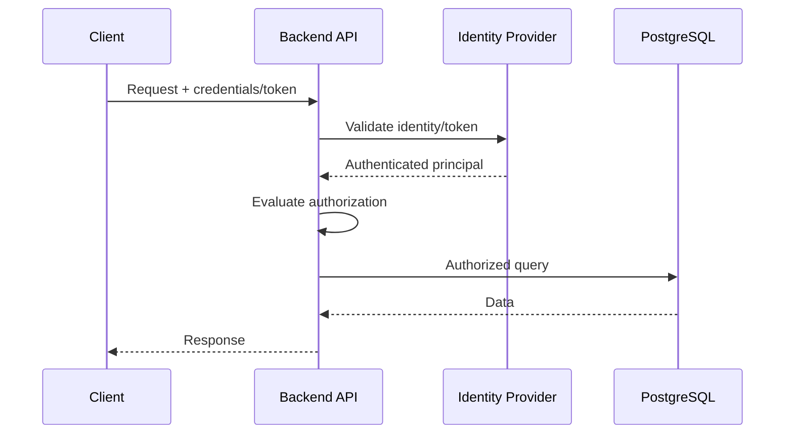
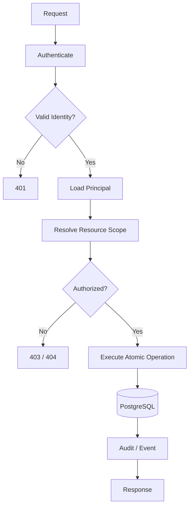

# 02- Authentication vs Authorization

## Overview

Authentication and authorization are related but fundamentally different security controls.

- **Authentication (AuthN)** establishes **who** is making a request.
- **Authorization (AuthZ)** determines **what that identity is allowed to do**.

A production backend commonly processes a request through both:

```text
Client
  │
  ▼
Nginx / Load Balancer
  │
  ▼
Authentication
  │
  │ Who is this?
  ▼
Identity / Principal
  │
  ▼
Authorization
  │
  │ What can this identity do?
  ▼
Application Logic
  │
  ▼
Database
```

Confusing these responsibilities creates serious vulnerabilities. A user can be successfully authenticated while still being unauthorized to access a particular resource.

For SQL-backed systems, the distinction exists at multiple layers:

```text
Application Authentication
        ↓
Application Authorization
        ↓
Database Authentication
        ↓
Database Authorization
        ↓
Row-Level Security / Constraints
```

A senior backend engineer should understand where each decision is made, how identity propagates through the system, and how authorization remains correct across databases, services, queues, caches, replicas, and asynchronous workers.

---

## Authentication

Authentication verifies an identity.

Examples include:

- Username/password
- Session cookies
- API keys
- OAuth 2.0 / OpenID Connect
- JWT-based access tokens
- Mutual TLS
- Cloud workload identity
- Database usernames and credentials

Conceptually:

```text
Credentials / Token
        ↓
Authentication System
        ↓
Verified Identity
        ↓
Principal
```

The resulting principal might contain information such as:

```text
user_id = 123
tenant_id = 42
roles = ["support"]
```

Authentication answers:

> **Who are you?**

It does not answer:

> **What are you allowed to access?**

---

## Authorization

Authorization evaluates whether an authenticated identity may perform an operation.

For example:

```text
User 123
  │
  ├── Authenticated?        YES
  │
  ├── Owns order 456?       YES
  │
  └── Can cancel order?     YES
```

Another request might be:

```text
User 123
  │
  ├── Authenticated?        YES
  │
  ├── Owns order 789?       NO
  │
  └── Authorization         DENY
```

Authorization typically considers:

- Identity
- Resource
- Action
- Tenant
- Roles
- Permissions
- Resource ownership
- Business state
- Context

---

## Authentication vs Authorization

| Aspect | Authentication | Authorization |
|---|---|---|
| Question | Who are you? | What can you do? |
| Purpose | Establish identity | Enforce access |
| Input | Credentials/token | Identity + resource + action + policy |
| Output | Principal | Allow / deny |
| Typical failure | `401 Unauthorized` | `403 Forbidden` |
| Happens | Before meaningful protected operations | After identity is established |
| Examples | Password, session, JWT | RBAC, ABAC, ownership |
| SQL equivalent | Database login | Database privileges / RLS |

HTTP terminology is slightly confusing: `401 Unauthorized` normally means authentication is required or failed, while `403 Forbidden` indicates that the server understood the identity but refuses the operation.

---

## Request Lifecycle

A typical REST request can flow through:



The key separation is:

```text
Authentication
      ↓
Identity
      ↓
Authorization
      ↓
Database operation
```

An authorization decision should not be made from an unverified identity.

---

## Principal

A **principal** is the identity that an authorization system evaluates.

Depending on the architecture, the principal may represent:

- Human user
- Service account
- API client
- Background worker
- Internal service
- Administrator

A backend request might establish:

```python
principal = {
    "user_id": 123,
    "tenant_id": 42,
    "roles": ["support"],
}
```

The principal becomes the input to authorization decisions.

---

## Authentication Factors

Authentication can use different factors.

| Factor | Example |
|---|---|
| Knowledge | Password |
| Possession | Hardware security key |
| Inherence | Biometrics |
| Cryptographic identity | Client certificate |
| Federated identity | OIDC identity provider |

Strong authentication often combines multiple factors.

For production applications, authentication should generally be delegated to mature identity infrastructure rather than implemented from scratch.

---

## Password Authentication

If an application manages passwords, passwords should never be stored directly.

Use a password hashing algorithm designed for password storage, such as:

- Argon2id
- bcrypt
- scrypt

Conceptually:

```text
Password
   ↓
Password Hashing
   ↓
Stored Password Hash
```

During login:

```text
Submitted Password
       ↓
Hash Verification
       ↓
Match?
   ├── Yes → Authenticated
   └── No  → Authentication failure
```

Password hashing is different from encryption. Passwords should generally be hashed because the application does not need to recover the original password.

---

## Sessions

Traditional web applications often use server-managed sessions.

Flow:

```text
Login
  ↓
Server validates credentials
  ↓
Server creates session
  ↓
Session identifier returned
  ↓
Client sends session cookie
  ↓
Server resolves identity
```

A secure session cookie should normally use appropriate attributes such as:

```text
Secure
HttpOnly
SameSite
```

Session storage may reside in:

- Application memory for limited deployments
- Redis
- Database
- Dedicated session infrastructure

For horizontally scaled systems, session state must be accessible consistently across instances or encoded into a secure client-side mechanism.

---

## Token-Based Authentication

API systems frequently use access tokens.

Conceptually:

```text
Client
  │
  │ Access Token
  ▼
API
  │
  ├── Validate token
  ├── Extract principal
  └── Authorize request
```

Tokens may be:

- Opaque
- JWTs
- Short-lived access tokens

JWTs can carry claims such as:

```json
{
  "sub": "123",
  "tenant_id": "42",
  "scope": "orders:read"
}
```

The application must still validate the token's authenticity, issuer, audience, expiration, and other relevant claims.

---

## JWT Authentication

A JWT is not inherently an authorization system.

A JWT may contain claims used for authorization, but the backend must decide whether those claims are:

- Trusted
- Current
- Appropriate for the requested resource
- Sufficient for the requested action

For example:

```text
JWT
 ↓
Signature validation
 ↓
Expiration / issuer / audience validation
 ↓
Principal
 ↓
Authorization policy
```

Do not treat possession of a valid JWT as permission to access every resource.

---

## Token Lifetime

Short-lived access tokens reduce the impact of token theft.

A common architecture is:

```text
Short-lived access token
        +
Longer-lived refresh mechanism
```

The exact lifetime depends on:

- Risk
- User experience
- Revocation requirements
- Infrastructure
- Compliance requirements

Long-lived bearer tokens increase the potential impact of theft.

---

## Token Revocation

Stateless tokens introduce a common trade-off.

If a token is valid until expiration:

```text
Issued token
     ↓
Valid
     ↓
User disabled
     ↓
Token may remain valid until expiry
```

Systems requiring immediate revocation may use:

- Short token lifetimes
- Token introspection
- Server-side session state
- Revocation lists
- Key rotation strategies
- Refresh-token rotation

The correct choice depends on the threat model.

---

## API Keys

API keys can authenticate machine clients.

For example:

```text
Authorization: Bearer <secret>
```

However, an API key generally represents an application or client identity rather than a human identity.

API keys should have:

- Limited scope
- Expiration/rotation strategy
- Secure storage
- Auditability
- Rate limits

Never treat API-key possession as unrestricted authorization.

---

## Database Authentication

Application authentication and database authentication are separate.

For example:

```text
User
 ↓
Backend authentication
 ↓
Application principal
 ↓
Backend database credentials
 ↓
PostgreSQL authentication
```

The database may see:

```text
app_service_role
```

rather than:

```text
user_123
```

This is normal for many architectures.

The application is responsible for mapping the user identity to an authorization decision.

---

## Database Authorization

Once PostgreSQL authenticates a connection, PostgreSQL applies database permissions.

For example:

```sql
GRANT SELECT, INSERT, UPDATE, DELETE
ON orders
TO app_service;
```

This answers:

> Can the database identity perform this database operation?

It does not necessarily answer:

> Can this particular human user access this particular order?

That distinction is critical.

---

## Two Authorization Layers

A typical application has:

```text
Application Authorization
        ↓
Can user 123 access order 456?
        ↓
Database Authorization
        ↓
Can application role SELECT from orders?
```

The application role might have access to every order table row while the application restricts each user to their own resources.

This is common, but it requires the application authorization layer to be correct.

---

## Resource Authorization

Authorization should normally evaluate the resource being accessed.

A dangerous pattern is:

```python
order = Order.objects.get(id=order_id)
```

followed by authorization assumptions elsewhere.

A safer pattern is to make the resource scope explicit:

```python
order = Order.objects.get(
    id=order_id,
    tenant_id=request.tenant.id,
)
```

Then additional business authorization can be applied.

The important principle is:

> **Authorization should be attached to the resource access path, not treated as unrelated middleware logic.**

---

## Ownership-Based Authorization

A common policy is resource ownership.

Example:

```text
User 123
  ↓
Order 456
  ↓
customer_id = 123
  ↓
ALLOW
```

If:

```text
customer_id != authenticated_user.id
```

the operation should be denied.

In Django:

```python
order = Order.objects.filter(
    id=order_id,
    customer_id=request.user.id,
).first()

if order is None:
    raise Http404
```

This combines resource lookup and ownership filtering.

---

## Tenant-Based Authorization

Multi-tenant systems should include tenant scope in authorization decisions.

```text
Principal
 ├── user_id = 123
 └── tenant_id = 42

Request
 └── order_id = 456

Authorization
 ├── order belongs to tenant 42?
 └── user allowed to perform operation?
```

A common database query pattern is:

```python
order = Order.objects.get(
    id=order_id,
    tenant_id=request.tenant.id,
)
```

Tenant context must be derived from trusted authentication and authorization state, not arbitrary request parameters.

---

## RBAC

**Role-Based Access Control (RBAC)** grants permissions through roles.

Example:

```text
User
  ↓
Role
  ↓
Permissions
```

For example:

```text
support_agent
    ├── ticket:read
    └── ticket:update

support_admin
    ├── ticket:read
    ├── ticket:update
    └── ticket:delete
```

### Advantages

- Simple mental model
- Easy to audit
- Easy to implement
- Works well for coarse-grained permissions

### Limitations

Large organizations can accumulate many roles.

This can create:

```text
Role explosion
     ↓
Many combinations
     ↓
Difficult administration
```

RBAC is usually strongest for stable organizational permissions.

---

## ABAC

**Attribute-Based Access Control (ABAC)** evaluates attributes.

For example:

```text
User.department = "finance"
AND
Resource.classification = "financial"
AND
Request.environment = "internal"
```

Authorization becomes:

```text
Policy
 +
Subject attributes
 +
Resource attributes
 +
Context
 ↓
Allow / Deny
```

ABAC is more expressive than basic RBAC but introduces greater policy complexity.

---

## ReBAC

**Relationship-Based Access Control (ReBAC)** evaluates relationships.

Example:

```text
User
  │ member_of
  ▼
Organization
  │ owns
  ▼
Project
  │ contains
  ▼
Document
```

A user may access a document because they are:

```text
member of organization
→ member of project
→ allowed to read project documents
```

ReBAC is useful for systems such as:

- Collaboration platforms
- Document systems
- Organization hierarchies
- Resource-sharing systems

---

## RBAC vs ABAC vs ReBAC

| Model | Primary Decision Basis | Best Fit |
|---|---|---|
| RBAC | Roles | Coarse organizational permissions |
| ABAC | Attributes/context | Complex policy conditions |
| ReBAC | Relationships | Resource-sharing and hierarchical systems |

Production systems can combine them.

For example:

```text
RBAC
  +
Tenant membership
  +
Resource ownership
  +
Resource state
```

---

## Permission Checks

Permissions should be explicit.

For example:

```python
if not request.user.has_perm("orders.cancel_order"):
    raise PermissionDenied
```

But permission checks alone may not be sufficient.

A user may have the capability:

```text
orders.cancel_order
```

while still being unauthorized to cancel:

```text
Order belonging to another tenant
```

Authorization often requires both:

```text
Capability
+
Resource scope
```

---

## Business-State Authorization

Authorization can depend on resource state.

Example:

```text
Can cancel order?
       │
       ├── User has cancel permission?
       │       ↓
       │      YES
       │
       └── Order status = pending?
               ↓
              YES
```

If the order is already shipped, authorization may deny the action even when the user has the general permission.

This is a business authorization rule rather than merely a database permission.

---

## Authorization in Django

Django provides authentication and permission primitives through its authentication framework.

A typical API may combine:

```python
from rest_framework.permissions import IsAuthenticated
```

with resource-specific authorization.

Conceptually:

```text
IsAuthenticated
       ↓
User identity established
       ↓
Resource permission
       ↓
Tenant / ownership check
       ↓
Business-state check
```

Authentication middleware should not be expected to enforce all resource-level authorization.

---

## Authorization in FastAPI

FastAPI commonly uses dependency injection for authentication and authorization.

Conceptually:

```python
from fastapi import Depends, HTTPException, status

def require_admin(user=Depends(get_current_user)):
    if "admin" not in user.roles:
        raise HTTPException(
            status_code=status.HTTP_403_FORBIDDEN,
            detail="Insufficient permissions",
        )

    return user
```

Resource-level authorization should still be performed where the resource is accessed.

Avoid creating a single global check that assumes every endpoint has identical authorization semantics.

---

## Authorization in gRPC

gRPC services typically authenticate requests through metadata, such as authorization credentials or mTLS identity.

The flow remains:

```text
gRPC Metadata
     ↓
Authentication
     ↓
Principal
     ↓
Authorization
     ↓
RPC Handler
```

Authorization can be implemented through:

- Interceptors
- Service-level policies
- Method-level permissions
- Resource checks

Method-level authorization should not replace resource-level authorization.

---

## Authorization in Microservices

Authentication and authorization become more complicated as services communicate.

Example:

```text
Client
  ↓
API Gateway
  ↓
Orders Service
  ↓
Payments Service
```

Questions include:

- Which user initiated the operation?
- Which service is calling?
- Is the service acting on behalf of a user?
- Which tenant is involved?
- Should downstream services trust upstream authorization?

A robust design distinguishes:

```text
End-user identity
        +
Calling service identity
```

Both can matter.

---

## Service-to-Service Authentication

Microservices should authenticate each other.

Common mechanisms include:

- mTLS
- OAuth 2.0 access tokens
- Workload identity
- Signed service credentials

For example:

```text
Orders Service
    │
    │ Service identity
    ▼
Payments Service
```

Authentication establishes that the caller really is the Orders Service.

Authorization then determines whether Orders Service may perform the requested operation.

---

## Propagating User Identity

Sometimes a downstream service needs the end-user context.

Conceptually:

```text
User
 ↓
Gateway
 ↓
Orders Service
 ↓
Payments Service

User identity ───────────────►
Service identity ────────────►
```

Do not blindly forward arbitrary client headers as trusted identity.

Identity propagation must use authenticated and integrity-protected mechanisms.

---

## API Gateway Authorization

An API gateway can perform coarse-grained checks:

```text
Token validation
Rate limiting
Scope validation
Network policy
```

But it should not necessarily own every authorization decision.

For example:

```text
Gateway:
    Can user call /orders?

Orders Service:
    Can user access order 123?
```

The service owning the resource should normally understand its resource-level authorization rules.

---

## Defense in Depth

A mature architecture may enforce authorization at multiple layers:

```text
Client
  ↓
API Authentication
  ↓
API Authorization
  ↓
Service Authorization
  ↓
Database Authorization
  ↓
RLS
  ↓
Data
```

These layers should not blindly duplicate one another.

Each should enforce controls appropriate to its responsibility.

---

## PostgreSQL Row-Level Security

PostgreSQL RLS can enforce row-level access policies.

Example:

```sql
ALTER TABLE orders ENABLE ROW LEVEL SECURITY;

CREATE POLICY tenant_isolation
ON orders
USING (
    tenant_id = current_setting('app.tenant_id')::uuid
);
```

This allows the database to participate directly in tenant isolation.

It is particularly useful as defense in depth for applications where accidental cross-tenant queries would have severe consequences.

---

## RLS and Application Authorization

RLS does not eliminate application authorization.

Consider:

```text
RLS:
    User can access tenant 42 rows

Application:
    User can cancel orders only when role = support_admin
    and order.status = pending
```

RLS answers a different question from business authorization.

Both may be required.

---

## Database Roles vs Application Roles

Do not automatically create one PostgreSQL role for every application user.

A common architecture is:

```text
Human users
    ↓
Application identity
    ↓
Application authorization
    ↓
Shared application DB role
    ↓
PostgreSQL
```

This is operationally simpler for many systems.

Database roles become more useful for:

- Service isolation
- Reporting
- Administrative access
- Migration operations
- Restricted workloads

---

## Authentication and Connection Pooling

Connection pooling introduces an important distinction.

A pool contains database connections authenticated as database identities.

For example:

```text
User A ─┐
User B ─┼──> Application Pool ──> PostgreSQL
User C ─┘
```

The database may see all requests as:

```text
app_service
```

Therefore application authorization must remain correct even though PostgreSQL sees a shared identity.

Session-level state can also leak between requests if it is not carefully managed.

For tenant context, transaction-scoped settings such as `SET LOCAL` are safer than persistent session state when using pooled connections.

---

## Authorization and Transactions

Authorization decisions should be consistent with the operation they protect.

Consider:

```text
Check permission
      ↓
Wait
      ↓
Update resource
```

The resource may change between the authorization check and update.

For sensitive operations, combine authorization-relevant predicates with atomic database operations where appropriate.

For example:

```sql
UPDATE orders
SET status = 'cancelled'
WHERE id = $1
  AND tenant_id = $2
  AND status = 'pending';
```

Then verify that exactly one row was modified.

This reduces race conditions between checking state and changing state.

---

## Authorization and Concurrency

A classic race is:

```text
Request A: Check order is pending
Request B: Change order state
Request A: Cancel order
```

The application can incorrectly assume that the earlier authorization/state check is still valid.

For critical transitions, use:

- Atomic updates
- Appropriate transaction isolation
- Row locks
- State constraints
- Version checks

Authorization and concurrency control are related because authorization often depends on resource state.

---

## Authorization and Caching

Caching can accidentally bypass authorization.

Dangerous pattern:

```text
GET /orders/123
       ↓
Cache key = "order:123"
```

If the response is user-specific but the cache key is not, one user's response could be returned to another user.

Prefer cache keys that reflect authorization scope where necessary:

```text
order:{tenant_id}:{order_id}
```

or ensure that the cached representation is genuinely safe to share.

Authorization must happen before returning data whose visibility is user-specific.

---

## Authorization and Redis

Redis often stores:

- Sessions
- Permissions
- Tokens
- Caches
- Rate-limit state

Redis itself must be protected.

Do not assume:

```text
Internal network = trusted
```

Use appropriate:

- Authentication
- Network isolation
- TLS where required
- ACLs
- Secret management

A compromised Redis instance can become a significant authentication or authorization risk.

---

## Authorization and Kafka

Kafka consumers may execute actions asynchronously.

A message might contain:

```json
{
  "event_type": "order.cancel_requested",
  "order_id": "123",
  "actor_id": "456",
  "tenant_id": "42"
}
```

The consumer should not blindly trust arbitrary event fields.

The event producer and consumer trust model must be explicit.

For sensitive operations, preserve enough authenticated context to support:

- Auditability
- Tenant isolation
- Idempotency
- Authorization requirements

---

## Authorization and Celery

Background jobs frequently run without an interactive user request.

For example:

```text
HTTP request
   ↓
Authorized operation
   ↓
Celery task
   ↓
Database update
```

Decide whether the job:

- Inherits the user's authorization context
- Acts as a trusted system operation
- Rechecks authorization at execution time

Do not blindly serialize sensitive authentication tokens into task payloads.

For delayed operations, resource state may have changed by execution time.

---

## Authorization Failures

Use consistent failure semantics.

Typical HTTP behavior:

| Situation | Response |
|---|---|
| Missing credentials | `401` |
| Invalid/expired credentials | `401` |
| Authenticated but insufficient permission | `403` |
| Resource intentionally hidden | Often `404` |
| Invalid request | `400` / validation-specific status |

Returning `404` for unauthorized resources can sometimes reduce resource enumeration by avoiding confirmation that a resource exists.

The correct choice depends on the application's security model.

---

## Avoiding User Enumeration

Authentication endpoints can accidentally reveal whether an account exists.

For example:

```text
"User does not exist"
```

versus:

```text
"Incorrect password"
```

can expose account existence.

For sensitive systems, use consistent responses and carefully controlled logging.

---

## Auditability

Authorization decisions should be auditable for sensitive operations.

Useful audit information includes:

```text
Timestamp
Actor
Tenant
Action
Resource
Decision
Request ID
Service
Reason / policy
```

For example:

```text
actor=123
tenant=42
action=order.cancel
resource=456
decision=deny
request_id=abc123
```

Avoid logging secrets or sensitive authentication material.

---

## Monitoring Authentication

Monitor:

- Authentication failures
- Account lockouts
- Token validation failures
- Unusual login locations where relevant
- Sudden authentication volume
- Credential rotation failures
- Service identity failures

Security events should be correlated with application and infrastructure telemetry.

---

## Monitoring Authorization

Monitor unusual authorization behavior such as:

- Repeated access denials
- Cross-tenant access attempts
- Sudden privilege changes
- Large permission changes
- Administrative operations
- Unusual resource enumeration

Monitoring should detect abuse without turning every normal denial into an alert.

---

## High Availability Considerations

Authentication infrastructure can become a dependency for every request.

A production design should consider:

```text
API
 │
 ├── Authentication service
 │
 └── Authorization dependencies
```

If the identity provider becomes unavailable, decide explicitly whether the application should:

- Fail closed
- Fail open for limited operations
- Accept already validated sessions/tokens
- Degrade specific functionality

For security-sensitive systems, authorization should generally fail closed.

---

## Scalability Considerations

Authentication and authorization can become high-volume paths.

Avoid making unnecessary remote authorization calls:

```text
Request
  ↓
Auth service
  ↓
Permission service
  ↓
Database
  ↓
Resource service
```

for every request if the architecture can safely avoid it.

Possible strategies include:

- Short-lived signed tokens
- Local token verification
- Cached policy metadata
- Efficient database authorization queries
- Coarse-grained gateway checks
- Resource-local authorization

Caching must never compromise authorization correctness.

---

## Security Boundaries

A useful senior-level model is:

```text
Authentication establishes identity.

Authorization establishes permitted actions.

Database authorization establishes what the database identity can do.

RLS establishes which rows are visible/modifiable.

Constraints establish which states are valid.
```

These controls solve different problems.

---

## Common Mistakes

### Authentication Implies Authorization

**Problem:** A valid login is treated as permission to access all resources.

**Better:** Perform explicit resource and action authorization.

### Checking Only the User ID

**Problem:** `user_id` may identify the user but does not prove ownership of a resource.

**Better:** Scope queries by tenant, ownership, or explicit policy.

### Relying Only on the API Gateway

**Problem:** Internal service endpoints may bypass gateway authorization.

**Better:** Resource-owning services should enforce their own authorization boundaries.

### Trusting Client-Supplied Tenant IDs

Unsafe:

```text
GET /orders?tenant_id=other-tenant
```

**Problem:** Client-controlled tenant context can become an authorization bypass.

**Better:** Derive tenant identity from authenticated and authorized context.

### Treating JWT Claims as Automatically Authoritative

**Problem:** A valid token does not mean every claim is appropriate for every resource.

**Better:** Validate token metadata and apply resource-level authorization.

### Caching User-Specific Responses Globally

**Problem:** Incorrect cache keys can leak another user's data.

**Better:** Include authorization scope in cache identity or avoid caching user-specific representations.

### Sharing Excessive Service Credentials

**Problem:** One compromised service gains access to unrelated systems.

**Better:** Use separate service identities and least privilege.

### Logging Authentication Tokens

**Problem:** Logs become a credential theft vector.

**Better:** Redact tokens and secrets.

### Ignoring Delayed Authorization

**Problem:** A background job executes based on stale assumptions.

**Better:** Define whether authorization is evaluated at request time, execution time, or both.

---

## Production Authorization Pattern

A robust resource operation often follows:



The important property is that authorization is connected to the resource operation rather than treated as a generic login check.

---

## Production Design Principles

### Keep Authentication Centralized

Use a consistent identity mechanism across services.

### Keep Authorization Close to the Resource

The service that owns a resource should understand its resource-level access rules.

### Use Least Privilege

Apply least privilege at:

- Application level
- Service level
- Database level
- Infrastructure level

### Use Defense in Depth

For sensitive systems:

```text
Authentication
+
Application authorization
+
Database permissions
+
RLS where appropriate
+
Constraints
+
Auditing
```

### Make Authorization Atomic Where Necessary

If authorization depends on mutable resource state, combine the relevant condition with the protected database operation where possible.

### Treat Internal Traffic as Untrusted

Private networking does not eliminate authentication and authorization requirements between services.

---

## Security Review Checklist

### Authentication

- [ ] Identity is established before protected operations.
- [ ] Credentials are validated securely.
- [ ] Passwords use strong password hashing where applicable.
- [ ] Access tokens have appropriate lifetime and validation.
- [ ] Authentication secrets are not logged.
- [ ] Credential rotation is supported.

### Authorization

- [ ] Every protected endpoint has an explicit authorization policy.
- [ ] Resource ownership is enforced.
- [ ] Tenant boundaries are enforced.
- [ ] Business-state restrictions are enforced.
- [ ] Service-to-service authorization is defined.
- [ ] Background-job authorization semantics are defined.

### Database

- [ ] Application database roles use least privilege.
- [ ] Migration roles are separated.
- [ ] RLS is considered for sensitive tenant isolation.
- [ ] Database permissions are periodically reviewed.
- [ ] Sensitive database functions are secured.

### Caching and Messaging

- [ ] User-specific cache keys are scoped correctly.
- [ ] Redis access is authenticated and restricted.
- [ ] Kafka events have a defined trust model.
- [ ] Celery tasks do not expose sensitive credentials.
- [ ] Delayed operations account for changed resource state.

### Operations

- [ ] Authentication events are monitored.
- [ ] Authorization failures are observable.
- [ ] Sensitive authorization decisions are auditable.
- [ ] Identity dependencies have HA planning.
- [ ] Security controls are tested during failover.

---

## Interview Traps

### Can a user be authenticated but unauthorized?

Yes. Authentication proves identity; authorization determines whether that identity can perform the requested operation.

### Why isn't a valid JWT enough?

A valid JWT proves that the token is authentic and valid according to the application's validation rules. It does not automatically establish access to every resource.

### Should authorization happen in middleware?

Coarse-grained authorization can be handled in middleware or dependencies, but resource-level authorization should normally occur close to the code that accesses the resource.

### Should every user have a PostgreSQL login?

Usually not. Many applications use a shared application database role and enforce human-user authorization in the application layer. Separate database roles are more useful for service, reporting, migration, and administrative boundaries.

### Why can RLS be valuable if the application already checks tenant IDs?

RLS provides defense in depth against application bugs or missed tenant filters. It does not replace business-level authorization.

### Why is authorization related to concurrency?

If authorization depends on mutable resource state, the state can change between the authorization check and the operation. Atomic database predicates, locking, or appropriate transaction controls can prevent race conditions.

### Where should authorization live in a microservice architecture?

The resource-owning service should normally enforce resource-level authorization. Gateways can provide coarse-grained controls, but internal services should not blindly trust that a previous layer performed every authorization check.

### What is the biggest difference between RBAC and ABAC?

RBAC primarily evaluates roles, while ABAC evaluates attributes and context. RBAC is simpler; ABAC is more expressive but generally more complex to manage.

### What makes ReBAC different?

ReBAC evaluates relationships between identities and resources, making it particularly useful for systems where access follows organization, project, membership, sharing, or ownership relationships.

### What is the senior-level approach?

Treat authentication as identity establishment and authorization as a separate, explicit policy system. Propagate trusted identity, enforce resource-level authorization at the owning service, use least privilege at the database boundary, and design authorization consistently across transactions, caches, queues, replicas, and microservices.

## Key Takeaways

- **Authentication answers who the caller is; authorization answers what that identity may do.** A successful authentication must never be treated as blanket resource access.
- **Resource-level authorization should be explicit and close to the resource operation**, incorporating tenant, ownership, role, permission, and business-state constraints where required.
- **Database authorization and application authorization solve different problems**; least-privilege database roles protect the database boundary while application policies protect user and business-level access.
- **RLS, atomic SQL, transactions, and carefully scoped cache/message operations provide defense in depth**, especially for multi-tenant and concurrency-sensitive systems.
- **Senior authorization design accounts for the entire distributed system**, including service identities, background jobs, caching, messaging, observability, HA, secret management, and failure behavior.