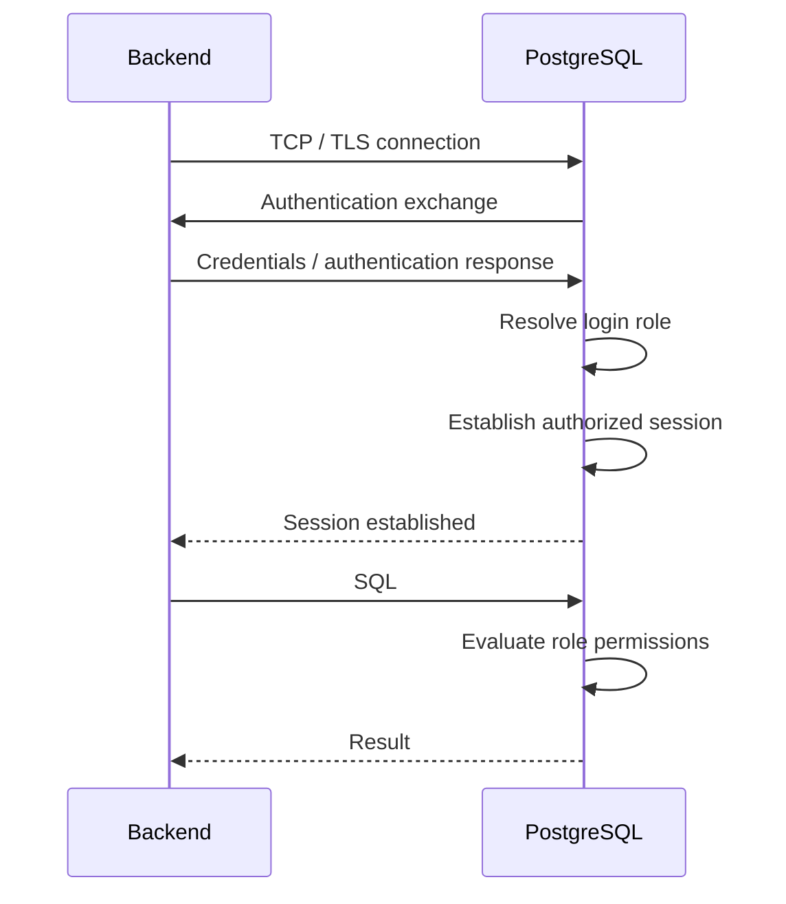
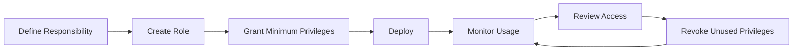
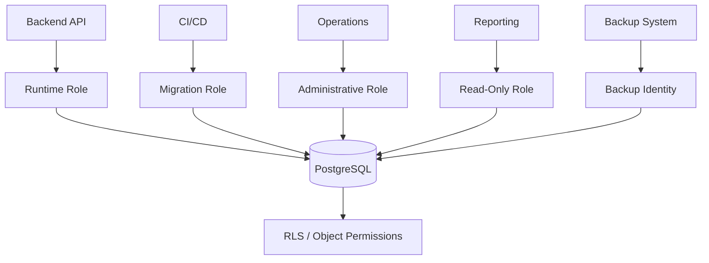

# 03- Database Users and Roles

## Overview

Database users and roles define **who can connect to a database and what that identity is allowed to do**.

In PostgreSQL, the security model is centered around **roles**. A role can:

- Authenticate to PostgreSQL when it has `LOGIN`.
- Own database objects.
- Receive privileges.
- Inherit privileges from other roles.
- Become a member of other roles.
- Grant privileges or memberships where permitted.
- Represent an application, service, administrator, reporting process, or human operator.

A production database should not use one highly privileged identity for every operation.

A stronger model separates responsibilities:

```text
                         PostgreSQL
                             │
          ┌──────────────────┼──────────────────┐
          │                  │                  │
    Application Role    Migration Role    Administrative Role
          │                  │                  │
       CRUD only        Schema changes       Operations
          │                  │                  │
          └──────────────────┼──────────────────┘
                             │
                       Database Objects
```

The fundamental principle is:

> **Authenticate with the narrowest identity that can safely perform the required operation, and grant privileges through controlled roles rather than broad individual access.**

---

## Users vs Roles

PostgreSQL uses a unified **role** concept rather than maintaining completely separate user and group-user systems.

Historically, PostgreSQL documentation and tooling often use the term "user" for roles that have the `LOGIN` attribute.

A role can therefore represent either:

- A login identity
- A permission group
- An object owner
- A service identity
- An administrative identity

Conceptually:

```text
Role
 ├── LOGIN?            → Can establish a session
 ├── Privileges        → What it can access
 ├── Memberships       → Other roles it belongs to
 ├── Ownership         → Objects it owns
 └── Attributes        → Administrative capabilities
```

This unified model makes role-based access control practical for database operations.

---

## Login Roles vs Group Roles

A useful production distinction is:

```text
Login Role
    │
    └── Represents an identity

Group Role
    │
    └── Represents a permission set
```

For example:

```sql
CREATE ROLE app_readwrite NOLOGIN;

CREATE ROLE orders_service
LOGIN
PASSWORD 'managed-outside-source-control';

GRANT app_readwrite TO orders_service;
```

Here:

- `orders_service` is the login identity.
- `app_readwrite` represents the permission set.

This separation makes permission management easier to audit and change.

---

## Why Separate Roles from Permissions?

Consider multiple application instances:

```text
orders-api-1
orders-api-2
orders-api-3
```

If permissions are granted independently to every identity, permission changes become harder to manage.

Instead:

```text
app_readwrite
      │
      ├── SELECT
      ├── INSERT
      ├── UPDATE
      └── DELETE
           │
           ▼
orders_service
```

Changing the permission set can then be done at the group-role level.

This is particularly useful for:

- Microservices
- Reporting systems
- Multiple deployment environments
- Operational tooling
- Temporary access
- Large teams

---

## Creating Roles

A non-login permission role:

```sql
CREATE ROLE app_readwrite NOLOGIN;
```

A login role:

```sql
CREATE ROLE orders_service
LOGIN
PASSWORD 'managed-through-a-secret-system';
```

For production systems, credentials should not be hard-coded in:

- Source repositories
- Migration files
- Docker images
- CI configuration
- Documentation
- Application logs

Use a dedicated secret-management mechanism instead.

---

## Role Attributes

PostgreSQL roles have attributes that affect their capabilities.

Common attributes include:

| Attribute | Purpose |
|---|---|
| `LOGIN` | Allows the role to establish a database session |
| `SUPERUSER` | Provides very broad administrative authority |
| `CREATEDB` | Allows database creation |
| `CREATEROLE` | Allows role management |
| `REPLICATION` | Allows replication connections |
| `BYPASSRLS` | Allows bypassing row-level security |
| `INHERIT` | Controls inheritance of privileges from roles |

These attributes should be granted conservatively.

A normal application runtime role generally should not have administrative attributes.

---

## `LOGIN`

`LOGIN` determines whether a role can authenticate and establish a database session.

```sql
CREATE ROLE app_runtime
LOGIN
PASSWORD 'managed-by-secret-manager';
```

A permission-only role can use:

```sql
CREATE ROLE app_runtime_permissions NOLOGIN;
```

This allows:

```text
Identity
   ↓
app_runtime
   ↓
Permission set
   ↓
app_runtime_permissions
```

---

## `NOLOGIN`

`NOLOGIN` roles are useful as permission containers.

Example:

```sql
CREATE ROLE reporting_readonly NOLOGIN;

GRANT SELECT
ON ALL TABLES IN SCHEMA reporting
TO reporting_readonly;
```

A login identity can then receive the role:

```sql
GRANT reporting_readonly TO analyst_service;
```

This creates a useful separation:

```text
Identity
    ≠
Permission set
```

---

## `SUPERUSER`

A PostgreSQL superuser has extremely broad authority and can bypass many ordinary permission checks.

A compromised superuser credential can therefore become a full database compromise.

Avoid:

```text
Application
    ↓
SUPERUSER
```

Prefer:

```text
Application
    ↓
Limited runtime role
    ↓
Required objects only
```

Administrative access should use separate, tightly controlled identities.

---

## `CREATEDB`

`CREATEDB` allows a role to create databases.

Application services normally do not require this capability.

Granting it unnecessarily increases the blast radius of a compromised application credential.

---

## `CREATEROLE`

`CREATEROLE` provides significant role-management capabilities.

It should normally be restricted to:

- Database administrators
- Carefully controlled automation
- Infrastructure management

A normal application runtime role should not require the ability to create or modify database identities.

---

## `REPLICATION`

Replication identities require specialized privileges.

Conceptually:

```text
Primary
  │
  │ WAL / replication
  ▼
Standby
```

A dedicated replication identity should not be reused as the application's normal database identity.

Replication credentials should also be protected like other privileged credentials.

---

## `BYPASSRLS`

PostgreSQL Row-Level Security (RLS) can restrict which rows a role can access.

A role with `BYPASSRLS` can bypass RLS policies.

This makes `BYPASSRLS` particularly sensitive in multi-tenant systems.

When using RLS, explicitly review:

- Which roles are subject to policies
- Which roles own the tables
- Which roles have `BYPASSRLS`
- Which roles are used by application connections

---

## `INHERIT`

Role membership and privilege inheritance are separate concepts from authentication.

A role can belong to another role:

```sql
GRANT app_readwrite TO orders_service;
```

The effective privileges depend on the role membership and its inheritance behavior.

A security review should therefore consider:

```text
Direct grants
+
Role memberships
+
Inheritance
+
SET ROLE
+
Object ownership
+
Special role attributes
```

Do not determine effective permissions by looking only at direct grants.

---

## `SET ROLE`

PostgreSQL allows a session to change its effective role when the appropriate membership and delegation rules permit it.

Conceptually:

```text
Authenticated Role
       ↓
    SET ROLE
       ↓
Effective Role
       ↓
Database Operation
```

This can support controlled privilege separation.

It should not be treated as arbitrary privilege escalation. The ability to switch roles must itself be governed by PostgreSQL's role-membership rules.

---

## `PUBLIC`

PostgreSQL has a special pseudo-role called `PUBLIC`.

Privileges granted to `PUBLIC` apply broadly to roles.

For example:

```sql
GRANT SELECT
ON orders
TO PUBLIC;
```

This can unintentionally expose data to identities that should not have access.

Review `PUBLIC` privileges carefully, especially for:

- Tables
- Schemas
- Functions
- Sequences

Least-privilege designs generally avoid unnecessary broad grants.

---

## Object Ownership

Ownership is different from ordinary privileges.

An object owner has significant authority over that object.

For example:

```text
Schema owner
     ↓
Tables
     ↓
Indexes / sequences / functions
```

This is why using the runtime application role as the permanent owner of every database object can weaken privilege separation.

A stronger design can use:

```text
Object Owner / Migration Role
        ↓
Owns application objects

Runtime Role
        ↓
Uses application objects
```

---

## Application Role Design

A production PostgreSQL deployment might use:

```text
app_owner
    NOLOGIN
    │
    └── Owns application objects

app_runtime
    LOGIN
    │
    └── Normal CRUD

app_readonly
    LOGIN
    │
    └── Reporting / diagnostics

app_migration
    LOGIN
    │
    └── Controlled schema changes

app_admin
    LOGIN
    │
    └── Restricted administration
```

The exact model depends on the deployment and operational requirements.

The important principle is:

> **Runtime traffic should not need privileges that exist only for administration.**

---

## Read-Only Roles

Read-only roles are useful for:

- Reporting
- Analytics
- Operational inspection
- Debugging
- Internal tools
- Read-only workloads

Example:

```sql
CREATE ROLE reporting_readonly NOLOGIN;

GRANT CONNECT
ON DATABASE app
TO reporting_readonly;

GRANT USAGE
ON SCHEMA public
TO reporting_readonly;

GRANT SELECT
ON ALL TABLES IN SCHEMA public
TO reporting_readonly;
```

Future objects require appropriate default privileges if they should automatically receive access.

---

## Default Privileges

A normal `GRANT` affects existing objects.

Default privileges control privileges granted to objects created in the future by a particular object-creating role.

For example:

```sql
ALTER DEFAULT PRIVILEGES
FOR ROLE app_owner
IN SCHEMA public
GRANT SELECT
ON TABLES
TO reporting_readonly;
```

This distinction matters operationally.

Without appropriate default privileges:

```text
Existing tables → accessible

New tables
    ↓
May not have expected permissions
```

This can cause unexpected failures after migrations.

---

## Schema Privileges

Schema access and table access are separate.

For example:

```sql
GRANT USAGE
ON SCHEMA app
TO app_runtime;
```

Then table privileges:

```sql
GRANT SELECT, INSERT, UPDATE, DELETE
ON ALL TABLES IN SCHEMA app
TO app_runtime;
```

A role can therefore have permission to access a schema while still lacking permission on a particular table.

---

## Sequence Privileges

Sequences are separate PostgreSQL objects.

This matters for sequence-backed identifiers.

For example:

```sql
GRANT USAGE, SELECT
ON ALL SEQUENCES IN SCHEMA app
TO app_runtime;
```

A role may have table-level insert permission but still encounter permission errors if required sequence privileges are missing.

Identity columns can simplify application-level identifier generation, but PostgreSQL object privileges still need to be understood.

---

## Function Privileges

Functions have their own privileges.

Example:

```sql
GRANT EXECUTE
ON FUNCTION app.calculate_total(integer)
TO app_runtime;
```

Functions become particularly security-sensitive when they:

- Access protected tables
- Execute dynamic SQL
- Run with elevated privileges
- Accept user-controlled input

---

## `SECURITY DEFINER`

A PostgreSQL function defined as `SECURITY DEFINER` executes with the privileges of its owner.

Conceptually:

```text
Low-privilege caller
       ↓
SECURITY DEFINER function
       ↓
Elevated privileges
       ↓
Protected operation
```

This can be useful for exposing a narrowly controlled privileged operation.

It can also create a privilege-escalation vulnerability.

Security-sensitive functions should consider:

- Secure `search_path`
- Schema-qualified object references
- Strict input validation
- Safe dynamic SQL
- Minimal owner privileges
- Restricted `EXECUTE` permissions

Do not grant broad execution access to privileged functions without reviewing their complete behavior.

---

## Role Membership

Role membership can be inspected through PostgreSQL system catalogs.

For example:

```sql
SELECT
    member.rolname AS member,
    parent.rolname AS granted_role
FROM pg_auth_members m
JOIN pg_roles parent
    ON parent.oid = m.roleid
JOIN pg_roles member
    ON member.oid = m.member;
```

This helps identify the role graph:

```text
User / Service
      ↓
Role Membership
      ↓
Inherited Permissions
      ↓
Effective Access
```

This is useful during security reviews and incident response.

---

## Inspecting Roles with `psql`

Useful `psql` commands include:

```text
\du
```

for roles and role attributes.

```text
\l+
```

for databases and database-level information.

```text
\dp
```

for table and sequence privileges.

```text
\dn+
```

for schema information.

These commands are useful during:

- Permission reviews
- Incident investigation
- Deployment troubleshooting
- Access audits

---

## Granting Privileges

Privileges can be granted at different object levels.

For example:

```sql
GRANT SELECT
ON TABLE orders
TO reporting_readonly;
```

Multiple privileges:

```sql
GRANT SELECT, INSERT, UPDATE
ON TABLE orders
TO app_runtime;
```

Avoid broad grants merely because they are convenient.

Prefer the smallest scope that satisfies the application's requirements.

---

## Revoking Privileges

Privileges can be removed using `REVOKE`.

```sql
REVOKE DELETE
ON TABLE orders
FROM reporting_readonly;
```

However, revoking a direct privilege does not necessarily remove effective access.

The same privilege could still come through:

- Another role membership
- `PUBLIC`
- Object ownership
- Other authorization paths

Always evaluate effective access rather than only direct grants.

---

## Grant Scope

A least-privilege grant should be as narrow as practical.

Prefer:

```text
Specific role
Specific schema
Specific object
Specific operation
```

over:

```text
PUBLIC
Entire database
All schemas
Administrative privileges
```

This reduces the blast radius of:

- Credential theft
- Application compromise
- Human error
- Vulnerable services

---

## Database Authentication Flow

A typical application connection looks like:



The role is associated with the PostgreSQL session after authentication.

That role then participates in permission checks for database operations.

---

## Application User vs Database Role

These identities are often intentionally different.

```text
Human User
    │
    │ Application authentication
    ▼
Application Principal
    │
    │ Application authorization
    ▼
Backend Service
    │
    │ Database credentials
    ▼
PostgreSQL Role
```

For example:

```text
Human:
    user_id = 123

Application:
    authenticated_user = 123

Database:
    role = orders_service
```

PostgreSQL does not automatically know that `orders_service` represents user `123`.

The application normally maps the authenticated user to the appropriate authorization decision.

---

## Role Design for Django

A Django application commonly connects using one runtime database role:

```text
Django
  ↓
Connection Pool
  ↓
orders_runtime
  ↓
PostgreSQL
```

That role might have:

```text
SELECT
INSERT
UPDATE
DELETE
```

on the required application objects.

Django migrations may require additional schema privileges, making a separate migration identity useful in environments where runtime privilege separation is important.

---

## Role Design for FastAPI

FastAPI has no special PostgreSQL role model.

A typical architecture is:

```text
FastAPI
   ↓
SQLAlchemy / psycopg
   ↓
orders_runtime
   ↓
PostgreSQL
```

Deployment automation can use a separate migration role.

This keeps:

```text
Runtime permissions
        ≠
Schema administration permissions
```

---

## Microservices and Database Roles

Microservices increase the importance of identity separation.

For example:

```text
Orders Service ──> Orders DB
Payments Service ─> Payments DB
Reporting ────────> Reporting DB
```

A strong model is:

```text
orders_runtime
payments_runtime
reporting_readonly
```

rather than:

```text
all_services
     ↓
shared_superuser
```

Each service should receive access based on its responsibility.

---

## Database-per-Service

When services own separate databases:

```text
Orders Service
      ↓
Orders DB
      ↓
orders_runtime

Payments Service
      ↓
Payments DB
      ↓
payments_runtime
```

The database role reinforces the service ownership boundary.

This helps prevent accidental cross-service writes and limits the impact of a compromised service.

---

## Shared Database Architecture

Some systems use multiple services against a shared PostgreSQL database.

Role separation can still provide useful boundaries:

```text
orders_runtime
    ↓
orders schema

billing_runtime
    ↓
billing schema

reporting_readonly
    ↓
read-only access
```

Schema-level and table-level grants can reduce accidental cross-service access.

However, broad shared roles can undermine these boundaries.

---

## Multi-Tenant Systems

Role design becomes particularly important when PostgreSQL RLS is used for tenant isolation.

A typical flow is:

```text
Application Role
      ↓
Authenticated DB Session
      ↓
Tenant Context
      ↓
RLS Policy
      ↓
Tenant-Specific Rows
```

For example:

```sql
ALTER TABLE orders ENABLE ROW LEVEL SECURITY;

CREATE POLICY tenant_isolation
ON orders
USING (
    tenant_id = current_setting('app.tenant_id')::uuid
);
```

The role model must also be reviewed for:

- `BYPASSRLS`
- Table ownership
- Privileged roles
- Connection pooling
- Tenant context handling

---

## Role Ownership and RLS

RLS interacts with role privileges and ownership.

For security-sensitive tenant isolation, verify:

- Which role owns the table
- Which role executes application queries
- Whether RLS applies to that role
- Whether the role has `BYPASSRLS`
- Whether write policies use `WITH CHECK`
- Whether privileged operational roles are isolated

Enabling RLS is not sufficient by itself to guarantee tenant isolation.

---

## Connection Pooling

Connection pools reuse authenticated database sessions.

For example:

```text
Request A ─┐
Request B ─┼──> Connection Pool ──> PostgreSQL
Request C ─┘
```

If all requests use:

```text
orders_runtime
```

PostgreSQL sees that database role for all requests.

Therefore:

```text
Database Role
    ≠
Human User Identity
```

Application authorization remains necessary.

Session state also requires careful handling.

For example:

```sql
SET app.tenant_id = 'tenant-a';
```

can persist on a pooled connection if not explicitly reset.

For request-scoped security context, transaction-scoped configuration is generally safer:

```sql
SET LOCAL app.tenant_id = 'tenant-a';
```

when executed inside the appropriate transaction.

---

## Secret Management

Login roles require secure authentication.

Production credentials should be stored in an appropriate secret-management system rather than source code.

A cloud architecture might look like:

```text
Application
    │
    ▼
Secret Manager
    │
    ▼
Database Credentials
    │
    ▼
Connection Pool
    │
    ▼
PostgreSQL
```

In AWS environments, common options include:

- AWS Secrets Manager
- AWS Systems Manager Parameter Store

The exact mechanism should match the organization's security and deployment model.

---

## Credential Rotation

Database credentials should be rotatable without source-code changes.

A typical process is:

```text
Create / rotate credential
        ↓
Update secret store
        ↓
Application refreshes configuration
        ↓
New connections use new credential
        ↓
Existing connections drain
        ↓
Old credential revoked
```

Connection pooling makes this operationally important because existing sessions can remain active after a credential rotation.

---

## Environment Separation

Use different database identities for different environments.

Avoid:

```text
Development
    ↓
Production role
```

Prefer:

```text
Development
    ↓
dev_orders_runtime

Staging
    ↓
staging_orders_runtime

Production
    ↓
prod_orders_runtime
```

This prevents a development compromise from automatically becoming a production database compromise.

---

## Temporary Access

Operational access should preferably be temporary when possible.

Conceptually:

```text
Engineer
   ↓
Approved access
   ↓
Temporary privileged identity
   ↓
Production PostgreSQL
   ↓
Access expires
```

Temporary access reduces:

- Credential lifetime
- Privilege exposure
- Insider risk
- Operational ambiguity

It also improves auditability.

---

## Role Naming

Role names should describe responsibility.

Good examples:

```text
orders_runtime
orders_readonly
orders_migration
orders_owner
orders_admin
```

Avoid ambiguous names such as:

```text
user1
test
dbuser
admin2
```

Clear names make production troubleshooting and permission reviews safer.

---

## Permission Matrix

Document role responsibilities explicitly.

| Role | Login | Read | Write | Schema Changes | Administrative |
|---|---:|---:|---:|---:|---:|
| `orders_runtime` | Yes | Yes | Yes | No | No |
| `orders_readonly` | Yes | Yes | No | No | No |
| `orders_migration` | Yes | Yes | Yes | Yes | Limited |
| `orders_owner` | No | Yes | Yes | Object ownership | No |
| `orders_admin` | Yes | Yes | Yes | Yes | Yes |

The actual grants should be narrower than the conceptual matrix wherever practical.

---

## Role Lifecycle

Role security should be treated as an ongoing lifecycle:



Applications evolve.

A role that was appropriately scoped when a service launched can become overprivileged after years of schema and feature changes.

Regular reviews are therefore part of database security.

---

## Role Changes and Auditing

Security-sensitive changes should be observable.

Monitor:

- Role creation
- Role deletion
- Password changes
- Role membership changes
- Privilege grants
- Privilege revocations
- Ownership changes
- Administrative attribute changes
- RLS-related privilege changes

For sensitive environments, the audit trail should help answer:

```text
Who changed the permission?
When?
What changed?
Which object was affected?
Why?
```

---

## Role Security and CI/CD

CI/CD systems often require elevated privileges for migrations.

Avoid giving the runtime service the same credentials used by deployment automation.

Prefer:

```text
CI/CD
  ↓
Migration Role
  ↓
Schema Changes

Application
  ↓
Runtime Role
  ↓
CRUD
```

This creates a meaningful privilege boundary.

---

## Migration Security

Schema migrations may require operations such as:

```sql
ALTER TABLE
CREATE INDEX
CREATE TABLE
DROP COLUMN
```

These operations should not require the runtime role to have unrestricted database administration.

A controlled migration role can be granted only the privileges necessary for the deployment model.

For zero-downtime systems, use compatible expand-and-contract migrations where practical.

---

## Backup and Restore Roles

Backup and restore operations often require privileges beyond application CRUD.

Do not give backup administration capabilities to the runtime role merely because the application database must be backed up.

Prefer separating:

```text
Runtime
Migration
Backup
Administration
```

This limits the blast radius of an application credential compromise.

---

## High Availability Roles

HA systems introduce additional identities.

For example:

```text
Primary
  │
  ├── Replication Role
  ├── Runtime Role
  ├── Migration Role
  └── Administrative Role
```

Replication credentials should not be reused as application credentials.

Failover tooling should also use an appropriately restricted identity.

---

## Disaster Recovery

Role configuration is part of the database security state.

A recovery plan should account for:

- Roles
- Role memberships
- Authentication configuration
- Grants
- Ownership
- RLS policies
- Default privileges
- Functions
- Extensions
- Administrative attributes

Restoring only table data without restoring the security model can produce an environment that is either unusable or insecure.

---

## Security and Performance

Role checks are generally not the dominant performance cost in normal PostgreSQL workloads.

However, complex authorization designs can introduce operational complexity.

Examples include:

- Large RLS policy sets
- Complex authorization functions
- Excessive cross-service permission calls
- Poorly indexed tenant predicates
- Repeated remote policy lookups

Authorization should remain explicit without creating unnecessary database or network work.

---

## Security and Scalability

Role-based permissions scale well when permission sets are stable.

A centralized permission role can serve many service instances:

```text
orders_runtime_permissions
          │
    ┌─────┼─────┐
    ▼     ▼     ▼
  API-1 API-2 API-3
```

The database does not need a separate PostgreSQL login for every application process.

This reduces administrative complexity.

---

## Security and Cost

Excessive privilege management can create operational overhead.

Good role design reduces:

- Permission troubleshooting
- Manual access changes
- Incident-response ambiguity
- Credential sprawl
- Unnecessary administrative accounts

The goal is not to maximize the number of roles.

The goal is to create **clear, enforceable responsibility boundaries**.

---

## Common Mistakes

### Using a Superuser for the Application

**Problem:** A compromised application credential gains broad database authority.

**Better:** Use a limited runtime role.

### Giving `CREATEROLE` to the Application

**Problem:** A compromised service may gain the ability to manipulate database identities.

**Better:** Restrict role administration to controlled operators or automation.

### Giving `BYPASSRLS` to Runtime Roles

**Problem:** RLS-based tenant isolation can be bypassed.

**Better:** Explicitly review RLS bypass privileges.

### Granting Privileges to `PUBLIC`

**Problem:** Access becomes broader than intended.

**Better:** Grant permissions to explicit roles.

### Using the Same Role Everywhere

**Problem:** Development, CI/CD, runtime, and administration share the same blast radius.

**Better:** Separate identities by environment and responsibility.

### Forgetting Default Privileges

**Problem:** New database objects do not automatically receive expected permissions.

**Better:** Configure appropriate default privileges for the object-creating role.

### Assuming `REVOKE` Removes All Access

**Problem:** The same permission may still be available through role membership, ownership, or `PUBLIC`.

**Better:** Review effective privileges.

### Using Runtime Credentials for Migrations

**Problem:** Application credentials gain unnecessary schema-changing authority.

**Better:** Use a dedicated migration identity.

### Sharing Credentials Across Services

**Problem:** A compromise of one service can expose unrelated database operations.

**Better:** Use service-specific identities and least privilege.

### Making the Runtime Role the Object Owner

**Problem:** Runtime traffic receives ownership-level authority.

**Better:** Consider a separate owner/migration identity where operationally practical.

---

## Production Role Review

A production security review should answer:

### Identity

- Which roles can log in?
- Which roles are service identities?
- Which roles are human identities?
- Which roles are permission groups?

### Privileges

- What can each role read?
- What can it modify?
- Can it create objects?
- Can it create roles?
- Can it create databases?
- Can it bypass RLS?

### Membership

- Which roles belong to which roles?
- How does inheritance work?
- Can `SET ROLE` be used?
- Are there indirect privilege paths?

### Ownership

- Who owns the application schema?
- Who owns tables?
- Are runtime roles object owners?

### Operations

- Which role performs migrations?
- Which role performs backups?
- Which role performs failover?
- Which role performs administration?

### Secrets

- Where are login credentials stored?
- How are credentials rotated?
- Can credentials appear in logs?
- Are environments isolated?

---

## Example Production Role Model

A practical role setup can look like:

```sql
CREATE ROLE app_owner NOLOGIN;

CREATE ROLE app_runtime
LOGIN
PASSWORD 'managed-by-secret-manager';

CREATE ROLE app_readonly
LOGIN
PASSWORD 'managed-by-secret-manager';

CREATE ROLE app_migration
LOGIN
PASSWORD 'managed-by-secret-manager';

GRANT USAGE
ON SCHEMA app
TO app_runtime, app_readonly, app_migration;

GRANT SELECT, INSERT, UPDATE, DELETE
ON ALL TABLES IN SCHEMA app
TO app_runtime;

GRANT SELECT
ON ALL TABLES IN SCHEMA app
TO app_readonly;
```

The migration role should receive only the additional schema privileges required by the migration system.

Avoid turning it into a general-purpose superuser merely because migrations occasionally require elevated operations.

---

## Production Architecture

A mature backend architecture can separate database identities by responsibility:



The security benefit is blast-radius reduction:

```text
Compromised API
      ↓
Runtime role
      ↓
No schema administration

Compromised reporting service
      ↓
Read-only role
      ↓
No writes

Compromised CI/CD job
      ↓
Migration role
      ↓
Limited database scope
```

The exact privilege boundaries should be derived from operational requirements and tested regularly.

---

## Senior Engineering Principles

### Separate Identity from Permission

Use login roles for identities and `NOLOGIN` roles for reusable permission sets where practical.

### Separate Runtime from Administration

Application traffic should not require schema-management or unrestricted administrative privileges.

### Treat Ownership as Privileged

Object ownership is stronger than ordinary CRUD grants and should be managed deliberately.

### Audit Effective Permissions

Review grants, role membership, inheritance, ownership, `PUBLIC`, and special attributes together.

### Minimize Long-Lived Privileged Credentials

Prefer tightly controlled administrative identities and temporary access where practical.

### Design Roles Around Responsibilities

A role should answer:

> **What does this identity need to do?**

rather than:

> **What privileges are easiest to grant?**

---

## Interview Traps

### Are PostgreSQL users and roles different concepts?

Modern PostgreSQL uses roles as the unified security identity model. A role with `LOGIN` behaves as a database login user, while a `NOLOGIN` role can be used as a permission group.

### Why use `NOLOGIN` roles?

They provide reusable permission sets without creating additional login identities.

### Why shouldn't the application use a superuser?

A compromised application credential would gain extremely broad database authority, significantly increasing the blast radius.

### What is the difference between role membership and object privileges?

Role membership determines which role permissions may become available to an identity. Object privileges determine what operations are permitted on particular database objects.

### Why is ownership important?

Ownership provides authority beyond ordinary `SELECT`, `INSERT`, `UPDATE`, and `DELETE` grants. Making the runtime role the owner of all application objects can therefore weaken privilege separation.

### Why are default privileges important?

Normal grants affect existing objects. Default privileges define permissions applied to future objects created by a specified role, preventing permission drift after migrations.

### Why is `BYPASSRLS` dangerous?

It allows a role to bypass PostgreSQL Row-Level Security policies, potentially defeating tenant-isolation controls.

### Should every application user have a PostgreSQL role?

Usually not. Typical backend architectures authenticate human users at the application layer while the application connects using a limited service role. PostgreSQL roles are more commonly separated by service, workload, and operational responsibility.

### Why separate migration and runtime roles?

Migrations require schema-changing privileges that normal request processing does not. Separating them limits the consequences of a compromised runtime credential.

### How does connection pooling affect role design?

A pooled connection remains authenticated as its database role while being reused across requests. Therefore PostgreSQL generally sees the service identity rather than the individual human user, leaving application-level authorization responsible for user-specific access.

### How should database roles be designed for microservices?

Prefer service-specific identities and grant each service only the database access required for its responsibility. Avoid shared superuser or broadly privileged identities.

### What is the senior-level approach to database roles?

Design roles as explicit security boundaries: separate runtime, migration, reporting, ownership, replication, backup, and administrative responsibilities; minimize privileges; understand effective role inheritance; protect credentials; audit access; and periodically remove privileges that are no longer required.

## Key Takeaways

- **PostgreSQL uses roles as the core identity and permission model**, with `LOGIN` roles representing identities and `NOLOGIN` roles commonly representing reusable permission sets.
- **Least privilege requires separating runtime, migration, reporting, ownership, replication, backup, and administrative responsibilities** instead of using one powerful database identity.
- **Effective access depends on more than direct grants**; role membership, inheritance, `SET ROLE`, ownership, `PUBLIC`, and attributes such as `SUPERUSER` and `BYPASSRLS` must all be considered.
- **Database roles normally represent services rather than individual application users**, so application-level authorization remains necessary even when PostgreSQL permissions are correctly configured.
- **Production role management is an ongoing security lifecycle**, requiring secret rotation, environment separation, auditing, privilege reviews, secure migrations, and continuous least-privilege enforcement.