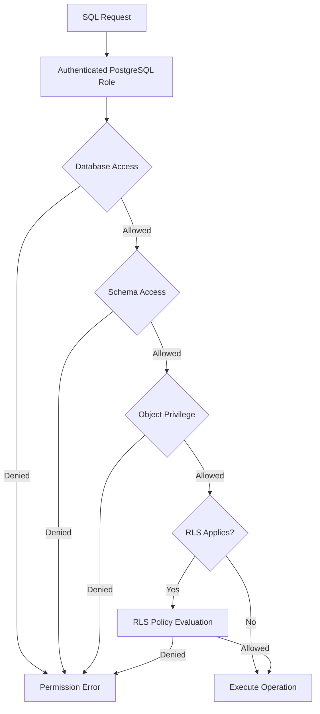
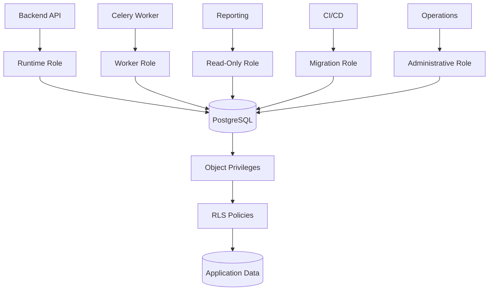

# 04- Privileges and Permissions

## Overview

Database privileges and permissions define **which operations an authenticated database role is allowed to perform on which database objects**.

Authentication establishes the database identity:

```text
Who is connecting?
       ↓
PostgreSQL Role
```

Authorization then determines what that role can do:

```text
PostgreSQL Role
       ↓
Database Privileges
       ↓
Object
       ↓
Operation
       ↓
Allow / Deny
```

For a production PostgreSQL system, permissions should be designed around least privilege rather than convenience.

A typical backend architecture might look like:

```text
                    PostgreSQL
                        │
        ┌───────────────┼────────────────┐
        │               │                │
   Runtime Role    Read-only Role   Migration Role
        │               │                │
     CRUD only       SELECT only     Schema changes
        │               │                │
        └───────────────┼────────────────┘
                        │
                 Database Objects
```

Privileges are an important security boundary because a compromised application, service, or credential should not automatically gain unrestricted access to the database.

---

## Privileges vs Permissions

The terms are often used interchangeably, but it is useful to distinguish them conceptually.

- **Privilege:** a specific authorization granted by PostgreSQL, such as `SELECT` or `UPDATE`.
- **Permission:** the broader concept of whether an identity is allowed to perform an operation.

For example:

```sql
GRANT SELECT
ON TABLE orders
TO reporting_readonly;
```

Here:

```text
SELECT
    ↓
Privilege
    ↓
Granted to reporting_readonly
    ↓
On orders
```

PostgreSQL evaluates these privileges when SQL operations are executed.

---

## Why Privileges Exist

Database privileges provide a security boundary independent of application code.

Without database authorization:

```text
Compromised Application
        ↓
Full Database Access
```

With least privilege:

```text
Compromised Application
        ↓
Limited Runtime Role
        ↓
Only Required Operations
```

This is especially important when:

- Multiple services share a database
- Reporting workloads access production data
- CI/CD performs migrations
- Human operators require administrative access
- Multi-tenant systems use RLS
- Applications process sensitive data

---

## Privilege Model

A useful mental model is:

```text
Role
  │
  ├── Role attributes
  │
  ├── Role memberships
  │
  ├── Database privileges
  │
  ├── Schema privileges
  │
  ├── Table privileges
  │
  ├── Sequence privileges
  │
  ├── Function privileges
  │
  └── Object ownership
```

Effective access is the result of these mechanisms together.

Do not assume that a role's direct table grants completely describe its access.

---

## Common PostgreSQL Privileges

Common object privileges include:

| Privilege | Typical Meaning |
|---|---|
| `SELECT` | Read rows |
| `INSERT` | Insert rows |
| `UPDATE` | Modify rows |
| `DELETE` | Delete rows |
| `TRUNCATE` | Remove all rows |
| `REFERENCES` | Create foreign-key references |
| `TRIGGER` | Create triggers |
| `USAGE` | Use certain objects such as schemas/sequences |
| `EXECUTE` | Execute functions/procedures |
| `CREATE` | Create objects in an applicable namespace |

The exact privileges available depend on the object type.

---

## Database-Level Privileges

Database access begins at the database level.

For example:

```sql
GRANT CONNECT
ON DATABASE app
TO app_runtime;
```

`CONNECT` allows the role to establish a connection to the database.

A role may therefore have:

```text
Database CONNECT
    ↓
Schema access
    ↓
Table access
```

Having `CONNECT` does not automatically provide access to application tables.

---

## Schema-Level Privileges

A schema is a namespace for database objects.

A role may require:

```sql
GRANT USAGE
ON SCHEMA app
TO app_runtime;
```

This allows the role to access objects in the schema when it has the required object-level privileges.

A separate `CREATE` privilege controls whether the role can create objects in the schema.

For example:

```sql
GRANT CREATE
ON SCHEMA app
TO app_migration;
```

A runtime role should generally not receive schema `CREATE` privileges unless the application genuinely needs them.

---

## Table Privileges

Table-level privileges control operations such as:

```sql
GRANT SELECT, INSERT, UPDATE, DELETE
ON TABLE orders
TO app_runtime;
```

A read-only role might receive:

```sql
GRANT SELECT
ON TABLE orders
TO reporting_readonly;
```

The principle is straightforward:

```text
Runtime
  → required CRUD

Reporting
  → SELECT

Migration
  → additional schema privileges
```

---

## Column-Level Privileges

PostgreSQL can grant privileges on specific columns.

For example:

```sql
GRANT SELECT (id, email, created_at)
ON TABLE users
TO reporting_readonly;
```

This can be useful when a role needs access to only part of a table.

For sensitive data, column-level permissions can provide additional restriction.

However, they can also increase permission-management complexity.

Use them when they provide a meaningful security boundary rather than applying them indiscriminately.

---

## Row-Level Security

Table privileges answer:

> Can this role access this table?

Row-Level Security answers a more specific question:

> Which rows can this role access?

For example:

```sql
ALTER TABLE orders ENABLE ROW LEVEL SECURITY;

CREATE POLICY tenant_isolation
ON orders
USING (
    tenant_id = current_setting('app.tenant_id')::uuid
);
```

Conceptually:

```text
Role has SELECT
       ↓
Query accesses orders
       ↓
RLS policy evaluated
       ↓
Only permitted rows visible
```

RLS is particularly useful for sensitive multi-tenant systems.

---

## `USING` and `WITH CHECK`

RLS policies can control both access to existing rows and the validity of newly written rows.

Example:

```sql
CREATE POLICY tenant_orders
ON orders
USING (
    tenant_id = current_setting('app.tenant_id')::uuid
)
WITH CHECK (
    tenant_id = current_setting('app.tenant_id')::uuid
);
```

Conceptually:

```text
USING
  ↓
Which existing rows can be accessed?

WITH CHECK
  ↓
Which new/modified rows are allowed?
```

For tenant isolation, both directions often matter.

---

## RLS Does Not Replace Privileges

A role still needs appropriate table privileges.

Think of the model as:

```text
Table Privilege
      +
RLS Policy
      ↓
Effective Row Access
```

For example:

```text
No SELECT privilege
      ↓
No access

SELECT privilege
      +
RLS policy
      ↓
Only permitted rows
```

RLS is therefore an additional authorization layer, not a replacement for ordinary PostgreSQL privileges.

---

## Object Ownership

Ownership is different from ordinary grants.

The owner of an object has significant control over that object.

For example:

```text
app_owner
    ↓
Owns orders table
    ↓
Has ownership-level authority
```

This is why production systems should carefully consider whether the runtime role should own application tables.

A common separation is:

```text
app_owner
    ↓
Owns schema objects

app_runtime
    ↓
Uses schema objects
```

---

## Granting Privileges

The general form is:

```sql
GRANT <privilege>
ON <object>
TO <role>;
```

Example:

```sql
GRANT SELECT
ON TABLE orders
TO reporting_readonly;
```

Multiple privileges:

```sql
GRANT SELECT, INSERT, UPDATE
ON TABLE orders
TO app_runtime;
```

Multiple roles can also be granted access.

The security principle remains:

> Grant only what is required.

---

## Revoking Privileges

Privileges can be removed using `REVOKE`.

```sql
REVOKE DELETE
ON TABLE orders
FROM reporting_readonly;
```

This is useful for:

- Removing obsolete access
- Correcting overprivileged roles
- Decommissioning services
- Responding to incidents

However, direct revocation does not necessarily eliminate effective access if the role receives the same privilege through another path.

---

## Effective Privileges

A role's effective access may come from several sources:

```text
Direct grant
      +
Role membership
      +
Inherited privileges
      +
PUBLIC
      +
Ownership
      +
Special role attributes
```

Therefore:

```text
REVOKE SELECT FROM role_a
```

does not necessarily mean:

```text
role_a cannot SELECT
```

if another role membership or authorization path still provides the privilege.

---

## Role Membership

Privileges can be grouped into reusable roles.

For example:

```sql
CREATE ROLE app_readwrite NOLOGIN;

GRANT SELECT, INSERT, UPDATE, DELETE
ON ALL TABLES IN SCHEMA app
TO app_readwrite;

GRANT app_readwrite
TO orders_runtime;
```

The architecture becomes:

```text
orders_runtime
       ↓
app_readwrite
       ↓
CRUD privileges
```

This is easier to manage than duplicating identical grants across many identities.

---

## `PUBLIC` Privileges

`PUBLIC` represents all roles.

For example:

```sql
GRANT SELECT
ON TABLE orders
TO PUBLIC;
```

This is a broad grant.

Review `PUBLIC` privileges carefully because they can silently expand access beyond the intended roles.

A least-privilege design generally prefers:

```sql
GRANT SELECT
ON TABLE orders
TO reporting_readonly;
```

over:

```sql
GRANT SELECT
ON TABLE orders
TO PUBLIC;
```

---

## Default Privileges

A normal `GRANT` affects objects that already exist.

Default privileges define grants for objects created in the future by a particular role.

For example:

```sql
ALTER DEFAULT PRIVILEGES
FOR ROLE app_owner
IN SCHEMA app
GRANT SELECT
ON TABLES
TO reporting_readonly;
```

This distinction is critical in continuously evolving systems.

Without default privileges:

```text
Existing tables
    ↓
Correct permissions

New migration creates table
    ↓
Permissions may differ
```

This can produce production failures or unintended exposure.

---

## Default Privileges Are Not Global

Default privileges apply to objects created by the specified object-creating role.

For example:

```sql
ALTER DEFAULT PRIVILEGES
FOR ROLE app_owner
IN SCHEMA app
GRANT SELECT
ON TABLES
TO reporting_readonly;
```

If another role creates the table, these defaults do not automatically apply to that object's creation.

This is a common operational source of permission drift.

---

## Sequence Privileges

Sequences are separate PostgreSQL objects.

Applications using sequence-backed identifiers may require appropriate privileges.

For example:

```sql
GRANT USAGE, SELECT
ON ALL SEQUENCES IN SCHEMA app
TO app_runtime;
```

A role can therefore have table privileges while still encountering sequence-related permission errors.

When designing permissions, inspect tables and supporting objects together.

---

## Function Privileges

Functions have their own privileges.

For example:

```sql
GRANT EXECUTE
ON FUNCTION app.calculate_total(integer)
TO app_runtime;
```

Function permissions become particularly important when functions:

- Access protected data
- Perform privileged operations
- Execute dynamic SQL
- Use `SECURITY DEFINER`

---

## `SECURITY DEFINER` and Privileges

A `SECURITY DEFINER` function executes with the privileges of its owner.

Conceptually:

```text
Low-privilege role
       ↓
Function
       ↓
Owner's privileges
       ↓
Protected operation
```

This can intentionally expose a narrow privileged operation.

It can also become a privilege-escalation vulnerability.

Security-sensitive functions should use:

- Minimal owner privileges
- Safe `search_path`
- Schema-qualified references where appropriate
- Validated inputs
- Safe dynamic SQL
- Restricted `EXECUTE` privileges

---

## Sequence of Permission Evaluation

A simplified request path is:



This is a simplified model; PostgreSQL's exact authorization behavior depends on object type, ownership, role attributes, policies, and the SQL operation.

---

## Permission Errors

A typical application may encounter errors such as:

```text
permission denied for table orders
```

or:

```text
permission denied for schema app
```

or:

```text
permission denied for sequence orders_id_seq
```

Troubleshooting should identify the exact missing privilege rather than granting broad permissions immediately.

---

## Permission Troubleshooting

A useful process is:

1. Identify the database role used by the connection.
2. Identify the database and schema.
3. Identify the target object.
4. Inspect direct grants.
5. Inspect role memberships.
6. Inspect ownership.
7. Inspect `PUBLIC` privileges.
8. Check RLS where applicable.
9. Check object-specific privileges such as sequences or functions.
10. Grant the smallest missing privilege.

This is safer than simply granting:

```sql
GRANT ALL
```

---

## Inspecting Privileges with `psql`

Useful commands include:

```text
\du
```

to inspect roles.

```text
\dp
```

to inspect table and sequence privileges.

```text
\dn+
```

to inspect schemas.

```text
\df+
```

to inspect functions.

These commands are valuable during:

- Production debugging
- Security audits
- Migration troubleshooting
- Incident response

---

## Querying Table Privileges

Information schema views can help inspect grants.

For example:

```sql
SELECT
    grantee,
    table_schema,
    table_name,
    privilege_type
FROM information_schema.role_table_grants
WHERE table_schema = 'app'
  AND table_name = 'orders'
ORDER BY grantee, privilege_type;
```

This is useful for generating permission reports.

However, information schema views represent standardized metadata and may not expose every PostgreSQL-specific authorization detail. PostgreSQL catalogs and `has_*_privilege()` functions are useful for deeper analysis.

---

## Testing Effective Privileges

PostgreSQL provides privilege-checking functions.

For example:

```sql
SELECT has_table_privilege(
    'orders_runtime',
    'app.orders',
    'SELECT'
);
```

For a schema:

```sql
SELECT has_schema_privilege(
    'orders_runtime',
    'app',
    'USAGE'
);
```

These functions are useful when troubleshooting effective access.

---

## Permission Matrix

Document intended access explicitly.

| Role | Database | Schema | Orders | Users | Admin Operations |
|---|---|---|---|---|---|
| `orders_runtime` | `CONNECT` | `USAGE` | CRUD | Limited | No |
| `orders_readonly` | `CONNECT` | `USAGE` | `SELECT` | `SELECT` | No |
| `orders_migration` | `CONNECT` | `USAGE` + required DDL | Required | Required | Limited |
| `orders_admin` | Administrative | Administrative | Full | Full | Yes |

This matrix should describe intended access, not merely current accidental grants.

---

## Least Privilege

Least privilege means granting the minimum access required to perform a responsibility.

For example:

```text
Reporting service
    ↓
SELECT
    ↓
Required tables
```

instead of:

```text
Reporting service
    ↓
ALL PRIVILEGES
    ↓
Entire database
```

Least privilege limits the blast radius of:

- Credential theft
- Application compromise
- Insider misuse
- Misconfiguration
- Operational mistakes

---

## Runtime vs Migration Privileges

A runtime service generally needs application CRUD.

A migration system may require:

```text
CREATE TABLE
ALTER TABLE
CREATE INDEX
DROP / ALTER objects
```

These responsibilities should be separated when practical:

```text
Application
    ↓
runtime_role
    ↓
CRUD

CI/CD
    ↓
migration_role
    ↓
Schema changes
```

This is one of the highest-value privilege boundaries in backend systems.

---

## Reporting Roles

Reporting systems frequently need read access without write access.

Example:

```sql
CREATE ROLE reporting_readonly NOLOGIN;

GRANT USAGE
ON SCHEMA app
TO reporting_readonly;

GRANT SELECT
ON ALL TABLES IN SCHEMA app
TO reporting_readonly;
```

This protects the primary application workload from accidental reporting writes.

For larger systems, reporting workloads may instead use replicas or dedicated analytical infrastructure.

---

## Microservices

Role separation can reinforce service boundaries.

For example:

```text
Orders Service
    ↓
orders_runtime
    ↓
orders schema

Billing Service
    ↓
billing_runtime
    ↓
billing schema
```

Avoid:

```text
All Services
     ↓
shared_admin_role
     ↓
Entire Database
```

A service should not automatically receive access to unrelated service data.

---

## Shared Database

When multiple services use one database, privileges can provide stronger boundaries.

Example:

```text
orders_runtime
    ↓
orders tables

billing_runtime
    ↓
billing tables

reporting_readonly
    ↓
SELECT
```

Schema separation combined with explicit grants can reduce accidental cross-service access.

However, broad privileges can still turn a shared database into a security and coupling problem.

---

## Django

Django normally connects to PostgreSQL using a configured database identity.

The database role controls what SQL generated by Django can execute.

For example:

```text
Django
  ↓
orders_runtime
  ↓
PostgreSQL
```

Django's application permissions are separate from PostgreSQL permissions.

Therefore:

```text
Django permission
      ≠
PostgreSQL privilege
```

Both may be required.

For example, a user may have Django permission to perform an operation while the database role still needs the appropriate table privilege.

---

## FastAPI and SQLAlchemy

FastAPI and SQLAlchemy follow the same database authorization model.

```text
FastAPI
   ↓
SQLAlchemy / psycopg
   ↓
orders_runtime
   ↓
PostgreSQL
```

The Python application may implement:

```text
User authorization
Tenant authorization
Business authorization
```

while PostgreSQL enforces:

```text
Database role privileges
RLS
Constraints
```

These layers complement each other.

---

## Connection Pooling

Connection pools reuse database sessions authenticated as a database role.

```text
Request A ─┐
Request B ─┼──> Pool ──> PostgreSQL
Request C ─┘
```

If the pool connects as:

```text
orders_runtime
```

PostgreSQL generally sees:

```text
orders_runtime
```

rather than the individual human user.

Therefore application-level authorization remains essential.

This is particularly important for:

- Tenant isolation
- User-specific permissions
- Resource ownership
- RLS context

---

## Tenant Isolation with Privileges and RLS

A multi-tenant architecture can combine:

```text
Application Authorization
        +
Runtime Database Role
        +
Table Privileges
        +
RLS
```

For example:

```sql
ALTER TABLE orders ENABLE ROW LEVEL SECURITY;

CREATE POLICY tenant_orders
ON orders
USING (
    tenant_id = current_setting('app.tenant_id')::uuid
)
WITH CHECK (
    tenant_id = current_setting('app.tenant_id')::uuid
);
```

When using connection pooling, tenant context should be carefully scoped to the transaction.

For example:

```sql
BEGIN;

SET LOCAL app.tenant_id = '00000000-0000-0000-0000-000000000001';

SELECT id, total
FROM orders;

COMMIT;
```

---

## Privileges and Transactions

Privileges are evaluated as part of database operation authorization.

Transactions do not make unauthorized operations authorized.

However, transaction boundaries matter when authorization context is stored in session state.

For example:

```text
BEGIN
  ↓
Set tenant context
  ↓
Authorized queries
  ↓
COMMIT
```

Using transaction-scoped context helps prevent security state from persisting on pooled connections.

---

## Privileges and Concurrency

Authorization does not eliminate race conditions.

Suppose:

```text
Request A
  ↓
Checks permission/state

Request B
  ↓
Changes resource

Request A
  ↓
Performs operation
```

If authorization depends on mutable resource state, the protected operation may need an atomic database condition.

For example:

```sql
UPDATE orders
SET status = 'cancelled'
WHERE id = $1
  AND tenant_id = $2
  AND status = 'pending';
```

Then the application should verify the affected row count.

Database authorization controls **whether the role can execute the operation**; application predicates and transaction controls can determine **whether this specific resource transition is valid**.

---

## Privileges and Caching

Database privileges do not automatically protect cached data.

For example:

```text
PostgreSQL
   ↓
Application
   ↓
Redis
   ↓
Client
```

If a user-specific response is cached under an overly broad key, authorization can be bypassed at the cache layer.

Use authorization-aware cache design:

```text
order:{tenant_id}:{order_id}
```

when tenant scope is part of the data-access boundary.

---

## Privileges and Kafka

Kafka consumers often use database roles independently from the producer.

For example:

```text
Kafka
  ↓
Order Consumer
  ↓
orders_worker
  ↓
PostgreSQL
```

The worker's database role should be scoped to the operations it performs.

A worker that only updates order status does not necessarily need unrestricted access to every table.

---

## Privileges and Celery

Background workers should use dedicated credentials when their responsibilities differ from the API.

For example:

```text
API
  ↓
api_runtime

Celery
  ↓
orders_worker
```

This prevents the worker from automatically receiving every permission granted to the API.

It also makes audit trails and incident response clearer.

---

## Permission Changes in CI/CD

Permissions are production configuration and should be managed with the same discipline as application code.

Prefer:

```text
Version-controlled migration
        ↓
Review
        ↓
CI validation
        ↓
Controlled deployment
        ↓
Database
```

Avoid ad-hoc production grants that are never documented.

For emergency access, record:

- Who made the change
- What changed
- Why it was necessary
- When it should be reverted

---

## Permission Drift

Permission drift occurs when actual database access gradually diverges from intended access.

For example:

```text
Initial design
    ↓
Runtime role = CRUD
    ↓
Temporary grant
    ↓
Another migration
    ↓
Additional permission
    ↓
Years later
    ↓
Runtime role = excessive privileges
```

Prevent drift with:

- Periodic reviews
- Permission inventories
- Infrastructure-as-code where practical
- Version-controlled grants
- Temporary access
- Automated checks

---

## Permission Review

A production review should inspect:

### Roles

- Which roles can log in?
- Which roles are `SUPERUSER`?
- Which roles have `CREATEDB`?
- Which roles have `CREATEROLE`?
- Which roles have `BYPASSRLS`?

### Grants

- Which roles have table access?
- Which roles can modify data?
- Which roles can create objects?
- Which roles can execute privileged functions?

### Memberships

- Which roles inherit other roles?
- Are there unexpected privilege chains?
- Can `SET ROLE` create an unintended escalation path?

### Objects

- Who owns schemas?
- Who owns tables?
- Who owns functions?
- Are runtime roles object owners?

### Broad Access

- Are unnecessary privileges granted to `PUBLIC`?
- Are there stale accounts?
- Are there unused permissions?

---

## Security and High Availability

Permission configuration must remain consistent across HA environments.

For PostgreSQL replication:

```text
Primary
   │
   │ WAL
   ▼
Standby
```

Physical replication normally carries database state, including catalog state containing roles and privileges.

However, operational access configuration can involve additional infrastructure outside the replicated database.

Failover procedures should verify that:

- Application roles work after promotion
- Replication identities remain functional
- Administrative access is available
- RLS policies remain correct
- Connection endpoints remain protected

---

## Disaster Recovery

Database privileges are part of the security configuration that must be recoverable.

A DR plan should account for:

- Roles
- Role memberships
- Grants
- Ownership
- RLS policies
- Default privileges
- Functions
- Authentication configuration
- Secret-management integration

A database restore that recovers data but not the expected authorization model can create both availability and security problems.

---

## Monitoring and Auditing

Monitor security-sensitive privilege changes such as:

- Role creation
- Role deletion
- Membership changes
- `GRANT`
- `REVOKE`
- Ownership changes
- Administrative attribute changes
- RLS-related configuration

For sensitive systems, audit records should support:

```text
Who?
What changed?
When?
Which object?
Why?
```

Database logs, PostgreSQL auditing extensions, infrastructure logs, and application audit events can complement each other.

---

## Performance Considerations

Normal privilege checks are not usually the dominant cost of PostgreSQL queries.

However, authorization architecture can affect performance through:

- Complex RLS policies
- Authorization functions
- Poorly indexed tenant predicates
- Remote permission services
- Excessive permission checks in application code

For high-volume systems, keep authorization logic efficient and ensure RLS predicates can use appropriate indexes where necessary.

---

## Cost Considerations

Good privilege design can reduce operational cost by reducing:

- Permission-related incidents
- Manual access management
- Security investigations
- Credential sprawl
- Unnecessary administrative accounts

However, highly granular permission models can become expensive to maintain.

The goal is not maximum granularity.

The goal is:

```text
Clear boundaries
+
Least privilege
+
Manageable operations
```

---

## Common Mistakes

### Granting `ALL` by Default

**Problem:** The role receives privileges it does not need.

**Better:** Grant specific privileges required for the workload.

### Granting to `PUBLIC`

**Problem:** Access is unintentionally expanded to many identities.

**Better:** Grant privileges to explicit roles.

### Forgetting Schema `USAGE`

**Problem:** A role has table privileges but cannot access the schema.

**Better:** Grant the required schema privilege separately.

### Forgetting Sequence Privileges

**Problem:** Inserts fail because the runtime role cannot use the required sequence.

**Better:** Review supporting objects along with table permissions.

### Assuming `REVOKE` Removes All Access

**Problem:** Another role membership, `PUBLIC`, or ownership may still provide access.

**Better:** Inspect effective privileges.

### Using Runtime Roles as Object Owners

**Problem:** Runtime credentials receive ownership-level authority.

**Better:** Consider separate owner/migration identities.

### Giving Migration Privileges to Runtime Roles

**Problem:** Application compromise can become schema compromise.

**Better:** Separate runtime and migration roles.

### Ignoring Default Privileges

**Problem:** New tables receive different permissions from existing tables.

**Better:** Configure default privileges for the appropriate object-creating role.

### Treating RLS as a Replacement for Grants

**Problem:** RLS and table privileges solve different authorization layers.

**Better:** Configure both deliberately.

### Forgetting `BYPASSRLS`

**Problem:** A privileged role can bypass tenant isolation policies.

**Better:** Audit `BYPASSRLS`, ownership, and privileged roles.

### Using Broad Privileges to Fix Deployment Failures

**Problem:** A temporary operational problem becomes permanent privilege escalation.

**Better:** Identify the exact missing privilege and grant only that permission.

---

## Production Permission Architecture

A practical architecture can look like:



The objective is controlled blast radius:

```text
API compromise
    ↓
Runtime privileges only

Reporting compromise
    ↓
Read-only privileges

Worker compromise
    ↓
Worker-specific privileges

CI/CD compromise
    ↓
Migration privileges

Administrative compromise
    ↓
Separate, tightly controlled path
```

---

## Permission Design Procedure

When designing privileges for a new service:

1. Identify the service responsibility.
2. Identify the database objects it must access.
3. Identify the operations required on each object.
4. Create a dedicated runtime role.
5. Grant only required privileges.
6. Separate schema-changing privileges.
7. Configure default privileges where necessary.
8. Review sequences, functions, and other supporting objects.
9. Evaluate RLS requirements.
10. Test both allowed and denied operations.
11. Document the permission matrix.
12. Periodically review actual versus intended access.

This approach is safer than starting with broad privileges and attempting to remove them later.

---

## Security Testing

Permission testing should include both positive and negative cases.

### Positive Tests

Verify that the application can:

- Read required data
- Insert required records
- Update permitted records
- Execute required functions

### Negative Tests

Verify that the role cannot:

- Drop application tables
- Create unauthorized objects
- Modify protected tables
- Access unrelated service data
- Bypass tenant isolation
- Perform administrative operations

A useful principle is:

> **A secure permission model proves that forbidden operations fail.**

---

## Interview Traps

### What is the difference between a role and a privilege?

A role represents an identity or permission set. A privilege represents a specific authorized operation on a database object.

### What happens when you `GRANT SELECT` on a table?

The specified role receives the ability to perform the applicable `SELECT` operation on that table, subject to other authorization mechanisms such as RLS.

### Does `GRANT SELECT` bypass RLS?

No. Table privileges and RLS are separate layers. A role can have `SELECT` while RLS still restricts which rows it can access.

### Why can a role still access a table after `REVOKE SELECT`?

It may still receive the privilege through another role membership, `PUBLIC`, ownership, or another effective authorization path.

### What are default privileges?

They define privileges automatically applied to future objects created by a particular object-creating role. They do not retroactively change existing objects.

### Why is schema `USAGE` different from table `SELECT`?

Schema `USAGE` controls access to objects within the schema namespace, while table `SELECT` controls reading rows from a specific table. Both can be required.

### Why can an application insert into a table but still get a sequence permission error?

Sequences are separate PostgreSQL objects. The runtime role may have table privileges but lack the required sequence privileges.

### Why shouldn't an application role own every table?

Ownership provides stronger authority than ordinary CRUD privileges. Separating object ownership from runtime access can reduce the impact of application credential compromise.

### Should application users have PostgreSQL table privileges directly?

Usually no. The application commonly uses a service database role, while user-level authorization is enforced by the application and, where appropriate, RLS.

### What is the purpose of a `NOLOGIN` permission role?

It provides a reusable permission set that can be granted to one or more login identities without itself being used as a normal authentication identity.

### How do privileges relate to microservices?

Dedicated database roles can reinforce service boundaries by limiting each service to the objects and operations required for its responsibility.

### What is the senior-level approach to database permissions?

Design permissions as explicit security boundaries, separate runtime and administrative responsibilities, understand effective privileges rather than direct grants alone, use RLS where appropriate, test denied operations, and continuously review privilege drift.

## Key Takeaways

- **PostgreSQL privileges define what a role can do on database objects**, while effective access also depends on role membership, inheritance, ownership, `PUBLIC`, and special role attributes.
- **Least privilege should be designed per responsibility**, with runtime, reporting, worker, migration, backup, and administrative roles receiving distinct permissions.
- **Table privileges and Row-Level Security solve different problems**: privileges control access to objects, while RLS can restrict which rows an otherwise authorized role may access.
- **Production permission management requires operational discipline**, including default privileges, sequence/function permissions, version-controlled changes, auditing, privilege reviews, and protection against permission drift.
- **Senior database security focuses on blast-radius reduction**, ensuring that a compromised application or service receives only the minimum database authority required to perform its job.