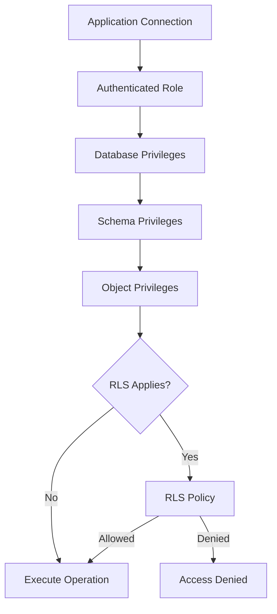
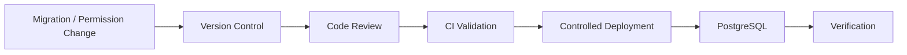

# 05- GRANT and REVOKE

## Overview

`GRANT` and `REVOKE` are PostgreSQL's primary mechanisms for explicitly managing object privileges.

They answer two operational questions:

```text
GRANT
  ↓
What access should this role receive?

REVOKE
  ↓
What access should this role no longer receive?
```

A production authorization model commonly combines:

- Roles
- Role memberships
- Object ownership
- `GRANT`
- `REVOKE`
- Default privileges
- Row-Level Security (RLS)
- Database and schema privileges
- Function and sequence privileges

For backend systems, the objective is not simply to make queries work. The objective is to make **only the required queries work**.

---

## Authorization Model

A simplified PostgreSQL authorization flow is:



This is simplified because PostgreSQL authorization can also be affected by:

- Role membership
- Privilege inheritance
- Object ownership
- `PUBLIC`
- `SUPERUSER`
- `BYPASSRLS`
- `SECURITY DEFINER` functions
- Object-specific authorization rules

---

## `GRANT`

`GRANT` assigns privileges to a role.

General form:

```sql
GRANT privilege
ON object
TO role;
```

Example:

```sql
GRANT SELECT
ON TABLE app.orders
TO reporting_readonly;
```

Multiple privileges can be granted together:

```sql
GRANT SELECT, INSERT, UPDATE, DELETE
ON TABLE app.orders
TO orders_runtime;
```

The important design question is not:

> What privileges can I grant?

It is:

> What is the minimum privilege this role needs?

---

## `REVOKE`

`REVOKE` removes a privilege previously granted to a role.

General form:

```sql
REVOKE privilege
ON object
FROM role;
```

Example:

```sql
REVOKE DELETE
ON TABLE app.orders
FROM reporting_readonly;
```

A typical operational workflow is:

```text
Identify required access
        ↓
GRANT required privileges
        ↓
Validate application behavior
        ↓
Periodically review
        ↓
REVOKE obsolete access
```

---

## Common Privileges

| Privilege | Typical Use |
|---|---|
| `SELECT` | Read rows |
| `INSERT` | Insert rows |
| `UPDATE` | Modify rows |
| `DELETE` | Delete rows |
| `TRUNCATE` | Remove all rows |
| `REFERENCES` | Create foreign-key references |
| `TRIGGER` | Create triggers |
| `USAGE` | Use applicable objects such as schemas and sequences |
| `CREATE` | Create objects where supported |
| `EXECUTE` | Execute functions/procedures |
| `CONNECT` | Connect to a database |
| `TEMPORARY` | Create temporary tables in a database |

Not every privilege applies to every object type.

---

## Granting Database Access

A role may require `CONNECT` before it can establish a database connection.

```sql
GRANT CONNECT
ON DATABASE app
TO orders_runtime;
```

This does not grant access to application tables.

A useful model is:

```text
CONNECT
   ↓
Schema USAGE
   ↓
Table SELECT/INSERT/UPDATE/DELETE
   ↓
RLS, if enabled
```

Each layer can restrict access independently.

---

## Granting Schema Access

Suppose application objects exist in the `app` schema.

A runtime role may need:

```sql
GRANT USAGE
ON SCHEMA app
TO orders_runtime;
```

A migration role might additionally need:

```sql
GRANT CREATE
ON SCHEMA app
TO orders_migration;
```

This distinction is valuable:

```text
Runtime
    → use existing objects

Migration
    → create/change objects
```

Avoid granting `CREATE` to runtime roles unless there is a genuine requirement.

---

## Granting Table Privileges

A typical runtime role might receive:

```sql
GRANT SELECT, INSERT, UPDATE, DELETE
ON TABLE app.orders
TO orders_runtime;
```

A read-only reporting role:

```sql
GRANT SELECT
ON TABLE app.orders
TO reporting_readonly;
```

A service that only updates state might require less:

```sql
GRANT UPDATE
ON TABLE app.orders
TO order_worker;
```

However, table-level privileges alone may not capture business-level authorization.

For example:

```sql
GRANT UPDATE
ON TABLE app.orders
TO orders_runtime;
```

does not mean the application should allow every user to update every order.

---

## Granting Privileges on Multiple Tables

PostgreSQL supports `ALL TABLES IN SCHEMA`.

For example:

```sql
GRANT SELECT
ON ALL TABLES IN SCHEMA app
TO reporting_readonly;
```

This is convenient when a role genuinely needs read access to all current tables in a schema.

However, it is broader than explicit table grants.

Use it carefully in security-sensitive environments.

---

## `ALL PRIVILEGES`

PostgreSQL supports:

```sql
GRANT ALL PRIVILEGES
ON TABLE app.orders
TO orders_runtime;
```

This is convenient but often too broad for an application runtime role.

Prefer explicit privileges:

```sql
GRANT SELECT, INSERT, UPDATE, DELETE
ON TABLE app.orders
TO orders_runtime;
```

This makes the authorization contract easier to review.

---

## Granting Sequence Privileges

Sequences are separate objects from tables.

For example:

```sql
GRANT USAGE, SELECT
ON ALL SEQUENCES IN SCHEMA app
TO orders_runtime;
```

This can be important for applications using sequence-backed identifiers.

A common failure pattern is:

```text
INSERT permission
      ↓
Granted

Sequence permission
      ↓
Missing

INSERT
      ↓
Fails
```

When troubleshooting write permissions, inspect both tables and sequences.

---

## Granting Function Privileges

Functions have their own privileges.

Example:

```sql
GRANT EXECUTE
ON FUNCTION app.calculate_order_total(bigint)
TO orders_runtime;
```

Function signatures matter when granting privileges because PostgreSQL identifies overloaded functions by their argument types.

Functions are especially important from a security perspective when they use:

```sql
SECURITY DEFINER
```

because execution can occur with the function owner's privileges.

---

## Granting Column Privileges

Privileges can be restricted to selected columns.

For example:

```sql
GRANT SELECT (id, email, created_at)
ON TABLE app.users
TO reporting_readonly;
```

This can be useful when reporting users should not directly read sensitive columns.

However, column-level permissions add management complexity.

Use them when the additional restriction provides meaningful security value.

---

## `GRANT` to Roles

Permissions are easier to manage when reusable permission roles are separated from login identities.

Example:

```sql
CREATE ROLE orders_readwrite NOLOGIN;

GRANT USAGE
ON SCHEMA app
TO orders_readwrite;

GRANT SELECT, INSERT, UPDATE, DELETE
ON TABLE app.orders
TO orders_readwrite;

GRANT orders_readwrite
TO orders_runtime;
```

Architecture:

```text
orders_runtime
       ↓
orders_readwrite
       ↓
CRUD privileges
       ↓
app.orders
```

This avoids duplicating the same grants across multiple login roles.

---

## `GRANT` to `PUBLIC`

`PUBLIC` represents all roles.

For example:

```sql
GRANT SELECT
ON TABLE app.orders
TO PUBLIC;
```

This should be treated as a broad authorization decision.

For application data, explicit grants are generally safer:

```sql
GRANT SELECT
ON TABLE app.orders
TO reporting_readonly;
```

Always review existing `PUBLIC` privileges when performing a security audit.

---

## Role Membership and `GRANT`

`GRANT` is also used to grant membership in another role.

For example:

```sql
GRANT orders_readwrite
TO orders_runtime;
```

The first role receives membership in the second role.

This creates a privilege hierarchy:

```text
orders_runtime
      │
      ▼
orders_readwrite
      │
      ├── SELECT
      ├── INSERT
      ├── UPDATE
      └── DELETE
```

Role membership can be more maintainable than managing hundreds of direct object grants.

---

## Revoking Role Membership

Role membership can be removed using `REVOKE`.

```sql
REVOKE orders_readwrite
FROM orders_runtime;
```

This is useful when:

- A service is decommissioned
- Responsibilities change
- Temporary access expires
- A privilege escalation must be removed

After revoking membership, verify whether another authorization path still grants equivalent access.

---

## `REVOKE` Does Not Guarantee Denial

This is an important senior-level distinction.

Suppose:

```text
orders_runtime
    ↓
orders_readwrite
    ↓
SELECT
```

If you execute:

```sql
REVOKE SELECT
ON TABLE app.orders
FROM orders_runtime;
```

the role may still effectively have `SELECT` through `orders_readwrite`.

Similarly, access may come through:

- Another role membership
- `PUBLIC`
- Ownership
- Special role attributes

Therefore, authorization should be evaluated based on **effective privileges**, not only direct grants.

---

## Effective Privilege Checks

PostgreSQL provides functions for checking effective access.

For example:

```sql
SELECT has_table_privilege(
    'orders_runtime',
    'app.orders',
    'SELECT'
);
```

Schema access:

```sql
SELECT has_schema_privilege(
    'orders_runtime',
    'app',
    'USAGE'
);
```

Database access:

```sql
SELECT has_database_privilege(
    'orders_runtime',
    'app',
    'CONNECT'
);
```

These are useful for automated authorization tests and troubleshooting.

---

## Inspecting Grants with `psql`

Useful commands include:

```text
\du
```

Inspect roles and role attributes.

```text
\dp app.orders
```

Inspect privileges on a table.

```text
\dn+ app
```

Inspect schema privileges.

```text
\df+ app.calculate_order_total
```

Inspect functions.

These commands are especially useful during production debugging.

---

## Inspecting Table Grants

The information schema can be queried directly.

```sql
SELECT
    grantee,
    table_schema,
    table_name,
    privilege_type
FROM information_schema.role_table_grants
WHERE table_schema = 'app'
ORDER BY grantee, table_name, privilege_type;
```

This is useful for creating permission reports.

For PostgreSQL-specific investigations, catalog tables and `has_*_privilege()` functions may provide more complete information.

---

## `GRANT` vs Default Privileges

A normal `GRANT` affects objects that already exist.

```sql
GRANT SELECT
ON ALL TABLES IN SCHEMA app
TO reporting_readonly;
```

Future tables are not automatically covered by this grant.

Default privileges address future object creation.

```sql
ALTER DEFAULT PRIVILEGES
FOR ROLE app_owner
IN SCHEMA app
GRANT SELECT
ON TABLES
TO reporting_readonly;
```

The distinction is:

| Mechanism | Existing Objects | Future Objects |
|---|---:|---:|
| `GRANT` | Yes | No |
| `ALTER DEFAULT PRIVILEGES` | No | Yes |

---

## Default Privilege Ownership Matters

Default privileges are associated with the role that creates the objects.

For example:

```sql
ALTER DEFAULT PRIVILEGES
FOR ROLE app_owner
IN SCHEMA app
GRANT SELECT
ON TABLES
TO reporting_readonly;
```

This affects future tables created by `app_owner` in the specified schema.

It does not mean:

```text
Every future table
    ↓
Regardless of creator
    ↓
Automatically receives SELECT
```

Permission automation should therefore identify which role actually creates production objects.

---

## Revoking Default Privileges

Default privileges can also be revoked.

```sql
ALTER DEFAULT PRIVILEGES
FOR ROLE app_owner
IN SCHEMA app
REVOKE SELECT
ON TABLES
FROM reporting_readonly;
```

This affects future objects governed by those default privileges.

It does not remove existing table grants.

Existing objects require a separate `REVOKE`.

---

## Granting on Schemas, Tables, and Sequences Together

A production setup may require several grants:

```sql
GRANT CONNECT
ON DATABASE app
TO orders_runtime;

GRANT USAGE
ON SCHEMA app
TO orders_runtime;

GRANT SELECT, INSERT, UPDATE, DELETE
ON ALL TABLES IN SCHEMA app
TO orders_runtime;

GRANT USAGE, SELECT
ON ALL SEQUENCES IN SCHEMA app
TO orders_runtime;
```

This illustrates why "the application has table permissions" is not always sufficient.

---

## Privileges and RLS

Suppose:

```sql
GRANT SELECT
ON TABLE app.orders
TO orders_runtime;
```

and:

```sql
ALTER TABLE app.orders ENABLE ROW LEVEL SECURITY;
```

The role may have `SELECT` while RLS restricts which rows are visible.

A tenant policy could be:

```sql
CREATE POLICY tenant_orders
ON app.orders
USING (
    tenant_id = current_setting('app.tenant_id')::uuid
)
WITH CHECK (
    tenant_id = current_setting('app.tenant_id')::uuid
);
```

The effective model becomes:

```text
SELECT privilege
       +
RLS policy
       +
tenant context
       ↓
Allowed rows
```

Roles with `BYPASSRLS`, and normally table owners unless the table is configured with forced RLS, require special attention.

---

## Granting Privileges for a Multi-Tenant Service

A common architecture is:

```text
API
 ↓
orders_runtime
 ↓
SELECT / INSERT / UPDATE
 ↓
orders table
 ↓
RLS
 ↓
Tenant-specific rows
```

Do not rely exclusively on:

```text
GRANT SELECT ON orders
```

for tenant isolation.

Object-level privileges cannot express:

```text
Tenant A can see only Tenant A rows.
```

RLS or carefully enforced application-level authorization is required for that type of boundary.

---

## Application-Level Authorization vs Database Grants

These are different layers.

```text
HTTP Request
     ↓
Application Authentication
     ↓
Application Authorization
     ↓
Database Connection
     ↓
PostgreSQL Role
     ↓
GRANT / REVOKE
     ↓
RLS
     ↓
Database Operation
```

For example, Django may decide:

```text
Can this user cancel this order?
```

while PostgreSQL decides:

```text
Can this database role execute UPDATE on orders?
```

Do not use database grants as a substitute for user-level application authorization.

---

## Django and `GRANT`

Django migrations can execute SQL permissions when required.

For example, a migration can use `RunSQL`:

```python
from django.db import migrations


class Migration(migrations.Migration):
    dependencies = [
        ("orders", "0001_initial"),
    ]

    operations = [
        migrations.RunSQL(
            sql="""
                GRANT SELECT, INSERT, UPDATE, DELETE
                ON TABLE app.orders
                TO orders_runtime;
            """,
            reverse_sql="""
                REVOKE SELECT, INSERT, UPDATE, DELETE
                ON TABLE app.orders
                FROM orders_runtime;
            """,
        ),
    ]
```

Permission changes should be reviewed like schema changes.

---

## FastAPI and PostgreSQL

FastAPI itself does not provide PostgreSQL privileges.

The database driver authenticates using the configured database role:

```text
FastAPI
   ↓
psycopg / SQLAlchemy
   ↓
orders_runtime
   ↓
PostgreSQL
```

The PostgreSQL role then determines whether the SQL operation is authorized.

This makes database credentials part of the service's security boundary.

---

## Microservices

Dedicated roles can provide service-level isolation.

Example:

```text
Orders API
    ↓
orders_runtime
    ↓
orders schema

Billing API
    ↓
billing_runtime
    ↓
billing schema

Reporting
    ↓
reporting_readonly
    ↓
SELECT
```

Avoid using a single highly privileged role for every service.

Otherwise:

```text
One compromised credential
        ↓
Access to unrelated services
        ↓
Large blast radius
```

---

## Runtime vs Migration Roles

A strong production pattern separates:

```text
orders_runtime
    ↓
Application CRUD

orders_migration
    ↓
Schema changes

orders_readonly
    ↓
Reporting

orders_admin
    ↓
Controlled administration
```

The runtime role should not normally be able to perform unrestricted DDL.

This limits the impact of:

- SQL injection
- Application compromise
- Credential theft
- Malicious application code
- Deployment mistakes

---

## CI/CD and Permission Changes

Permission changes should ideally follow:



Avoid manually applying undocumented production grants.

If emergency access is required:

- Record the reason
- Record the operator
- Record the exact change
- Define an expiration or rollback
- Reconcile the final state with source-controlled configuration

---

## Idempotent Permission Deployment

Deployment systems may execute operations more than once.

A practical permission deployment should account for the current state.

For example, PostgreSQL supports:

```sql
GRANT SELECT
ON TABLE app.orders
TO reporting_readonly;
```

Repeated execution of the same grant does not need to be treated as a schema-data mutation requiring application-level idempotency.

However, deployment tooling should still be designed so that the final authorization state is deterministic and reviewable.

---

## Permission Drift

Permission drift occurs when actual permissions diverge from intended permissions.

Example:

```text
Initial design
    ↓
orders_runtime = CRUD
    ↓
Emergency GRANT
    ↓
Temporary access forgotten
    ↓
Additional deployment changes
    ↓
Runtime role becomes overprivileged
```

Prevent drift through:

- Permission inventories
- Version-controlled migrations
- Periodic audits
- Automated privilege checks
- Explicit role ownership
- Temporary access procedures

---

## Security Best Practices

### Prefer Explicit Grants

Use:

```sql
GRANT SELECT, INSERT, UPDATE
ON TABLE app.orders
TO orders_runtime;
```

rather than broad authorization where possible.

### Separate Responsibilities

Keep runtime, migration, reporting, and administrative access distinct.

### Minimize `PUBLIC`

Review and remove unnecessary broad grants.

### Protect Privileged Roles

Restrict roles capable of:

- Creating roles
- Granting privileges
- Altering ownership
- Bypassing RLS
- Performing administrative operations

### Protect Credentials

Store database credentials in appropriate secret-management systems such as:

- AWS Secrets Manager
- AWS Systems Manager Parameter Store
- Kubernetes Secrets with appropriate controls
- External secret-management platforms

Never commit database passwords into Git.

---

## Reliability Considerations

Permission failures can become availability failures.

For example:

```text
Deployment
   ↓
New table created
   ↓
Missing runtime privilege
   ↓
Application requests fail
```

Therefore permission changes should be tested before deployment.

For critical services, test:

- Existing application operations
- New migration behavior
- New object privileges
- Rollback behavior
- Replica/failover behavior
- Worker permissions
- Reporting permissions

---

## High Availability Considerations

PostgreSQL authorization state is part of the database state, but operational access also depends on external authentication and infrastructure configuration.

After failover, verify:

```text
Application
   ↓
Stable database endpoint
   ↓
Correct PostgreSQL role
   ↓
Expected privileges
   ↓
Successful queries
```

Failover testing should include authorization validation rather than checking only connectivity.

---

## Monitoring and Auditing

Monitor authorization-related changes and failures.

Useful signals include:

- Permission-denied errors
- Unexpected authentication failures
- Role membership changes
- `GRANT` / `REVOKE` changes
- Ownership changes
- Privileged role changes
- RLS configuration changes

Permission errors in application logs should include enough context for diagnosis without leaking sensitive credentials or data.

---

## Production Permission Checklist

Before deploying a service, verify:

- [ ] Runtime role exists.
- [ ] Runtime role is not unnecessarily privileged.
- [ ] Database `CONNECT` is configured.
- [ ] Required schema `USAGE` exists.
- [ ] Required table privileges exist.
- [ ] Required sequence privileges exist.
- [ ] Required function privileges exist.
- [ ] Migration privileges are separated where practical.
- [ ] `PUBLIC` privileges have been reviewed.
- [ ] RLS policies are configured where required.
- [ ] `BYPASSRLS` roles have been reviewed.
- [ ] Default privileges are configured where required.
- [ ] Permission changes are version-controlled.
- [ ] Positive and negative authorization tests exist.
- [ ] Production permission changes are auditable.

---

## Common Mistakes and Pitfalls

### Granting `ALL PRIVILEGES` to Runtime Roles

**Why it happens:** It immediately fixes permission errors.

**Risk:** Application compromise can become database administration.

**Better:** Grant only the required operations.

### Granting Only Table Permissions

**Why it happens:** Developers focus on tables and overlook schemas or sequences.

**Risk:** Inserts or object access can fail unexpectedly.

**Better:** Review the complete dependency chain.

### Assuming `REVOKE` Means "Denied"

**Why it happens:** Direct grants are easier to see than inherited access.

**Risk:** Another membership or `PUBLIC` still provides access.

**Better:** Check effective privileges.

### Forgetting Future Tables

**Why it happens:** Existing grants appear correct.

**Risk:** New migrations create objects with inconsistent permissions.

**Better:** Use `ALTER DEFAULT PRIVILEGES` for the appropriate object-creating role.

### Using `PUBLIC` for Convenience

**Why it happens:** It avoids managing individual roles.

**Risk:** Every role receives the privilege.

**Better:** Prefer explicit permission roles.

### Giving DDL Privileges to Applications

**Why it happens:** The same credential is used for migrations and runtime.

**Risk:** SQL injection or application compromise can modify schema.

**Better:** Separate runtime and migration identities.

### Assuming RLS Alone Provides Complete Authorization

**Why it happens:** RLS is powerful and appears to solve tenant isolation.

**Risk:** Roles with ownership or `BYPASSRLS` privileges may behave differently, and table privileges still matter.

**Better:** Design grants and RLS together.

---

## Practical Permission Model

A production service might use:

```sql
CREATE ROLE orders_runtime LOGIN;
CREATE ROLE orders_readonly LOGIN;
CREATE ROLE orders_migration LOGIN;

GRANT CONNECT
ON DATABASE app
TO orders_runtime, orders_readonly, orders_migration;

GRANT USAGE
ON SCHEMA app
TO orders_runtime, orders_readonly;

GRANT SELECT, INSERT, UPDATE, DELETE
ON ALL TABLES IN SCHEMA app
TO orders_runtime;

GRANT SELECT
ON ALL TABLES IN SCHEMA app
TO orders_readonly;

GRANT USAGE, SELECT
ON ALL SEQUENCES IN SCHEMA app
TO orders_runtime;
```

In a real system, broad schema-level grants should be replaced with narrower object grants when the service requires stronger isolation.

Migration privileges should also be scoped according to the deployment architecture rather than automatically granting unrestricted administrative access.

---

## Permission Architecture for a Backend Platform

A larger backend environment can use:

```text
                         PostgreSQL
                             │
             ┌───────────────┼────────────────┐
             │               │                │
        Runtime Roles    Read Roles      Migration Roles
             │               │                │
       Service-specific   Reporting        CI/CD only
             │               │                │
             └───────────────┼────────────────┘
                             │
                       GRANT / REVOKE
                             │
                    Schema/Table/Function
                             │
                            RLS
                             │
                       Application Data
```

This architecture creates multiple authorization boundaries instead of relying on one privileged database identity.

---

## Senior Engineering Perspective

`GRANT` and `REVOKE` are simple SQL commands, but production authorization is a systems-design problem.

A mature permission model considers:

```text
Identity
   +
Role hierarchy
   +
Object ownership
   +
Object privileges
   +
RLS
   +
Application authorization
   +
Connection pooling
   +
CI/CD
   +
Auditing
   +
Operational recovery
```

The goal is not to eliminate every possible privilege.

The goal is to make the authorization model:

- Explicit
- Least-privileged
- Reviewable
- Testable
- Auditable
- Recoverable
- Compatible with application deployment

## Interview Traps

### Is `GRANT SELECT` enough to read a table?

Not necessarily. The role may also need appropriate schema access, and RLS may restrict which rows are visible.

### Does `REVOKE SELECT` always prevent a role from reading?

No. Effective access can still come through another role membership, `PUBLIC`, ownership, or other authorization mechanisms.

### What is the difference between `GRANT` and `ALTER DEFAULT PRIVILEGES`?

`GRANT` applies to specified existing objects. `ALTER DEFAULT PRIVILEGES` controls privileges automatically applied to future objects created by the relevant object-creating role.

### Why should migration and runtime roles be separated?

Migration roles require schema-changing authority that the application normally does not need. Separating them reduces the blast radius of application compromise.

### Why can an application have `INSERT` permission but still fail during an insert?

The operation may depend on another object, such as a sequence, for which the runtime role lacks the required privilege.

### Does RLS replace `GRANT`?

No. The role still needs the applicable table privilege, and RLS can further restrict the rows available to that role.

### What does `PUBLIC` mean?

`PUBLIC` represents all database roles. Granting privileges to it should therefore be treated as a broad authorization decision.

### Why are effective privilege checks important?

Because access can come from multiple paths. Looking only at direct grants can produce an incorrect security assessment.

### How should permission changes be deployed?

Prefer version-controlled, reviewed, repeatable database changes with validation and rollback/reconciliation procedures rather than undocumented manual production changes.

### What is the senior-level principle?

Treat `GRANT` and `REVOKE` as part of the service's security architecture: explicitly define responsibilities, minimize privileges, separate runtime from administrative access, validate effective permissions, and continuously control permission drift.

## Key Takeaways

- **`GRANT` adds authorization and `REVOKE` removes authorization**, but effective access also depends on role membership, ownership, `PUBLIC`, and special role attributes.
- **Least privilege should be explicit and responsibility-driven**, with runtime, reporting, worker, migration, and administrative roles separated where practical.
- **Permissions must cover the complete PostgreSQL object chain**, including database `CONNECT`, schema `USAGE`, tables, sequences, functions, and applicable RLS policies.
- **`GRANT` and default privileges solve different lifecycle problems**: existing objects require explicit grants, while future objects require appropriately configured default privileges.
- **Production authorization requires continuous control**, including version-controlled changes, effective-privilege testing, auditing, permission-drift detection, and deliberate separation of application and administrative access.