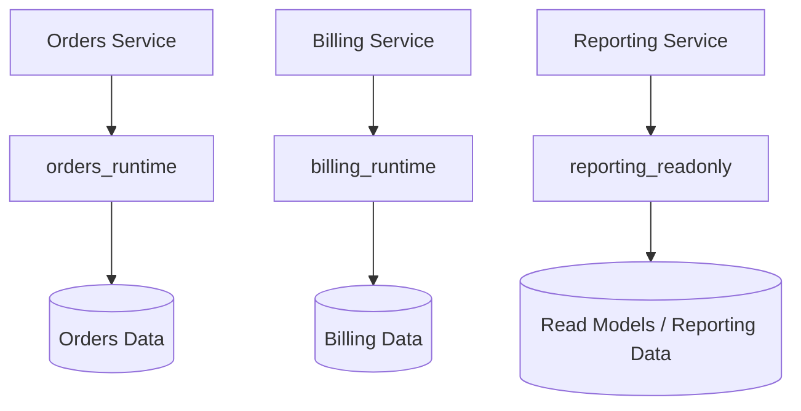
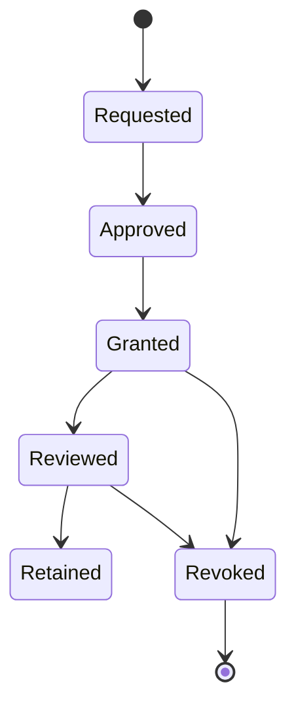

# 06- Least Privilege

## Overview

Least privilege is the practice of granting an identity **only the permissions required to perform its intended responsibilities, and no more**.

In PostgreSQL, this principle applies to:

- Database roles
- Database `CONNECT`
- Schema privileges
- Table privileges
- Column privileges
- Sequence privileges
- Function privileges
- Role membership
- Object ownership
- Row-Level Security (RLS)
- Administrative capabilities

The goal is to reduce the blast radius of compromised credentials, application vulnerabilities, operational mistakes, and insider misuse.

A production backend should ideally follow:

```text
Service Responsibility
        ↓
Required Database Operations
        ↓
Dedicated Role
        ↓
Minimum Required Privileges
        ↓
Specific Database Objects
```

Rather than:

```text
Service
   ↓
Shared Admin Account
   ↓
Full Database Access
```

Least privilege is therefore not just a database-security technique. It is an architectural control that affects application design, CI/CD, incident response, multi-tenancy, and operational reliability.

---

## Why Least Privilege Matters

Consider a Django or FastAPI application connected using a highly privileged PostgreSQL role.

If an application vulnerability allows an attacker to influence SQL execution:

```text
Application Vulnerability
        ↓
Compromised Database Credential
        ↓
Highly Privileged PostgreSQL Role
        ↓
Entire Database
```

With a narrowly scoped runtime role:

```text
Application Vulnerability
        ↓
Compromised Database Credential
        ↓
orders_runtime
        ↓
Only Required Objects / Operations
```

The vulnerability still exists, but the potential impact is significantly reduced.

Least privilege therefore provides **blast-radius reduction**, not absolute security.

---

## Core Principle

For every service, ask:

> What database operations does this service actually need?

Then translate the answer into:

```text
Identity
  ↓
Role
  ↓
Object
  ↓
Operation
```

For example:

```text
Orders API
  ↓
orders_runtime
  ↓
app.orders
  ↓
SELECT, INSERT, UPDATE
```

If the service never deletes orders, there may be no reason to grant:

```sql
DELETE
```

If the service never changes the schema, there is usually no reason to grant unrestricted DDL privileges.

---

## Least Privilege vs Deny by Default

Least privilege works best when access is effectively **deny by default**.

The desired model is:

```text
No privilege
     ↓
Explicitly identify requirement
     ↓
Grant required privilege
```

Rather than:

```text
Grant everything
     ↓
Discover unnecessary permissions
     ↓
Attempt to remove them
```

Starting from broad access creates privilege debt that is difficult to eliminate safely.

---

## Database Role Design

A production system should generally avoid using one PostgreSQL role for every responsibility.

A stronger design is:

```text
orders_runtime
    ↓
Application CRUD

orders_worker
    ↓
Background processing

orders_readonly
    ↓
Reporting

orders_migration
    ↓
Schema changes

orders_admin
    ↓
Controlled administration
```

The exact number of roles should match operational boundaries.

Do not create dozens of roles merely for theoretical isolation if the organization cannot manage them reliably.

---

## Runtime Roles

A runtime role is used by an application during normal operation.

For example:

```text
FastAPI / Django
       ↓
orders_runtime
       ↓
PostgreSQL
```

The runtime role should normally have:

- Required database `CONNECT`
- Required schema `USAGE`
- Required table privileges
- Required sequence privileges
- Required function `EXECUTE` privileges
- No unnecessary administrative privileges

It should generally not need:

- `SUPERUSER`
- `CREATEROLE`
- `CREATEDB`
- `REPLICATION`
- `BYPASSRLS`
- Unrestricted schema creation
- Unrestricted DDL

---

## Migration Roles

Database migrations have fundamentally different privileges from normal application execution.

A migration may need to:

```text
CREATE TABLE
ALTER TABLE
CREATE INDEX
ADD CONSTRAINT
ALTER COLUMN
DROP obsolete objects
```

The runtime application normally does not.

A common architecture is:

```text
CI/CD
   ↓
orders_migration
   ↓
Schema changes

Application
   ↓
orders_runtime
   ↓
CRUD
```

This separation limits the consequences of application compromise.

---

## Read-Only Roles

Reporting systems often need data access without modification privileges.

For example:

```sql
CREATE ROLE reporting_readonly NOLOGIN;

GRANT CONNECT
ON DATABASE app
TO reporting_readonly;

GRANT USAGE
ON SCHEMA app
TO reporting_readonly;

GRANT SELECT
ON ALL TABLES IN SCHEMA app
TO reporting_readonly;
```

A read-only role is useful for:

- Reporting services
- BI tools
- Operational dashboards
- Support tooling
- Read-only APIs

It should not automatically receive:

```text
INSERT
UPDATE
DELETE
TRUNCATE
```

---

## Worker Roles

Background workers can have different access requirements from HTTP APIs.

For example:

```text
Celery
  ↓
orders_worker
  ↓
Order processing tables
```

If the worker only updates job state and order status, it may not require unrestricted access to user or billing data.

Dedicated worker roles improve:

- Security boundaries
- Auditability
- Incident response
- Permission clarity

---

## Administrative Roles

Administrative access should be tightly controlled.

Administrative identities may require privileges that application services should never possess.

Examples include:

- Role management
- Permission management
- Schema administration
- Database configuration
- Emergency troubleshooting

Administrative credentials should not be embedded into:

- Django settings
- FastAPI containers
- Docker images
- Kubernetes manifests
- CI variables with unnecessary exposure

Use controlled administrative access and appropriate secret-management mechanisms.

---

## Ownership vs Least Privilege

Ownership is stronger than ordinary CRUD privileges.

Consider:

```text
orders_runtime
    ↓
Owns orders table
```

The runtime identity now has ownership-level authority over the object.

A more controlled model is:

```text
orders_owner
    ↓
Owns database objects

orders_runtime
    ↓
Uses database objects
```

This separates object ownership from application execution.

It is especially valuable when runtime credentials are exposed to internet-facing services.

---

## Role Membership

Permission roles can be reused through role membership.

For example:

```sql
CREATE ROLE orders_readwrite NOLOGIN;

GRANT SELECT, INSERT, UPDATE
ON TABLE app.orders
TO orders_readwrite;

GRANT orders_readwrite
TO orders_runtime;
```

This creates:

```text
orders_runtime
       ↓
orders_readwrite
       ↓
SELECT / INSERT / UPDATE
       ↓
app.orders
```

Role hierarchies reduce duplicated grants but must be reviewed carefully because indirect memberships can make effective privileges harder to understand.

---

## Avoid Privilege Chains That Are Too Deep

Role composition is useful:

```text
service role
    ↓
permission role
    ↓
object privileges
```

But excessively deep hierarchies create operational complexity:

```text
service
  ↓
role A
  ↓
role B
  ↓
role C
  ↓
role D
  ↓
privilege
```

When troubleshooting authorization, engineers should be able to determine why a role has access without reconstructing an unnecessarily complex hierarchy.

---

## Schema Isolation

Schemas can reinforce service boundaries.

For example:

```text
app.orders
app.order_items
billing.invoices
billing.payments
```

Roles can then be restricted to relevant schemas.

Example:

```sql
GRANT USAGE
ON SCHEMA orders
TO orders_runtime;
```

This does not automatically grant table access.

The role still needs the appropriate object privileges.

---

## Table-Level Least Privilege

Suppose the Orders API requires:

```text
orders
order_items
customers
```

Instead of:

```sql
GRANT ALL
ON ALL TABLES IN SCHEMA app
TO orders_runtime;
```

prefer explicit grants when strong isolation is required:

```sql
GRANT SELECT, INSERT, UPDATE
ON TABLE app.orders
TO orders_runtime;

GRANT SELECT, INSERT
ON TABLE app.order_items
TO orders_runtime;

GRANT SELECT
ON TABLE app.customers
TO orders_runtime;
```

This makes the service's database contract explicit.

---

## Column-Level Least Privilege

Sometimes table-level access is still too broad.

For example, a reporting service may need:

```text
user.id
user.email
user.created_at
```

but not:

```text
user.password_hash
user.payment_token
```

PostgreSQL supports column-specific grants:

```sql
GRANT SELECT (id, email, created_at)
ON TABLE app.users
TO reporting_readonly;
```

Use column-level privileges when they provide a meaningful security boundary.

Do not introduce them everywhere merely because PostgreSQL supports them.

---

## Sequence Least Privilege

Sequences are separate database objects.

A service that inserts records may need sequence privileges depending on how identifiers are implemented.

For example:

```sql
GRANT USAGE, SELECT
ON SEQUENCE app.orders_id_seq
TO orders_runtime;
```

Granting sequence privileges broadly should still follow the same principle.

If the application needs access to only one sequence, granting access to every sequence in the schema may be unnecessarily broad.

---

## Function Least Privilege

Functions can provide a controlled interface to privileged operations.

For example:

```sql
GRANT EXECUTE
ON FUNCTION app.calculate_order_total(bigint)
TO orders_runtime;
```

A role may execute the function without receiving broad direct access to every underlying object, depending on the function's security context and implementation.

This can be useful for carefully designed database APIs.

---

## `SECURITY DEFINER`

A `SECURITY DEFINER` function runs with the privileges of its owner.

Conceptually:

```text
Low-privilege role
        ↓
SECURITY DEFINER function
        ↓
Function owner privileges
        ↓
Protected operation
```

This can intentionally provide a narrow privileged operation.

However, it can also create privilege-escalation vulnerabilities.

Security-sensitive `SECURITY DEFINER` functions should generally:

- Have a minimally privileged owner
- Restrict `EXECUTE`
- Use a safe `search_path`
- Prefer schema-qualified references
- Validate inputs
- Avoid unsafe dynamic SQL
- Be carefully reviewed

For example:

```sql
CREATE FUNCTION app.safe_operation(...)
RETURNS ...
LANGUAGE plpgsql
SECURITY DEFINER
SET search_path = app, pg_temp
AS $$
BEGIN
    -- Controlled privileged operation.
END;
$$;
```

The exact function implementation must be designed so that attacker-controlled objects cannot influence name resolution or SQL execution.

---

## `PUBLIC` and Least Privilege

`PUBLIC` represents all PostgreSQL roles.

Therefore:

```sql
GRANT SELECT
ON TABLE app.orders
TO PUBLIC;
```

is a very broad authorization decision.

Prefer:

```sql
GRANT SELECT
ON TABLE app.orders
TO reporting_readonly;
```

unless the data is intentionally public to every database role.

Review existing `PUBLIC` privileges during security audits.

---

## RLS and Least Privilege

Least privilege operates at multiple levels.

```text
Role
  ↓
Object privileges
  ↓
RLS
  ↓
Allowed rows
```

For a multi-tenant application:

```sql
ALTER TABLE app.orders ENABLE ROW LEVEL SECURITY;

CREATE POLICY tenant_orders
ON app.orders
USING (
    tenant_id = current_setting('app.tenant_id')::uuid
)
WITH CHECK (
    tenant_id = current_setting('app.tenant_id')::uuid
);
```

This allows the role to operate on the table while restricting which rows it can access.

Roles with `BYPASSRLS` require special scrutiny.

Table owners also require attention because ownership normally bypasses RLS unless forced row-level security is configured.

---

## Application Authorization

Database least privilege does not replace application authorization.

Consider:

```text
User
  ↓
Django / FastAPI authorization
  ↓
Database runtime role
  ↓
PostgreSQL privileges
  ↓
RLS
```

Each layer answers a different question.

| Layer | Example Question |
|---|---|
| Authentication | Who is the user? |
| Application authorization | Can this user cancel this order? |
| PostgreSQL privilege | Can this service update `orders`? |
| RLS | Which rows can this database role access? |
| Constraints | Is the resulting data state valid? |

Do not attempt to encode every business permission as a PostgreSQL role.

---

## Least Privilege in Connection Pools

Connection pools complicate authorization because multiple application requests reuse database connections.

```text
Request A ─┐
Request B ─┼──> Connection Pool ──> PostgreSQL
Request C ─┘
```

The database usually sees the service role:

```text
orders_runtime
```

not the individual application user.

If request-specific context is stored in session state, it must be scoped carefully.

For example, tenant context can be transaction-scoped:

```sql
BEGIN;

SET LOCAL app.tenant_id =
    '00000000-0000-0000-0000-000000000001';

SELECT id, total
FROM app.orders;

COMMIT;
```

`SET LOCAL` helps prevent request-specific authorization context from leaking into subsequent work performed on the same pooled connection.

---

## Least Privilege with Django

A Django deployment can use a dedicated runtime role:

```text
Django
   ↓
orders_runtime
   ↓
PostgreSQL
```

The runtime role should contain only the privileges required by the application.

Migration execution can use a separate identity:

```text
CI/CD
   ↓
orders_migration
   ↓
PostgreSQL schema changes
```

This avoids using one credential for both:

```text
Normal application traffic
+
Schema administration
```

---

## Least Privilege with FastAPI

FastAPI applications follow the same model.

```text
FastAPI
   ↓
SQLAlchemy / psycopg
   ↓
orders_runtime
   ↓
PostgreSQL
```

The database role should be configured independently from application user permissions.

A user having an API-level permission such as:

```text
orders.cancel
```

does not mean the database role should receive unrestricted administrative privileges.

---

## Least Privilege in Microservices

Service-specific database roles are especially useful in microservice architectures.



A compromised Orders service should not automatically gain write access to Billing tables.

The strongest form of isolation is often separate databases or database clusters, but role and schema boundaries still provide valuable defense in depth within shared infrastructure.

---

## Least Privilege for Celery Workers

Celery workers may have different permissions from API servers.

For example:

```text
API
  ↓
orders_runtime

Celery
  ↓
orders_worker
```

A worker processing asynchronous order events may need:

```text
SELECT orders
UPDATE orders
INSERT audit_events
```

but not:

```text
DROP TABLE
CREATE ROLE
ALTER DATABASE
```

Dedicated credentials make these boundaries enforceable.

---

## Least Privilege with Kafka Consumers

Kafka consumers should follow the same model.

```text
Kafka
  ↓
Order Consumer
  ↓
orders_worker
  ↓
PostgreSQL
```

The consumer's database permissions should correspond to its processing responsibility.

This is particularly important because asynchronous consumers can run independently of the API and may process large volumes of data.

---

## Least Privilege and Redis

Redis authorization is separate from PostgreSQL authorization.

A service may have:

```text
PostgreSQL
    ↓
orders_runtime
```

and:

```text
Redis
    ↓
Orders-specific credentials / ACL
```

Do not assume that restricting PostgreSQL access automatically restricts Redis access.

Least privilege must be applied consistently across the infrastructure.

---

## Least Privilege and AWS

AWS infrastructure should extend the same principle beyond PostgreSQL.

For example:

```text
EKS Pod
  ↓
Kubernetes Service Account
  ↓
AWS IAM Role
  ↓
Secrets / Database Connectivity
```

The application should receive only the AWS permissions it requires.

Similarly, database credentials should be scoped to the appropriate database role.

The broader security model becomes:

```text
AWS IAM
   +
Kubernetes Identity
   +
Database Role
   +
Database Privileges
   +
Application Authorization
```

Each layer limits blast radius.

---

## Least Privilege in Kubernetes

Do not embed highly privileged database credentials into every deployment.

Prefer:

```text
Deployment
   ↓
Secret / External Secret
   ↓
Runtime Credential
   ↓
Runtime Database Role
```

For separate workloads:

```text
orders-api
   ↓
orders_runtime

orders-worker
   ↓
orders_worker
```

This prevents unrelated workloads from sharing the same database authority.

---

## Least Privilege and CI/CD

CI/CD systems often require elevated privileges for schema migrations.

A safer model is:

```text
Application Deployment
       ↓
Runtime role

Migration Job
       ↓
Migration role
```

The migration role should itself be limited to the database/schema it manages where practical.

Do not automatically provide CI/CD with unrestricted superuser access just because migrations occasionally require elevated operations.

---

## Default Privileges

Least privilege must account for future database objects.

For example:

```sql
ALTER DEFAULT PRIVILEGES
FOR ROLE app_owner
IN SCHEMA app
GRANT SELECT
ON TABLES
TO reporting_readonly;
```

Default privileges prevent newly created objects from accidentally diverging from the intended authorization model.

Remember:

```text
GRANT
  → existing specified objects

ALTER DEFAULT PRIVILEGES
  → future objects created by the relevant role
```

Default privileges are not retroactive.

---

## Permission Lifecycle

Privileges should have a lifecycle.



For sensitive access, consider:

- Owner
- Business justification
- Scope
- Start date
- Expiration
- Review frequency
- Revocation process

Temporary access should not silently become permanent access.

---

## Privilege Inventory

Maintain an inventory of:

| Area | Questions |
|---|---|
| Roles | Which roles can log in? |
| Memberships | Which roles inherit or receive other roles? |
| Ownership | Which roles own schemas/tables/functions? |
| Tables | Who can read/write each table? |
| Sequences | Who can use each sequence? |
| Functions | Who can execute privileged functions? |
| RLS | Which tables have policies? |
| `BYPASSRLS` | Which roles can bypass RLS? |
| `PUBLIC` | Which privileges are globally exposed? |
| Administrative roles | Who can modify roles and privileges? |

This inventory is the foundation for periodic access reviews.

---

## Permission Review

A mature organization periodically compares:

```text
Intended Permissions
        vs
Actual Permissions
```

Example:

```text
orders_runtime
    Expected:
      SELECT orders
      INSERT orders
      UPDATE orders

    Actual:
      SELECT orders
      INSERT orders
      UPDATE orders
      DELETE orders
      CREATE schema objects
```

The difference represents privilege drift.

---

## Privilege Drift

Privilege drift occurs when permissions gradually become broader than intended.

Common causes include:

- Emergency grants
- Temporary debugging access
- Shared credentials
- New migrations
- Service ownership changes
- New tables
- Role membership changes
- Forgotten administrators

A common pattern is:

```text
Production incident
      ↓
GRANT ALL
      ↓
Incident resolved
      ↓
Grant forgotten
      ↓
Permanent privilege escalation
```

Every emergency privilege change should have a defined rollback or review process.

---

## Testing Least Privilege

Do not test only that authorized queries work.

Test that unauthorized queries fail.

For example:

```text
orders_runtime
    ✓ SELECT orders
    ✓ INSERT orders
    ✓ UPDATE orders
    ✗ DROP orders
    ✗ CREATE ROLE
    ✗ UPDATE billing
```

A strong security test suite validates both:

```text
Positive authorization
+
Negative authorization
```

---

## Example Authorization Test

An operational test can verify effective privileges:

```sql
SELECT
    has_table_privilege(
        'orders_runtime',
        'app.orders',
        'SELECT'
    ) AS can_select,
    has_table_privilege(
        'orders_runtime',
        'app.orders',
        'DELETE'
    ) AS can_delete;
```

The expected result should be treated as part of the service's authorization contract.

---

## Least Privilege and Performance

Least privilege normally has negligible impact compared with query execution, indexing, I/O, and concurrency.

However, poorly designed authorization can affect performance through:

- Complex RLS predicates
- Expensive authorization functions
- Unindexed tenant predicates
- Excessive application-level authorization queries

Security should therefore be designed with query performance in mind.

For example, if RLS frequently evaluates:

```sql
tenant_id = current_setting('app.tenant_id')::uuid
```

the relevant tenant column should generally be indexed when query patterns benefit from it.

---

## Least Privilege and Reliability

Security restrictions can cause availability failures when incorrectly configured.

Example:

```text
Deployment
   ↓
New table created
   ↓
Runtime role lacks SELECT
   ↓
Application requests fail
```

Therefore, least privilege should be implemented through controlled changes and automated validation rather than ad-hoc permission modifications.

The objective is:

```text
Secure
+
Correct
+
Operationally predictable
```

---

## High Availability Considerations

Failover should not change the intended authorization model.

After a PostgreSQL failover, verify:

```text
Application
    ↓
New primary
    ↓
Runtime role
    ↓
Expected privileges
    ↓
Successful operations
```

HA testing should include authorization checks, not merely:

```text
Can I connect?
```

A service that can connect but cannot perform required operations is still unavailable.

---

## Disaster Recovery Considerations

A DR plan should preserve or reconstruct the intended authorization model.

Consider:

- Roles
- Role memberships
- Ownership
- Grants
- Default privileges
- RLS policies
- Functions
- Authentication configuration
- Secret-management configuration

Data recovery without correct authorization can result in either:

```text
Application outage
```

or:

```text
Unexpected data exposure
```

---

## Monitoring

Monitor signals that indicate privilege problems or privilege expansion.

Useful signals include:

- `permission denied` database errors
- Unexpected authentication failures
- Role membership changes
- `GRANT` / `REVOKE` changes
- Ownership changes
- RLS configuration changes
- Privileged role changes
- Unexpected DDL attempts

Application logs should provide enough context to identify the affected operation without exposing credentials or sensitive query parameters.

---

## Auditing

For security-sensitive environments, record changes to authorization state.

An audit record should ideally answer:

```text
Who changed access?
What changed?
Which role?
Which object?
When?
Why?
```

Audit sources may include:

- PostgreSQL logs
- Database auditing extensions
- CI/CD logs
- Cloud audit logs
- Infrastructure audit systems
- Change-management systems

---

## Cost Considerations

Least privilege can reduce the cost of security incidents and operational complexity.

However, overly granular permissions can increase:

- Role count
- Migration complexity
- Audit effort
- Troubleshooting time
- Deployment failures

The goal is not:

```text
Maximum number of restrictions
```

The goal is:

```text
Minimum required privilege
+
Clear ownership
+
Manageable operations
```

---

## Production Architecture

A practical backend authorization architecture can look like:

```text
                         PostgreSQL
                             │
          ┌──────────────────┼──────────────────┐
          │                  │                  │
    Runtime Roles       Worker Roles       Read Roles
          │                  │                  │
     Service CRUD       Async Processing     Reporting
          │                  │                  │
          └──────────────────┼──────────────────┘
                             │
                       Object Privileges
                             │
                           RLS
                             │
                        Application Data

              Separate Administrative Path
                             │
                       Migration / Admin
```

The key boundary is:

```text
Application execution
        ≠
Schema administration
        ≠
Database administration
```

---

## Least Privilege Design Procedure

When creating a new service:

1. Identify the service's responsibilities.
2. List every database object it needs.
3. Identify the exact operation required on each object.
4. Create a dedicated runtime role.
5. Grant database and schema access explicitly.
6. Grant table privileges at the narrowest practical scope.
7. Review sequence and function dependencies.
8. Separate migration privileges.
9. Evaluate RLS and tenant isolation requirements.
10. Review role memberships and ownership.
11. Test allowed and denied operations.
12. Document the permission matrix.
13. Deploy through version-controlled changes.
14. Periodically compare actual permissions with intended permissions.

---

## Production Checklist

- [ ] Every application has an appropriately scoped database role.
- [ ] Runtime credentials are separate from migration credentials where practical.
- [ ] Runtime roles are not `SUPERUSER`.
- [ ] Unnecessary `CREATEDB`, `CREATEROLE`, `REPLICATION`, and `BYPASSRLS` privileges are absent.
- [ ] Schema privileges are explicitly reviewed.
- [ ] Table privileges are explicitly reviewed.
- [ ] Sequence privileges are explicitly reviewed.
- [ ] Function privileges are explicitly reviewed.
- [ ] Object ownership is intentionally designed.
- [ ] `PUBLIC` privileges are reviewed.
- [ ] Role memberships are documented.
- [ ] RLS is used where row-level isolation is required.
- [ ] Connection-pool session state cannot leak tenant context.
- [ ] Default privileges are configured where required.
- [ ] Permission changes are version-controlled.
- [ ] Positive and negative authorization tests exist.
- [ ] Privilege drift is periodically reviewed.
- [ ] Emergency access has a revocation process.
- [ ] HA and DR procedures include authorization validation.

---

## Common Mistakes

### Using One Database User Everywhere

**Problem:** Django, Celery, reporting, migrations, and administrators all share the same role.

**Risk:** One compromised credential has an enormous blast radius.

**Better:** Separate responsibilities with dedicated roles.

### Granting `ALL PRIVILEGES`

**Problem:** The fastest way to eliminate permission errors becomes the permanent authorization model.

**Risk:** Runtime credentials become unnecessarily powerful.

**Better:** Grant only the operations required by the workload.

### Giving Runtime Roles DDL Access

**Problem:** The application and migration process use the same identity.

**Risk:** Application compromise can become schema compromise.

**Better:** Separate runtime and migration credentials.

### Making Runtime Roles Object Owners

**Problem:** Developers grant CRUD access and ownership without distinguishing them.

**Risk:** Runtime credentials receive ownership-level authority.

**Better:** Use dedicated object-owner roles where the security model benefits from that separation.

### Ignoring Role Membership

**Problem:** Engineers inspect direct grants only.

**Risk:** Effective privileges may be much broader than expected.

**Better:** Review the complete role membership graph.

### Ignoring `PUBLIC`

**Problem:** Explicit role grants look secure while broad privileges remain granted to `PUBLIC`.

**Risk:** Unexpected roles receive access.

**Better:** Audit `PUBLIC` privileges.

### Forgetting Future Objects

**Problem:** Existing tables have correct permissions.

**Risk:** New migration-created objects receive inconsistent access.

**Better:** Configure `ALTER DEFAULT PRIVILEGES` for the correct object-creating role.

### Treating RLS as the Entire Security Model

**Problem:** RLS is assumed to replace database privileges and application authorization.

**Risk:** Ownership, `BYPASSRLS`, grants, and application-level authorization may still create gaps.

**Better:** Design role privileges, RLS, and application authorization as complementary controls.

### Over-Engineering Permissions

**Problem:** Every table and operation receives a unique role.

**Risk:** Permission management becomes impossible to reason about.

**Better:** Use meaningful security boundaries rather than maximum granularity.

---

## Interview Traps

### What is least privilege?

Granting an identity only the permissions required for its responsibilities and avoiding unnecessary authority.

### Why is least privilege important for database roles?

It reduces the blast radius of compromised credentials, application vulnerabilities, operational mistakes, and insider misuse.

### Should an application runtime role have migration privileges?

Usually no. Runtime execution and schema administration have different responsibilities and should be separated where practical.

### Why shouldn't an application role normally own database objects?

Ownership provides stronger authority than ordinary CRUD access. Separating ownership from runtime execution can reduce the impact of compromised application credentials.

### Does least privilege mean granting one privilege at a time to every table?

No. The goal is appropriate security boundaries, not maximum administrative complexity. Permission roles and schema-level grants can be appropriate when their scope is intentional.

### How does RLS complement least privilege?

Object privileges determine whether the role can access the object, while RLS can further restrict which rows that role can access.

### Why are role memberships important during a least-privilege audit?

A role may receive privileges indirectly through membership in another role, so direct grants alone do not describe effective access.

### What is privilege drift?

Privilege drift occurs when actual access becomes broader than the intended authorization model, often due to emergency grants, changing services, new objects, or forgotten temporary access.

### How should least privilege be tested?

Test both required operations and explicitly forbidden operations. A secure role should demonstrate that unnecessary operations fail.

### What is the senior-level approach to least privilege?

Treat database authorization as an architectural boundary: separate responsibilities, minimize runtime authority, control ownership and role membership, combine privileges with RLS where appropriate, automate permission changes, and continuously review effective access.

## Key Takeaways

- **Least privilege reduces blast radius** by ensuring compromised services and credentials receive only the database authority required for their responsibilities.
- **Separate runtime, worker, reporting, migration, and administrative responsibilities** when they have materially different privilege requirements.
- **Effective access is broader than direct grants** because role membership, ownership, `PUBLIC`, special role attributes, and RLS all influence authorization.
- **Least privilege must be operationally maintained**, including default privileges, permission testing, version-controlled changes, auditing, and periodic privilege-drift reviews.
- **The strongest production model combines layers**: application authorization, narrowly scoped database roles, object privileges, RLS where appropriate, and controlled administrative access.