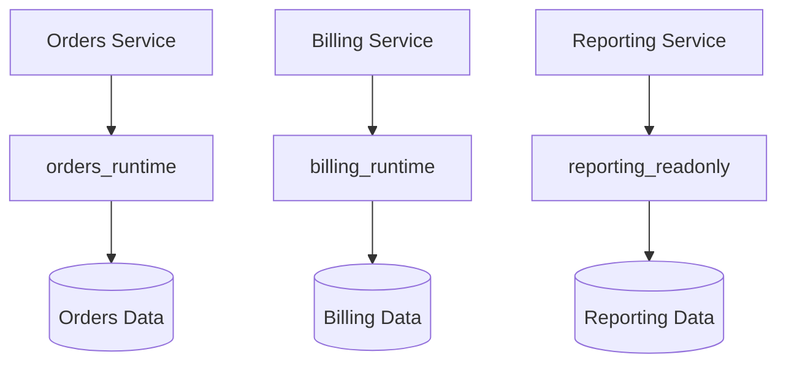
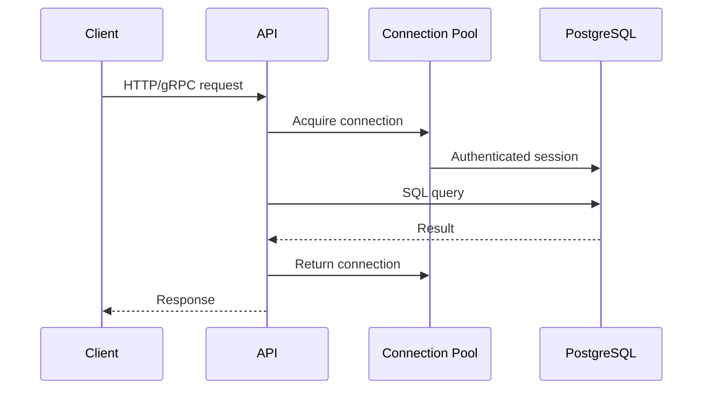

# 07- Application Database Users

## Overview

An application database user is the PostgreSQL identity used by an application, worker, reporting service, or deployment process to connect to the database.

In PostgreSQL, the underlying security primitive is a **role**. A role can have the `LOGIN` attribute and therefore act as a database login identity.

A production backend should avoid treating the database user as a generic administrator account.

Instead, database identities should represent **workload responsibilities**:

```text
Django / FastAPI API
        ↓
   app_runtime
        ↓
   PostgreSQL

Celery Worker
        ↓
   app_worker
        ↓
   PostgreSQL

Reporting Service
        ↓
   app_readonly
        ↓
   PostgreSQL

CI/CD Migration Job
        ↓
   app_migration
        ↓
   PostgreSQL
```

This separation provides a practical security boundary between application execution, background processing, reporting, schema management, and administration.

---

## PostgreSQL Users vs Roles

PostgreSQL historically used the term **user**, but modern PostgreSQL uses the more general concept of a **role**.

A role can:

- Have `LOGIN` and act as a database login
- Be `NOLOGIN` and serve as a permission group
- Own database objects
- Receive privileges
- Receive membership in other roles
- Grant membership to other roles when authorized

For example:

```sql
CREATE ROLE app_runtime
LOGIN
PASSWORD 'use-a-secret-manager';
```

A permission-only role can be:

```sql
CREATE ROLE app_readwrite NOLOGIN;
```

The distinction is:

```text
LOGIN role
    ↓
Can authenticate to PostgreSQL

NOLOGIN role
    ↓
Permission / membership grouping
```

---

## Why Application Database Users Matter

The database identity determines the security boundary under which application SQL executes.

Consider:

```text
HTTP Request
     ↓
Django / FastAPI
     ↓
Database Driver
     ↓
PostgreSQL Role
     ↓
Privileges
     ↓
Database Operation
```

If the application uses a superuser:

```text
Application compromise
       ↓
Superuser credential
       ↓
Potentially unrestricted database authority
```

If it uses a restricted runtime role:

```text
Application compromise
       ↓
Restricted credential
       ↓
Limited database authority
```

The second design significantly reduces blast radius.

---

## Application User Architecture

A typical production architecture separates database identities by responsibility.

| Database Role | Purpose | Typical Access |
|---|---|---|
| `app_runtime` | API application | Required CRUD |
| `app_worker` | Celery/background processing | Worker-specific operations |
| `app_readonly` | Reporting/read-only workloads | `SELECT` |
| `app_migration` | Schema migrations | Required DDL |
| `app_admin` | Controlled administration | Elevated |
| `app_owner` | Object ownership | `NOLOGIN` where practical |

The exact role model depends on the system's security and operational requirements.

---

## Runtime Database User

The runtime role is the identity used by normal application requests.

Example:

```text
Django
   ↓
app_runtime
   ↓
PostgreSQL
```

The runtime role should generally have:

- `LOGIN`
- Database `CONNECT`
- Required schema `USAGE`
- Required table privileges
- Required sequence privileges
- Required function privileges

It should generally not have unnecessary:

- `SUPERUSER`
- `CREATEDB`
- `CREATEROLE`
- `REPLICATION`
- `BYPASSRLS`
- Schema administration privileges

---

## Creating a Runtime Role

A basic PostgreSQL role can be created with:

```sql
CREATE ROLE app_runtime
LOGIN;
```

Credentials should be managed outside source code.

For example, a deployment might inject credentials through:

```text
AWS Secrets Manager
        ↓
Kubernetes Secret / External Secret
        ↓
Application
        ↓
PostgreSQL
```

Do not place production passwords directly in:

- Git repositories
- Dockerfiles
- Source code
- Public configuration
- Container images
- Documentation

---

## Password Authentication

If password authentication is used, PostgreSQL stores credentials according to its configured password authentication mechanism.

From an application architecture perspective:

```text
Application
    ↓
Username + Password / Secret
    ↓
PostgreSQL Authentication
    ↓
Role
```

Authentication answers:

> Is this connection allowed to authenticate as this role?

Authorization answers:

> What can this role do after authentication?

These are separate security concerns.

---

## Authentication vs Authorization

A useful distinction is:

| Layer | Question |
|---|---|
| Authentication | Who is connecting? |
| Database role | Which PostgreSQL identity is being used? |
| Privileges | What operations can that role perform? |
| RLS | Which rows can the role access? |
| Application authorization | What can the application user do? |

For example:

```text
End User
   ↓
Application authentication
   ↓
Application authorization
   ↓
app_runtime
   ↓
PostgreSQL privileges
   ↓
RLS
```

The application user is usually **not** represented by an individual PostgreSQL login role.

---

## One Database User Per Application

Using one database role per application can be a reasonable baseline.

For example:

```text
Orders API
    ↓
orders_runtime

Billing API
    ↓
billing_runtime
```

This is much better than:

```text
Orders API ─┐
Billing API ├──> shared_admin
Reports  ───┘
```

The shared-admin approach creates a large blast radius.

---

## One Database User Per Microservice

In a microservice architecture, dedicated database roles can reinforce service boundaries.



If services share one PostgreSQL cluster, separate roles can still restrict:

```text
Who can access which schema?
Who can modify which tables?
Who can execute which functions?
```

For stronger isolation, separate databases or clusters may be appropriate.

---

## Runtime User vs Migration User

One of the most important production boundaries is separating application runtime access from schema administration.

Consider:

```text
Application
   ↓
app_runtime
   ↓
SELECT / INSERT / UPDATE / DELETE

CI/CD
   ↓
app_migration
   ↓
CREATE / ALTER / migration operations
```

If both use:

```text
app_admin
```

then a compromised application credential may be able to modify the database schema.

Separate identities reduce this risk.

---

## Migration User

Migration roles exist for schema changes.

Typical operations include:

```text
CREATE TABLE
ALTER TABLE
CREATE INDEX
ALTER TABLE ... ADD CONSTRAINT
DROP obsolete objects
```

The exact privileges required depend on the migration framework and schema ownership model.

A migration role should receive only the administrative scope necessary for the databases and schemas it manages.

---

## Object Owner Role

A useful advanced pattern is separating object ownership from runtime execution.

For example:

```sql
CREATE ROLE app_owner NOLOGIN;
CREATE ROLE app_runtime LOGIN;
CREATE ROLE app_migration LOGIN;
```

Conceptually:

```text
app_owner
    ↓
Owns database objects

app_migration
    ↓
Controlled schema changes

app_runtime
    ↓
Normal application operations
```

This prevents the application's long-lived runtime credential from automatically becoming the owner of every database object.

---

## Why `NOLOGIN` Owner Roles Are Useful

An object-owner role can be created as:

```sql
CREATE ROLE app_owner NOLOGIN;
```

This means the role is not intended to authenticate directly.

It can still own objects and participate in the permission model.

The benefit is separation:

```text
Ownership identity
        ≠
Application execution identity
```

This can make privilege boundaries clearer and reduce the value of compromised runtime credentials.

---

## Permission Roles

Permission roles can further separate authorization from authentication.

For example:

```sql
CREATE ROLE app_readwrite NOLOGIN;

GRANT SELECT, INSERT, UPDATE, DELETE
ON ALL TABLES IN SCHEMA app
TO app_readwrite;

GRANT app_readwrite
TO app_runtime;
```

The architecture becomes:

```text
app_runtime
     ↓
app_readwrite
     ↓
CRUD privileges
```

This makes permission sets reusable.

---

## Role Membership Complexity

Role membership can simplify administration but can also make access harder to understand.

For example:

```text
app_runtime
    ↓
app_readwrite
    ↓
app_data_access
    ↓
table privileges
```

Avoid unnecessarily deep role hierarchies.

A reviewer should be able to determine why an application can access an object without reconstructing a large privilege graph.

---

## Database Connection Lifecycle

A typical backend request follows:



The PostgreSQL role is associated with the database connection.

With connection pooling, many application requests may reuse connections authenticated as the same role.

---

## Connection Pooling

For example:

```text
Request A ─┐
Request B ─┼──> Connection Pool ──> app_runtime
Request C ─┘
```

PostgreSQL normally sees:

```text
app_runtime
```

rather than:

```text
user_123
user_456
user_789
```

This is why application-level user authorization must remain separate from database role authorization.

---

## Connection Pooling and Tenant Context

Connection pooling requires special care when tenant-specific context is stored in PostgreSQL session state.

For example:

```sql
BEGIN;

SET LOCAL app.tenant_id =
    '00000000-0000-0000-0000-000000000001';

SELECT id, total
FROM app.orders;

COMMIT;
```

`SET LOCAL` scopes the setting to the current transaction.

This is useful when RLS depends on:

```sql
current_setting('app.tenant_id')
```

because the next request may reuse the same physical database connection.

---

## Application Database Users and RLS

A common multi-tenant architecture is:

```text
All application requests
        ↓
app_runtime
        ↓
Table privileges
        ↓
RLS
        ↓
Tenant-specific rows
```

For example:

```sql
ALTER TABLE app.orders ENABLE ROW LEVEL SECURITY;

CREATE POLICY tenant_orders
ON app.orders
USING (
    tenant_id = current_setting('app.tenant_id')::uuid
)
WITH CHECK (
    tenant_id = current_setting('app.tenant_id')::uuid
);
```

The database role provides object-level access while RLS provides row-level isolation.

Roles with `BYPASSRLS` require special review.

Table ownership also requires care because owners normally bypass RLS unless forced row-level security is configured.

---

## Application Users Are Not PostgreSQL Users

Suppose a customer signs into a Django application.

The customer may be:

```text
Application User
    ↓
id = 12345
```

But the database connection may be:

```text
PostgreSQL Role
    ↓
app_runtime
```

This is intentional.

Creating one PostgreSQL role per end user would usually create unnecessary complexity in a typical web application.

Instead:

```text
Application identity
       ↓
Application authorization
       ↓
Shared service database identity
       ↓
RLS / SQL predicates where appropriate
```

---

## Django Database Configuration

A Django application might use environment-provided credentials:

```python
DATABASES = {
    "default": {
        "ENGINE": "django.db.backends.postgresql",
        "NAME": "app",
        "USER": os.environ["DB_USER"],
        "PASSWORD": os.environ["DB_PASSWORD"],
        "HOST": os.environ["DB_HOST"],
        "PORT": os.environ.get("DB_PORT", "5432"),
    }
}
```

The important production principle is that:

```text
DB_USER
```

should represent the application's intended runtime role rather than an administrative account.

---

## FastAPI Database Configuration

FastAPI applications commonly use SQLAlchemy or a PostgreSQL driver.

For example:

```python
from sqlalchemy import create_engine

engine = create_engine(
    "postgresql+psycopg://app_runtime:password@db:5432/app",
    pool_size=10,
    max_overflow=5,
    pool_timeout=10,
    pool_pre_ping=True,
)
```

In production, credentials should come from a secret-management system rather than being hard-coded.

The important security property is:

```text
Database URL
    ↓
Restricted runtime role
```

not:

```text
Database URL
    ↓
Administrator
```

---

## Docker

A Docker image should not contain production database credentials.

Avoid:

```dockerfile
ENV DB_PASSWORD=production-password
```

Instead:

```text
Container
   ↓
Runtime environment / secret injection
   ↓
DB_USER
DB_PASSWORD
DB_HOST
```

The image can remain immutable while environment-specific credentials are supplied at deployment time.

---

## Kubernetes

A Kubernetes deployment commonly uses:

```text
Deployment
    ↓
Secret / External Secret
    ↓
Environment variables or mounted secret
    ↓
Application
    ↓
PostgreSQL runtime role
```

Separate workloads can receive separate credentials:

```text
orders-api
    ↓
orders_runtime

orders-worker
    ↓
orders_worker
```

This prevents every workload from inheriting the same database authority.

---

## AWS Secrets Management

In AWS environments, database credentials can be managed using services such as Secrets Manager.

A typical flow is:

```text
AWS Secrets Manager
        ↓
Secret synchronization / application retrieval
        ↓
Kubernetes / ECS workload
        ↓
Database connection
        ↓
PostgreSQL role
```

Secrets should be:

- Rotated
- Access-controlled
- Audited
- Excluded from source control
- Restricted to workloads that require them

Secret management does not replace least privilege; it protects the credential while the PostgreSQL role limits what the credential can do.

---

## Credential Rotation

Long-lived database credentials increase operational risk.

A production system should have a rotation strategy.

Conceptually:

```text
Current Credential
       ↓
Create / provision new credential
       ↓
Deploy application support
       ↓
Switch consumers
       ↓
Validate
       ↓
Retire old credential
```

Rotation must account for:

- Connection pools
- Long-lived worker processes
- Kubernetes pods
- Celery workers
- Scheduled jobs
- Migration jobs
- Failover infrastructure

A password change that ignores persistent connections can create unexpected outages.

---

## Separate Credentials by Environment

Do not reuse production database credentials in:

- Local development
- CI
- Test environments
- Staging
- Developer laptops

Prefer:

```text
Development
    ↓
dev_runtime

Staging
    ↓
staging_runtime

Production
    ↓
prod_runtime
```

Environment separation limits accidental production access.

---

## Local Development

Developers may use a local PostgreSQL role:

```sql
CREATE ROLE local_runtime
LOGIN
PASSWORD 'local-development-password';
```

Development environments can intentionally be more convenient, but production credentials should never be copied into local configuration.

A local role should not automatically receive access to production infrastructure.

---

## CI/CD Database Users

CI/CD commonly requires several distinct database operations.

For example:

```text
CI
 ├── Tests
 │    ↓
 │  test_runtime
 │
 └── Migrations
      ↓
   migration_role
```

A test suite does not normally require the same privileges as production schema migration.

This separation also reduces the consequences of a compromised CI environment.

---

## Read Replicas

Read replicas may use separate credentials or role configurations depending on the deployment architecture.

A reporting application can use:

```text
reporting_readonly
       ↓
Read replica
```

while the application runtime uses:

```text
app_runtime
       ↓
Primary
```

This can provide both:

- Read workload isolation
- Authorization isolation

Replica architecture and database authorization should be designed together.

---

## Background Workers

A Celery worker may require broader access to certain operational tables than the API.

Example:

```text
API
 ↓
app_runtime

Celery
 ↓
app_worker
```

Worker permissions should reflect actual processing responsibilities.

For example, a worker may need:

```text
SELECT jobs
UPDATE jobs
INSERT audit_events
```

without receiving unrestricted access to unrelated financial or administrative data.

---

## Database Users and Kafka Consumers

Kafka consumers should also use purpose-specific database identities.

```text
Kafka Topic
     ↓
Order Consumer
     ↓
orders_worker
     ↓
PostgreSQL
```

This becomes particularly important when multiple asynchronous consumers have different responsibilities.

A consumer should not automatically use the same role as every API service.

---

## Database Users and gRPC

gRPC does not change the PostgreSQL authorization model.

The flow remains:

```text
gRPC Client
    ↓
gRPC Service
    ↓
Database Driver
    ↓
PostgreSQL Role
```

The service authenticates its database connection using its assigned role.

Application-level identity and authorization remain separate from PostgreSQL authentication.

---

## Role Ownership Model

A production PostgreSQL environment can use:

```text
app_owner
    NOLOGIN
       │
       └── Owns objects

app_runtime
    LOGIN
       │
       └── Normal application access

app_worker
    LOGIN
       │
       └── Background processing

app_readonly
    LOGIN
       │
       └── Reporting

app_migration
    LOGIN
       │
       └── Schema changes
```

This model creates clear operational boundaries.

---

## Privilege Matrix

A permission matrix should be documented.

| Identity | Login | CRUD | Reporting | DDL | RLS Bypass |
|---|---:|---:|---:|---:|---:|
| `app_runtime` | Yes | Required | No | No | No |
| `app_worker` | Yes | Worker-specific | No | No | No |
| `app_readonly` | Yes | No | `SELECT` | No | No |
| `app_migration` | Yes | As required | No | Required | No |
| `app_owner` | No | Ownership | No | Ownership | Carefully controlled |

The actual privileges should be based on workload requirements rather than blindly copying this example.

---

## Least Privilege

The application database user should have the smallest useful privilege set.

For example:

```sql
GRANT CONNECT
ON DATABASE app
TO app_runtime;

GRANT USAGE
ON SCHEMA app
TO app_runtime;

GRANT SELECT, INSERT, UPDATE, DELETE
ON TABLE app.orders
TO app_runtime;
```

If the service does not need `DELETE`, do not grant it.

If it does not need access to `billing.payments`, do not grant it.

---

## Avoid Superuser Application Accounts

This is one of the most important rules:

```text
Never use PostgreSQL SUPERUSER
as a normal application runtime identity.
```

A superuser can bypass many normal authorization boundaries.

If the application credential is compromised:

```text
Application compromise
       ↓
SUPERUSER
       ↓
Potentially unrestricted PostgreSQL control
```

The runtime identity should be deliberately constrained.

---

## Avoid Shared Administrative Credentials

Avoid:

```text
Django
FastAPI
Celery
CI/CD
Developers
    ↓
shared_admin
```

This creates:

- Large blast radius
- Poor accountability
- Difficult credential rotation
- Difficult auditing
- Difficult incident response

Prefer:

```text
Django → app_runtime
Celery → app_worker
CI/CD → app_migration
Reporting → app_readonly
Admin → controlled admin role
```

---

## Credential Rotation and Connection Pools

Persistent connections create an important operational consideration.

Suppose:

```text
DB password changes
       ↓
Existing pooled connections
       ↓
May continue until disconnected
```

New connections may fail if the application still uses the old credential.

A rotation strategy should therefore coordinate:

1. Secret update.
2. Application configuration refresh.
3. Connection pool recycling.
4. New connection validation.
5. Old credential retirement.

The exact procedure depends on the deployment platform.

---

## Monitoring Database Users

Monitor:

- Active sessions by role
- Connection counts by role
- Authentication failures
- Permission-denied errors
- Role membership changes
- Privilege changes
- Unexpected connections
- Long-lived sessions
- Connection pool exhaustion

PostgreSQL session inspection can begin with:

```sql
SELECT
    usename,
    application_name,
    client_addr,
    state,
    backend_start
FROM pg_stat_activity
ORDER BY backend_start;
```

This helps determine which application identities are actually connecting.

---

## Auditing Database Users

For security-sensitive systems, audit:

- Role creation
- Role deletion
- Role membership changes
- Password changes
- Login capability changes
- Privilege changes
- Ownership changes
- Administrative access

The objective is to answer:

```text
Which identity?
Performed what action?
At what time?
On which object?
Under whose authorization?
```

---

## High Availability

Application database users must continue working after database failover.

A typical architecture is:

```text
Application
    ↓
Stable DB endpoint
    ↓
Current PostgreSQL primary
    ↓
app_runtime
```

The application should not depend on a specific database instance if the HA architecture provides a stable endpoint.

After failover, verify:

- Runtime credentials
- Connection authentication
- Required privileges
- RLS behavior
- Application queries
- Worker connectivity
- Migration connectivity

---

## Disaster Recovery

DR planning should include both data and authorization.

Recoverable security state may include:

- Roles
- Role memberships
- Grants
- Ownership
- Default privileges
- RLS policies
- Functions
- Authentication configuration
- Secret-management configuration

A restored database that contains application data but cannot support the expected database identities can still produce an outage.

---

## Application Database User Lifecycle

A database user should have a lifecycle:

```text
Create
  ↓
Configure privileges
  ↓
Deploy workload
  ↓
Monitor
  ↓
Review
  ↓
Rotate credentials
  ↓
Change privileges as needed
  ↓
Disable
  ↓
Remove
```

When a service is decommissioned:

1. Stop the workload.
2. Identify active connections.
3. Remove application access.
4. Revoke role memberships.
5. Revoke unnecessary privileges.
6. Disable login if appropriate.
7. Retain ownership roles if objects still depend on them.
8. Drop the role only after dependencies are resolved.

---

## Production Troubleshooting

When an application receives:

```text
permission denied
```

do not immediately grant `ALL`.

Determine:

```text
Which role?
    ↓
Which database?
    ↓
Which schema?
    ↓
Which object?
    ↓
Which operation?
    ↓
Which privilege is missing?
```

Useful checks include:

```sql
SELECT current_user;
```

and:

```sql
SELECT session_user;
```

`session_user` identifies the role used to establish the session, while `current_user` represents the role currently used for privilege checking and can differ when role switching is involved.

Then check effective privileges:

```sql
SELECT has_table_privilege(
    current_user,
    'app.orders',
    'SELECT'
);
```

---

## Security Considerations

Application database users should follow these rules:

- Never use `SUPERUSER` for normal application traffic.
- Avoid sharing credentials across unrelated workloads.
- Use separate runtime and migration identities.
- Store credentials in secret-management systems.
- Rotate credentials.
- Review role memberships.
- Review `BYPASSRLS`.
- Review object ownership.
- Review `PUBLIC` privileges.
- Audit privilege changes.
- Remove unused login roles.
- Test denied operations.

The database role should be considered part of the application's attack surface.

---

## Performance Considerations

The database role itself generally has little effect on query performance.

However, authorization architecture can indirectly affect performance through:

- Complex RLS policies
- Authorization functions
- Tenant-specific predicates
- Excessive role switching
- Poorly designed connection pooling

Keep security controls efficient.

For high-volume RLS workloads, ensure common policy predicates can be evaluated efficiently by the database.

---

## Scalability Considerations

Do not create a PostgreSQL login role for every application user merely because the application has millions of users.

For most web applications:

```text
Millions of application users
        ↓
Small number of service roles
        ↓
PostgreSQL
```

For example:

```text
100,000,000 application users
        ↓
orders_runtime
billing_runtime
reporting_readonly
```

Application-level authorization and RLS handle user and tenant boundaries where appropriate.

---

## When Per-User Database Identities Make Sense

Individual database identities can be appropriate for specific environments, such as:

- Human database administrators
- Controlled analyst access
- Audited operational access
- Specialized privileged tooling

They are usually not the right model for every end user of a web application.

The decision should consider:

- Audit requirements
- Connection scaling
- Credential lifecycle
- Operational complexity
- Authorization requirements

---

## Common Mistakes

### Using `postgres` for the Application

**Problem:** The default administrative identity becomes the application's credential.

**Risk:** Application compromise becomes database compromise.

**Better:** Create a dedicated runtime role.

### Using the Same Role for Everything

**Problem:** API, worker, migration, reporting, and administration share credentials.

**Risk:** Large blast radius and poor accountability.

**Better:** Separate roles by responsibility.

### Hard-Coding Passwords

**Problem:** Credentials are placed in source code or container images.

**Risk:** Secrets can leak through Git history, logs, images, or build systems.

**Better:** Use secret-management infrastructure.

### Giving Runtime Roles DDL Privileges

**Problem:** Runtime and migration operations use the same identity.

**Risk:** Application compromise can modify schema.

**Better:** Separate migration access.

### Making Runtime Roles Object Owners

**Problem:** Runtime identities own application objects.

**Risk:** Compromised credentials gain stronger authority.

**Better:** Consider dedicated `NOLOGIN` owner roles.

### Creating One PostgreSQL Role Per Application User

**Problem:** Application identity is confused with database identity.

**Risk:** Massive operational complexity.

**Better:** Use service roles and application-level authorization.

### Ignoring Connection Pools During Rotation

**Problem:** Passwords are changed without considering existing and future connections.

**Risk:** Partial authentication failures and outages.

**Better:** Coordinate secret rotation with pool recycling and deployment.

### Ignoring RLS Bypass

**Problem:** RLS is assumed to guarantee tenant isolation for every role.

**Risk:** Owners and `BYPASSRLS` roles can have different behavior.

**Better:** Audit privileged roles explicitly.

### Sharing Production Credentials with Developers

**Problem:** Convenience overrides isolation.

**Risk:** Production data and credentials become broadly accessible.

**Better:** Use separate environments and controlled production access.

---

## Production Checklist

- [ ] Runtime role is dedicated to the application.
- [ ] Runtime role is not a superuser.
- [ ] Runtime role has only required privileges.
- [ ] Runtime role does not unnecessarily own application objects.
- [ ] Migration role is separate where practical.
- [ ] Worker role is separate when responsibilities differ.
- [ ] Reporting role is read-only where appropriate.
- [ ] Database credentials are stored securely.
- [ ] Credentials are rotated.
- [ ] Production credentials are isolated from development.
- [ ] Role memberships are reviewed.
- [ ] `PUBLIC` privileges are reviewed.
- [ ] `BYPASSRLS` roles are reviewed.
- [ ] RLS policies are tested where required.
- [ ] Connection pools are considered during credential rotation.
- [ ] Role activity is monitored.
- [ ] Privilege changes are audited.
- [ ] HA failover includes authentication and authorization testing.
- [ ] DR procedures account for database roles and security configuration.
- [ ] Decommissioned application identities are disabled or removed.

---

## Interview Traps

### Is a PostgreSQL user the same as an application user?

No. A PostgreSQL login role represents a database identity, while an application user represents an end user or business identity managed by the application.

### Why should applications not use a PostgreSQL superuser?

Because a compromised application credential would receive extremely broad database authority, significantly increasing the blast radius.

### Why separate runtime and migration roles?

Runtime applications normally need data operations, while migrations require schema-changing privileges. Separating them prevents unnecessary DDL authority from reaching normal application processes.

### What is the purpose of a `NOLOGIN` owner role?

It can own database objects without being used as a normal authentication identity, separating object ownership from runtime execution.

### Why are separate database users useful in microservices?

They create enforceable database-level boundaries between services, reducing the impact of a compromised service credential.

### Should every application user have a PostgreSQL login role?

Usually no. A typical web application uses a small number of service database roles and performs user-level authorization in the application, optionally reinforced with RLS.

### How does connection pooling affect database users?

Multiple application requests can reuse connections authenticated as the same database role, so PostgreSQL normally sees the service identity rather than each individual application user.

### How should database credentials be stored?

Use an appropriate secret-management system and inject credentials at runtime. Never commit production passwords to source control or container images.

### What should happen when an application receives `permission denied`?

Identify the exact role, object, operation, and missing privilege. Grant the smallest required permission rather than using `GRANT ALL`.

### What is the senior-level approach to application database users?

Treat database identities as security boundaries: separate responsibilities, enforce least privilege, protect and rotate credentials, control ownership and memberships, integrate with RLS where appropriate, and test the identity model through deployment, failover, and recovery.

## Key Takeaways

- **An application database user should represent a workload responsibility**, not an individual end user; PostgreSQL login roles should be scoped to the service that uses them.
- **Separate runtime, migration, worker, reporting, and administrative identities** when their privilege requirements differ materially.
- **Protect the database credential and minimize its authority simultaneously**: secret management protects the credential, while PostgreSQL privileges limit what a compromised credential can do.
- **Connection pooling, RLS, ownership, role membership, and credential rotation are operational parts of the database-user design**, not separate concerns.
- **A production database identity should be treated as a security boundary**, with explicit privileges, controlled lifecycle, auditing, monitoring, HA/DR validation, and regular access review.