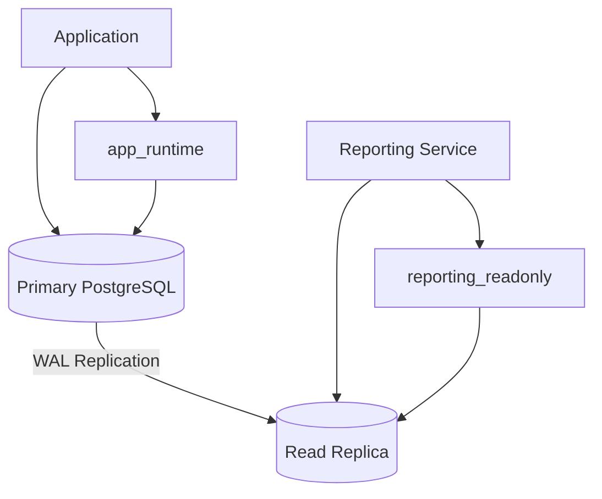
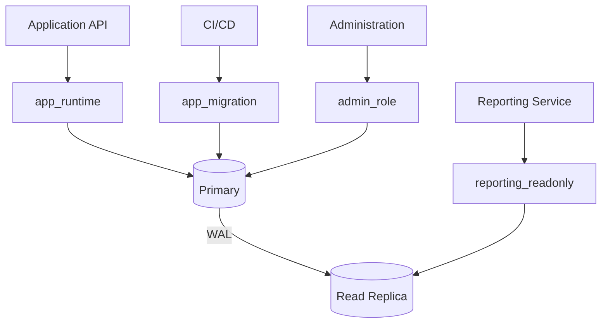

# 08- Read Only Database Users

## Overview

A read-only database user is a PostgreSQL login role that is intentionally restricted to operations that do not modify application data or database structure.

The typical permission boundary is:

```text
Application / Reporting Tool
          ↓
   read_only_role
          ↓
     PostgreSQL
          ↓
      SELECT only
```

A read-only role is useful for:

- Reporting services
- Analytics applications
- Operational dashboards
- BI tools
- Support and investigation tooling
- Read-only APIs
- Read replicas
- Data export processes
- Controlled human access

The important distinction is that **read-only is a permission model, not merely a naming convention**.

Calling a role `reporting_readonly` does not make it read-only. PostgreSQL privileges must enforce the intended behavior.

---

## Why Read-Only Users Matter

A reporting process rarely needs to modify production data.

If a reporting credential accidentally receives write access:

```text
Reporting Query
      ↓
Compromised / Misconfigured Credential
      ↓
UPDATE / DELETE
      ↓
Production Data Modification
```

With a genuinely read-only role:

```text
Reporting Query
      ↓
reporting_readonly
      ↓
SELECT
      ↓
Data Read
```

An attempted write should fail at the database boundary.

This provides defense in depth even when application-level controls are incorrect.

---

## Read-Only vs Read-Write

| Capability | Read-Only Role | Read-Write Role |
|---|---:|---:|
| Connect to database | Yes | Yes |
| Read tables | Yes | Yes |
| Insert rows | No | Yes |
| Update rows | No | Yes |
| Delete rows | No | Yes |
| Truncate tables | No | Possibly |
| Modify schema | No | Usually separate |
| Execute functions | Only explicitly granted | As required |
| Create objects | No | Only if required |
| RLS restrictions | Can apply | Can apply |

A read-only role should be deliberately scoped rather than simply receiving a subset of the application's privileges by convention.

---

## Basic Read-Only Role

A common PostgreSQL design is:

```sql
CREATE ROLE reporting_readonly
LOGIN;
```

Then grant the minimum access required:

```sql
GRANT CONNECT
ON DATABASE app
TO reporting_readonly;

GRANT USAGE
ON SCHEMA app
TO reporting_readonly;

GRANT SELECT
ON TABLE app.orders
TO reporting_readonly;
```

The resulting access is:

```text
reporting_readonly
       ↓
CONNECT
       ↓
SCHEMA USAGE
       ↓
SELECT on app.orders
```

The role cannot automatically read every table in the database.

---

## Read-Only Role for an Entire Schema

If the reporting workload legitimately needs access to all current tables in a schema:

```sql
GRANT SELECT
ON ALL TABLES IN SCHEMA app
TO reporting_readonly;
```

This is convenient for:

- Internal reporting
- Controlled analytics environments
- Operational dashboards
- Dedicated reporting schemas

However, it is broader than explicitly granting access to individual tables.

Use schema-wide access only when the security boundary is intentionally defined at the schema level.

---

## Future Tables

A common mistake is granting `SELECT` to all existing tables and assuming future tables will automatically inherit the privilege.

This:

```sql
GRANT SELECT
ON ALL TABLES IN SCHEMA app
TO reporting_readonly;
```

does not automatically grant `SELECT` on future tables.

Configure default privileges for the role that creates the tables:

```sql
ALTER DEFAULT PRIVILEGES
FOR ROLE app_owner
IN SCHEMA app
GRANT SELECT
ON TABLES
TO reporting_readonly;
```

The distinction is:

```text
GRANT ON ALL TABLES
        ↓
Existing tables

ALTER DEFAULT PRIVILEGES
        ↓
Future tables created by app_owner
```

Default privileges are not retroactive.

---

## Why the Object-Creating Role Matters

Default privileges are associated with the role that creates the objects.

For example:

```sql
ALTER DEFAULT PRIVILEGES
FOR ROLE app_owner
IN SCHEMA app
GRANT SELECT
ON TABLES
TO reporting_readonly;
```

This applies to future tables created by `app_owner`.

If migrations create objects under another role, the default privilege configuration for `app_owner` does not automatically apply to those objects.

This is a common source of permission drift.

---

## Read-Only Access to Multiple Schemas

A reporting service might require:

```text
orders
billing
customers
```

Access can be granted explicitly:

```sql
GRANT USAGE
ON SCHEMA orders, billing, customers
TO reporting_readonly;

GRANT SELECT
ON ALL TABLES IN SCHEMA orders
TO reporting_readonly;

GRANT SELECT
ON ALL TABLES IN SCHEMA billing
TO reporting_readonly;

GRANT SELECT
ON ALL TABLES IN SCHEMA customers
TO reporting_readonly;
```

This should only be used when the reporting service is intentionally authorized to access those domains.

Schema separation can therefore become part of the security architecture.

---

## Table-Level Read-Only Access

For stronger isolation, grant only specific tables:

```sql
GRANT SELECT
ON TABLE
    app.orders,
    app.order_items,
    app.customers
TO reporting_readonly;
```

This produces a clearer authorization contract:

```text
Reporting
    ↓
orders
order_items
customers
```

rather than:

```text
Reporting
    ↓
Every table in application schema
```

Explicit grants are preferable when different data domains have different sensitivity levels.

---

## Column-Level Read-Only Access

Sometimes even `SELECT` on an entire table is too broad.

Suppose:

```text
app.users
```

contains:

```text
id
email
created_at
password_hash
payment_token
```

A reporting role might only need:

```sql
GRANT SELECT (id, email, created_at)
ON TABLE app.users
TO reporting_readonly;
```

This provides another layer of least privilege.

Use column-level privileges when they provide a meaningful security boundary.

---

## Read-Only Does Not Mean "No Functions"

Functions have independent privileges.

A role may execute a function if explicitly granted:

```sql
GRANT EXECUTE
ON FUNCTION app.generate_report(bigint)
TO reporting_readonly;
```

Therefore, a read-only role can still have capabilities beyond simple `SELECT` if those capabilities are intentionally granted.

Function privileges should be reviewed independently.

---

## `SECURITY DEFINER` Functions

A particularly important case is a `SECURITY DEFINER` function.

Such a function executes with the privileges of its owner.

Conceptually:

```text
reporting_readonly
        ↓
EXECUTE function
        ↓
Function owner privileges
        ↓
Underlying database operation
```

Therefore:

```text
SELECT-only role
```

does not necessarily mean:

```text
Cannot cause any data modification through functions
```

If privileged functions exist, review:

- Function ownership
- `SECURITY DEFINER`
- `EXECUTE` grants
- Input validation
- Dynamic SQL
- `search_path`
- Underlying object permissions

A read-only security model must include indirect execution paths.

---

## Read-Only and RLS

Row-Level Security can further restrict a read-only role.

For example:

```sql
ALTER TABLE app.orders ENABLE ROW LEVEL SECURITY;

CREATE POLICY reporting_tenant_access
ON app.orders
FOR SELECT
USING (
    tenant_id = current_setting('app.tenant_id')::uuid
);
```

The authorization model becomes:

```text
reporting_readonly
        ↓
SELECT privilege
        ↓
RLS policy
        ↓
Permitted rows
```

The role may have `SELECT` on the table while still being restricted to specific rows.

---

## RLS Does Not Replace `SELECT`

A role needs the applicable table privilege for normal table access.

Think of:

```text
SELECT privilege
       +
RLS policy
       ↓
Effective row access
```

RLS is an additional restriction rather than a replacement for object privileges.

Roles with `BYPASSRLS` require special review.

Table owners also require care because owners normally bypass RLS unless forced row-level security is configured.

---

## Read-Only Roles and Multi-Tenancy

In a multi-tenant system, a reporting role may need:

```text
All tenants
```

or:

```text
Only selected tenants
```

These are different security requirements.

For tenant-specific reporting:

```text
reporting_readonly
        ↓
SELECT
        ↓
RLS
        ↓
Tenant-specific rows
```

For centralized trusted analytics:

```text
analytics_role
        ↓
Controlled cross-tenant data
```

The second role should be treated as highly sensitive because cross-tenant reporting can expose large amounts of customer data.

---

## Read-Only Users vs Read Replicas

A read-only role and a read replica solve different problems.

| Mechanism | Primary Purpose |
|---|---|
| Read-only role | Authorization |
| Read replica | Read scaling / workload isolation |
| Both together | Authorization + workload isolation |

A typical architecture is:

```text
Application
    ↓
Read Replica
    ↓
reporting_readonly
    ↓
SELECT
```

This prevents reporting workloads from both modifying data and unnecessarily consuming primary database resources.

---

## Read Replica Architecture

A production reporting architecture might look like:



The read-only role protects the database authorization boundary.

The replica protects the primary workload from unnecessary reporting traffic.

---

## Replica Lag

Read replicas may be asynchronous.

Therefore:

```text
Primary
  ↓
Commit
  ↓
WAL
  ↓
Replica
  ↓
Replay
```

There can be a period where:

```text
Primary contains row
Replica does not yet contain row
```

A reporting system should generally tolerate stale reads when using asynchronous replicas.

If read-after-write consistency is required, route that particular read to the primary or use an appropriate consistency-aware routing strategy.

---

## Read-Only Users Do Not Guarantee Consistent Reports

A read-only role prevents writes by that role.

It does not automatically guarantee:

- Point-in-time consistency across multiple queries
- No concurrent data changes by other roles
- No replica lag
- No stale cache
- No partial reporting state

For a multi-query report requiring a consistent snapshot, transaction semantics still matter.

For example:

```sql
BEGIN TRANSACTION ISOLATION LEVEL REPEATABLE READ;

SELECT ...;
SELECT ...;
SELECT ...;

COMMIT;
```

Whether this is appropriate depends on transaction duration, workload, and consistency requirements.

---

## Read-Only Users and Django

A Django reporting service can use a dedicated database role:

```text
Django Reporting
       ↓
reporting_readonly
       ↓
PostgreSQL
```

The role should have only the required read privileges.

Application-level permissions remain separate:

```text
Django user authorization
       +
PostgreSQL read-only role
```

A user who is allowed to access a report still operates through the service's database identity.

---

## Django Read Replica Routing

Django can route read operations to a replica using a database router.

Conceptually:

```python
class DatabaseRouter:
    def db_for_read(self, model, **hints):
        return "replica"

    def db_for_write(self, model, **hints):
        return "default"
```

The database connection configured for the replica should use an appropriately restricted database role.

Do not rely solely on Django's router to make the replica safe.

The PostgreSQL role should enforce the database-side authorization boundary.

---

## FastAPI Read-Only Services

A FastAPI reporting API might use:

```text
FastAPI
   ↓
SQLAlchemy / psycopg
   ↓
reporting_readonly
   ↓
Read replica
```

The service should expose only read-oriented endpoints where appropriate:

```text
GET /reports/orders
GET /reports/revenue
GET /reports/customers
```

But the database should still enforce read-only access.

Application endpoint design is not a substitute for database authorization.

---

## Read-Only Role and Connection Pooling

A reporting service may maintain a connection pool:

```text
Report Request ─┐
Report Request ─┼──> Pool ──> reporting_readonly
Report Request ─┘
```

Every connection in that pool uses the same database role.

This has two important implications:

1. The role must be safe for every operation performed through the pool.
2. Request-specific security context must not leak between pooled sessions.

If RLS uses session configuration, transaction-scoped settings such as `SET LOCAL` should be considered carefully.

---

## Connection Pool Sizing

Read-only access does not mean unlimited connections.

A reporting system can accidentally overwhelm PostgreSQL:

```text
Reporting workers
       ↓
Large connection pools
       ↓
Hundreds of database connections
       ↓
CPU / memory pressure
       ↓
Application impact
```

Use controlled pool sizes and workload limits.

For large reporting systems, consider:

- Read replicas
- Connection pooling
- PgBouncer
- Query concurrency limits
- Dedicated analytical infrastructure

---

## Reporting Workload Isolation

Reporting queries can be expensive:

```sql
SELECT
    customer_id,
    date_trunc('day', created_at) AS day,
    SUM(total)
FROM app.orders
GROUP BY customer_id, date_trunc('day', created_at);
```

Even though the query is read-only, it can consume significant:

- CPU
- Memory
- I/O
- Buffer cache
- Connection capacity

Therefore:

```text
Read-only
    ≠
Low impact
```

Read-only authorization protects data integrity, while workload architecture protects database performance.

---

## Read-Only Role vs OLAP Infrastructure

For large analytical workloads, a PostgreSQL read replica may eventually be insufficient.

The progression can be:

```text
Primary
   ↓
Read-only role

Primary
   ↓
Read replica
   ↓
Reporting

Large-scale analytics
   ↓
Warehouse / OLAP system
```

For high-volume analytics, use specialized infrastructure when appropriate rather than forcing complex analytical workloads onto an OLTP database.

---

## Read-Only Users and Materialized Views

Reporting users can sometimes access precomputed data.

For example:

```sql
CREATE MATERIALIZED VIEW app.daily_order_metrics AS
SELECT
    date_trunc('day', created_at) AS day,
    COUNT(*) AS order_count,
    SUM(total) AS revenue
FROM app.orders
GROUP BY date_trunc('day', created_at);
```

Then:

```sql
GRANT SELECT
ON app.daily_order_metrics
TO reporting_readonly;
```

This can reduce the cost of repeatedly executing expensive aggregations.

The refresh process should use an appropriately privileged operational identity rather than granting refresh or schema-management privileges to the reporting role.

---

## Dedicated Reporting Schema

A useful architecture is:

```text
OLTP Tables
     ↓
ETL / CDC / Batch Processing
     ↓
Reporting Schema
     ↓
reporting_readonly
```

The reporting role receives access only to reporting objects.

This can reduce coupling between operational application tables and reporting consumers.

---

## Read-Only Users and CDC

Change Data Capture can feed a reporting environment:

```text
PostgreSQL Primary
       ↓
CDC / Logical Replication
       ↓
Analytics / Reporting Store
       ↓
reporting_readonly
```

This separates:

- Operational writes
- Reporting reads
- Analytical computation

The reporting database can then expose a read-only interface without allowing reporting users to access the operational database directly.

---

## Security Benefits

A properly configured read-only role provides:

### Data Integrity Protection

The role cannot directly modify protected tables.

### Blast-Radius Reduction

Compromised reporting credentials have fewer capabilities.

### Separation of Responsibilities

Reporting does not require application write access.

### Safer Human Access

Support or analysts can query approved data without receiving write privileges.

### Better Auditability

Database activity can be attributed to a dedicated reporting identity.

---

## Security Limitations

Read-only access does not automatically protect sensitive data.

A read-only role may still be able to:

- Extract large datasets
- Read personally identifiable information
- Query sensitive financial data
- Perform expensive queries
- Access multiple tenants
- Invoke privileged functions if allowed
- Exploit application or database vulnerabilities

Therefore:

```text
Read-only
    ≠
Low sensitivity
```

Data classification and access scope remain important.

---

## Protecting Sensitive Columns

For sensitive information, consider:

- Column-level privileges
- Views
- RLS
- Masked reporting views
- Data transformation
- Dedicated reporting datasets

For example, instead of exposing the entire `users` table, create a controlled view:

```sql
CREATE VIEW reporting.user_summary AS
SELECT
    id,
    email,
    created_at
FROM app.users;
```

Then grant access to the view:

```sql
GRANT USAGE
ON SCHEMA reporting
TO reporting_readonly;

GRANT SELECT
ON reporting.user_summary
TO reporting_readonly;
```

The reporting role does not need direct access to the underlying table if the architecture is designed appropriately.

---

## Views as Security Boundaries

Views can provide a controlled read interface:

```text
Sensitive Base Tables
        ↓
Controlled View
        ↓
reporting_readonly
        ↓
Reporting Application
```

Views are useful when consumers need:

- Selected columns
- Derived fields
- Filtered datasets
- Stable reporting interfaces

However, views should not be treated as a universal security mechanism. Review underlying permissions, view ownership, RLS interactions, and any privileged functions involved.

---

## Read-Only Users and SQL Injection

A read-only database role does not prevent SQL injection.

It reduces the consequences.

For example:

```text
SQL Injection
     ↓
reporting_readonly
     ↓
SELECT-only access
```

The attacker may still extract sensitive information.

Therefore the application should still use parameterized queries and safe ORM/query-builder APIs.

Least privilege is defense in depth, not a replacement for secure query construction.

---

## Monitoring Read-Only Users

Monitor:

- Query volume
- Query duration
- Active sessions
- Connection counts
- Permission-denied events
- Large result sets
- Long-running queries
- Replica lag
- CPU and I/O consumption
- Unexpected object access

PostgreSQL session inspection:

```sql
SELECT
    usename,
    application_name,
    client_addr,
    state,
    query_start
FROM pg_stat_activity
WHERE usename = 'reporting_readonly'
ORDER BY query_start;
```

This helps identify expensive or unexpected reporting activity.

---

## Long-Running Read Queries

A read-only query can still be operationally dangerous.

Long-running queries can:

- Consume connections
- Consume memory
- Increase CPU usage
- Increase I/O
- Hold snapshots
- Delay vacuum cleanup under some workload conditions
- Cause replica replay conflicts in certain architectures

Use:

- Query timeouts
- Statement limits
- Appropriate indexes
- Query review
- Workload isolation
- Read replicas
- Dedicated analytical systems

---

## Query Timeouts

A reporting role can be paired with workload-specific timeout policies.

For example:

```sql
ALTER ROLE reporting_readonly
SET statement_timeout = '60s';
```

This can protect the database from accidentally unbounded analytical queries.

Other role-level settings may also be appropriate depending on the environment.

Be careful with timeout values. Reports legitimately requiring several seconds should not be arbitrarily terminated.

---

## Connection Limits

PostgreSQL roles can have connection limits.

For example:

```sql
ALTER ROLE reporting_readonly
CONNECTION LIMIT 20;
```

This can prevent a reporting workload from consuming unlimited connection capacity.

Connection limits are one layer of protection; application pool sizing and infrastructure-level controls should still be configured appropriately.

---

## Resource Isolation

For heavy reporting environments, consider:

```text
Application
   ↓
Primary

Reporting
   ↓
Read Replica
   ↓
Controlled concurrency
```

For even larger workloads:

```text
Application
   ↓
OLTP PostgreSQL

Reporting
   ↓
Warehouse / OLAP
```

Authorization and resource isolation should be designed together.

---

## High Availability

A read-only service should have a clear behavior when its target replica fails.

Possible architecture:

```text
Reporting
    ↓
Read Replica
    ↓
Failure
    ↓
Another Replica
```

For non-critical reports, temporary unavailability may be acceptable.

For operational dashboards, configure appropriate failover or replica selection.

Do not automatically fail a reporting workload back to the primary if doing so can overload the production workload.

---

## Disaster Recovery

A reporting role should be recreated or preserved as part of database recovery procedures.

Include:

- Role definition
- Grants
- Default privileges
- RLS policies
- Reporting views
- Functions
- Schema ownership
- Secret configuration

After restoration, test:

```text
Can reporting connect?
Can it read required objects?
Can it modify anything?
Can it access unauthorized data?
```

The final question is especially important.

---

## Credential Management

The read-only credential should be stored securely.

Use appropriate secret-management systems such as:

- AWS Secrets Manager
- AWS Systems Manager Parameter Store
- Kubernetes Secrets with appropriate controls
- External secret-management systems

Never commit credentials into:

- Git
- Docker images
- Helm values checked into source control
- Application source
- Documentation

Credential protection and database authorization should work together.

---

## Credential Rotation

Read-only credentials should still be rotated.

A safe rotation process is:

```text
Create / provision new credential
          ↓
Update reporting deployment
          ↓
Recycle connections
          ↓
Verify queries
          ↓
Disable old credential
```

Connection pools must be considered because existing connections may continue using the previous authentication state until they are closed.

---

## Production Permission Architecture

A practical architecture is:



This separates:

```text
Application writes
        +
Reporting reads
        +
Schema administration
        +
Database administration
```

---

## Production Read-Only Role Example

A practical configuration might be:

```sql
CREATE ROLE reporting_readonly
LOGIN;

GRANT CONNECT
ON DATABASE app
TO reporting_readonly;

GRANT USAGE
ON SCHEMA reporting
TO reporting_readonly;

GRANT SELECT
ON ALL TABLES IN SCHEMA reporting
TO reporting_readonly;

ALTER DEFAULT PRIVILEGES
FOR ROLE reporting_owner
IN SCHEMA reporting
GRANT SELECT
ON TABLES
TO reporting_readonly;

ALTER ROLE reporting_readonly
CONNECTION LIMIT 20;

ALTER ROLE reporting_readonly
SET statement_timeout = '60s';
```

This creates a focused reporting identity.

The exact limits and schema scope should be based on the workload.

---

## Production Validation

A read-only role should be tested explicitly.

### Allowed

```sql
SELECT *
FROM reporting.daily_order_metrics;
```

### Denied

```sql
INSERT INTO reporting.daily_order_metrics (...)
VALUES (...);
```

### Denied

```sql
UPDATE reporting.daily_order_metrics
SET revenue = 0;
```

### Denied

```sql
DELETE FROM reporting.daily_order_metrics;
```

The expected behavior is that unauthorized write operations fail with a permission error.

---

## Automated Authorization Tests

Security tests can validate effective privileges:

```sql
SELECT
    has_table_privilege(
        'reporting_readonly',
        'reporting.daily_order_metrics',
        'SELECT'
    ) AS can_select,
    has_table_privilege(
        'reporting_readonly',
        'reporting.daily_order_metrics',
        'INSERT'
    ) AS can_insert,
    has_table_privilege(
        'reporting_readonly',
        'reporting.daily_order_metrics',
        'UPDATE'
    ) AS can_update,
    has_table_privilege(
        'reporting_readonly',
        'reporting.daily_order_metrics',
        'DELETE'
    ) AS can_delete;
```

Expected:

```text
can_select = true
can_insert = false
can_update = false
can_delete = false
```

Also inspect role memberships, ownership, `PUBLIC`, functions, and RLS because direct table privilege checks do not capture every possible authorization path.

---

## Common Mistakes

### Calling a Role Read-Only Without Enforcing It

**Problem:** The role name suggests read-only access but grants are broader.

**Risk:** Developers trust the name instead of actual privileges.

**Better:** Test effective privileges.

### Granting `SELECT` on Every Schema

**Problem:** Reporting receives access to unrelated data.

**Risk:** Sensitive domains become accessible.

**Better:** Grant only the schemas and tables required.

### Forgetting Future Tables

**Problem:** Existing tables work but newly created tables do not.

**Risk:** Reporting breaks after migrations.

**Better:** Configure appropriate default privileges.

### Assuming Read-Only Means Low Resource Usage

**Problem:** `SELECT` queries are considered harmless.

**Risk:** Large aggregations can overload PostgreSQL.

**Better:** Use timeouts, connection limits, query controls, replicas, and workload isolation.

### Granting Function Execution Without Review

**Problem:** The role is read-only at the table level but can execute privileged functions.

**Risk:** A `SECURITY DEFINER` function can provide indirect access to protected operations.

**Better:** Review function ownership and `EXECUTE` privileges.

### Ignoring Replica Lag

**Problem:** Reporting is moved to a replica and freshness is assumed.

**Risk:** Reports show stale data.

**Better:** Define freshness requirements explicitly.

### Sending Heavy Analytics to the Primary

**Problem:** Read-only queries are considered harmless.

**Risk:** Reporting competes with OLTP traffic for CPU, memory, I/O, and connections.

**Better:** Isolate reporting workloads.

### Exposing Sensitive Columns

**Problem:** Reporting gets `SELECT` on entire tables.

**Risk:** Unnecessary PII or financial data exposure.

**Better:** Use controlled views, column-level privileges, RLS, or dedicated reporting datasets.

### Using the Same Credential for API and Reporting

**Problem:** Both workloads share one database role.

**Risk:** Reporting receives application write privileges.

**Better:** Use a dedicated read-only identity.

---

## Operational Checklist

- [ ] Dedicated read-only role exists.
- [ ] Role has `LOGIN` only when direct authentication is required.
- [ ] Database `CONNECT` is explicitly reviewed.
- [ ] Required schema `USAGE` is granted.
- [ ] Only required tables are readable.
- [ ] Column-level restrictions are used where appropriate.
- [ ] Sequence privileges are not unnecessarily granted.
- [ ] Function `EXECUTE` privileges are reviewed.
- [ ] `SECURITY DEFINER` functions are audited.
- [ ] `PUBLIC` privileges are reviewed.
- [ ] Role memberships are reviewed.
- [ ] Object ownership is reviewed.
- [ ] RLS is configured where row-level isolation is required.
- [ ] `BYPASSRLS` roles are reviewed.
- [ ] Default privileges cover future reporting objects.
- [ ] Connection limits are appropriate.
- [ ] Query timeouts are appropriate.
- [ ] Reporting workloads are isolated where necessary.
- [ ] Replica lag is monitored when using replicas.
- [ ] Credentials are securely stored and rotated.
- [ ] Allowed and denied operations are tested.
- [ ] Privilege drift is periodically reviewed.

---

## Interview Traps

### Does `SELECT` make a user completely read-only?

Not necessarily. The role may have other privileges, role memberships, function execution rights, ownership, or special capabilities.

### Does `GRANT SELECT ON ALL TABLES` include future tables?

No. Future objects require appropriately configured default privileges.

### Why does a read-only role need schema `USAGE`?

Table privileges and schema privileges are separate authorization layers. The role may need schema access to use objects within that namespace.

### Can a read-only role modify data indirectly?

Potentially. For example, it may be able to execute a privileged `SECURITY DEFINER` function if `EXECUTE` is granted.

### Does a read-only role protect against expensive queries?

No. Read-only authorization protects data modification, not resource consumption.

### Why use a read-only role with a read replica?

They solve different problems. The role enforces authorization, while the replica provides workload isolation and read scaling.

### Does read-only access guarantee fresh data?

No. A read replica may lag behind the primary, and caches or analytical pipelines may introduce additional freshness delays.

### Should reporting use the same database role as the API?

Usually no when the reporting workload or data scope differs. A dedicated reporting role reduces privilege and blast radius.

### Does RLS replace read-only privileges?

No. RLS can restrict rows after the role has the applicable object privilege. It complements rather than replaces object-level authorization.

### What is the senior-level approach to read-only database users?

Treat read-only access as both a security and workload-isolation problem: enforce `SELECT`-only authorization, control indirect execution paths, restrict sensitive data, manage future objects, isolate expensive reporting workloads, and continuously validate effective permissions.

## Key Takeaways

- **A read-only database user is an enforced PostgreSQL authorization boundary**, not merely a role with a name such as `readonly`; effective privileges must prevent unintended writes.
- **Read-only access should be scoped to the required schemas, tables, columns, and functions**, with role memberships, ownership, `PUBLIC`, RLS, and privileged functions reviewed for indirect access.
- **`SELECT`-only does not mean low operational impact**; analytical queries can consume substantial CPU, memory, I/O, and connection capacity, so replicas, timeouts, connection limits, and workload isolation may be necessary.
- **Read-only roles and read replicas solve different problems**: the role controls authorization, while replicas provide read scaling and workload isolation, with replica lag explicitly considered.
- **Production read-only access requires lifecycle management**, including secure credentials, default privileges for future objects, authorization testing, auditing, monitoring, privilege-drift reviews, and HA/DR validation.