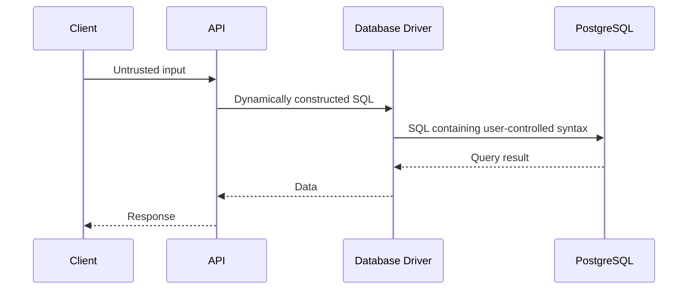
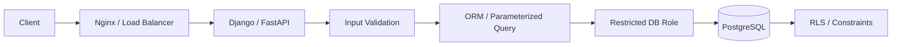

# 09- SQL Injection

## Overview

SQL injection is a security vulnerability that occurs when untrusted input changes the structure or meaning of SQL executed by an application.

The core problem is a failure to separate:

```text
SQL Structure
     +
User Data
```

from:

```text
SQL Structure
     +
User-Controlled SQL
```

A vulnerable application may construct SQL by concatenating untrusted input:

```text
HTTP Request
     ↓
Untrusted Input
     ↓
String Concatenation
     ↓
SQL Statement
     ↓
PostgreSQL
```

A secure application instead uses parameterized execution:

```text
HTTP Request
     ↓
Untrusted Input
     ↓
Parameter Binding
     ↓
SQL Structure + Data
     ↓
PostgreSQL
```

SQL injection can lead to:

- Unauthorized data access
- Authentication bypass
- Data modification
- Data deletion
- Privilege escalation
- Sensitive information disclosure
- Database compromise
- Application compromise through database-side features

The primary defense is **parameterized queries / prepared statements**, combined with least-privileged database roles and safe query construction.

---

## Why SQL Injection Exists

SQL is both:

1. A programming language describing database operations.
2. A language containing values supplied by the application.

The vulnerability appears when an application allows data to become SQL syntax.

Unsafe conceptual pattern:

```text
SQL template + raw user input
        ↓
One combined SQL program
```

Safe pattern:

```text
SQL template
     +
Separate parameter values
     ↓
Database driver
     ↓
SQL execution
```

The database must be able to distinguish:

```text
This is SQL syntax.
```

from:

```text
This is data.
```

---

## Basic Vulnerable Pattern

Consider a Python application that constructs SQL using string interpolation:

```python
username = request.query_params["username"]

query = f"""
    SELECT id, email
    FROM users
    WHERE username = '{username}'
"""
```

This is unsafe because `username` becomes part of the SQL statement itself.

The application has effectively allowed request data to influence SQL syntax.

The problem is not specifically Python f-strings.

The same vulnerability exists with:

- String concatenation
- Formatting
- Template substitution
- Dynamic SQL construction
- Unsafe ORM raw-query APIs
- Stored procedure implementations that concatenate SQL

---

## Parameterized Query

The safe pattern is parameter binding.

Using `psycopg`:

```python
from psycopg import Connection


def find_user(conn: Connection, username: str):
    with conn.cursor() as cursor:
        cursor.execute(
            """
            SELECT id, email
            FROM users
            WHERE username = %s
            """,
            (username,),
        )
        return cursor.fetchone()
```

The value is supplied separately from the SQL statement.

Conceptually:

```text
SQL:
SELECT ...
WHERE username = %s

Parameters:
username = untrusted_value
```

The driver/database protocol handles the distinction between SQL and data.

---

## Why Parameterization Works

With parameter binding:

```text
Application
    │
    ├── SQL structure
    │
    └── Parameter value
          │
          ▼
     Database Driver
          │
          ▼
      PostgreSQL
```

The parameter is treated as a value rather than being interpreted as additional SQL syntax.

This is the fundamental security property.

---

## Parameterized Queries vs Escaping

Do not treat escaping as the primary SQL injection defense.

### Parameterization

```text
SQL structure
     +
Bound parameters
```

### Manual escaping

```text
SQL structure
     +
Application-generated escaped string
```

Manual escaping is fragile because:

- Rules vary by database and context.
- Different SQL contexts have different requirements.
- Developers can forget to escape one path.
- Future code changes can invalidate assumptions.
- Escaping does not solve identifier or structural injection.

Prefer parameterization whenever the database interface supports it.

---

## SQL Injection Request Flow

A vulnerable request may follow:



The critical failure occurs before PostgreSQL receives the query:

```text
Untrusted data
     ↓
Application constructs SQL syntax
```

---

## SQL Injection vs Safe Parameter Binding

| Approach | Risk | Recommendation |
|---|---|---|
| String concatenation | Very high | Never use for values |
| f-string SQL | Very high | Never use for values |
| `%` string formatting | Very high | Never use for values |
| Manual escaping | High | Avoid as primary defense |
| Parameterized query | Low | Preferred |
| ORM parameter binding | Low | Preferred |
| Carefully designed dynamic SQL | Depends | Validate structure and bind values |

The important distinction is whether **data is allowed to become SQL syntax**.

---

## Django ORM

Django's ORM normally parameterizes values.

For example:

```python
User.objects.filter(username=username)
```

The ORM generates SQL and passes values separately.

This is one reason using the ORM's normal query APIs is preferable to constructing SQL manually.

However, Django does provide escape hatches for raw SQL.

---

## Django Raw SQL

Unsafe:

```python
User.objects.raw(
    f"SELECT * FROM users WHERE username = '{username}'"
)
```

Safe parameterized form:

```python
User.objects.raw(
    """
    SELECT *
    FROM users
    WHERE username = %s
    """,
    [username],
)
```

The principle remains the same:

```text
Do not interpolate user-controlled values into SQL.
```

---

## Django `extra()` and Raw Query APIs

Legacy or lower-level query APIs require particular care.

Whenever an API accepts:

- Raw SQL
- Raw `WHERE` expressions
- SQL fragments
- Parameter lists

inspect the documentation and ensure values are passed through supported parameter-binding mechanisms.

Do not assume:

```text
ORM API
    ↓
Automatically safe
```

Every raw SQL escape hatch needs explicit review.

---

## FastAPI

FastAPI itself does not protect against SQL injection.

The database access layer determines whether queries are constructed safely.

For example, using SQLAlchemy:

```python
from sqlalchemy import text


stmt = text(
    """
    SELECT id, email
    FROM users
    WHERE username = :username
    """
)

result = session.execute(
    stmt,
    {"username": username},
)
```

The value is passed separately from the SQL expression.

FastAPI's request validation is useful for input correctness but is not a replacement for SQL parameterization.

---

## SQLAlchemy ORM

SQLAlchemy's expression APIs generally generate parameterized SQL.

For example:

```python
from sqlalchemy import select

stmt = select(User).where(User.username == username)

result = session.execute(stmt)
user = result.scalar_one_or_none()
```

The application should prefer SQLAlchemy's structured expression APIs over manually assembled SQL strings.

---

## Input Validation vs SQL Injection Prevention

Input validation and parameterization solve different problems.

Validation asks:

```text
Is this input acceptable for the business operation?
```

Parameterization asks:

```text
Can this value alter SQL syntax?
```

Use both.

For example:

```text
API validation
     ↓
Business constraints
     ↓
Parameterized SQL
     ↓
PostgreSQL
```

Do not rely on a regex such as:

```python
if "'" not in username:
    ...
```

This is not a robust SQL injection defense.

---

## Dynamic SQL

Some SQL cannot be parameterized in the same way as ordinary values.

For example, applications sometimes need dynamic:

- Table names
- Column names
- Sort directions
- `ORDER BY` expressions
- SQL operators
- Optional clauses

This creates a different security problem.

Consider:

```python
query = f"""
    SELECT id, email
    FROM users
    ORDER BY {sort_column}
"""
```

A parameter placeholder generally represents a **value**, not an arbitrary SQL identifier.

Therefore:

```text
Parameter binding
    ↓
Excellent for values

Allowlisted structure
    ↓
Required for dynamic identifiers
```

---

## Safe Dynamic `ORDER BY`

Instead of accepting arbitrary SQL:

```python
sort_column = request.query_params["sort"]
```

use an allowlist:

```python
SORT_COLUMNS = {
    "name": "name",
    "created": "created_at",
    "email": "email",
}

column = SORT_COLUMNS.get(sort_column, "created_at")
```

Then construct the trusted SQL fragment:

```python
query = f"""
    SELECT id, email
    FROM users
    ORDER BY {column}
"""
```

Here, the dynamic fragment comes exclusively from a fixed server-side mapping.

The user supplies a key:

```text
created
```

not arbitrary SQL:

```text
created_at DESC, ...
```

---

## Dynamic Sort Direction

Sort direction should also be constrained.

For example:

```python
SORT_DIRECTIONS = {
    "asc": "ASC",
    "desc": "DESC",
}

direction = SORT_DIRECTIONS.get(
    request.query_params.get("direction", "desc"),
    "DESC",
)
```

Then:

```python
query = f"""
    SELECT id, email
    FROM users
    ORDER BY created_at {direction}
"""
```

The generated fragment is safe because its possible values are controlled by the application.

---

## Identifiers Cannot Normally Be Treated Like Values

This distinction is important:

```sql
SELECT *
FROM users
WHERE id = %s;
```

`%s` represents a value.

It does not mean:

```sql
SELECT *
FROM %s;
```

for arbitrary table names.

If an identifier must be dynamic, use the database driver's identifier-composition facilities or a strict allowlist.

For example, `psycopg` provides SQL composition utilities for safely constructing identifiers.

---

## Safe Identifier Composition with psycopg

When dynamic identifiers are genuinely required:

```python
from psycopg import sql


def count_rows(conn, table_name: str) -> int:
    allowed_tables = {
        "orders",
        "customers",
    }

    if table_name not in allowed_tables:
        raise ValueError("Unsupported table")

    query = sql.SQL("SELECT count(*) FROM {}").format(
        sql.Identifier(table_name)
    )

    with conn.cursor() as cursor:
        cursor.execute(query)
        return cursor.fetchone()[0]
```

Two controls are important:

```text
Allowlist
    +
Identifier-aware SQL composition
```

Do not pass arbitrary user input directly into an identifier position.

---

## ORM Does Not Mean Automatically Safe

ORMs reduce SQL injection risk significantly when used correctly.

However, vulnerabilities can still appear through:

- Raw SQL
- Raw SQL fragments
- Dynamic query construction
- Unsafe annotation expressions
- Unsafe database functions
- Custom query builders
- Third-party libraries
- Dynamic identifiers

The correct principle is:

> Use the ORM's structured query APIs whenever possible, and treat raw SQL as a security-sensitive boundary.

---

## SQL Injection in Search APIs

A common backend endpoint is:

```text
GET /users?search=alice
```

Safe implementation:

```python
query = """
    SELECT id, email
    FROM users
    WHERE email ILIKE %s
"""

cursor.execute(query, (f"%{search_term}%",))
```

The `%` characters are part of the parameter value, not SQL syntax.

This is safe because:

```text
SQL structure:
WHERE email ILIKE %s

Parameter:
%user_input%
```

---

## SQL Injection in Pagination

Pagination itself does not require dynamic SQL.

Unsafe:

```python
query = f"""
    SELECT id, email
    FROM users
    LIMIT {limit}
    OFFSET {offset}
"""
```

Prefer bound parameters where supported:

```python
cursor.execute(
    """
    SELECT id, email
    FROM users
    LIMIT %s
    OFFSET %s
    """,
    (limit, offset),
)
```

Additionally validate application-level limits:

```text
limit <= reasonable maximum
offset >= 0
```

Validation protects resources; parameterization protects SQL structure.

---

## Keyset Pagination

For high-volume APIs, keyset pagination is often preferable to large offsets.

Example:

```sql
SELECT id, email, created_at
FROM users
WHERE created_at < %s
ORDER BY created_at DESC
LIMIT %s;
```

Values remain parameterized.

Keyset pagination also reduces the performance problems associated with very large `OFFSET` values.

---

## SQL Injection in `IN` Clauses

Do not manually concatenate a list of values.

Unsafe pattern:

```python
ids = request.query_params["ids"].split(",")

query = f"""
    SELECT id, email
    FROM users
    WHERE id IN ({",".join(ids)})
"""
```

Use parameterization facilities appropriate to the database driver or ORM.

For example, SQLAlchemy can build an `IN` expression structurally:

```python
stmt = select(User).where(User.id.in_(user_ids))
```

The query builder handles the parameterization.

---

## SQL Injection Through JSON and Metadata

JSON input is not inherently safe or unsafe.

For example:

```json
{
  "username": "alice"
}
```

becomes dangerous only if application code turns it into SQL syntax.

The data path is:

```text
JSON
 ↓
Python object
 ↓
SQL parameter
 ↓
PostgreSQL
```

This is safe when the final SQL operation uses parameter binding.

---

## SQL Injection Through HTTP Headers

Any HTTP-derived value can be untrusted:

- Query parameters
- Path parameters
- Form fields
- JSON bodies
- Headers
- Cookies
- Authentication metadata
- gRPC metadata

The source does not matter.

The rule is:

```text
Untrusted input
    ↓
Never concatenate into SQL
```

---

## SQL Injection Through Background Jobs

Security controls must also apply to asynchronous workloads.

For example:

```text
REST API
   ↓
Kafka / Celery
   ↓
Worker
   ↓
Database
```

A worker may process data that originally came from an external request.

Do not assume:

```text
Internal queue
    ↓
Trusted data
```

Messages can be malformed, replayed, manipulated, or generated by compromised services.

Parameterize worker-generated SQL as well.

---

## SQL Injection Through Kafka

Consider:

```text
Kafka message
{
    "customer_id": "...",
    "status": "..."
}
```

The consumer should treat message fields as data:

```python
cursor.execute(
    """
    UPDATE orders
    SET status = %s
    WHERE customer_id = %s
    """,
    (status, customer_id),
)
```

Kafka does not make data trusted.

Authorization and validation should still be applied.

---

## SQL Injection Through Celery

Celery tasks may receive user-derived values:

```python
@app.task
def update_order(order_id, status):
    ...
```

The worker should use parameterized database access just like the HTTP API.

Security must follow the entire data lifecycle:

```text
HTTP
 ↓
Application
 ↓
Queue
 ↓
Worker
 ↓
Database
```

not only the first request boundary.

---

## SQL Injection and Stored Procedures

Stored procedures do not automatically prevent SQL injection.

A procedure can still be vulnerable if it constructs dynamic SQL unsafely.

Conceptually:

```text
Application
    ↓
Stored Procedure
    ↓
Unsafe dynamic SQL
    ↓
SQL Injection
```

When using dynamic SQL inside PostgreSQL functions, use appropriate mechanisms such as:

- `EXECUTE ... USING` for values
- Proper identifier quoting
- Strict allowlists
- Safe `search_path` handling for privileged functions

---

## Safe Dynamic SQL in PostgreSQL

For dynamic values inside PL/pgSQL:

```sql
EXECUTE
    'UPDATE app.orders
     SET status = $1
     WHERE id = $2'
USING new_status, order_id;
```

`USING` keeps values separate from the SQL string.

For dynamic identifiers, use appropriate identifier quoting mechanisms rather than treating identifiers as ordinary values.

Dynamic SQL should be kept as small and controlled as possible.

---

## SQL Injection and `SECURITY DEFINER`

`SECURITY DEFINER` functions require additional caution.

An SQL injection vulnerability inside a privileged function can have a larger impact:

```text
Application
    ↓
Low-privilege database role
    ↓
SECURITY DEFINER function
    ↓
Unsafe dynamic SQL
    ↓
Owner privileges
```

A secure `SECURITY DEFINER` design should include:

- Minimal function-owner privileges
- Restricted `EXECUTE`
- Safe `search_path`
- Schema-qualified references where appropriate
- Parameterized dynamic SQL
- Strict identifier allowlists

---

## SQL Injection and Least Privilege

Parameterized queries are the primary defense.

Least privilege is defense in depth.

For example:

```text
SQL Injection
      ↓
Parameterized queries
      ↓
Injection blocked
```

If a vulnerability still exists:

```text
SQL Injection
      ↓
Restricted database role
      ↓
Reduced blast radius
```

A production application should use both.

---

## Read-Only Roles and SQL Injection

A read-only database role reduces some consequences of SQL injection.

For example:

```text
Injected SQL
     ↓
reporting_readonly
     ↓
SELECT-only access
```

This may prevent direct:

```text
INSERT
UPDATE
DELETE
```

but it does not prevent:

- Sensitive data extraction
- Expensive queries
- Unauthorized reads
- Data inference
- Access through privileged functions

Therefore:

```text
Read-only
    ≠
Injection protection
```

---

## Database Constraints as Defense in Depth

Constraints do not prevent SQL injection.

However, they can limit the impact of malicious or incorrect writes.

Examples:

```sql
ALTER TABLE orders
ADD CONSTRAINT orders_total_nonnegative
CHECK (total >= 0);
```

And:

```sql
ALTER TABLE orders
ADD CONSTRAINT orders_customer_fk
FOREIGN KEY (customer_id)
REFERENCES customers(id);
```

The security architecture should therefore combine:

```text
Parameterized queries
+
Least privilege
+
Constraints
+
Authorization
```

---

## SQL Injection and Authentication

Authentication queries are particularly sensitive.

Unsafe:

```python
query = f"""
    SELECT id
    FROM users
    WHERE username = '{username}'
      AND password = '{password}'
"""
```

Apart from SQL injection, applications should not normally compare plaintext passwords in SQL.

Use established password hashing libraries and application authentication frameworks.

The broader principle is:

```text
Authentication
    +
Parameterized database access
    +
Secure password handling
```

---

## SQL Injection and Authorization

A query can be injection-safe and still be authorization-insecure.

For example:

```python
cursor.execute(
    """
    SELECT id, total
    FROM orders
    WHERE id = %s
    """,
    (order_id,),
)
```

This prevents SQL injection.

But if the application fails to verify ownership:

```text
User A
  ↓
Valid order_id belonging to User B
  ↓
Data returned
```

This is an authorization vulnerability, not SQL injection.

Security requires both:

```text
Query safety
+
Correct authorization
```

---

## Parameterization Does Not Fix Every SQL Security Problem

Parameterized values protect against SQL injection through those values.

They do not automatically solve:

- Broken authorization
- Excessive database privileges
- Unsafe dynamic identifiers
- Data leakage
- RLS misconfiguration
- Privileged function vulnerabilities
- Credential theft
- Insecure database networking

SQL injection prevention is one layer of the security architecture.

---

## Common Injection Surfaces

| Input | Typical Risk |
|---|---|
| Query parameters | High |
| JSON body fields | High |
| Path parameters | High |
| Form fields | High |
| HTTP headers | Context-dependent |
| Cookies | Context-dependent |
| gRPC metadata | Context-dependent |
| Kafka messages | High if external/untrusted |
| Celery task arguments | Depends on source |
| File-imported data | Depends on processing |
| Search/filter fields | High |
| Sort fields | High for dynamic SQL |
| Table/column names | Requires structural validation |

Any value can become dangerous if incorporated into SQL syntax.

---

## Secure Query Construction Rules

Use this decision process:

```text
Is this input a value?
        │
        ├── Yes → Parameterize it
        │
        └── No
             ↓
Is it SQL structure?
             ↓
Use a fixed server-side mapping
or a safe identifier-composition API
```

Examples:

```text
WHERE email = ?
        ↓
Parameterize

ORDER BY user-selected column
        ↓
Allowlist column

Dynamic table name
        ↓
Allowlist + identifier composition

SQL operator
        ↓
Do not accept arbitrary operator text
```

---

## Query Builder Pattern

A safe dynamic query can be assembled from trusted components.

For example:

```python
filters = []
params = []

if email:
    filters.append("email = %s")
    params.append(email)

if status:
    filters.append("status = %s")
    params.append(status)

query = """
    SELECT id, email, status
    FROM users
"""

if filters:
    query += " WHERE " + " AND ".join(filters)

cursor.execute(query, params)
```

The SQL fragments are fixed by application code.

The values are still parameterized.

The important distinction is:

```text
Trusted SQL fragments
+
Untrusted bound values
```

not:

```text
Arbitrary user-generated SQL fragments
```

---

## Safe vs Unsafe Dynamic SQL

| Pattern | Safe? | Reason |
|---|---|---|
| `WHERE id = %s` | Yes | Value parameter |
| `WHERE email = :email` | Yes | Value parameter |
| `f"WHERE id = {id}"` | No | User data becomes SQL |
| `ORDER BY {user_input}` | No | Dynamic SQL structure |
| Allowlisted `ORDER BY` | Yes | Structure is controlled |
| `IN (...)` generated by ORM | Usually | ORM handles binding |
| Arbitrary raw SQL from request | No | User controls SQL |
| `psycopg.sql.Identifier()` with validation | Appropriate | Identifier-aware construction |

---

## Security Testing

SQL injection should be tested at multiple layers.

### Application Tests

Test:

- Query parameters
- JSON fields
- Path parameters
- Search fields
- Sort parameters
- Filters
- Bulk operations

### Database Tests

Verify that:

- Runtime roles have minimal privileges
- Read-only roles cannot write
- RLS behaves correctly
- Privileged functions are restricted

### Integration Tests

Test the complete path:

```text
HTTP
 ↓
Application
 ↓
ORM / Driver
 ↓
PostgreSQL
```

Security tests should confirm that malicious-looking input remains data and cannot alter SQL structure.

---

## Negative Testing

Security tests should include inputs that contain SQL metacharacters and unexpected syntax-like content.

The objective is not to build an exploit corpus into application logic.

The objective is to verify:

```text
Input
  ↓
Parameterized query
  ↓
Treated strictly as data
```

A successful test should demonstrate that the query's intended semantics remain unchanged.

---

## Code Review Checklist

When reviewing database code, ask:

- Is SQL constructed using string concatenation?
- Are f-strings used to build SQL?
- Are `%` or `.format()` used for SQL values?
- Are raw ORM APIs involved?
- Are SQLAlchemy `text()` expressions parameterized?
- Are dynamic identifiers validated?
- Are `ORDER BY` fields allowlisted?
- Are stored procedures constructing dynamic SQL?
- Are `SECURITY DEFINER` functions involved?
- Does the database role have excessive privileges?
- Is application authorization enforced independently?
- Are background jobs using the same secure query patterns?

---

## Static Analysis

Automated analysis can detect common dangerous patterns.

Potential findings include:

```text
f"SELECT ..."
"SELECT ..." + variable
"SELECT ... {}".format(variable)
cursor.execute(dynamic_string)
raw SQL APIs with interpolated values
```

Static analysis is useful but incomplete.

A secure engineering process combines:

```text
Static analysis
+
Code review
+
Dependency review
+
Integration testing
+
Database least privilege
```

---

## Logging Considerations

Do not log sensitive SQL parameters indiscriminately.

For example, avoid logging:

```text
password
access tokens
payment information
personal data
```

Even when SQL injection testing is enabled.

Prefer structured application logs containing:

```text
operation
endpoint
database duration
query identifier
request correlation ID
```

without exposing sensitive values.

---

## Monitoring SQL Injection Attempts

Monitor suspicious patterns such as:

- Repeated database errors
- Unusual query failures
- Unexpected request parameters
- Abnormal query shapes
- Sudden increases in database reads
- Large result sets
- Unexpected access to sensitive tables
- Unusual administrative operations

Database observability tools such as PostgreSQL logs and query statistics can help correlate application behavior with database activity.

Monitoring should detect suspicious behavior; it should not be treated as the primary injection defense.

---

## Incident Response

If SQL injection is suspected:

1. Identify the vulnerable endpoint or query path.
2. Determine which database role was used.
3. Disable or isolate the vulnerable functionality if necessary.
4. Review application and database logs.
5. Determine whether data was accessed or modified.
6. Check for privilege escalation or unexpected database objects.
7. Rotate affected credentials.
8. Patch the vulnerable query construction.
9. Add regression tests.
10. Review the database role's privileges.
11. Investigate downstream systems and extracted data.
12. Document the incident and corrective actions.

The database role used by the vulnerable application is critical to determining blast radius.

---

## Credential Rotation After Injection

If an attacker may have obtained database credentials, fixing the query alone is insufficient.

A production response may require:

```text
Detect
  ↓
Contain
  ↓
Rotate database credential
  ↓
Revoke compromised role access
  ↓
Deploy fixed application
  ↓
Validate
  ↓
Investigate persistence / data access
```

Rotation should account for:

- Kubernetes pods
- Connection pools
- Celery workers
- Scheduled jobs
- CI/CD
- Read replicas
- Failover infrastructure

---

## SQL Injection and Connection Pooling

Connection pooling does not cause SQL injection, but it affects incident response and credential rotation.

```text
Application
    ↓
Connection Pool
    ↓
Database Role
```

Existing connections may remain authenticated until closed.

After credential rotation, recycle affected pools and workers according to the deployment architecture.

Also ensure request-specific session state, especially tenant context used by RLS, cannot leak between requests.

---

## SQL Injection in Production Architecture

A secure backend request path should look like:



Each layer contributes differently:

```text
Input validation
    → Business correctness

Parameterized query
    → SQL injection prevention

Restricted role
    → Blast-radius reduction

RLS
    → Row-level authorization

Constraints
    → Data integrity
```

---

## Production Best Practices

### Always Parameterize Values

Prefer:

```python
cursor.execute(
    "SELECT id FROM users WHERE email = %s",
    (email,),
)
```

over:

```python
cursor.execute(
    f"SELECT id FROM users WHERE email = '{email}'"
)
```

### Prefer ORM / Structured Query APIs

Use Django ORM or SQLAlchemy expressions when they accurately represent the required query.

### Keep Raw SQL Localized

When raw SQL is necessary:

- Keep it close to the repository/data-access layer.
- Parameterize values.
- Review dynamic SQL carefully.
- Test authorization and error paths.

### Allowlist Dynamic SQL Structure

For identifiers, sort fields, and operators:

```text
User input
   ↓
Allowlist
   ↓
Trusted SQL fragment
```

### Use Least-Privileged Database Roles

Injection prevention should be combined with:

```text
app_runtime
    ↓
Minimum required privileges
```

---

## Performance Considerations

Parameterized queries are generally the correct default and do not inherently make applications slower in a meaningful way.

Performance should be evaluated through:

- Query planning
- Index usage
- Query shape
- Connection pooling
- Network round trips
- Result size
- Database statistics

Do not disable parameterization for speculative performance reasons.

If prepared statements or server-side statement reuse are used, understand their planning behavior and workload implications rather than replacing safe query construction with string interpolation.

---

## Scalability Considerations

As backend systems scale, SQL injection prevention must remain consistent across:

```text
Multiple API pods
Multiple workers
Multiple services
Multiple database connections
Read replicas
Sharded databases
Background queues
```

Centralize database-access patterns where practical.

For example:

```text
Service
   ↓
Repository / Data Access Layer
   ↓
Parameterized SQL / ORM
   ↓
Restricted database role
```

This makes security patterns easier to enforce across many application components.

---

## High Availability Considerations

SQL injection protection must not depend on a specific database instance.

After failover:

```text
Application
    ↓
New Primary
    ↓
Same Restricted Role
    ↓
Same Authorization Model
```

Verify that:

- Database credentials remain valid
- Role privileges are correct
- RLS policies remain active
- Application query paths remain parameterized
- Failover does not introduce a privileged fallback credential

Security controls should survive infrastructure changes.

---

## Disaster Recovery Considerations

A DR environment should preserve the same security model.

Validate:

- Runtime roles
- Read-only roles
- Migration roles
- Grants
- RLS policies
- Functions
- Ownership
- Secret configuration

Do not create a DR environment where:

```text
Production
    → restricted role

DR
    → admin role
```

Security boundaries should remain consistent unless the difference is deliberate and controlled.

---

## Common Mistakes

### Using f-Strings for SQL

**Problem:**

```python
query = f"SELECT * FROM users WHERE id = {user_id}"
```

**Risk:** User-controlled input becomes SQL syntax.

**Better:** Use parameter binding.

### Assuming the ORM Makes Everything Safe

**Problem:** Developers use raw SQL APIs without applying parameterization.

**Risk:** ORM safety guarantees are bypassed.

**Better:** Treat raw SQL as a security-sensitive boundary.

### Escaping Instead of Parameterizing

**Problem:** Developers manually escape quotes.

**Risk:** Context-specific escaping is fragile.

**Better:** Use database-driver parameter binding.

### Validating Only with Regex

**Problem:** Developers attempt to block SQL keywords or quotes.

**Risk:** This is brittle and incomplete.

**Better:** Parameterize values and allowlist SQL structure.

### Allowing Arbitrary Sort Fields

**Problem:**

```python
query = f"ORDER BY {sort}"
```

**Risk:** The user controls SQL structure.

**Better:** Map user-facing values to fixed SQL identifiers.

### Using a Superuser Runtime Role

**Problem:** Injection reaches a highly privileged database identity.

**Risk:** Extremely large blast radius.

**Better:** Use a restricted runtime role.

### Forgetting Background Workers

**Problem:** API queries are secure but Celery/Kafka consumers construct SQL unsafely.

**Risk:** Another data path remains injectable.

**Better:** Apply the same database security rules to every workload.

### Trusting Internal Data

**Problem:** Messages from Kafka or internal services are assumed safe.

**Risk:** Internal systems can be compromised or misconfigured.

**Better:** Treat externally derived data as untrusted throughout its lifecycle.

### Logging Sensitive Input

**Problem:** Injection attempts and request values are logged indiscriminately.

**Risk:** Credentials or sensitive data can leak into logs.

**Better:** Use structured, redacted logging.

---

## Production Checklist

- [ ] All SQL values use parameter binding.
- [ ] No user-controlled SQL is constructed through string interpolation.
- [ ] f-strings are not used to insert values into SQL.
- [ ] Raw ORM queries are reviewed.
- [ ] SQLAlchemy `text()` queries use bound parameters.
- [ ] Dynamic identifiers use strict allowlists or identifier-aware composition.
- [ ] Sort fields are allowlisted.
- [ ] Dynamic SQL operators are not accepted directly from users.
- [ ] PostgreSQL functions do not construct unsafe dynamic SQL.
- [ ] `SECURITY DEFINER` functions are reviewed.
- [ ] Runtime database roles follow least privilege.
- [ ] Application authorization is separate from SQL injection protection.
- [ ] RLS is used where row-level isolation is required.
- [ ] Background workers use parameterized queries.
- [ ] Kafka consumers treat message data appropriately.
- [ ] Celery tasks use secure database access patterns.
- [ ] SQL injection regression tests exist.
- [ ] Static analysis checks dangerous SQL construction patterns.
- [ ] Database errors and suspicious activity are monitored.
- [ ] Sensitive query parameters are not logged unnecessarily.
- [ ] Credential rotation procedures exist.
- [ ] HA and DR environments preserve the security model.

---

## Interview Traps

### What is SQL injection?

SQL injection occurs when untrusted input can alter the structure or semantics of SQL executed by the application.

### What is the primary defense against SQL injection?

Parameterized queries or prepared statements that keep SQL structure separate from data values.

### Why isn't input validation enough?

Validation can restrict acceptable business input, but it is not a reliable mechanism for separating SQL syntax from data.

### Why isn't escaping the preferred solution?

Manual escaping is context-sensitive and fragile. Parameter binding provides a stronger separation between SQL structure and values.

### Does an ORM completely prevent SQL injection?

No. Normal structured ORM operations are generally safer, but raw SQL and dynamic SQL escape hatches can still be vulnerable.

### Can parameterization protect dynamic table names?

Not in the same way as ordinary values. Dynamic identifiers should use strict allowlists and, where necessary, database-driver identifier-composition mechanisms.

### Does a read-only database role prevent SQL injection?

No. It reduces the impact of some injected operations but can still permit unauthorized reads, data extraction, expensive queries, or privileged function execution.

### Is SQL injection the same as broken authorization?

No. SQL injection concerns changing SQL execution through untrusted input. Broken authorization occurs when a legitimate query allows a user to access data or perform actions they should not be allowed to access.

### Can stored procedures still have SQL injection vulnerabilities?

Yes. Stored procedures and PostgreSQL functions can be vulnerable when they construct dynamic SQL unsafely.

### Why does least privilege matter if parameterized queries already prevent injection?

Parameterized queries are the primary prevention mechanism. Least privilege provides defense in depth if another vulnerability exists and limits the resulting blast radius.

### How should dynamic `ORDER BY` fields be handled?

Map user-facing values to a fixed server-side allowlist of valid SQL identifiers rather than interpolating arbitrary input.

### What is the senior-level approach to SQL injection?

Treat SQL construction as a security boundary across every data path: parameterize values, strictly control dynamic SQL structure, prefer structured ORM APIs, minimize database privileges, secure privileged functions, test negative cases, and monitor the complete application-to-database path.

## Key Takeaways

- **Parameterized queries are the primary SQL injection defense** because they preserve the separation between SQL structure and untrusted data.
- **ORMs reduce risk but do not eliminate it**; raw SQL, dynamic identifiers, unsafe functions, and custom query construction still require explicit security controls.
- **Dynamic SQL requires a different strategy**: parameterize values and use strict allowlists or identifier-aware composition for SQL structure such as columns, tables, and sort directions.
- **Least-privileged database roles provide defense in depth**, reducing the blast radius when an injection vulnerability or another application compromise exists.
- **SQL injection protection must cover the entire backend data path**, including Django/FastAPI, background workers, Kafka/Celery consumers, PostgreSQL functions, connection pools, testing, monitoring, and incident response.