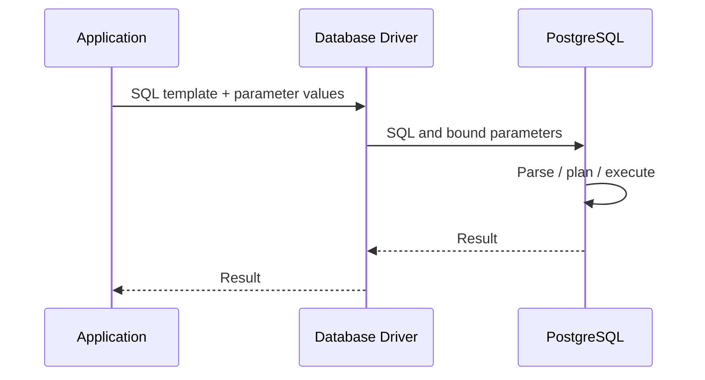

# 10- Parameterized Queries

## Overview

Parameterized queries are the primary application-level defense against SQL injection. They separate SQL structure from the data values supplied by the application.

Instead of constructing SQL like:

```text
SQL + user input
      ↓
One SQL string
      ↓
Database
```

a parameterized query uses:

```text
SQL template
    +
Parameter values
    ↓
Database driver / ORM
    ↓
PostgreSQL
```

The database can therefore distinguish between:

- SQL syntax
- Data supplied as a parameter

This distinction is fundamental to secure database access in Python, Django, FastAPI, microservices, background workers, and other backend systems.

Parameterized queries also provide a consistent foundation for production database code because they reduce injection risk without requiring application developers to manually escape SQL values.

---

## Why Parameterized Queries Exist

SQL statements contain both structure and values.

For example:

```sql
SELECT id, email
FROM users
WHERE email = 'alice@example.com';
```

The structure is:

```sql
SELECT id, email
FROM users
WHERE email = ?
```

The value is:

```text
alice@example.com
```

A vulnerable application may combine these components before sending them to the database:

```text
SQL structure + raw input
```

A parameterized query keeps them separate:

```text
SQL structure
      +
parameter value
```

This prevents a value from being interpreted as additional SQL syntax.

---

## Unsafe Query Construction

Consider:

```python
email = request.query_params["email"]

query = f"""
    SELECT id, email
    FROM users
    WHERE email = '{email}'
"""
```

The application is constructing SQL using an untrusted value.

The fundamental problem is not the Python f-string itself. The problem is allowing external data to become part of SQL syntax.

Other unsafe patterns include:

```python
query = "SELECT * FROM users WHERE email = '" + email + "'"
```

and:

```python
query = "SELECT * FROM users WHERE email = '{}'".format(email)
```

and:

```python
query = "SELECT * FROM users WHERE email = '%s'" % email
```

These should not be used to construct SQL from untrusted values.

---

## Basic Parameterized Query

With `psycopg`:

```python
from psycopg import Connection


def find_user(conn: Connection, email: str):
    with conn.cursor() as cursor:
        cursor.execute(
            """
            SELECT id, email
            FROM users
            WHERE email = %s
            """,
            (email,),
        )

        return cursor.fetchone()
```

The SQL statement and parameter are supplied separately:

```text
SQL:
SELECT ...
WHERE email = %s

Parameter:
email
```

The driver handles the parameter according to the PostgreSQL protocol.

---

## How Parameter Binding Works

At a conceptual level:



The important security boundary is:

```text
SQL structure ≠ parameter value
```

The application should not first turn the parameter into a larger SQL string.

---

## Parameterization vs Escaping

These are different approaches.

| Approach | How it works | Recommendation |
|---|---|---|
| Parameterization | Sends values separately from SQL structure | Preferred |
| Manual escaping | Modifies strings so they can be embedded into SQL | Avoid as primary defense |
| ORM expression APIs | Build structured queries and bind values | Preferred |
| Allowlisting | Restricts dynamic SQL structure | Required for some structural inputs |

Manual escaping is fragile because SQL syntax and escaping rules can vary by database and context.

Parameterization is stronger because the application does not need to transform a data value into SQL syntax safely.

---

## Values vs SQL Structure

A crucial production distinction is:

```text
SQL value
```

versus:

```text
SQL structure
```

Values can normally be parameterized:

```sql
WHERE id = %s
WHERE email = %s
WHERE status = %s
```

SQL identifiers and structural elements generally cannot be handled as ordinary value parameters:

```sql
ORDER BY %s
FROM %s
SELECT %s
```

If an application needs dynamic SQL structure, use a strict allowlist or an identifier-aware SQL composition mechanism.

---

## Parameterized Search

A typical API may expose:

```text
GET /users?search=alice
```

A safe query is:

```python
search_term = request.query_params.get("search", "")

cursor.execute(
    """
    SELECT id, email
    FROM users
    WHERE email ILIKE %s
    ORDER BY id
    LIMIT %s
    """,
    (f"%{search_term}%", 100),
)
```

The wildcard characters are part of the parameter value:

```text
Parameter:
%alice%
```

They are not concatenated into SQL syntax.

---

## Parameterized `INSERT`

```python
cursor.execute(
    """
    INSERT INTO users (email, display_name)
    VALUES (%s, %s)
    RETURNING id
    """,
    (email, display_name),
)

user_id = cursor.fetchone()[0]
```

Both values remain parameters.

This pattern should be used for:

- Inserts
- Updates
- Deletes
- Selects
- Filtering
- Search
- Pagination
- Conditional writes

---

## Parameterized `UPDATE`

```python
cursor.execute(
    """
    UPDATE orders
    SET status = %s
    WHERE id = %s
    """,
    (status, order_id),
)
```

Do not construct:

```python
query = f"""
    UPDATE orders
    SET status = '{status}'
    WHERE id = {order_id}
"""
```

Even if `order_id` is expected to be an integer, parameterization is still the cleaner and safer boundary.

---

## Parameterized `DELETE`

```python
cursor.execute(
    """
    DELETE FROM sessions
    WHERE user_id = %s
      AND session_id = %s
    """,
    (user_id, session_id),
)
```

The same rule applies regardless of the SQL operation.

---

## Parameterized Pagination

Pagination values should also be treated as parameters.

```python
cursor.execute(
    """
    SELECT id, email, created_at
    FROM users
    ORDER BY created_at DESC
    LIMIT %s
    OFFSET %s
    """,
    (limit, offset),
)
```

Application-level validation should still enforce sensible limits:

```text
limit >= 1
limit <= configured maximum
offset >= 0
```

Parameterization protects SQL structure; validation protects application behavior and database resources.

---

## Parameterized Keyset Pagination

For high-volume tables, keyset pagination can avoid the performance problems associated with large offsets.

```python
cursor.execute(
    """
    SELECT id, email, created_at
    FROM users
    WHERE created_at < %s
    ORDER BY created_at DESC
    LIMIT %s
    """,
    (cursor_timestamp, page_size),
)
```

Both cursor values remain parameters.

For stable ordering, production systems commonly use a deterministic tie-breaker such as `id`:

```sql
SELECT id, email, created_at
FROM users
WHERE (created_at, id) < (%s, %s)
ORDER BY created_at DESC, id DESC
LIMIT %s;
```

---

## Parameterized `IN` Queries

Applications frequently need:

```sql
WHERE id IN (...)
```

Do not manually construct the list:

```python
ids = request.query_params["ids"].split(",")

query = f"""
    SELECT id, email
    FROM users
    WHERE id IN ({",".join(ids)})
"""
```

Use the ORM or query builder's collection handling.

For SQLAlchemy:

```python
from sqlalchemy import select

stmt = select(User).where(User.id.in_(user_ids))

result = session.execute(stmt)
users = result.scalars().all()
```

The expression API generates the appropriate bound parameters.

---

## Empty Collections

Production code should explicitly consider an empty `IN` collection.

For example:

```python
if not user_ids:
    return []

stmt = select(User).where(User.id.in_(user_ids))
```

This avoids relying on database-specific or query-builder-specific behavior when there are no values.

---

## Django ORM

Django's normal ORM APIs parameterize values.

For example:

```python
users = User.objects.filter(
    email=email,
    is_active=True,
)
```

Conceptually, Django produces SQL similar to:

```sql
SELECT ...
FROM users
WHERE email = %s
  AND is_active = %s;
```

with the values supplied separately.

Prefer structured ORM operations whenever they express the required query correctly.

---

## Django `raw()`

Django supports raw SQL through `raw()`.

Unsafe:

```python
User.objects.raw(
    f"""
    SELECT *
    FROM users
    WHERE email = '{email}'
    """
)
```

Safe:

```python
User.objects.raw(
    """
    SELECT *
    FROM users
    WHERE email = %s
    """,
    [email],
)
```

Raw SQL should be treated as a security-sensitive boundary.

---

## Django `RawSQL`

Django's `RawSQL` expression supports parameters.

For example:

```python
from django.db.models.expressions import RawSQL

queryset = User.objects.annotate(
    matching=RawSQL(
        "some_function(email, %s)",
        [search_term],
    )
)
```

The parameter should be supplied through the API's parameter mechanism rather than interpolated into the SQL string.

Whenever raw expressions are necessary, keep the SQL fragment controlled by application code and bind external values separately.

---

## FastAPI

FastAPI does not itself parameterize database queries.

A typical request flow is:

```text
HTTP Request
    ↓
FastAPI
    ↓
Validation
    ↓
Service Layer
    ↓
Repository
    ↓
Database Driver / ORM
    ↓
PostgreSQL
```

The database access layer remains responsible for parameterization.

---

## SQLAlchemy

SQLAlchemy's expression API is designed around structured SQL construction.

For example:

```python
from sqlalchemy import select

stmt = select(User).where(
    User.email == email,
)

result = session.execute(stmt)
user = result.scalar_one_or_none()
```

For textual SQL:

```python
from sqlalchemy import text

stmt = text(
    """
    SELECT id, email
    FROM users
    WHERE email = :email
    """
)

result = session.execute(
    stmt,
    {"email": email},
)
```

The value is bound separately.

---

## Parameterization and Type Handling

A database driver does more than protect SQL syntax.

It also handles conversion between application values and database types.

Examples include:

```text
Python int       → PostgreSQL integer
Python str       → PostgreSQL text
Python datetime  → PostgreSQL timestamp
Python UUID      → PostgreSQL UUID
Python Decimal   → PostgreSQL numeric
```

Using driver-level parameter binding is therefore preferable to manually converting values into SQL literals.

---

## Parameterization and NULL

`NULL` deserves particular attention.

This is incorrect SQL semantics:

```sql
WHERE deleted_at = NULL
```

The correct form is:

```sql
WHERE deleted_at IS NULL
```

Parameterization does not automatically fix SQL semantics.

For example, the application may need:

```python
if deleted_at is None:
    query = """
        SELECT id
        FROM users
        WHERE deleted_at IS NULL
    """
    cursor.execute(query)
else:
    query = """
        SELECT id
        FROM users
        WHERE deleted_at = %s
    """
    cursor.execute(query, (deleted_at,))
```

Security and SQL correctness are separate concerns.

---

## Dynamic `ORDER BY`

Consider an API:

```text
GET /users?sort=created_at
```

This is unsafe:

```python
sort = request.query_params["sort"]

query = f"""
    SELECT id, email
    FROM users
    ORDER BY {sort}
"""
```

A parameter placeholder is intended for a value, not arbitrary SQL syntax.

Use an allowlist:

```python
SORT_COLUMNS = {
    "name": "name",
    "created": "created_at",
    "email": "email",
}

sort_key = request.query_params.get("sort", "created")
sort_column = SORT_COLUMNS.get(sort_key, "created_at")
```

Then:

```python
query = f"""
    SELECT id, email
    FROM users
    ORDER BY {sort_column}
"""
```

The dynamic fragment is now controlled entirely by server-side code.

---

## Dynamic Sort Direction

The same principle applies to `ASC` and `DESC`.

```python
SORT_DIRECTIONS = {
    "asc": "ASC",
    "desc": "DESC",
}

direction = SORT_DIRECTIONS.get(
    request.query_params.get("direction", "desc"),
    "DESC",
)
```

Then:

```python
query = f"""
    SELECT id, email
    FROM users
    ORDER BY created_at {direction}
"""
```

Do not directly interpolate arbitrary direction input.

---

## Dynamic Table and Column Names

Parameter binding normally cannot be used as a general replacement for SQL identifiers.

Unsafe:

```python
table_name = request.query_params["table"]

query = f"SELECT * FROM {table_name}"
```

If dynamic identifiers are genuinely required:

1. Validate against a strict allowlist.
2. Use an identifier-aware SQL composition API where available.
3. Avoid accepting arbitrary SQL identifiers from clients.

With `psycopg`:

```python
from psycopg import sql


ALLOWED_TABLES = {
    "orders",
    "customers",
}


def count_rows(conn, table_name: str) -> int:
    if table_name not in ALLOWED_TABLES:
        raise ValueError("Unsupported table")

    query = sql.SQL(
        "SELECT count(*) FROM {}"
    ).format(
        sql.Identifier(table_name)
    )

    with conn.cursor() as cursor:
        cursor.execute(query)
        return cursor.fetchone()[0]
```

The allowlist is important because it constrains which identifiers the application can use.

---

## Building Dynamic WHERE Clauses

Dynamic filtering is common in backend APIs.

A safe pattern is:

```python
filters = []
params = []

if email is not None:
    filters.append("email = %s")
    params.append(email)

if status is not None:
    filters.append("status = %s")
    params.append(status)

query = """
    SELECT id, email, status
    FROM users
"""

if filters:
    query += " WHERE " + " AND ".join(filters)

cursor.execute(query, params)
```

The application dynamically chooses from trusted SQL fragments.

The external values remain parameters.

The distinction is:

```text
Trusted SQL fragments
+
Untrusted bound values
```

not:

```text
User-generated SQL fragments
```

---

## Query Builders

Query builders are useful because they represent SQL structure programmatically.

For example:

```python
stmt = select(User)

if email:
    stmt = stmt.where(User.email == email)

if status:
    stmt = stmt.where(User.status == status)
```

This approach is generally safer than assembling arbitrary SQL strings.

However, query builders are not magic security boundaries.

Raw SQL APIs can still bypass their protections.

---

## Prepared Statements

Parameterized queries and prepared statements are closely related but should not be treated as identical concepts.

A parameterized query describes how values are supplied separately from SQL.

A prepared statement may additionally involve:

```text
Parse
  ↓
Prepared statement
  ↓
Bind parameters
  ↓
Execute
```

Prepared statements can improve efficiency when the same statement is executed repeatedly, depending on the driver, protocol, and workload.

They also maintain the separation between query structure and values.

---

## PostgreSQL Extended Query Protocol

PostgreSQL supports a protocol in which clients can separately send:

```text
Parse
Bind
Execute
```

Conceptually:


The exact behavior depends on the driver and configuration, but the security principle remains:

```text
Parameters are not concatenated into SQL syntax.
```

---

## Prepared Statements and Query Planning

Prepared statements can affect planning behavior.

Depending on PostgreSQL version, driver behavior, and execution pattern, PostgreSQL may use custom or generic plans.

This matters when:

```text
Same SQL shape
+
Highly different parameter selectivity
```

can produce substantially different optimal plans.

For example:

```text
WHERE tenant_id = $1
```

may behave differently when one tenant owns:

```text
10 rows
```

and another owns:

```text
10 million rows
```

Parameterization should not be disabled because of speculative planner concerns.

Instead, investigate actual execution plans and prepared-statement behavior when performance problems occur.

---

## Parameterization and Performance

Parameterized queries are not inherently slower.

Production performance depends on:

- Query planning
- Indexes
- Statistics
- Connection pooling
- Network round trips
- Result size
- Lock contention
- CPU
- Disk I/O
- Query shape

Do not replace safe parameter binding with string interpolation merely to avoid a perceived performance cost.

If performance problems exist, measure:

```text
Application latency
+
Database execution time
+
Query plan
+
Connection acquisition time
```

---

## Parameterization and Query Plan Reuse

A stable query shape can make repeated execution easier to reason about:

```sql
SELECT id
FROM users
WHERE email = $1;
```

instead of generating many SQL strings:

```sql
SELECT id FROM users WHERE email = 'a@example.com';
SELECT id FROM users WHERE email = 'b@example.com';
SELECT id FROM users WHERE email = 'c@example.com';
```

Parameterization can therefore contribute to efficient statement handling and cleaner query observability.

However, plan reuse should not be confused with a guarantee that every execution uses one identical plan.

---

## Connection Pooling

Parameterized queries work normally with connection pools.

The architecture may look like:

```text
API Pods
   ↓
Connection Pools
   ↓
PostgreSQL
```

Every pooled connection can execute parameterized statements.

Security problems can still occur if application code constructs SQL unsafely before submitting it to the pooled connection.

Pooling is therefore orthogonal to SQL injection prevention.

---

## Microservices

In a microservice architecture:

```text
Order Service
     ↓
Order Database

Payment Service
     ↓
Payment Database

Catalog Service
     ↓
Catalog Database
```

Each service should use parameterized queries for its database interactions.

Do not assume that an internal service automatically produces trusted SQL inputs.

For shared databases, each service should still use a restricted database role and controlled query-access patterns.

---

## Background Workers

Parameterized queries must also be used in:

- Celery workers
- Kafka consumers
- Scheduled jobs
- Batch processors
- Data-import services

For example:

```python
def update_order_status(cursor, order_id, status):
    cursor.execute(
        """
        UPDATE orders
        SET status = %s
        WHERE id = %s
        """,
        (status, order_id),
    )
```

A value originating from a Kafka message is still data and should not be interpolated into SQL.

---

## Redis and Parameterized Queries

Redis does not use SQL, but backend systems often combine Redis and PostgreSQL:

```text
Request
  ↓
Redis
  ↓
Cache miss
  ↓
PostgreSQL
```

When a cache miss triggers a database query, the database query must still use parameterization.

Caching does not change the SQL security boundary.

---

## Kafka and Parameterized Queries

A common event-driven path is:

```text
REST API
   ↓
Kafka
   ↓
Consumer
   ↓
PostgreSQL
```

The consumer should treat event fields as data.

For example:

```python
cursor.execute(
    """
    INSERT INTO audit_events (
        event_id,
        event_type,
        aggregate_id
    )
    VALUES (%s, %s, %s)
    """,
    (event_id, event_type, aggregate_id),
)
```

Kafka provides messaging semantics, not SQL trust guarantees.

---

## Celery and Parameterized Queries

Celery workers often process user-derived data asynchronously.

For example:

```text
POST /orders
     ↓
Celery task
     ↓
Update database
```

The asynchronous boundary does not change the security requirements.

Use the same database-access standards in workers as in synchronous API handlers.

---

## REST APIs

REST APIs commonly expose dynamic filtering:

```text
GET /orders?
    customer_id=...
    &status=...
    &created_after=...
```

A secure implementation should:

```text
Validate input
      ↓
Build trusted query structure
      ↓
Bind values
      ↓
Execute
```

Do not accept arbitrary SQL expressions through query parameters.

---

## gRPC

The same principle applies to gRPC.

For example:

```text
gRPC Request
    ↓
Validated protobuf fields
    ↓
Service
    ↓
Repository
    ↓
Parameterized SQL
```

Protocol choice does not affect SQL injection protection.

A protobuf field containing user-controlled data must still be treated as a database parameter.

---

## Input Validation

Parameterization should be combined with validation.

For example:

```python
if page_size < 1 or page_size > 100:
    raise ValueError("Invalid page size")
```

Validation provides:

- Business-rule enforcement
- Resource protection
- Type constraints
- Better error handling
- Reduced accidental load

Parameterization provides:

- SQL/data separation
- SQL injection protection

They solve different problems.

---

## Authorization

A parameterized query can still expose data to the wrong user.

For example:

```python
cursor.execute(
    """
    SELECT id, total
    FROM orders
    WHERE id = %s
    """,
    (order_id,),
)
```

This is SQL-injection-safe.

But it may still be insecure if the application does not verify that the current user is allowed to access that order.

A secure backend therefore needs:

```text
Authentication
+
Authorization
+
Input validation
+
Parameterized queries
+
Least privilege
```

---

## Row-Level Security

PostgreSQL Row-Level Security can provide another authorization boundary.

For example:

```sql
ALTER TABLE orders ENABLE ROW LEVEL SECURITY;

CREATE POLICY tenant_isolation
ON orders
USING (
    tenant_id = current_setting('app.tenant_id')::uuid
);
```

Parameterized queries remain necessary.

RLS and parameterization solve different problems:

```text
Parameterization
    → Prevents SQL structure manipulation

RLS
    → Restricts visible rows
```

When using pooled connections, transaction-scoped tenant context such as `SET LOCAL` should be used carefully so tenant state cannot leak between requests.

---

## Least-Privileged Database Roles

Use a runtime database role with only the privileges required by the service.

For example:

```text
app_runtime
    ├── SELECT required tables
    ├── INSERT required tables
    ├── UPDATE required tables
    └── DELETE required tables
```

Avoid:

```text
application
    ↓
PostgreSQL superuser
```

If an application vulnerability exists, least privilege limits the possible impact.

---

## Transactions

Parameterized queries work inside transactions normally.

For example:

```python
with conn.transaction():
    with conn.cursor() as cursor:
        cursor.execute(
            """
            UPDATE inventory
            SET available = available - 1
            WHERE product_id = %s
              AND available > 0
            """,
            (product_id,),
        )

        if cursor.rowcount != 1:
            raise ValueError("Product unavailable")
```

Parameterization prevents injection.

The transaction provides atomicity.

These are separate concerns.

---

## Error Handling

Do not expose raw database errors to clients.

For example, a database error may reveal:

- Table names
- Column names
- Query structure
- Constraint names
- Internal implementation details

Prefer:

```text
Database error
    ↓
Structured internal log
    ↓
Safe API error
```

while retaining enough internal context for debugging.

---

## Logging

Avoid logging raw SQL parameters indiscriminately.

Parameters may contain:

- Email addresses
- Personal data
- Authentication data
- Payment information
- Tenant identifiers
- Secrets

Prefer structured observability:

```text
request_id
operation
query_name
database_duration
rows_affected
error_class
```

with appropriate redaction.

---

## Testing Parameterized Queries

Security tests should verify that untrusted input remains data.

Test database access through the same layers used in production:

```text
API
 ↓
Service
 ↓
Repository
 ↓
Driver / ORM
 ↓
PostgreSQL
```

Useful test categories include:

- Search values
- Filter values
- IDs
- Pagination values
- JSON fields
- Path parameters
- Background-job inputs
- Kafka event fields
- Dynamic sorting
- Dynamic identifiers

---

## Static Analysis

Code scanning can detect common unsafe patterns such as:

```python
f"SELECT ..."
```

or:

```python
"SELECT ..." + variable
```

or:

```python
"SELECT ... {}".format(variable)
```

Static analysis is valuable but cannot prove complete SQL safety.

A production security program combines:

```text
Static analysis
+
Code review
+
Integration tests
+
Dependency security
+
Database least privilege
+
Runtime monitoring
```

---

## Code Review Checklist

When reviewing database code, ask:

- Are all external values passed as parameters?
- Is SQL being built with f-strings?
- Is string concatenation used to construct SQL?
- Is `%` formatting being used incorrectly?
- Are raw ORM APIs involved?
- Are SQLAlchemy textual queries using named parameters?
- Are dynamic identifiers allowlisted?
- Are `ORDER BY` fields controlled?
- Are stored procedures using safe dynamic SQL?
- Are privileged functions involved?
- Is the database role least privileged?
- Is authorization enforced separately?
- Are background workers using the same standards?
- Are query parameters unnecessarily logged?

---

## Common Mistakes

### Concatenating SQL Strings

```python
query = "SELECT * FROM users WHERE id = " + str(user_id)
```

**Problem:** Data becomes SQL syntax.

**Better:** Bind `user_id` as a parameter.

### Using f-Strings

```python
query = f"SELECT * FROM users WHERE email = '{email}'"
```

**Problem:** User-controlled values are interpolated into SQL.

**Better:** Use parameter binding.

### Confusing Parameters with Identifiers

```sql
SELECT *
FROM %s;
```

**Problem:** A value parameter is not a general-purpose identifier substitution mechanism.

**Better:** Use allowlists and identifier-aware composition.

### Assuming Validation Prevents Injection

```python
if email.endswith("@example.com"):
    ...
```

**Problem:** Business validation does not replace SQL parameterization.

**Better:** Validate and parameterize.

### Assuming the ORM Is Always Safe

**Problem:** Raw SQL APIs can bypass normal ORM protections.

**Better:** Review every raw SQL boundary.

### Escaping Manually

**Problem:** Manual escaping is fragile and context-dependent.

**Better:** Use driver-supported parameter binding.

### Using a Superuser Runtime Role

**Problem:** A database vulnerability can have a much larger blast radius.

**Better:** Use a restricted application role.

### Logging All Parameters

**Problem:** Sensitive values may enter logs.

**Better:** Use structured logging and redact sensitive fields.

---

## Production Architecture

A robust application-to-database security path looks like:


Each layer has a different responsibility:

| Layer | Primary responsibility |
|---|---|
| Nginx / Load Balancer | Network and request controls |
| API | Request validation |
| Service | Business rules and authorization |
| Repository / ORM | Structured database access |
| Parameterized query | SQL/data separation |
| Database role | Least privilege |
| PostgreSQL | Constraints, transactions, RLS, execution |

No single layer should be expected to provide all security controls.

---

## Production Design Principles

A mature backend should follow these rules:

### Keep SQL Structure Server-Controlled

The application should determine the SQL structure.

### Bind External Values

User and event data should be passed as parameters.

### Allowlist Dynamic Structure

For:

- Table names
- Column names
- Sort fields
- Sort direction
- Operators

use fixed server-side mappings or safe identifier composition.

### Prefer Structured APIs

Use:

- Django ORM
- SQLAlchemy expressions
- Driver parameter binding

before resorting to dynamically generated SQL.

### Restrict Database Privileges

The runtime identity should not have administrative privileges.

### Test the Complete Data Path

Security testing should cover:

```text
HTTP
+
gRPC
+
Kafka
+
Celery
+
Database
```

rather than only synchronous API handlers.

---

## Parameterization and Deployment

Parameterized query behavior should remain consistent across:

```text
Local development
      ↓
CI
      ↓
Staging
      ↓
Production
```

Do not introduce special production-only SQL construction shortcuts.

CI/CD should include:

- Static analysis
- Unit tests
- Integration tests
- Migration tests
- Security regression tests

Database credentials should be supplied through secure configuration mechanisms rather than source code.

---

## Parameterization in Kubernetes

A typical deployment may contain:

```text
Ingress / Load Balancer
        ↓
Django / FastAPI Pods
        ↓
Connection Pools
        ↓
PostgreSQL
```

Every pod uses the same application-level parameterization rules.

When secrets are rotated:

```text
Secret rotation
    ↓
Application rollout
    ↓
Connection pool refresh
    ↓
New credentials
```

SQL parameterization itself does not depend on Kubernetes, but database credentials and connection lifecycle do.

---

## AWS Considerations

In AWS environments, parameterized queries remain an application responsibility regardless of whether PostgreSQL runs on:

- Amazon RDS for PostgreSQL
- Amazon Aurora PostgreSQL-Compatible
- Self-managed PostgreSQL

AWS infrastructure controls such as:

- Private subnets
- Security groups
- IAM
- Secrets Manager
- CloudWatch

complement SQL security but do not replace parameterization.

A private database can still be vulnerable to SQL injection from a compromised or vulnerable application.

---

## Monitoring

Useful database and application metrics include:

- Query latency
- Query error rate
- Database connection acquisition time
- Slow query frequency
- Rows returned
- Rows affected
- Authentication failures
- Authorization failures
- Unexpected database errors
- Query shape changes

Query observability tools such as PostgreSQL logs and `pg_stat_statements` can help identify unusual query behavior.

Monitoring should provide detection and diagnosis, not serve as the primary SQL injection defense.

---

## Reliability Considerations

Parameterized queries should be combined with normal database reliability practices:

- Explicit transaction boundaries
- Statement timeouts
- Connection timeouts
- Retry policies
- Idempotency
- Connection pooling
- Health checks
- Proper error classification

Do not blindly retry every database error.

For example:

```text
Serialization failure
    → Potentially retry

Deadlock
    → Potentially retry whole transaction

Constraint violation
    → Usually application/business error

Authentication failure
    → Configuration/security issue
```

Security and reliability decisions should be made together at the database boundary.

---

## High Availability and Disaster Recovery

Parameterization is independent of the database topology.

Whether the application uses:

```text
Primary
Primary + Read Replicas
Multi-AZ HA
Cross-Region DR
```

queries should remain parameterized.

After failover, the same security model should remain in effect:

```text
Application
    ↓
New database endpoint
    ↓
Restricted role
    ↓
Parameterized queries
    ↓
PostgreSQL
```

Backups and replicas do not replace secure query construction.

---

## Performance and Scalability Guidance

For high-throughput systems:

- Reuse connections through controlled pools.
- Keep query shapes stable.
- Avoid unnecessary SQL round trips.
- Use appropriate indexes.
- Inspect execution plans.
- Limit result sizes.
- Prefer keyset pagination for large datasets where appropriate.
- Batch writes when appropriate.
- Avoid dynamically generating thousands of structurally different queries.
- Measure prepared-statement behavior when it materially affects planning.

Do not sacrifice SQL safety for unmeasured performance assumptions.

---

## Senior Engineering Review

When reviewing a database access architecture, reason through:

```text
Where does input originate?
        ↓
Where is it validated?
        ↓
Where does it become a database value?
        ↓
Can it influence SQL structure?
        ↓
How is it bound?
        ↓
Which database role executes it?
        ↓
What rows can that role access?
        ↓
What happens if the query is abused?
```

This is more valuable than checking only whether a particular line contains `%s`.

A senior review considers:

- Query construction
- Driver behavior
- ORM escape hatches
- Dynamic SQL
- Authorization
- RLS
- Database privileges
- Background workloads
- Logging
- Monitoring
- Incident response

---

## Interview Traps

### What is a parameterized query?

A query where SQL structure and data values are supplied separately so values are not interpreted as SQL syntax.

### Why does parameterization prevent SQL injection?

Because the database driver/protocol treats bound values as data rather than concatenating them into the SQL program.

### Is escaping equivalent to parameterization?

No. Escaping is a fragile string-transformation technique; parameterization keeps values separate from SQL structure.

### Does parameterization work for table names?

Not as ordinary value parameters. Dynamic identifiers require controlled SQL composition, typically through strict allowlists and identifier-aware APIs.

### Does Django ORM prevent SQL injection?

Normal Django ORM operations parameterize values, but raw SQL and other escape hatches can still be unsafe.

### Does FastAPI protect against SQL injection?

No. FastAPI validates and processes requests but does not determine how SQL is constructed.

### Does SQLAlchemy prevent SQL injection?

Its structured expression APIs provide safe parameter binding for normal usage, but developers can still construct unsafe raw SQL.

### Are Kafka messages trusted?

No. Event data should be treated as data and passed to the database using the same parameterization rules.

### Does a read-only role prevent SQL injection?

No. It can reduce the impact of injected writes but does not prevent unauthorized reads or other database abuse.

### Are prepared statements always faster?

Not necessarily. They can improve repeated execution efficiency, but planning behavior and generic/custom plans can affect performance. Measure the actual workload.

### Is input validation enough?

No. Validation enforces business and resource constraints; parameterization prevents values from becoming SQL syntax.

### What is the senior-level rule?

**Keep SQL structure under application control, bind external values separately, strictly control dynamic SQL structure, and combine parameterization with authorization and least-privileged database roles.**

## Key Takeaways

- **Parameterized queries separate SQL structure from data values**, making them the primary defense against SQL injection.
- **Use ORM/query-builder APIs or driver parameter binding for values**, including filters, inserts, updates, deletes, pagination, and search.
- **Dynamic SQL structure requires separate controls**: use strict allowlists and identifier-aware composition for table names, columns, sort fields, and similar constructs.
- **Parameterization is necessary but not sufficient for database security**; combine it with authorization, RLS where appropriate, least-privileged roles, safe logging, and testing.
- **Apply the same standard across the entire backend**, including Django/FastAPI, microservices, Kafka consumers, Celery workers, PostgreSQL functions, and production deployment environments.