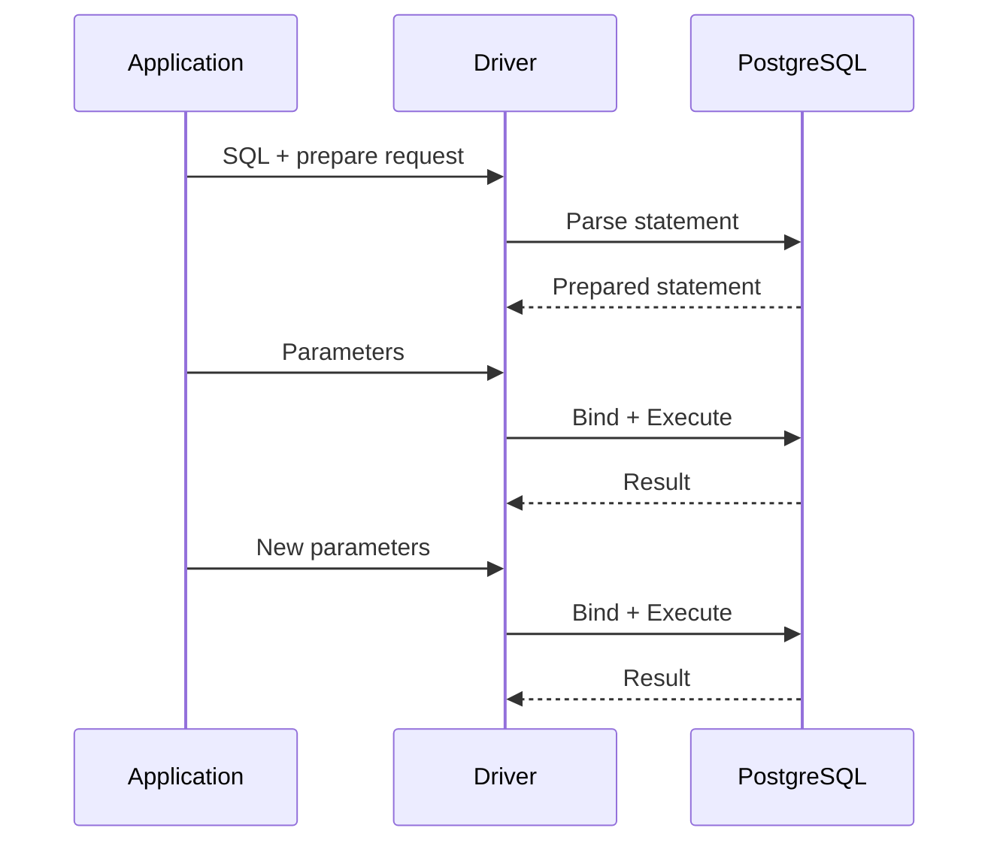
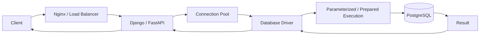

# 11- Prepared Statements

## Overview

Prepared statements are a database mechanism for separating SQL parsing from parameter values and, when reused, allowing the database to execute the same statement structure multiple times.

They are closely related to parameterized queries but are not exactly the same concept:

- **Parameterized query** describes the safe separation of SQL structure and values.
- **Prepared statement** describes a statement that is prepared by the database and can subsequently be executed with bound parameters.

A typical lifecycle is:

```text
Application
    ↓
SQL statement
    ↓
Prepare
    ↓
Prepared statement
    ↓
Bind parameter values
    ↓
Execute
    ↓
Result
```

Prepared statements are important for:

- SQL injection prevention
- Repeated query execution
- Database protocol efficiency
- Stable query structure
- Understanding PostgreSQL planning behavior
- Production performance analysis

They are not automatically a performance optimization in every workload. Preparation introduces its own lifecycle and can interact with PostgreSQL's custom and generic query plans.

---

## Parameterized Queries vs Prepared Statements

These terms are often used interchangeably, but they represent different layers.

| Concept | Meaning |
|---|---|
| Parameterized query | SQL contains placeholders and values are supplied separately |
| Prepared statement | Database stores/prepares a statement for subsequent execution |
| Bound parameter | Value supplied independently from SQL structure |
| Query plan | Strategy PostgreSQL chooses to execute the SQL |
| Prepared plan | Plan associated with a prepared statement execution strategy |

For example:

```sql
SELECT id, email
FROM users
WHERE email = $1;
```

is parameterized.

A prepared statement can be created from that query:

```sql
PREPARE find_user(text) AS
SELECT id, email
FROM users
WHERE email = $1;
```

and then executed repeatedly:

```sql
EXECUTE find_user('alice@example.com');
EXECUTE find_user('bob@example.com');
```

---

## Why Prepared Statements Exist

Without preparation, repeated execution may conceptually look like:

```text
SQL
 ↓
Parse
 ↓
Analyze
 ↓
Plan
 ↓
Execute
```

A prepared statement introduces:

```text
Prepare
 ↓
Prepared statement
 ↓
Bind
 ↓
Execute
 ↓
Bind
 ↓
Execute
```

The exact amount of parsing and planning avoided depends on the PostgreSQL protocol, driver, and prepared-statement behavior.

The important architectural idea is:

```text
Prepare once
    ↓
Execute multiple times
```

when the same statement structure is reused.

---

## PostgreSQL Prepared Statement Lifecycle

A simplified lifecycle is:



The actual wire-level behavior depends on the client driver and whether it uses PostgreSQL's extended query protocol.

---

## PostgreSQL Extended Query Protocol

PostgreSQL supports an extended protocol involving operations such as:

```text
Parse
Bind
Describe
Execute
Sync
```

A simplified flow is:

```text
Client
  │
  ├── Parse ──→ PostgreSQL
  │
  ├── Bind ──→ PostgreSQL
  │
  ├── Execute ─→ PostgreSQL
  │
  └── Result ←── PostgreSQL
```

The protocol allows SQL statements and parameter values to be handled separately.

This is one of the mechanisms underlying parameterized execution and prepared statements.

---

## SQL-Level Prepared Statements

PostgreSQL exposes explicit SQL commands for prepared statements.

Create one:

```sql
PREPARE find_user(text) AS
SELECT id, email
FROM users
WHERE email = $1;
```

Execute it:

```sql
EXECUTE find_user('alice@example.com');
```

Execute again:

```sql
EXECUTE find_user('bob@example.com');
```

Remove it:

```sql
DEALLOCATE find_user;
```

Prepared statements are associated with a database session.

---

## Inspecting Prepared Statements

PostgreSQL provides:

```sql
SELECT *
FROM pg_prepared_statements;
```

This can show information such as:

- Prepared statement name
- Statement text
- Parameter types
- Whether the statement is from SQL or protocol-level preparation
- Preparation timestamp

This is useful when troubleshooting prepared-statement behavior.

---

## Session Scope

Prepared statements are normally session-local.

Conceptually:

```text
Connection A
    └── prepared statement: find_user

Connection B
    └── does not automatically have find_user
```

This becomes important when using connection pools.

A prepared statement created on one PostgreSQL connection is not automatically available on another connection.

---

## Connection Pooling

Consider:

```text
Application
    ↓
Connection Pool
    ├── Connection 1
    ├── Connection 2
    ├── Connection 3
    └── Connection 4
```

A prepared statement associated with connection 1 is not automatically associated with connection 2.

Therefore, production systems must understand how the database driver and pooling layer manage prepared statements.

This becomes particularly important with external poolers such as PgBouncer.

---

## Prepared Statements and PgBouncer

PgBouncer can operate in different pooling modes.

| Pooling mode | Connection association | Prepared statement considerations |
|---|---|---|
| Session pooling | Client retains server connection for session | Most session state works naturally |
| Transaction pooling | Server connection may change between transactions | Session-scoped state requires care |
| Statement pooling | Server connection may change between statements | Strongest restrictions |

Modern PgBouncer versions support prepared-statement handling in transaction pooling under appropriate configuration, but compatibility depends on the client protocol/features and PgBouncer configuration.

Do not assume that every session feature behaves identically through every pooling mode.

When prepared statements are important, validate the exact driver and pooler configuration used in production.

---

## Python and psycopg

A Python application can use parameterized execution without explicitly managing SQL-level `PREPARE` statements.

For example:

```python
with conn.cursor() as cursor:
    cursor.execute(
        """
        SELECT id, email
        FROM users
        WHERE email = %s
        """,
        (email,),
    )
```

This is already parameterized.

Whether the driver uses server-side preparation for repeated statements is a separate implementation detail.

Do not confuse:

```text
Parameterized execution
```

with:

```text
Explicit SQL PREPARE
```

---

## Explicit `PREPARE` with PostgreSQL

For example:

```sql
PREPARE user_by_id(bigint) AS
SELECT id, email
FROM users
WHERE id = $1;
```

Then:

```sql
EXECUTE user_by_id(1001);
```

This is useful for understanding PostgreSQL prepared statements directly, but application code does not generally need to issue `PREPARE` manually for every query.

Drivers and ORMs can manage parameterized execution more appropriately for application workloads.

---

## Prepared Statements and SQL Injection

Prepared statements help prevent SQL injection because parameter values are not incorporated into SQL syntax.

Unsafe:

```python
query = f"""
    SELECT id
    FROM users
    WHERE email = '{email}'
"""
```

Parameterized:

```python
cursor.execute(
    """
    SELECT id
    FROM users
    WHERE email = %s
    """,
    (email,),
)
```

Prepared execution reinforces the separation:

```text
SQL structure
    +
Bound values
```

However, prepared statements do not protect arbitrary dynamic SQL structure such as user-controlled table names or column names.

---

## Dynamic Identifiers

This is not a safe use of an ordinary value parameter:

```sql
SELECT *
FROM $1;
```

A table name is an identifier, not a value.

Use an allowlist and an identifier-aware composition mechanism.

For example:

```python
from psycopg import sql


ALLOWED_TABLES = {
    "orders",
    "customers",
}


def count_rows(conn, table_name: str) -> int:
    if table_name not in ALLOWED_TABLES:
        raise ValueError("Unsupported table")

    statement = sql.SQL(
        "SELECT count(*) FROM {}"
    ).format(
        sql.Identifier(table_name)
    )

    with conn.cursor() as cursor:
        cursor.execute(statement)
        return cursor.fetchone()[0]
```

Prepared statements and identifier-safe composition solve different problems.

---

## Prepared Statements and Query Planning

One of the most important senior-level considerations is query planning.

For an ordinary parameterized query, PostgreSQL may plan execution using the supplied parameter values.

For prepared statements, PostgreSQL can choose between:

- A **custom plan**, planned with knowledge of the current parameter values.
- A **generic plan**, reusable across executions without depending on specific parameter values.

The choice matters when parameter values have very different selectivity.

---

## Custom Plans

A custom plan is generated with knowledge of the current parameter values.

For example:

```sql
SELECT *
FROM orders
WHERE customer_id = $1;
```

Suppose:

```text
Customer A → 5 orders
Customer B → 50,000,000 orders
```

The optimal access strategy may differ substantially.

A custom plan can account for the actual parameter value when selecting an execution strategy.

---

## Generic Plans

A generic plan does not depend on the specific parameter value.

This can be beneficial when:

- The query is executed many times.
- Parameter selectivity is relatively stable.
- Planning overhead is significant.
- A reusable plan is sufficiently good for all executions.

But a generic plan can be inefficient when parameter values have highly different distributions.

Conceptually:

```text
Small tenant
    ↓
Index Scan is ideal

Large tenant
    ↓
Sequential / alternative strategy may be better
```

A single generic plan may not be optimal for both.

---

## Custom vs Generic Plan

| Characteristic | Custom plan | Generic plan |
|---|---|---|
| Uses current parameter values | Yes | No |
| Planning cost | Higher | Lower after reusable plan exists |
| Can adapt to skewed data | Better | Worse |
| Reusable | Less | More |
| Useful for uniform workloads | Often unnecessary | Often useful |
| Sensitive to parameter distribution | Yes | Yes, because it ignores it |

The correct choice is workload-dependent.

---

## PostgreSQL Plan Selection

PostgreSQL can decide whether to use custom or generic plans for prepared statements.

The decision is based on the relative cost of planning repeatedly versus executing a reusable generic plan.

Applications can inspect or influence this behavior when diagnosing specific performance problems.

For example:

```sql
SET plan_cache_mode = force_custom_plan;
```

or:

```sql
SET plan_cache_mode = force_generic_plan;
```

These settings are primarily diagnostic or workload-specific tools.

Do not globally force one strategy without measuring the consequences.

---

## Parameter Sensitivity

Parameter-sensitive performance problems often look like:

```text
Same SQL
+
Different parameter
+
Very different execution time
```

For example:

```sql
SELECT *
FROM orders
WHERE tenant_id = $1;
```

might perform well for most tenants but poorly for a very large tenant.

A senior engineer should investigate:

```text
Query shape
    ↓
Statistics
    ↓
Cardinality estimates
    ↓
Custom/generic plan behavior
    ↓
Actual execution plan
```

rather than concluding that prepared statements are inherently slow.

---

## `EXPLAIN` and Prepared Statements

You can inspect prepared-statement execution using PostgreSQL tools.

For example:

```sql
EXPLAIN (ANALYZE, BUFFERS)
EXECUTE user_by_id(1001);
```

This allows you to inspect:

- Actual execution time
- Row counts
- Buffer activity
- Scan strategy
- Join behavior
- Planning/execution characteristics

Compare different parameter values when investigating parameter-sensitive performance.

---

## Planning Time vs Execution Time

Prepared statements can reduce repeated planning overhead, but the significance depends on the workload.

Consider:

```text
Planning:   2 ms
Execution:  500 ms
```

Saving planning work provides little overall benefit.

But:

```text
Planning:   2 ms
Execution:  1 ms
```

may make planning overhead significant.

The correct optimization target depends on the workload's latency profile.

---

## High-Frequency Queries

Prepared statements are most interesting when a query:

- Executes frequently.
- Has stable SQL structure.
- Has relatively predictable behavior.
- Has enough planning overhead for reuse to matter.

Examples include:

```text
GET /users/{id}
GET /orders/{id}
UPDATE inventory
INSERT audit_event
```

But frequency alone does not guarantee that explicit preparation is beneficial.

Measure before introducing application-specific preparation behavior.

---

## Prepared Statements and OLTP

Prepared statements can fit naturally into OLTP workloads.

Typical OLTP operations are:

```text
Small query
+
High execution frequency
+
Stable query shape
+
Short transaction
```

For example:

```sql
SELECT id, status, total
FROM orders
WHERE id = $1;
```

A stable, repeatedly executed query is a natural candidate for parameterized/prepared execution.

---

## Prepared Statements and OLAP

Analytical queries often have:

- Large scans
- Complex joins
- Aggregations
- Longer execution times
- More variable query structures

In these cases, planning overhead may represent a smaller fraction of total latency.

Prepared statements can still be useful, but they should not automatically be introduced simply because a query is executed repeatedly.

---

## Prepared Statements and ORM Systems

Modern ORMs typically provide parameterized execution automatically.

For example:

```python
User.objects.filter(email=email)
```

or:

```python
stmt = select(User).where(User.email == email)
```

The ORM may generate parameterized SQL.

The ORM's use of parameters should be considered separately from whether the database connection uses server-side prepared statements.

---

## Django

Django's ORM normally parameterizes query values.

For example:

```python
user = User.objects.filter(
    email=email,
).first()
```

The application does not normally need to manually issue:

```sql
PREPARE ...
```

for every ORM query.

If database-level prepared statement behavior becomes relevant, evaluate the actual database driver and deployment configuration rather than assuming Django itself provides a particular server-side preparation strategy.

---

## SQLAlchemy

SQLAlchemy generates parameterized SQL through its expression APIs.

For example:

```python
from sqlalchemy import select

stmt = select(User).where(
    User.email == email,
)

result = session.execute(stmt)
user = result.scalar_one_or_none()
```

Textual SQL can also use bound parameters:

```python
from sqlalchemy import text

stmt = text(
    """
    SELECT id, email
    FROM users
    WHERE email = :email
    """
)

result = session.execute(
    stmt,
    {"email": email},
)
```

Whether server-side prepared statements are used depends on the SQLAlchemy dialect, DBAPI driver, and configuration.

---

## Prepared Statements and Transactions

Prepared statements can be executed inside transactions:

```sql
BEGIN;

EXECUTE user_by_id(1001);

COMMIT;
```

The prepared statement itself is not the transaction boundary.

Keep these concepts separate:

```text
Prepared statement
    → SQL execution mechanism

Transaction
    → Atomicity / consistency boundary
```

A prepared statement can participate in many different transaction designs.

---

## Prepared Statements and Connection State

Because prepared statements can be session-scoped, connection lifecycle matters.

Potential architecture:

```text
Request
   ↓
Connection Pool
   ↓
Connection
   ↓
Prepared Statement
   ↓
Execution
```

If the connection is returned to a pool:

```text
Connection
   ↓
Pool
```

the prepared statement may remain associated with that server session.

But if the pool closes the connection:

```text
Connection
   ↓
Closed
```

the prepared statement disappears with that session.

---

## Deployment Implications

Rolling deployments can create many application processes:

```text
Old Pods
  ├── Connection pools
  └── Prepared statements

New Pods
  ├── Connection pools
  └── Prepared statements
```

Prepared statements are not normally shared across those connections.

This can increase:

- Session state
- Memory usage
- Preparation activity
- Operational complexity

The impact depends on the number of connections and prepared statements.

---

## Prepared Statement Memory

Prepared statements consume resources associated with the database session.

A system that creates thousands of distinct prepared statements per connection can increase memory usage and operational complexity.

Avoid generating unique prepared statement names or SQL structures unnecessarily.

Prefer a bounded set of stable query shapes.

---

## Statement Naming

Explicit prepared statements have names:

```sql
PREPARE user_by_id(bigint) AS
...
```

Application drivers may manage names internally.

A production system should avoid unbounded statement-name generation.

For example, this conceptual pattern is undesirable:

```text
query_1
query_2
query_3
...
query_1,000,000
```

especially when multiplied across many database connections.

---

## Prepared Statements and Connection Churn

If connections are frequently created and destroyed:

```text
Create connection
    ↓
Prepare
    ↓
Execute
    ↓
Close connection
```

the benefit of preparation may be reduced.

This is one reason connection pooling and prepared-statement behavior need to be considered together.

For serverless workloads with highly ephemeral connections, explicit preparation may provide less benefit than in a long-lived service.

---

## Serverless Considerations

A serverless architecture may look like:

```text
Request
  ↓
Function
  ↓
Database connection
  ↓
Query
  ↓
Function lifecycle
```

When execution environments are short-lived, session-local prepared statements may have limited reuse.

Connection management becomes a larger architectural concern.

Depending on the platform, use appropriate connection pooling/proxying mechanisms and validate the driver's prepared-statement behavior.

---

## Prepared Statements and PgBouncer Transaction Pooling

Transaction pooling can break assumptions based on session state.

For example:

```text
Client transaction 1 → Server connection A
Client transaction 2 → Server connection B
```

A session-local prepared statement may not be available on connection B.

Modern PgBouncer versions can support prepared statements in transaction pooling under configured conditions, but this does not mean all session state is portable.

When using transaction pooling, explicitly verify:

- PgBouncer version
- Pool mode
- Driver behavior
- Prepared-statement configuration
- Protocol compatibility
- Application expectations

---

## Prepared Statements and Statement Pooling

Statement pooling is even more restrictive.

A client may not retain a server-side session across statements.

This can conflict with session-oriented database features.

For workloads requiring:

- Prepared statements
- Temporary tables
- Session variables
- Advisory locks
- Session-level settings

session or transaction pooling should be evaluated carefully.

---

## Security Considerations

Prepared statements provide strong protection against SQL injection through parameter values.

However, they do not eliminate other database security risks.

Still required:

- Input validation
- Authorization
- Least-privileged roles
- RLS where appropriate
- Secure credential management
- Safe dynamic SQL construction
- Secure `SECURITY DEFINER` functions

Prepared statements should be considered one layer of database security.

---

## Prepared Statements and Least Privilege

A prepared statement executes with the privileges of the database role executing it.

For example:

```text
Application
    ↓
Prepared statement
    ↓
app_runtime
    ↓
PostgreSQL
```

If `app_runtime` is overprivileged, prepared statements do not fix that problem.

Use:

```text
Prepared statements
+
Least-privileged role
```

rather than treating preparation as a complete security model.

---

## Error Handling

Prepared statement failures should be classified correctly.

Examples include:

```text
Invalid statement
Invalid parameter type
Constraint violation
Serialization failure
Deadlock
Connection failure
Statement timeout
```

Do not blindly retry every failure.

A serialization failure may be retryable.

A syntax error or invalid statement definition is not.

---

## Timeouts

Prepared execution does not remove the need for timeouts.

Use appropriate controls such as:

```sql
SET statement_timeout = '5s';
```

and application-level connection acquisition timeouts.

Different layers protect against different failures:

```text
Pool timeout
    → Waiting for connection

Connection timeout
    → Establishing connection

Statement timeout
    → Database execution

Application timeout
    → End-to-end request
```

---

## Observability

Monitor:

- Query latency
- Planning time
- Execution time
- Query frequency
- Connection pool usage
- Database connections
- Prepared statement count where relevant
- Slow queries
- Query errors
- Generic/custom plan behavior when diagnosed
- Memory/resource pressure

Useful PostgreSQL tools include:

```sql
SELECT *
FROM pg_prepared_statements;
```

and:

```sql
EXPLAIN (ANALYZE, BUFFERS)
EXECUTE user_by_id(1001);
```

Query statistics can be correlated with application request metrics.

---

## Performance Troubleshooting

If a prepared query is unexpectedly slow:

```text
1. Confirm query frequency
2. Inspect execution plans
3. Compare different parameter values
4. Check cardinality estimates
5. Check indexes
6. Check statistics
7. Investigate generic/custom plan behavior
8. Measure planning vs execution time
9. Check connection/pooler behavior
10. Validate actual production workload
```

Do not immediately disable prepared statements.

First determine what is actually causing the regression.

---

## Query Plan Regression

Prepared statements can expose parameter-sensitive plan problems.

For example:

```text
Deployment
   ↓
Driver configuration changes
   ↓
Prepared statement behavior changes
   ↓
Generic plan selected
   ↓
Large tenant query becomes slow
```

This is why production database performance must be measured after:

- Driver upgrades
- PostgreSQL upgrades
- ORM upgrades
- Pooler changes
- Index changes
- Statistics changes
- Significant data-distribution changes

---

## Statistics Matter

Prepared statements do not replace PostgreSQL statistics.

The optimizer still depends on information such as:

- Table cardinality
- Column distributions
- Most common values
- Histograms
- Correlation
- Extended statistics

If estimates are wrong, the resulting plan can be poor.

For example:

```sql
ANALYZE orders;
```

may be appropriate after significant data changes when autovacuum/analyze has not yet caught up.

---

## Prepared Statements and Indexes

Prepared statements do not automatically use indexes.

For example:

```sql
PREPARE find_order(bigint) AS
SELECT *
FROM orders
WHERE id = $1;
```

If `id` is indexed and selective, PostgreSQL may choose an index-based plan.

But the optimizer can still choose another strategy based on:

- Table size
- Statistics
- Selectivity
- Cost parameters
- Parameter behavior
- Available indexes

The rule remains:

```text
Prepared
    ≠
Indexed
    ≠
Fast
```

---

## Prepared Statements and Query Shape

Prepared statements work best with stable query shapes.

Good:

```sql
SELECT id, status
FROM orders
WHERE customer_id = $1;
```

Less useful:

```text
Generate a completely different SQL statement
for every request
```

Stable query shapes improve:

- Query observability
- Reasoning about performance
- Statement reuse
- Application maintainability

---

## Production Architecture

A typical production path is:



The important boundaries are:

```text
API
 ↓
Application validation
 ↓
ORM / repository
 ↓
Parameterized SQL
 ↓
Optional prepared execution
 ↓
Restricted database role
 ↓
PostgreSQL
```

Prepared statements are part of the database execution layer, not a replacement for application architecture.

---

## When to Use Prepared Statements

Prepared statements are particularly useful when:

- The same SQL statement executes repeatedly.
- Query structure is stable.
- Database connections are long-lived enough for reuse.
- Planning overhead is meaningful.
- The driver/pooler supports the required behavior.
- Parameter distributions do not make generic planning problematic.

They are less compelling when:

- Queries execute only once.
- Connections are extremely short-lived.
- Queries are highly dynamic.
- Execution time dwarfs planning time.
- Pooling architecture makes session state difficult to manage.

---

## Advantages

| Advantage | Explanation |
|---|---|
| SQL injection protection | Bound values are separated from SQL syntax |
| Query reuse | The same statement can execute repeatedly |
| Potential planning savings | Repeated executions may avoid repeated planning work |
| Stable query structure | Easier to reason about and observe |
| Type-aware binding | Driver handles database parameter types |
| Protocol support | PostgreSQL supports prepared/extended execution |

---

## Limitations

| Limitation | Explanation |
|---|---|
| Session scope | Prepared statements are associated with database sessions |
| Pooling complexity | Poolers can change connection/session semantics |
| Plan sensitivity | Generic plans may be poor for skewed parameters |
| Resource usage | Many prepared statements can consume session resources |
| No dynamic identifier protection | Table/column names still need safe handling |
| Not always faster | Preparation overhead may not matter or may introduce trade-offs |
| Driver-specific behavior | ORMs and drivers manage preparation differently |

---

## Common Mistakes

### Confusing Parameterization with Preparation

A query can be parameterized without the application explicitly issuing `PREPARE`.

**Better:** Understand parameter binding and server-side preparation as related but distinct concepts.

### Assuming Prepared Statements Always Improve Performance

Preparation is not automatically faster.

**Better:** Measure planning time, execution time, frequency, and plan behavior.

### Ignoring Generic Plans

A reusable generic plan can be poor for highly skewed data.

**Better:** Investigate custom vs generic plan behavior when execution time varies dramatically by parameter.

### Assuming Prepared Statements Work Across Connections

A prepared statement created on one PostgreSQL session is not automatically available on another.

**Better:** Understand the driver's and pooler's connection lifecycle.

### Ignoring PgBouncer

Transaction or statement pooling can change session semantics.

**Better:** Validate prepared-statement compatibility with the exact pooler configuration.

### Creating Unbounded Prepared Statements

Generating many distinct prepared statements can consume unnecessary resources.

**Better:** Keep query shapes and statement usage bounded.

### Treating Prepared Statements as Complete Security

Prepared statements protect parameter values from becoming SQL syntax.

They do not solve:

- Broken authorization
- Excessive privileges
- Unsafe dynamic identifiers
- Credential compromise
- RLS misconfiguration

**Better:** Combine preparation with defense-in-depth controls.

---

## Production Checklist

- [ ] Values are passed through parameter binding.
- [ ] User input is never interpolated directly into SQL.
- [ ] Dynamic identifiers are allowlisted.
- [ ] Raw SQL is reviewed separately from ORM code.
- [ ] The database driver behavior is understood.
- [ ] Prepared-statement behavior is understood before relying on it.
- [ ] Connection-pool behavior is documented.
- [ ] PgBouncer compatibility is verified when applicable.
- [ ] Prepared statements are not created without bounded reuse.
- [ ] Generic/custom plan behavior is investigated for skewed workloads.
- [ ] `EXPLAIN (ANALYZE, BUFFERS)` is used for performance diagnosis.
- [ ] PostgreSQL statistics are maintained.
- [ ] Runtime database roles follow least privilege.
- [ ] Statement and connection timeouts are configured appropriately.
- [ ] Query and connection metrics are monitored.
- [ ] Driver and ORM upgrades are performance-tested.
- [ ] Production data distribution is considered during plan analysis.
- [ ] Prepared-statement behavior is tested after pooler changes.
- [ ] Security and authorization are tested independently of SQL parameterization.

---

## Interview Traps

### What is a prepared statement?

A prepared statement is a database statement that is prepared for execution and can subsequently be executed with supplied parameter values.

### Are parameterized queries and prepared statements the same?

No. Parameterization describes separation of SQL structure from values. Prepared statements describe a reusable prepared execution mechanism. A driver can parameterize queries without the application explicitly managing SQL `PREPARE`.

### How does a prepared statement prevent SQL injection?

Bound parameter values are treated as data rather than being concatenated into SQL syntax.

### Does a prepared statement make every query faster?

No. Preparation can reduce repeated planning overhead, but execution time, connection lifetime, driver behavior, plan selection, and parameter distribution determine whether it provides a practical benefit.

### What is a generic plan?

A generic plan is reusable across parameter values rather than being optimized for one specific set of parameter values.

### What is a custom plan?

A custom plan is planned with knowledge of the parameter values for a particular execution.

### Why can generic plans be problematic?

If parameter values have highly different selectivity, one reusable plan may be inefficient for some values.

### Are prepared statements connection-specific?

Yes. PostgreSQL prepared statements are associated with a database session.

### Why does connection pooling matter?

A pool can expose different database sessions to different requests. Session-local prepared statements therefore depend on how connections are retained, reused, or switched.

### Can a prepared statement parameterize a table name?

Not as an ordinary value parameter. Identifiers require controlled dynamic SQL construction, typically through allowlists and identifier-aware APIs.

### Does Django automatically mean server-side prepared statements?

No. Django's ORM normally parameterizes values, but whether server-side prepared statements are used depends on the database driver and configuration.

### What should you investigate when a prepared query becomes slow?

Inspect actual execution plans, parameter-sensitive behavior, cardinality estimates, statistics, indexes, planning versus execution time, and generic/custom plan behavior before changing preparation settings.

### What is the senior-level view of prepared statements?

Treat prepared statements as an execution and security mechanism whose value depends on workload characteristics, driver behavior, connection pooling, query planning, and operational architecture—not as a universal performance switch.

## Key Takeaways

- **Parameterized queries and prepared statements are related but distinct**: parameterization separates SQL from data, while preparation provides a reusable database execution mechanism.
- **Prepared statements can reduce repeated planning overhead**, but they are not automatically faster and should be evaluated against actual planning and execution costs.
- **PostgreSQL's custom vs generic plan behavior matters for skewed workloads**, where the same query can require very different execution strategies for different parameter values.
- **Connection pooling and PgBouncer affect prepared-statement behavior** because prepared statements are session-scoped and pooling can change session semantics.
- **Prepared statements are one security layer, not the complete database security model**; combine them with least privilege, authorization, safe dynamic SQL, RLS where appropriate, monitoring, and operational controls.