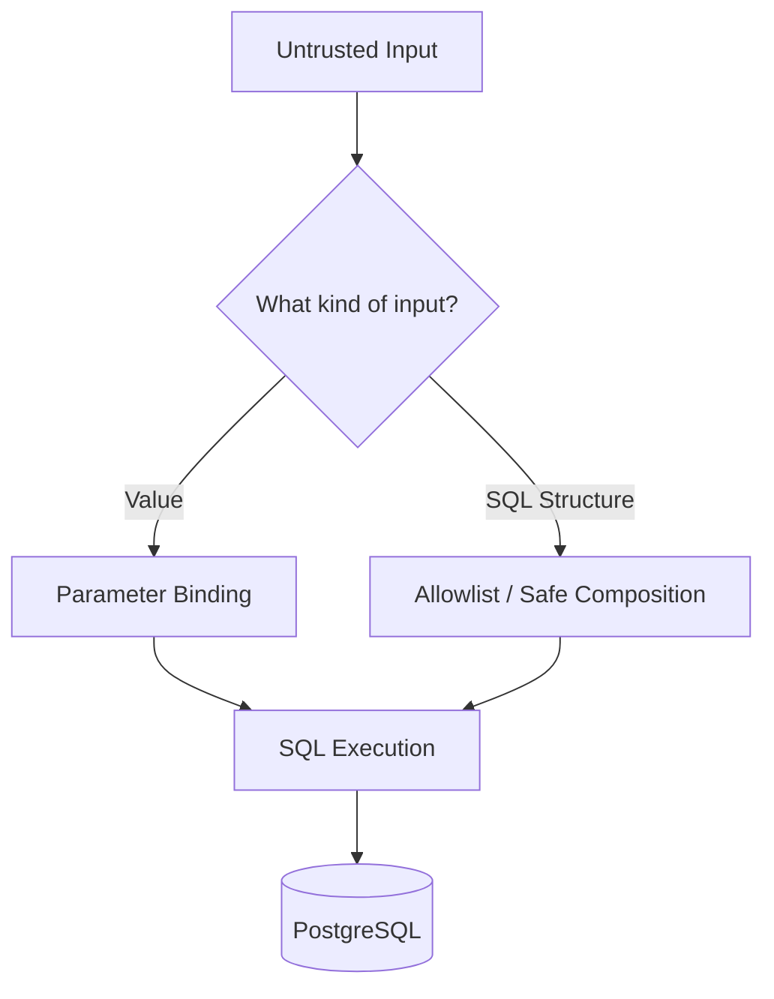
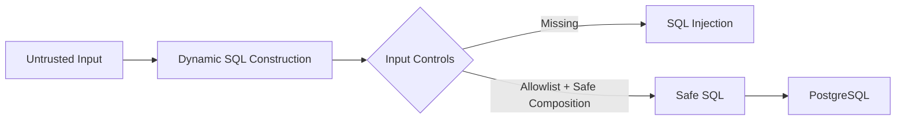

# 12- Dynamic SQL Security

## Overview

Dynamic SQL is SQL whose structure is constructed at runtime rather than being completely fixed in application code.

It is useful when applications or database functions genuinely need variable SQL structure, such as:

- Dynamic table selection
- Dynamic column selection
- Configurable sorting
- Optional filtering
- Partition-specific operations
- Administrative tooling
- Reporting systems
- Metadata-driven database operations
- PostgreSQL functions using `EXECUTE`

Dynamic SQL becomes a security risk when untrusted input is allowed to control SQL structure.

The central security rule is:

```text
Untrusted values
    → Parameterize

Dynamic SQL structure
    → Allowlist / validate / safely compose
```

Parameterized queries solve most value-based SQL injection problems, but they do not automatically make dynamic SQL safe.

---

## Why Dynamic SQL Exists

Most application queries have a stable structure:

```sql
SELECT id, email
FROM users
WHERE id = $1;
```

Only the value changes:

```text
id = 100
id = 200
id = 300
```

Parameterization handles this efficiently and safely.

Some requirements genuinely change the SQL structure:

```text
Table:
    orders
    customers

Sort column:
    created_at
    name
    email

Sort direction:
    ASC
    DESC
```

These are not ordinary SQL values.

The application therefore needs a controlled way to construct SQL structure.

---

## The Dynamic SQL Security Boundary

A useful mental model is:



The key question is not:

> "Is this input validated?"

The better question is:

> "Can this input change the SQL program itself?"

---

## Values vs SQL Structure

This distinction is fundamental.

### Values

Examples:

```text
user_id
email
status
created_at
tenant_id
search_term
limit
offset
```

These should normally be parameterized.

```sql
SELECT *
FROM users
WHERE id = $1;
```

### SQL Structure

Examples:

```text
table names
column names
sort direction
operators
SQL expressions
SQL clauses
```

These generally require controlled construction.

For example:

```python
sort_column = allowed_columns[user_input]
```

rather than:

```python
sort_column = user_input
```

---

## Unsafe Dynamic SQL

Consider:

```python
table_name = request.query_params["table"]

query = f"""
    SELECT *
    FROM {table_name}
"""
```

The user controls part of the SQL structure.

This is fundamentally different from:

```python
cursor.execute(
    """
    SELECT *
    FROM users
    WHERE id = %s
    """,
    (user_id,),
)
```

The second example keeps the value separate from SQL syntax.

---

## Why Parameterization Alone Is Not Enough

A common misconception is:

```text
"Use parameterized queries everywhere."
```

That is correct for values but incomplete for dynamic SQL.

This does not work as a general identifier substitution mechanism:

```sql
SELECT *
FROM $1;
```

because `$1` represents a value, not an arbitrary SQL identifier.

Therefore:

```text
Values
    → Parameters

Identifiers
    → Controlled SQL construction
```

---

## Dynamic `ORDER BY`

Consider an API:

```text
GET /users?sort=created_at
```

Unsafe:

```python
sort_column = request.query_params["sort"]

query = f"""
    SELECT id, email
    FROM users
    ORDER BY {sort_column}
"""
```

The client controls SQL structure.

A secure design maps external values to trusted SQL fragments:

```python
SORT_COLUMNS = {
    "name": "name",
    "created": "created_at",
    "email": "email",
}

sort_key = request.query_params.get("sort", "created")
sort_column = SORT_COLUMNS.get(sort_key, "created_at")

query = f"""
    SELECT id, email
    FROM users
    ORDER BY {sort_column}
"""
```

The client controls only:

```text
"name"
"created"
"email"
```

The actual SQL identifiers are controlled by the application.

---

## Dynamic Sort Direction

The same rule applies to `ASC` and `DESC`.

Unsafe:

```python
direction = request.query_params["direction"]

query = f"""
    SELECT *
    FROM users
    ORDER BY created_at {direction}
"""
```

Secure:

```python
SORT_DIRECTIONS = {
    "asc": "ASC",
    "desc": "DESC",
}

direction = SORT_DIRECTIONS.get(
    request.query_params.get("direction", "desc"),
    "DESC",
)
```

Then:

```python
query = f"""
    SELECT *
    FROM users
    ORDER BY created_at {direction}
"""
```

The application controls the possible SQL fragments.

---

## Dynamic Table Names

Dynamic table selection is more sensitive.

Unsafe:

```python
table_name = request.query_params["table"]

query = f"SELECT count(*) FROM {table_name}"
```

If dynamic tables are genuinely required, use:

1. A strict allowlist.
2. Identifier-aware SQL composition.
3. Minimal database privileges.

With `psycopg`:

```python
from psycopg import sql


ALLOWED_TABLES = {
    "orders",
    "customers",
}


def count_rows(conn, table_name: str) -> int:
    if table_name not in ALLOWED_TABLES:
        raise ValueError("Unsupported table")

    statement = sql.SQL(
        "SELECT count(*) FROM {}"
    ).format(
        sql.Identifier(table_name)
    )

    with conn.cursor() as cursor:
        cursor.execute(statement)
        return cursor.fetchone()[0]
```

The allowlist controls the business-level set of tables.

`sql.Identifier()` handles SQL identifier quoting.

---

## Why Identifier Quoting Alone Is Not Enough

Identifier quoting and allowlisting solve different problems.

Identifier quoting answers:

```text
"How do I safely represent this identifier in SQL?"
```

Allowlisting answers:

```text
"Should this application be allowed to reference this identifier at all?"
```

For security-sensitive dynamic SQL, prefer:

```text
Allowlist
    +
Identifier-aware composition
```

rather than relying only on quoting.

---

## Dynamic Column Names

Unsafe:

```python
column = request.query_params["column"]

query = f"""
    SELECT {column}
    FROM users
"""
```

Secure:

```python
ALLOWED_COLUMNS = {
    "id": "id",
    "email": "email",
    "created": "created_at",
}

column_key = request.query_params.get("column", "id")
column = ALLOWED_COLUMNS.get(column_key)

if column is None:
    raise ValueError("Unsupported column")
```

If raw SQL construction is required, compose the resulting identifier using the database driver's identifier mechanism.

---

## Dynamic SQL Operators

Applications sometimes expose filters such as:

```text
equals
not equals
greater than
less than
```

Do not directly accept SQL operators:

```python
operator = request.query_params["operator"]

query = f"""
    SELECT *
    FROM orders
    WHERE total {operator} %s
"""
```

Use an application-level mapping:

```python
OPERATORS = {
    "eq": "=",
    "gt": ">",
    "gte": ">=",
    "lt": "<",
    "lte": "<=",
}

operator_key = request.query_params["operator"]
operator = OPERATORS.get(operator_key)

if operator is None:
    raise ValueError("Unsupported operator")
```

The client sends:

```text
gte
```

not:

```text
>=
```

or arbitrary SQL.

---

## Dynamic WHERE Clauses

Dynamic filtering is common and does not require accepting arbitrary SQL.

For example:

```python
filters = []
params = []

if customer_id is not None:
    filters.append("customer_id = %s")
    params.append(customer_id)

if status is not None:
    filters.append("status = %s")
    params.append(status)

if created_after is not None:
    filters.append("created_at >= %s")
    params.append(created_after)

query = """
    SELECT id, customer_id, status, created_at
    FROM orders
"""

if filters:
    query += " WHERE " + " AND ".join(filters)

cursor.execute(query, params)
```

The SQL structure is generated only from fixed application-controlled fragments.

The external values remain parameters.

---

## Safe Dynamic SQL Pattern

A robust pattern is:

```text
User input
    ↓
Normalize
    ↓
Validate / allowlist
    ↓
Convert to trusted SQL fragment
    ↓
Parameterize values
    ↓
Execute
```

For example:

```text
sort=created
    ↓
Allowlist lookup
    ↓
created_at
    ↓
Trusted identifier

search=alice
    ↓
Parameter binding
    ↓
%alice%
```

Different types of input should use different controls.

---

## Allowlisting

Allowlisting means defining the complete set of acceptable values.

Example:

```python
SORT_COLUMNS = {
    "name": "name",
    "created": "created_at",
    "updated": "updated_at",
}
```

This is preferable to trying to reject dangerous strings.

### Allowlist

```text
Accept known-good values
```

### Blocklist

```text
Reject known-bad values
```

Allowlisting is generally stronger for SQL structure because the valid SQL grammar elements are known in advance.

---

## Why Blocklists Fail

A fragile approach might attempt:

```python
if "DROP" in value.upper():
    reject()
```

This is not a reliable SQL security boundary.

Problems include:

- SQL has many valid syntactic forms.
- Dangerous behavior is not limited to `DROP`.
- Context changes what is syntactically valid.
- Encodings and quoting complicate string filtering.
- A legitimate identifier may contain rejected text.
- New SQL features can invalidate assumptions.

Do not build SQL security around keyword filtering.

---

## Normalize Before Validation

When application-level allowlists are used, define a clear external representation.

For example:

```text
created
```

maps to:

```text
created_at
```

rather than allowing clients to submit:

```text
created_at
```

directly.

This gives the API a stable contract:

```text
Public API vocabulary
        ↓
Internal SQL mapping
```

The API should not expose arbitrary SQL grammar.

---

## Dynamic SQL in PostgreSQL Functions

PostgreSQL functions can execute dynamic SQL with `EXECUTE`.

Example:

```sql
EXECUTE
    'UPDATE app.orders
     SET status = $1
     WHERE id = $2'
USING new_status, order_id;
```

`USING` is the preferred mechanism for supplying dynamic values.

This keeps values separate from the SQL string.

---

## Dynamic Identifiers in PL/pgSQL

When an identifier itself must be dynamic, PL/pgSQL provides formatting mechanisms.

For example:

```sql
EXECUTE format(
    'SELECT count(*) FROM %I',
    table_name
);
```

`%I` is intended for identifiers.

For values, prefer:

```sql
EXECUTE
    'SELECT count(*)
     FROM app.orders
     WHERE customer_id = $1'
USING customer_id;
```

The distinction is important:

```text
%I
    → Identifier

USING
    → Value
```

---

## `%I`, `%L`, and `%s`

PostgreSQL's `format()` supports different formatting semantics.

Commonly relevant specifiers include:

| Specifier | Purpose | Typical use |
|---|---|---|
| `%I` | SQL identifier | Table/column names |
| `%L` | SQL literal | Literal representation |
| `%s` | String substitution | Controlled textual fragments |

For dynamic SQL values, `EXECUTE ... USING` is generally preferable to embedding values into the SQL string.

For identifiers, `%I` is appropriate when dynamic identifiers are genuinely necessary.

---

## Prefer `USING` for Dynamic Values

Instead of:

```sql
EXECUTE format(
    'SELECT *
     FROM app.orders
     WHERE customer_id = %L',
    customer_id
);
```

prefer:

```sql
EXECUTE
    'SELECT *
     FROM app.orders
     WHERE customer_id = $1'
USING customer_id;
```

This provides a clear separation between:

```text
SQL structure
+
Data value
```

and avoids unnecessary literal construction.

---

## `SECURITY DEFINER` and Dynamic SQL

Dynamic SQL becomes especially sensitive inside `SECURITY DEFINER` functions.

A `SECURITY DEFINER` function executes with the privileges of its owner.

Therefore:

```text
Application role
      ↓
SECURITY DEFINER function
      ↓
Owner privileges
      ↓
Dynamic SQL
```

A vulnerability in such a function can have significantly greater impact.

Use:

- Minimal function-owner privileges
- Restricted `EXECUTE` privileges
- Safe `search_path`
- Schema-qualified references
- Strict dynamic identifier validation
- `USING` for values

---

## Secure `search_path`

Privileged functions should avoid unsafe object resolution.

A common pattern is:

```sql
CREATE FUNCTION app.get_order_count()
RETURNS bigint
LANGUAGE plpgsql
SECURITY DEFINER
SET search_path = app, pg_temp
AS $$
BEGIN
    RETURN (
        SELECT count(*)
        FROM app.orders
    );
END;
$$;
```

The trusted schema should be controlled carefully.

For security-sensitive functions, schema-qualified object references are often preferable.

---

## Function Ownership

A `SECURITY DEFINER` function should be owned by a role that has only the privileges the function actually requires.

Avoid:

```text
Superuser
   ↓
SECURITY DEFINER function
```

when a narrower role can perform the operation.

The principle is:

```text
Function privilege
    ≈
Minimum privilege required by the operation
```

---

## Search Path Attacks

Unqualified object names can be dangerous inside privileged functions.

For example:

```sql
SELECT helper_function();
```

may resolve differently depending on the session's `search_path`.

A safer pattern is:

```sql
SELECT app.helper_function();
```

Combined with a controlled `search_path`, this reduces the possibility of unexpected object resolution.

---

## Dynamic SQL and Multi-Tenancy

Multi-tenant systems sometimes consider tenant-specific tables:

```text
orders_tenant_a
orders_tenant_b
orders_tenant_c
```

This creates dynamic table-selection requirements.

A safer architecture often prefers:

```text
orders
  └── tenant_id
```

with:

- Composite indexes
- Application authorization
- PostgreSQL RLS where appropriate
- Controlled tenant context

This avoids turning tenant identifiers into SQL identifiers.

If tenant-specific tables are required, table selection must be strictly controlled.

---

## Tenant Isolation

Do not construct:

```python
table = f"orders_{tenant_id}"
```

from arbitrary user input.

Even if the tenant ID is validated superficially, this creates unnecessary SQL structure complexity.

Prefer:

```text
Tenant ID
    ↓
Parameterized value
    ↓
orders.tenant_id
```

where the data model permits it.

---

## Dynamic SQL and Partitioning

Partitioned systems can introduce dynamic operational SQL.

For example:

```text
orders_2026_01
orders_2026_02
orders_2026_03
```

Administrative jobs may need to reference a specific partition.

This can be legitimate dynamic SQL, but partition names should come from trusted metadata or controlled server-side mappings.

Do not allow API clients to directly select arbitrary database objects.

---

## Dynamic SQL in Administrative Tools

Dynamic SQL is sometimes appropriate for:

- Schema migration tools
- Database maintenance
- Partition management
- Reporting infrastructure
- Metadata-driven administration

These workloads should generally run with separate privileges from application runtime traffic.

A useful separation is:

```text
app_runtime
    ↓
Normal application SQL

migration_role
    ↓
Schema changes

admin / maintenance role
    ↓
Controlled dynamic SQL
```

Do not give the application runtime role administrative dynamic SQL capabilities simply because an operational tool requires them.

---

## Dynamic SQL and SQL Injection

The threat model can be represented as:



The highest-risk condition is:

```text
Untrusted input
    +
Direct SQL interpolation
```

The safer condition is:

```text
Trusted SQL structure
    +
Bound values
```

---

## Dynamic SQL in Django

Django's ORM should normally be preferred over manually generated SQL.

For example:

```python
queryset = Order.objects.filter(
    status=status,
)
```

If dynamic sorting is needed:

```python
SORT_FIELDS = {
    "created": "created_at",
    "total": "total",
    "status": "status",
}

sort_key = request.query_params.get("sort", "created")
sort_field = SORT_FIELDS.get(sort_key, "created_at")

queryset = Order.objects.order_by(sort_field)
```

The API value selects from a fixed server-side mapping.

---

## Django Raw SQL

If raw SQL is necessary:

```python
from django.db import connection


with connection.cursor() as cursor:
    cursor.execute(
        """
        SELECT id, email
        FROM users
        WHERE email = %s
        """,
        [email],
    )
```

Dynamic structure should still be controlled separately.

Do not do:

```python
query = f"""
    SELECT *
    FROM {table_name}
    WHERE email = '{email}'
"""
```

This combines two different security problems:

```text
Dynamic identifier
+
Interpolated value
```

---

## FastAPI and SQLAlchemy

A FastAPI application can keep dynamic SQL structure controlled at the service/repository boundary.

For example:

```python
from sqlalchemy import select


SORT_FIELDS = {
    "created": User.created_at,
    "email": User.email,
    "name": User.name,
}

sort_key = request.sort or "created"
sort_expression = SORT_FIELDS.get(sort_key)

if sort_expression is None:
    raise ValueError("Unsupported sort field")

statement = select(User).order_by(sort_expression)
```

The external value selects an application-controlled expression.

User-provided values remain bound parameters.

---

## Repository Layer

Dynamic SQL should generally be isolated within the data-access layer.

A useful architecture is:

```text
API
 ↓
Validation
 ↓
Service
 ↓
Repository
 ├── Query structure
 └── Parameter binding
 ↓
PostgreSQL
```

This prevents SQL construction rules from being scattered throughout API handlers.

It also makes security review easier.

---

## Microservices

Each service should control the SQL structure of its own database interactions.

For example:

```text
Order Service
    ↓
Order Repository
    ↓
PostgreSQL
```

Avoid passing arbitrary SQL through service APIs:

```text
Service A
    ↓
"Execute this SQL"
    ↓
Service B
    ↓
Database
```

Service interfaces should expose business operations, not unrestricted SQL execution.

---

## gRPC and Dynamic SQL

A gRPC API should expose structured fields:

```protobuf
message OrderSearchRequest {
    string status = 1;
    string sort = 2;
}
```

The service maps:

```text
sort = "created"
    ↓
Order.created_at
```

It should not accept:

```text
sort = "created_at DESC, ..."
```

as arbitrary SQL.

The same rule applies to REST APIs.

---

## Kafka and Dynamic SQL

Event consumers should not interpret event fields as SQL structure.

Unsafe conceptual design:

```text
Kafka message
    ↓
SQL fragment
    ↓
Dynamic query
```

Prefer:

```text
Kafka message
    ↓
Validate
    ↓
Map controlled fields
    ↓
Parameterize values
    ↓
Execute
```

Messages can originate from compromised or buggy producers and should not automatically be considered trusted.

---

## Celery and Dynamic SQL

Celery tasks should follow the same rules.

For example:

```python
SORT_FIELDS = {
    "created": "created_at",
    "priority": "priority",
}

def process_report(sort_key: str):
    sort_column = SORT_FIELDS.get(sort_key)

    if sort_column is None:
        raise ValueError("Unsupported sort field")

    # Use only the trusted server-side SQL fragment.
```

The task should not accept arbitrary SQL fragments from a queue message.

---

## Dynamic SQL and Connection Pools

Connection pooling does not make dynamic SQL safe.

A vulnerable query remains vulnerable:

```text
Request
   ↓
Connection Pool
   ↓
Unsafe dynamic SQL
   ↓
PostgreSQL
```

Pooling does matter for other security concerns such as:

- Session state
- Tenant context
- Role state
- `search_path`
- Temporary objects
- Prepared statements

Privileged session state should be managed carefully in pooled environments.

---

## Dynamic SQL and RLS

RLS can provide an additional authorization boundary.

For example:

```sql
CREATE POLICY tenant_isolation
ON orders
USING (
    tenant_id = current_setting('app.tenant_id')::uuid
);
```

However, RLS should not be used as justification for unsafe dynamic SQL.

These controls solve different problems:

```text
Dynamic SQL controls
    → Prevent SQL structure manipulation

RLS
    → Restrict row visibility / modification
```

Use both where appropriate.

---

## Logging and Auditing

Dynamic SQL can be harder to audit than fixed query patterns.

Monitor:

- Unexpected SQL errors
- Unexpected object access
- Privileged function execution
- Database permission failures
- Abnormal query patterns
- Administrative operations
- Query latency changes

Avoid logging secrets or sensitive parameter values merely to make SQL debugging easier.

---

## Performance Considerations

Dynamic SQL can affect performance in several ways:

- More query shapes can reduce statement reuse.
- Dynamic SQL may require repeated parsing/planning.
- Different query structures may produce different plans.
- Complex query generation increases application overhead.
- Large dynamic statements can increase parsing cost.

Prefer stable query shapes when possible.

For example:

```text
Preferred:
SELECT ... WHERE status = $1

Instead of:
SELECT ... WHERE status = 'pending'
SELECT ... WHERE status = 'completed'
SELECT ... WHERE status = 'failed'
```

Parameterization keeps the query structure stable.

---

## Query Plan Stability

Dynamic SQL can intentionally produce different query structures.

This can be useful when the difference is meaningful:

```text
Small result set
    → Targeted query

Large result set
    → Different query strategy
```

But dynamic SQL should not be used merely to avoid understanding query planning.

Use:

```sql
EXPLAIN (ANALYZE, BUFFERS)
```

to measure actual behavior.

---

## Dynamic SQL and Caching

Dynamic query generation can affect application and database caching behavior.

If every request generates a structurally different query:

```text
Query A
Query B
Query C
Query D
...
```

statement reuse becomes less effective.

Prefer:

```text
Stable SQL structure
+
Bound values
```

where possible.

---

## Security and Least Privilege

Dynamic SQL is particularly dangerous when the executing role has broad privileges.

For example:

```text
Dynamic SQL
    +
SUPERUSER
    ↓
Very large blast radius
```

A restricted role provides defense in depth:

```text
Dynamic SQL vulnerability
    ↓
Restricted database role
    ↓
Reduced possible impact
```

Use separate roles for:

- Application runtime
- Migrations
- Reporting
- Administration

---

## High Availability Considerations

Dynamic SQL security controls should remain consistent across primary and failover databases.

Verify that:

- Roles exist with correct privileges.
- Functions retain correct ownership.
- RLS policies are present.
- Schema permissions are consistent.
- Privileged functions remain restricted.
- Failover does not introduce a more privileged fallback account.

A failover should not change the security boundary.

---

## Disaster Recovery Considerations

Backups and restored environments should preserve:

- Database roles
- Grants
- Ownership
- Functions
- RLS policies
- Schemas
- Required security configuration

Test restored environments using the same runtime role.

A DR database that only works when the application uses an administrative account is a security and operational failure.

---

## CI/CD Security

Dynamic SQL should be reviewed as part of code changes.

CI pipelines should include:

- Static analysis
- Unit tests
- Integration tests
- Migration tests
- Security regression tests

Code review should specifically flag:

```text
f"..."
.format(...)
string concatenation
raw SQL
EXECUTE
format(...)
dynamic identifiers
SECURITY DEFINER
```

These are not automatically vulnerabilities, but they are useful review boundaries.

---

## Production Testing

Test dynamic SQL with:

- Valid allowlisted values
- Invalid values
- Unknown values
- Unexpected casing
- Empty values
- Boundary values
- Malformed identifiers
- Unauthorized object names

The desired behavior is:

```text
Invalid structure
    ↓
Rejected before execution
```

and:

```text
Valid external value
    ↓
Mapped to trusted SQL structure
```

---

## Production Review Procedure

For every dynamic SQL path:

1. Identify every input that influences SQL.
2. Classify each input as value or SQL structure.
3. Parameterize all values.
4. Allowlist structural choices.
5. Use identifier-aware composition where necessary.
6. Review privileged functions.
7. Review database role privileges.
8. Test invalid inputs.
9. Inspect query execution behavior.
10. Monitor production usage.

This makes dynamic SQL review systematic rather than dependent on spotting individual dangerous strings.

---

## Production Checklist

- [ ] SQL values use parameter binding.
- [ ] User input is never directly interpolated into SQL values.
- [ ] Dynamic table names use strict allowlists.
- [ ] Dynamic column names use strict allowlists.
- [ ] Dynamic sort fields use fixed mappings.
- [ ] Dynamic sort directions use fixed mappings.
- [ ] Dynamic operators use fixed mappings.
- [ ] Arbitrary SQL fragments are never accepted from clients.
- [ ] PostgreSQL `EXECUTE` uses `USING` for values.
- [ ] Dynamic identifiers use appropriate identifier quoting/composition.
- [ ] `SECURITY DEFINER` functions are reviewed separately.
- [ ] Privileged functions use controlled `search_path`.
- [ ] Sensitive function references are schema-qualified where appropriate.
- [ ] Function owners have minimum required privileges.
- [ ] Runtime database roles follow least privilege.
- [ ] Application authorization is independent of SQL construction.
- [ ] RLS is used where row-level isolation requires it.
- [ ] Background workers follow the same dynamic SQL rules.
- [ ] Kafka messages are not treated as trusted SQL.
- [ ] Celery task arguments are validated.
- [ ] Dynamic SQL is isolated in repository/data-access code.
- [ ] Static analysis covers common unsafe construction patterns.
- [ ] Security regression tests cover dynamic query paths.
- [ ] Query performance is measured with real workloads.
- [ ] HA and DR environments preserve database security configuration.

---

## Common Mistakes

### Interpolating User Input into Identifiers

```python
query = f"SELECT * FROM {table_name}"
```

**Problem:** The user controls SQL structure.

**Better:** Strict allowlist plus identifier-aware composition.

### Using a Blocklist

```python
if "DROP" in value.upper():
    reject()
```

**Problem:** SQL syntax cannot be reliably secured by keyword filtering.

**Better:** Allow only known-valid structural choices.

### Using Parameters for Identifiers

```sql
SELECT *
FROM $1;
```

**Problem:** Ordinary parameters represent values, not arbitrary identifiers.

**Better:** Use controlled identifier composition.

### Using `format()` for Values in PL/pgSQL

```sql
EXECUTE format(
    'SELECT * FROM orders WHERE customer_id = %L',
    customer_id
);
```

**Problem:** Values are unnecessarily embedded into the SQL string.

**Better:**

```sql
EXECUTE
    'SELECT * FROM orders WHERE customer_id = $1'
USING customer_id;
```

### Trusting Kafka or Celery Input

**Problem:** Internal messages may contain externally derived or compromised data.

**Better:** Validate and safely map all structural choices.

### Giving Dynamic SQL Administrative Privileges

**Problem:** A vulnerability can become a database-wide compromise.

**Better:** Execute application dynamic SQL with the minimum required role.

### Treating `SECURITY DEFINER` as Automatically Safe

**Problem:** The function executes with elevated privileges.

**Better:** Restrict execution, control ownership, secure `search_path`, and minimize dynamic SQL.

### Building Tenant-Specific Table Names from User Input

```python
table = f"orders_{tenant_id}"
```

**Problem:** Tenant data becomes SQL structure.

**Better:** Prefer shared tables with `tenant_id` and appropriate indexing/RLS when suitable.

---

## Interview Traps

### What is dynamic SQL?

SQL whose structure is constructed at runtime rather than being entirely fixed ahead of execution.

### Why is dynamic SQL dangerous?

Because untrusted input can become SQL syntax instead of remaining a data value.

### Can parameterized queries solve all dynamic SQL problems?

No. Parameterization protects values. Dynamic identifiers and other SQL structure require allowlisting and safe composition.

### How should dynamic table names be handled?

Use a strict allowlist and an identifier-aware SQL composition mechanism. Avoid accepting arbitrary table names from clients.

### How should dynamic `ORDER BY` fields be handled?

Map application-level values such as `created` or `name` to fixed server-side SQL identifiers.

### What is the difference between `%I` and `USING` in PostgreSQL dynamic SQL?

`%I` is used for SQL identifiers in `format()`. `USING` supplies values separately to `EXECUTE`.

### Why is `EXECUTE ... USING` preferable for values?

It keeps values separate from the dynamically constructed SQL text and avoids unnecessary literal construction.

### Why is `SECURITY DEFINER` relevant?

A `SECURITY DEFINER` function runs with its owner's privileges, so unsafe dynamic SQL inside it can have a much larger security impact.

### Is identifier quoting enough?

Not always. Quoting protects SQL syntax representation, while allowlisting controls whether the application should be permitted to reference the identifier at all.

### Should applications accept arbitrary SQL through APIs?

No. APIs should expose business-level operations and controlled query options, not arbitrary SQL execution.

### Is dynamic SQL always bad?

No. Dynamic SQL is legitimate for cases such as administration, reporting, partition management, and metadata-driven operations. The requirement is that its structure be controlled and its values parameterized.

### What is the senior-level approach to dynamic SQL security?

Classify every input as either data or SQL structure, parameterize data, strictly allowlist structural choices, use identifier-aware composition where required, minimize database privileges, secure privileged functions, and review the complete application-to-database execution path.

## Key Takeaways

- **Dynamic SQL is not inherently insecure**, but untrusted input must never be allowed to directly control SQL structure.
- **Parameterize values and separately control SQL structure** using strict allowlists and identifier-aware composition.
- **PostgreSQL `EXECUTE ... USING` is the preferred pattern for dynamic values**, while mechanisms such as `%I` are appropriate for controlled dynamic identifiers.
- **Privileged dynamic SQL requires defense in depth**: minimize role privileges, secure `SECURITY DEFINER` functions, control `search_path`, and use RLS where appropriate.
- **Production systems should isolate and systematically review dynamic SQL**, including REST/gRPC APIs, Django/FastAPI repositories, Kafka/Celery workers, migrations, administrative tooling, CI/CD, HA, and DR.