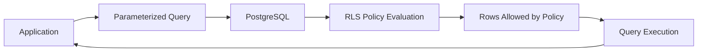
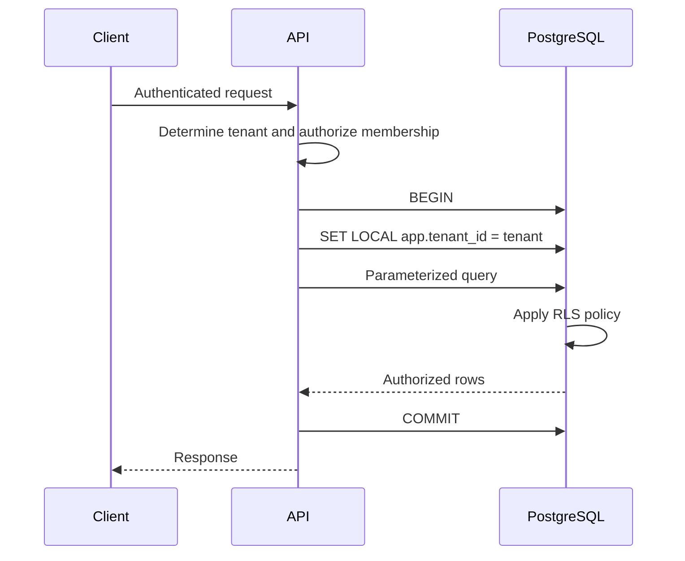
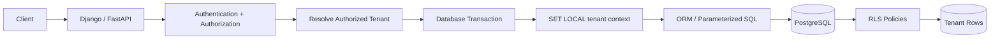

# 13- Row Level Security

## Overview

Row Level Security (RLS) is a database-level authorization mechanism that restricts which rows a database role can access or modify.

Instead of relying entirely on application code:

```text
Application
    ↓
WHERE tenant_id = current_tenant
    ↓
PostgreSQL
```

RLS allows PostgreSQL itself to enforce row visibility and modification rules:

```text
Application
    ↓
Database role + session context
    ↓
PostgreSQL RLS policy
    ↓
Only authorized rows
```

This is particularly valuable for:

- Multi-tenant SaaS applications
- Shared database/shared schema architectures
- User-owned resources
- Tenant isolation
- Defense-in-depth authorization
- Database-access layers shared by multiple services

RLS does not replace application authorization. It provides another enforcement boundary closer to the data.

---

## Why Row Level Security Exists

Application-level authorization often looks like:

```sql
SELECT *
FROM orders
WHERE tenant_id = $1;
```

The security of the operation depends on every query remembering the tenant predicate.

A missed filter can become a data-isolation vulnerability:

```text
Correct query
    → WHERE tenant_id = current_tenant

Incorrect query
    → SELECT * FROM orders
```

RLS changes the architecture:

```text
Application query
    ↓
PostgreSQL
    ↓
RLS policy
    ↓
Authorized rows only
```

The application can still include explicit tenant predicates for performance and clarity, but the database provides an additional enforcement boundary.

---

## What RLS Controls

RLS policies can control row visibility and modification.

Typical operations include:

- `SELECT`
- `INSERT`
- `UPDATE`
- `DELETE`

For example:

```text
Tenant A
   ↓
orders
   ↓
RLS
   ↓
Only Tenant A rows

Tenant B
   ↓
orders
   ↓
RLS
   ↓
Only Tenant B rows
```

The policy determines which rows are visible or which new/updated rows are permitted.

---

## RLS vs Table Privileges

These are separate security layers.

Table privileges answer:

```text
Can this role access the table?
```

RLS answers:

```text
Which rows can this role access?
```

For example:

```text
GRANT SELECT ON orders TO app_runtime;
```

allows the role to access the table.

An RLS policy can then restrict the rows that role can actually see.

Conceptually:

```text
Table privilege
      ↓
Can access table
      ↓
RLS policy
      ↓
Can access permitted rows
```

A role needs the required table privileges before RLS can provide row-level filtering.

---

## Enabling RLS

Suppose the table contains:

```sql
CREATE TABLE orders (
    id bigint PRIMARY KEY,
    tenant_id uuid NOT NULL,
    customer_id bigint NOT NULL,
    total numeric(12, 2) NOT NULL,
    status text NOT NULL
);
```

Enable RLS:

```sql
ALTER TABLE orders ENABLE ROW LEVEL SECURITY;
```

Once enabled, applicable roles are subject to the table's RLS policies.

If no applicable policy permits an operation, access is denied according to PostgreSQL's default-deny behavior.

---

## Basic Tenant Isolation Policy

A common pattern is:

```sql
ALTER TABLE orders ENABLE ROW LEVEL SECURITY;

CREATE POLICY tenant_isolation
ON orders
USING (
    tenant_id = current_setting('app.tenant_id')::uuid
);
```

The policy says that rows are visible only when:

```text
orders.tenant_id
    =
current tenant context
```

The application still uses parameterized queries:

```sql
SELECT id, total, status
FROM orders
WHERE id = $1;
```

RLS adds the row-level restriction.

---

## How RLS Changes Query Execution

A simplified flow is:



The exact internal implementation is more nuanced because policy expressions are incorporated into query processing, but the architectural principle is:

```text
Application query
+
RLS policy
=
Effective row access
```

---

## `USING` vs `WITH CHECK`

These are two important RLS concepts.

### `USING`

`USING` controls which existing rows are visible or eligible for operations such as:

```text
SELECT
UPDATE
DELETE
```

For example:

```sql
USING (
    tenant_id = current_setting('app.tenant_id')::uuid
)
```

### `WITH CHECK`

`WITH CHECK` controls which new row values are allowed for:

```text
INSERT
UPDATE
```

Example:

```sql
WITH CHECK (
    tenant_id = current_setting('app.tenant_id')::uuid
)
```

The distinction is critical for preventing a tenant from inserting or changing a row so that it belongs to another tenant.

---

## Secure Tenant Policy

A stronger policy explicitly defines both:

```sql
CREATE POLICY tenant_orders
ON orders
USING (
    tenant_id = current_setting('app.tenant_id')::uuid
)
WITH CHECK (
    tenant_id = current_setting('app.tenant_id')::uuid
);
```

This provides:

```text
Read existing rows
    → Current tenant only

Create/update rows
    → Must belong to current tenant
```

---

## Why `WITH CHECK` Matters

Consider:

```sql
UPDATE orders
SET tenant_id = 'another-tenant'
WHERE id = $1;
```

A policy that only considers visibility may not fully express the intended modification boundary.

`WITH CHECK` provides an explicit rule for the resulting row.

The security model becomes:

```text
USING
    → Which rows can be targeted

WITH CHECK
    → Which resulting rows are allowed
```

---

## Policy for SELECT

For read-only access:

```sql
CREATE POLICY tenant_orders_select
ON orders
FOR SELECT
USING (
    tenant_id = current_setting('app.tenant_id')::uuid
);
```

This restricts rows returned to the current tenant.

---

## Policy for INSERT

For inserts:

```sql
CREATE POLICY tenant_orders_insert
ON orders
FOR INSERT
WITH CHECK (
    tenant_id = current_setting('app.tenant_id')::uuid
);
```

The inserted row must contain the current tenant identifier.

---

## Policy for UPDATE

A typical update policy can define both sides:

```sql
CREATE POLICY tenant_orders_update
ON orders
FOR UPDATE
USING (
    tenant_id = current_setting('app.tenant_id')::uuid
)
WITH CHECK (
    tenant_id = current_setting('app.tenant_id')::uuid
);
```

This prevents a tenant from updating rows outside its scope and prevents it from changing an authorized row into a row belonging to another tenant.

---

## Policy for DELETE

```sql
CREATE POLICY tenant_orders_delete
ON orders
FOR DELETE
USING (
    tenant_id = current_setting('app.tenant_id')::uuid
);
```

The role can delete only rows belonging to the current tenant context.

---

## Policy Types

Policies can be defined for:

```text
SELECT
INSERT
UPDATE
DELETE
```

or for all applicable commands:

```sql
CREATE POLICY tenant_orders
ON orders
FOR ALL
USING (
    tenant_id = current_setting('app.tenant_id')::uuid
)
WITH CHECK (
    tenant_id = current_setting('app.tenant_id')::uuid
);
```

`FOR ALL` is convenient but should not be used blindly.

Separate policies are often easier to audit when read and write permissions have different business rules.

---

## Separate Policies vs `FOR ALL`

| Approach | Advantage | Limitation |
|---|---|---|
| Separate policies | Explicit per-operation rules | More configuration |
| `FOR ALL` | Simple and compact | Can hide operation-specific differences |
| Mixed policies | Precise security model | More complex to reason about |

For sensitive multi-tenant systems, explicit policies can make security reviews easier.

---

## Session Context

The example policy uses:

```sql
current_setting('app.tenant_id')
```

The application must establish the tenant context before executing tenant-scoped queries.

For example:

```sql
SET LOCAL app.tenant_id = '00000000-0000-0000-0000-000000000001';
```

`SET LOCAL` makes the setting transaction-scoped.

This is particularly important with connection pooling.

---

## Why `SET LOCAL` Matters with Connection Pools

Consider:

```text
Request A
    ↓
Connection 1
    ↓
tenant_id = Tenant A

Connection returned to pool

Request B
    ↓
Connection 1
    ↓
Tenant context must not remain Tenant A
```

Session-level state can persist beyond a request.

Using transaction-scoped state:

```sql
SET LOCAL app.tenant_id = '...';
```

reduces the risk of tenant context leaking between requests.

The transaction should encompass the database operations that rely on that context.

---

## Application Request Lifecycle

A secure request can follow:



The application determines the tenant context.

PostgreSQL enforces row visibility.

---

## Tenant Context Must Come from a Trusted Source

Do not blindly trust:

```text
X-Tenant-ID
```

or:

```text
?tenant_id=...
```

The client may attempt:

```text
Authenticated user
    ↓
Requests Tenant B
```

The application must first establish:

```text
Authenticated identity
        ↓
Tenant membership / authorization
        ↓
Authorized tenant context
        ↓
SET LOCAL
```

RLS should not be used to compensate for incorrect tenant selection.

---

## Authentication vs Tenant Context

These are separate concerns.

```text
Authentication
    ↓
Who is the caller?

Authorization
    ↓
What may the caller do?

Tenant context
    ↓
Which tenant scope applies?

RLS
    ↓
Which rows may the database expose?
```

A secure architecture establishes all four correctly.

---

## Django Integration

Django can use PostgreSQL RLS, but Django's ORM does not automatically provide a complete RLS abstraction for every use case.

A common architecture is:

```text
Django middleware
    ↓
Authentication
    ↓
Tenant resolution
    ↓
Service / transaction
    ↓
SET LOCAL app.tenant_id
    ↓
Django ORM
    ↓
PostgreSQL RLS
```

The application should establish tenant context inside the same transaction used for the tenant-scoped queries.

---

## Django Transaction Example

Conceptually:

```python
from django.db import connection, transaction


def run_for_tenant(tenant_id):
    with transaction.atomic():
        with connection.cursor() as cursor:
            cursor.execute(
                "SET LOCAL app.tenant_id = %s",
                [str(tenant_id)],
            )

        # Tenant-scoped ORM operations occur inside this transaction.
        return list(
            Order.objects.filter(status="pending")
        )
```

The exact integration should be designed around the application's transaction and middleware architecture.

The critical property is:

```text
SET LOCAL
    +
Tenant-scoped database operations
    +
Same transaction
```

---

## FastAPI Integration

A FastAPI application using SQLAlchemy can establish tenant context within a transaction.

Conceptually:

```python
from sqlalchemy import text


def set_tenant_context(session, tenant_id):
    session.execute(
        text(
            "SELECT set_config('app.tenant_id', :tenant_id, true)"
        ),
        {"tenant_id": str(tenant_id)},
    )
```

The third argument to `set_config` is `true`, meaning the setting is local to the current transaction.

Tenant-scoped queries should execute in that same transaction.

---

## Why Not Use `SET` with Pooled Connections?

A session-level:

```sql
SET app.tenant_id = 'tenant-a';
```

can persist on the database connection after the request completes.

With pooling:

```text
Request A
    ↓
SET tenant A
    ↓
Connection returned

Request B
    ↓
Same connection
    ↓
Potential stale tenant context
```

This can become a severe tenant-isolation vulnerability.

Prefer transaction-scoped context such as:

```sql
SET LOCAL app.tenant_id = '...';
```

or:

```sql
SELECT set_config('app.tenant_id', '...', true);
```

when appropriate.

---

## RLS and Connection Pooling

RLS requires careful connection management.

A production pool should ensure:

- Tenant context is transaction-scoped.
- Transactions are always completed.
- Connections are returned cleanly.
- Session state is not leaked.
- Failed transactions are rolled back.
- Application code cannot accidentally reuse another tenant's context.

Connection pooling improves scalability but makes session-state management more important.

---

## RLS and Read Replicas

RLS policies are database objects and should exist consistently on databases used for the workload.

However, read replicas are normally intended for read workloads and receive replicated schema changes through the database replication mechanism.

Applications should still route requests according to the intended consistency model:

```text
Write
  ↓
Primary

Tenant read
  ↓
Replica
  ↓
RLS
```

If read-after-write consistency is required, replica lag must be considered separately from RLS.

---

## RLS and Redis

Redis caches can bypass PostgreSQL RLS if the application caches data without tenant-aware isolation.

For example, this cache key is dangerous:

```text
order:123
```

if the same key can be requested by multiple tenants.

Prefer tenant-scoped cache keys where appropriate:

```text
tenant:{tenant_id}:order:{order_id}
```

RLS protects PostgreSQL.

It does not automatically protect data stored in Redis.

---

## RLS and Kafka

Kafka events may contain tenant identifiers:

```json
{
  "tenant_id": "...",
  "order_id": "...",
  "event_type": "order.created"
}
```

Consumers should validate and authorize the tenant context before writing to the database.

A common flow is:

```text
Kafka
  ↓
Consumer
  ↓
Validate event
  ↓
Set tenant context
  ↓
Database transaction
  ↓
RLS
```

RLS can provide defense in depth, but event authorization remains an application responsibility.

---

## RLS and Celery

Background workers require the same discipline.

A task should establish tenant context before tenant-scoped database operations.

For example:

```text
Celery task
    ↓
Trusted tenant identifier
    ↓
Database transaction
    ↓
SET LOCAL app.tenant_id
    ↓
Tenant-scoped queries
```

Do not rely on an HTTP request's session state being available inside a worker.

---

## RLS and Microservices

In a database-per-service architecture:

```text
Order Service
    ↓
Order DB
```

RLS can protect tenant rows inside the service database.

Each service should still use:

- Its own database role
- Its own authorization rules
- Appropriate tenant context
- Parameterized queries

Do not use RLS as a replacement for service-level authorization.

---

## RLS with Shared Database Architecture

RLS is particularly useful for:

```text
Shared Database
    +
Shared Schema
    +
tenant_id
```

Example:

```text
orders
customers
invoices
payments
```

Each row contains:

```text
tenant_id
```

and policies enforce tenant isolation.

This can provide stronger isolation than relying solely on application developers remembering tenant filters.

---

## RLS vs Separate Schemas

Two common multi-tenant approaches are:

### Shared Schema + RLS

```text
orders
    tenant_id
customers
    tenant_id
```

### Schema Per Tenant

```text
tenant_a.orders
tenant_a.customers

tenant_b.orders
tenant_b.customers
```

| Model | RLS | Operational complexity | Isolation |
|---|---|---:|---|
| Shared schema | Strong fit | Lower | Logical |
| Schema per tenant | Optional | Higher | Stronger structural separation |
| Database per tenant | Usually unnecessary for row isolation | Highest | Strongest |

RLS is particularly valuable when many tenants share tables.

---

## RLS vs Database Per Tenant

RLS does not provide the same isolation boundary as separate databases.

With RLS:

```text
Tenant A
Tenant B
Tenant C
    ↓
Same database
Same tables
```

With database-per-tenant:

```text
Tenant A → Database A
Tenant B → Database B
Tenant C → Database C
```

Database-per-tenant can provide stronger isolation but increases:

- Provisioning complexity
- Connection management
- Migrations
- Backup management
- Monitoring
- Cost

RLS is often a better fit when logical tenant isolation is sufficient.

---

## RLS and Table Ownership

PostgreSQL role privileges require careful consideration around RLS.

Table owners normally bypass RLS policies unless the table is configured with:

```sql
ALTER TABLE orders FORCE ROW LEVEL SECURITY;
```

This matters because an application role that owns the table may not experience RLS in the same way as an ordinary application role.

Avoid making the runtime application role the owner of production tables when a separate owner/migration role can be used.

---

## `FORCE ROW LEVEL SECURITY`

For example:

```sql
ALTER TABLE orders ENABLE ROW LEVEL SECURITY;
ALTER TABLE orders FORCE ROW LEVEL SECURITY;
```

`FORCE ROW LEVEL SECURITY` causes the table owner to be subject to RLS as well.

This can be useful when strong enforcement is required, but it should be introduced deliberately because administrative and migration operations may need different access patterns.

Superusers and roles with the `BYPASSRLS` attribute can bypass RLS.

---

## `BYPASSRLS`

A role can have the PostgreSQL role attribute:

```text
BYPASSRLS
```

Such a role can bypass row-level security.

This is highly privileged.

Do not grant `BYPASSRLS` to ordinary application roles.

A practical role separation is:

```text
app_runtime
    ↓
No BYPASSRLS

migration_role
    ↓
Controlled elevated privileges

admin
    ↓
Explicit administrative access
```

---

## RLS and `PUBLIC`

RLS does not replace PostgreSQL role privileges.

Be careful with:

```sql
GRANT ... TO PUBLIC;
```

because `PUBLIC` means all roles.

A secure design should explicitly determine:

```text
Who can connect?
Who can access the schema?
Who can access the table?
Which rows can they access?
```

---

## Multiple Policies

PostgreSQL can have multiple policies on the same table.

For example:

```text
Tenant policy
+
Role policy
+
Department policy
```

The resulting behavior can become difficult to reason about.

Policy combinations have PostgreSQL-specific semantics, including permissive and restrictive policies.

For sensitive systems, keep policies understandable and test the effective behavior for every important role.

---

## Permissive vs Restrictive Policies

PostgreSQL policies can be:

```sql
AS PERMISSIVE
```

or:

```sql
AS RESTRICTIVE
```

Conceptually:

```text
Permissive policies
    → Alternative allowed conditions

Restrictive policies
    → Additional restrictions
```

For example:

```text
Tenant condition
    AND
Department condition
```

can express layered access controls.

Do not assume that adding multiple policies always means simple `AND` behavior. Understand the policy combination semantics before designing complex authorization models.

---

## RLS and Application Authorization

RLS should not contain every business rule.

A useful division is:

```text
Application
    → Authentication
    → Business authorization
    → Tenant selection

Database
    → Row-level isolation
    → Data integrity
    → Defense in depth
```

For example:

```text
Can user approve an order?
    → Application business authorization

Can this query access another tenant's order?
    → RLS
```

This separation keeps database policies manageable.

---

## RLS and Business Rules

Avoid turning complex business workflows into enormous RLS policies.

For example:

```text
Can manager approve refund?
Can finance override refund?
Can support cancel order?
Can customer edit order?
```

These are often better represented in application authorization logic.

RLS should generally enforce stable data-access boundaries such as:

```text
Tenant isolation
User ownership
Organization membership
```

---

## User-Owned Data

RLS is also useful outside multi-tenancy.

For example:

```sql
CREATE POLICY user_documents
ON documents
FOR SELECT
USING (
    owner_id = current_setting('app.user_id')::uuid
);
```

This can enforce:

```text
User A → User A documents
User B → User B documents
```

The same session-context concerns apply.

---

## Organization Membership

Some systems have:

```text
User
    ↓
Organization
    ↓
Resource
```

The policy can use membership relationships, but complex policy queries can become expensive.

For example:

```sql
USING (
    EXISTS (
        SELECT 1
        FROM organization_memberships m
        WHERE m.organization_id = documents.organization_id
          AND m.user_id = current_setting('app.user_id')::uuid
    )
)
```

This can be appropriate, but indexing and query-plan behavior must be evaluated carefully.

---

## RLS Performance

RLS adds policy predicates to database operations.

Performance therefore depends on:

- Policy complexity
- Indexes
- Tenant distribution
- Query shape
- Number of policy checks
- Joins inside policy expressions
- Statistics
- Connection context

A simple policy:

```sql
tenant_id = current_setting('app.tenant_id')::uuid
```

is generally easier to optimize than a complex policy involving multiple joins.

---

## Indexing for RLS

If RLS filters by:

```sql
tenant_id
```

the workload often benefits from indexes aligned with tenant access patterns.

For example:

```sql
CREATE INDEX orders_tenant_created_idx
ON orders (tenant_id, created_at DESC);
```

This can support queries such as:

```sql
SELECT id, status, created_at
FROM orders
WHERE tenant_id = $1
ORDER BY created_at DESC
LIMIT 50;
```

Even when RLS supplies the security restriction, application query predicates and indexes still matter for performance.

---

## RLS and Query Planning

Use:

```sql
EXPLAIN (ANALYZE, BUFFERS)
```

to investigate RLS-enabled queries.

Consider:

```text
Application predicate
+
RLS predicate
+
Indexes
+
Statistics
```

when interpreting plans.

Do not optimize RLS solely by looking at application SQL without understanding the policy expressions.

---

## RLS and Large Tenants

A shared-schema multi-tenant database can have highly uneven tenant sizes.

For example:

```text
Tenant A → 100 rows
Tenant B → 10 million rows
```

RLS still enforces isolation, but the large tenant can create:

- Hot partitions
- Large index ranges
- Higher query latency
- Noisy-neighbor effects

RLS should therefore be combined with:

- Tenant-aware indexes
- Query limits
- Rate limiting
- Resource quotas
- Partitioning where appropriate
- Tenant placement or sharding at larger scale

---

## RLS and Partitioning

For very large multi-tenant tables, partitioning may complement RLS.

Possible architecture:

```text
orders
   ↓
Partitions
   ├── tenant / hash partition
   ├── tenant / hash partition
   └── tenant / hash partition
```

RLS remains an authorization layer.

Partitioning is primarily a storage and query-performance strategy.

Do not confuse:

```text
RLS
    → Security boundary

Partitioning
    → Data organization / performance
```

---

## RLS and Sharding

At larger scale:

```text
Application
    ↓
Tenant routing
    ↓
Shard
    ↓
RLS
```

RLS can still provide defense in depth within each shard.

However, shard routing itself must be trusted.

An application should not let a user select an arbitrary shard merely by supplying a shard identifier.

---

## RLS and Caching

Caching can accidentally bypass database authorization.

Unsafe architecture:

```text
Request
   ↓
Redis
   ↓
Return cached object
```

If the cache key does not include authorization or tenant scope, data can cross boundaries even though PostgreSQL RLS is perfectly configured.

The security model must therefore cover:

```text
Database
+
Cache
+
Search
+
Object storage
+
Events
```

not only PostgreSQL.

---

## RLS and Search Systems

If tenant data is indexed in Elasticsearch/OpenSearch or another search system, PostgreSQL RLS does not automatically apply there.

The application must include tenant authorization in search queries or maintain separate indexes/partitions as appropriate.

RLS protects PostgreSQL rows.

It does not propagate automatically to external systems.

---

## RLS and Object Storage

Similarly:

```text
PostgreSQL RLS
```

does not protect:

```text
S3 objects
```

A secure architecture must separately authorize object access.

Tenant-scoped object keys can help:

```text
tenants/{tenant_id}/orders/{order_id}/invoice.pdf
```

but object-store authorization must still be enforced.

---

## RLS and Audit Logging

For sensitive systems, audit important operations:

```text
tenant
user
operation
resource
timestamp
result
```

Do not log sensitive data unnecessarily.

A useful audit event may contain:

```text
tenant_id
user_id
order_id
operation = UPDATE
result = SUCCESS
```

rather than entire row contents.

---

## RLS and Database Roles

A common production role architecture is:

```text
db_owner
    ↓
Owns database objects

migration_role
    ↓
Schema changes

app_runtime
    ↓
Normal application operations
    ↓
Subject to RLS

app_readonly
    ↓
Read-only workload
    ↓
Subject to RLS
```

The runtime role should not have:

```text
SUPERUSER
BYPASSRLS
```

or unnecessary administrative privileges.

---

## RLS and Migrations

Schema migrations may need elevated permissions.

For example:

```text
Migration
    ↓
ALTER TABLE
CREATE POLICY
ALTER POLICY
CREATE INDEX
```

Do not give these privileges to the normal runtime role merely because the migration framework needs them.

Use a dedicated migration role.

---

## Deployment Strategy

When introducing RLS to an existing production table:

```text
Existing application
        ↓
Add tenant data validation
        ↓
Add indexes
        ↓
Create policies
        ↓
Test policies
        ↓
Enable RLS
        ↓
Observe
```

Avoid enabling RLS blindly on a large production table without first verifying that every legitimate application path has the required tenant context.

---

## Expand-and-Contract Migration

For an existing application, a safer rollout may be:

1. Ensure every relevant row has a valid tenant identifier.
2. Add required indexes.
3. Create policies.
4. Test policies using non-production roles.
5. Update application code to establish tenant context.
6. Deploy the application.
7. Enable RLS.
8. Monitor errors and query performance.
9. Remove obsolete application assumptions if appropriate.

This reduces deployment risk.

---

## Testing RLS

Test each important database role.

For example:

```text
Tenant A
    ↓
Can read Tenant A

Tenant A
    ↓
Cannot read Tenant B

Tenant A
    ↓
Cannot update Tenant B

Tenant A
    ↓
Cannot insert Tenant B row
```

Also test:

```text
Missing tenant context
Invalid tenant context
Expired authorization
Admin role
Migration role
Read-only role
Background worker
```

---

## Testing as Different Roles

Testing RLS with a privileged database account can produce misleading results.

Use the same role that production application code uses.

For example:

```sql
SET ROLE app_runtime;
```

Then execute representative queries.

Also inspect:

```sql
SELECT current_user;
SELECT session_user;
```

to verify the effective database identity.

---

## Inspecting RLS Policies

PostgreSQL catalog information can be used to inspect policies.

For example:

```sql
SELECT
    schemaname,
    tablename,
    policyname,
    permissive,
    roles,
    cmd,
    qual,
    with_check
FROM pg_policies
WHERE tablename = 'orders';
```

This is useful for auditing policy configuration.

---

## Checking RLS Status

Inspect table configuration:

```sql
SELECT
    relname,
    relrowsecurity,
    relforcerowsecurity
FROM pg_class
WHERE relname = 'orders';
```

This helps verify:

```text
RLS enabled?
RLS forced for owner?
```

---

## Security Review

For every RLS-protected table, ask:

- Is RLS enabled?
- Is `FORCE ROW LEVEL SECURITY` required?
- Which roles are subject to RLS?
- Can any role bypass RLS?
- Where does tenant context come from?
- Is tenant context transaction-scoped?
- Can a client choose an unauthorized tenant?
- Are `USING` and `WITH CHECK` both correct?
- Are policies permissive or restrictive?
- Are multiple policies interacting?
- Are external caches protected?
- Are background workers setting context?
- Are privileged functions involved?

---

## Common Mistakes

### Enabling RLS Without a Policy

**Problem:**

```sql
ALTER TABLE orders ENABLE ROW LEVEL SECURITY;
```

but legitimate roles have no policy.

**Result:** Access can be denied unexpectedly.

**Better:** Create and test appropriate policies before enabling enforcement in production.

### Using Session-Level Tenant State

**Problem:**

```sql
SET app.tenant_id = 'tenant-a';
```

on pooled connections.

**Risk:** Tenant context can persist across requests.

**Better:** Use transaction-scoped state such as `SET LOCAL`.

### Trusting a Client-Supplied Tenant ID

**Problem:** The user can request another tenant's identifier.

**Better:** Derive tenant context from authenticated identity and authorized membership.

### Forgetting `WITH CHECK`

**Problem:** Reads may be isolated while inserts or updates can produce unauthorized row ownership.

**Better:** Explicitly define `WITH CHECK` for write operations.

### Making the Runtime Role the Table Owner

**Problem:** Table owners normally bypass RLS.

**Better:** Separate object ownership/migration roles from the runtime role, or deliberately use `FORCE ROW LEVEL SECURITY` where required.

### Granting `BYPASSRLS`

**Problem:** The role can bypass RLS.

**Better:** Reserve it for tightly controlled administrative identities.

### Assuming RLS Protects Redis

**Problem:** Cached data can bypass PostgreSQL entirely.

**Better:** Apply tenant and authorization boundaries to cache keys and cache access.

### Assuming RLS Protects Search

**Problem:** External search indexes do not automatically inherit PostgreSQL policies.

**Better:** Enforce tenant authorization independently in search infrastructure.

### Overloading RLS with Business Logic

**Problem:** Complex policies become difficult to understand and optimize.

**Better:** Keep stable data-isolation rules in RLS and complex business authorization in the application.

### Testing Only with an Admin Account

**Problem:** Privileged roles may bypass RLS.

**Better:** Test with the actual runtime role and representative tenant contexts.

---

## Production Pitfalls

### Missing Tenant Context

If the policy contains:

```sql
current_setting('app.tenant_id')
```

but the application does not establish the setting, queries may fail or return no permitted rows.

Treat missing context as an application error rather than silently choosing a default tenant.

### Connection Reuse

A transaction that fails and is not properly rolled back can leave the connection unusable or cause subsequent operations to behave unexpectedly.

Always ensure pooled connections leave transactions in a clean state.

### Large Policy Joins

A policy such as:

```sql
USING (
    EXISTS (
        SELECT 1
        FROM memberships ...
    )
)
```

can introduce additional query work.

Index the relationships used by policy expressions and measure real query plans.

### Policy Drift

Application authorization can evolve while RLS policies remain unchanged.

Treat policies as production code:

```text
Version control
+
Code review
+
Migration testing
+
Security testing
```

---

## Operational Monitoring

Monitor:

- RLS-related permission failures
- Database query latency
- Query plan changes
- Policy evaluation performance
- Connection pool errors
- Missing tenant-context errors
- Unexpected cross-tenant authorization failures
- Privileged role usage
- `BYPASSRLS` role usage
- Audit events

Correlate:

```text
API request
    +
tenant
    +
database role
    +
query
    +
database latency
```

when troubleshooting.

---

## Performance Monitoring

When an RLS query becomes slow, inspect:

```sql
EXPLAIN (ANALYZE, BUFFERS)
SELECT id, status
FROM orders
WHERE tenant_id = '00000000-0000-0000-0000-000000000001';
```

Investigate:

- Index usage
- Row estimates
- Policy predicates
- Tenant cardinality
- Join cost
- Buffer reads
- Query selectivity

Do not remove RLS merely because a query is slow.

Optimize the policy, schema, indexes, or query shape first.

---

## High Availability

RLS configuration should remain consistent across HA infrastructure.

Verify that:

- Policies are replicated through the normal schema/deployment process.
- Roles exist with correct attributes.
- Runtime roles do not unexpectedly bypass RLS.
- Failover does not use a more privileged credential.
- Tenant context behavior remains unchanged after failover.

RLS is a database security property and should survive infrastructure changes.

---

## Disaster Recovery

A restored database must preserve:

- RLS-enabled tables
- Policies
- Role configuration
- Grants
- Function definitions
- Ownership
- Required extensions
- Tenant data integrity

Test DR restores using the same runtime roles used in production.

A DR environment that disables RLS for convenience is not an equivalent security environment.

---

## Cost Considerations

RLS itself does not require a separate database per tenant.

It can therefore support large numbers of tenants in a shared schema without creating:

```text
Thousands of databases
```

or:

```text
Thousands of schemas
```

However, shared infrastructure introduces noisy-neighbor risks.

At scale, combine RLS with:

- Query limits
- Connection limits
- Rate limiting
- Tenant-aware indexing
- Partitioning
- Sharding
- Resource quotas

The right design depends on tenant count, tenant size, compliance requirements, and workload isolation needs.

---

## When to Use RLS

RLS is a strong fit when:

- Many tenants share tables.
- Tenant isolation is a core security requirement.
- Multiple application paths access the same data.
- Defense in depth is valuable.
- Row ownership is stable and expressible as database predicates.
- The team is prepared to manage database policies as production code.

Typical use cases:

```text
SaaS
B2B platforms
Organization-scoped resources
User-owned documents
Internal multi-organization systems
```

---

## When RLS May Not Be the Best Primary Model

RLS may be less attractive when:

- Every tenant already has a separate database.
- Database-level isolation is required.
- Policies require extremely complex business logic.
- The organization cannot operationally manage RLS policies.
- Workloads require radically different database configurations per tenant.

Even then, RLS can sometimes provide useful defense in depth.

---

## RLS Decision Framework

Use this reasoning:

```text
Do multiple tenants share the same tables?
        │
        ├── No → RLS may be unnecessary
        │
        └── Yes
             ↓
Is row-level isolation required?
             │
             ├── No → Application authorization may be sufficient
             │
             └── Yes
                  ↓
Can isolation be expressed as stable predicates?
                  │
                  ├── Yes → RLS is a strong candidate
                  │
                  └── No → Keep complex rules primarily in application logic
```

---

## Production Architecture

A mature multi-tenant architecture can look like:



Supporting systems require their own boundaries:

```text
PostgreSQL
    → RLS

Redis
    → Tenant-aware cache keys / authorization

Kafka
    → Validated tenant context

Object storage
    → Independent authorization

Search
    → Independent tenant filtering
```

---

## Senior Engineering Principles

### RLS Is Defense in Depth

Do not remove application authorization.

Use:

```text
Application authorization
+
Database RLS
```

when the security requirements justify it.

### Tenant Context Is Security-Sensitive

Treat:

```text
tenant_id
```

as authorization state, not merely a query parameter.

### Keep Policies Small

Prefer policies that express stable access boundaries.

### Separate Runtime and Administrative Roles

The runtime role should not own everything or bypass RLS.

### Treat Policies as Code

Version, review, test, migrate, and monitor RLS policies like any other security-critical production component.

### Protect Every Data Store

RLS protects PostgreSQL rows, not:

```text
Redis
Kafka
Search
S3
External APIs
```

Each system requires its own authorization boundary.

---

## Interview Traps

### What is Row Level Security?

RLS is a PostgreSQL mechanism that restricts access to individual table rows based on database roles and policy expressions.

### Why use RLS if the application already filters by `tenant_id`?

RLS provides a database-enforced defense-in-depth boundary so a missed application filter does not automatically expose another tenant's rows.

### What is the difference between `USING` and `WITH CHECK`?

`USING` controls which existing rows are accessible or targetable. `WITH CHECK` controls which new or resulting rows are permitted for inserts and updates.

### Does RLS replace application authorization?

No. Application code should still authenticate users, determine tenant membership, and enforce business-level authorization.

### Can a table owner bypass RLS?

Normally, yes. Table owners bypass RLS unless `FORCE ROW LEVEL SECURITY` is used. Superusers and roles with `BYPASSRLS` can also bypass RLS.

### Why is `BYPASSRLS` dangerous?

It allows a role to bypass row-level policies and therefore should be reserved for tightly controlled administrative identities.

### Why is `SET LOCAL` important for multi-tenant RLS?

It makes tenant context transaction-scoped, reducing the risk that session state persists on a pooled connection and is accidentally reused by another request.

### Can a client send the tenant ID?

A client may provide a tenant selection, but the application must verify that the authenticated identity is authorized for that tenant before establishing database context.

### Does RLS protect Redis?

No. Redis is outside PostgreSQL's security boundary and requires its own tenant-aware authorization and cache-key design.

### Does RLS automatically protect read replicas?

RLS policies remain database configuration, but replica routing and read-after-write consistency are separate concerns. The application must still manage replica behavior correctly.

### Does RLS prevent SQL injection?

No. RLS controls row access. SQL injection must still be prevented with parameterized queries and safe dynamic SQL construction.

### Can RLS policies contain joins?

Yes, policy expressions can reference other data, but complex policy expressions can affect query performance and should be indexed and measured carefully.

### Should RLS contain all business authorization logic?

Usually not. RLS is best suited to stable data-isolation boundaries such as tenant or ownership restrictions, while complex workflow authorization generally belongs in the application.

### What is the senior-level approach to RLS?

Use RLS as a database-enforced isolation boundary, establish tenant context from trusted authorization state, keep that context transaction-scoped, separate runtime and administrative roles, test policies using real runtime identities, and protect external systems such as Redis, Kafka, search, and object storage independently.

## Key Takeaways

- **RLS provides database-enforced row isolation**, making it especially valuable for shared-schema multi-tenant systems and defense in depth.
- **`USING` controls accessible existing rows while `WITH CHECK` controls permitted inserted or resulting rows**, so write policies must be designed explicitly.
- **Tenant context is security-sensitive state** and should be derived from authenticated authorization and established transaction-locally when using pooled connections.
- **RLS does not replace application authorization or protect external systems**; Redis, Kafka, search, and object storage require their own security boundaries.
- **Production RLS requires disciplined role design, policy testing, indexing, monitoring, HA/DR validation, and careful handling of owners and `BYPASSRLS`.**