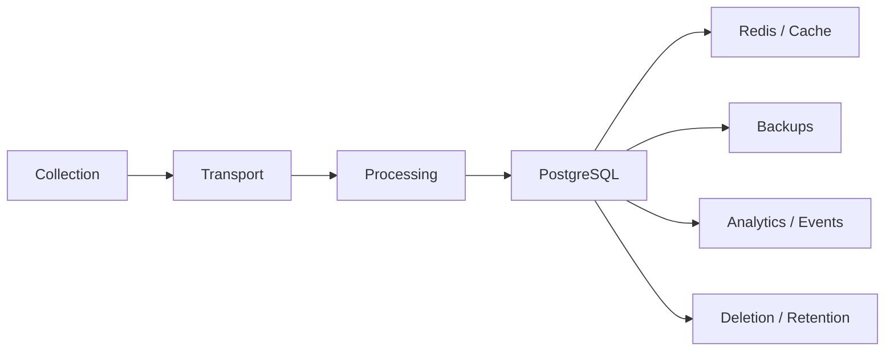
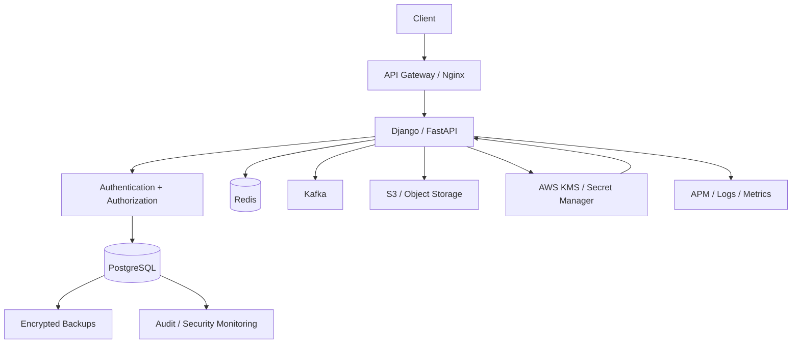

# 14- Sensitive Data Protection

## Overview

Sensitive data protection is the set of database, application, infrastructure, and operational controls used to prevent unauthorized access, disclosure, modification, or retention of sensitive information.

For SQL-backed systems, sensitive data protection is broader than simply encrypting a database.

A production security model must consider the complete data lifecycle:

```text
Collect
   ↓
Validate
   ↓
Store
   ↓
Process
   ↓
Cache
   ↓
Transmit
   ↓
Log / Monitor
   ↓
Backup
   ↓
Archive
   ↓
Delete
```

Sensitive data can include:

- Passwords
- Authentication tokens
- API keys
- Access tokens
- Payment information
- Government identifiers
- Personal information
- Customer addresses
- Private business information
- Encryption keys
- Database credentials
- Internal security metadata

The core engineering principle is:

```text
Collect less
Store less
Expose less
Log less
Retain only as long as necessary
Encrypt where appropriate
Control access at every boundary
```

---

## Data Classification

Sensitive data protection starts with classification.

A practical classification model is:

| Classification | Examples | Typical controls |
|---|---|---|
| Public | Marketing content, public documentation | Basic integrity/access controls |
| Internal | Internal metrics, operational metadata | Authentication and authorization |
| Confidential | Customer records, internal business data | Least privilege, encryption, auditing |
| Highly sensitive | Credentials, payment data, government identifiers | Strong access control, encryption, masking, strict retention |

Classification should influence:

- Database permissions
- Encryption requirements
- Logging
- API exposure
- Backup handling
- Retention
- Monitoring
- Access auditing

Do not treat every database column identically.

---

## Data Lifecycle

Sensitive data should be protected throughout its lifecycle.



Every arrow represents a potential security boundary.

Encrypting PostgreSQL does not automatically secure:

```text
Redis
Kafka
S3
Logs
Backups
Analytics systems
Developer environments
```

Each system needs appropriate controls.

---

## Data Minimization

The safest sensitive value is often the value the system never stores.

Instead of storing:

```text
Full payment card number
```

prefer an architecture where a specialized payment provider handles the sensitive credential and the application stores only what it needs, such as:

```text
provider_customer_id
payment_method_reference
last_four
brand
```

Similarly, do not store:

- Passwords in plaintext
- API secrets unnecessarily
- Authentication tokens longer than necessary
- Sensitive request payloads in logs
- Duplicate copies of regulated data without a business reason

Data minimization reduces the blast radius of a breach.

---

## Sensitive Data Inventory

Maintain an inventory of sensitive columns and systems.

Example:

| Data | Location | Sensitivity | Required protection |
|---|---|---|---|
| Password hash | PostgreSQL | High | Strong password hashing, restricted access |
| Email | PostgreSQL | Confidential | Access control |
| Payment reference | PostgreSQL | High | Least privilege, encryption as appropriate |
| Session token | Redis | High | Short TTL, restricted access |
| Access token | Application memory | High | Never log |
| Customer export | S3 | High | Encryption, IAM, lifecycle controls |

A useful database inventory includes:

```text
Table
Column
Data classification
Owner
Consumers
Retention period
Encryption requirement
Access roles
Logging restrictions
```

---

## Password Storage

Passwords must never be stored as plaintext.

Do not use general-purpose cryptographic hashes such as:

```text
MD5
SHA-1
SHA-256
```

as password storage mechanisms.

Use a password hashing algorithm designed for password storage, such as:

- Argon2id
- bcrypt
- scrypt

Django's password framework should normally be used instead of implementing password hashing manually.

Example:

```python
from django.contrib.auth.hashers import make_password

password_hash = make_password(password)
```

The application stores the resulting password hash, not the original password.

---

## Password Hashing vs Encryption

Passwords should generally be **hashed**, not encrypted.

### Hashing

```text
Password
   ↓
Password hashing function
   ↓
Password hash
```

Verification:

```text
Password supplied
   ↓
Hash verification
   ↓
Match / reject
```

### Encryption

```text
Plaintext
   ↓
Encryption + key
   ↓
Ciphertext
```

Encryption is reversible when the key is available.

Passwords should normally use one-way password hashing because the application does not need to recover the original password.

---

## Password Hashing Properties

A production password hashing system should provide:

- Salt
- Configurable work factor
- Resistance to offline attacks
- Appropriate memory/CPU cost
- Upgrade capability as hardware improves

Never invent a custom password hashing scheme.

Use established framework or library implementations.

---

## Application Secrets

Sensitive credentials such as:

```text
DATABASE_PASSWORD
AWS_ACCESS_KEY
API_KEY
JWT_SIGNING_KEY
ENCRYPTION_KEY
```

should not be stored directly in source code.

Avoid:

```python
DATABASE_PASSWORD = "production-secret"
```

and:

```text
password=super-secret
```

inside committed configuration files.

Prefer:

```text
Application
    ↓
Secret manager
    ↓
Runtime credential
```

---

## Secret Management

Production systems commonly use:

- AWS Secrets Manager
- AWS Systems Manager Parameter Store
- Kubernetes Secrets with appropriate encryption and access controls
- Dedicated secret-management platforms
- CI/CD secret stores

The important architecture is:

```text
Source code
    ✗
    ↓
Hard-coded secret

Source code
    ↓
Secret reference
    ↓
Runtime secret injection
```

---

## Database Credentials

Application database credentials should use a dedicated least-privileged role.

For example:

```text
app_runtime
```

should not be:

```text
SUPERUSER
```

and should not own all production objects unnecessarily.

Separate credentials can be used for:

```text
Runtime
Migrations
Read-only reporting
Administration
```

This limits the blast radius of credential compromise.

---

## Column-Level Access

Not every application component needs every column.

Consider:

```sql
customers (
    id,
    name,
    email,
    phone,
    government_id,
    internal_notes
)
```

A customer-facing API may need:

```text
id
name
email
```

but not:

```text
government_id
internal_notes
```

Avoid:

```sql
SELECT *
FROM customers;
```

when sensitive columns exist.

Prefer explicit projections:

```sql
SELECT
    id,
    name,
    email
FROM customers
WHERE id = $1;
```

---

## Database Roles for Sensitive Data

PostgreSQL privileges can restrict access at different levels.

For example:

```text
app_runtime
    ↓
Normal application tables

app_reporting
    ↓
Approved reporting views

app_admin
    ↓
Restricted administrative access
```

Sensitive columns can be exposed through controlled views rather than granting broad access to base tables.

---

## Views for Data Exposure

A view can expose only approved fields.

For example:

```sql
CREATE VIEW customer_directory AS
SELECT
    id,
    name,
    email
FROM customers;
```

The reporting role can be granted access to the view rather than the entire underlying table.

This creates a useful abstraction:

```text
Base table
    ↓
Restricted view
    ↓
Reporting role
```

Views are not a replacement for authorization, but they can reduce unnecessary data exposure.

---

## Column Privileges

PostgreSQL can grant privileges on specific columns.

For example:

```sql
GRANT SELECT (
    id,
    name,
    email
)
ON customers
TO app_reporting;
```

This can be useful when a role requires only a subset of table columns.

However, column-level privileges can become difficult to maintain at large scale.

For complex data exposure requirements, carefully designed views are often easier to reason about.

---

## Row Level Security

Sensitive data protection can also require row-level isolation.

For multi-tenant systems:

```sql
ALTER TABLE customers ENABLE ROW LEVEL SECURITY;

CREATE POLICY tenant_customers
ON customers
USING (
    tenant_id = current_setting('app.tenant_id')::uuid
)
WITH CHECK (
    tenant_id = current_setting('app.tenant_id')::uuid
);
```

RLS provides a database-level row access boundary.

It should complement:

```text
Authentication
+
Application authorization
+
Least-privileged roles
```

---

## Encryption at Rest

Encryption at rest protects stored data if underlying storage media or snapshots are accessed improperly.

Common production layers include:

```text
Database storage
Backups
Snapshots
Object storage
Persistent volumes
```

On AWS, encryption commonly uses AWS KMS-backed mechanisms.

Encryption at rest should be enabled according to organizational and regulatory requirements.

---

## Encryption in Transit

Sensitive data should be protected while moving between systems.

Typical flow:

```text
Client
   ↓ TLS
Nginx / Load Balancer
   ↓ TLS where required
Application
   ↓ TLS
PostgreSQL
```

Database connections should use TLS where network boundaries require it.

For example, PostgreSQL clients can enforce SSL behavior through connection configuration.

Do not assume private networking alone is sufficient for every threat model.

---

## Encryption at Rest vs In Transit

| Control | Protects against |
|---|---|
| Encryption in transit | Network interception |
| Encryption at rest | Storage compromise |
| Application-level encryption | Database/operator exposure for selected fields |
| Hashing | Recovery of original passwords |
| Access control | Unauthorized logical access |

These controls solve different problems.

---

## Application-Level Encryption

Some highly sensitive fields may require encryption before being stored.

Architecture:

```text
Application
    ↓
Encrypt sensitive field
    ↓
PostgreSQL
    ↓
Ciphertext
```

Examples might include:

- Highly sensitive identifiers
- Certain regulated fields
- Secrets that must be recoverable only by authorized application components

Application-level encryption introduces key-management complexity and should be used deliberately.

---

## Encryption Trade-Offs

Encryption can affect application behavior.

Encrypted values may not support normal operations such as:

```sql
WHERE encrypted_value = ...
ORDER BY encrypted_value
LIKE '%abc%'
```

without additional design.

This can affect:

- Indexing
- Searching
- Sorting
- Uniqueness
- Query performance
- Analytics

Do not encrypt every column blindly.

---

## Deterministic Encryption

Some systems need to perform equality lookups against encrypted data.

A deterministic scheme can produce the same ciphertext for the same plaintext under certain designs.

This can enable:

```text
Lookup encrypted email
```

but leaks equality patterns:

```text
Same plaintext
    ↓
Same ciphertext
```

This is a security trade-off.

Use specialized cryptographic designs rather than inventing an encryption format.

---

## Hashing for Lookup

If a sensitive value only needs equality lookup and never needs to be recovered, a keyed cryptographic digest can sometimes be appropriate.

For example:

```text
Normalized identifier
    ↓
HMAC with secret key
    ↓
Lookup token
```

The database stores the derived lookup value rather than the original.

This requires careful key management and collision/normalization considerations.

---

## Tokenization

Tokenization replaces sensitive values with references.

For example:

```text
Payment card
    ↓
Payment provider
    ↓
Payment token
    ↓
Application
```

The application stores:

```text
payment_token
```

instead of the original sensitive value.

Tokenization can substantially reduce the sensitive-data footprint.

---

## PII and API Responses

Do not expose sensitive database columns simply because they exist.

For example, avoid returning:

```json
{
  "id": 1001,
  "name": "Customer",
  "email": "customer@example.com",
  "government_id": "..."
}
```

unless the endpoint explicitly requires it and authorization permits it.

Prefer response schemas that expose only required fields.

---

## Django Serializers

In Django REST Framework, explicitly define serializer fields.

For example:

```python
from rest_framework import serializers


class CustomerSerializer(serializers.ModelSerializer):
    class Meta:
        model = Customer
        fields = (
            "id",
            "name",
            "email",
        )
```

Avoid exposing sensitive model fields through unrestricted serializers.

---

## FastAPI Response Models

FastAPI response models provide another useful boundary.

```python
from pydantic import BaseModel


class CustomerResponse(BaseModel):
    id: int
    name: str
    email: str
```

The response contract should expose only fields required by the API consumer.

---

## Logging Sensitive Data

Logs are one of the most common sources of accidental data leakage.

Avoid logging:

```text
Passwords
Authorization headers
Session tokens
API keys
Database credentials
Payment credentials
Full identity documents
Sensitive request bodies
```

Dangerous:

```python
logger.info("Request payload: %s", request.json())
```

if the payload may contain credentials or sensitive personal information.

---

## Structured Logging

Structured logs should explicitly control which fields are recorded.

For example:

```python
logger.info(
    "customer_login",
    extra={
        "customer_id": customer_id,
        "result": "success",
    },
)
```

Avoid passing complete request objects into logging systems.

Logging should be designed as a data-exposure boundary.

---

## Error Messages

Sensitive data can leak through exceptions.

Avoid:

```text
Database error:
INSERT INTO customers (..., government_id='...')
```

or:

```text
Invalid password for user:
password=...
```

Production error responses should expose safe, actionable information without revealing internal SQL, credentials, or sensitive values.

---

## SQL Error Handling

Applications should distinguish between:

```text
Internal diagnostic detail
```

and:

```text
Client-facing error
```

For example:

```text
Application logs
    → Detailed diagnostic context

API response
    → Generic safe error
```

Do not return raw PostgreSQL exceptions directly to clients.

---

## Database Query Logging

Database logging can accidentally capture sensitive values depending on configuration and tooling.

Review:

- PostgreSQL logging configuration
- ORM query logging
- APM agents
- SQL tracing
- Debug logging
- Slow-query tooling

Production debugging should not become a data-exfiltration mechanism.

---

## Monitoring Systems

Sensitive information can leak into:

- Prometheus labels
- OpenTelemetry attributes
- APM traces
- Error tracking platforms
- Metrics
- Distributed tracing
- Debug dashboards

Never use high-cardinality sensitive identifiers as metric labels.

Avoid:

```text
http_request_total{email="customer@example.com"}
```

Prefer:

```text
http_request_total{endpoint="/customers/{id}"}
```

---

## Distributed Tracing

Trace attributes should be carefully selected.

Avoid:

```text
Authorization header
Cookie
JWT
Password
Credit card number
Full request body
```

Prefer metadata such as:

```text
request_id
route
status_code
service
tenant identifier where approved
```

Even tenant identifiers may require classification depending on the system.

---

## Redis

Redis frequently contains sensitive application state:

```text
Session data
Tokens
Rate-limit state
Cached customer data
Temporary credentials
```

Apply:

- Network isolation
- Authentication
- TLS where appropriate
- Access control
- Short TTLs
- Minimal cached fields
- Tenant-aware cache keys
- Encryption according to requirements

Do not assume Redis is safe simply because it is internal.

---

## Kafka

Kafka can contain sensitive information for long periods because events may be retained.

Before publishing sensitive data, ask:

```text
Does the consumer actually need this field?
```

Prefer:

```json
{
  "event_type": "order.created",
  "order_id": "123",
  "customer_id": "456"
}
```

over embedding an entire customer record when consumers do not need it.

---

## Event Retention

Sensitive data in Kafka can remain available because of:

```text
Topic retention
Consumer lag
Replicas
Backups
Dead-letter topics
Replay systems
```

Deleting data from PostgreSQL does not automatically remove historical event copies.

Design retention deliberately.

---

## Celery

Celery task payloads can contain sensitive information.

Avoid:

```python
process_customer.delay(
    password=password,
    government_id=government_id,
)
```

Prefer passing a reference:

```python
process_customer.delay(customer_id)
```

The worker can retrieve only the data it needs using its authorized database role.

This reduces sensitive information in:

- Message brokers
- Task metadata
- Worker logs
- Monitoring systems

---

## Backups

Backups are often overlooked sensitive-data stores.

A production backup architecture may include:

```text
PostgreSQL
    ↓
Snapshots
    ↓
Backup storage
    ↓
Cross-region copy
    ↓
Long-term retention
```

Every copy inherits the sensitivity of the original data.

Backups should have:

- Encryption
- Restricted IAM access
- Separate access controls
- Lifecycle policies
- Retention rules
- Audit logging
- Restore testing

---

## Disaster Recovery

Sensitive-data protection must survive disaster recovery.

Verify:

- Encryption keys are available to authorized recovery processes.
- Backup access is restricted.
- Restored databases preserve roles and permissions.
- RLS policies are present.
- Secrets are not embedded in backup scripts.
- Recovery environments do not expose production data unnecessarily.

Do not weaken security controls merely because a system is in DR mode.

---

## Database Snapshots

Snapshots can contain complete database contents.

Therefore:

```text
Database snapshot
    =
Sensitive data copy
```

Control snapshot access as strictly as database access.

On AWS, use appropriate IAM policies and KMS controls for encrypted database snapshots.

---

## Non-Production Environments

Production data should not automatically be copied into:

```text
Development
Testing
Staging
Developer laptops
```

A common safer architecture is:

```text
Production data
    ↓
Controlled export
    ↓
Mask / anonymize / tokenize
    ↓
Non-production dataset
```

Developers generally do not need real customer secrets.

---

## Data Masking

Masking replaces sensitive values with safe representations.

Example:

```text
customer@example.com
        ↓
c******@example.com
```

or:

```text
4111111111111111
        ↓
************1111
```

Masking is primarily an exposure-reduction technique.

It should not be confused with cryptographic encryption.

---

## Anonymization vs Pseudonymization

### Anonymization

Data is transformed so that the individual should no longer be reasonably identifiable under the applicable threat model.

### Pseudonymization

Identifiers are replaced with pseudonyms while a separate mechanism can potentially reconnect them to the original identity.

For example:

```text
Customer ID
    ↓
Random internal identifier
```

The security properties and regulatory implications differ.

Use the terminology appropriate to the organization's compliance requirements.

---

## Data Retention

Keeping sensitive data indefinitely increases risk.

Define:

```text
Collection date
Retention period
Deletion trigger
Legal hold requirements
Archive requirements
Deletion verification
```

For example:

```text
Active customer data
    ↓
Retention period
    ↓
Archive or deletion
```

Retention requirements should be defined with legal, compliance, and business stakeholders where applicable.

---

## Secure Deletion

Deleting a database row does not necessarily mean every copy disappears immediately.

Copies may exist in:

```text
Indexes
Backups
Snapshots
Kafka
Redis
Logs
Analytics systems
Search indexes
Data exports
```

A deletion workflow should account for all relevant systems.

---

## Soft Deletes

Soft deletion:

```sql
UPDATE customers
SET deleted_at = now()
WHERE id = $1;
```

can support business recovery and audit requirements.

But soft deletion does not remove the sensitive data.

The row still exists.

Therefore, if regulatory deletion is required, soft delete alone may be insufficient.

---

## Hard Deletes

A hard delete:

```sql
DELETE FROM customers
WHERE id = $1;
```

removes the row from the table, but related copies may remain elsewhere.

Consider:

```text
Database
Cache
Events
Search
Backups
Analytics
```

when implementing complete deletion workflows.

---

## Foreign Keys and Deletion

Sensitive-data deletion can be complicated by relationships.

For example:

```text
customer
   ↓
orders
   ↓
payments
   ↓
audit records
```

Do not blindly use:

```sql
ON DELETE CASCADE
```

for sensitive data.

Determine which records must:

- Be deleted
- Be anonymized
- Be retained
- Be legally preserved
- Be disconnected from identifying information

---

## Audit Logs

Audit logs may themselves contain sensitive data.

A common mistake is:

```text
Audit everything
```

without considering the sensitivity of the audit trail.

Prefer recording:

```text
Who
What operation
Which resource
When
Success/failure
Request ID
```

rather than full before/after payloads unless required.

---

## Database Auditing

For sensitive systems, database-level auditing can help detect:

- Privileged access
- Unexpected schema changes
- Permission changes
- Sensitive table access
- Administrative operations

However, auditing increases storage and operational costs.

Audit data itself requires access control and retention management.

---

## Access Reviews

Sensitive-data access should be periodically reviewed.

Ask:

```text
Who can access this data?
Why?
Is the access still required?
Can it be reduced?
Is it being used?
```

Review:

- PostgreSQL roles
- IAM permissions
- Kubernetes service accounts
- Secret-manager access
- S3 permissions
- Redis access
- Kafka permissions
- Developer access

Least privilege is an ongoing process, not a one-time configuration.

---

## Separation of Duties

Sensitive production operations should not depend on a single unrestricted identity.

Separate:

```text
Application runtime
    ↓
Normal data operations

Migration role
    ↓
Schema changes

Security/admin role
    ↓
Privileged operations

Backup role
    ↓
Backup access
```

This reduces the blast radius of credential compromise.

---

## Key Management

Encryption is only as strong as the key-management architecture.

Do not store:

```text
Encrypted data
+
Encryption key
```

in the same unrestricted location.

Prefer:

```text
Application
    ↓
KMS / Key Management System
    ↓
Encryption operation
```

Keys should have:

- Restricted access
- Rotation strategy
- Auditability
- Backup/recovery considerations
- Defined ownership

---

## AWS KMS

AWS KMS can provide managed key operations for AWS services and application-level encryption designs.

A typical architecture is:

```text
Application
    ↓
IAM authorization
    ↓
AWS KMS
    ↓
Encryption / decryption
```

Do not grant every application component unrestricted KMS access.

Scope permissions to the specific keys and operations required.

---

## Key Rotation

Key rotation must account for existing encrypted data.

A simplistic model:

```text
Old key
    ↓
Existing ciphertext

New key
    ↓
New ciphertext
```

If data must be re-encrypted, design a controlled migration.

Avoid changing encryption keys without understanding:

- Existing ciphertext
- Key versions
- Application compatibility
- Backup recovery
- Rotation failures
- Rollback

---

## Secret Rotation

Database and API credentials should support rotation without unnecessary downtime.

A mature architecture may use:

```text
Secret Manager
      ↓
New credential
      ↓
Application rollout
      ↓
Old credential remains temporarily valid
      ↓
Old credential revoked
```

Design rotation as an operational workflow rather than a manual emergency procedure.

---

## SQL Injection and Sensitive Data

SQL injection can become especially damaging when database roles have access to sensitive tables.

Defense in depth includes:

```text
Parameterized queries
+
Safe dynamic SQL
+
Least privilege
+
RLS
+
Restricted schemas
+
Monitoring
```

A runtime role should not be able to access unrelated sensitive datasets merely because one query path is compromised.

---

## Sensitive Data and ORM Usage

ORMs reduce some SQL construction risks but do not automatically solve data exposure.

Avoid:

```python
Customer.objects.all()
```

when the resulting objects contain sensitive fields that will later be serialized, logged, or passed elsewhere.

Prefer:

```python
Customer.objects.values(
    "id",
    "name",
    "email",
)
```

when only a subset is required.

This reduces unnecessary data movement.

---

## Query Projection

Explicit projections improve both security and performance.

Instead of:

```sql
SELECT *
FROM customers
WHERE tenant_id = $1;
```

prefer:

```sql
SELECT
    id,
    name,
    email
FROM customers
WHERE tenant_id = $1;
```

Benefits include:

- Less data transferred
- Lower memory usage
- Smaller API responses
- Lower accidental exposure
- Clearer contracts

---

## Sensitive Data and Pagination

Pagination APIs should not accidentally expose sensitive ordering or filtering fields.

Prefer controlled API parameters:

```text
sort=created
```

mapped to:

```text
created_at
```

rather than allowing arbitrary SQL expressions.

Keyset pagination can also reduce the need to expose internal database offsets or broad query behavior.

---

## Data Export

Exports are high-risk because they create large copies of sensitive data.

A production export architecture should include:

```text
Authorized request
    ↓
Permission check
    ↓
Asynchronous job
    ↓
Minimal projection
    ↓
Generated file
    ↓
Encrypted object storage
    ↓
Short-lived access
    ↓
Automatic expiration
```

Do not generate unrestricted exports synchronously from an API request.

---

## Export Security

Exports should have:

- Explicit authorization
- Tenant isolation
- Minimal fields
- Audit logging
- Encryption
- Short retention
- Access expiration
- Download authorization

An export should not become an unrestricted database dump.

---

## Developer Access

Production database access should be restricted.

Avoid:

```text
Every developer
    ↓
Production database
    ↓
Full sensitive data
```

Prefer:

```text
Developer
    ↓
Approved operational access
    ↓
Restricted data
```

Use masked datasets and controlled debugging mechanisms wherever possible.

---

## Incident Response

If sensitive data exposure is suspected:

```text
Detect
  ↓
Contain
  ↓
Investigate
  ↓
Rotate credentials/keys
  ↓
Assess affected data
  ↓
Remediate
  ↓
Restore secure configuration
  ↓
Review and improve
```

Potential actions include:

- Revoke compromised credentials
- Rotate secrets
- Disable compromised accounts
- Restrict database access
- Preserve relevant audit evidence
- Identify affected records
- Review logs
- Validate backups
- Apply required notifications according to organizational and regulatory processes

Incident procedures should be prepared before an incident occurs.

---

## Monitoring and Alerting

Useful security signals include:

- Failed authentication
- Privilege changes
- Sensitive table access
- `BYPASSRLS` usage
- Unexpected role changes
- Large exports
- Unusual query volume
- Access from unexpected services
- Secret access anomalies
- Database connection anomalies

Avoid creating monitoring labels containing sensitive values.

---

## Performance Considerations

Security controls can introduce overhead.

Potential sources include:

```text
RLS policy evaluation
Encryption/decryption
Audit logging
Additional joins
Restricted views
Data masking
Tokenization
```

The goal is not to remove controls for performance.

Instead:

```text
Measure
    ↓
Identify bottleneck
    ↓
Optimize implementation
    ↓
Preserve security boundary
```

---

## Scalability Considerations

At scale, sensitive-data protection should remain centralized enough to be manageable.

Useful patterns include:

- Standardized database roles
- Shared secret-management practices
- Centralized policy definitions
- Reusable encryption libraries
- Standardized logging redaction
- Automated access reviews
- Infrastructure-as-code
- Automated compliance checks

Avoid every microservice inventing its own sensitive-data handling model.

---

## Kubernetes Considerations

Kubernetes introduces additional sensitive-data boundaries:

```text
Secrets
Service Accounts
ConfigMaps
Pod logs
Volumes
Container environment
```

Do not put credentials into ConfigMaps.

Restrict:

- Secret access
- Service account permissions
- Pod identity
- Namespace access
- Debug/exec access

Use cloud-native identity mechanisms where appropriate instead of long-lived static credentials.

---

## Docker Considerations

Avoid embedding secrets in:

```dockerfile
ENV DATABASE_PASSWORD=...
```

or:

```dockerfile
COPY .env .
```

Secrets can become part of image layers or build artifacts.

Use runtime secret injection mechanisms instead.

---

## CI/CD Considerations

CI/CD systems often have access to:

```text
Production credentials
Deployment roles
Database migration credentials
Cloud APIs
```

Protect them with:

- Short-lived credentials where possible
- Restricted IAM roles
- Environment separation
- Secret stores
- Approval controls for production
- Audit logging

Do not print secrets during builds.

Avoid commands that expose environment variables indiscriminately.

---

## Production Architecture

A mature sensitive-data architecture can look like:



Every data store is independently secured.

---

## Defense in Depth

A strong architecture does not depend on one control.

For example:

```text
TLS
  +
Authentication
  +
Authorization
  +
Least-privileged DB role
  +
RLS
  +
Column restriction
  +
Encryption
  +
Secret management
  +
Logging redaction
  +
Audit
  +
Monitoring
```

If one control fails, other layers reduce the blast radius.

---

## Security Checklist

- [ ] Sensitive data is classified.
- [ ] Unnecessary sensitive data is not collected.
- [ ] Passwords use dedicated password-hashing algorithms.
- [ ] Passwords are never stored in plaintext.
- [ ] Application secrets are not committed to source control.
- [ ] Database runtime roles follow least privilege.
- [ ] Sensitive columns are not unnecessarily exposed.
- [ ] Queries use explicit projections where appropriate.
- [ ] RLS is used for required row-level isolation.
- [ ] `BYPASSRLS` is restricted.
- [ ] Sensitive database connections use appropriate TLS.
- [ ] Storage and backups use appropriate encryption.
- [ ] Encryption keys are managed separately from encrypted data.
- [ ] Secrets support controlled rotation.
- [ ] Logs do not contain credentials or sensitive payloads.
- [ ] APM and tracing do not capture sensitive attributes.
- [ ] Redis access is restricted.
- [ ] Kafka messages minimize sensitive payloads.
- [ ] Celery tasks avoid carrying sensitive values unnecessarily.
- [ ] Production data is not copied directly into developer environments.
- [ ] Non-production data is masked or anonymized where required.
- [ ] Backups have restricted access and defined retention.
- [ ] Data deletion considers caches, events, search, backups, and exports.
- [ ] Sensitive exports require explicit authorization.
- [ ] Production access is audited.
- [ ] CI/CD credentials are restricted.
- [ ] Kubernetes secrets and service accounts are protected.
- [ ] Incident-response procedures include secret/key rotation.
- [ ] Security controls are tested after deployments and infrastructure changes.

---

## Common Mistakes

### Storing Passwords as Plaintext

**Problem:** A database compromise immediately exposes user credentials.

**Better:** Use Argon2id, bcrypt, or scrypt through a mature framework/library.

### Encrypting Passwords Instead of Hashing Them

**Problem:** Recoverable credentials create unnecessary risk.

**Better:** Store password hashes and verify supplied passwords against them.

### Logging Entire Requests

**Problem:** Tokens, passwords, and personal data can enter centralized logging systems.

**Better:** Log only required structured metadata and explicitly redact sensitive fields.

### Using `SELECT *`

**Problem:** New sensitive columns can automatically become part of application responses or internal data flows.

**Better:** Use explicit projections.

### Copying Production Data to Development

**Problem:** Sensitive data becomes accessible to a much larger population.

**Better:** Use synthetic, masked, or appropriately anonymized datasets.

### Encrypting Everything Without a Query Strategy

**Problem:** Encrypted values can interfere with equality searches, indexing, sorting, and analytics.

**Better:** Encrypt based on the threat model and query requirements.

### Treating Backups as Non-Sensitive

**Problem:** Backups may contain complete production datasets.

**Better:** Apply encryption, access controls, retention policies, and auditability to backups.

### Putting Secrets in Docker Images

**Problem:** Secrets can persist in image layers and registries.

**Better:** Inject secrets at runtime.

### Sending Sensitive Data Through Kafka

**Problem:** Event retention and replay can create long-lived copies.

**Better:** Publish only fields consumers actually need.

### Passing Sensitive Data Through Celery

**Problem:** Task payloads can appear in brokers, monitoring systems, and logs.

**Better:** Pass resource identifiers and retrieve required data using authorized workers.

### Assuming RLS Protects External Systems

**Problem:** Redis, Kafka, S3, search, and analytics systems are outside PostgreSQL's RLS boundary.

**Better:** Implement authorization independently in each data store.

### Granting Broad Database Access

**Problem:** SQL injection or credential compromise has a larger blast radius.

**Better:** Use dedicated runtime roles with minimum privileges.

### Keeping Sensitive Data Forever

**Problem:** Retention increases the amount of data exposed by a future breach.

**Better:** Define and automate retention and deletion policies.

---

## Interview Traps

### Is encryption at rest enough to protect sensitive data?

No. Data can leak through APIs, logs, backups, Redis, Kafka, exports, developer environments, or compromised credentials.

### Should passwords be encrypted?

Normally no. Passwords should be stored using dedicated password-hashing algorithms such as Argon2id, bcrypt, or scrypt.

### What is data minimization?

Collecting and retaining only the sensitive information that is actually required for the system's business and operational needs.

### Why is `SELECT *` a security concern?

A new sensitive column can unintentionally become part of application data flows without an explicit code change.

### Does RLS protect sensitive data everywhere?

No. RLS protects PostgreSQL row access. Other systems such as Redis, Kafka, S3, search systems, and analytics platforms need independent controls.

### Why are logs a security concern?

Logs are widely replicated and often accessible to many operators and systems. Accidentally logging credentials or personal data can create a large secondary exposure.

### Why are backups part of sensitive-data protection?

Backups are often complete copies of production data and therefore inherit its sensitivity and access requirements.

### What is the difference between hashing and encryption?

Hashing is designed to be one-way for verification or derived representations, while encryption is reversible with the appropriate key.

### When should application-level encryption be used?

When selected fields require stronger protection than storage-level encryption provides and the application can manage encryption keys and query limitations appropriately.

### Why is tokenization useful?

It allows the application to store a reference instead of the original sensitive value, reducing the sensitive-data footprint.

### How should sensitive data be handled in Kafka?

Minimize event payloads, avoid unnecessary sensitive fields, apply access controls, and define retention with replay and historical copies in mind.

### How should production data be used in development?

Prefer synthetic or appropriately masked/anonymized data. Production sensitive data should not be distributed to developers without a strong, explicitly controlled requirement.

### What is the senior-level view of sensitive data protection?

Treat sensitive data as a lifecycle-wide security problem. Minimize collection, classify data, enforce least privilege, protect every storage and transport boundary, control secrets and keys, prevent logging leakage, secure backups and external systems, automate retention, and continuously audit access and exposure.

## Key Takeaways

- **Sensitive-data protection is a lifecycle problem**, covering collection, storage, APIs, caches, events, logs, backups, exports, retention, and deletion.
- **Data minimization and least privilege reduce blast radius**, while explicit projections, restricted roles, RLS, and controlled API schemas reduce unnecessary exposure.
- **Passwords require dedicated one-way password hashing**, while encryption, tokenization, and keyed digests should be selected according to whether data must be recoverable or searchable.
- **Every external data system has its own security boundary**: PostgreSQL RLS does not automatically protect Redis, Kafka, S3, search, logs, or backups.
- **Production security depends on operational discipline**: secret/key management, encryption, access reviews, logging redaction, secure non-production data, retention, deletion, monitoring, and incident response.