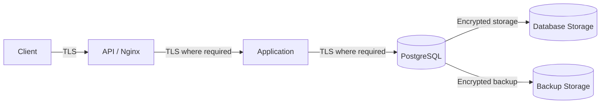
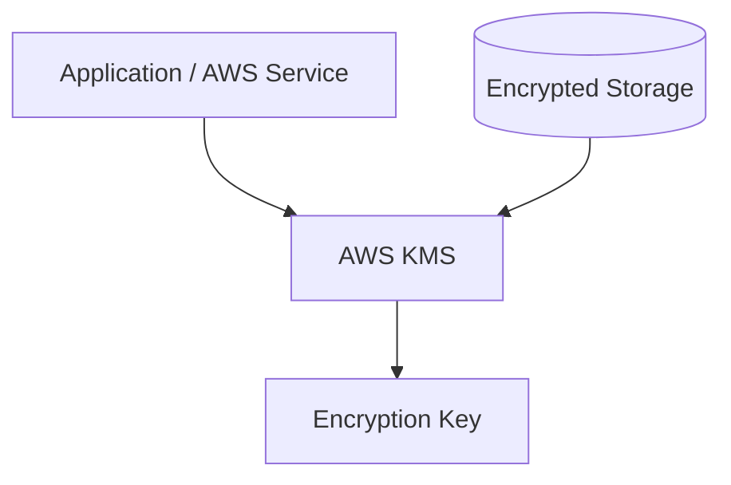
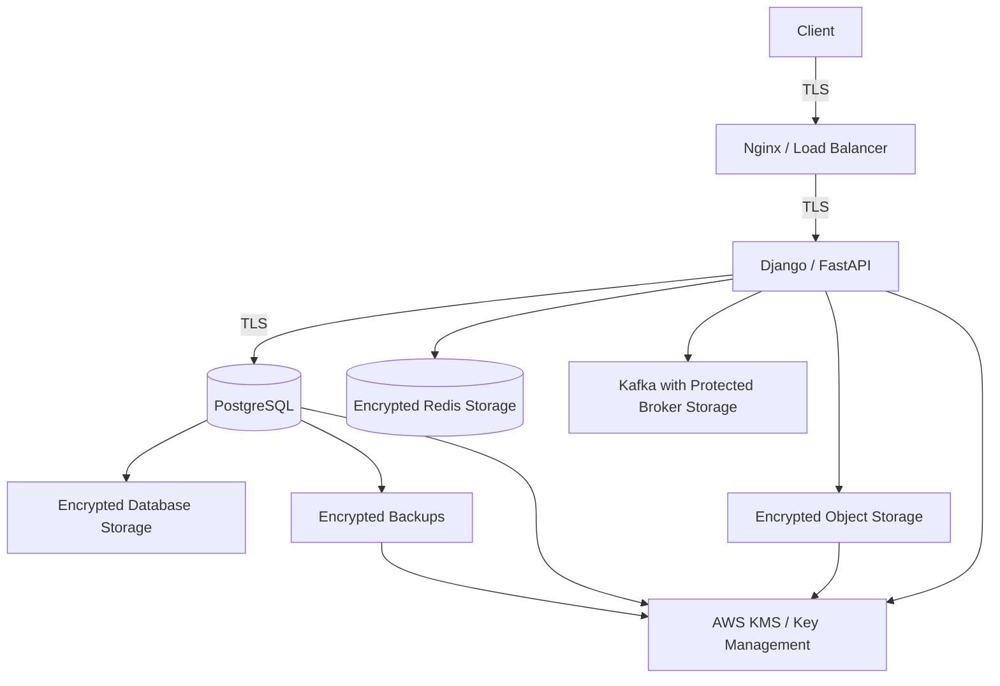

# 15- Encryption at Rest

## Overview

Encryption at rest protects stored data from unauthorized access when the underlying storage, database files, snapshots, disks, or backup media are accessed outside their intended authorization boundary.

For a SQL-backed backend system, encryption at rest is one layer of a broader defense-in-depth model:

```text
Authentication
      +
Authorization
      +
Least Privilege
      +
Encryption in Transit
      +
Encryption at Rest
      +
Application-Level Protection
      +
Auditing
      +
Monitoring
```

Encryption at rest is primarily designed to protect against scenarios such as:

- Lost or improperly accessed storage media
- Unauthorized access to database snapshots
- Compromised backup storage
- Exposed persistent volumes
- Unauthorized access to object-storage copies
- Improperly disposed storage devices

It does **not** protect against every form of data compromise.

If an attacker obtains valid application credentials and queries PostgreSQL through the application, encrypted storage does not prevent the database from returning plaintext data.

The practical security model is therefore:

```text
Encrypted storage
        ↓
Database starts
        ↓
Authorized database process decrypts data as needed
        ↓
Authorized application receives plaintext
```

Encryption at rest protects the storage boundary, not the logical authorization boundary.

---

## Why Encryption at Rest Matters

Modern backend systems create many persistent copies of data:

```text
PostgreSQL
   ├── Primary storage
   ├── Replicas
   ├── WAL
   ├── Snapshots
   └── Backups

Application
   ├── Redis persistence
   ├── Kafka topics
   └── Object storage

Operations
   ├── Logs
   ├── Exports
   └── Analytics datasets
```

Protecting only the PostgreSQL primary disk leaves other copies exposed.

A production encryption strategy therefore considers every persistent storage boundary.

---

## Threat Model

Encryption at rest is useful when the attacker can obtain the underlying storage but does not have the legitimate decryption authorization.

Examples:

| Threat | Encryption at rest helps? |
|---|---|
| Stolen database disk | Yes |
| Unauthorized snapshot access | Yes |
| Compromised backup storage | Yes |
| Lost encrypted volume | Yes |
| Network packet interception | No |
| SQL injection using valid DB access | No |
| Compromised application credentials | Generally no |
| Authorized administrator querying data | No |
| Malicious application with DB credentials | Generally no |
| Plaintext sensitive data in logs | No |

This distinction is critical in security architecture.

---

## Encryption at Rest vs Encryption in Transit

These controls protect different boundaries.



### Encryption in Transit

Protects:

```text
Client → API
API → Database
Service → Service
```

### Encryption at Rest

Protects:

```text
Database storage
Backups
Snapshots
Persistent volumes
Object storage
```

A production system generally needs both.

---

## What Actually Gets Encrypted?

"Database encryption at rest" can refer to several different layers.

| Layer | Example |
|---|---|
| Storage volume | Encrypted EBS volume |
| Database service | Managed database encryption |
| Backup | Encrypted snapshot/backup |
| Object storage | Server-side encrypted S3 object |
| Application data | Application-level field encryption |
| Key material | KMS/HSM-managed keys |

These layers have different operational and security characteristics.

---

## Storage-Level Encryption

Storage-level encryption encrypts data below the database layer.

For example:

```text
PostgreSQL
    ↓
Filesystem
    ↓
Encrypted block device
    ↓
Physical storage
```

PostgreSQL continues operating normally.

The database does not necessarily need to know that the underlying block device is encrypted.

### Advantages

- Transparent to the application
- Usually minimal application changes
- Protects database files and storage volumes
- Often integrates directly with cloud infrastructure
- Simplifies database migration compared with application-level encryption

### Limitations

Storage encryption does not prevent an authorized database session from reading plaintext.

For example:

```sql
SELECT government_id
FROM customers
WHERE id = 1001;
```

If the database role is authorized, PostgreSQL can return the value.

---

## Transparent Data Encryption

Transparent Data Encryption (TDE) encrypts database storage while keeping normal SQL operations transparent to applications.

Conceptually:

```text
Application
    ↓
SQL
    ↓
Database
    ↓
Encryption layer
    ↓
Encrypted storage
```

TDE is commonly discussed in database products as a database-native encryption mechanism.

The exact implementation and availability depend on the database engine and deployment model.

Do not assume that all PostgreSQL deployments provide the same native TDE capabilities.

For PostgreSQL deployments, encryption at the infrastructure/storage layer is commonly used, especially with managed cloud database services.

---

## PostgreSQL and Encryption at Rest

PostgreSQL does not require application-level encryption simply because the database contains sensitive data.

A common production architecture is:

```text
Application
      ↓
TLS
      ↓
PostgreSQL
      ↓
Encrypted storage
      ↓
Encrypted backups
```

For highly sensitive fields, application-level encryption can be added independently:

```text
Application
      ↓
Field encryption
      ↓
PostgreSQL
      ↓
Encrypted storage
```

This creates multiple protection layers.

---

## AWS Database Encryption

Managed AWS database services commonly integrate encryption at rest with AWS KMS.

A typical architecture is:

```text
Application
    ↓
AWS managed database
    ↓
Encrypted database storage
    ↓
AWS KMS-managed key
```

The exact supported configuration depends on the AWS database service.

For managed PostgreSQL deployments, encryption should normally be enabled when creating the database and included in the infrastructure baseline.

---

## AWS KMS

AWS Key Management Service provides centralized key management for AWS encryption workflows.

A simplified architecture is:



The application or AWS service does not need to manage raw long-term key material directly for every encryption operation.

KMS can provide:

- Key access control
- Key policies
- IAM integration
- Auditing
- Rotation capabilities
- Centralized management

---

## Envelope Encryption

Envelope encryption separates data encryption from key encryption.

Conceptually:

```text
Plaintext
   ↓
Data Encryption Key (DEK)
   ↓
Ciphertext

DEK
   ↓
KMS Key Encryption Key
   ↓
Encrypted DEK
```

The system stores:

```text
Encrypted data
+
Encrypted data-encryption key
```

The master/key-encryption key remains protected by the key-management system.

This pattern is widely used in cloud encryption architectures.

---

## Why Envelope Encryption Exists

Encrypting large datasets directly through a centralized KMS operation would be inefficient.

Instead:

```text
KMS
  ↓
Protect small encryption key

Application / storage layer
  ↓
Encrypt large amount of data locally
```

This improves scalability while maintaining centralized control over key protection.

---

## Key Hierarchy

A mature encryption architecture can use multiple levels:

```text
KMS Root / Key Encryption Key
          ↓
Data Encryption Key
          ↓
Database / Object / Field Data
```

The exact hierarchy varies by service.

The important principle is to separate:

```text
Data
```

from:

```text
Key protection
```

and:

```text
Access to keys
```

---

## Key Ownership

Every encryption key should have an owner and a defined purpose.

For example:

| Key | Purpose | Consumers |
|---|---|---|
| Database key | PostgreSQL storage | Database service |
| Backup key | Backup encryption | Backup service |
| Object-storage key | S3 objects | Application/storage service |
| Application field key | Sensitive fields | Specific application service |

Avoid one unrestricted key for every production system.

---

## Key Rotation

Key rotation reduces long-term exposure if a key is compromised.

A simplified lifecycle is:

```text
Key v1
   ↓
Used for existing encrypted data

Key v2
   ↓
Used for new encryption operations
```

The exact behavior depends on the service and encryption design.

Key rotation should be planned together with:

- Existing ciphertext
- Backups
- Disaster recovery
- Application compatibility
- Key aliases
- Access policies
- Operational rollback

---

## Rotation Does Not Mean Re-encryption

A common misconception is:

```text
Rotate key
=
Rewrite every encrypted byte
```

Not necessarily.

Some managed services support key rotation without requiring the application to manually re-encrypt all existing data.

Application-level encryption may require explicit ciphertext migration depending on the encryption scheme.

Always understand the key-management semantics of the specific system.

---

## Key Deletion

Key deletion is potentially destructive.

If encrypted data depends on a permanently destroyed key:

```text
Ciphertext
   +
Missing key
   =
Data may be unrecoverable
```

Therefore, key deletion requires the same level of discipline as deleting production data.

Use:

- Approval workflows
- Deletion windows where supported
- Dependency inventories
- Backup validation
- Recovery testing

Never delete an encryption key simply because the corresponding database appears unused.

---

## Database Backups

Backups are part of the encryption-at-rest boundary.

For example:

```text
PostgreSQL
   ↓
Automated backup
   ↓
Encrypted backup storage
```

Verify that encryption is applied to:

- Automated backups
- Manual snapshots
- Replication copies where applicable
- Export files
- Cross-region backup copies
- Long-term archival storage

A secure database with unencrypted backups is still a sensitive-data exposure.

---

## PostgreSQL WAL

PostgreSQL writes transaction records to WAL.

Depending on the deployment architecture, WAL can contain sensitive information or reconstructable database changes.

Therefore, encryption considerations should include:

```text
Data files
WAL
Temporary storage
Backups
Replication infrastructure
```

The exact encryption behavior depends on the storage and managed service architecture.

---

## Read Replicas

Read replicas create additional persistent database copies.

```text
Primary
   ↓ WAL replication
Replica 1
Replica 2
Replica 3
```

If the primary is encrypted but replica storage is not, the security model is inconsistent.

Every replica should use equivalent encryption controls appropriate to its environment.

---

## Multi-Region Replication

Cross-region architectures create additional copies.

For example:

```text
Region A
  PostgreSQL Primary
       ↓
    Replication
       ↓
Region B
  PostgreSQL Standby
```

Encryption requirements should be applied in both regions.

Also verify:

- KMS key availability
- Cross-region key strategy
- IAM permissions
- Backup encryption
- Disaster recovery procedures

---

## Object Storage

Sensitive exports and database dumps are often stored in object storage.

For example:

```text
PostgreSQL
    ↓
Export
    ↓
S3
```

The S3 object should have appropriate encryption and access control.

Encryption alone is not enough.

Also configure:

- IAM restrictions
- Bucket policies
- Block Public Access
- Versioning where appropriate
- Lifecycle policies
- Audit logging
- Retention controls

---

## Kubernetes Persistent Volumes

Self-managed PostgreSQL on Kubernetes introduces persistent-volume encryption requirements.

Architecture:

```text
PostgreSQL Pod
      ↓
PersistentVolumeClaim
      ↓
PersistentVolume
      ↓
Encrypted storage backend
```

Encryption must be enforced by the underlying storage platform or filesystem architecture.

Do not assume:

```text
PVC
=
Encrypted
```

Verify the actual storage-class and cloud-volume configuration.

---

## Docker

Docker containers are not a replacement for encrypted storage.

Container filesystems can contain:

```text
Temporary application data
Logs
Downloaded files
Caches
Configuration
```

Persistent sensitive data should use appropriate encrypted storage.

Never treat container isolation as encryption.

---

## Redis Persistence

Redis may persist data using mechanisms such as:

```text
RDB snapshots
AOF
```

If Redis contains sensitive information, its persistent storage needs encryption appropriate to the deployment.

Also secure:

- Redis network access
- Authentication
- TLS
- Snapshots
- Backups
- Replicas

A PostgreSQL encryption strategy does not automatically protect Redis.

---

## Kafka Storage

Kafka brokers persist messages on disk.

Sensitive event payloads therefore create persistent sensitive copies.

Consider encryption for:

```text
Kafka broker disks
Replicas
Backups
Object-storage exports
```

Also minimize sensitive information in events.

The best sensitive-data strategy is often:

```text
Do not publish unnecessary sensitive data
```

rather than relying solely on encryption.

---

## Application-Level Encryption

Application-level encryption protects selected fields independently of database storage encryption.

Example:

```text
Customer government ID
        ↓
Application encryption
        ↓
Ciphertext
        ↓
PostgreSQL
        ↓
Encrypted storage
```

This provides an additional security boundary.

---

## When Application-Level Encryption Makes Sense

Consider it when:

- Specific fields require stronger protection
- Database administrators should not routinely see plaintext
- Regulatory requirements demand additional controls
- Compromise of storage alone should not reveal plaintext
- Data needs protection beyond infrastructure-level encryption

It should not be introduced automatically for every field.

---

## Application-Level Encryption Trade-Offs

Encryption changes database behavior.

Suppose:

```text
email = encrypted("customer@example.com")
```

Then ordinary operations such as:

```sql
WHERE email = 'customer@example.com'
```

cannot operate normally because the stored value is ciphertext.

Potential consequences include:

- Difficult indexing
- Difficult searching
- Equality-query limitations
- Sorting limitations
- Uniqueness challenges
- Increased CPU usage
- Key-management complexity
- Migration complexity

Security architecture must consider query requirements before choosing field encryption.

---

## Deterministic Encryption

Deterministic encryption can allow equality matching:

```text
same plaintext
     ↓
same ciphertext
```

This can support certain lookup scenarios.

However, it leaks equality patterns.

An observer may determine:

```text
ciphertext A == ciphertext B
```

without learning the plaintext.

Therefore, deterministic encryption should only be used when its leakage characteristics are acceptable.

---

## Hashing Instead of Encryption

If a value never needs to be recovered, encryption may be unnecessary.

For example:

```text
Input
  ↓
HMAC
  ↓
Lookup token
```

The application can compare derived values without storing the original plaintext.

This can be useful for selected equality-only lookup requirements.

However, normalization, secret-key management, and threat modeling remain important.

---

## Encryption and Unique Constraints

Suppose an application needs:

```sql
UNIQUE(email)
```

Encrypting `email` can make uniqueness difficult.

Possible architecture:

```text
email
 ├── encrypted_email
 └── email_lookup_hmac
```

The encrypted value provides recoverability while the keyed digest supports controlled equality lookup.

This is an architectural pattern, not a universal solution.

It must be evaluated against the application's threat model and privacy requirements.

---

## Encryption and Search

Encrypted data generally cannot support arbitrary plaintext search.

For example:

```sql
WHERE encrypted_name LIKE '%aranya%'
```

is not equivalent to searching plaintext.

If encrypted fields require search, consider specialized approaches such as:

- Separate search indexes
- Carefully designed derived search tokens
- Search services with independent security controls
- Application-level filtering after authorized retrieval

Do not invent custom cryptographic search schemes.

---

## Django Considerations

Django applications should separate:

```text
Database storage encryption
```

from:

```text
Application field encryption
```

Database storage encryption normally belongs to infrastructure/database configuration.

Application-level encryption belongs in carefully reviewed application code or a mature cryptographic library.

Avoid writing custom encryption primitives.

---

## FastAPI Considerations

FastAPI does not provide database encryption by itself.

A production architecture can be:

```text
FastAPI
   ↓
TLS
   ↓
PostgreSQL
   ↓
Encrypted storage
```

For selected fields:

```text
FastAPI
   ↓
Application encryption
   ↓
PostgreSQL
```

The cryptographic implementation should use a maintained, well-reviewed library rather than custom algorithms.

---

## Python Cryptography

When application-level encryption is genuinely required, use established cryptographic libraries.

For example, the Python `cryptography` package provides high-level cryptographic primitives and recipes.

Do not implement:

```python
def my_encrypt(data):
    ...
```

using homemade XOR, hashing, or custom cipher logic.

Cryptography is an area where "simple" implementations are frequently insecure.

---

## Secret and Key Storage

Never store encryption keys beside encrypted application data without appropriate protection.

Avoid:

```text
PostgreSQL
 ├── encrypted_customer_data
 └── encryption_key
```

Prefer:

```text
PostgreSQL
    ↓
Encrypted data

Application
    ↓
KMS / Secret Manager
    ↓
Authorized key operation
```

Access to the key should be more restricted than access to ordinary application data.

---

## IAM and KMS

KMS access should follow least privilege.

For example:

```text
Application A
    ↓
Can use Key A

Application B
    ↓
Can use Key B
```

Avoid granting:

```text
kms:*
```

to every production service.

Scope permissions to required keys and operations.

---

## Key Access vs Data Access

These are separate security boundaries.

A service might have:

```text
Database read access
+
No access to encryption key
```

or:

```text
KMS key access
+
No access to database
```

The architecture should intentionally determine which combinations are allowed.

---

## Encryption and Least Privilege

Encryption should complement database authorization.

A strong architecture may look like:

```text
Client
   ↓
Authentication
   ↓
Authorization
   ↓
Application
   ↓
Least-privileged DB role
   ↓
RLS / restricted views
   ↓
Encrypted PostgreSQL storage
   ↓
Encrypted backups
```

No individual control should be treated as the complete security model.

---

## Encryption and SQL Injection

Encryption at rest does not stop SQL injection.

If an attacker obtains:

```text
Valid database credentials
```

through SQL injection or application compromise, PostgreSQL can still return authorized plaintext data.

Defenses remain necessary:

- Parameterized queries
- Safe dynamic SQL
- Least privilege
- RLS
- Input validation
- Monitoring
- Secret management

---

## Encryption and Backups

A common production failure is:

```text
Encrypted primary database
        ↓
Unencrypted SQL dump
        ↓
Publicly accessible storage
```

The database encryption control has effectively been bypassed.

All data export paths should be included in the threat model.

---

## Monitoring Encryption Configuration

Encryption configuration should be observable and auditable.

Monitor:

- Database encryption status
- Snapshot encryption status
- Backup encryption
- KMS key usage
- KMS authorization failures
- Unexpected key policy changes
- Key rotation status
- Unencrypted resource creation
- Cross-account key access

Configuration drift should generate alerts where appropriate.

---

## AWS Configuration Validation

Infrastructure-as-code should define encryption explicitly.

For example, Terraform resources for AWS storage or database services should explicitly configure encryption rather than relying on undocumented defaults.

A review should verify:

```text
Encrypted = true
Correct KMS key
Correct IAM permissions
Correct backup encryption
Correct snapshot policy
```

Do not rely on clicking settings manually in production.

---

## CI/CD Enforcement

Encryption should be enforced automatically.

Possible controls include:

```text
Pull request
    ↓
IaC security scan
    ↓
Policy validation
    ↓
Deployment
```

Policy engines can reject infrastructure that creates unencrypted:

- Databases
- Volumes
- Buckets
- Snapshots
- Queues or streams where supported

This converts security requirements into enforceable infrastructure rules.

---

## Migration to Encryption

Enabling encryption on an existing system requires planning.

A typical migration may look like:

```text
Current unencrypted resource
        ↓
Create encrypted replacement
        ↓
Copy / restore data
        ↓
Validate integrity
        ↓
Test application
        ↓
Cut over
        ↓
Monitor
        ↓
Retire old resource
```

The exact process depends on the database and cloud service.

Do not assume that a production database can always be converted in place without downtime.

---

## Encryption Migration Risks

Consider:

- Downtime
- Data consistency
- Replication
- Backup integrity
- Key permissions
- Application connection changes
- Rollback
- Performance
- Storage capacity
- Cross-region recovery

Encryption migrations should be tested in an environment representative of production.

---

## Performance Considerations

Encryption consumes CPU and may affect I/O behavior depending on the implementation.

Modern managed storage encryption is often designed to minimize operational overhead, but it should still be measured.

Monitor:

```text
CPU
I/O latency
Throughput
Database latency
Backup duration
Replication lag
```

Application-level encryption usually introduces more direct application CPU and serialization overhead.

---

## Encryption and Connection Pooling

Connection pooling does not remove the need for encryption.

For PostgreSQL:

```text
Application
    ↓
Connection pool
    ↓ TLS
PostgreSQL
    ↓
Encrypted storage
```

The connection remains protected in transit while storage is protected at rest.

For PgBouncer or other proxies, ensure TLS requirements and certificate validation are configured consistently.

---

## High Availability

Encryption must remain compatible with failover.

For example:

```text
Primary
  ↓
Encrypted storage

Standby
  ↓
Encrypted storage
```

During failover, the replacement database must be able to access the required encryption keys.

If key permissions prevent the standby from starting or accessing storage, encryption can become an availability problem.

---

## Disaster Recovery

A DR plan must include keys.

A complete recovery dependency chain is:

```text
Backup
  ↓
Encrypted backup
  ↓
Encryption key
  ↓
Authorized recovery identity
  ↓
Restored database
```

Test this process.

A backup that cannot be decrypted during a disaster is not a usable backup.

---

## Cross-Region Disaster Recovery

For cross-region recovery, validate:

- Backup replication
- KMS key availability
- Key policy
- IAM permissions
- Regional dependencies
- Restore procedures
- Application secret availability

Do not test only:

```text
Can we restore the database?
```

Also test:

```text
Can we decrypt the restored database?
```

---

## Key Management as an Availability Dependency

Encryption introduces a dependency:

```text
Database
   ↓
Encryption key access
```

If the key-management path is unavailable or permissions are broken, data access can fail.

Therefore, key-management architecture belongs in availability and DR planning.

---

## Cost Considerations

Encryption itself is only one part of the cost model.

Consider:

- KMS API usage
- Additional key management
- Backup storage
- Cross-region copies
- Audit logging
- Encryption migration
- Operational complexity
- Application-level CPU overhead

Managed storage encryption is often operationally preferable because it provides strong baseline protection without requiring application changes.

---

## Common Mistakes

### Encrypting Only the Primary Database

**Problem:** Replicas, snapshots, backups, or exports may remain unprotected.

**Better:** Define encryption requirements across every persistent copy.

### Assuming Encryption Prevents SQL Injection

**Problem:** Authorized database sessions can still return plaintext.

**Better:** Combine encryption with parameterization, authorization, least privilege, and RLS.

### Hard-Coding Encryption Keys

**Problem:** Source code, images, and CI/CD artifacts become key-exposure paths.

**Better:** Use KMS or an appropriate secret-management system.

### Using One Key for Everything

**Problem:** Key compromise creates a large blast radius.

**Better:** Separate keys by security boundary and workload where justified.

### Deleting Keys Without Dependency Analysis

**Problem:** Encrypted data may become permanently inaccessible.

**Better:** Inventory dependencies and use controlled key-deletion procedures.

### Encrypting Every Field

**Problem:** Querying, indexing, uniqueness, sorting, and analytics become more difficult.

**Better:** Use infrastructure encryption by default and application-level encryption selectively.

### Ignoring Backups

**Problem:** Backup copies may contain the complete production dataset.

**Better:** Encrypt backups and validate restore/decryption workflows.

### Assuming Private Networks Replace Encryption

**Problem:** Network isolation reduces exposure but does not eliminate all interception or trust-boundary risks.

**Better:** Use TLS according to the system's security requirements.

### Storing Secrets in Docker Images

**Problem:** Secrets can persist in image layers and registries.

**Better:** Inject secrets at runtime.

### Ignoring Kubernetes Storage Configuration

**Problem:** A persistent volume is not automatically encrypted.

**Better:** Verify the actual underlying storage encryption configuration.

---

## Production Security Checklist

- [ ] Production database storage is encrypted.
- [ ] Database replicas use appropriate encryption.
- [ ] Automated backups are encrypted.
- [ ] Manual snapshots are encrypted.
- [ ] Cross-region backups are encrypted.
- [ ] Object-storage exports use appropriate encryption.
- [ ] Redis persistent storage is protected.
- [ ] Kafka broker storage is protected where required.
- [ ] Kubernetes persistent volumes use appropriate encryption.
- [ ] Encryption keys are managed through an approved key-management system.
- [ ] KMS permissions follow least privilege.
- [ ] Key ownership and purpose are documented.
- [ ] Key rotation is understood and tested.
- [ ] Key deletion requires controlled approval.
- [ ] DR environments can access required keys.
- [ ] Backup restore and decryption are tested.
- [ ] Encryption configuration is managed through IaC where possible.
- [ ] CI/CD validates encryption requirements.
- [ ] Configuration drift is monitored.
- [ ] Application-level encryption is used only where justified.
- [ ] Application encryption keys are not stored with ciphertext without appropriate protection.
- [ ] Sensitive data is minimized before considering encryption.
- [ ] Logs and traces do not expose plaintext sensitive data.
- [ ] Encryption does not replace authorization or least privilege.

---

## Production Architecture Example

A production backend can combine multiple encryption layers:



The important principle is that encryption is applied according to the storage and transport boundary.

---

## Senior-Level Design Approach

When designing encryption at rest, ask these questions:

### What data is sensitive?

Classify the data before choosing controls.

### Where does the data exist?

Include:

```text
Primary database
Replicas
WAL
Backups
Caches
Queues
Events
Exports
Logs
Analytics
```

### Who can access the data?

Separate:

```text
Application roles
Database roles
Administrators
Developers
Operators
Backup systems
```

### Who can access the encryption keys?

Key access should be narrower than ordinary data access where possible.

### What happens during failover?

Verify that encryption does not prevent standby promotion.

### What happens during disaster recovery?

Test:

```text
Restore
+
Key access
+
Decryption
+
Application startup
```

### What happens if the key is compromised?

Have a defined rotation and incident-response procedure.

### What happens if the key is unavailable?

Treat key-management dependencies as part of the availability design.

---

## Encryption Decision Framework

Use the following progression:

```text
Is the data sensitive?
        │
        ├── No → Standard storage controls
        │
        └── Yes
             ↓
     Encrypt storage and backups
             ↓
     Restrict access with least privilege
             ↓
     Protect transport with TLS
             ↓
     Is stronger field protection required?
             │
             ├── No → Infrastructure encryption may be sufficient
             │
             └── Yes
                  ↓
          Consider application-level
          encryption/tokenization
                  ↓
          Validate query requirements
                  ↓
          Validate key management
                  ↓
          Validate HA/DR and recovery
```

This prevents encryption from becoming an isolated checkbox.

---

## Interview Traps

### Does encryption at rest protect against SQL injection?

No. An attacker who gains an authorized database execution path can still retrieve plaintext data.

### What does encryption at rest protect?

Primarily stored data when the underlying storage or backup medium is accessed outside the intended authorization boundary.

### Is encryption at rest the same as TDE?

No. Encryption at rest is a broader security requirement. TDE is one database-level implementation approach. Storage-level encryption is another.

### Should every sensitive column use application-level encryption?

No. Infrastructure/storage encryption is often the baseline. Application-level encryption should be introduced selectively when the threat model requires stronger protection.

### Why do backups need encryption?

Because backups are persistent copies of production data and may contain the complete database.

### What is envelope encryption?

A design where a data-encryption key encrypts the data while a separate key-management key protects the data-encryption key.

### Why is key management as important as encryption?

Without secure key access, rotation, recovery, and lifecycle management, encrypted data can either become exposed or permanently inaccessible.

### Does a private VPC eliminate the need for TLS?

Not necessarily. Network isolation reduces exposure but does not automatically satisfy every transport-security requirement.

### What is the biggest operational risk of encryption?

Treating encryption as a static setting while ignoring key lifecycle, backup recovery, failover, permissions, and configuration drift.

### How would you design encryption for a PostgreSQL application on AWS?

Use encrypted managed database storage and encrypted backups, protect connections with TLS where required, use KMS-backed key management with least-privileged IAM, encrypt other persistent stores such as S3/Redis/Kafka as appropriate, and add application-level encryption only for fields requiring stronger protection.

## Key Takeaways

- **Encryption at rest protects storage boundaries**, including database volumes, backups, snapshots, replicas, and other persistent copies; it does not replace authorization or protect against compromised application access.
- **Use defense in depth**: TLS, least privilege, RLS, secure secrets, encrypted storage, encrypted backups, and controlled access should work together.
- **Key management is part of the security and availability architecture**; rotation, permissions, recovery, and deletion must be designed alongside encryption.
- **Application-level encryption is a specialized control**, useful for selected highly sensitive fields but capable of complicating indexing, searching, uniqueness, performance, and migrations.
- **Senior-level encryption design covers the entire data lifecycle**, including replicas, Redis, Kafka, S3, Kubernetes storage, backups, CI/CD, HA, DR, monitoring, and incident response.