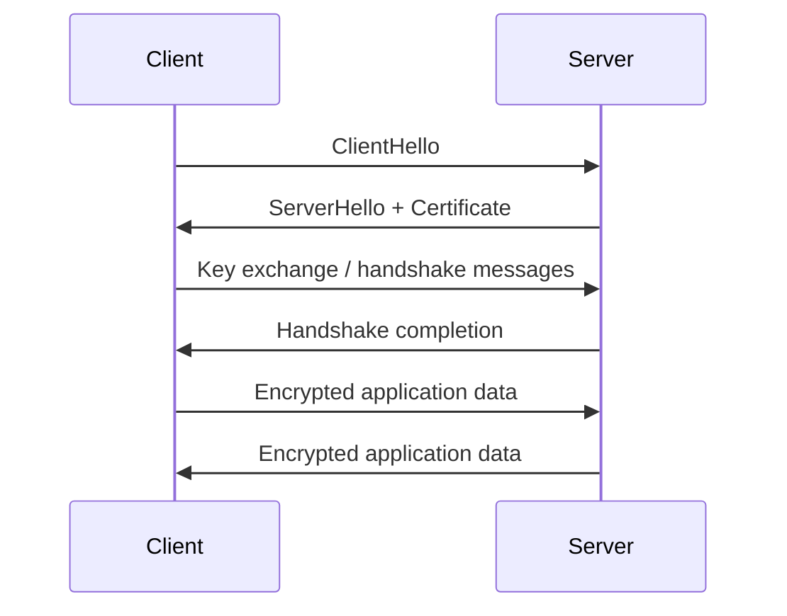
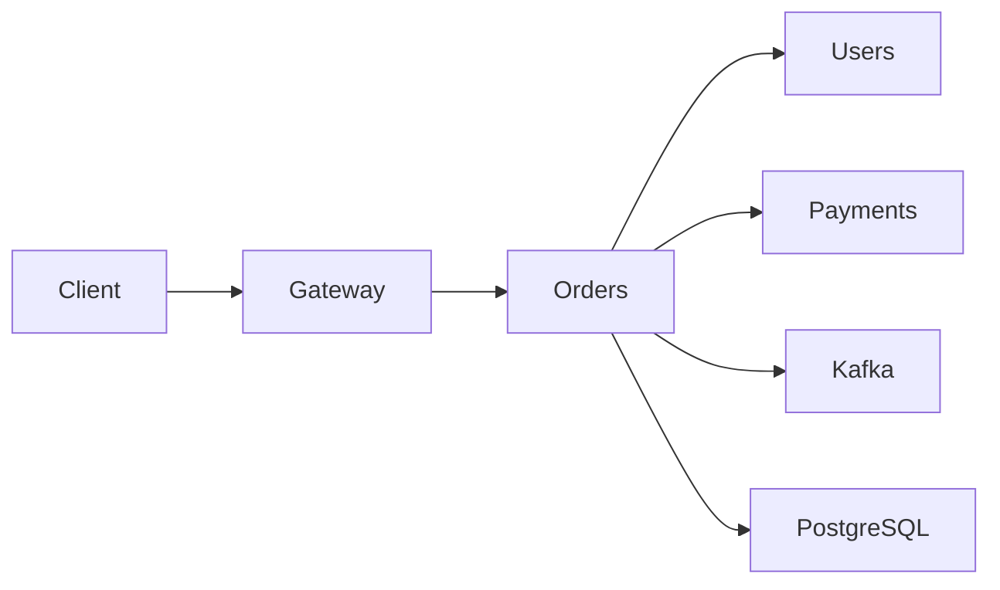
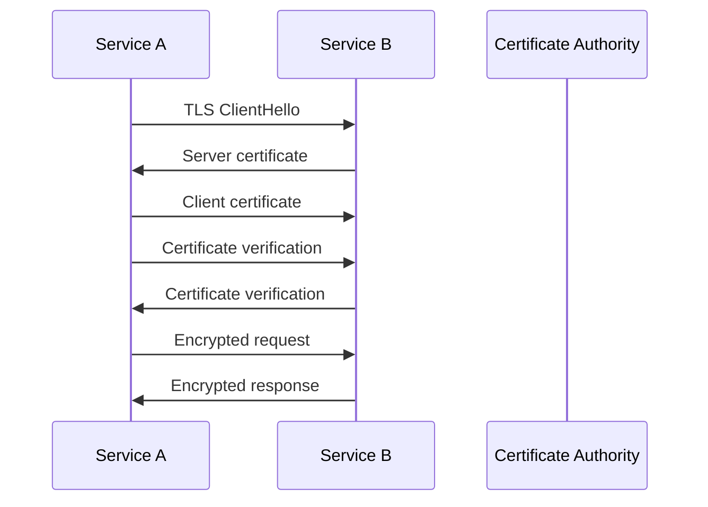
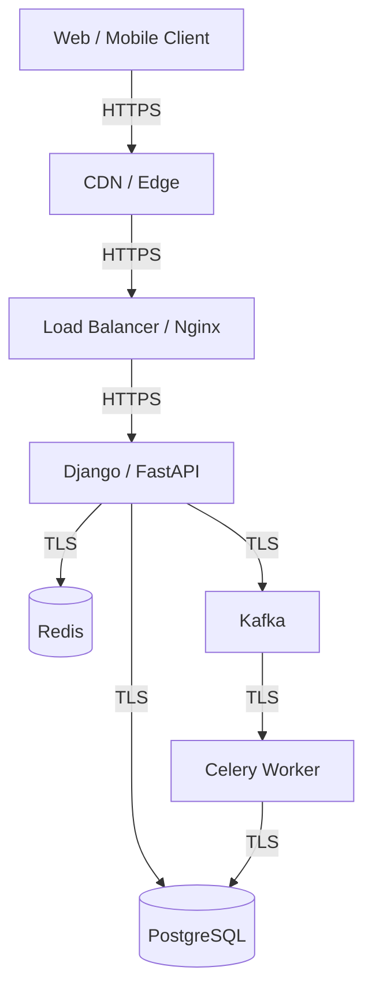

# 16- Encryption in Transit

## Overview

Encryption in transit protects data while it moves between clients, services, databases, queues, caches, and other networked systems.

For a production backend, sensitive data commonly crosses several network boundaries:

```text
Browser / Mobile Client
        ↓
Internet
        ↓
Load Balancer / Nginx
        ↓
Django / FastAPI
        ↓
PostgreSQL
        ↓
Redis / Kafka / Other Services
```

Every network hop is a potential interception boundary.

Encryption in transit primarily uses **TLS (Transport Layer Security)** to provide:

- Confidentiality
- Integrity
- Server authentication
- Optional client authentication

A secure architecture should distinguish:

```text
Encryption in transit
    ↓
Protects network communication

Encryption at rest
    ↓
Protects persistent storage

Authorization
    ↓
Controls who can access data

Authentication
    ↓
Establishes who is communicating
```

TLS is therefore one part of a broader defense-in-depth strategy.

---

## Why Encryption in Transit Matters

Without transport encryption, data can potentially be observed or modified while traveling across a network.

For example:

```text
Client
  ↓
Plain HTTP
  ↓
Network
  ↓
Application
```

An attacker positioned on the communication path may potentially observe:

```text
Credentials
Session cookies
API tokens
Personal data
Database queries
Response data
```

With TLS:

```text
Client
  ↓
Encrypted TLS connection
  ↓
Network
  ↓
Application
```

The network carries encrypted records rather than application plaintext.

---

## TLS

TLS is a cryptographic protocol used to secure network communication.

Modern production systems should use **TLS 1.2 or TLS 1.3**, with TLS 1.3 generally preferred where supported.

TLS provides three important properties:

| Property | Purpose |
|---|---|
| Confidentiality | Prevents passive observers from reading traffic |
| Integrity | Detects unauthorized modification |
| Authentication | Allows the client to verify the server identity |

TLS does not automatically determine whether an authenticated user is authorized to perform an operation.

---

## TLS Connection Lifecycle

A simplified TLS flow looks like:



Modern TLS uses asymmetric cryptography during the handshake and symmetric cryptography for bulk data transfer.

This combination provides both secure key establishment and efficient data encryption.

---

## TLS Handshake

A simplified TLS 1.3 handshake involves:

```text
Client
  ↓
ClientHello
  ↓
ServerHello + certificate
  ↓
Key agreement
  ↓
Certificate verification
  ↓
Handshake completion
  ↓
Encrypted application traffic
```

The exact wire-level behavior is more detailed, but the architectural principle is:

```text
Authenticate endpoint
        +
Establish shared session keys
        ↓
Encrypt application traffic
```

---

## Why Symmetric Encryption Is Used for Data

Asymmetric cryptography is computationally more expensive than symmetric cryptography.

TLS therefore typically uses:

```text
Asymmetric cryptography
        ↓
Authentication + key establishment

Symmetric cryptography
        ↓
Bulk application data
```

This allows secure communication without making every HTTP request depend on expensive asymmetric encryption operations.

---

## Certificates

A TLS certificate binds an identity to a public key.

A simplified certificate relationship is:

```text
Domain
  ↓
Certificate
  ↓
Public Key
  ↓
Certificate Authority signature
```

For example:

```text
api.example.com
```

can have a certificate proving that the public key belongs to that domain under the certificate authority's trust model.

---

## Certificate Authorities

A Certificate Authority (CA) issues certificates that clients can validate against their configured trust store.

The trust relationship is approximately:

```text
Operating System / Browser Trust Store
              ↓
       Trusted Root CA
              ↓
      Intermediate CA
              ↓
        Server Certificate
              ↓
       api.example.com
```

Clients validate the certificate chain before establishing trust.

---

## Certificate Validation

A client typically checks:

- Certificate chain
- Certificate validity period
- Hostname
- Signature
- Trusted CA
- Key usage/extensions
- Revocation-related signals where applicable

A certificate being mathematically valid is not sufficient.

It must also be valid for the intended endpoint.

---

## Hostname Verification

Suppose the client connects to:

```text
api.example.com
```

The certificate must be valid for that hostname.

Disabling hostname verification defeats an important part of TLS authentication.

Avoid configurations equivalent to:

```text
verify=False
```

in production clients unless there is an explicitly controlled and justified trust model.

---

## HTTPS

HTTPS is HTTP transported over TLS.

Architecture:

```text
HTTP
  ↓
TLS
  ↓
TCP
  ↓
IP
```

A production REST API should normally be exposed through HTTPS.

Example:

```text
https://api.example.com/orders
```

rather than:

```text
http://api.example.com/orders
```

---

## HTTP to HTTPS Redirect

Public HTTP endpoints can redirect clients to HTTPS:

```text
HTTP request
    ↓
301 / 308 redirect
    ↓
HTTPS request
```

However, redirects do not encrypt the initial HTTP request.

Sensitive clients should use HTTPS directly.

---

## HSTS

HTTP Strict Transport Security (HSTS) tells compatible browsers to use HTTPS for a domain.

Example header:

```http
Strict-Transport-Security: max-age=31536000; includeSubDomains
```

HSTS reduces downgrade and accidental-HTTP risks.

Production deployment requires careful consideration before using `includeSubDomains` because every covered subdomain must support HTTPS correctly.

---

## TLS Termination

TLS can terminate at different infrastructure layers.

A common architecture is:

```text
Client
   ↓ HTTPS
Load Balancer
   ↓ HTTP or HTTPS
Application
```

The load balancer decrypts TLS traffic before forwarding the request.

This is called TLS termination.

---

## TLS Termination vs End-to-End Encryption

### TLS Termination

```text
Client
   ↓ TLS
Load Balancer
   ↓ HTTP
Application
```

The internal network carries plaintext HTTP.

### Re-Encryption

```text
Client
   ↓ TLS
Load Balancer
   ↓ TLS
Application
```

TLS is terminated and then a new TLS connection is established to the application.

### End-to-End Application Encryption

For particularly sensitive data, additional application-level encryption can be used independently of TLS.

```text
Client
   ↓ TLS
Load Balancer
   ↓ TLS
Application
   ↓ encrypted payload
Database
```

The correct architecture depends on the trust boundaries.

---

## When to Use Internal TLS

Internal TLS is particularly valuable when traffic crosses:

- Availability zones
- VPC boundaries
- Shared infrastructure
- Service-mesh boundaries
- Untrusted or semi-trusted networks
- Organizational boundaries
- Compliance-required trust boundaries

A private network is not automatically an encryption boundary.

---

## Microservice Communication

A microservice architecture can contain many network hops:



Each connection may require independent transport-security decisions.

A production system should explicitly define:

```text
External TLS
Internal TLS
Service authentication
Certificate management
Trust relationships
```

---

## Service-to-Service TLS

For example:

```text
Order Service
    ↓ TLS
Payment Service
```

The client validates the payment service certificate.

The payment service can also authenticate the calling service using:

```text
mTLS
```

when mutual authentication is required.

---

## Mutual TLS

mTLS means both sides authenticate using certificates.

Normal TLS:

```text
Client ── verifies ──> Server
```

mTLS:

```text
Client ── verifies ──> Server
Server ── verifies ──> Client
```

This is useful for:

- Service-to-service communication
- Internal APIs
- High-trust environments
- Zero-trust architectures
- Service meshes

---

## mTLS Architecture



mTLS establishes transport-level identity, but application-level authorization is still required.

---

## mTLS Is Not Authorization

A certificate can establish:

```text
This request came from Service A
```

It does not automatically establish:

```text
Service A is allowed to delete customer data
```

Authorization remains a separate concern.

---

## Nginx TLS Configuration

Nginx can terminate HTTPS at the edge.

A simplified configuration is:

```nginx
server {
    listen 443 ssl;
    server_name api.example.com;

    ssl_certificate /etc/nginx/tls/fullchain.pem;
    ssl_certificate_key /etc/nginx/tls/privkey.pem;

    location / {
        proxy_pass http://application:8000;
        proxy_set_header Host $host;
        proxy_set_header X-Forwarded-Proto $scheme;
        proxy_set_header X-Forwarded-For $proxy_add_x_forwarded_for;
    }
}
```

Production configurations should use carefully reviewed TLS protocol, cipher, certificate, and header settings rather than copying arbitrary configurations from tutorials.

---

## TLS and Reverse Proxies

When TLS terminates at Nginx or a load balancer, the application needs to understand the original request scheme.

For example:

```text
Client
  ↓ HTTPS
Nginx
  ↓ HTTP
Django
```

The application may receive:

```text
X-Forwarded-Proto: https
```

and must be configured to trust forwarded headers only from trusted proxies.

Incorrect proxy configuration can cause:

- Incorrect redirects
- Insecure URL generation
- Broken secure-cookie behavior
- Incorrect CSRF handling

---

## Django HTTPS Configuration

Django applications commonly use settings such as:

```python
SECURE_SSL_REDIRECT = True
SESSION_COOKIE_SECURE = True
CSRF_COOKIE_SECURE = True
```

`SECURE_SSL_REDIRECT` should only be enabled when the deployment correctly communicates the original HTTPS scheme to Django through the trusted proxy configuration.

Production deployments should also configure:

- Secure cookies
- Trusted proxy behavior
- HSTS
- CSRF protection
- Correct `ALLOWED_HOSTS`

---

## FastAPI and HTTPS

FastAPI applications commonly run behind:

```text
ALB / Nginx / Ingress
        ↓
FastAPI
```

TLS is frequently terminated at the ingress layer.

The application should still correctly process forwarded scheme information when generating redirects, URLs, or security-sensitive behavior.

---

## REST APIs

All production APIs carrying credentials or sensitive data should use HTTPS.

Typical request flow:

```text
Client
   ↓ HTTPS
API Gateway / Nginx
   ↓
Django / FastAPI
   ↓
Service / Database
```

Never send:

```text
Authorization: Bearer ...
```

over plaintext HTTP.

---

## Cookies

Authentication cookies should normally use:

```http
Secure
HttpOnly
SameSite
```

The `Secure` attribute ensures browsers send the cookie only over HTTPS.

`HttpOnly` helps prevent JavaScript from directly reading the cookie.

`SameSite` controls cross-site cookie behavior.

TLS does not replace these cookie-level protections.

---

## Authorization Headers

Bearer tokens should only be transmitted over secure channels.

Example:

```http
Authorization: Bearer <access-token>
```

Transport encryption protects the token while it travels across the network.

It does not protect against:

- Malicious browser extensions
- Compromised clients
- Server-side token leakage
- Logging the token
- Improper token storage

---

## Database TLS

Application-to-PostgreSQL traffic can also use TLS.

Architecture:

```text
Django / FastAPI
       ↓ TLS
PostgreSQL
```

This is particularly important when database traffic crosses:

- VPC boundaries
- Availability zones
- Regions
- Shared networks
- Service networks

---

## PostgreSQL SSL Configuration

A PostgreSQL client can require encrypted connections.

With `psql`, for example:

```bash
psql "host=db.example.com dbname=app user=app_runtime sslmode=require"
```

For stronger server identity verification, use a verification mode such as:

```text
sslmode=verify-full
```

with the appropriate CA trust configuration.

`require` encrypts the connection but does not provide the same hostname/certificate validation guarantees as `verify-full`.

---

## PostgreSQL Certificate Verification

For production database clients, distinguish between:

```text
Encryption only
```

and:

```text
Encryption + server identity verification
```

A stronger trust model validates:

```text
Certificate chain
+
Expected hostname
```

This helps prevent connecting securely to the wrong server.

---

## Python PostgreSQL Clients

Python PostgreSQL drivers such as psycopg can use TLS configuration through the connection parameters.

For example:

```python
import psycopg

conn = psycopg.connect(
    "host=db.example.com "
    "dbname=app "
    "user=app_runtime "
    "password=secret "
    "sslmode=verify-full "
    "sslrootcert=/etc/ssl/certs/company-ca.pem"
)
```

Production credentials should come from a secret-management system rather than source code.

---

## Connection Pooling

Connection pooling changes connection lifecycle but not the need for TLS.

```text
Application
    ↓
Connection Pool
    ↓
TLS connection
    ↓
PostgreSQL
```

Persistent connections can reduce TLS handshake overhead because connections are reused.

However, stale connections, certificate rotation, and pool lifecycle still need operational consideration.

---

## PgBouncer

When PgBouncer sits between the application and PostgreSQL:

```text
Application
    ↓
TLS
    ↓
PgBouncer
    ↓
TLS where configured
    ↓
PostgreSQL
```

TLS should be configured according to the trust boundaries on both connections.

Do not assume that encrypting only the client-to-PgBouncer connection automatically encrypts the PgBouncer-to-PostgreSQL connection.

---

## gRPC

gRPC commonly uses HTTP/2 and can run over TLS.

Architecture:

```text
Service A
    ↓ HTTP/2 + TLS
Service B
```

gRPC also supports mTLS for stronger service identity.

Transport encryption is particularly important for internal microservice communication because service traffic frequently contains:

- Customer data
- Authentication metadata
- Internal identifiers
- Business information

---

## Kafka TLS

Kafka supports TLS for broker/client communication.

Conceptually:

```text
Producer
   ↓ TLS
Kafka Broker
   ↓ TLS
Consumer
```

Kafka can also use TLS with client authentication and authorization mechanisms.

A production Kafka security model should define:

```text
Encryption
+
Authentication
+
Authorization
+
Topic-level access
```

TLS alone does not determine which topics a service can consume or produce.

---

## Redis TLS

Redis deployments can support TLS.

Architecture:

```text
Application
    ↓ TLS
Redis
```

This is useful when Redis traffic crosses infrastructure boundaries where plaintext communication is not acceptable.

Authentication and authorization remain separate controls.

---

## Celery and Message Brokers

Celery workers communicate through a broker such as Redis or RabbitMQ.

A secure flow can be:

```text
Django / FastAPI
      ↓ TLS
Message Broker
      ↓ TLS
Celery Worker
```

Sensitive task data should still be minimized.

TLS protects the message while in transit; it does not prevent an authorized broker consumer from reading the message.

---

## AWS Load Balancers

AWS load balancers commonly terminate TLS at the edge.

Typical architecture:

```text
Internet
   ↓ HTTPS
Application Load Balancer
   ↓
Application
```

For stronger internal transport protection:

```text
Internet
   ↓ HTTPS
ALB
   ↓ HTTPS
Application
```

Certificate management can be integrated with AWS Certificate Manager.

---

## AWS Certificate Manager

AWS Certificate Manager (ACM) can manage certificates used by supported AWS services.

A common architecture is:

```text
ACM
 ↓
Certificate
 ↓
ALB / CloudFront
 ↓
HTTPS
 ↓
Application
```

Managed certificate lifecycle reduces manual renewal work.

The exact service integration depends on the AWS architecture.

---

## Kubernetes Ingress

Kubernetes ingress controllers commonly terminate TLS.

```text
Client
   ↓ HTTPS
Ingress
   ↓
Service
   ↓
Pod
```

For internal TLS:

```text
Ingress
   ↓ HTTPS
Service
   ↓ HTTPS
Pod
```

Certificate management can be automated using mechanisms such as cert-manager where appropriate.

---

## Certificate Rotation

Certificates expire.

A production system must support:

```text
Issue
  ↓
Deploy
  ↓
Validate
  ↓
Rotate
  ↓
Retire old certificate
```

Manual certificate replacement is error-prone.

Automated certificate renewal is strongly preferred.

---

## Zero-Downtime Certificate Rotation

A safe rotation strategy allows both old and new certificates to coexist during deployment when necessary.

For example:

```text
Certificate A
     ↓
Running service
     ↓
Deploy Certificate B
     ↓
Validate
     ↓
Remove Certificate A
```

Avoid replacing certificates in a way that causes every instance to lose TLS capability simultaneously.

---

## Private Certificate Authorities

Internal services may use a private CA.

Example:

```text
Internal CA
   ↓
Service A certificate
Service B certificate
Service C certificate
```

This is common for:

- mTLS
- Internal APIs
- Service meshes
- Private infrastructure

Private CAs require strong lifecycle and trust-store management.

---

## Service Mesh

A service mesh can automate internal TLS and service identity.

Conceptually:

```text
Service A
   ↓
Sidecar / proxy
   ↓ mTLS
Sidecar / proxy
   ↓
Service B
```

The application may not need to implement certificate handling directly.

Service meshes can provide:

- mTLS
- Certificate rotation
- Service identity
- Traffic policies
- Observability

However, they add operational complexity and should be introduced when their capabilities justify the cost.

---

## Certificate Pinning

Certificate pinning makes a client trust a narrower set of certificates or public keys than the normal CA trust model.

It can provide additional protection against certain trust-store compromise scenarios.

However, aggressive pinning can cause outages when certificates are rotated incorrectly.

For most browser-based web applications, standard CA validation with proper certificate lifecycle management is generally preferable.

---

## TLS Version Selection

Prefer modern protocol versions.

A practical baseline is:

```text
TLS 1.3 preferred
TLS 1.2 when required for compatibility
```

Avoid obsolete protocols such as:

```text
SSLv2
SSLv3
TLS 1.0
TLS 1.1
```

unless an exceptional legacy requirement exists and the risk is explicitly accepted.

---

## Cipher Suites

Modern TLS implementations negotiate secure cipher suites automatically.

Avoid manually maintaining large cipher lists unless there is a specific operational requirement.

Prefer well-supported modern configurations and regularly review them against current security guidance.

---

## TLS Performance

TLS introduces:

- Handshake CPU cost
- Cryptographic operations
- Connection-establishment latency

Connection reuse significantly reduces repeated handshake overhead.

This makes:

```text
Connection pooling
Keep-alive
HTTP/2
HTTP/3 where appropriate
```

important performance considerations.

TLS should not normally be disabled merely to reduce latency.

---

## TLS and High Traffic Systems

At scale:

```text
Millions of HTTPS requests
```

can create significant TLS workload.

Use:

- Connection reuse
- HTTP/2 or HTTP/3 where appropriate
- Load balancers
- Efficient TLS implementations
- Session resumption
- Proper certificate management

Modern hardware and TLS implementations make encrypted transport practical at large scale.

---

## TLS Session Resumption

TLS session resumption allows clients and servers to avoid performing a complete handshake for every new connection.

This reduces:

```text
Handshake latency
CPU usage
Connection establishment overhead
```

It is particularly useful for high-volume services with frequent connection creation.

---

## HTTP Keep-Alive

Persistent HTTP connections reduce repeated:

```text
TCP handshake
+
TLS handshake
```

overhead.

Architecture:

```text
Connection established
        ↓
TLS handshake
        ↓
Request 1
        ↓
Request 2
        ↓
Request 3
        ↓
Connection reused
```

Connection reuse is therefore both a performance and scalability concern.

---

## TLS and Connection Pooling

For database-backed services:

```text
Application workers
       ↓
Connection pool
       ↓
Reusable TLS connections
       ↓
PostgreSQL
```

Pool sizing should still be based on database capacity.

TLS does not justify creating excessive database connections.

---

## Forward Secrecy

Modern TLS key-exchange mechanisms provide forward secrecy.

The goal is:

```text
Compromise of long-term private key
        ↓
Should not allow historical session traffic
        ↓
to be trivially decrypted
```

This is an important property of modern secure TLS configurations.

---

## Certificate Private Keys

A server's TLS private key is highly sensitive.

Protect it using:

- Restricted filesystem permissions
- Secret-management systems
- Managed certificate services
- Kubernetes secrets with appropriate controls
- Hardware-backed key storage where required

Never commit private keys to source control.

---

## Secrets in TLS Configuration

Avoid:

```text
Git repository
    ↓
private key
```

and:

```text
Docker image
    ↓
TLS private key
```

Prefer:

```text
Secret / Certificate Manager
       ↓
Runtime
       ↓
TLS endpoint
```

---

## Observability

TLS failures should be observable.

Monitor:

- Certificate expiration
- Handshake failures
- TLS negotiation errors
- Certificate validation failures
- Unexpected protocol versions
- mTLS authentication failures
- Connection churn
- TLS-related latency

Do not log private keys or complete sensitive TLS credentials.

---

## Certificate Expiration Monitoring

Certificate expiration should be detected before it becomes an outage.

A useful operational threshold might be:

```text
90 days
30 days
7 days
1 day
```

The exact thresholds depend on the certificate lifecycle.

Automated renewal should be combined with monitoring rather than treated as infallible.

---

## Testing TLS

Production-like environments should test:

```text
Valid certificate
Expired certificate
Wrong hostname
Untrusted CA
Missing client certificate
Invalid client certificate
Unsupported TLS version
Certificate rotation
```

This catches configuration failures before production traffic is affected.

---

## Security Testing

Useful checks include:

- Verify HTTPS-only access
- Verify certificate hostname
- Verify certificate chain
- Verify TLS 1.2/1.3 support
- Verify deprecated protocols are disabled
- Verify HTTP redirects or blocking behavior
- Verify secure cookies
- Verify database TLS
- Verify internal-service TLS requirements
- Verify mTLS where required

---

## Common Mistakes

### Disabling Certificate Verification

For example:

```python
requests.get(url, verify=False)
```

**Problem:** The connection may be encrypted, but the client no longer properly authenticates the server.

**Better:** Configure the correct CA trust chain and hostname verification.

### Assuming HTTPS Means Everything Is Secure

**Problem:** HTTPS protects transport but does not provide authorization or protect sensitive data already exposed through the application.

**Better:** Combine TLS with authentication, authorization, secure storage, and least privilege.

### Encrypting Only External Traffic

**Problem:** Internal service traffic may cross trust boundaries in Kubernetes, cloud networks, or shared infrastructure.

**Better:** Explicitly define internal TLS requirements.

### Terminating TLS and Using Plain HTTP Everywhere Internally

**Problem:** Internal networks are treated as implicitly trusted.

**Better:** Re-encrypt traffic when internal trust boundaries require it.

### Forgetting Database Connections

**Problem:** API traffic is encrypted but application-to-PostgreSQL traffic is plaintext.

**Better:** Evaluate every network hop independently.

### Ignoring Redis and Kafka

**Problem:** Sensitive data may travel through internal brokers and caches without transport encryption.

**Better:** Configure TLS where required and minimize sensitive payloads.

### Manual Certificate Renewal

**Problem:** Certificates eventually expire and cause production outages.

**Better:** Automate issuance and renewal and monitor expiration.

### Logging TLS Credentials

**Problem:** Private keys, client certificates, or tokens can become accessible through centralized logging.

**Better:** Never log private key material or sensitive authentication credentials.

### Using Obsolete TLS Versions

**Problem:** Legacy protocols have known weaknesses.

**Better:** Standardize on modern TLS versions and remove obsolete protocols.

### Treating mTLS as Authorization

**Problem:** A valid client certificate proves service identity but does not define business permissions.

**Better:** Combine mTLS with application-level authorization.

---

## Production Checklist

- [ ] Public APIs use HTTPS.
- [ ] TLS 1.2/1.3 are supported according to compatibility requirements.
- [ ] Obsolete SSL/TLS versions are disabled.
- [ ] Certificates are issued by trusted authorities or an appropriately managed private CA.
- [ ] Hostname verification is enabled.
- [ ] Certificate validation is not disabled in production clients.
- [ ] TLS private keys are protected.
- [ ] Certificate renewal is automated where practical.
- [ ] Certificate expiration is monitored.
- [ ] Database connections use appropriate TLS.
- [ ] PostgreSQL clients use certificate verification where required.
- [ ] Redis connections use TLS where required.
- [ ] Kafka connections use TLS where required.
- [ ] gRPC service communication uses TLS.
- [ ] Internal service traffic has an explicit transport-security policy.
- [ ] mTLS is used where mutual service identity is required.
- [ ] Secure cookies are enabled for HTTPS applications.
- [ ] Proxy forwarding headers are trusted only from trusted proxies.
- [ ] TLS termination architecture is documented.
- [ ] Certificate rotation is tested.
- [ ] Failover preserves TLS configuration.
- [ ] DR environments can access required certificates and trust stores.
- [ ] TLS failures are observable.
- [ ] Private keys and certificates are not committed to source control.
- [ ] Container images do not contain long-lived TLS private keys.
- [ ] CI/CD validates important TLS configuration.
- [ ] Security testing covers certificate and protocol failures.

---

## Production Architecture

A typical cloud-native backend may use:



The exact topology can vary, but the important engineering principle is:

```text
Identify every network hop
        ↓
Define its trust boundary
        ↓
Choose TLS requirements
        ↓
Configure certificate validation
        ↓
Automate certificate lifecycle
        ↓
Monitor failures and expiration
```

---

## Senior-Level Design Considerations

When designing encryption in transit, ask:

### Where does traffic cross a trust boundary?

Examples:

```text
Internet
VPC
Availability Zone
Region
Cluster
Namespace
Service
Database
Third-party API
```

### Where does TLS terminate?

Document whether TLS ends at:

```text
CDN
Load balancer
Nginx
Ingress
Service proxy
Application
```

### Is the next hop trusted?

If not:

```text
Terminate TLS
      ↓
Re-encrypt
```

### How are service identities established?

Possible mechanisms include:

```text
Server certificates
mTLS
Workload identity
Cloud IAM
Service mesh identity
```

### How are certificates rotated?

The system should support rotation without unnecessary downtime.

### What happens during failure?

Consider:

```text
Expired certificate
CA outage
Bad deployment
Invalid trust store
Missing secret
Certificate mismatch
```

### Does DR preserve the trust model?

A failover system should not silently downgrade from:

```text
TLS
```

to:

```text
Plaintext
```

---

## Encryption in Transit Decision Framework

```text
Is data crossing a network?
        │
        ├── No → No transport encryption required
        │
        └── Yes
             ↓
        Is the network trusted?
             │
             ├── No → TLS required
             │
             └── Partially trusted
                    ↓
                Evaluate TLS
                    ↓
        Is mutual identity required?
             │
             ├── No → Server-authenticated TLS
             │
             └── Yes → mTLS
                    ↓
        Automate certificates
                    ↓
        Monitor expiration and failures
```

Do not classify an entire VPC, Kubernetes cluster, or internal network as permanently trusted without evaluating the actual threat model.

---

## Interview Traps

### What does TLS provide?

TLS provides confidentiality, integrity, and endpoint authentication under its trust model.

### Does TLS encrypt data at rest?

No. TLS protects data while it is in transit. Storage encryption protects persistent data.

### Is HTTPS the same as TLS?

HTTPS is HTTP transported over TLS.

### Why does TLS use both asymmetric and symmetric cryptography?

Asymmetric cryptography is used for authentication and key establishment, while symmetric cryptography efficiently protects bulk application traffic.

### Is an encrypted connection automatically secure?

No. A client can establish encrypted communication with a server and still have authorization, application, credential, or configuration vulnerabilities.

### Is `sslmode=require` the same as `verify-full` in PostgreSQL?

No. `require` provides encrypted transport but does not provide the same certificate and hostname verification guarantees as `verify-full`.

### Should internal microservices use TLS?

It depends on the trust model, but modern production architectures frequently use internal TLS and, where appropriate, mTLS to protect traffic and establish workload identity.

### Does mTLS replace authorization?

No. mTLS establishes transport-level identity. Application authorization still determines what that identity is allowed to do.

### Why is certificate rotation an operational concern?

Expired or incorrectly rotated certificates can cause widespread outages even when the application itself is healthy.

### Why is TLS relevant to connection pooling?

Reusing connections avoids repeated TCP and TLS handshakes, reducing latency and CPU overhead while maintaining encrypted communication.

### What happens when TLS terminates at a load balancer?

Traffic between the client and load balancer is encrypted. The load balancer-to-application connection must be evaluated separately and can use either plaintext or another TLS connection depending on the trust boundary.

### What is the senior-level view of encryption in transit?

Treat every network hop as an explicit security boundary. Define TLS termination, certificate trust, service identity, internal encryption, certificate rotation, observability, HA, and DR behavior rather than assuming that "HTTPS at the load balancer" secures the entire system.

## Key Takeaways

- **TLS protects data in transit through confidentiality, integrity, and endpoint authentication**, but it does not replace authorization, secure storage, or application security.
- **Every network hop should be evaluated independently**: client-to-edge, service-to-service, application-to-PostgreSQL, Redis, Kafka, gRPC, and other external integrations may require TLS.
- **Certificate validation and lifecycle management are critical**; disabling verification or allowing certificates to expire can turn encrypted transport into either a security vulnerability or an outage.
- **Internal TLS and mTLS are architectural controls**, especially useful across service trust boundaries and for establishing workload identity in microservice environments.
- **Senior-level transport security includes operations**, covering TLS termination, connection reuse, certificate rotation, monitoring, HA, DR, proxy configuration, and automated CI/CD validation.