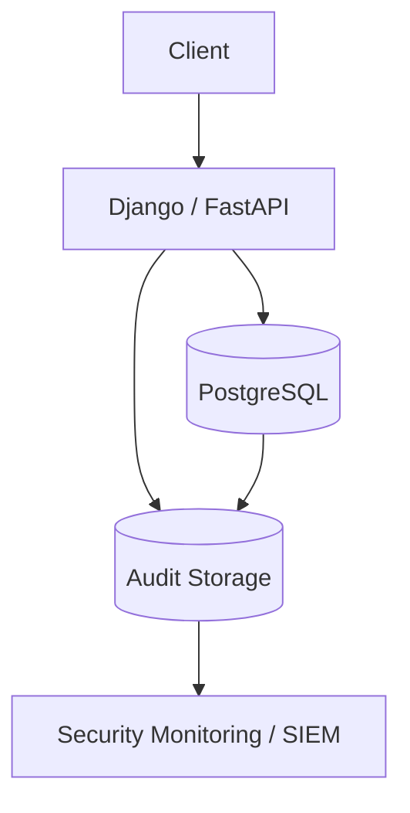
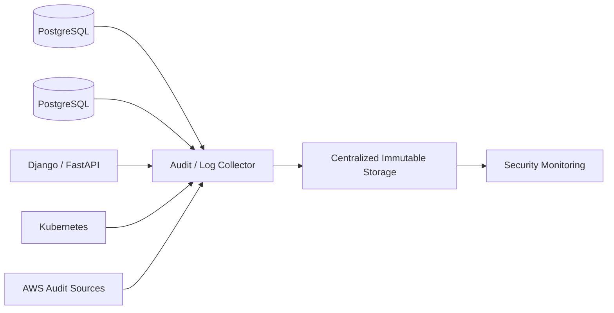
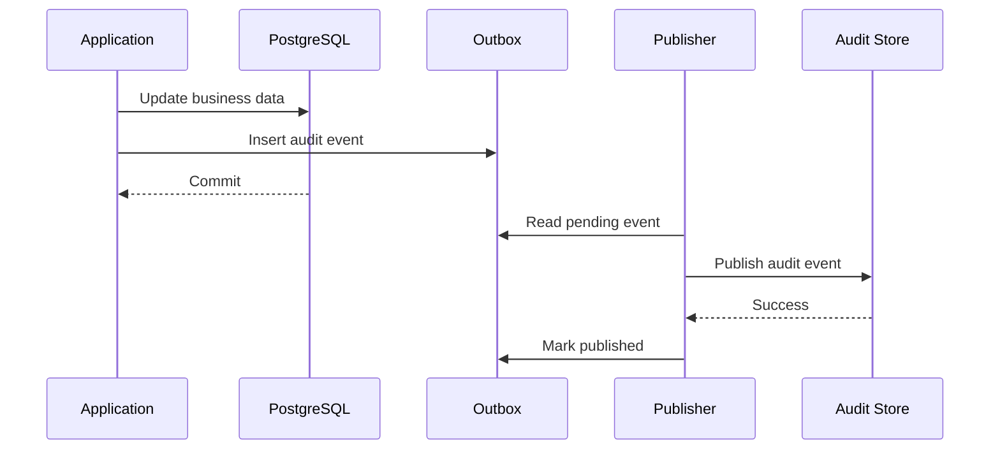
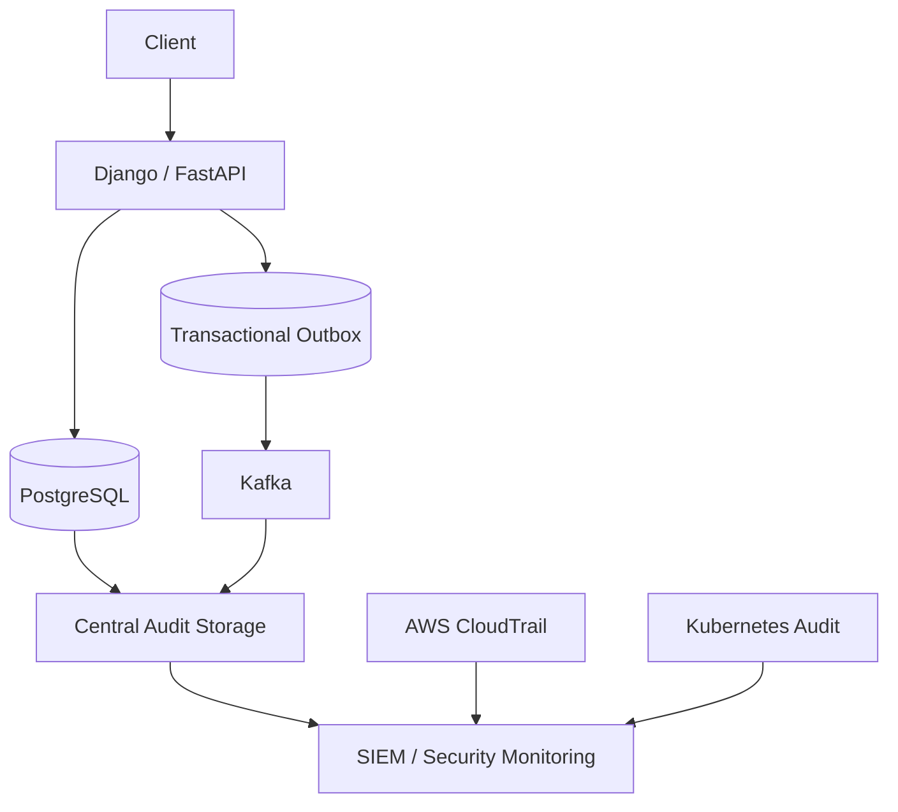

# 18- Database Auditing

## Overview

Database auditing is the systematic recording and analysis of database activity so an organization can determine:

- Who accessed or changed data
- What operation occurred
- Which object was affected
- When the operation occurred
- Whether the operation succeeded
- Which application or service initiated it
- Whether the activity was expected

Auditing is different from ordinary application logging.

```text
Application logging
    ↓
Helps operate and debug the application

Database auditing
    ↓
Provides evidence of database activity and security-relevant operations
```

For production SQL systems, auditing is particularly important for:

- Sensitive data
- Privileged operations
- Permission changes
- Administrative activity
- Compliance requirements
- Security investigations
- Incident response
- Change tracking

A mature auditing architecture does not attempt to record everything indiscriminately. It records the events necessary to answer security, operational, and compliance questions while controlling performance, storage, and sensitive-data exposure.

---

## Why Database Auditing Matters

Without auditing, a production incident may leave questions such as:

```text
Who changed this record?
When did it happen?
Which application performed it?
Was the operation authorized?
What changed?
Was the change part of a deployment?
```

Auditing provides evidence that helps answer these questions.

For example:

```text
Security alert
    ↓
Audit event
    ↓
Database role = app_admin
    ↓
Operation = UPDATE
    ↓
Table = customer_accounts
    ↓
Timestamp = ...
    ↓
Request ID = ...
```

This can significantly reduce incident investigation time.

---

## Auditing vs Logging vs Monitoring

These concepts overlap but solve different problems.

| Capability | Primary purpose |
|---|---|
| Application logging | Application behavior and diagnostics |
| Database logging | Database/server activity |
| Database auditing | Security and accountability evidence |
| Metrics | Quantitative system health |
| Tracing | End-to-end request flow |
| Monitoring | Detecting operational/security conditions |
| Change Data Capture | Capturing data changes for downstream processing |

A single production system may use all of them.

---

## Audit Events

An audit event should answer the basic questions:

```text
Who?
What?
When?
Where?
Which object?
What was the result?
Why / request context?
```

A useful audit record might contain:

```text
timestamp
database
schema
table
operation
database_user
application_user
application_name
client_address
request_id
transaction_id
success/failure
```

For sensitive systems, the exact fields should be driven by the audit requirements.

---

## Audit Event Example

Conceptually:

```json
{
  "timestamp": "2026-09-04T12:00:00Z",
  "database_user": "app_runtime",
  "application_user": "user-123",
  "operation": "UPDATE",
  "schema": "public",
  "table": "customer_accounts",
  "record_id": "456",
  "request_id": "req-789",
  "result": "success"
}
```

The important principle is that an audit event should contain enough context to establish accountability without unnecessarily storing sensitive values.

---

## What Should Be Audited?

Typical high-value audit events include:

### Authentication

```text
Database login
Authentication failure
Connection termination
```

### Authorization

```text
Role creation
Role membership changes
GRANT
REVOKE
Privilege changes
```

### Data Access

```text
Sensitive table reads
Sensitive exports
Privileged queries
```

### Data Modification

```text
INSERT
UPDATE
DELETE
```

### Schema Changes

```text
CREATE
ALTER
DROP
```

### Administrative Operations

```text
Configuration changes
Extension changes
Replication changes
Backup operations
```

Not every environment needs all categories at the same level of detail.

---

## Audit Scope

A practical auditing model is:

```text
All systems
    ↓
Basic operational logging

Sensitive tables
    ↓
Detailed access auditing

Privileged roles
    ↓
Detailed administrative auditing

Critical changes
    ↓
Strong audit + alerting
```

This avoids generating enormous audit volumes unnecessarily.

---

## Application-Level Auditing

An application can record business-level events.

For example:

```text
User 123
    ↓
Changed customer email
    ↓
Order service
    ↓
Request ID 456
```

Application auditing understands business context that PostgreSQL does not necessarily know.

For example:

```text
"Customer changed email address"
```

is more meaningful than:

```text
UPDATE customers SET email = ...
```

---

## Database-Level Auditing

Database-level auditing observes database operations directly.

It can capture activity such as:

```text
Role
SQL operation
Table
Database
Client
Timestamp
```

Database auditing is valuable because it provides a control independent of the application.

If someone connects directly to PostgreSQL, application-level auditing may never see the operation.

---

## Defense in Depth

A mature system can use both:

```text
Application audit
       +
Database audit
       +
Infrastructure audit
```

For example:



Application auditing captures business intent.

Database auditing captures database activity.

Infrastructure auditing captures platform activity.

---

## PostgreSQL Auditing

PostgreSQL provides several built-in mechanisms useful for auditing, including:

- Server logs
- Connection logging
- Statement logging
- Role and privilege metadata
- Statistics views
- Extensions such as `pgaudit`

For detailed audit trails, `pgaudit` is commonly used where its capabilities fit the organization's requirements.

---

## PostgreSQL Logging

PostgreSQL can log various classes of database activity.

Examples include:

```text
Connection events
Disconnections
DDL
Statements
Errors
Checkpoint activity
```

Logging configuration should be carefully designed because overly broad statement logging can create significant volume and potentially expose sensitive data.

---

## Statement Logging

PostgreSQL provides the `log_statement` configuration parameter.

Possible levels include:

```text
none
ddl
mod
all
```

For example:

```sql
SHOW log_statement;
```

A highly verbose setting such as:

```text
all
```

can generate substantial log volume and may capture sensitive SQL values.

It should not be enabled blindly in production.

---

## Duration Logging

PostgreSQL can log query durations.

This can help correlate database activity with performance investigations.

For example:

```sql
SHOW log_min_duration_statement;
```

Duration logging is primarily a performance/diagnostic mechanism rather than a complete audit solution.

---

## Connection Logging

PostgreSQL can record connection activity.

Relevant settings include:

```sql
SHOW log_connections;
SHOW log_disconnections;
```

This can help identify:

```text
Unexpected clients
Connection churn
Authentication patterns
Service behavior
```

Connection logs should still be correlated with identity and infrastructure metadata.

---

## Audit Extensions

The `pgaudit` extension provides more structured PostgreSQL audit capabilities than relying only on general server statement logging.

It can be configured to audit categories such as:

- READ
- WRITE
- FUNCTION
- ROLE
- DDL
- MISC

The exact supported configuration depends on the installed PostgreSQL and `pgaudit` versions.

---

## pgaudit Example

A simplified configuration might include:

```conf
shared_preload_libraries = 'pgaudit'
pgaudit.log = 'write,ddl,role'
```

The extension generally requires server-level configuration and a restart when `shared_preload_libraries` changes.

Do not copy an audit configuration into production without evaluating:

- Required audit scope
- Log volume
- Sensitive data exposure
- Storage capacity
- Performance impact
- Retention
- Centralization

---

## Audit Logging and Sensitive Data

Auditing can itself become a data-leak mechanism.

For example:

```sql
UPDATE customers
SET government_id = '123456789'
WHERE id = 100;
```

If complete SQL statements are recorded, the sensitive value may appear in logs.

Therefore:

```text
Audit requirement
       +
Sensitive-data policy
       ↓
Safe audit configuration
```

Never assume that more audit data is always better.

---

## Audit Data Minimization

Prefer recording:

```text
table
operation
record identifier
actor
timestamp
request ID
result
```

over:

```text
complete SQL statement
complete request payload
complete before/after record
```

unless the latter is explicitly required.

Audit records should follow the same data-minimization principles as application data.

---

## Before and After Values

Some systems require knowing exactly what changed.

For example:

```text
email:
    old = old@example.com
    new = new@example.com
```

This provides stronger change accountability.

However, storing before/after values can significantly increase:

- Storage
- Privacy risk
- Audit complexity
- Sensitive-data exposure

Use field-level change capture selectively.

---

## Database Audit Table

An application-controlled audit table might look like:

```sql
CREATE TABLE audit_events (
    id bigint GENERATED ALWAYS AS IDENTITY PRIMARY KEY,
    occurred_at timestamptz NOT NULL DEFAULT now(),
    actor_id uuid,
    action text NOT NULL,
    resource_type text NOT NULL,
    resource_id text,
    request_id text,
    metadata jsonb
);
```

This is useful for business-level auditing.

It should not be treated as a complete replacement for database/server-level auditing.

---

## Audit Table Design

Useful fields include:

| Field | Purpose |
|---|---|
| `occurred_at` | Event timestamp |
| `actor_id` | Application identity |
| `action` | Business operation |
| `resource_type` | Resource category |
| `resource_id` | Affected resource |
| `request_id` | Correlation |
| `metadata` | Controlled contextual information |

Avoid allowing arbitrary application payloads into `metadata`.

Otherwise the audit table can become an uncontrolled sensitive-data store.

---

## Immutable Audit Records

Audit data should normally be append-oriented.

Preferred:

```text
INSERT audit event
```

Avoid allowing ordinary application roles to:

```text
UPDATE audit history
DELETE audit history
```

The goal is to make historical evidence difficult to tamper with.

---

## Audit Table Permissions

A strong design separates:

```text
Application runtime
    ↓
Can INSERT audit records

Audit reader
    ↓
Can SELECT audit records

Audit administrator
    ↓
Controlled administrative access
```

The runtime role should not automatically be able to erase its own audit history.

---

## Audit Database Separation

For high-security environments, audit data may be stored separately:

```text
Production PostgreSQL
        ↓
Audit pipeline
        ↓
Dedicated audit storage
        ↓
Security platform / SIEM
```

This improves isolation.

If an attacker compromises the primary database, they should not automatically gain unrestricted access to historical audit records.

---

## Centralized Audit Storage

Centralized logging is useful when multiple services and databases exist.



This creates a common security-observability layer.

---

## Request Correlation

Database audit events are much more useful when correlated with application requests.

For example:

```text
HTTP request
    ↓
request_id = abc-123
    ↓
Django
    ↓
PostgreSQL
    ↓
audit event
    ↓
request_id = abc-123
```

This allows investigators to trace:

```text
User action
    ↓
API request
    ↓
Application
    ↓
Database operation
```

---

## PostgreSQL Application Name

PostgreSQL connections can identify the application using `application_name`.

For example:

```text
application_name=orders-api
```

This helps distinguish:

```text
orders-api
billing-worker
reporting-service
migration-job
```

in database logs and monitoring systems.

---

## Database User vs Application User

A database connection may identify:

```text
database_user = app_runtime
```

while the business actor is:

```text
application_user = user-123
```

These are different identities.

A useful audit trail should preserve both where required.

```text
Database identity
+
Application identity
+
Request identity
```

This is particularly important in shared database environments.

---

## Transactions and Auditing

Audit events should reflect transaction semantics correctly.

Consider:

```text
BEGIN
UPDATE customer
INSERT audit_event
ROLLBACK
```

If the audit event is stored in the same transaction, both the data change and audit record roll back.

This is usually desirable when the audit represents a committed database state.

---

## Transactional Audit Records

For business-level auditing:

```sql
BEGIN;

UPDATE customers
SET email = $1
WHERE id = $2;

INSERT INTO audit_events (
    actor_id,
    action,
    resource_type,
    resource_id
)
VALUES (
    $3,
    'customer.email_changed',
    'customer',
    $2
);

COMMIT;
```

This keeps the business change and audit record atomic.

---

## Audit Events and `on_commit`

If an application needs to publish an audit event externally, avoid sending it before the transaction commits.

A common pattern is:

```text
Database transaction
       ↓
Business change
       +
Outbox event
       ↓
COMMIT
       ↓
Background publisher
       ↓
Audit platform
```

Django's `transaction.on_commit()` can also be useful for actions that should occur only after successful commit, although it does not itself provide durable event storage.

---

## Transactional Outbox for Auditing

For durable asynchronous audit delivery:



This avoids the dual-write problem:

```text
Database commit succeeds
+
Audit publish fails
```

because the event is durably recorded in the same transaction.

---

## Database Triggers

Triggers can automatically create audit records.

Example:

```sql
CREATE FUNCTION audit_customer_update()
RETURNS trigger
LANGUAGE plpgsql
AS $$
BEGIN
    INSERT INTO audit_events (
        action,
        resource_type,
        resource_id
    )
    VALUES (
        'customer.updated',
        'customer',
        OLD.id::text
    );

    RETURN NEW;
END;
$$;
```

A trigger can then be attached to a table.

---

## Advantages of Triggers

Triggers are useful when:

- Every modification must be captured
- Multiple applications access the same table
- Audit enforcement should exist at the database boundary
- Application code should not be trusted to remember auditing

The major advantage is coverage.

If five services modify the table, the trigger can audit all five.

---

## Limitations of Triggers

Triggers can introduce:

- Hidden application behavior
- Additional write latency
- Operational complexity
- Difficult migrations
- Audit volume
- Transaction coupling

Triggers should therefore be used deliberately.

They are particularly useful for database-enforced invariants and high-value audit requirements, but not every business event needs a trigger.

---

## Trigger Context

Database triggers may not automatically know:

```text
End-user identity
HTTP request ID
Business reason
```

They may know:

```text
Database role
Session
Transaction
Row
Operation
```

Applications can propagate context using carefully controlled session settings where appropriate.

---

## Session Context

A backend can set contextual information for a transaction.

For example:

```sql
SET LOCAL app.user_id = '123';
SET LOCAL app.request_id = 'req-456';
```

A trigger can then read the values.

This can support correlation between database activity and application activity.

---

## Connection Pooling and Session Context

Pooled database connections create an important security consideration.

Avoid setting request-specific context permanently:

```sql
SET app.user_id = '123';
```

because the connection may later be reused for another request.

Prefer transaction-scoped context:

```sql
SET LOCAL app.user_id = '123';
```

inside a transaction.

This is particularly important when the same pattern is used for:

- RLS
- Auditing
- Tenant context
- Request correlation

---

## Audit Context Security

Application-provided session context must not automatically be considered trustworthy.

A compromised application could attempt:

```sql
SET LOCAL app.user_id = 'admin';
```

Therefore, context values should be used carefully and should not become the sole authorization mechanism.

For security-critical identity assertions, combine database roles, RLS, controlled execution paths, and application authorization appropriately.

---

## Auditing Role Changes

Role and privilege changes are high-value audit events.

Monitor operations such as:

```sql
CREATE ROLE
ALTER ROLE
DROP ROLE
GRANT
REVOKE
```

Particularly sensitive changes include:

```text
SUPERUSER
BYPASSRLS
CREATEROLE
REPLICATION
```

These changes can materially alter the security boundary.

---

## Auditing DDL

Schema changes should generally be attributable.

Examples:

```sql
CREATE TABLE
ALTER TABLE
DROP TABLE
CREATE INDEX
DROP INDEX
CREATE FUNCTION
ALTER FUNCTION
```

DDL auditing helps correlate database changes with:

```text
Deployment
Migration
Incident
Unauthorized administration
```

---

## Migration Auditing

CI/CD database migrations should have clear identity.

For example:

```text
migration-job
    ↓
app_migration role
    ↓
PostgreSQL
```

This is better than:

```text
developer laptop
    ↓
postgres superuser
```

because it provides clearer accountability and reduces privileges.

---

## Privileged User Auditing

Privileged database identities should receive stronger auditing.

Examples:

```text
DBA
Security administrator
Migration role
Superuser
Role administrator
```

A practical policy might be:

```text
Normal application queries
    ↓
Standard monitoring

Privileged operations
    ↓
Detailed audit + alerting
```

---

## Sensitive Table Auditing

Not all tables have the same audit requirements.

For example:

```text
products
    ↓
Normal operational logging

customer_identity
    ↓
Detailed access auditing

payment_credentials
    ↓
Strong access controls + detailed auditing
```

Sensitive table access should be explicitly identified.

---

## Read Auditing

Auditing writes is often easier and less expensive than auditing reads.

However, sensitive systems may need to know:

```text
Who viewed the record?
```

For example:

```text
Customer support employee
    ↓
Viewed customer identity record
```

Read auditing can generate enormous volume.

Use it selectively for high-value data.

---

## Write Auditing

Write auditing is often essential for:

```text
INSERT
UPDATE
DELETE
```

especially for:

- Financial records
- Identity information
- Security configuration
- Permission data
- Administrative settings

---

## Delete Auditing

Deletes are particularly important because the original data may no longer exist after the operation.

An audit record can preserve:

```text
Actor
Timestamp
Resource
Operation
Reason/context
```

without necessarily preserving the entire deleted payload.

---

## Audit Retention

Audit retention should be defined explicitly.

Consider:

```text
Security requirements
Compliance requirements
Incident investigation needs
Storage cost
Privacy requirements
```

Long retention increases:

```text
Storage cost
Data exposure
Privacy obligations
Operational complexity
```

Do not retain audit data forever without a reason.

---

## Audit Storage Growth

Audit volume can grow rapidly.

For example:

```text
10,000 requests/sec
×
multiple database operations/request
=
very large audit volume
```

Auditing every read and write at the row level may become impractical.

Use:

- Event filtering
- Partitioning
- Compression
- Retention policies
- Cold storage
- Aggregation where appropriate

---

## Partitioning Audit Tables

Large audit tables can be partitioned by time.

For example:

```text
audit_events
   ├── 2026-07
   ├── 2026-08
   ├── 2026-09
   └── ...
```

Time-based partitioning can simplify:

- Retention
- Archival
- Deletion
- Querying recent events

For very high-volume audit workloads, separate audit storage may be preferable to keeping the entire history in the OLTP database.

---

## Indexing Audit Data

Useful indexes depend on investigation patterns.

Common examples:

```sql
CREATE INDEX audit_events_occurred_at_idx
ON audit_events (occurred_at DESC);

CREATE INDEX audit_events_actor_idx
ON audit_events (actor_id, occurred_at DESC);

CREATE INDEX audit_events_resource_idx
ON audit_events (resource_type, resource_id, occurred_at DESC);
```

Do not create indexes for every possible audit field.

Audit tables are write-heavy, so excessive indexing increases write amplification.

---

## Audit Query Patterns

Typical investigation queries include:

```sql
SELECT *
FROM audit_events
WHERE actor_id = $1
ORDER BY occurred_at DESC
LIMIT 100;
```

or:

```sql
SELECT *
FROM audit_events
WHERE resource_type = $1
  AND resource_id = $2
ORDER BY occurred_at DESC;
```

Indexes should reflect actual investigation workflows.

---

## Audit Storage Outside PostgreSQL

For large environments, PostgreSQL may act as the source of audit events while long-term storage moves elsewhere.

Example:

```text
PostgreSQL
    ↓
Audit / Log Collector
    ↓
Object Storage
    ↓
Search / SIEM
```

This separates:

```text
Transactional workload
```

from:

```text
Audit analytics workload
```

---

## Immutable Audit Storage

High-assurance audit systems may require tamper-resistant or immutable storage.

A common architecture is:

```text
Audit event
    ↓
Central collector
    ↓
Append-only storage
    ↓
Retention policy
```

Cloud object storage can provide retention and object-locking capabilities where required.

The exact control should match the threat and compliance model.

---

## Audit Data Encryption

Audit records can contain sensitive metadata.

Protect audit storage using:

- Encryption at rest
- TLS in transit
- Least-privileged access
- Restricted administrators
- Retention controls

The audit system must not become a weaker security boundary than the database it protects.

---

## Audit Access Control

Not everyone should be able to read audit history.

A typical model is:

```text
Application
    ✗ DELETE audit records

Developer
    ✗ Production audit data

Security team
    ✓ Audit access

Compliance role
    ✓ Required audit reports
```

Audit access should itself be auditable.

---

## Audit Integrity

Audit data should be protected from unauthorized modification.

Useful controls include:

- Append-only storage
- Restricted database roles
- Separate audit infrastructure
- Object locking where appropriate
- Centralized collection
- Integrity validation
- Restricted administrative access

For high-assurance environments, cryptographic integrity mechanisms may also be appropriate.

---

## Audit Tampering

A common misconception is:

```text
We have audit logs
=
We can always trust them
```

If the same compromised administrator can:

```text
Modify production
+
Delete audit logs
```

the audit system provides weak evidence.

Strong audit architecture separates:

```text
System being audited
```

from:

```text
Audit evidence storage
```

---

## Audit and Incident Response

During an incident, audit data helps reconstruct:

```text
Initial access
    ↓
Credential usage
    ↓
Database activity
    ↓
Privilege escalation
    ↓
Data access
    ↓
Data modification
```

The investigation should correlate:

```text
Application logs
+
Database audit
+
Cloud audit
+
Network telemetry
```

No single source provides the complete picture.

---

## Audit and AWS

AWS provides infrastructure-level audit capabilities through services such as CloudTrail.

A production environment may combine:

```text
AWS CloudTrail
    +
PostgreSQL auditing
    +
Application auditing
```

For example:

```text
CloudTrail
    ↓
Who changed an AWS security group?

PostgreSQL audit
    ↓
Who changed customer data?

Application audit
    ↓
Which business user initiated the action?
```

---

## Audit and Kubernetes

Kubernetes API auditing can capture cluster-level activity such as:

```text
Who modified a deployment?
Who accessed a secret?
Who changed a service account?
```

Database auditing answers different questions:

```text
Who changed database data?
Who changed database privileges?
```

Both can be required for complete incident analysis.

---

## Audit and Microservices

In microservice environments:

```text
Order Service
Payment Service
Identity Service
Reporting Service
```

may all generate independent audit events.

Use a consistent event structure where possible:

```text
timestamp
service
actor
action
resource
request_id
result
```

This simplifies centralized analysis.

---

## Audit and Kafka

Kafka can transport audit events asynchronously.

```text
Application / Database
        ↓
Audit event
        ↓
Kafka
        ↓
Security consumers
        ↓
SIEM / Audit storage
```

Consider:

- Event ordering
- Delivery guarantees
- Retention
- Duplicate events
- Consumer lag
- Sensitive payloads

Audit events should be idempotent when downstream processing may retry.

---

## Audit Event Idempotency

A durable audit event should have a unique identifier.

For example:

```text
event_id = UUID
```

Consumers can enforce uniqueness:

```text
event_id
    ↓
Deduplication
    ↓
Exactly one stored audit event
```

This is useful because distributed systems commonly provide at-least-once delivery.

---

## Audit Failures

A key architectural question is:

> What happens if auditing fails?

There are two broad models.

### Fail-Closed

```text
Business operation
    ↓
Audit fails
    ↓
Business operation fails
```

Use when audit evidence is mandatory for the operation.

### Fail-Open

```text
Business operation
    ↓
Audit fails
    ↓
Business operation continues
```

Use only when temporary audit loss is acceptable.

For high-value compliance operations, fail-closed or durable local buffering may be required.

---

## Audit Backpressure

If audit infrastructure becomes unavailable:

```text
Application
    ↓
Audit events accumulate
    ↓
Queue/storage grows
```

The system needs a defined backpressure strategy.

Possible approaches include:

- Transactional outbox
- Durable local queue
- Kafka buffering
- Rate limiting
- Temporary degradation
- Fail-closed behavior

Do not allow unbounded audit queues to exhaust application resources.

---

## Audit Latency

Auditing can be:

```text
Synchronous
```

or:

```text
Asynchronous
```

### Synchronous

```text
Request
 ↓
Business transaction
 ↓
Audit write
 ↓
Response
```

Provides stronger immediate durability but adds latency.

### Asynchronous

```text
Request
 ↓
Business transaction
 ↓
Outbox
 ↓
Response

Publisher
 ↓
Audit system
```

Improves request latency and isolates the audit pipeline.

---

## Choosing Synchronous vs Asynchronous

| Requirement | Preferred approach |
|---|---|
| Audit must commit atomically with data | Same transaction |
| Low request latency | Outbox/asynchronous |
| High audit volume | Asynchronous pipeline |
| Compliance-critical action | Strong durability |
| Best-effort operational event | Asynchronous |
| Multi-system audit | Event pipeline |

The choice should be driven by audit guarantees rather than convenience.

---

## Audit and Performance

Auditing can affect:

- CPU
- Disk I/O
- WAL volume
- Transaction latency
- Storage growth
- Replication lag
- Log ingestion
- Network bandwidth

For write-heavy databases, row-level auditing can substantially increase write amplification.

Measure before enabling broad auditing in production.

---

## Audit and Replication

Additional audit writes can increase WAL generation:

```text
Business write
    +
Audit write
    ↓
More WAL
    ↓
More replication traffic
```

This can affect:

- Replica lag
- Backup size
- Recovery time
- Storage utilization

Audit architecture should therefore be included in database capacity planning.

---

## Audit and High Availability

Audit systems should not become a single point of failure.

Consider:

```text
Primary database
     ↓
Audit pipeline
     ↓
Highly available audit storage
```

If the audit destination is unavailable, the system needs a defined policy for:

```text
Buffer
Retry
Fail
Degrade
```

---

## Audit and Disaster Recovery

Audit data may be required during a disaster investigation.

Decide whether audit history should:

- Be replicated
- Be backed up
- Be stored cross-region
- Be retained independently
- Remain available during database recovery

Audit recovery requirements should be documented separately from ordinary database recovery.

---

## Common Mistakes

### Logging Every SQL Statement Forever

**Problem:** Huge log volume, performance overhead, sensitive-value exposure, and expensive retention.

**Better:** Audit security-relevant activity selectively and use standard performance logging separately.

### Treating Application Logs as Complete Database Auditing

**Problem:** Direct database access and administrative operations may bypass the application.

**Better:** Combine application-level and database-level auditing where required.

### Recording Complete SQL Statements

**Problem:** SQL statements can contain passwords, tokens, PII, and other sensitive values.

**Better:** Capture structured metadata or use carefully scoped audit mechanisms.

### Allowing the Runtime Role to Delete Audit Records

**Problem:** A compromised application can erase evidence of its own activity.

**Better:** Use append-oriented audit storage and separate audit administration privileges.

### Auditing Every Read

**Problem:** Read traffic can be orders of magnitude larger than writes.

**Better:** Audit sensitive reads selectively and validate the storage/performance impact.

### Putting Audit Data in the Same Table as Business Data

**Problem:** Audit history can grow rapidly and interfere with OLTP workload.

**Better:** Use dedicated tables, partitions, or separate audit infrastructure as volume increases.

### Forgetting Audit Retention

**Problem:** Audit data grows indefinitely and can create cost and privacy issues.

**Better:** Define retention and archival requirements explicitly.

### Ignoring Audit Failures

**Problem:** The system may silently lose security evidence.

**Better:** Define whether auditing is fail-open, fail-closed, or durably buffered.

### Trusting Application-Provided Audit Identity

**Problem:** A compromised application may forge session context.

**Better:** Treat application context as correlation metadata, not as the sole authorization mechanism.

### Using Triggers for Everything

**Problem:** Hidden behavior and transaction overhead can make the database difficult to operate.

**Better:** Use triggers for database-boundary audit requirements and application events for business-level semantics.

### Forgetting Audit Storage Encryption

**Problem:** Audit records may contain sensitive data and become an additional breach target.

**Better:** Apply encryption, least privilege, and retention controls to audit infrastructure.

### Not Correlating Requests

**Problem:** Investigators can see database events but cannot easily identify the originating API request.

**Better:** Propagate request IDs and application identity through controlled database context.

---

## Production Audit Architecture

A mature backend can combine multiple layers:



The exact architecture depends on audit requirements and scale.

---

## Production Audit Strategy

A practical strategy is:

```text
Business-critical actions
    ↓
Application audit

Sensitive database activity
    ↓
Database audit

Privileged database operations
    ↓
Detailed PostgreSQL audit

Cloud control-plane activity
    ↓
AWS audit

Cluster administration
    ↓
Kubernetes audit

All security evidence
    ↓
Centralized controlled storage
```

This produces a layered audit model rather than relying on one logging mechanism.

---

## Audit Review Checklist

### Data Scope

- [ ] Sensitive tables are identified.
- [ ] Critical business operations are identified.
- [ ] Privileged operations are identified.
- [ ] Read auditing requirements are documented.
- [ ] Write auditing requirements are documented.

### Identity

- [ ] Database role is captured where required.
- [ ] Application identity is captured where required.
- [ ] Request ID is propagated.
- [ ] Service identity is distinguishable.
- [ ] Privileged identities receive stronger auditing.

### Integrity

- [ ] Audit records are append-oriented.
- [ ] Runtime roles cannot delete audit history.
- [ ] Audit storage has restricted administration.
- [ ] Audit evidence is protected against tampering.
- [ ] Central audit storage is appropriately isolated.

### Sensitive Data

- [ ] Audit records do not unnecessarily contain PII.
- [ ] Credentials are not logged.
- [ ] Tokens are not logged.
- [ ] Full SQL logging is avoided unless justified.
- [ ] Audit storage is encrypted.

### Operations

- [ ] Audit volume is measured.
- [ ] Audit storage has capacity planning.
- [ ] Retention is defined.
- [ ] Archival is defined.
- [ ] Monitoring is configured.
- [ ] Audit failures have defined behavior.

### Reliability

- [ ] Audit pipeline has appropriate availability.
- [ ] Asynchronous events are durable where required.
- [ ] Audit events have unique IDs.
- [ ] Duplicate events can be handled.
- [ ] Backpressure is defined.
- [ ] DR requirements are documented.

---

## Senior-Level Design Questions

When designing database auditing, ask:

### What exactly must be proven?

For example:

```text
Who changed the record?
```

is different from:

```text
What exact SQL statement executed?
```

Define the required evidence first.

### Where is the audit boundary?

Determine whether auditing occurs at:

```text
Application
Database
Infrastructure
Cloud
```

### Can the audited system modify its own audit history?

If yes, consider whether the audit evidence is sufficiently trustworthy.

### How much audit volume will be generated?

Estimate:

```text
requests/sec
×
database operations/request
×
audit event size
```

before enabling detailed auditing.

### What happens if the audit pipeline fails?

Choose explicitly:

```text
Fail closed
Fail open
Buffer
Retry
Degrade
```

### How long must audit data be retained?

Retention should balance:

```text
Security
Compliance
Investigation
Privacy
Cost
```

### Can investigators correlate database activity with users?

A mature system should connect:

```text
Application user
+
Service
+
Request ID
+
Database role
+
Database operation
```

### Is audit data itself sensitive?

Usually yes.

Apply the same security discipline to audit storage as to production data.

---

## Interview Traps

### Is PostgreSQL logging the same as database auditing?

No. PostgreSQL logs provide useful operational and security information, but detailed auditing may require carefully configured logging or an audit extension such as `pgaudit`.

### Should every SQL query be audited?

Not necessarily. Broad query auditing can create substantial overhead, storage requirements, and sensitive-data exposure.

### Why audit both application and database activity?

Application auditing provides business context and end-user identity. Database auditing captures operations that may occur outside the application.

### Why are privileged operations high-value audit events?

Role, privilege, ownership, and administrative changes can alter the security boundary of the entire database.

### Should audit records be stored in the same database?

They can be for smaller systems, but high-volume or high-assurance environments may benefit from separate audit storage to reduce workload interference and protect evidence from database compromise.

### Should audit data contain old and new values?

Only when required. Before/after values provide strong change visibility but increase storage, privacy, and sensitive-data exposure.

### What is the problem with auditing every read?

Read traffic can be extremely high, making audit volume and performance overhead much larger than write auditing.

### Why use a transactional outbox for audit events?

It allows the business change and durable audit event to commit atomically, avoiding a database/event dual-write inconsistency.

### Why can database triggers be useful for auditing?

They operate at the database boundary and can capture modifications regardless of which application performs them.

### Why can triggers also be dangerous operationally?

They introduce hidden database behavior, additional transaction work, and coupling that can make migrations and debugging more complex.

### What is the difference between database identity and application identity?

The database may see `app_runtime` while the application knows that end user `user-123` initiated the request. Both can be valuable audit dimensions.

### Why is audit storage itself a security boundary?

Audit records can contain sensitive data and security evidence. If attackers can modify or delete the audit trail, the system may lose critical incident evidence.

### What is the senior-level approach to database auditing?

Define the evidence required, audit the highest-value operations, preserve actor and request context, minimize sensitive payloads, protect audit history from tampering, design for volume and retention, and explicitly define failure, HA, DR, and operational behavior.

## Key Takeaways

- **Database auditing provides accountability and security evidence**, complementing application logs, metrics, tracing, and cloud/infrastructure auditing rather than replacing them.
- **Audit selectively and intentionally**: prioritize sensitive data access, writes, DDL, privilege changes, and privileged operations instead of blindly logging every SQL statement.
- **Protect audit history as carefully as production data** through least privilege, append-oriented storage, encryption, restricted administration, retention controls, and tamper-resistant centralized storage where required.
- **Correlate application and database identities** using service identity, database role, application user, request ID, and transaction context while avoiding untrusted session context as the sole authorization mechanism.
- **Treat auditing as a production workload** with explicit decisions for performance, storage growth, asynchronous delivery, failures, backpressure, HA, DR, and audit-data retention.