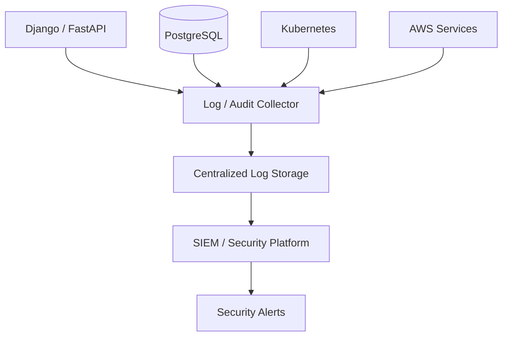
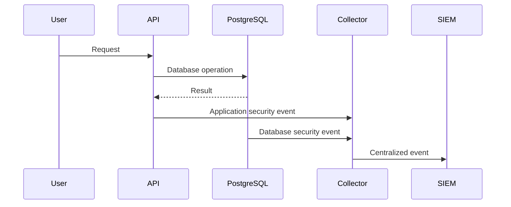

# 19- Database Security Logging

## Overview

Database security logging records security-relevant database activity so that administrators, security teams, and engineers can detect, investigate, and respond to suspicious or unauthorized behavior.

Database security logging is broader than simply logging SQL statements.

A production database security logging strategy should help answer:

```text
Who connected?
        ↓
From where?
        ↓
Using which identity?
        ↓
What security-sensitive operation occurred?
        ↓
Against which database object?
        ↓
Was it successful?
        ↓
When did it happen?
        ↓
Can it be correlated with the application or infrastructure?
```

For a PostgreSQL-backed backend, security logging commonly works alongside:

```text
PostgreSQL logs
+
Database auditing
+
Application logs
+
Cloud audit logs
+
Kubernetes audit logs
+
Network telemetry
+
SIEM / security monitoring
```

The goal is not to log everything. The goal is to produce **useful, trustworthy, appropriately protected security evidence** without creating excessive performance overhead or leaking the very secrets the logging system is intended to protect.

---

## Security Logging vs Database Auditing

These terms overlap, but they are not identical.

| Capability | Security Logging | Database Auditing |
|---|---|---|
| Authentication failures | Strong focus | Common |
| Connection activity | Strong focus | Common |
| Privilege changes | Strong focus | Strong |
| DDL | Useful | Strong |
| Data modifications | Useful | Strong |
| Sensitive data reads | Selective | Potentially strong |
| Performance diagnostics | Common | Secondary |
| Incident investigation | Strong | Strong |
| Business context | Limited | Limited unless propagated |
| End-user identity | Often indirect | Requires application context |
| Long-term immutable evidence | Depends on architecture | Often required |

A mature architecture often uses both.

---

## Why Security Logging Matters

Without security logs, a compromise can be difficult to reconstruct.

For example:

```text
Compromised credential
        ↓
Database connection
        ↓
Privilege escalation
        ↓
Sensitive table access
        ↓
Data modification
        ↓
Evidence required
```

Security logs can provide the timeline necessary to determine:

- When the activity started
- Which identity was used
- Which systems were involved
- Which objects were accessed
- Whether the behavior was successful
- Whether the activity was part of an expected deployment
- What additional systems need investigation

---

## Security Logging Goals

A production logging strategy should support:

### Detection

Identify suspicious behavior.

Examples:

```text
Repeated authentication failures
Unexpected privileged login
Unexpected database from a new network
Large number of sensitive queries
Unexpected role changes
```

### Investigation

Reconstruct what happened.

### Accountability

Determine which identity performed an operation.

### Compliance

Provide evidence required by organizational or regulatory controls.

### Operational Security

Detect configuration and permission changes.

---

## What Should Be Logged?

High-value database security events commonly include:

| Event | Example |
|---|---|
| Successful login | `app_runtime connected` |
| Failed login | Invalid password |
| Connection termination | Session closed |
| Role creation | `CREATE ROLE` |
| Role modification | `ALTER ROLE` |
| Role deletion | `DROP ROLE` |
| Permission change | `GRANT` / `REVOKE` |
| DDL | `ALTER TABLE` |
| Sensitive access | Read from protected table |
| Data modification | Privileged update |
| Function execution | Sensitive function |
| Administrative action | Configuration/security change |

The exact scope should be driven by the threat model.

---

## Security Logging Architecture

A typical production architecture is:



The centralized system becomes the primary investigation surface while the database remains the source of database-specific events.

---

## PostgreSQL Security Logging

PostgreSQL provides server logging facilities that can record different classes of activity.

Useful categories include:

```text
Connections
Disconnections
Authentication failures
DDL
Statements
Errors
Configuration-related activity
```

PostgreSQL logging is highly configurable, but broad logging can create significant volume.

Security logging should therefore be designed together with:

```text
Performance
Storage
Privacy
Retention
Access control
```

---

## Connection Logging

Connection activity is useful for detecting unexpected access.

PostgreSQL provides settings such as:

```sql
SHOW log_connections;
SHOW log_disconnections;
```

These can help identify:

```text
Unexpected clients
Connection churn
Unexpected service identities
Repeated connection attempts
```

Connection logs become more useful when combined with:

```text
Database user
Client address
Application name
Timestamp
```

---

## Authentication Failures

Failed authentication attempts can be security-relevant.

Examples include:

```text
Invalid password
Unknown database role
Unauthorized connection
TLS authentication failure
```

A burst of failures may indicate:

```text
Credential attack
Misconfigured deployment
Compromised service
Automated scanning
```

Do not automatically treat every failure as malicious. Correlate the event with deployment and infrastructure context.

---

## Successful Authentication

Successful logins can also matter.

For example:

```text
app_runtime
    ↓
Expected application subnet
    ↓
Expected time
```

is different from:

```text
app_runtime
    ↓
Unexpected network
    ↓
Unexpected geographic region
```

Security monitoring should evaluate both failed and successful authentication patterns.

---

## Database Identity

A PostgreSQL connection has database-level identity.

Examples:

```text
app_runtime
app_readonly
app_migration
app_admin
```

Logging the database role helps answer:

```text
Which database identity performed this action?
```

This is one reason production systems should avoid sharing one database credential across unrelated workloads.

---

## Application Identity

The database may only see:

```text
app_runtime
```

while the application knows:

```text
user_id = 123
service = orders-api
request_id = req-456
```

For security investigations, these identities should be correlated where appropriate.

```text
Database role
+
Application user
+
Service identity
+
Request ID
```

---

## Application Name

PostgreSQL connections can provide an application name.

For example:

```text
application_name=orders-api
```

This helps distinguish:

```text
orders-api
payments-api
reporting-worker
migration-job
```

in database logs and monitoring systems.

It is particularly useful when multiple workloads share a database cluster.

---

## Client Address

Database connection logs can include the client network address.

This helps answer:

```text
Where did the connection originate?
```

For example:

```text
10.0.12.45
```

can potentially be correlated with:

```text
Kubernetes pod
EC2 instance
ECS task
NAT gateway
```

depending on the network architecture.

---

## Proxy and NAT Considerations

The database may not see the original client IP.

For example:

```text
Application Pod
      ↓
NAT / Proxy
      ↓
PostgreSQL
```

The database may observe the proxy's address.

Therefore security investigations may need to correlate:

```text
Database logs
+
Load balancer logs
+
Kubernetes metadata
+
VPC/network logs
```

---

## Statement Logging

PostgreSQL provides the `log_statement` parameter.

Possible levels include:

```text
none
ddl
mod
all
```

For example:

```sql
SHOW log_statement;
```

Statement logging can be useful for specific security investigations.

However, setting:

```text
log_statement = all
```

globally can produce large volumes and may expose sensitive values.

It should not be enabled blindly in production.

---

## Why Full SQL Logging Is Dangerous

Consider:

```sql
INSERT INTO api_credentials (
    service_name,
    secret
)
VALUES (
    'payment-service',
    'super-secret-value'
);
```

A full statement log could capture the secret.

This creates:

```text
Database security control
        ↓
Sensitive log
        ↓
New security exposure
```

Security logging must therefore consider what information is being logged, not only whether an event is useful.

---

## Parameterized Queries and Logs

Parameterized queries reduce SQL injection risk, but logging behavior varies by driver and database logging configuration.

Application logs should avoid recording:

```text
SQL + sensitive parameter values
```

unless there is a strong reason and appropriate redaction.

Prefer structured metadata such as:

```text
query_name
table
operation
duration
request_id
```

when possible.

---

## DDL Logging

Schema changes are high-value security events.

Examples:

```sql
CREATE TABLE
ALTER TABLE
DROP TABLE
CREATE INDEX
DROP INDEX
CREATE FUNCTION
ALTER FUNCTION
```

DDL logs can be correlated with:

```text
CI/CD deployment
Migration ID
Migration role
Developer action
Incident response
```

Unexpected DDL should receive higher scrutiny.

---

## Permission Change Logging

Changes to database privileges can materially change the security boundary.

Monitor:

```sql
GRANT
REVOKE
ALTER ROLE
CREATE ROLE
DROP ROLE
```

Particularly sensitive role attributes include:

```text
SUPERUSER
BYPASSRLS
CREATEROLE
REPLICATION
```

Unexpected changes should trigger investigation.

---

## Role Management

A production database should distinguish normal application roles from administrative roles.

For example:

```text
app_runtime
app_readonly
app_migration
app_admin
```

Security logs should make privileged operations attributable to a specific identity.

Avoid generic shared administrative accounts where practical.

---

## Privileged Activity

Privileged users deserve stronger logging.

Examples:

```text
DBA
Database administrator
Security administrator
Migration role
Superuser
Role-management identity
```

A useful strategy is:

```text
Normal application activity
        ↓
Standard security logging

Privileged activity
        ↓
Detailed logging + alerting
```

---

## Sensitive Table Access

Some database objects require stronger monitoring.

Examples:

```text
customer_identity
payment_records
employee_records
security_configuration
credential_metadata
```

For these tables, consider logging:

```text
Read
Insert
Update
Delete
Export
Administrative access
```

Read auditing should be introduced selectively because read volume can be extremely high.

---

## Data Modification Logging

Security-relevant writes include:

```text
INSERT
UPDATE
DELETE
```

especially when they affect:

- Authorization data
- User accounts
- Permissions
- Financial information
- Security configuration
- Sensitive personal information

The audit event should ideally identify the affected resource without unnecessarily storing the entire payload.

---

## Before and After Values

Some security investigations require understanding exactly what changed.

Example:

```text
Account status:
    active → disabled
```

However, storing complete before/after records can expose sensitive data.

Prefer field-level change information where the requirement allows it.

---

## Security Logging and RLS

Row Level Security can restrict which rows a role can access.

Security logging can help detect:

```text
Unexpected role access
Unexpected policy changes
Unexpected privileged bypass
```

Pay particular attention to roles with:

```text
BYPASSRLS
```

and database owners, because RLS behavior depends on role attributes and table configuration.

Security logs should capture changes to these security boundaries.

---

## Security Logging and `SECURITY DEFINER`

`SECURITY DEFINER` functions execute with the privileges of their owner.

Changes to such functions can therefore be security-sensitive.

Monitor:

```text
CREATE FUNCTION
ALTER FUNCTION
DROP FUNCTION
```

and changes to:

```text
Function owner
Function definition
search_path
```

Improperly secured `SECURITY DEFINER` functions can become privilege-escalation paths.

---

## Audit Context

Application context can improve correlation.

For example:

```sql
SET LOCAL app.request_id = 'req-123';
SET LOCAL app.user_id = 'user-456';
```

This can allow database-side mechanisms to associate activity with an application request.

Use transaction-scoped context with pooled connections:

```sql
SET LOCAL ...
```

rather than leaving request-specific state on a reusable session.

---

## Security of Audit Context

Application-provided context should not automatically be trusted as proof of identity.

A compromised application might attempt:

```sql
SET LOCAL app.user_id = 'admin';
```

Therefore:

```text
Application context
    ↓
Correlation metadata
```

should not be confused with:

```text
Authorization enforcement
```

Use database roles, RLS, application authorization, and controlled execution paths appropriately.

---

## Connection Pooling

Connection pools introduce security considerations.

Architecture:

```text
Request A
   ↓
Pool connection
   ↓
PostgreSQL

Request B
   ↓
Same connection
   ↓
PostgreSQL
```

Session state can accidentally cross request boundaries.

This is especially dangerous for:

```text
Tenant ID
User ID
Request ID
Security context
```

Use transaction-scoped state and ensure it is reset appropriately.

---

## Database Security Logging and Django

Django can generate large numbers of database queries through the ORM.

Do not enable verbose SQL logging indiscriminately in production.

Instead, prefer:

```text
Application audit events
+
PostgreSQL security logs
+
Targeted database diagnostics
```

For business actions, record semantic events such as:

```text
customer.email_changed
user.role_changed
payment_method.removed
```

rather than relying only on generated SQL.

---

## Database Security Logging and FastAPI

FastAPI services can propagate request metadata such as:

```text
request_id
user_id
service identity
```

to the database layer where appropriate.

The database security logs can then be correlated with API logs.

A useful flow is:

```text
HTTP request
    ↓
FastAPI
    ↓
request_id
    ↓
PostgreSQL
    ↓
Security event
```

---

## REST API Correlation

For REST APIs, a request identifier can connect application and database events.

```http
X-Request-ID: req-123
```

The exact header convention should be standardized across the platform.

The identifier should be treated as correlation data, not authentication material.

---

## gRPC Correlation

gRPC metadata can carry correlation information between services.

Conceptually:

```text
Service A
   ↓ metadata: request-id
Service B
   ↓
PostgreSQL
```

This allows distributed traces and security logs to reference the same operation.

---

## Microservice Security Logging

In a microservice environment:

```text
Order Service
Payment Service
Identity Service
Reporting Service
```

each service may use a different database role.

A centralized security platform should preserve:

```text
service
database
role
request_id
actor
operation
timestamp
```

This makes cross-service investigations significantly easier.

---

## Kafka Security Logging

Kafka activity may be relevant when investigating database-related incidents.

For example:

```text
Compromised service
    ↓
Produces malicious event
    ↓
Consumer modifies database
```

The investigation requires correlation between:

```text
Kafka producer identity
+
Kafka event
+
Consumer
+
Database operation
```

Kafka security logs and database security logs should therefore use compatible correlation identifiers where practical.

---

## Redis Security Logging

Redis may contain session data, tokens, or cached authorization information.

Security monitoring may need to correlate:

```text
Application
    ↓
Redis
    ↓
Database
```

Do not log Redis values indiscriminately because cached values may contain sensitive information.

---

## Celery Security Logging

Background workers can perform database operations outside the HTTP request path.

For example:

```text
Celery worker
    ↓
Database update
```

Security logging should identify the worker/service identity so that database activity does not appear unexplained.

---

## Nginx and Reverse Proxy Logs

Nginx logs can provide context such as:

```text
Client IP
Request path
HTTP method
Status
Request ID
```

Database logs can provide:

```text
Database user
Application name
Database operation
```

Correlation between the two helps reconstruct:

```text
Client
  ↓
Nginx
  ↓
API
  ↓
PostgreSQL
```

---

## AWS Security Logging

AWS infrastructure activity should be correlated with database security events.

For example:

```text
AWS audit log
    ↓
Security group changed
    ↓
Database becomes reachable
    ↓
Unexpected PostgreSQL login
    ↓
Sensitive query
```

Cloud control-plane logs can therefore provide important context that PostgreSQL alone cannot provide.

---

## Kubernetes Audit Logs

Kubernetes audit logs can reveal:

```text
Who accessed a Secret?
Who changed a Deployment?
Who modified RBAC?
Who created a Pod?
```

Database security logs can reveal:

```text
Who accessed PostgreSQL?
Which role was used?
What database operation occurred?
```

Combining both can reveal an attack chain.

---

## Security Logging Data Flow



The security platform can correlate events using:

```text
request_id
timestamp
service
database role
actor
resource
```

---

## Structured Logging

Prefer structured events over unstructured messages.

Example:

```json
{
  "timestamp": "2026-09-04T12:00:00Z",
  "event_type": "database.permission_change",
  "database": "production",
  "database_user": "app_admin",
  "application": "migration-job",
  "action": "GRANT",
  "object": "orders",
  "request_id": "req-123",
  "result": "success"
}
```

Structured logs are easier to:

- Search
- Filter
- Correlate
- Alert on
- Aggregate

---

## Avoid Sensitive Log Fields

Do not routinely log:

```text
Passwords
API keys
Access tokens
Refresh tokens
TLS private keys
Encryption keys
Credit-card data
Full authentication headers
Complete sensitive request bodies
```

Logging systems often have broader access and longer retention than application databases.

---

## Log Redaction

Sensitive fields should be redacted before they enter centralized systems.

Example:

```text
Authorization: Bearer [REDACTED]
```

rather than:

```text
Authorization: Bearer eyJ...
```

Redaction should happen as close to the source as practical.

---

## Security Logging Retention

Retention should be based on:

```text
Threat model
Compliance
Incident response
Storage cost
Privacy
```

Longer retention is not automatically better.

A practical architecture may use:

```text
Recent events
    ↓
Fast searchable storage

Older events
    ↓
Lower-cost archive

Expired events
    ↓
Secure deletion
```

---

## Log Integrity

Security logs are valuable only if they can be trusted.

Protect them with:

- Restricted write access
- Restricted administrative access
- Centralized collection
- Encryption in transit
- Encryption at rest
- Append-oriented storage
- Tamper-resistant retention where required

Avoid storing critical security logs exclusively on the system being investigated.

---

## Log Access Control

Security logs themselves contain sensitive operational information.

For example:

```text
Database roles
IP addresses
User identifiers
Administrative actions
Security events
```

Only authorized personnel should access them.

Audit access to security logs where appropriate.

---

## Security Log Immutability

For high-assurance environments, security logs may require immutable retention.

Conceptually:

```text
Database
   ↓
Security event
   ↓
Central collector
   ↓
Immutable storage
```

This reduces the ability of an attacker with database access to erase evidence.

---

## Log Integrity vs Encryption

These solve different problems.

| Control | Protects against |
|---|---|
| Encryption at rest | Unauthorized reading of stored logs |
| Encryption in transit | Network interception |
| Access control | Unauthorized access |
| Immutability | Unauthorized modification/deletion |
| Integrity verification | Undetected tampering |

A strong audit architecture may require all of them.

---

## Alerting

Security logs become much more useful when important events generate alerts.

Examples:

```text
Repeated authentication failures
Unexpected privileged login
CREATE ROLE
ALTER ROLE with privileged attributes
GRANT on sensitive tables
Unexpected DROP TABLE
Unexpected DDL
BYPASSRLS-related changes
Access from unexpected network
```

Not every logged event should generate an alert.

---

## Alert Fatigue

If every database event generates an alert:

```text
Thousands of alerts
        ↓
Operators ignore alerts
```

Prefer:

```text
Log broadly enough for investigation
        +
Alert selectively on high-confidence conditions
```

---

## Anomaly Detection

Security monitoring can identify unusual patterns.

Examples:

```text
Normal:
app_runtime → application subnet

Anomaly:
app_runtime → unexpected network
```

or:

```text
Normal:
app_readonly → SELECT

Anomaly:
app_readonly → unexpected privileged behavior
```

Anomaly detection should be combined with deterministic security rules.

---

## Privilege Escalation Detection

A particularly important pattern is:

```text
Normal role
    ↓
Role membership change
    ↓
Higher privileges
    ↓
Sensitive data access
```

Monitor role and permission changes together with subsequent database activity.

---

## Security Logging and Least Privilege

Logging can reveal whether privileges are actually being used.

For example:

```text
app_runtime
    ↓
Has privilege: UPDATE customers

Observed:
No UPDATE activity for 90 days
```

This can support privilege reviews.

Logging can therefore help enforce least privilege over time.

---

## Security Logging and Credential Rotation

Credential rotation events should be correlated with database activity.

Example:

```text
Credential rotated
    ↓
Expected new connections
    ↓
Old credential no longer used
```

Unexpected continued use of an old credential may indicate:

```text
Stale deployment
Misconfigured service
Credential compromise
```

---

## Security Logging and Deployments

Database security events should be correlated with CI/CD.

For example:

```text
Migration deployment
    ↓
app_migration connects
    ↓
ALTER TABLE
    ↓
Expected schema change
```

Unexpected:

```text
Developer laptop
    ↓
app_admin
    ↓
ALTER TABLE
```

should receive greater scrutiny.

---

## Database Security Logging and Backups

Backup systems can expose database contents even if the primary database is protected.

Security monitoring should therefore include:

```text
Backup creation
Backup access
Restore operations
Snapshot sharing
Export operations
```

Database security is not complete if backup access is ignored.

---

## Database Security Logging and Disaster Recovery

During DR, logging must continue.

Verify that the recovery architecture preserves:

```text
Database logs
Audit pipeline
Central storage
Identity information
Request correlation
Alerting
Retention
```

A failover database should not silently lose security visibility.

---

## Security Logging Availability

Security logging should be highly available enough for its requirements.

Avoid:

```text
Single collector
    ↓
Single disk
```

for critical audit workloads.

Consider:

```text
Multiple collectors
    ↓
Durable queue
    ↓
Centralized storage
```

where the required reliability justifies the complexity.

---

## Log Backpressure

If the collector becomes unavailable:

```text
Database
    ↓
Events accumulate
    ↓
Buffer fills
```

Define what happens next.

Possible strategies include:

- Durable local buffering
- Queue-based delivery
- Rate limiting
- Temporary degradation
- Fail-closed behavior for critical operations

Do not allow unbounded logging buffers to exhaust database or application resources.

---

## Performance Impact

Security logging can increase:

- CPU
- Disk I/O
- WAL activity
- Network traffic
- Storage consumption
- Query latency
- Replication traffic

This is particularly important when logging:

```text
Every query
+
Every parameter
+
Every row change
```

Measure the impact before broad production deployment.

---

## High-Volume Databases

For high-throughput systems:

```text
Millions of operations
        ↓
Large security event volume
```

Consider:

- Event filtering
- Sampling only where acceptable
- Separate audit pipelines
- Asynchronous delivery
- Partitioned storage
- Compression
- Tiered retention

Do not sample events when doing so would violate a mandatory audit requirement.

---

## Database vs External Security Logs

| Approach | Advantages | Limitations |
|---|---|---|
| Database-local logs | Simple, close to source | Vulnerable to database-host compromise |
| Database audit table | Structured | Adds database workload |
| Centralized logs | Strong investigation capability | Requires infrastructure |
| SIEM | Detection/correlation | Cost and operational complexity |
| Immutable object storage | Strong retention | Less convenient for real-time search |

Production systems often combine several approaches.

---

## Security Logging in PostgreSQL

A practical PostgreSQL strategy can combine:

```text
Connection logging
+
Authentication failures
+
Targeted statement/DDL logging
+
pgaudit where appropriate
+
Database role/privilege monitoring
+
Centralized log collection
```

Avoid treating one configuration parameter as a complete security logging strategy.

---

## Configuration Management

Database logging configuration should be managed as infrastructure.

Avoid manually changing production settings without recording the change.

Prefer:

```text
Infrastructure as Code
        ↓
Review
        ↓
CI/CD
        ↓
Controlled database configuration
```

This makes security logging configuration reproducible.

---

## Configuration Drift

A common production failure is:

```text
Security logging enabled
        ↓
Someone changes configuration
        ↓
Logging becomes incomplete
```

Monitor important configuration settings and review them periodically.

---

## Security Logging Testing

Test security logging using controlled events.

For example:

```text
Failed login
Successful login
CREATE ROLE
GRANT
REVOKE
DDL
Sensitive operation
Privileged operation
```

Verify:

```text
Event generated
    ↓
Collector receives event
    ↓
Storage persists event
    ↓
Correlation fields preserved
    ↓
Alert fires where expected
```

---

## Incident Response Workflow

A security investigation can follow:

```text
Alert
  ↓
Identify affected identity
  ↓
Identify source
  ↓
Review authentication events
  ↓
Review privilege changes
  ↓
Review database operations
  ↓
Correlate application requests
  ↓
Correlate cloud/Kubernetes activity
  ↓
Contain credential/access
  ↓
Preserve evidence
  ↓
Remediate
```

The quality of the investigation depends heavily on the quality and integrity of the logs.

---

## Common Mistakes

### Logging Everything

**Problem:** Excessive volume, high cost, performance impact, and sensitive-data exposure.

**Better:** Define security events first and log them deliberately.

### Assuming PostgreSQL Logs Are a Complete Audit System

**Problem:** Server logs may not provide sufficient business context or durable audit guarantees.

**Better:** Combine PostgreSQL logs with application auditing and centralized security logging.

### Logging Passwords and Tokens

**Problem:** Security logs become a credential leak.

**Better:** Redact secrets and explicitly exclude sensitive fields.

### Storing Security Logs Only on the Database Server

**Problem:** An attacker who compromises the host may be able to modify or delete the evidence.

**Better:** Forward security events to separate centralized storage.

### Using One Shared Database User

**Problem:** Investigators cannot reliably distinguish which workload performed an operation.

**Better:** Use service-specific and responsibility-specific database roles.

### Ignoring Privilege Changes

**Problem:** An attacker may gain access by changing roles or permissions without generating obvious data-access anomalies.

**Better:** Monitor `CREATE ROLE`, `ALTER ROLE`, `GRANT`, `REVOKE`, and related privileged changes.

### Auditing Only Writes

**Problem:** Sensitive data can be exfiltrated through reads without modifying anything.

**Better:** Selectively audit sensitive reads where required.

### Capturing Full Before/After Records

**Problem:** Audit logs become a second sensitive-data repository.

**Better:** Record only the fields required for investigation or compliance.

### Trusting Application-Provided User IDs

**Problem:** A compromised application may forge session context.

**Better:** Use request context for correlation, not as the sole authorization mechanism.

### Forgetting Background Workers

**Problem:** Celery and other workers can modify databases outside HTTP request paths.

**Better:** Identify worker identities and correlate their database activity.

### Ignoring Database Connection Pooling

**Problem:** Request-specific session state can leak between requests.

**Better:** Use transaction-scoped settings such as `SET LOCAL` and carefully manage pooled connections.

### Alerting on Every Event

**Problem:** Alert fatigue causes operators to ignore real threats.

**Better:** Log broadly where justified and alert selectively.

### Not Testing the Logging Pipeline

**Problem:** A logging configuration can appear correct while events never reach centralized storage.

**Better:** Perform controlled security-event tests and verify end-to-end delivery.

### Ignoring DR

**Problem:** Security visibility may disappear during failover.

**Better:** Include security logging and centralized audit collection in DR testing.

---

## Production Security Logging Checklist

### Authentication

- [ ] Successful database connections are observable where required.
- [ ] Authentication failures are logged.
- [ ] Connection sources are identifiable.
- [ ] Database roles are distinguishable.
- [ ] Application names identify important workloads.
- [ ] Unexpected access patterns can be detected.

### Authorization

- [ ] Role creation is monitored.
- [ ] Role modification is monitored.
- [ ] Role deletion is monitored.
- [ ] GRANT operations are monitored.
- [ ] REVOKE operations are monitored.
- [ ] Privileged role attributes are monitored.
- [ ] RLS-related security changes are monitored.

### Data Access

- [ ] Sensitive tables are identified.
- [ ] Sensitive writes are audited.
- [ ] Sensitive reads are audited where required.
- [ ] Audit scope is reviewed periodically.
- [ ] Audit events contain appropriate actor/resource context.

### Sensitive Data

- [ ] Passwords are never logged.
- [ ] API keys are never logged.
- [ ] Tokens are redacted.
- [ ] Encryption keys are never logged.
- [ ] TLS private keys are never logged.
- [ ] Sensitive SQL parameters are controlled.
- [ ] Audit payloads are minimized.

### Centralization

- [ ] Database security logs are centrally collected.
- [ ] Security logs are protected from unauthorized modification.
- [ ] Audit storage has appropriate access control.
- [ ] Logs are encrypted in transit.
- [ ] Logs are encrypted at rest.
- [ ] Retention is defined.
- [ ] Archival is defined.

### Correlation

- [ ] Request IDs are propagated.
- [ ] Application identities are available.
- [ ] Database roles are available.
- [ ] Service identities are distinguishable.
- [ ] Kubernetes/AWS context can be correlated.
- [ ] Deployment activity can be correlated.

### Reliability

- [ ] Logging failures have defined behavior.
- [ ] Critical audit events use durable delivery where required.
- [ ] Backpressure is defined.
- [ ] Log storage has capacity planning.
- [ ] DR preserves required security visibility.
- [ ] Logging infrastructure has appropriate HA.

### Operations

- [ ] Security alerts are defined.
- [ ] Alert thresholds are reviewed.
- [ ] Security logs are periodically reviewed.
- [ ] Logging configuration is managed through CI/CD or IaC.
- [ ] Configuration drift is detected.
- [ ] Security logging is tested regularly.

---

## Senior-Level Design Questions

When designing database security logging, ask:

### What threat are we trying to detect?

For example:

```text
Credential compromise
Privilege escalation
Insider access
Unauthorized data modification
Data exfiltration
Administrative misuse
```

Logging should be designed around these threats.

### What evidence is required?

Determine whether you need:

```text
Connection
Role
Statement
Object
Row
Before/after values
Application user
Request
```

Do not collect more sensitive data than necessary.

### Can the attacker modify the logs?

If yes, centralized or immutable storage may be required.

### Can database activity be correlated with a human or service?

Use:

```text
Database role
+
Service identity
+
Application user
+
Request ID
+
Infrastructure identity
```

where appropriate.

### What happens when the logging pipeline fails?

Define:

```text
Buffer
Retry
Fail
Degrade
```

before production failure occurs.

### How much data will the logging system generate?

Estimate:

```text
database operations/sec
×
audit events/operation
×
event size
```

and project storage growth.

### Are security logs themselves sensitive?

Usually yes.

Protect them with:

```text
Encryption
+
Access control
+
Retention
+
Integrity
+
Monitoring
```

### Does failover preserve security visibility?

Verify that primary/standby transitions do not create an audit blind spot.

---

## Security Logging Decision Framework

```text
What security event matters?
        ↓
Authentication / Authorization / Data / Administration
        ↓
What identity is required?
        ↓
Database role + Service + Application user
        ↓
What context is required?
        ↓
Request ID + Resource + Source
        ↓
Can the event contain sensitive data?
        ↓
Minimize / Redact
        ↓
Where should it be stored?
        ↓
Centralized / Immutable storage where required
        ↓
Should it alert?
        ↓
High-confidence events only
        ↓
How long should it remain?
        ↓
Retention + Archive + Deletion
```

---

## Interview Traps

### Is database security logging the same as application logging?

No. Application logs provide business and request context, while database security logs provide database-level activity. Mature systems correlate both.

### Should every SQL statement be logged?

No. Full statement logging can create significant volume and expose passwords, tokens, PII, or other sensitive parameters.

### Why log successful database connections?

Failed authentication reveals attack attempts, but successful connections reveal which identities actually gained access and can help detect unauthorized usage.

### Why are role changes high-value security events?

Roles and privileges define the database security boundary. A malicious `GRANT` or role modification can enable subsequent data access without directly modifying business data.

### Why centralize database security logs?

An attacker who compromises the database or host may otherwise be able to modify or delete local evidence.

### Why is application identity different from database identity?

The database may see `app_runtime`, while the application knows that a particular user or service initiated the request. Both identities provide different investigative value.

### Why can logging sensitive SQL be dangerous?

SQL statements and parameters may contain passwords, tokens, PII, or other secrets. Security logging can therefore create a new data-exposure path.

### Why audit reads?

A data breach can involve data exfiltration without any modification. Sensitive read auditing can provide evidence of who accessed protected information.

### Why is connection pooling relevant to security logging?

Pooled connections are reused between requests, so request-specific session state can leak across security contexts if it is not transaction-scoped or properly reset.

### What is the role of `application_name` in PostgreSQL?

It helps identify which application or workload owns a database connection, improving operational and security correlation.

### Why should security logging be tested?

A logging configuration can appear correct while events fail to reach the collector, storage, alerting system, or SIEM. End-to-end testing verifies that the complete security-evidence pipeline works.

### What is the senior-level approach to database security logging?

Define the threats and evidence requirements first, capture high-value security events with trustworthy identity and correlation context, minimize sensitive payloads, centralize and protect the resulting evidence, and design the logging pipeline for performance, reliability, alerting, retention, HA, and DR.

## Key Takeaways

- **Database security logging should focus on security-relevant evidence**, especially authentication, privileged activity, role/permission changes, DDL, and access to sensitive data.
- **Correlate database identity with application and infrastructure context** using database roles, service identity, application users, request IDs, and deployment information.
- **Never allow security logging to become a data-leak mechanism**; redact credentials and tokens, minimize sensitive payloads, and avoid indiscriminate full-SQL logging.
- **Centralize and protect security evidence** with appropriate access control, encryption, retention, integrity, and immutable storage where the threat model requires it.
- **Treat security logging as a production system** with capacity planning, performance controls, alerting, backpressure, testing, HA, and DR rather than as a database configuration checkbox.