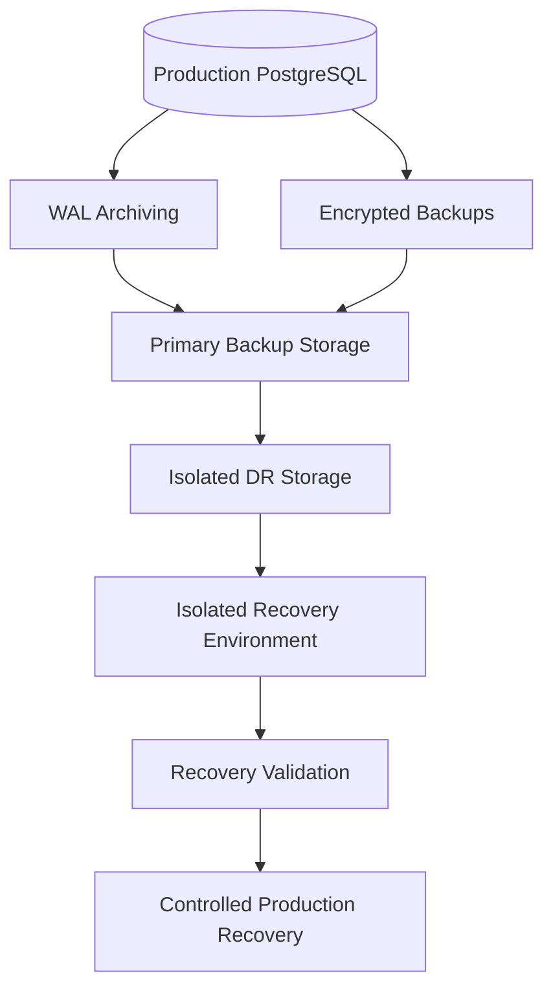

# 20- Backup and Recovery Security

## Overview

Database backups are a critical security boundary because they contain copies of production data, often with fewer runtime controls than the primary database.

Protecting the primary PostgreSQL database while leaving:

```text
Snapshots
Backups
WAL archives
Export files
Replica storage
Restore environments
```

poorly secured creates an alternate path to the same data.

Backup and recovery security therefore covers the complete lifecycle:

```text
Production Database
        ↓
Backup Creation
        ↓
Encryption
        ↓
Storage
        ↓
Access Control
        ↓
Replication / Archival
        ↓
Restore
        ↓
Validation
        ↓
Secure Disposal
```

A production backup strategy must provide both:

- **Confidentiality** — unauthorized users cannot read backups.
- **Integrity** — backups cannot be silently modified.
- **Availability** — authorized operators can recover when required.
- **Accountability** — backup and restore operations are auditable.

Security must be designed together with **RPO, RTO, HA, disaster recovery, access control, encryption, retention, and operational procedures**.

---

## Why Backup Security Matters

A production database may have strong controls:

```text
Private network
+
Firewall
+
TLS
+
Database authentication
+
Least-privilege roles
+
RLS
+
Monitoring
```

But a database backup may be:

```text
Downloaded
Copied
Stored in object storage
Shared with another environment
Restored to a developer machine
Exported for troubleshooting
```

The backup can therefore become an easier attack target.

A useful principle is:

> **Every backup should be treated as highly sensitive production data.**

---

## Backup Security Threat Model

Common threats include:

| Threat | Example |
|---|---|
| Unauthorized backup access | Stolen cloud credentials |
| Public exposure | Misconfigured object storage |
| Backup deletion | Ransomware or compromised admin |
| Backup tampering | Malicious modification |
| Credential compromise | Backup service identity exposed |
| Excessive retention | Old sensitive data remains accessible |
| Unsafe restore | Production data restored into weak environment |
| Developer exposure | Production backup copied locally |
| Cross-account exposure | Backup shared incorrectly |
| Key compromise | Encryption key accessed by attacker |
| Incomplete recovery | Backup exists but cannot be restored |
| Audit gaps | Restore activity is not recorded |

Security architecture should address the entire chain rather than only encrypting the backup file.

---

## Backup Types

Different backup mechanisms have different security properties.

| Backup | Purpose | Security Considerations |
|---|---|---|
| Full backup | Complete database recovery | Contains large amounts of sensitive data |
| Incremental backup | Reduce backup volume | Depends on previous backups |
| WAL archive | Point-in-time recovery | Can contain sensitive changes |
| Snapshot | Fast infrastructure recovery | Snapshot permissions are critical |
| Logical dump | Migration/selective recovery | Easy to copy and expose |
| Replica | Availability/read scaling | Not a substitute for independent backup |
| Export | Data transfer | High risk of uncontrolled copies |

A production strategy commonly combines several mechanisms.

---

## Backup vs Replica

A replica is not automatically a backup.

```text
Primary
   │
   ├── Replica
   │
   └── Backup
```

If an operator accidentally executes:

```sql
DELETE FROM customers;
```

the deletion can propagate to an asynchronous replica.

A properly retained backup can provide recovery from that logical error.

Therefore:

```text
Replication → availability / read scaling
Backup      → recovery from data loss and operational mistakes
```

---

## RPO and Backup Security

Recovery Point Objective determines how much recent data the organization can afford to lose.

For example:

```text
RPO = 5 minutes
```

may require frequent WAL archiving or equivalent continuous protection.

Security must not compromise the RPO.

If encrypted WAL archives are delayed because of an unreliable backup pipeline:

```text
Database
   ↓
WAL
   ↓
Backup pipeline unavailable
   ↓
Recovery point becomes stale
```

Backup security and backup reliability must therefore be designed together.

---

## RTO and Recovery Security

Recovery Time Objective determines how quickly service must be restored.

A highly secure backup that takes many hours to restore may not satisfy the system's RTO.

Evaluate:

```text
Backup size
+
Restore bandwidth
+
Decryption
+
Database initialization
+
WAL replay
+
Validation
+
Application cutover
```

Security controls must be compatible with the recovery target.

---

## Encryption at Rest

Backups should normally be encrypted at rest.

Typical architecture:

```text
PostgreSQL
    ↓
Backup Service
    ↓
Encryption
    ↓
Object Storage
```

Encryption protects against unauthorized access to the underlying storage.

For AWS environments, managed key services such as AWS KMS are commonly used to control encryption keys.

---

## Encryption in Transit

Backup data should also be protected while moving between systems.

For example:

```text
Database
    ↓ TLS
Backup service
    ↓ TLS
Object storage
```

Do not assume that encryption at rest protects data during transfer.

---

## Customer-Managed Keys

Organizations with stronger control requirements may use customer-managed encryption keys.

Advantages include:

- Explicit key ownership and policy control
- Key usage auditing
- Controlled access
- Key rotation policies
- Separation of responsibilities

Limitations include:

- More operational complexity
- Key lifecycle management
- Risk of overly restrictive policies
- Recovery dependency on key availability

---

## Key Management and Recovery

Encryption is only useful if authorized recovery systems can access the key.

Consider:

```text
Backup
  +
Encryption key
  +
Key policy
  +
IAM permissions
  =
Recoverable backup
```

A key accidentally disabled or inaccessible during an incident can make an otherwise healthy backup unusable.

Recovery testing must therefore include encryption-key access.

---

## Key Separation

For stronger security boundaries, avoid giving every workload access to backup encryption keys.

For example:

```text
Application Runtime Role
    ✗ Backup encryption key

Backup Service Role
    ✓ Backup encryption key

Recovery Role
    ✓ Decrypt permission
```

This reduces the blast radius of application credential compromise.

---

## IAM and Backup Access

Cloud backup permissions should follow least privilege.

Separate permissions for:

```text
Backup creation
Backup listing
Backup deletion
Backup restore
Backup export
Encryption-key administration
```

where operationally practical.

An application runtime identity should generally not be able to delete production backups.

---

## Backup Roles

A useful separation is:

| Identity | Typical Responsibility |
|---|---|
| Application role | Database runtime access |
| Backup role | Create/manage backups |
| Recovery role | Restore backups |
| Security role | Audit and investigation |
| Key administrator | Manage encryption keys |
| Infrastructure administrator | Manage backup infrastructure |

Avoid giving one identity unrestricted control over every layer.

---

## Backup Storage Isolation

Backup storage should be isolated from normal application storage.

Prefer:

```text
Production Database
       ↓
Dedicated Backup Account / Project
       ↓
Dedicated Backup Storage
```

rather than:

```text
Production Application
       ↓
Same bucket
       ↓
Application + backups
```

Isolation limits the blast radius of application compromise.

---

## Object Storage Security

When backups are stored in object storage:

- Block unintended public access.
- Require encryption.
- Restrict bucket/container permissions.
- Restrict deletion permissions.
- Enable appropriate access logging.
- Use lifecycle policies.
- Consider object versioning where appropriate.
- Consider immutable retention for critical backups.

A backup bucket should not be treated like ordinary application object storage.

---

## Immutable Backups

Immutable backups cannot be modified or deleted during a protected retention period.

They are particularly valuable against:

```text
Ransomware
Compromised administrator accounts
Malicious insiders
Credential compromise
Destructive automation
```

Conceptually:

```text
Database
   ↓
Backup
   ↓
Immutable storage
   ↓
Protected retention
```

Immutability provides a stronger recovery boundary than ordinary object permissions alone.

---

## Why Versioning Is Not the Same as Immutability

Versioning may preserve previous object versions, but authorized users may still be able to delete them.

Therefore:

```text
Versioning ≠ guaranteed immutability
```

Use a storage control specifically designed for immutable retention when the threat model requires it.

---

## Backup Deletion Protection

Backup deletion is a high-risk operation.

Protect against:

```text
Accidental deletion
Malicious deletion
Compromised credentials
Automation bugs
Ransomware
```

Use:

- Separate administrative roles
- Deletion policies
- Retention controls
- Immutable backups
- Approval workflows where justified
- Audit logging

---

## Air-Gapped or Isolated Copies

For high-value systems, maintain recovery copies that are isolated from the primary environment.

Conceptually:

```text
Production Account
       ↓
Backup
       ↓
Independent Recovery Account
       ↓
Restricted access
```

The goal is to ensure that compromise of the production account does not automatically provide destructive access to every backup.

---

## Cross-Account Backup Strategy

A stronger AWS architecture can separate:

```text
Production AWS Account
        ↓
Backup / Recovery Account
        ↓
Immutable storage
```

This provides an additional security boundary.

The exact implementation depends on the organization's AWS backup and account architecture.

---

## Geographic Backup Copies

Critical backups may be replicated to another region.

Example:

```text
Primary Region
      ↓
Encrypted backup
      ↓
Secondary Region
```

This improves resilience against regional failures.

Security requirements must remain consistent across regions:

```text
Encryption
+
IAM
+
Retention
+
Audit
+
Key management
```

---

## Multi-Region Key Considerations

Cross-region recovery introduces key-management requirements.

Verify that:

- Required encryption keys are available.
- Recovery identities can access them.
- Key policies work in the target region.
- Backup metadata remains available.
- Cross-region replication is monitored.

A geographically replicated backup is not useful if its encryption key cannot be used during DR.

---

## Logical Dumps

PostgreSQL logical backups may use tools such as:

```bash
pg_dump
pg_dumpall
```

Example:

```bash
pg_dump \
  --format=custom \
  --file=production.dump \
  --dbname="$DATABASE_URL"
```

Logical dumps are convenient but create portable files.

That portability increases security risk.

A file such as:

```text
production.dump
```

may contain substantial production data and must be protected accordingly.

---

## Secure Handling of Dumps

If logical dumps are required:

```text
Create
  ↓
Encrypt
  ↓
Transfer securely
  ↓
Store with restricted permissions
  ↓
Use
  ↓
Securely delete when no longer required
```

Avoid placing production dumps in:

```text
Git repositories
Developer laptops
Shared chat systems
Public object storage
Unencrypted temporary directories
```

---

## File Permissions

On systems where dumps are stored locally, restrict file access.

For example:

```bash
umask 077
pg_dump --format=custom --file=production.dump "$DATABASE_URL"
```

The exact mechanism depends on the execution environment, but the principle is:

```text
Backup files should not be world-readable.
```

---

## WAL Archive Security

PostgreSQL WAL archives are important for Point-in-Time Recovery.

They can contain information about database changes and therefore require strong protection.

Architecture:

```text
PostgreSQL
    ↓
WAL
    ↓
Archive
    ↓
Encrypted storage
```

Protect WAL archives with the same seriousness as full backups.

---

## Point-in-Time Recovery

PITR allows recovery to a selected point in time.

Conceptually:

```text
Base Backup
    +
WAL Archives
    ↓
Recovery Target
    ↓
Recovered Database
```

This is particularly valuable for:

- Accidental deletion
- Application bugs
- Incorrect migrations
- Corrupted data
- Operational mistakes

---

## PITR Security

Recovery targets can expose sensitive historical data.

Consider:

```text
Production at T1
Production at T2
Production at T3
```

The recovery environment may contain information that has since been deleted from production.

Therefore backup retention and PITR retention should be designed with data-retention requirements in mind.

---

## Recovery Environment Security

A restored database should not automatically be placed into a production-like network with unrestricted access.

Prefer:

```text
Backup
  ↓
Isolated recovery environment
  ↓
Restricted network
  ↓
Validation
  ↓
Controlled promotion
```

This reduces the risk of exposing production data during recovery testing.

---

## Restoring Production Data to Non-Production

This is a major security risk.

For example:

```text
Production backup
       ↓
Developer database
       ↓
Sensitive customer data exposed
```

If production data must be used for testing, apply appropriate:

```text
Masking
Anonymization
Tokenization
Access controls
Retention limits
```

Use synthetic data where possible.

---

## Backup Data Classification

Classify backups according to the sensitivity of the source data.

For example:

| Data | Backup Classification |
|---|---|
| Public data | Lower sensitivity |
| Internal data | Internal |
| Customer data | Sensitive |
| Credentials/secrets | Highly sensitive |
| Financial/security data | Highly sensitive |

The backup inherits the sensitivity of its contents.

---

## Secrets Inside Backups

Database backups may contain:

```text
API credentials
OAuth client secrets
Tokens
Encryption metadata
Internal configuration
```

Do not assume that a backup is safe simply because the application stores secrets securely.

If secrets are stored in the database, backup protection becomes part of the secret-management strategy.

---

## Encryption Does Not Replace Access Control

A backup may be encrypted but still poorly protected if too many identities can decrypt it.

Security requires:

```text
Encryption
+
Key protection
+
IAM
+
Network controls
+
Audit
```

not encryption alone.

---

## Backup Authentication

Automated backup systems should use dedicated identities.

Avoid embedding long-lived administrative credentials directly into:

```text
Docker images
Git repositories
Shell scripts
CI/CD configuration
```

Prefer workload identity or managed identity mechanisms where available.

---

## Kubernetes Backup Security

For Kubernetes-hosted PostgreSQL, backup security may span:

```text
Kubernetes Secret
+
PostgreSQL
+
Backup operator
+
Object storage
+
Cloud IAM
```

Protect each layer.

A compromised Kubernetes service account should not automatically gain unrestricted access to historical production backups.

---

## Docker Considerations

Never bake database backup credentials into an image.

Bad pattern:

```dockerfile
ENV BACKUP_PASSWORD=production-secret
```

Prefer runtime secret injection through the platform's secret-management mechanism.

Also avoid leaving backup files inside container layers.

---

## CI/CD Security

CI/CD pipelines may execute:

```text
Database migrations
Backup jobs
Restore tests
Schema validation
```

Pipeline identities should have narrowly scoped permissions.

A CI pipeline that can:

```text
Read production backups
+
Delete backups
+
Manage encryption keys
```

has an unnecessarily large blast radius.

Separate responsibilities where practical.

---

## Backup Automation

Automated backups should be observable.

Track:

```text
Backup started
Backup completed
Backup failed
Backup size
Backup age
WAL archive status
Retention status
Replication status
```

A backup system that silently fails is effectively not a backup system.

---

## Backup Verification

A successful backup job does not necessarily mean a recoverable backup.

Verify:

```text
Backup exists
+
Backup is complete
+
Backup metadata is valid
+
Encryption works
+
Permissions work
+
Restore succeeds
```

Restore testing is the strongest practical validation.

---

## Restore Testing

A mature organization periodically restores backups into an isolated environment.

Example:

```text
Encrypted backup
       ↓
Recovery environment
       ↓
Restore
       ↓
Integrity checks
       ↓
Application smoke tests
       ↓
Performance checks
       ↓
Destroy test environment
```

The process should be automated where practical.

---

## Recovery Validation

After restoring PostgreSQL, validate:

```text
Database starts
Schema exists
Expected tables exist
Indexes exist
Constraints exist
Expected row counts are plausible
Critical queries work
Application connectivity works
Background jobs work
Security policies remain correct
```

Do not rely solely on a successful `pg_restore` or database startup.

---

## Backup Integrity

Integrity checks can help detect corruption or unexpected modification.

Possible controls include:

```text
Checksums
Cryptographic hashes
Object integrity mechanisms
Backup-provider validation
Restore testing
```

The appropriate mechanism depends on the backup technology.

---

## Monitoring Backup Health

Useful metrics include:

| Metric | Why It Matters |
|---|---|
| Last successful backup | Detect backup outages |
| Backup age | Detect stale recovery points |
| Backup duration | Detect performance regressions |
| Backup size | Detect unusual growth |
| WAL archive delay | Protect PITR |
| Restore duration | Protect RTO |
| Restore success rate | Validate recoverability |
| Storage utilization | Prevent backup failure |
| Failed jobs | Detect operational issues |

---

## Backup Alerts

High-value alerts include:

```text
No successful backup within RPO
WAL archive failure
Backup job failure
Backup storage capacity threshold
Unexpected backup deletion
Unexpected restore
Encryption-key access failure
Unusual backup-size increase
Restore test failure
```

Alerts should correspond to recovery and security requirements rather than arbitrary thresholds.

---

## Backup Audit Logging

Audit:

```text
Backup creation
Backup deletion
Backup restoration
Backup export
Backup sharing
Encryption-key usage
Permission changes
Retention changes
```

This helps establish accountability.

---

## Restore Is a Privileged Operation

A restore may expose the entire production dataset.

Therefore restore permissions should be restricted.

A typical separation is:

```text
Backup operator
    → Can create backups

Recovery operator
    → Can restore

Application runtime
    → Cannot restore

Developer
    → Cannot access production backups
```

---

## Recovery and Application Secrets

After restoring a production database into another environment, application configuration must be considered.

For example:

```text
Restored production database
        ↓
Development application
        ↓
Production API credentials
```

This can accidentally cause non-production systems to interact with production services.

Use environment-specific credentials and isolate restored environments.

---

## Recovery and External Integrations

A restored database may contain pending records for:

```text
Kafka
Celery
Email
Payment providers
Webhooks
Third-party APIs
```

Starting workers immediately can cause duplicate external actions.

Recovery procedures should define how external side effects are handled.

---

## Idempotency During Recovery

Suppose the database contains:

```text
payment_status = pending
```

and a worker processes it again after recovery.

Without idempotency:

```text
Restore
  ↓
Worker retry
  ↓
Duplicate payment
```

Recovery architecture must account for application-level idempotency.

---

## Kafka and Recovery

If Kafka consumers are restored alongside a recovered database, offsets and database state must be considered together.

For example:

```text
Database restored to T1
Kafka consumer offset restored to T2
```

can produce inconsistent processing.

Recovery procedures should define compatible recovery points across stateful systems.

---

## Redis and Recovery

Redis is often a cache rather than the system of record.

After database recovery:

```text
Database recovered
        ↓
Invalidate stale Redis state
        ↓
Warm cache gradually
```

Do not blindly restore stale cache data over a recovered database state.

---

## Celery and Recovery

Celery workers may retry tasks after recovery.

Ensure important tasks are:

- Idempotent
- Safely retryable
- Correlated with database state
- Protected from duplicate external side effects

Database recovery is therefore an application architecture concern, not only a database operation.

---

## Recovery and Database Migrations

Restoring an old database into a newer application version can create schema incompatibilities.

For example:

```text
Backup from version N
        ↓
Application version N+2
        ↓
Expected schema differs
```

Recovery procedures should define:

```text
Compatible application version
Migration sequence
Rollback strategy
Data compatibility
```

---

## Expand-and-Contract and Recovery

Schema migrations should be designed so that old and new application versions can coexist when practical.

This helps during:

```text
Deployment
Failover
Rollback
Backup restoration
```

Avoid migrations that make historical backups immediately unusable without a carefully tested recovery procedure.

---

## Backup Retention

Retention should balance:

```text
Security
Compliance
Recovery requirements
Storage cost
Privacy
```

Keeping backups forever increases:

```text
Storage cost
Attack surface
Data-retention obligations
Potential breach impact
```

Retain data only as long as there is a justified requirement.

---

## Secure Backup Disposal

When backups expire, ensure deletion follows the storage system's security guarantees.

For immutable storage:

```text
Protected retention expires
        ↓
Object becomes eligible for deletion
        ↓
Lifecycle policy removes it
```

Do not assume that deleting an application reference deletes every underlying backup copy.

Consider:

```text
Primary backup
+
Replicas
+
Snapshots
+
WAL archives
+
Exports
+
Temporary restore copies
```

---

## Backup Storage Cost

Backup security controls can increase cost.

Examples:

```text
Cross-region copies
Immutable storage
Long retention
Multiple recovery copies
Centralized audit logs
```

Optimize cost without weakening the required recovery guarantees.

A useful approach is tiered retention:

```text
Recent backups
    ↓
Fast storage

Older backups
    ↓
Lower-cost storage

Expired backups
    ↓
Secure deletion
```

---

## High Availability and Backup Security

HA does not eliminate backup requirements.

A highly available cluster can still suffer:

```text
Logical corruption
Bad migration
Application bug
Credential compromise
Malicious deletion
```

Therefore:

```text
HA → minimize service interruption
Backup → recover data and state
DR → recover from major infrastructure failure
```

These controls complement one another.

---

## Disaster Recovery Architecture

A mature architecture might look like:



Security controls should apply at every boundary.

---

## Recovery Runbook

A production recovery runbook should specify:

1. Incident declaration and authorization.
2. Recovery target and required RPO.
3. Backup selection.
4. Encryption-key verification.
5. Recovery environment preparation.
6. Database restoration.
7. WAL/PITR replay if required.
8. Integrity and application validation.
9. Security validation.
10. Controlled application cutover.
11. Monitoring after recovery.
12. Incident documentation.

The exact procedure should be tested before an actual disaster.

---

## Recovery Authorization

Not every engineer should be able to restore production data.

A controlled workflow can require:

```text
Incident
   ↓
Authorized operator
   ↓
Approved recovery target
   ↓
Restore
   ↓
Validation
   ↓
Cutover
```

For high-impact systems, dual authorization may be appropriate for destructive or irreversible operations.

---

## Backup Security and Zero Trust

Do not automatically trust:

```text
Internal network
Internal service
Kubernetes pod
CI/CD runner
Administrator account
```

Verify:

```text
Identity
+
Permission
+
Purpose
+
Environment
```

This is particularly important for backup and restore operations because they provide access to highly sensitive historical data.

---

## Production Architecture Example

A secure PostgreSQL backup architecture might use:

```text
                    ┌──────────────────────┐
                    │   Production DB      │
                    │     PostgreSQL       │
                    └──────────┬───────────┘
                               │
                    ┌──────────▼───────────┐
                    │ Backup / WAL Service  │
                    └──────────┬───────────┘
                               │
                         Encryption
                               │
                    ┌──────────▼───────────┐
                    │ Dedicated Backup      │
                    │ Storage / Account     │
                    └──────────┬───────────┘
                               │
                 ┌─────────────┴─────────────┐
                 │                           │
        Immutable Recovery Copy       Secondary Region
                 │                           │
                 └─────────────┬─────────────┘
                               │
                    Isolated Recovery
                       Environment
                               │
                         Validation
                               │
                         Controlled
                           Cutover
```

Important properties:

- Application identities cannot delete backups.
- Backups are encrypted.
- Backup storage is isolated.
- Critical copies are immutable.
- Recovery is tested.
- Restore activity is audited.
- Encryption keys are separately controlled.
- DR copies are available.
- Retention is explicitly defined.

---

## Common Mistakes

### Treating Replicas as Backups

**Problem:** Corruption and accidental deletion can propagate to replicas.

**Better:** Maintain independent backups with appropriate retention.

### Encrypting Backups but Sharing the Encryption Key

**Problem:** Anyone who can decrypt the backup can potentially access production data.

**Better:** Restrict key usage through dedicated identities and policies.

### Giving Applications Backup Delete Permissions

**Problem:** Application compromise can become backup destruction.

**Better:** Separate runtime and backup administration permissions.

### Storing Production Dumps on Developer Machines

**Problem:** Developer endpoints usually have a broader and less controlled security boundary.

**Better:** Use isolated recovery environments and sanitized datasets.

### Restoring Production Data Directly Into Development

**Problem:** Sensitive production data becomes accessible to a larger population.

**Better:** Use synthetic or sanitized data for development and testing.

### Never Testing Restores

**Problem:** A backup can exist but still be corrupted, incomplete, inaccessible, or too slow to restore.

**Better:** Perform regular automated restore tests.

### Ignoring WAL Archives

**Problem:** PITR may fail even though a base backup exists.

**Better:** Monitor WAL archiving independently.

### Keeping Backups Forever

**Problem:** Increases cost, attack surface, and data-retention exposure.

**Better:** Define and enforce retention policies.

### Using the Same Account for Production and Backups

**Problem:** Compromise of production credentials may allow backup destruction.

**Better:** Isolate backup administration and storage.

### Ignoring Recovery Keys

**Problem:** An encrypted backup without accessible recovery keys is effectively unusable.

**Better:** Test encryption-key recovery as part of DR exercises.

### Starting Workers Immediately After Restore

**Problem:** Restored pending jobs can trigger duplicate external side effects.

**Better:** Control worker startup and verify idempotency and external system state.

### Forgetting Audit Trails

**Problem:** Security teams cannot determine who accessed, restored, exported, or deleted sensitive backups.

**Better:** Audit backup and recovery operations centrally.

---

## Production Checklist

### Backup Protection

- [ ] Backups are encrypted at rest.
- [ ] Backup transfers use encryption in transit.
- [ ] Backup storage is private.
- [ ] Backup access follows least privilege.
- [ ] Application identities cannot delete critical backups.
- [ ] Backup storage is isolated from application storage.
- [ ] Critical backups use immutable retention where required.
- [ ] Backup copies exist outside the primary failure domain.

### Key Management

- [ ] Encryption keys are centrally managed.
- [ ] Key access is restricted.
- [ ] Backup identities have only required key permissions.
- [ ] Key usage is auditable.
- [ ] Key rotation is planned.
- [ ] DR environments can access required keys.
- [ ] Key recovery is tested.

### Recovery

- [ ] RPO is defined.
- [ ] RTO is defined.
- [ ] PITR is configured where required.
- [ ] WAL archiving is monitored.
- [ ] Restore procedures are documented.
- [ ] Restore testing is performed.
- [ ] Recovery environments are isolated.
- [ ] Recovery authorization is defined.
- [ ] Application compatibility is tested.

### Data Protection

- [ ] Production data is not casually copied to developer systems.
- [ ] Non-production restores use masking or anonymization where required.
- [ ] Backup retention is defined.
- [ ] Expired backups are securely deleted.
- [ ] Temporary restore copies are removed.
- [ ] Sensitive data classification applies to backups.

### Monitoring

- [ ] Backup failures generate alerts.
- [ ] Backup age is monitored.
- [ ] WAL archive delay is monitored.
- [ ] Backup storage capacity is monitored.
- [ ] Restore duration is measured.
- [ ] Restore test failures generate alerts.
- [ ] Unexpected deletion is monitored.
- [ ] Restore operations are audited.

### DR

- [ ] Backups survive the primary failure domain.
- [ ] Cross-region recovery exists where required.
- [ ] DR encryption keys are available.
- [ ] DR permissions are tested.
- [ ] Recovery runbooks are tested.
- [ ] Application dependencies are included in recovery planning.
- [ ] Kafka/Celery/Redis behavior is considered.
- [ ] Post-recovery security validation is defined.

---

## Senior-Level Design Questions

### What happens if an attacker compromises the production AWS account?

A mature design should assume that production credentials may be compromised.

Critical backups should therefore have additional boundaries such as:

```text
Separate account
+
Restricted IAM
+
Immutable retention
+
Independent recovery controls
```

### Can an administrator delete every backup?

If yes, the organization may have a ransomware or insider-risk weakness.

Consider separation of duties and immutable recovery copies.

### Can the organization restore without the primary environment?

A real DR strategy should not depend on the continued availability of the same infrastructure that failed.

### Can encrypted backups actually be decrypted during an incident?

Test:

```text
Backup
+
Key
+
IAM
+
Network
+
Recovery environment
```

as one end-to-end process.

### What happens to asynchronous systems after recovery?

Database recovery alone does not recover:

```text
Kafka offsets
Celery state
Redis cache state
External payment state
Webhook delivery state
```

Recovery must account for system-wide consistency and duplicate side effects.

### What is the blast radius of a compromised application role?

The application should not be able to:

```text
Read arbitrary backups
Delete backups
Manage backup keys
Restore production snapshots
```

unless there is an explicit operational requirement.

### How do you prove that backups work?

The strongest evidence is a successful, repeatable restore test with:

```text
Measured RTO
Validated RPO
Integrity checks
Application checks
Security checks
```

---

## Interview Traps

### Is encryption enough to secure backups?

No. Encryption must be combined with access control, key management, isolation, retention, monitoring, and integrity controls.

### Are read replicas backups?

No. Replicas primarily provide availability and read scaling. Logical mistakes can propagate to them.

### Why should backup storage be in a separate account?

It reduces the probability that compromise of the production account also provides destructive control over all recovery copies.

### Why are immutable backups valuable?

They reduce the ability of compromised credentials or malicious administrators to destroy recovery data during an incident.

### Why test restores instead of only checking backup jobs?

A successful backup job does not prove that the backup is complete, decryptable, restorable, or fast enough to satisfy the RTO.

### Why should WAL archives be protected like full backups?

WAL archives are part of the recovery chain and can contain sensitive database changes required for PITR.

### Why is restoring production data into development dangerous?

It transfers production-sensitive information into an environment with typically broader access and weaker controls.

### Why should recovery permissions be separated from application permissions?

A restore operation can expose an entire production dataset. Giving routine application identities recovery privileges creates an unnecessarily large security boundary.

### What is the relationship between RPO, RTO, and backup security?

RPO determines how recent recovery data must be. RTO determines how quickly it must be usable. Security controls must preserve both requirements without making backups inaccessible or recovery excessively slow.

### What is the senior-level approach to backup security?

Treat backups as production data and design the complete lifecycle around confidentiality, integrity, availability, least privilege, isolated and immutable storage where required, tested recovery, auditability, and system-wide DR behavior.

## Key Takeaways

- **Backups are part of the production security boundary** and must receive the same or stronger protection as the primary database.
- **Encryption alone is insufficient**; secure backup architecture requires least-privilege access, protected keys, isolated storage, auditability, retention controls, and integrity protection.
- **Replication is not a substitute for backups** because logical corruption, accidental deletion, and malicious changes can propagate to replicas.
- **Recovery must be tested end-to-end**, including backup decryption, WAL/PITR, application compatibility, external side effects, RPO, RTO, and recovery authorization.
- **Critical recovery copies should survive production compromise**, using mechanisms such as separate accounts, geographic isolation, and immutable retention where justified.