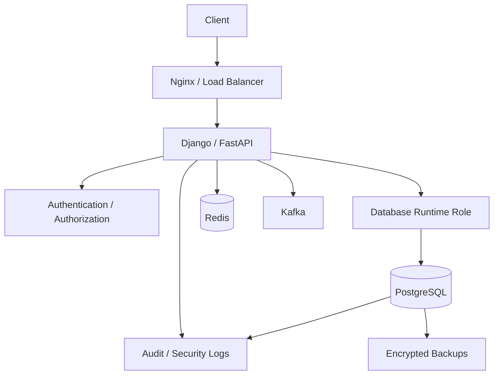
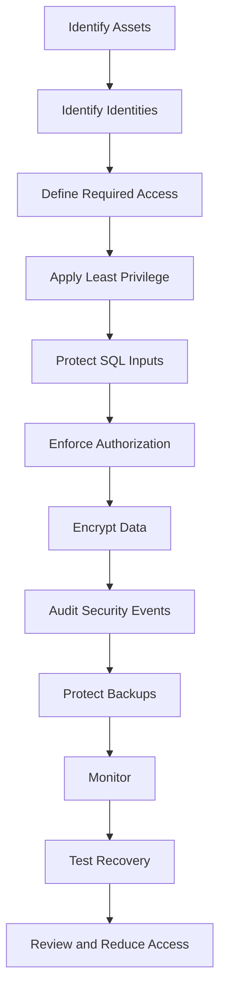

# 21- Security Rules and Best Practices

## Overview

SQL security is not a single feature. It is a layered system that protects database data, identities, application access paths, administrative operations, and recovery assets.

A production PostgreSQL system should generally follow:

```text
Network Security
       ↓
TLS
       ↓
Authentication
       ↓
Database Roles
       ↓
Privileges
       ↓
Application Authorization
       ↓
RLS where required
       ↓
Parameterized SQL
       ↓
Auditing / Security Logging
       ↓
Backup Security
```

Each layer addresses a different failure mode.

For backend engineers, the important distinction is:

> **The application is responsible for business authorization, while the database should independently enforce critical data-access boundaries and integrity constraints wherever practical.**

Security should therefore be designed across:

- Authentication
- Authorization
- Least privilege
- SQL injection prevention
- Secrets management
- Encryption
- Row-level security
- Auditing
- Backup protection
- Operational controls
- Monitoring and incident response

---

## Security Principles

A practical database security strategy follows a small set of principles.

| Principle | Practical Meaning |
|---|---|
| Least privilege | Give identities only required permissions |
| Defense in depth | Do not rely on one security control |
| Deny by default | Explicitly grant required access |
| Separation of duties | Separate runtime, migration, and administrative privileges |
| Strong authentication | Prefer managed identity and strong credentials |
| Explicit authorization | Verify access at the appropriate application/database layer |
| Secure defaults | Make unsafe behavior difficult |
| Minimize sensitive data | Store and log only what is required |
| Audit privileged activity | Maintain evidence of security-sensitive operations |
| Assume compromise | Design for credential and workload compromise |
| Test security controls | Verify that controls actually enforce intended boundaries |

---

## Security Architecture

A typical backend architecture looks like:



Security controls exist at every boundary rather than only at the database.

---

## Authentication vs Authorization

These are different controls.

### Authentication

Answers:

```text
Who are you?
```

Examples:

```text
Password
IAM identity
Certificate
Service account
OIDC
Kerberos
```

### Authorization

Answers:

```text
What are you allowed to do?
```

Examples:

```text
SELECT
INSERT
UPDATE
DELETE
EXECUTE
CREATE
```

Application authorization may additionally answer:

```text
Can this user update this customer's account?
```

A database password does not answer that business question.

---

## Database Roles

PostgreSQL uses roles to represent identities and permission groups.

Production systems should avoid one shared unrestricted database identity.

A practical model might be:

```text
app_runtime
app_readonly
app_migration
app_admin
```

For example:

| Role | Typical Responsibility |
|---|---|
| `app_runtime` | Normal application operations |
| `app_readonly` | Reporting/read-only access |
| `app_migration` | Schema migrations |
| `app_admin` | Restricted administrative operations |

The exact roles depend on the system.

---

## Separate Runtime and Migration Roles

The application should generally not need schema-management permissions.

Prefer:

```text
Application
    ↓
app_runtime
    ↓
DML only
```

and:

```text
CI/CD migration job
    ↓
app_migration
    ↓
DDL + required DML
```

This limits the damage caused by application compromise.

---

## Least Privilege

Least privilege means granting only the permissions required to perform a specific responsibility.

For example:

```sql
GRANT CONNECT ON DATABASE app TO app_runtime;
GRANT USAGE ON SCHEMA public TO app_runtime;

GRANT SELECT, INSERT, UPDATE, DELETE
ON ALL TABLES IN SCHEMA public
TO app_runtime;
```

Do not automatically grant:

```text
SUPERUSER
CREATEROLE
CREATEDB
REPLICATION
BYPASSRLS
```

to an application role.

---

## Ownership Is Different from Privilege

Database object ownership is a powerful security boundary.

An application role that owns every table may have capabilities beyond the explicit table privileges granted to it.

A stronger model separates:

```text
Object owner
    ↓
NOLOGIN owner role

Runtime role
    ↓
LOGIN + limited privileges
```

For example:

```sql
CREATE ROLE app_owner NOLOGIN;
CREATE ROLE app_runtime LOGIN;
```

Ownership and runtime access should be deliberately designed rather than accidentally combined.

---

## Role Membership

Role membership can provide additional privileges and, depending on role membership options and PostgreSQL configuration, can permit privilege inheritance or `SET ROLE`.

Therefore role membership must be reviewed as part of effective access.

Do not inspect only direct grants.

Consider:

```text
Direct privileges
+
Role membership
+
Ownership
+
PUBLIC privileges
+
RLS
+
Role attributes
```

when evaluating access.

---

## `PUBLIC`

PostgreSQL's `PUBLIC` role represents all roles.

A privilege granted to:

```text
PUBLIC
```

can therefore be much broader than a privilege granted to one application role.

Review unnecessary `PUBLIC` access, especially for:

- Sensitive schemas
- Functions
- Tables
- Administrative objects

---

## Default Privileges

`ALTER DEFAULT PRIVILEGES` controls privileges applied to future objects created by a specified role.

Example:

```sql
ALTER DEFAULT PRIVILEGES
FOR ROLE app_owner
IN SCHEMA public
GRANT SELECT, INSERT, UPDATE, DELETE
ON TABLES TO app_runtime;
```

Important:

```text
Default privileges
    ↓
Future objects

Existing objects
    ↓
Not automatically changed
```

Default privileges should therefore be combined with explicit privilege reviews.

---

## Schema Security

Database privileges alone are not enough.

A role may require schema usage before it can access objects in that schema.

Example:

```sql
GRANT USAGE ON SCHEMA app TO app_runtime;
```

Keep application objects in controlled schemas rather than relying on a broad default configuration.

---

## Table Privileges

Grant only required table operations.

For example, a read-only role might receive:

```sql
GRANT SELECT
ON ALL TABLES IN SCHEMA reporting
TO app_readonly;
```

A runtime service might require:

```text
SELECT
INSERT
UPDATE
DELETE
```

but not:

```text
TRUNCATE
REFERENCES
TRIGGER
```

unless explicitly required.

---

## Column-Level Privileges

Column-level privileges can reduce exposure when a service needs only part of a table.

For example:

```text
customers
├── id
├── name
├── email
└── internal_secret
```

A reporting role may need:

```text
id
name
```

without requiring access to:

```text
internal_secret
```

Column-level permissions are useful, but they can increase permission-management complexity.

---

## Sequence Privileges

PostgreSQL sequences can require separate privileges.

This matters particularly for schemas using sequence-backed identifiers.

A role may have table `INSERT` access but still fail when inserting into a table if the corresponding sequence access is missing.

Always test actual insert behavior rather than assuming table permissions are sufficient.

---

## Function Privileges

Functions have their own execution permissions.

Review:

```sql
EXECUTE
```

privileges, especially for privileged functions.

Functions using `SECURITY DEFINER` deserve additional scrutiny because they execute with the privileges of their owner.

---

## `SECURITY DEFINER`

`SECURITY DEFINER` can safely expose narrowly controlled privileged operations, but it creates a privilege boundary.

Secure such functions by:

- Using a minimally privileged owner.
- Restricting `EXECUTE`.
- Using a secure `search_path`.
- Preferably schema-qualifying object references.
- Avoiding attacker-controlled object resolution.
- Auditing changes to the function.

A vulnerable `SECURITY DEFINER` function can become a privilege-escalation mechanism.

---

## SQL Injection

SQL injection occurs when untrusted input changes SQL structure.

Unsafe pattern:

```python
query = f"SELECT * FROM users WHERE email = '{email}'"
```

If user input becomes part of SQL syntax, the attacker may manipulate the query.

The primary defense is parameterized SQL.

---

## Parameterized Queries

Use parameters for values.

For example, with psycopg:

```python
cursor.execute(
    "SELECT id, email FROM users WHERE email = %s",
    (email,),
)
```

The SQL structure and value are handled separately.

This protects against SQL injection for the parameterized value.

---

## Django ORM

Prefer Django's ORM query APIs:

```python
user = User.objects.filter(email=email).first()
```

Avoid constructing SQL manually from user input.

When raw SQL is required, use parameter binding rather than string interpolation.

---

## FastAPI and SQLAlchemy

With SQLAlchemy:

```python
from sqlalchemy import text

statement = text(
    "SELECT id, email FROM users WHERE email = :email"
)

result = session.execute(
    statement,
    {"email": email},
)
```

Do not construct SQL using f-strings containing untrusted values.

---

## Dynamic SQL

Parameterized queries protect values, but SQL identifiers are different.

You cannot safely treat an arbitrary table or column name as a normal query parameter.

For dynamic identifiers:

```text
Allowlist
+
Validate
+
Use database/driver identifier APIs
```

For example, psycopg provides SQL composition utilities for identifiers.

Never allow arbitrary user input to become:

```text
table name
column name
ORDER BY expression
SQL operator
SQL fragment
```

without strict validation.

---

## Allowlisting Dynamic Identifiers

Prefer:

```python
allowed_sort_columns = {
    "created": "created_at",
    "name": "name",
}
```

Then:

```python
column = allowed_sort_columns[user_sort]
```

rather than:

```python
query = f"ORDER BY {user_sort}"
```

The application should control the SQL structure.

---

## Application Authorization

Authentication does not mean authorization.

For example:

```text
Authenticated user
        ↓
User ID = 123
        ↓
Requests customer 456
```

The application must verify whether user `123` can access customer `456`.

Never assume:

```text
authenticated == authorized
```

---

## Object-Level Authorization

API endpoints should enforce resource-level authorization.

Example:

```python
order = (
    Order.objects
    .filter(id=order_id, customer_id=request.user.customer_id)
    .first()
)
```

This is stronger than:

```python
order = Order.objects.get(id=order_id)
```

followed by an authorization check that may be accidentally omitted elsewhere.

---

## Database Constraints as Security Controls

Database constraints are primarily integrity mechanisms, but they can also reduce security risk.

Useful controls include:

```text
NOT NULL
CHECK
UNIQUE
PRIMARY KEY
FOREIGN KEY
```

For example:

```sql
CREATE TABLE account_memberships (
    account_id bigint NOT NULL,
    user_id bigint NOT NULL,
    role text NOT NULL,
    UNIQUE (account_id, user_id)
);
```

The database should enforce critical invariants that must remain true regardless of application bugs.

---

## Row Level Security

PostgreSQL Row Level Security can enforce row-level access policies.

Conceptually:

```text
Application role
      ↓
Table privilege
      ↓
RLS policy
      ↓
Allowed rows
```

RLS is particularly useful for:

- Multi-tenant applications
- Sensitive shared tables
- Strong database-level isolation

It should complement, not blindly replace, application authorization.

---

## RLS and Connection Pools

Connection pooling requires careful handling of tenant context.

Prefer transaction-scoped settings:

```sql
SET LOCAL app.tenant_id = 'tenant-123';
```

rather than leaving tenant context on a reusable session.

Otherwise:

```text
Request A
tenant=A
    ↓
pooled connection
    ↓
Request B
tenant=B
```

can become a security problem if session state is not correctly isolated.

---

## RLS and Privileged Roles

RLS behavior depends on role attributes and table configuration.

Pay particular attention to:

```text
Table owners
SUPERUSER
BYPASSRLS
FORCE ROW LEVEL SECURITY
```

A security design that relies on RLS must explicitly identify which roles can bypass or avoid the intended policies.

---

## Secrets Management

Never hard-code database passwords into source code.

Bad:

```python
DATABASE_PASSWORD = "production-password"
```

Avoid storing credentials in:

```text
Git
Docker images
Application source
CI/CD logs
Chat messages
Plaintext configuration
```

Prefer a dedicated secrets-management system.

---

## Workload Identity

Where supported, prefer short-lived or identity-based authentication over long-lived static credentials.

Examples include:

```text
AWS IAM roles
Kubernetes workload identity
OIDC-based CI/CD authentication
Managed service identities
```

The goal is to reduce the number of permanent credentials that can be stolen.

---

## Credential Rotation

Production credentials should be rotatable.

A robust rotation process looks like:

```text
Create new credential
       ↓
Deploy new credential
       ↓
Verify connections
       ↓
Revoke old credential
       ↓
Monitor failures
```

Avoid rotation strategies that require simultaneous downtime across all application instances.

---

## Encryption in Transit

Database connections should use TLS when crossing networks that require confidentiality or when mandated by the security architecture.

For PostgreSQL clients, distinguish between:

```text
Encryption
```

and:

```text
Certificate / hostname verification
```

For example, `sslmode=require` provides encrypted connections but does not provide the same server-identity verification guarantees as `sslmode=verify-full`.

Production systems should choose the TLS mode according to their trust model.

---

## Encryption at Rest

Protect:

```text
Database storage
Backups
Snapshots
WAL archives
Audit logs
```

with appropriate encryption controls.

Encryption at rest reduces exposure if storage media or managed storage infrastructure is accessed outside the intended authorization path.

---

## Network Security

A production PostgreSQL database should generally not be publicly reachable without a compelling architectural reason.

Prefer:

```text
Internet
   ↓
Nginx / Load Balancer
   ↓
Private Application Network
   ↓
Private PostgreSQL
```

Use:

- Private subnets
- Security groups
- Network policies
- Restricted ingress
- TLS
- Controlled administrative access

---

## Database Firewall Rules

Network controls should restrict which workloads can connect to PostgreSQL.

Prefer:

```text
orders-api → PostgreSQL:5432
payments-api → PostgreSQL:5432
```

rather than:

```text
0.0.0.0/0 → PostgreSQL:5432
```

Network restrictions are defense in depth, not a replacement for database authentication.

---

## Kubernetes Network Security

In Kubernetes, combine:

```text
Namespace isolation
+
NetworkPolicy
+
Service accounts
+
Secret management
+
Database authentication
```

Do not assume that being inside the cluster means a workload should be allowed to access the database.

---

## AWS Security

For AWS-hosted PostgreSQL, security commonly spans:

```text
VPC
+
Security Groups
+
IAM
+
KMS
+
Secrets Manager
+
CloudTrail
+
Database authentication
```

The database should be protected as part of the AWS security architecture rather than independently.

---

## Audit Logging

Security-sensitive events should be auditable.

Examples:

```text
Authentication failures
Role creation
Role changes
GRANT
REVOKE
DDL
Privileged operations
Sensitive data access
Backup operations
```

Use centralized storage where required so an attacker cannot easily erase evidence from the database host.

---

## Logging Sensitive Data

Do not routinely log:

```text
Passwords
API keys
Access tokens
Encryption keys
TLS private keys
Full payment information
Sensitive request bodies
```

Security logs often have broad access and long retention.

A security log containing credentials can become a security incident itself.

---

## Database Auditing vs Application Auditing

Application audit:

```text
user 123
changed customer email
```

Database audit:

```text
app_runtime
executed UPDATE on customers
```

The strongest investigation often needs both.

```text
Application context
        +
Database context
        =
Better attribution
```

---

## Monitoring Security Boundaries

Monitor changes to:

```text
Database roles
Privileges
RLS policies
Security-definer functions
Authentication configuration
TLS configuration
Backup policies
Network access
```

Security configuration is itself production data that requires monitoring.

---

## Security Metrics

Useful signals include:

| Metric | Purpose |
|---|---|
| Authentication failures | Detect credential attacks |
| Unexpected successful logins | Detect unauthorized access |
| Privilege changes | Detect escalation |
| Sensitive table access | Detect suspicious reads |
| Backup access | Detect recovery-data exposure |
| Security configuration changes | Detect boundary changes |
| Failed authorization attempts | Detect application abuse |
| Connection sources | Detect unexpected networks |

---

## Incident Response

When suspicious database activity occurs:

```text
Alert
  ↓
Identify identity
  ↓
Identify source
  ↓
Review authentication
  ↓
Review privilege changes
  ↓
Review database activity
  ↓
Correlate application logs
  ↓
Correlate AWS / Kubernetes activity
  ↓
Contain credentials/access
  ↓
Preserve evidence
  ↓
Recover and remediate
```

Security logging should make this workflow possible.

---

## Backups as a Security Boundary

Backups should be protected like production data.

Use:

```text
Encryption
+
Least privilege
+
Separate storage
+
Restricted deletion
+
Immutable copies where required
+
Audit logging
+
Restore testing
```

A compromised application should not automatically be able to delete all recovery copies.

---

## Recovery Security

Recovery environments require security controls too.

Avoid:

```text
Production backup
    ↓
Developer laptop
```

Prefer:

```text
Encrypted backup
    ↓
Isolated recovery environment
    ↓
Restricted access
    ↓
Validation
```

If production data is used outside production, apply appropriate masking or anonymization.

---

## Data Minimization

The safest sensitive data is data that does not need to exist.

Review:

```text
What data is stored?
Why is it stored?
How long is it retained?
Who can access it?
Does it need to be copied?
Does it need to be logged?
```

Removing unnecessary sensitive data reduces:

```text
Breach impact
Backup exposure
Compliance burden
Storage cost
Operational risk
```

---

## Security in Multi-Tenant Systems

A multi-tenant database must prevent tenant A from accessing tenant B.

Possible controls include:

```text
Application tenant filtering
+
Composite constraints
+
RLS
+
Tenant-aware indexes
+
Database roles where appropriate
```

Do not rely solely on developers remembering:

```python
.filter(tenant_id=tenant_id)
```

for every query in a highly sensitive multi-tenant system.

---

## Tenant Context

Tenant context should be established early in the request lifecycle.

```text
Request
   ↓
Authenticate user
   ↓
Resolve tenant
   ↓
Authorize tenant membership
   ↓
Database transaction
   ↓
Set tenant context
   ↓
Execute queries
```

The database and application should agree on the tenant boundary.

---

## Security and Redis

Redis may contain:

```text
Sessions
Tokens
Authorization caches
Rate-limit state
Sensitive application data
```

Apply appropriate:

```text
Authentication
TLS
Network isolation
Access control
Secret management
Data expiration
```

Do not treat Redis as inherently trusted because it is internal infrastructure.

---

## Security and Kafka

Kafka security should consider:

```text
Producer authorization
Consumer authorization
Topic access
TLS
Authentication
Sensitive event payloads
Retention
```

Avoid putting secrets into events merely because Kafka is internal.

Events may be retained and replicated for long periods.

---

## Security and Celery

Background workers require their own security identity.

Protect:

```text
Broker credentials
Database credentials
Task payloads
Worker permissions
Result backends
```

A worker should receive only the permissions required for its tasks.

---

## Security and gRPC

Internal APIs are not automatically trusted.

Use:

```text
Authentication
Authorization
TLS / mTLS where appropriate
Request identity
Service identity
```

The fact that traffic stays inside a VPC or Kubernetes cluster does not eliminate authorization requirements.

---

## Security and CI/CD

CI/CD is a privileged production actor.

Protect:

```text
Deployment credentials
Migration credentials
Cloud credentials
Database credentials
Backup access
Signing keys
```

Prefer short-lived identity mechanisms such as OIDC where supported.

Separate deployment and database administration permissions where practical.

---

## Database Security in Production

A mature production setup should resemble:

```text
                  Internet
                     │
                     ▼
              Nginx / ALB
                     │
                     ▼
              API Services
           ┌─────────┴─────────┐
           │                   │
           ▼                   ▼
        Redis               Kafka
           │                   │
           └─────────┬─────────┘
                     ▼
              Runtime DB Role
                     │
                     ▼
                PostgreSQL
                     │
          ┌──────────┴──────────┐
          ▼                     ▼
     Audit Logging          Encrypted
                            Backups
```

Security is enforced across the complete system.

---

## Security Rules by Layer

| Layer | Primary Rules |
|---|---|
| Network | Private DB, restricted ingress |
| Transport | TLS, certificate verification |
| Identity | Strong authentication, managed identity |
| Roles | Separate runtime/migration/admin identities |
| Permissions | Least privilege |
| SQL | Parameterized queries |
| Application | Explicit authorization |
| Database | Constraints and RLS where appropriate |
| Secrets | Centralized secret management |
| Logging | Audit privileged/security-sensitive activity |
| Backup | Encryption, isolation, immutable copies where required |
| Operations | Monitoring, alerts, tested recovery |

---

## Production Security Rules

### Database Access

- Never expose PostgreSQL publicly without a deliberate architectural requirement.
- Use dedicated database roles for distinct workloads.
- Do not use superuser privileges for application runtime.
- Separate runtime and migration identities.
- Review role memberships regularly.
- Review ownership of production objects.
- Avoid unnecessary `PUBLIC` privileges.

### SQL

- Always parameterize values.
- Never interpolate untrusted input into SQL.
- Allowlist dynamic identifiers.
- Avoid dynamic SQL unless there is a clear requirement.
- Review `SECURITY DEFINER` functions carefully.
- Prefer database constraints for critical invariants.

### Authorization

- Authenticate every protected request.
- Authorize access to the specific resource.
- Do not assume authentication implies authorization.
- Enforce tenant boundaries consistently.
- Use RLS where database-level isolation provides meaningful defense in depth.

### Secrets

- Never commit credentials.
- Never bake credentials into Docker images.
- Use managed secret storage.
- Prefer workload identity and short-lived credentials.
- Rotate credentials without unnecessary downtime.
- Audit secret access.

### Encryption

- Encrypt sensitive traffic.
- Verify database server identity where required.
- Encrypt backups and snapshots.
- Protect encryption keys separately from applications.
- Audit key usage.

### Logging

- Log security-sensitive operations.
- Centralize important audit evidence.
- Redact secrets.
- Avoid indiscriminate full-SQL logging.
- Monitor privilege changes.
- Correlate database and application identities.

### Backup

- Encrypt backups.
- Restrict backup access.
- Separate backup administration from application runtime.
- Protect against backup deletion.
- Maintain independent recovery copies.
- Test restores regularly.

---

## Production Security Review

Before approving a production database architecture, ask:

```text
Who can connect?
Who can authenticate?
Who can read sensitive data?
Who can modify sensitive data?
Who can create roles?
Who can grant privileges?
Who owns database objects?
Who can bypass RLS?
Who can access backups?
Who can delete backups?
Who can decrypt backups?
Who can restore backups?
Who can modify security configuration?
Who can access security logs?
```

If these questions cannot be answered clearly, the security boundary is probably not sufficiently understood.

---

## Security Review Workflow



Security should be treated as a continuous lifecycle rather than a one-time configuration exercise.

---

## Common Mistakes

### Using a Superuser for the Application

**Problem:** SQL injection or application compromise can become full database compromise.

**Better:** Use a dedicated runtime role with only required privileges.

### Using One Database Credential Everywhere

**Problem:** Compromise of one workload exposes unrelated systems and destroys attribution.

**Better:** Separate identities by workload and responsibility.

### Relying Only on Application Authorization

**Problem:** A bug, alternate code path, admin script, or compromised service may bypass the intended check.

**Better:** Use defense in depth and database-level controls where appropriate.

### Relying Only on RLS

**Problem:** Owners, privileged roles, and `BYPASSRLS` can change the effective security model.

**Better:** Explicitly model privileged identities and combine RLS with application authorization.

### Building SQL with F-Strings

**Problem:** Untrusted values can become SQL syntax.

**Better:** Parameterize values.

### Allowing Arbitrary `ORDER BY`

**Problem:** Identifiers and SQL expressions cannot be treated like normal parameter values.

**Better:** Use an allowlist of valid sort fields.

### Granting Excessive Schema Permissions

**Problem:** Runtime applications may gain the ability to modify database structure.

**Better:** Separate migration and runtime permissions.

### Ignoring Ownership

**Problem:** An object owner has capabilities beyond ordinary grants.

**Better:** Use dedicated `NOLOGIN` owner roles where appropriate.

### Ignoring `PUBLIC`

**Problem:** A privilege granted to `PUBLIC` affects every role.

**Better:** Review effective access, including `PUBLIC`.

### Storing Secrets in Logs

**Problem:** Security logs become a credential-exfiltration path.

**Better:** Redact sensitive fields before centralized logging.

### Treating Internal Networks as Trusted

**Problem:** Compromised workloads can move laterally.

**Better:** Apply authentication and authorization even for internal service communication.

### Treating Backups as Ordinary Files

**Problem:** Backups contain large amounts of sensitive production data.

**Better:** Encrypt, isolate, restrict, audit, and test recovery.

### Never Reviewing Permissions

**Problem:** Access accumulates as services and teams evolve.

**Better:** Perform periodic access reviews and remove unused privileges.

### Ignoring Background Workers

**Problem:** Celery and other workers can access production data outside the request path.

**Better:** Give workers explicit identities and least-privilege permissions.

### Giving CI/CD Excessive Database Access

**Problem:** A compromised pipeline can become a production database compromise.

**Better:** Use narrowly scoped identities and short-lived credentials.

---

## Performance and Scalability Considerations

Security controls have operational costs.

Examples:

```text
TLS
Audit logging
RLS policy evaluation
Encryption
Permission checks
Centralized logging
Backup encryption
```

These costs are usually acceptable, but high-volume systems should measure them.

### RLS Performance

RLS policies can become part of query execution.

Ensure policy predicates are compatible with appropriate indexes.

For tenant-based access, indexes such as:

```sql
CREATE INDEX orders_tenant_created_idx
ON orders (tenant_id, created_at DESC);
```

may support common access patterns.

### Audit Volume

Auditing every query in a high-throughput system can create substantial:

```text
CPU
I/O
Network
Storage
```

Prefer targeted audit policies where full auditing is unnecessary.

### Connection Security

TLS adds cryptographic overhead, but modern systems are generally designed to use encrypted connections routinely.

Measure connection establishment and pooling behavior rather than disabling TLS to solve performance problems.

---

## Reliability Considerations

Security controls should not introduce unnecessary single points of failure.

Consider:

```text
Secret manager unavailable
Audit collector unavailable
KMS unavailable
Backup service unavailable
Certificate expired
```

Production systems should define:

- Failure behavior
- Retry policy
- Timeouts
- Monitoring
- Operational fallback

Do not solve security by creating an uncontrolled availability failure.

---

## High Availability Considerations

Security configuration must survive failover.

Verify that:

```text
Roles
Privileges
RLS policies
TLS configuration
Secrets
Audit pipeline
Backup configuration
```

remain correct after:

```text
Database failover
Pod restart
Node replacement
Region recovery
```

HA testing should include security validation.

---

## Disaster Recovery Considerations

DR must restore both:

```text
Data
+
Security boundary
```

A recovered database with incorrect:

```text
Roles
Permissions
RLS
Secrets
Network rules
Audit configuration
```

is not a successful recovery.

---

## Cost Considerations

Security architecture can increase:

```text
Backup storage
Cross-region transfer
Audit storage
SIEM ingestion
KMS usage
Monitoring
Operational complexity
```

Optimize cost through:

- Appropriate retention
- Log filtering
- Tiered storage
- Targeted auditing
- Right-sized backup frequency

Do not remove critical controls solely to reduce infrastructure cost.

---

## Senior Engineering Heuristics

When designing SQL security:

```text
1. Identify sensitive assets.
2. Identify every identity that can access them.
3. Define the minimum required permissions.
4. Separate runtime from privileged operations.
5. Parameterize all values.
6. Validate dynamic SQL structure.
7. Enforce authorization at the correct layer.
8. Add database-level defense in depth where justified.
9. Encrypt data and protect encryption keys.
10. Audit security-sensitive changes.
11. Protect backups as production data.
12. Monitor and periodically review the complete boundary.
```

The senior-level mindset is not:

```text
"What SQL security feature should I enable?"
```

It is:

```text
"What happens if this identity, credential, service, database,
backup, or control is compromised?"
```

Design the system so that the resulting blast radius is limited and detectable.

---

## Interview Traps

### Is a private database automatically secure?

No. Network isolation is only one security layer. Authentication, authorization, privileges, SQL safety, encryption, auditing, and backup protection are still required.

### Is parameterized SQL enough?

No. Parameterization protects values from SQL injection, but it does not solve authorization, privilege escalation, insecure dynamic identifiers, leaked credentials, or exposed backups.

### Why separate application and migration roles?

The application normally needs DML but not schema-management capabilities. Separating roles reduces the blast radius of application compromise.

### Why are database constraints security-relevant?

They primarily protect data integrity, but enforcing critical invariants at the database layer prevents application bugs or alternate write paths from violating important boundaries.

### When should RLS be used?

RLS is particularly useful when database-level row isolation provides meaningful defense in depth, especially in multi-tenant or sensitive shared-table designs. It should be evaluated alongside application authorization and operational complexity.

### Why is database ownership important?

Owners have capabilities beyond ordinary grants. Giving a runtime application role ownership of all production objects can undermine a carefully designed least-privilege model.

### Why are backups part of database security?

Backups contain copies of production data and can bypass many runtime controls. Compromising a backup can therefore be equivalent to compromising the database itself.

### Why is `PUBLIC` dangerous?

A privilege granted to `PUBLIC` applies broadly to database roles, potentially exposing objects to identities that were never intended to access them.

### Why are `SECURITY DEFINER` functions sensitive?

They execute with the owner's privileges and can therefore cross normal privilege boundaries. Incorrect ownership, `search_path`, or execution permissions can create privilege-escalation vulnerabilities.

### Why is application authorization still required when RLS exists?

RLS enforces database row-access policies, while application authorization usually expresses business rules such as roles, workflows, ownership, and resource permissions. They solve related but different problems.

### What is the senior-level SQL security principle?

Build layered security boundaries so that compromising one credential, service, or application path does not automatically provide unrestricted access to production data, administrative capabilities, logs, or recovery assets.

## Key Takeaways

- **Use defense in depth:** combine network isolation, TLS, authentication, least-privilege roles, application authorization, database constraints, RLS where appropriate, auditing, and protected backups.
- **Separate identities and responsibilities:** runtime applications, migrations, workers, reporting, administrators, and recovery operations should not share unrestricted credentials.
- **Treat untrusted input and sensitive data carefully:** parameterize SQL values, allowlist dynamic identifiers, minimize sensitive storage, and never leak secrets through logs or backups.
- **Protect the complete security boundary:** database ownership, role membership, `PUBLIC`, RLS bypass paths, encryption keys, audit logs, and backups all affect effective security.
- **Continuously verify security:** monitor privileged changes, review permissions, test controls and restores, measure operational impact, and design explicitly for credential or workload compromise.