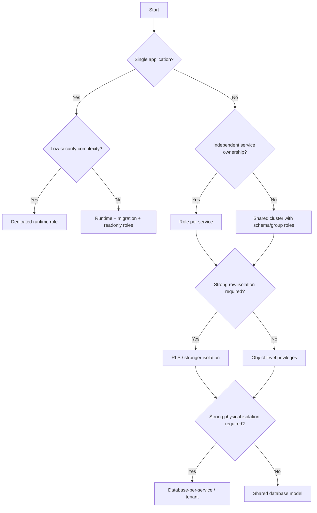

# 22- Choosing the Right Database Permission Model

## Overview

Database permission design determines which identities can connect to a database, which objects they can access, which operations they can perform, and which security boundaries the database itself can enforce.

The wrong permission model usually fails in one of two directions:

```text
Too permissive
    ↓
Large blast radius after compromise

Too restrictive
    ↓
Operational friction
    ↓
Privilege escalation requests
    ↓
Unsafe workarounds
```

A production permission model should balance:

- Least privilege
- Operational simplicity
- Security isolation
- Application requirements
- Multi-tenancy
- Compliance
- Scalability
- Developer productivity
- Recovery requirements

For PostgreSQL-backed systems, the central design question is not:

> "Which permissions should I grant?"

It is:

> **"Which identities exist, what responsibilities do they have, and where should each security boundary be enforced?"**

---

## The Permission Model Layers

Database authorization is layered.

```text
Network Access
      ↓
Database Connection
      ↓
Role Authentication
      ↓
Role Membership
      ↓
Database Privileges
      ↓
Schema Privileges
      ↓
Object Privileges
      ↓
Row-Level Security
      ↓
Application Authorization
```

These layers solve different problems.

| Layer | Main Question |
|---|---|
| Network | Can this workload reach PostgreSQL? |
| Authentication | Can this identity connect? |
| Role | Which database identity is being used? |
| Membership | Which other role privileges can it use? |
| Database | Can it connect to this database? |
| Schema | Can it access this namespace? |
| Object | Can it read/write/execute this object? |
| RLS | Which rows can it access? |
| Application | Is this business operation allowed? |

A secure design uses the minimum number of layers necessary to create a clear and enforceable boundary.

---

## Why Permission Models Matter

Suppose a production API uses:

```text
app_runtime
```

If that role has:

```text
SELECT
INSERT
UPDATE
DELETE
CREATE
DROP
SUPERUSER
```

then an application vulnerability can become a database-administration vulnerability.

A better design might be:

```text
Application
    ↓
app_runtime
    ↓
Required DML only
```

while schema changes use:

```text
CI/CD migration job
    ↓
app_migration
    ↓
DDL + required migration privileges
```

This separation reduces the blast radius of application compromise.

---

## Permission Model Decision Framework

Start with:

```text
Who needs database access?
        ↓
What workload do they perform?
        ↓
What objects do they need?
        ↓
What operations do they need?
        ↓
Do they need row-level isolation?
        ↓
Do they need privileged execution?
        ↓
How will access be audited?
```

The answer should produce explicit roles rather than ad-hoc grants.

---

## Common Permission Models

Several models are useful in production.

| Model | Isolation | Operational Complexity | Typical Use |
|---|---:|---:|---|
| Shared application role | Low | Low | Small/simple systems |
| Role-per-service | Medium/High | Medium | Microservices |
| Role-per-responsibility | High | Medium | Runtime/migration/reporting |
| Group roles | High | Medium | Larger organizations |
| RLS-based | High row isolation | High | Multi-tenant/shared tables |
| Schema-per-service | High | High | Shared PostgreSQL cluster |
| Database-per-service | Very high | High | Strong service isolation |
| Hybrid | Configurable | High | Large production platforms |

There is no universally correct model.

---

## Shared Application Role

The simplest design is one runtime role:

```text
app_runtime
    ↓
All application tables
```

### Advantages

- Simple configuration
- Easy deployment
- Low operational overhead
- Easy local development

### Limitations

A compromised application can potentially access every object granted to that role.

It also becomes difficult to distinguish:

```text
Orders service
Payments service
Reporting worker
```

if they all use the same identity.

### When It Is Reasonable

A shared role can be appropriate for:

- Small applications
- Monolithic services
- Low-risk internal systems
- Early-stage systems where complexity must remain low

Even then, avoid unnecessary administrative privileges.

---

## Role-per-Service

Microservices can use distinct database identities.

```text
orders-api
    ↓
orders_db_role

payments-api
    ↓
payments_db_role

reporting-api
    ↓
reporting_db_role
```

### Advantages

- Smaller blast radius
- Better attribution
- Easier service isolation
- Clearer ownership
- Easier privilege reviews

### Limitations

- More credentials
- More role management
- More migrations and deployment coordination
- Shared database schemas become harder to manage

Role-per-service is often a strong default for microservice architectures.

---

## Role-per-Responsibility

Instead of organizing only by service, organize by responsibility.

Example:

```text
app_runtime
app_readonly
app_migration
app_admin
backup_operator
recovery_operator
```

This is useful when the same service needs different privilege levels for different workflows.

For example:

```text
Normal API
    ↓
app_runtime

Migration job
    ↓
app_migration

Reporting
    ↓
app_readonly
```

---

## Group Roles

PostgreSQL roles can also represent permission groups.

For example:

```text
orders_read
orders_write
orders_admin
```

Users or service roles can then be granted membership in those roles.

Conceptually:

```text
Permission Group
       ↓
Role Membership
       ↓
Effective Privileges
```

This centralizes permission definitions.

---

## Group Roles vs Direct Grants

| Approach | Advantage | Limitation |
|---|---|---|
| Direct grants | Simple for small systems | Permission duplication |
| Group roles | Centralized policy | Membership complexity |
| Hybrid | Flexible | Requires discipline |

For larger systems, group roles can make permission management more maintainable.

---

## Database-Level Permissions

A PostgreSQL role may require:

```sql
GRANT CONNECT
ON DATABASE app
TO app_runtime;
```

This answers:

```text
Can this role connect to the database?
```

It does not automatically mean:

```text
Can it read every table?
```

Connection, schema, and object privileges are separate concepts.

---

## Schema-Level Permissions

A role may need schema usage:

```sql
GRANT USAGE
ON SCHEMA app
TO app_runtime;
```

Then object privileges can be granted separately.

This allows the security model to distinguish:

```text
Can access namespace?
```

from:

```text
Can access object?
```

---

## Table-Level Permissions

Table privileges should match the workload.

For a runtime service:

```sql
GRANT SELECT, INSERT, UPDATE, DELETE
ON TABLE app.orders
TO app_runtime;
```

Do not automatically grant:

```text
TRUNCATE
REFERENCES
TRIGGER
```

unless they are actually required.

---

## Read-Only Model

Reporting workloads should often use a dedicated read-only role.

```sql
CREATE ROLE app_readonly LOGIN;

GRANT CONNECT
ON DATABASE app
TO app_readonly;

GRANT USAGE
ON SCHEMA reporting
TO app_readonly;

GRANT SELECT
ON ALL TABLES IN SCHEMA reporting
TO app_readonly;
```

This prevents reporting clients from modifying production data.

---

## Read-Only Does Not Mean Replica

A read-only database role and a read replica solve different problems.

```text
Read-only role
    ↓
Authorization

Read replica
    ↓
Infrastructure / workload scaling
```

A read-only role can exist on the primary database.

A replica may contain broader data while restricting network and role access separately.

---

## Migration Permission Model

Schema migrations often require privileges that normal application requests do not.

Prefer:

```text
app_runtime
    → DML

app_migration
    → DDL + required migration operations
```

For example:

```text
CREATE TABLE
ALTER TABLE
CREATE INDEX
DROP INDEX
```

should generally not be available to normal request-serving processes.

---

## Owner Role Model

A stronger PostgreSQL architecture separates object ownership from runtime access.

```text
app_owner
    NOLOGIN
        ↓
Owns database objects

app_runtime
    LOGIN
        ↓
Uses database objects
```

Example:

```sql
CREATE ROLE app_owner NOLOGIN;
CREATE ROLE app_runtime LOGIN;

ALTER SCHEMA app OWNER TO app_owner;
```

The runtime role should receive only the required privileges.

---

## Why Ownership Separation Helps

If:

```text
app_runtime = object owner
```

then compromising the application identity may provide more administrative capability than intended.

Separating ownership creates:

```text
Runtime identity
        ≠
Object ownership identity
```

This is particularly useful for production systems with strict least-privilege requirements.

---

## Effective Privileges

Never evaluate authorization by looking only at direct `GRANT` statements.

Effective access may come from:

```text
Direct grants
+
Role membership
+
Object ownership
+
PUBLIC
+
RLS policies
+
Role attributes
```

For example:

```text
app_runtime
    ↓ member of
service_writer
    ↓
UPDATE orders
```

The application may therefore have privileges that are not directly granted to `app_runtime`.

---

## `SET ROLE`

Role membership can allow a session to change its effective role when permitted.

Conceptually:

```text
LOGIN role
    ↓
SET ROLE
    ↓
Privileged role
```

This should be treated as a privilege boundary.

Do not grant membership or role-switching capability without understanding the resulting effective access.

---

## `PUBLIC`

`PUBLIC` means all roles.

A grant such as:

```sql
GRANT EXECUTE
ON FUNCTION public.some_function()
TO PUBLIC;
```

can therefore expose functionality much more broadly than intended.

Review `PUBLIC` privileges for sensitive objects and functions.

---

## Default Privileges

For systems that create objects continuously, default privileges can prevent permission drift.

Example:

```sql
ALTER DEFAULT PRIVILEGES
FOR ROLE app_owner
IN SCHEMA app
GRANT SELECT, INSERT, UPDATE, DELETE
ON TABLES TO app_runtime;
```

Remember:

```text
Default privileges
    ↓
Future objects created by the specified role
```

They are not a retroactive replacement for auditing existing objects.

---

## Permission Model for Multiple Environments

Do not assume development and production need identical permissions.

A typical model is:

| Environment | Runtime Access | Administrative Access |
|---|---|---|
| Development | Broad enough for productivity | Developer-controlled |
| Staging | Production-like | Restricted |
| Production | Minimal | Controlled |
| DR | Minimal | Recovery-specific |

Production should have the strongest separation.

---

## Production vs Development Roles

Avoid copying production credentials into local environments.

Prefer:

```text
Developer
    ↓
Local database
    ↓
Local role
```

rather than:

```text
Developer
    ↓
Production credential
    ↓
Production database
```

This is both a security and operational requirement.

---

## Multi-Tenant Permission Models

Multi-tenant systems introduce another question:

```text
Can this role access the table?
```

is not enough.

You may also need:

```text
Can this role access this tenant's rows?
```

Possible models include:

```text
Application tenant filtering
RLS
Separate schemas
Database-per-tenant
Tenant-specific roles
Hybrid isolation
```

---

## Application Filtering

The simplest model is:

```python
Order.objects.filter(
    tenant_id=tenant_id,
    id=order_id,
)
```

### Advantages

- Simple
- Easy to understand
- Works well with most ORMs

### Limitation

Every access path must correctly apply the tenant predicate.

One missed query can become a cross-tenant data exposure.

---

## Row Level Security Model

PostgreSQL RLS can enforce tenant isolation at the database layer.

Conceptually:

```text
Application
    ↓
Database role
    ↓
Table privilege
    ↓
RLS policy
    ↓
Tenant-specific rows
```

This provides defense in depth.

However, RLS increases operational and debugging complexity and requires careful treatment of privileged roles and connection pooling.

---

## RLS Permission Model

A common tenant architecture might use:

```text
app_runtime
    ↓
SELECT/INSERT/UPDATE/DELETE
    ↓
RLS
    ↓
tenant_id = current transaction context
```

The application establishes tenant context before executing queries.

Use transaction-scoped state where appropriate:

```sql
BEGIN;

SET LOCAL app.tenant_id = 'tenant-123';

SELECT *
FROM orders;

COMMIT;
```

Do not treat application-provided context as authentication by itself.

---

## Choosing RLS

RLS is particularly useful when:

- Tenant isolation is critical.
- Multiple tenants share tables.
- Defense in depth is valuable.
- Database-level enforcement is required.

It may be unnecessary when:

- Each service has strong physical isolation.
- Data is already separated by database.
- Operational simplicity is more important.
- The application has a simpler and well-tested isolation model.

---

## Schema-per-Service

Multiple services can share a PostgreSQL cluster while using separate schemas.

```text
PostgreSQL
├── orders
├── payments
└── reporting
```

Each service receives access to its own schema.

### Advantages

- Logical isolation
- Shared infrastructure
- Centralized operations

### Limitations

- Still shares cluster resources
- Cross-schema access can become tempting
- Database ownership becomes important
- Services may become coupled through the same database

---

## Database-per-Service

Each service can have its own database.

```text
Orders Service
    ↓
Orders Database

Payments Service
    ↓
Payments Database
```

### Advantages

- Strong ownership boundary
- Independent permissions
- Independent scaling
- Reduced accidental coupling

### Limitations

- More infrastructure
- More backups
- More monitoring
- Cross-service queries become API/event-based
- Distributed transactions become harder

This model is often appropriate when service boundaries are mature.

---

## Shared Database Permission Model

A shared database requires explicit boundaries.

For example:

```text
orders-api
    ↓
orders schema

payments-api
    ↓
payments schema

reporting
    ↓
reporting schema
```

Avoid:

```text
every service
    ↓
all schemas
    ↓
all tables
```

unless there is a deliberate architectural reason.

---

## Cross-Service Access

Sometimes a service genuinely needs data owned by another service.

Prefer:

```text
Service A
    ↓
API / gRPC / Event
    ↓
Service B
```

rather than:

```text
Service A
    ↓
Direct SQL
    ↓
Service B tables
```

Direct cross-service database access creates hidden coupling and makes permission boundaries harder to maintain.

---

## Permission Model for Background Workers

Workers may require different permissions from HTTP APIs.

Example:

```text
orders-api
    ↓
orders_runtime

billing-worker
    ↓
billing_worker
```

Do not automatically reuse the API's credentials.

Worker permissions should be based on actual task requirements.

---

## Permission Model for Reporting

Reporting workloads often need:

```text
SELECT
```

but not:

```text
INSERT
UPDATE
DELETE
DDL
```

Prefer:

```text
Reporting role
    ↓
Read-only schema / replica / analytical store
```

depending on workload size and architecture.

---

## Permission Model for Admin Tools

Administrative tools require elevated privileges, but those privileges should be controlled.

Prefer:

```text
Normal engineer
    ↓
Standard role

Temporary operational task
    ↓
Approved elevated role
    ↓
Audit
```

Avoid permanently granting administrative privileges to every engineer.

---

## Temporary Privilege Escalation

Temporary access can reduce standing privilege.

Conceptually:

```text
Normal identity
      ↓
Approved request
      ↓
Temporary elevated role
      ↓
Operation
      ↓
Access removed
```

This is particularly valuable for production administration.

---

## Break-Glass Access

A break-glass mechanism provides emergency access when normal workflows are unavailable.

It should have:

- Strong authentication
- Explicit authorization
- Short duration
- Detailed auditing
- Clear ownership
- Post-incident review

Break-glass access should not become the normal operational path.

---

## Permission Model and Secrets

Each role with `LOGIN` capability generally introduces credential-management requirements.

As role count increases:

```text
More roles
   ↓
More credentials
   ↓
More rotation
   ↓
More secrets-management overhead
```

This is one reason role design should be deliberate.

Use centralized secret management and workload identity where supported.

---

## Permission Model and Connection Pools

A connection pool is normally associated with one database identity.

For example:

```text
orders-api pool
    ↓
orders_runtime
```

and:

```text
migration job
    ↓
migration identity
```

Avoid switching between unrelated security identities inside a shared application pool unless the behavior is deliberately designed and audited.

---

## PgBouncer Considerations

Connection poolers can change how session state behaves.

This matters for:

```text
SET
SET LOCAL
Prepared statements
Temporary tables
Advisory locks
Session-level state
```

Permission models that depend on session state must be tested against the selected pooling mode.

Transaction-scoped state is generally safer for request-specific authorization context.

---

## Permission Model and PostgreSQL Replicas

A read replica can use separate read-oriented access patterns.

For example:

```text
Primary
    ↓
Runtime write role

Replica
    ↓
Reporting read role
```

But replicas do not eliminate the need for correct authorization.

Network access, database roles, and object permissions still matter.

---

## Permission Model and Backups

Backup access should be separated from application access.

Prefer:

```text
app_runtime
    ✗ backup deletion

backup_operator
    ✓ backup operations

recovery_operator
    ✓ restore operations
```

A compromised application should not automatically gain control over production recovery assets.

---

## Permission Model and Auditing

Permission changes should be auditable.

Monitor:

```text
CREATE ROLE
ALTER ROLE
DROP ROLE
GRANT
REVOKE
Role membership changes
RLS policy changes
Security-definer function changes
```

This makes privilege escalation and configuration drift easier to detect.

---

## Permission Model and CI/CD

CI/CD pipelines should use dedicated identities.

For example:

```text
Deployment pipeline
    ↓
migration role

Application
    ↓
runtime role
```

Do not give a normal application container the same database privileges as the migration pipeline.

---

## Permission Model and Infrastructure as Code

Database roles and grants can be managed through controlled deployment processes.

For example:

```text
Schema definition
        ↓
Migration
        ↓
Permission changes
        ↓
Review
        ↓
CI/CD
        ↓
Production
```

The exact tooling can vary, but permissions should be versioned and reviewable where practical.

---

## Permission Drift

Permission drift occurs when actual database access diverges from intended policy.

Example:

```text
Service initially needs:
SELECT

Later receives:
SELECT + UPDATE + DELETE + CREATE

No longer needs:
UPDATE

But privilege remains.
```

Periodic access reviews are necessary.

---

## Permission Review

Review:

```text
Roles
Role memberships
Object ownership
Direct grants
Default privileges
PUBLIC privileges
RLS policies
Login capability
Privileged attributes
```

Do not review only application users.

---

## Effective Permission Inspection

PostgreSQL provides privilege-checking functions.

For example:

```sql
SELECT has_table_privilege(
    'app_runtime',
    'app.orders',
    'SELECT'
);
```

This helps answer:

```text
Does this identity actually have this privilege?
```

Catalog inspection can then be used for broader audits.

---

## Permission Matrix

Before implementing a production system, create a matrix.

| Identity | Orders | Payments | Reporting | DDL | Backup |
|---|---|---|---|---|---|
| `orders_runtime` | RW | None | None | No | No |
| `payments_runtime` | None | RW | None | No | No |
| `app_readonly` | R | R | R | No | No |
| `app_migration` | Required | Required | Required | Yes | No |
| `backup_operator` | Backup-specific | Backup-specific | Backup-specific | No | Yes |
| `recovery_operator` | Recovery-specific | Recovery-specific | Recovery-specific | Controlled | Yes |

The matrix should reflect actual requirements rather than theoretical access.

---

## Choosing a Permission Model

A practical decision tree:



The goal is to choose the simplest model that provides the required security boundary.

---

## Permission Model Comparison

| Model | Security | Complexity | Best Fit |
|---|---|---:|---|
| One runtime role | Low/Medium | Low | Simple monolith |
| Runtime + migration | Medium/High | Low | Most production applications |
| Role per service | High | Medium | Microservices |
| Group roles | High | Medium | Large permission sets |
| Schema isolation | High | Medium/High | Shared PostgreSQL cluster |
| RLS | Very high row isolation | High | Multi-tenancy |
| Database-per-service | Very high | High | Strong service ownership |
| Hybrid | Very high | High | Large platforms |

---

## Practical Production Model

A strong general-purpose PostgreSQL architecture is:

```text
                    PostgreSQL
                         │
          ┌──────────────┼──────────────┐
          │              │              │
      app_owner      reporting      migration
       NOLOGIN          ↓              ↓
          │         readonly          DDL
          │
          ▼
     app_runtime
        LOGIN
          │
     Required DML
          │
          ▼
      Application
```

For a larger microservice platform:

```text
PostgreSQL Cluster
│
├── orders schema
│     └── orders_runtime
│
├── payments schema
│     └── payments_runtime
│
└── reporting schema
      └── reporting_readonly
```

Add RLS where row-level isolation is required.

---

## Security Trade-Offs

Permission models always involve trade-offs.

### More Roles

```text
Security ↑
Operational complexity ↑
```

### More Shared Roles

```text
Operational simplicity ↑
Isolation ↓
```

### More RLS

```text
Database enforcement ↑
Policy complexity ↑
```

### Database-per-Service

```text
Isolation ↑
Infrastructure complexity ↑
```

### Direct Database Access

```text
Performance / simplicity ↑
Service coupling ↑
```

The correct model depends on the required boundary.

---

## Performance Considerations

Most ordinary PostgreSQL privilege checks are not the primary performance bottleneck in backend systems.

However, complex security policies can affect query planning and execution.

Pay particular attention to:

```text
RLS predicates
Complex policy expressions
Function calls inside policies
Large multi-tenant tables
```

Security design should therefore be validated using realistic query plans and workloads.

---

## RLS Performance

For tenant-aware queries:

```sql
CREATE INDEX orders_tenant_created_idx
ON orders (tenant_id, created_at DESC);
```

can support common tenant filtering and ordering patterns.

However, indexes should be based on actual access patterns and query plans rather than created solely because RLS exists.

---

## Security and Availability

Overly restrictive permissions can create availability incidents.

For example:

```text
Credential rotation
    ↓
New role lacks required privilege
    ↓
Application deployment succeeds
    ↓
Requests fail with permission errors
```

Permission changes should therefore be tested before production rollout.

---

## Permission Changes During Deployment

Prefer controlled ordering:

```text
Create new role / grant
        ↓
Deploy code
        ↓
Verify
        ↓
Remove obsolete access
```

Avoid removing a privilege before all application instances stop depending on it.

This is particularly important during rolling Kubernetes deployments.

---

## Zero-Downtime Permission Changes

For a privilege migration:

```text
Old privilege
      +
New privilege
      ↓
Deploy
      ↓
Verify new path
      ↓
Remove old privilege
```

This follows the same compatibility principle used in expand-and-contract schema migrations.

---

## Failure Modes

Important failure scenarios include:

| Failure | Result |
|---|---|
| Missing schema privilege | Queries fail |
| Missing sequence privilege | Inserts may fail |
| Incorrect RLS policy | Access denied or data exposure |
| Excessive role membership | Privilege escalation |
| Wrong ownership | Unexpected administrative access |
| Stale default privileges | New objects inaccessible |
| Shared credential compromise | Large blast radius |
| Pool context leak | Cross-tenant exposure |
| Incorrect migration role | Deployment failure |

Permission testing should explicitly cover these cases.

---

## Testing Permission Models

Security tests should verify both:

```text
Allowed operations
```

and:

```text
Forbidden operations
```

Example:

```text
orders_runtime
    ✓ SELECT orders
    ✓ UPDATE orders
    ✗ DROP orders
    ✗ Access payments
```

Negative tests are especially important because authorization bugs often involve access that should have been denied.

---

## Automated Permission Tests

A deployment pipeline can validate:

```text
Role exists
Role membership is correct
Expected privileges exist
Forbidden privileges do not exist
RLS is enabled where required
Expected policies exist
```

This turns permission design into a testable artifact rather than tribal knowledge.

---

## Common Mistakes

### One Superuser for Everything

**Problem:** Application compromise becomes full database compromise.

**Better:** Separate runtime, migration, reporting, backup, recovery, and administrative roles.

### One Role per Human User

**Problem:** Large numbers of individual database accounts create operational complexity and encourage permission drift.

**Better:** Use service and group roles where appropriate, with human identity managed through the organization's access-control system.

### Giving Runtime Roles DDL

**Problem:** A compromised application can alter or destroy database structures.

**Better:** Keep schema changes in controlled migration workflows.

### Granting `ALL PRIVILEGES`

**Problem:** It is easy to grant significantly more access than required.

**Better:** Grant only required operations.

### Ignoring Role Membership

**Problem:** Effective access may come indirectly through another role.

**Better:** Review memberships and effective privileges.

### Ignoring Object Ownership

**Problem:** The owner has capabilities beyond ordinary grants.

**Better:** Use dedicated ownership roles where stronger separation is required.

### Granting to `PUBLIC`

**Problem:** All database roles receive the privilege.

**Better:** Grant explicitly to the required role.

### Assuming Default Privileges Are Retroactive

**Problem:** Existing objects remain unchanged.

**Better:** Apply explicit grants to existing objects and configure default privileges for future objects.

### Treating Read-Only as Read Replica

**Problem:** These solve different problems.

**Better:** Design authorization and infrastructure scaling independently.

### Giving Every Microservice Access to Every Table

**Problem:** Service boundaries become meaningless and compromise blast radius increases.

**Better:** Grant access only to owned or explicitly required data.

### Using RLS Without Understanding Privileged Roles

**Problem:** Owners, superusers, or `BYPASSRLS` roles can affect the intended isolation model.

**Better:** Include privileged-role behavior in the security design and tests.

### Forgetting Connection Pooling

**Problem:** Session-specific tenant or security state can leak between requests.

**Better:** Use transaction-scoped state and verify behavior under the actual pool configuration.

### Changing Permissions Without Deployment Planning

**Problem:** Rolling deployments may contain old and new application versions simultaneously.

**Better:** Use additive changes first, deploy, verify, then remove obsolete privileges.

### Never Reviewing Permissions

**Problem:** Privileges accumulate over time.

**Better:** Perform periodic access reviews and automate drift detection where practical.

---

## Production Checklist

### Identity

- [ ] Every production workload has a defined database identity.
- [ ] Runtime and administrative identities are separated.
- [ ] Migration access is separate from runtime access.
- [ ] Background workers have appropriate identities.
- [ ] Reporting identities are read-only where possible.
- [ ] Backup and recovery identities are separated.

### Privileges

- [ ] Database access follows least privilege.
- [ ] Schema access is explicitly controlled.
- [ ] Table privileges are explicitly defined.
- [ ] Sequence privileges are tested.
- [ ] Function execution privileges are reviewed.
- [ ] `PUBLIC` privileges are reviewed.
- [ ] Role memberships are reviewed.
- [ ] Object ownership is understood.
- [ ] Privileged role attributes are restricted.

### Application

- [ ] SQL values are parameterized.
- [ ] Dynamic SQL identifiers are allowlisted.
- [ ] Business authorization is enforced.
- [ ] Resource-level authorization is tested.
- [ ] Tenant boundaries are enforced.
- [ ] RLS is used where appropriate.

### Operations

- [ ] Permissions are version-controlled where practical.
- [ ] Permission changes are reviewed.
- [ ] Permission drift is monitored.
- [ ] Production access is audited.
- [ ] Temporary privileged access is controlled.
- [ ] Break-glass access is audited.
- [ ] Permission changes are tested before deployment.

### Infrastructure

- [ ] PostgreSQL is network-restricted.
- [ ] TLS is used where required.
- [ ] Database credentials are centrally managed.
- [ ] Connection pooling is configured safely.
- [ ] Replica permissions are reviewed.
- [ ] Backup access is separately controlled.
- [ ] Recovery permissions are restricted.

### Testing

- [ ] Allowed operations are tested.
- [ ] Forbidden operations are tested.
- [ ] RLS policies are tested.
- [ ] Role membership is tested.
- [ ] Migration permissions are tested.
- [ ] Permission changes are tested during rolling deployments.
- [ ] Recovery access is tested.

---

## Senior-Level Decision Questions

Before choosing a permission model, answer:

```text
What is the security boundary?

Who owns the data?

Which services need direct database access?

Which services only need APIs or events?

Which operations are runtime operations?

Which operations are administrative?

Which operations require DDL?

Do tenants require database-enforced isolation?

Who can bypass RLS?

Who owns database objects?

Who can grant privileges?

Who can modify roles?

Who can access backups?

Who can restore production data?

How will permissions be audited?

How will permission drift be detected?

How will permissions change without downtime?
```

These questions expose architectural problems that a simple `GRANT` statement cannot solve.

---

## Recommended Default Model

For a typical production backend, a strong starting point is:

```text
                    PostgreSQL
                        │
        ┌───────────────┼────────────────┐
        │               │                │
     app_owner      app_runtime     app_readonly
      NOLOGIN          LOGIN             LOGIN
        │               │                │
        │               │                └── SELECT
        │               │
        │               └── Required DML
        │
        └── Owns objects

                 Separate identity
                       │
                 app_migration
                       │
                    Required DDL
```

Then add:

```text
Role groups
RLS
Service-specific roles
Separate schemas
Database-per-service
Temporary administrative access
```

only when the system's security and operational requirements justify them.

---

## Decision Heuristic

Use the simplest model that provides the required isolation.

```text
Simple monolith
    ↓
Dedicated runtime role
+
Separate migration role

Multiple services
    ↓
Role per service
+
Least-privilege object access

Shared multi-tenant tables
    ↓
Application authorization
+
RLS where justified

Strong service isolation
    ↓
Database-per-service

Highly privileged operations
    ↓
Separate administrative/recovery identities
+
Audit
+
Temporary access where practical
```

Avoid both extremes:

```text
One role with everything
```

and:

```text
Hundreds of roles with unmanageable policy complexity
```

A good permission model is **explicit, reviewable, testable, and proportional to the security boundary being protected**.

---

## Key Takeaways

- **Choose permissions around identities and responsibilities**, separating runtime, migration, reporting, worker, administrative, backup, and recovery access where appropriate.
- **Evaluate effective privileges, not just direct grants**; role membership, ownership, `PUBLIC`, role attributes, and RLS all affect the actual security boundary.
- **Use database-level isolation deliberately:** object privileges are usually sufficient for simple services, while RLS, schema isolation, or database-per-service models provide stronger boundaries when justified.
- **Treat permission changes as production deployments**, using additive changes, automated tests, auditing, drift detection, and careful coordination with rolling application releases.
- **Prefer the simplest model that provides the required security**, because excessive privilege is dangerous but unnecessary permission complexity can create operational failures and unsafe workarounds.