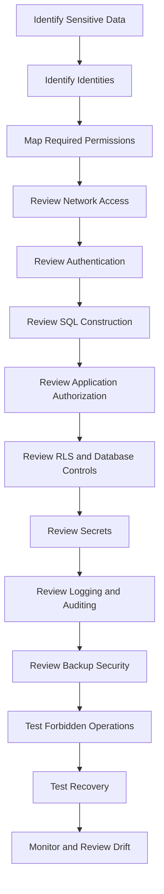

# 23- Common SQL Security Mistakes

## Overview

Most SQL security incidents are not caused by a missing security feature. They are caused by incorrect assumptions about trust boundaries, excessive privileges, unsafe query construction, weak operational controls, or security mechanisms that were never tested under realistic failure conditions.

Common database security failures include:

```text
Application compromise
        ↓
Overprivileged database role
        ↓
Unauthorized database access
        ↓
Sensitive data exposure
```

or:

```text
Compromised production environment
        ↓
Backup credentials also accessible
        ↓
Backups deleted or copied
        ↓
Recovery capability compromised
```

A strong PostgreSQL security model therefore needs defense in depth:

```text
Network isolation
      ↓
TLS
      ↓
Authentication
      ↓
Least-privilege roles
      ↓
Parameterized SQL
      ↓
Application authorization
      ↓
RLS where appropriate
      ↓
Auditing
      ↓
Protected backups
      ↓
Monitoring and incident response
```

The goal is not to eliminate every possible risk. The goal is to make unauthorized access difficult, limit the blast radius when a component is compromised, detect important security events, and preserve the ability to recover.

---

## Security Mistakes at a Glance

| Mistake | Primary Risk | Better Practice |
|---|---|---|
| Superuser application role | Full DB compromise | Least-privilege runtime role |
| SQL string interpolation | SQL injection | Parameterized queries |
| Missing object authorization | Data exposure | Resource-level authorization |
| One shared DB credential | Large blast radius | Separate workload identities |
| Runtime role owns tables | Excessive privilege | Dedicated owner role |
| Excessive `PUBLIC` privileges | Unintended access | Explicit grants |
| Ignoring role membership | Hidden privileges | Review effective privileges |
| RLS without privileged-role review | Isolation bypass | Review owners/`BYPASSRLS` |
| Secrets in source/logs | Credential compromise | Secret manager + redaction |
| Public PostgreSQL endpoint | Attack surface | Private networking |
| Unencrypted connections | Data interception | TLS |
| Unprotected backups | Data exposure | Encryption + isolation |
| No restore testing | Recovery failure | Regular restore tests |
| Logging sensitive values | Secondary data leak | Redaction/minimization |
| No permission review | Privilege drift | Periodic access reviews |

---

## Using a Superuser for the Application

One of the most dangerous configurations is:

```text
Django / FastAPI
      ↓
PostgreSQL superuser
```

A SQL injection vulnerability or application compromise can become complete database compromise.

The application may gain the ability to:

```text
Read all data
Modify all data
Drop tables
Create roles
Change privileges
Disable security controls
Bypass RLS
```

### Better Model

Use a dedicated runtime role:

```text
Application
    ↓
app_runtime
    ↓
Required DML only
```

Schema administration should use a separate identity.

---

## Giving Runtime Roles DDL Permissions

An application usually needs:

```text
SELECT
INSERT
UPDATE
DELETE
```

It usually does not need:

```text
CREATE TABLE
ALTER TABLE
DROP TABLE
CREATE ROLE
```

Giving runtime processes DDL creates unnecessary privilege.

Prefer:

```text
Application
    ↓
app_runtime

CI/CD migration job
    ↓
app_migration
```

This is especially important in Kubernetes, where a compromised application pod should not automatically become a database administrator.

---

## Making the Application Role the Object Owner

A subtle PostgreSQL mistake is:

```text
app_runtime
    ↓
owns all production tables
```

Ownership provides capabilities beyond ordinary table privileges.

A stronger model is:

```text
app_owner
    NOLOGIN
       ↓
owns objects

app_runtime
    LOGIN
       ↓
uses objects
```

This creates a separation between:

```text
Who owns the database structure?
```

and:

```text
Who serves application requests?
```

---

## Using One Database Credential Everywhere

A common architecture is:

```text
orders-api
payments-api
reporting
Celery
migration jobs
    ↓
same database username/password
```

This creates a large blast radius.

If that credential is compromised:

```text
One credential
     ↓
Many workloads
     ↓
Large access boundary
```

It also makes attribution difficult.

Prefer separate identities:

```text
orders_runtime
payments_runtime
reporting_readonly
migration_role
```

where the operational model justifies the separation.

---

## Hard-Coding Database Credentials

Never put production credentials directly into source code.

Bad:

```python
DATABASE_URL = (
    "postgresql://app:production-password@db:5432/app"
)
```

This can expose credentials through:

```text
Git history
Code review
Docker images
Build artifacts
Developer machines
Logs
```

Prefer centralized secret management or workload identity mechanisms.

---

## Putting Secrets in Docker Images

Avoid:

```dockerfile
ENV DATABASE_PASSWORD=production-secret
```

Image layers and registries may retain information longer than expected.

Prefer runtime secret injection.

For Kubernetes and AWS environments, use the platform's supported identity and secret-management mechanisms rather than baking credentials into application artifacts.

---

## Logging Secrets

Security logging can accidentally create a new vulnerability.

Never routinely log:

```text
Passwords
API keys
Access tokens
Refresh tokens
Encryption keys
TLS private keys
Database credentials
```

A log aggregation system may have access granted to many more people than the production database.

---

## Logging Sensitive SQL Parameters

Full SQL logging can expose sensitive values.

For example:

```sql
INSERT INTO credentials(service, secret)
VALUES ('payments', 'very-sensitive-secret');
```

Logging the complete statement may create a second copy of the secret.

Prefer:

```text
Query name
Operation
Object
Request ID
Duration
Result
```

where possible, with sensitive values redacted.

---

## SQL String Interpolation

Unsafe:

```python
query = f"""
    SELECT id
    FROM users
    WHERE email = '{email}'
"""
```

The problem is that input becomes part of SQL syntax.

An attacker may manipulate the query structure.

Use parameterized queries:

```python
cursor.execute(
    """
    SELECT id
    FROM users
    WHERE email = %s
    """,
    (email,),
)
```

---

## Assuming Parameterization Solves Every Security Problem

Parameterized queries protect SQL values from injection, but they do not solve:

```text
Authorization
Privilege escalation
Unsafe dynamic identifiers
Credential leakage
Excessive database privileges
Insecure backups
RLS misconfiguration
```

SQL injection prevention is one layer of database security, not the entire model.

---

## Unsafe Dynamic SQL

This is dangerous:

```python
query = f"SELECT * FROM {table_name}"
```

A table name is SQL structure, not a normal parameter value.

For dynamic identifiers:

```text
Validate
    ↓
Allowlist
    ↓
Construct SQL safely
```

Example:

```python
allowed_tables = {
    "orders": "app.orders",
    "customers": "app.customers",
}

table = allowed_tables[user_value]
```

Do not allow arbitrary user input to become SQL syntax.

---

## Dynamic `ORDER BY`

A common mistake is:

```python
query = f"""
    SELECT id, name
    FROM users
    ORDER BY {sort}
"""
```

Instead, use an allowlist:

```python
allowed_sort_columns = {
    "name": "name",
    "created": "created_at",
}

sort_column = allowed_sort_columns[user_sort]
```

The application controls the available SQL structure.

---

## Missing Resource-Level Authorization

This is a common API security bug.

Unsafe:

```python
order = Order.objects.get(id=order_id)
```

If the endpoint does not verify ownership, an authenticated user may access another user's order.

Prefer authorization-aware queries:

```python
order = (
    Order.objects
    .filter(
        id=order_id,
        customer_id=request.user.customer_id,
    )
    .first()
)
```

The important principle is:

```text
Authenticated
    ≠
Authorized
```

---

## Relying Only on Authentication

A valid session proves identity.

It does not prove permission.

For example:

```text
User authenticated
        ↓
Requests another customer's invoice
```

The system must verify:

```text
Does this user have access to this invoice?
```

This distinction applies to Django, FastAPI, REST APIs, and gRPC services.

---

## Relying Only on Application Authorization

Application authorization is necessary, but a database can provide useful defense in depth.

Consider:

```text
Application bug
      ↓
Missing tenant filter
      ↓
Cross-tenant query
```

RLS can provide another boundary:

```text
Application
    ↓
Database
    ↓
RLS
    ↓
Tenant-specific rows
```

Use database-level controls when they provide meaningful additional protection.

---

## Relying Only on RLS

The opposite mistake is assuming RLS solves everything.

RLS behavior depends on:

```text
Role
+
Table ownership
+
BYPASSRLS
+
Policy definitions
+
FORCE ROW LEVEL SECURITY
```

Superusers and roles with `BYPASSRLS` can bypass RLS, while table owners normally bypass it unless forced into RLS.

Privileged identities must therefore be explicitly included in the threat model.

---

## Incorrect Tenant Context with Connection Pooling

Consider:

```text
Request A
tenant=A
    ↓
Pooled connection
    ↓
Request B
tenant=B
```

If request-specific session state is not correctly scoped, tenant context can leak.

For transaction-scoped database context, prefer mechanisms such as:

```sql
BEGIN;

SET LOCAL app.tenant_id = 'tenant-a';

-- Queries

COMMIT;
```

Test this behavior under the actual connection-pooling configuration.

---

## Trusting Application-Provided Tenant Context

An application-provided setting such as:

```sql
SET LOCAL app.tenant_id = 'tenant-a';
```

is useful for correlation and RLS policy evaluation, but it should not itself be treated as proof that the caller belongs to that tenant.

The application must authenticate and authorize the caller first.

Think of:

```text
Application authorization
        +
Trusted transaction context
        +
RLS
```

as layered controls.

---

## Excessive `PUBLIC` Privileges

PostgreSQL's `PUBLIC` role represents all roles.

A grant such as:

```sql
GRANT EXECUTE
ON FUNCTION public.some_function()
TO PUBLIC;
```

may expose functionality much more broadly than intended.

Review:

```text
Tables
Functions
Schemas
Sequences
```

for unnecessary `PUBLIC` privileges.

---

## Assuming Default Privileges Are Retroactive

This is incorrect:

```text
ALTER DEFAULT PRIVILEGES
        ↓
Fixes all existing objects
```

Default privileges apply to future objects created by the relevant object-creating role.

Existing objects still require explicit permission management.

---

## Ignoring Role Membership

A role may receive privileges indirectly.

For example:

```text
app_runtime
    ↓ member of
service_writer
    ↓
UPDATE orders
```

Looking only at direct grants can therefore produce an incorrect security assessment.

Review:

```text
Direct privileges
+
Role membership
+
Ownership
+
PUBLIC
+
Role attributes
```

---

## Ignoring `SET ROLE`

Role membership can provide the ability to assume another role when permitted.

For example:

```text
Login role
    ↓
SET ROLE
    ↓
Privileged role
```

Role membership and role-switching capabilities should therefore be included in privilege reviews.

---

## Giving `CREATEROLE` to Applications

`CREATEROLE` is not equivalent to `SUPERUSER`, but it still grants meaningful role-management authority.

An application normally has no reason to create or administer PostgreSQL roles.

Do not grant role-management capabilities merely because they make deployment scripts easier.

---

## Giving `BYPASSRLS` Broadly

`BYPASSRLS` is a powerful capability for systems that rely on row-level isolation.

Do not grant it to normal application roles.

If a privileged administrative role requires it, make the access:

```text
Explicit
Restricted
Audited
```

---

## Weak `SECURITY DEFINER` Functions

`SECURITY DEFINER` functions execute with the owner's privileges.

A poorly designed function can therefore cross privilege boundaries.

Risks include:

```text
Unsafe search_path
Overprivileged owner
Broad EXECUTE privilege
Unqualified object references
Dynamic SQL injection
```

Use a minimally privileged owner and a secure execution environment.

---

## Unsafe `search_path` in Privileged Functions

Security-sensitive functions should avoid attacker-controlled object resolution.

A safer pattern is to explicitly control the function's `search_path` and qualify references where practical.

For example:

```sql
CREATE FUNCTION app.secure_operation()
RETURNS void
LANGUAGE plpgsql
SECURITY DEFINER
SET search_path = app, pg_temp
AS $$
BEGIN
    -- Privileged operation.
END;
$$;
```

The exact trusted schema design depends on the application.

---

## Granting `EXECUTE` Broadly on Privileged Functions

A secure function is not useful if every database role can execute it.

Review:

```sql
GRANT EXECUTE
ON FUNCTION app.secure_operation()
TO some_role;
```

and ensure only intended roles receive access.

---

## Exposing PostgreSQL Directly to the Internet

A public PostgreSQL endpoint increases attack surface.

Prefer:

```text
Internet
   ↓
Nginx / Load Balancer
   ↓
Application
   ↓
Private PostgreSQL
```

Administrative access should use controlled network paths such as private connectivity, bastions, VPNs, or equivalent secure mechanisms.

---

## Assuming Private Networking Is Enough

A private subnet does not automatically make a database secure.

A compromised workload inside the private network may still attempt:

```text
Database connections
Credential attacks
Lateral movement
```

Use:

```text
Network restrictions
+
Authentication
+
Authorization
+
Least privilege
```

together.

---

## Disabling TLS for "Internal" Traffic

Internal traffic can still be intercepted or observed after:

```text
Credential compromise
Lateral movement
Network misconfiguration
Proxy compromise
```

Use TLS according to the system's trust requirements.

For PostgreSQL clients, distinguish encryption from server identity verification and configure certificate validation appropriately.

---

## Using Weak Database Passwords

A database exposed to an attacker should not rely on easily guessable credentials.

Prefer:

```text
Strong random credentials
+
Secret management
+
Rotation
+
Restricted network access
```

Where supported, prefer identity-based authentication over long-lived static credentials.

---

## Never Rotating Credentials

Static credentials tend to spread over time.

```text
Secret
   ↓
Application
   ↓
CI/CD
   ↓
Developer environment
   ↓
Old deployment
```

Rotate credentials and remove obsolete access.

Design rotation so that old and new credentials can overlap briefly when necessary to avoid downtime.

---

## Sharing Production Credentials with Developers

This creates a major security and operational problem.

Prefer:

```text
Developer
    ↓
Local database / controlled staging
```

rather than:

```text
Developer
    ↓
Production database
```

When production data is required for troubleshooting, use controlled access, appropriate authorization, auditing, and sanitized data where possible.

---

## Copying Production Data into Development

This is especially dangerous when data contains:

```text
PII
Financial information
Credentials
Tokens
Internal security information
```

Prefer synthetic data.

If production-derived data is required, apply appropriate masking or anonymization and tightly control access.

---

## Treating Backups as Ordinary Storage

A database backup may contain the entire production dataset.

Bad:

```text
Production backup
    ↓
Publicly accessible object storage
```

Better:

```text
Production
    ↓
Encrypted backup
    ↓
Private / isolated storage
    ↓
Restricted IAM
    ↓
Immutable copy where required
```

---

## Giving Applications Backup Delete Permissions

An application should normally not be able to delete recovery assets.

Otherwise:

```text
Application compromise
      ↓
Backup deletion
      ↓
Recovery capability destroyed
```

Separate runtime, backup, and recovery identities.

---

## Treating Replicas as Backups

A replica is not a substitute for an independent backup.

For example:

```text
Accidental DELETE
      ↓
Primary
      ↓
Replica
```

The deletion may be replicated.

Backups provide historical recovery points that replicas do not necessarily provide.

---

## Never Testing Restores

A successful backup job is not proof of recoverability.

A backup may fail because of:

```text
Corruption
Missing WAL
Unavailable encryption key
Incorrect permissions
Broken metadata
Network problems
Insufficient recovery capacity
```

Regular restore tests provide much stronger evidence.

---

## Ignoring Backup Encryption Keys

An encrypted backup is useless during an incident if the recovery identity cannot access its key.

Test:

```text
Backup
+
Encryption key
+
IAM
+
Recovery environment
```

as one complete workflow.

---

## Retaining Backups Forever

Infinite retention increases:

```text
Storage cost
Attack surface
Privacy exposure
Compliance obligations
```

Define retention based on:

```text
RPO
Compliance
Recovery requirements
Data-retention policy
Cost
```

---

## Logging Everything

Enabling broad SQL logging in production can create:

```text
Large log volume
Performance overhead
High storage cost
Sensitive-data exposure
```

Security logging should focus on high-value events.

Examples:

```text
Authentication
Role changes
GRANT / REVOKE
DDL
Privileged operations
Sensitive access
```

---

## Not Logging Security-Sensitive Changes

The opposite mistake is logging too little.

Monitor important changes such as:

```text
CREATE ROLE
ALTER ROLE
DROP ROLE
GRANT
REVOKE
RLS policy changes
Security-definer function changes
Backup deletion
```

Without these events, privilege escalation can be difficult to investigate.

---

## Storing Audit Logs Only in PostgreSQL

If an attacker compromises the database, they may be able to alter or delete local audit records.

For high-value audit requirements:

```text
PostgreSQL
    ↓
Central collector
    ↓
Separate storage / SIEM
```

Consider immutable storage where the threat model requires stronger evidence protection.

---

## Trusting Audit Logs Without Protecting Them

Audit logs are themselves sensitive data.

Protect them with:

```text
Access control
Encryption
Restricted administration
Retention policies
Integrity controls
Centralization
```

Otherwise the audit system can become an attack target.

---

## Missing Request Correlation

A database may only record:

```text
app_runtime
UPDATE customers
```

while the application knows:

```text
user_id
request_id
service
endpoint
```

Without correlation, investigations become harder.

Where appropriate, propagate request context through the system.

---

## Treating Request Context as Authentication

Request IDs and application user IDs are useful correlation data.

They are not automatically trustworthy authentication credentials.

For example:

```text
SET LOCAL app.user_id = 'admin';
```

should not itself authorize administrative access.

Use authenticated identities and authorization controls independently.

---

## Ignoring Background Workers

Database activity can originate from:

```text
Celery
Kafka consumers
Scheduled jobs
Migration jobs
Data pipelines
```

If only HTTP requests are monitored, important database activity may appear unexplained.

Use workload-specific identities and security logging.

---

## Giving Celery Workers Full Database Access

A worker may need only:

```text
SELECT
UPDATE
```

on specific tables.

Giving it:

```text
SUPERUSER
DDL
Role management
```

is unnecessary unless explicitly required.

Worker permissions should match task requirements.

---

## Giving CI/CD Full Database Administration

CI/CD is a privileged production actor.

A pipeline compromise can be devastating if it has:

```text
Database superuser
+
Backup deletion
+
KMS administration
+
Production infrastructure administration
```

Use narrowly scoped identities and separate responsibilities where practical.

---

## Ignoring Permission Drift

Permissions tend to grow.

For example:

```text
Initial:
SELECT

Later:
SELECT + INSERT

Later:
SELECT + INSERT + UPDATE + DELETE

Eventually:
ALL PRIVILEGES
```

Without periodic review, least privilege gradually disappears.

---

## Not Testing Negative Permissions

Many systems test:

```text
Can the application perform required operations?
```

but not:

```text
Can the application perform forbidden operations?
```

Security tests should verify both.

Example:

```text
orders_runtime
    ✓ SELECT orders
    ✓ UPDATE orders
    ✗ DROP orders
    ✗ Access payments
```

---

## Changing Permissions Without Deployment Planning

Suppose:

```text
Application version A
    ↓
Requires UPDATE

New permission model
    ↓
UPDATE removed
```

During a rolling deployment, old pods may still need the permission.

Prefer:

```text
Grant new access
      ↓
Deploy
      ↓
Verify
      ↓
Remove obsolete access
```

This is the permission equivalent of expand-and-contract deployment strategy.

---

## Ignoring Connection Pool Behavior

A database connection may be reused by many requests.

Unsafe assumptions about session state can produce:

```text
Tenant context leakage
User context leakage
Unexpected role state
Security-policy bypass
```

Test the permission model using the actual:

```text
Django configuration
SQLAlchemy pool
PgBouncer mode
Kubernetes deployment
```

used in production.

---

## Assuming ORM Means SQL Security Is Solved

Django ORM and SQLAlchemy provide safer query construction patterns, but developers can still introduce security problems through:

```text
Raw SQL
Dynamic SQL
Unsafe filters
Authorization bugs
Excessive database privileges
Sensitive logging
```

The ORM reduces certain classes of risk; it does not replace security engineering.

---

## Unsafe Raw SQL in Django

Avoid:

```python
query = (
    "SELECT * FROM users "
    f"WHERE email = '{email}'"
)
```

Prefer:

```python
User.objects.filter(email=email)
```

or properly parameterized raw SQL when ORM functionality is insufficient.

---

## Unsafe SQL in FastAPI

FastAPI does not provide database authorization automatically.

The application still needs:

```text
Authentication
Authorization
Parameterized SQL
Least-privilege database credentials
```

Framework choice does not change the database security model.

---

## Ignoring API Authorization Because the Database Is Secure

Even if PostgreSQL is perfectly configured, an API can still expose unauthorized business operations.

For example:

```text
User A
    ↓
POST /orders/123/cancel
    ↓
Application fails ownership check
    ↓
Unauthorized cancellation
```

Database security and business authorization solve different problems.

---

## Ignoring Business Invariants

Some security-related invariants should be enforced by the database.

For example:

```sql
CREATE TABLE account_memberships (
    account_id bigint NOT NULL,
    user_id bigint NOT NULL,
    role text NOT NULL,
    UNIQUE (account_id, user_id)
);
```

The database should enforce critical integrity rules so that alternate write paths cannot violate them.

---

## Using Database Security as a Substitute for Network Security

Database permissions do not protect against:

```text
Network scanning
Credential attacks
Connection floods
Traffic interception
```

Use layered controls:

```text
VPC
+
Security Groups
+
NetworkPolicy
+
TLS
+
Database authentication
+
Authorization
```

---

## Ignoring Connection Limits

A compromised service can create excessive database connections.

Connection pooling and database limits help contain this.

Consider:

```text
Application pool limits
+
PgBouncer where appropriate
+
PostgreSQL connection limits
+
Timeouts
+
Network controls
```

Security and availability overlap here.

---

## Ignoring Query Resource Abuse

An authenticated but malicious user may submit expensive queries.

Controls can include:

```text
Statement timeouts
Connection limits
Query restrictions
Read-only roles
Resource isolation
Rate limiting
```

Do not solve every resource-abuse problem with permissions alone.

---

## Not Monitoring Privileged Access

High-risk identities deserve stronger monitoring:

```text
Superuser
DBA
Migration role
Backup operator
Recovery operator
Security administrator
```

Monitor:

```text
Login
Privilege changes
DDL
Sensitive operations
Backup access
```

---

## Ignoring Disaster Recovery Security

A DR environment may accidentally have weaker controls.

Verify that recovery preserves:

```text
Roles
Privileges
RLS
TLS
Secrets
Network restrictions
Audit logging
Backup protection
```

A recovered system with broken authorization is not a successful recovery.

---

## Ignoring Recovery Side Effects

Restoring a database may cause:

```text
Celery tasks
Kafka consumers
Webhook deliveries
Payment processing
Email
```

to execute again.

Recovery procedures must account for application state and idempotency, not only database restoration.

---

## Security Review Workflow

A practical security review can follow:



---

## Security Review Questions

Before production deployment, ask:

### Identity

- Which services can connect?
- Which humans can connect?
- Which database roles exist?
- Which roles can log in?
- Which roles can assume other roles?

### Authorization

- What can each role read?
- What can each role write?
- Who can execute privileged functions?
- Who owns database objects?
- Who can bypass RLS?
- What privileges are granted to `PUBLIC`?

### Application

- Are SQL values parameterized?
- Is dynamic SQL allowlisted?
- Is resource-level authorization enforced?
- Are tenant boundaries enforced?
- Are background workers authorized correctly?

### Infrastructure

- Is PostgreSQL private?
- Is TLS configured correctly?
- Are secrets centrally managed?
- Are Kubernetes workloads isolated?
- Are AWS IAM permissions scoped?

### Operations

- Are privilege changes audited?
- Are security logs centralized?
- Are backups encrypted?
- Are backups isolated?
- Are restores tested?
- Is permission drift monitored?

---

## Production Security Checklist

### Authentication

- [ ] Strong database authentication is configured.
- [ ] Production credentials are not hard-coded.
- [ ] Credentials are centrally managed.
- [ ] Credential rotation is supported.
- [ ] Workload identity is used where appropriate.
- [ ] Administrative authentication is stronger than normal runtime authentication.

### Authorization

- [ ] Runtime roles follow least privilege.
- [ ] Migration roles are separate.
- [ ] Reporting roles are read-only where possible.
- [ ] Background workers have appropriate permissions.
- [ ] Role membership is reviewed.
- [ ] Object ownership is understood.
- [ ] `PUBLIC` privileges are reviewed.
- [ ] RLS bypass paths are reviewed.
- [ ] Privileged functions are restricted.

### SQL

- [ ] SQL values are parameterized.
- [ ] Dynamic identifiers are allowlisted.
- [ ] Raw SQL is reviewed.
- [ ] ORM usage does not bypass authorization.
- [ ] Expensive query abuse is considered.

### Application Security

- [ ] Authentication is separate from authorization.
- [ ] Resource-level authorization exists.
- [ ] Tenant isolation is enforced.
- [ ] Critical invariants use database constraints.
- [ ] Security context is not blindly trusted.
- [ ] Background jobs are included in authorization design.

### Network

- [ ] PostgreSQL is not unnecessarily public.
- [ ] Network access is restricted.
- [ ] TLS is enabled where required.
- [ ] Certificate validation is configured appropriately.
- [ ] Kubernetes NetworkPolicies are considered.
- [ ] AWS Security Groups are restrictive.

### Secrets

- [ ] Secrets are not stored in Git.
- [ ] Secrets are not baked into Docker images.
- [ ] Secrets are not written to logs.
- [ ] Secrets are rotated.
- [ ] Secret access is audited.
- [ ] Runtime identities have minimal secret access.

### Logging

- [ ] Authentication failures are observable.
- [ ] Privilege changes are logged.
- [ ] Security-sensitive DDL is logged.
- [ ] Sensitive access is audited where required.
- [ ] Logs are centralized.
- [ ] Logs are protected against unauthorized modification.
- [ ] Sensitive values are redacted.
- [ ] Request correlation is available.

### Backup and Recovery

- [ ] Backups are encrypted.
- [ ] Backup storage is private.
- [ ] Backup access is restricted.
- [ ] Critical backups are protected against deletion.
- [ ] Recovery permissions are separate.
- [ ] PITR/WAL archives are protected.
- [ ] Restore tests are performed.
- [ ] Recovery encryption keys are tested.
- [ ] DR preserves security controls.

---

## Production Failure Scenarios

### Scenario: Application Credential Compromise

```text
Credential stolen
      ↓
Attacker connects
      ↓
Least-privilege role
      ↓
Limited object access
      ↓
Audit event
      ↓
Security alert
```

A good permission model limits impact.

---

### Scenario: SQL Injection

```text
Attacker input
      ↓
Unsafe query construction
      ↓
SQL injection
      ↓
Database role limits damage
```

Parameterized queries should prevent the injection in the first place, while least privilege provides defense in depth.

---

### Scenario: Tenant Isolation Bug

```text
Application misses tenant filter
      ↓
Query reaches database
      ↓
RLS policy
      ↓
Unauthorized rows denied
```

This is one reason database-enforced isolation can be valuable in high-risk multi-tenant systems.

---

### Scenario: Backup Compromise

```text
Production account compromised
      ↓
Attacker attempts backup deletion
      ↓
Separate backup account
      ↓
Immutable copy
      ↓
Recovery remains possible
```

Security boundaries should survive compromise of the primary environment.

---

## Security Maturity Model

A useful progression is:

| Level | Characteristics |
|---|---|
| Basic | Password authentication, shared role |
| Improved | Dedicated runtime role, TLS, parameterized SQL |
| Production | Runtime/migration separation, secrets manager, auditing, backups |
| Advanced | Service identities, RLS, centralized audit, automated permission tests |
| Mature | Isolated recovery, immutable backups, workload identity, drift detection, continuous security validation |

Do not adopt every advanced mechanism automatically. Complexity should correspond to actual risk.

---

## Practical Rules for Backend Engineers

When writing backend code that interacts with PostgreSQL:

```text
1. Never construct SQL from untrusted values.
2. Use parameterized queries.
3. Keep authorization explicit.
4. Query only the resources the caller is allowed to access.
5. Use the least-privileged database identity.
6. Avoid unnecessary raw SQL.
7. Never log credentials or sensitive parameters.
8. Keep transactions short.
9. Treat background workers as separate security principals.
10. Do not assume internal infrastructure is trusted.
```

---

## Practical Rules for Database Administrators

For database operations:

```text
1. Avoid superuser use for application workloads.
2. Separate ownership from runtime access where appropriate.
3. Separate migration and runtime privileges.
4. Review role membership.
5. Review PUBLIC privileges.
6. Review RLS bypass paths.
7. Audit privilege changes.
8. Protect backups independently.
9. Test restores.
10. Monitor configuration and permission drift.
```

---

## Practical Rules for Platform Engineers

For infrastructure:

```text
1. Keep databases private.
2. Restrict network access.
3. Use TLS.
4. Use centralized secret management.
5. Prefer workload identity.
6. Protect backup storage separately.
7. Restrict KMS/key administration.
8. Centralize security logs.
9. Monitor privileged access.
10. Test disaster recovery.
```

---

## Senior Engineering Heuristic

When reviewing a SQL security design, do not ask only:

```text
"Is the database secure?"
```

Ask:

```text
What happens if the API is compromised?

What happens if a database credential leaks?

What happens if a Kubernetes pod is compromised?

What happens if a migration credential leaks?

What happens if an administrator account is compromised?

What happens if an attacker can access the backup account?

What happens if RLS is misconfigured?

What happens if security logs are deleted?

What happens if the primary region fails?
```

Then evaluate:

```text
Prevention
+
Blast-radius reduction
+
Detection
+
Response
+
Recovery
```

This is the difference between configuring database security and designing database security.

---

## Interview Traps

### Is using an ORM enough to prevent SQL injection?

No. ORMs reduce risk when used correctly, but raw SQL, dynamic SQL, and unsafe query construction can still introduce injection vulnerabilities.

### Why should the application not use a superuser?

Because application compromise would provide unrestricted database access, including destructive and administrative capabilities.

### Why separate runtime and migration roles?

Normal application requests generally require DML, while migrations require DDL. Separating them limits the privileges available to compromised runtime workloads.

### Why isn't RLS automatically secure?

RLS behavior depends on policies, roles, ownership, and privileged attributes such as `BYPASSRLS`. The complete effective security model must be reviewed.

### Why isn't a private database automatically secure?

A compromised internal workload can still attack the database. Network isolation must be combined with authentication, authorization, TLS, and least privilege.

### Why aren't replicas backups?

Logical corruption and destructive operations can propagate to replicas. Independent backups provide historical recovery points.

### Why are backups security-sensitive?

They often contain complete copies of production data and can bypass many runtime database controls.

### Why should database object ownership be separated from application access?

Ownership provides powerful capabilities. Giving runtime roles ownership can undermine an otherwise carefully designed least-privilege model.

### Why is `PUBLIC` important?

A privilege granted to `PUBLIC` applies broadly to database roles and can unintentionally expose objects.

### Why do negative permission tests matter?

Security failures often involve operations that should have been denied. Testing only successful operations does not prove that the security boundary is enforced.

### What is the most common SQL security mistake?

There is no single universal mistake, but excessive privilege combined with unsafe application behavior is particularly dangerous because it turns one application vulnerability into a much larger database compromise.

### What is the senior-level approach to SQL security?

Design for compromise: minimize privileges, isolate identities, protect data and credentials, enforce authorization at appropriate layers, audit security-sensitive activity, monitor drift, and ensure backups and recovery remain secure and usable during an incident.

## Key Takeaways

- **Most SQL security failures come from broken boundaries rather than missing features:** excessive privileges, unsafe SQL construction, weak authorization, poor secret handling, and insecure backups are recurring root causes.
- **Least privilege limits blast radius:** separate runtime, migration, worker, reporting, administrative, backup, and recovery identities according to actual responsibilities.
- **Defense in depth is essential:** parameterized SQL, application authorization, database constraints, RLS where appropriate, network isolation, TLS, auditing, and protected backups solve different failure modes.
- **Security controls must be continuously verified:** test denied operations, review effective privileges, monitor privileged changes and drift, and regularly test backup restoration and disaster recovery.
- **Design for compromise, not perfect prevention:** assume a credential, service, application, or administrative identity may eventually be compromised and make the resulting access limited, detectable, and recoverable.