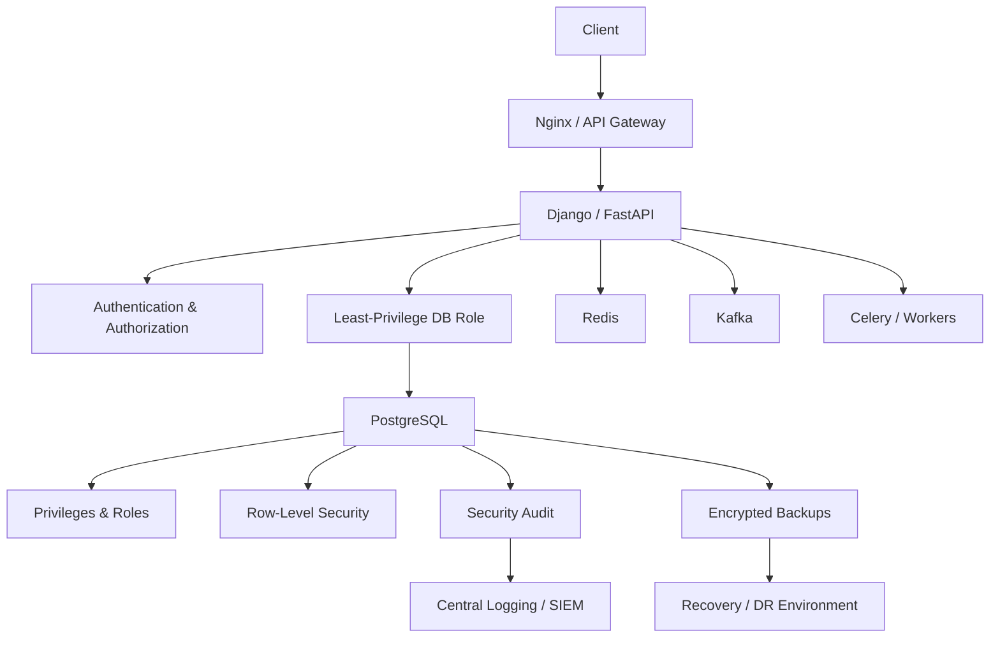
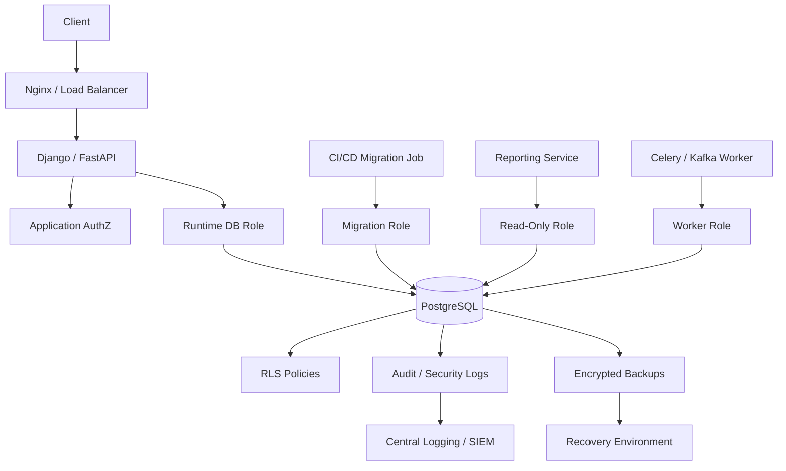

# README

## Overview

This folder contains the **SQL Security** section of the engineering playbook.

The focus is not limited to preventing SQL injection. Production database security requires a layered model covering:

```text
Network Security
      ↓
Encryption
      ↓
Authentication
      ↓
Database Roles
      ↓
Privileges
      ↓
Least Privilege
      ↓
SQL Construction
      ↓
Application Authorization
      ↓
Row-Level Security
      ↓
Auditing
      ↓
Backup Protection
      ↓
Monitoring and Recovery
```

The examples and architecture patterns are primarily applicable to PostgreSQL-backed Python systems using Django, FastAPI, microservices, Docker, Kubernetes, CI/CD, and AWS.

## Navigation

| # | Section | Layer | Description |
|---|---|---|---|
| 01 | [Security](./README.md) | Production Engineering | Roles, privileges, SQL injection, encryption, auditing, and credential management |
| 02 | [01- SQL Security Fundamentals](./01-%20SQL%20Security%20Fundamentals.md) | Production Engineering | Database security model and threat boundaries |
| 03 | [02- Authentication vs Authorization](./02-%20Authentication%20vs%20Authorization.md) | Production Engineering | Identity vs permission in database access |
| 04 | [03- Database Users and Roles](./03-%20Database%20Users%20and%20Roles.md) | Production Engineering | PostgreSQL roles and identities |
| 05 | [04- Privileges and Permissions](./04-%20Privileges%20and%20Permissions.md) | Production Engineering | Database, schema, and object privileges |
| 06 | [05- GRANT and REVOKE](./05-%20GRANT%20and%20REVOKE.md) | Production Engineering | Managing PostgreSQL permissions |
| 07 | [06- Least Privilege](./06-%20Least%20Privilege.md) | Production Engineering | Minimizing database access surface |
| 08 | [07- Application Database Users](./07-%20Application%20Database%20Users.md) | Production Engineering | Runtime service identities and connection accounts |
| 09 | [08- Read Only Database Users](./08-%20Read%20Only%20Database%20Users.md) | Production Engineering | Reporting and read-only access patterns |
| 10 | [09- SQL Injection](./09-%20SQL%20Injection.md) | Production Engineering | Injection vulnerabilities and prevention techniques |
| 11 | [10- Parameterized Queries](./10-%20Parameterized%20Queries.md) | Production Engineering | Safe SQL value binding |
| 12 | [11- Prepared Statements](./11-%20Prepared%20Statements.md) | Production Engineering | Prepared execution and plan reuse |
| 13 | [12- Dynamic SQL Security](./12-%20Dynamic%20SQL%20Security.md) | Production Engineering | Secure dynamic SQL and identifier handling |
| 14 | [13- Row Level Security](./13-%20Row%20Level%20Security.md) | Production Engineering | Database-enforced row isolation |
| 15 | [14- Sensitive Data Protection](./14-%20Sensitive%20Data%20Protection.md) | Production Engineering | Protecting sensitive database information |
| 16 | [15- Encryption at Rest](./15-%20Encryption%20at%20Rest.md) | Production Engineering | Storage and backup encryption |
| 17 | [16- Encryption in Transit](./16-%20Encryption%20in%20Transit.md) | Production Engineering | TLS and secure database communication |
| 18 | [17- Secrets and Credential Management](./17-%20Secrets%20and%20Credential%20Management.md) | Production Engineering | Database credentials and secret lifecycle |
| 19 | [18- Database Auditing](./18-%20Database%20Auditing.md) | Production Engineering | Security events and accountability logging |
| 20 | [19- Database Security Logging](./19-%20Database%20Security%20Logging.md) | Production Engineering | Security-focused database logging |
| 21 | [20- Backup and Recovery Security](./20-%20Backup%20and%20Recovery%20Security.md) | Production Engineering | Protecting backups and recovery paths |
| 22 | [21- Security Rules and Best Practices](./21-%20Security%20Rules%20and%20Best%20Practices.md) | Production Engineering | Production security rules and guidelines |
| 23 | [22- Choosing the Right Database Permission Model](./22-%20Choosing%20the%20Right%20Database%20Permission%20Model.md) | Production Engineering | Selecting an appropriate authorization model |
| 24 | [23- Common SQL Security Mistakes](./23-%20Common%20SQL%20Security%20Mistakes.md) | Production Engineering | Common implementation and operational security failures |

---

## Security Architecture at a Glance



Database security should be designed as defense in depth. A database role should remain constrained even if an application vulnerability is exploited, while network controls, TLS, auditing, and protected backups provide additional boundaries.

---

## Documentation Map

| File | Topic | Primary Focus |
|---|---|---|
| `01- SQL Security Fundamentals.md` | SQL Security Fundamentals | Database security model and threat boundaries |
| `02- Authentication vs Authorization.md` | Authentication vs Authorization | Identity vs permission |
| `03- Database Users and Roles.md` | Database Users and Roles | PostgreSQL roles and identities |
| `04- Privileges and Permissions.md` | Privileges and Permissions | Database, schema, and object privileges |
| `05- GRANT and REVOKE.md` | GRANT and REVOKE | Managing PostgreSQL permissions |
| `06- Least Privilege.md` | Least Privilege | Minimizing database access |
| `07- Application Database Users.md` | Application Database Users | Runtime service identities |
| `08- Read Only Database Users.md` | Read Only Database Users | Reporting and read-only access |
| `09- SQL Injection.md` | SQL Injection | Injection vulnerabilities and prevention |
| `10- Parameterized Queries.md` | Parameterized Queries | Safe SQL value binding |
| `11- Prepared Statements.md` | Prepared Statements | Prepared execution and plan reuse |
| `12- Dynamic SQL Security.md` | Dynamic SQL Security | Secure dynamic SQL and identifiers |
| `13- Row Level Security.md` | Row Level Security | Database-enforced row isolation |
| `14- Sensitive Data Protection.md` | Sensitive Data Protection | Protecting sensitive database information |
| `15- Encryption at Rest.md` | Encryption at Rest | Storage and backup encryption |
| `16- Encryption in Transit.md` | Encryption in Transit | TLS and secure database communication |
| `17- Secrets and Credential Management.md` | Secrets and Credential Management | Database credentials and secret lifecycle |
| `18- Database Auditing.md` | Database Auditing | Security events and accountability |
| `19- Database Security Logging.md` | Database Security Logging | Security-focused database logging |
| `20- Backup and Recovery Security.md` | Backup and Recovery Security | Protecting backups and recovery paths |
| `21- Security Rules and Best Practices.md` | Security Rules and Best Practices | Production security rules |
| `22- Choosing the Right Database Permission Model.md` | Permission Model | Selecting an appropriate authorization model |
| `23- Common SQL Security Mistakes.md` | Common SQL Security Mistakes | Common implementation and operational failures |
| `README.md` | Security Guide | Navigation and security architecture |

---

## Recommended Learning Flow

The topics should generally be studied in the following order:

```text
SQL Security Fundamentals
        ↓
Authentication vs Authorization
        ↓
Database Users and Roles
        ↓
Privileges and Permissions
        ↓
GRANT / REVOKE
        ↓
Least Privilege
        ↓
Application Database Users
        ↓
Read-Only Users
        ↓
SQL Injection
        ↓
Parameterized Queries
        ↓
Prepared Statements
        ↓
Dynamic SQL Security
        ↓
Row-Level Security
        ↓
Sensitive Data Protection
        ↓
Encryption at Rest
        ↓
Encryption in Transit
        ↓
Secrets and Credential Management
        ↓
Database Auditing
        ↓
Database Security Logging
        ↓
Backup and Recovery Security
        ↓
Security Rules and Best Practices
        ↓
Permission Model Selection
        ↓
Common SQL Security Mistakes
```

This progression moves from database security fundamentals toward production architecture and operational security.

---

## SQL Security Fundamentals

**`01- SQL Security Fundamentals.md`**

Establishes the security model for SQL databases.

Key areas:

- Database attack surface
- Trust boundaries
- Authentication
- Authorization
- Roles
- Privileges
- SQL injection
- Encryption
- Auditing
- Backups
- Defense in depth

The important mental model is:

```text
Security is a system property
        ↓
Not a single database feature
```

---

## Authentication vs Authorization

**`02- Authentication vs Authorization.md`**

Separates two concepts that are frequently confused.

```text
Authentication
    ↓
Who are you?

Authorization
    ↓
What are you allowed to do?
```

This distinction applies at multiple layers:

```text
HTTP/API
Database
Application
Object
Row
Business operation
```

A valid database login does not automatically imply authorization to access every database object.

---

## Database Users and Roles

**`03- Database Users and Roles.md`**

Covers PostgreSQL's role-based identity model.

Important concepts include:

- Login roles
- Non-login roles
- Role membership
- Role ownership
- `SET ROLE`
- `PUBLIC`
- Role attributes
- Runtime roles
- Migration roles
- Administrative roles

A production application should generally use a dedicated runtime identity rather than an administrative role.

---

## Privileges and Permissions

**`04- Privileges and Permissions.md`**

Explains the hierarchy of PostgreSQL permissions:

```text
Database
   ↓
Schema
   ↓
Table / View
   ↓
Column
   ↓
Sequence
   ↓
Function
```

It also explains how effective permissions can result from:

```text
Direct grants
+
Role membership
+
Ownership
+
PUBLIC
+
Role attributes
+
RLS
```

---

## GRANT and REVOKE

**`05- GRANT and REVOKE.md`**

Provides the practical mechanics for managing permissions.

Typical operations include:

```sql
GRANT CONNECT ON DATABASE app TO app_runtime;

GRANT USAGE ON SCHEMA app TO app_runtime;

GRANT SELECT, INSERT, UPDATE, DELETE
ON app.orders
TO app_runtime;
```

The focus is on explicit, reviewable permission management rather than broad `ALL PRIVILEGES` grants.

---

## Least Privilege

**`06- Least Privilege.md`**

Least privilege means granting only the access required for a specific responsibility.

A useful production separation is:

```text
app_runtime
    ↓
Normal application DML

app_migration
    ↓
Required schema changes

app_readonly
    ↓
Reporting

app_admin
    ↓
Controlled administration
```

The goal is to minimize blast radius without creating unnecessary operational complexity.

---

## Application Database Users

**`07- Application Database Users.md`**

Covers how backend services should authenticate to PostgreSQL.

A typical service architecture is:

```text
orders-api
    ↓
orders_runtime

payments-api
    ↓
payments_runtime

reporting
    ↓
reporting_readonly
```

The document also covers:

- Connection pools
- Service identities
- Credential rotation
- Docker
- Kubernetes
- Django
- FastAPI
- Background workers
- Multi-tenant applications

---

## Read-Only Database Users

**`08- Read Only Database Users.md`**

A read-only database role is useful for:

- Reporting
- Analytics
- Support tools
- Internal dashboards
- Read-only APIs

Example:

```sql
GRANT SELECT
ON ALL TABLES IN SCHEMA reporting
TO app_readonly;
```

Read-only authorization should not be confused with read replicas. One controls **what a role can do**; the other changes **where workload executes**.

---

## SQL Injection

**`09- SQL Injection.md`**

Covers one of the most important application/database security vulnerabilities.

Unsafe:

```python
query = f"""
    SELECT *
    FROM users
    WHERE email = '{email}'
"""
```

Safe query construction separates:

```text
SQL structure
        +
User-controlled values
```

using parameterized queries.

The topic also covers:

- Injection mechanics
- Authentication bypass
- Data extraction
- Destructive statements
- ORM risks
- Raw SQL
- Dynamic SQL
- Defense in depth

---

## Parameterized Queries

**`10- Parameterized Queries.md`**

Parameterized queries ensure that user-controlled values remain values rather than becoming SQL syntax.

Example:

```python
cursor.execute(
    """
    SELECT id
    FROM users
    WHERE email = %s
    """,
    (email,),
)
```

The document covers parameter binding across:

- psycopg
- Django
- SQLAlchemy
- FastAPI
- Raw SQL
- `IN` / arrays
- `LIKE`
- JSON
- Dates
- `NULL`

---

## Prepared Statements

**`11- Prepared Statements.md`**

Prepared statements are related to parameterization but are not identical concepts.

```text
Parameterized query
    ↓
Safe value binding

Prepared statement
    ↓
Prepared execution / potential plan reuse
```

The topic covers:

- PostgreSQL extended protocol
- `PREPARE`
- `EXECUTE`
- `DEALLOCATE`
- Generic vs custom plans
- Connection pooling
- PgBouncer
- Plan caching
- Performance trade-offs

---

## Dynamic SQL Security

**`12- Dynamic SQL Security.md`**

Dynamic SQL becomes dangerous when untrusted input controls SQL structure.

Examples include dynamic:

```text
Table names
Column names
Sort columns
Operators
Schema names
```

Values should generally be parameterized, while identifiers should be validated and allowlisted.

The document also covers secure PostgreSQL dynamic SQL and `SECURITY DEFINER` functions.

---

## Row Level Security

**`13- Row Level Security.md`**

RLS provides database-enforced row filtering.

Conceptually:

```text
Role privilege
      ↓
RLS policy
      ↓
Allowed rows
```

This is especially useful for multi-tenant systems.

A typical architecture is:

```text
Authenticated user
        ↓
Application authorization
        ↓
Tenant context
        ↓
PostgreSQL RLS
        ↓
Tenant-specific rows
```

RLS must be designed carefully around:

- Table ownership
- `BYPASSRLS`
- Superusers
- `FORCE ROW LEVEL SECURITY`
- Connection pooling
- `SET LOCAL`
- Policy composition
- Performance

---

## Sensitive Data Protection

**`14- Sensitive Data Protection.md`**

Focuses on protecting sensitive database information throughout its lifecycle.

Important areas include:

- Data classification
- PII
- Financial information
- Credentials
- Tokens
- Encryption
- Masking
- Access control
- Logging
- Backups
- Retention
- Data minimization

A critical rule is:

```text
Sensitive data protection
    ≠
Database encryption alone
```

Security must cover storage, application access, logs, backups, and operational workflows.

---

## Encryption at Rest

**`15- Encryption at Rest.md`**

Covers protection of stored database information.

The security boundary may include:

```text
Database storage
+
Snapshots
+
Backups
+
WAL archives
+
Object storage
+
Temporary copies
```

Key management is as important as encryption itself.

Consider:

```text
Encryption
+
KMS
+
IAM
+
Key rotation
+
Recovery testing
```

---

## Encryption in Transit

**`16- Encryption in Transit.md`**

Covers TLS between:

```text
Client
    ↓
Nginx / Proxy
    ↓
Application
    ↓
PostgreSQL
```

and between internal services where required.

Important concepts include:

- TLS
- Certificate validation
- Hostname verification
- PostgreSQL SSL modes
- mTLS
- Kubernetes
- AWS
- Service-to-service encryption
- Certificate rotation

Encryption and authentication remain separate concerns:

```text
TLS
    ↓
Secure communication

Authorization
    ↓
Permission to perform an operation
```

---

## Secrets and Credential Management

**`17- Secrets and Credential Management.md`**

Database credentials should be treated as production security assets.

A robust lifecycle is:

```text
Generate
   ↓
Store securely
   ↓
Inject at runtime
   ↓
Use
   ↓
Rotate
   ↓
Revoke
   ↓
Audit
```

Relevant infrastructure includes:

- AWS Secrets Manager
- AWS IAM
- Kubernetes secrets mechanisms
- CI/CD identity
- OIDC
- KMS
- Workload identity

Avoid storing secrets in:

```text
Git
Docker images
Logs
Source code
Build artifacts
```

---

## Database Auditing

**`18- Database Auditing.md`**

Auditing provides accountability for security-sensitive actions.

Important events include:

```text
Authentication
Role changes
GRANT / REVOKE
DDL
Sensitive data access
Privileged operations
```

Audit records should capture useful context such as:

```text
Actor
Database role
Application identity
Request ID
Timestamp
Operation
Resource
```

For high-value audit requirements, consider centralized and tamper-resistant storage.

---

## Database Security Logging

**`19- Database Security Logging.md`**

Security logging is related to auditing but should be considered as part of the broader observability pipeline.

A useful architecture is:

```text
PostgreSQL
    ↓
Database security events
    ↓
Log / audit collector
    ↓
Central logging
    ↓
Detection / SIEM
    ↓
Alert / Incident Response
```

Security logging should prioritize high-value events rather than indiscriminately logging every query and every parameter.

Avoid logging:

```text
Passwords
Tokens
API keys
Private keys
Database credentials
Sensitive query parameters
```

---

## Backup and Recovery Security

**`20- Backup and Recovery Security.md`**

Backups often contain the entire production dataset and therefore require security controls comparable to the primary database.

Important controls include:

- Encryption
- Restricted access
- Separate backup identities
- Immutable storage where required
- Retention policies
- Protected WAL archives
- Recovery credentials
- KMS permissions
- Restore testing
- DR testing

A useful mental model is:

```text
Primary security
       +
Backup security
       +
Recovery security
```

A secure production system must preserve all three.

---

## Security Rules and Best Practices

**`21- Security Rules and Best Practices.md`**

Provides the consolidated production rules.

Core principles include:

```text
Least privilege
Parameterized SQL
Private databases
TLS
Strong authentication
Explicit authorization
Protected secrets
RLS where justified
Auditing
Protected backups
Restore testing
Permission reviews
```

Security should be implemented as layered controls rather than depending on one mechanism.

---

## Choosing the Right Database Permission Model

**`22- Choosing the Right Database Permission Model.md`**

Permission models should follow system boundaries.

Typical progression:

```text
Simple monolith
    ↓
Dedicated runtime role
+
Migration role

Microservices
    ↓
Role per service

Shared multi-tenant tables
    ↓
Application authorization
+
RLS where justified

Strong service isolation
    ↓
Database-per-service

Privileged operations
    ↓
Separate administrative identities
```

The recommended model is not necessarily the most complex model.

Choose the simplest design that provides the required isolation.

---

## Common SQL Security Mistakes

**`23- Common SQL Security Mistakes.md`**

Acts as a practical failure reference.

Common mistakes include:

- Using a PostgreSQL superuser for applications
- Giving runtime roles DDL
- Unsafe SQL interpolation
- Missing resource-level authorization
- Sharing credentials across services
- Hard-coding secrets
- Logging sensitive values
- Incorrect RLS configuration
- Excessive `PUBLIC` privileges
- Ignoring role membership
- Ignoring ownership
- Exposing PostgreSQL publicly
- Treating replicas as backups
- Not testing restores
- Giving CI/CD excessive privileges
- Ignoring connection-pooling behavior
- Never reviewing permissions

The focus is on understanding why each mistake occurs and how to design it out of the system.

---

## Permission Architecture

A practical production architecture can look like:



The important security boundaries are:

```text
Application identity
        ≠
Database runtime identity
        ≠
Migration identity
        ≠
Administrative identity
        ≠
Backup identity
```

---

## Application Authorization vs Database Authorization

These mechanisms complement each other.

| Layer | Responsibility |
|---|---|
| API authentication | Establish caller identity |
| API authorization | Enforce business permissions |
| Database role | Restrict workload capabilities |
| Table privileges | Restrict object operations |
| RLS | Restrict row visibility/modification |
| Constraints | Protect data integrity |
| Audit | Record security-sensitive activity |
| Network controls | Restrict connectivity |

A database should not be expected to understand every business rule.

Likewise, the application should not be the only security boundary for highly sensitive row-level isolation when database enforcement is justified.

---

## Django Security Integration

A Django application typically interacts with PostgreSQL through:

```text
HTTP Request
    ↓
Authentication
    ↓
Authorization
    ↓
Django ORM
    ↓
Database Driver
    ↓
Connection Pool / Connection
    ↓
PostgreSQL Role
    ↓
Privileges / RLS
```

Important practices include:

- Prefer ORM queries for normal operations.
- Parameterize raw SQL.
- Apply resource-level authorization.
- Avoid unnecessary database privileges.
- Keep migrations separate from runtime access.
- Review connection lifecycle and transaction boundaries.

---

## FastAPI Security Integration

FastAPI does not automatically define database security.

A typical flow is:

```text
HTTP/gRPC request
    ↓
Authentication
    ↓
Dependency-based authorization
    ↓
Service layer
    ↓
SQLAlchemy / psycopg
    ↓
Least-privilege PostgreSQL role
```

Database permissions remain independent of API authentication and authorization.

---

## Microservices

For microservices, database permissions should reinforce service ownership.

Prefer:

```text
Orders Service
    ↓
Orders database/schema
    ↓
orders_runtime
```

rather than:

```text
All services
    ↓
Same database role
    ↓
All tables
```

Cross-service data requirements should generally use:

```text
REST
gRPC
Kafka
Read models
```

rather than direct access to another service's tables.

---

## Redis Security

Redis is often used alongside PostgreSQL for:

```text
Caching
Sessions
Rate limiting
Distributed coordination
```

Do not assume Redis access is harmless.

Sensitive Redis operations can affect:

```text
Authentication
Authorization
Cache contents
Session state
Distributed locks
```

Apply the same general principles:

```text
Authentication
+
Authorization
+
Network isolation
+
TLS where required
+
Secret management
+
Monitoring
```

---

## Kafka Security

Kafka may contain sensitive database-derived events.

For example:

```text
PostgreSQL
    ↓
Transactional outbox
    ↓
Kafka
    ↓
Consumers
```

Security must cover:

```text
Producer identity
Consumer identity
Topic permissions
Encryption
Sensitive event payloads
Retention
```

Do not treat events as less sensitive simply because they are asynchronous.

---

## Celery Security

Celery workers may have direct database access.

Use dedicated identities where appropriate:

```text
Celery Worker
    ↓
worker_db_role
```

Worker permissions should match the tasks being performed.

A compromised worker should not automatically have:

```text
Database administration
Role management
Backup deletion
```

capabilities.

---

## Kubernetes

Kubernetes introduces additional security boundaries:

```text
Pod
 ↓
Service Account
 ↓
Secret / Workload Identity
 ↓
NetworkPolicy
 ↓
Database
 ↓
Database Role
```

Do not assume Kubernetes network isolation replaces database authorization.

A compromised pod inside the cluster may still attempt lateral movement.

---

## AWS

A production AWS architecture may combine:

```text
VPC
 ↓
Private Subnets
 ↓
Security Groups
 ↓
RDS / PostgreSQL
 ↓
Database Roles
```

with:

```text
IAM
+
Secrets Manager
+
KMS
+
CloudTrail
+
Centralized Logging
```

Use IAM and database permissions as separate layers.

---

## Monitoring

Security monitoring should cover both database state and surrounding infrastructure.

Monitor:

```text
Authentication failures
Successful privileged logins
Role changes
GRANT / REVOKE
DDL
RLS changes
Long-running queries
Connection spikes
Backup failures
Backup deletion
Restore operations
Permission drift
```

Useful PostgreSQL views and mechanisms include:

```text
pg_stat_activity
pg_roles
pg_auth_members
pg_locks
pg_stat_replication
pg_policies
```

The exact monitoring implementation depends on the PostgreSQL deployment and observability platform.

---

## Security and Performance

Security controls can introduce overhead.

Examples include:

```text
RLS policies
Audit triggers
Detailed logging
Encryption
Additional authorization queries
Centralized audit pipelines
```

Do not disable important security controls simply because they add overhead.

Instead:

```text
Measure
    ↓
Identify bottleneck
    ↓
Optimize implementation
    ↓
Re-measure
```

Security and performance should be evaluated together.

---

## Security and Availability

A security control that is incorrectly deployed can cause outages.

Examples:

```text
Missing GRANT
    ↓
Application failure

Expired credential
    ↓
Connection failure

Incorrect RLS policy
    ↓
Unexpected access denial

Broken KMS permission
    ↓
Backup recovery failure
```

Permission and security changes should therefore follow controlled deployment processes.

---

## Security and Disaster Recovery

Recovery procedures should preserve security.

A DR test should verify:

```text
Database
+
Roles
+
Privileges
+
RLS
+
Secrets
+
KMS
+
Network controls
+
TLS
+
Audit logging
```

Recovery is incomplete if the database is restored but security controls are missing.

---

## Security and Cost

Security controls also have cost implications.

Potential costs include:

```text
Audit storage
Log ingestion
Backup retention
Cross-region replication
KMS operations
SIEM processing
Additional database infrastructure
Security tooling
```

The goal is not maximum logging or maximum isolation.

The goal is an appropriate control level for the risk.

---

## Production Security Layers

A mature backend architecture typically implements:

```text
Layer 1: Network
    Private database
    Security groups
    Network policies

Layer 2: Transport
    TLS
    Certificate validation

Layer 3: Identity
    Authentication
    Workload identity
    Database roles

Layer 4: Authorization
    Application authorization
    Database privileges
    RLS where appropriate

Layer 5: Data
    Encryption
    Data minimization
    Sensitive-data controls

Layer 6: Detection
    Audit
    Security logging
    Monitoring

Layer 7: Recovery
    Protected backups
    PITR
    Restore testing
    DR
```

No single layer should be expected to provide complete protection.

---

## Security Review Checklist

### Database

- [ ] No application uses a superuser.
- [ ] Runtime roles follow least privilege.
- [ ] Migration access is separated.
- [ ] Object ownership is understood.
- [ ] Role membership is reviewed.
- [ ] `PUBLIC` privileges are reviewed.
- [ ] RLS bypass paths are reviewed.

### Application

- [ ] SQL values are parameterized.
- [ ] Dynamic identifiers are allowlisted.
- [ ] Resource-level authorization is enforced.
- [ ] Tenant isolation is enforced.
- [ ] Sensitive values are not logged.
- [ ] Raw SQL is reviewed.

### Infrastructure

- [ ] Database is private.
- [ ] Network access is restricted.
- [ ] TLS is enabled where required.
- [ ] Secrets are centrally managed.
- [ ] Kubernetes workloads are appropriately isolated.
- [ ] AWS IAM permissions are scoped.

### Operations

- [ ] Security-sensitive events are audited.
- [ ] Privilege changes are monitored.
- [ ] Permission drift is detected.
- [ ] Backup access is restricted.
- [ ] Backups are encrypted.
- [ ] Restore procedures are tested.
- [ ] DR security is tested.

---

## Security Design Review Questions

For any production database, ask:

```text
Who can connect?

Who can read sensitive data?

Who can modify sensitive data?

Who can execute privileged functions?

Who owns database objects?

Who can create roles?

Who can grant privileges?

Who can bypass RLS?

Who can modify RLS policies?

Who can run migrations?

Who can access backups?

Who can delete backups?

Who can restore data?

Who can access production credentials?

What happens if the API is compromised?

What happens if a database credential leaks?

What happens if a Kubernetes pod is compromised?

What happens if CI/CD is compromised?

How will unauthorized activity be detected?

How will recovery preserve the security model?
```

These questions are more valuable than simply checking whether a particular SQL security feature is enabled.

---

## Common Security Anti-Patterns

Avoid these architectures:

```text
Application
    ↓
SUPERUSER
```

```text
All services
    ↓
shared_db_user
    ↓
ALL PRIVILEGES
```

```text
User input
    ↓
SQL string interpolation
```

```text
Production database
    ↓
Public internet
```

```text
Application
    ↓
Production credentials in source code
```

```text
Database
    ↓
No audit
    ↓
No monitoring
```

```text
Production
    ↓
Backup
    ↓
Same credentials / same security boundary
```

Each removes an important layer of defense.

---

## Practical Security Baseline

For a typical PostgreSQL-backed backend, establish this baseline:

```text
Private PostgreSQL
        +
TLS
        +
Dedicated runtime role
        +
Separate migration role
        +
Least privilege
        +
Parameterized SQL
        +
Explicit application authorization
        +
RLS where justified
        +
Centralized secrets
        +
Security auditing
        +
Encrypted protected backups
        +
Restore testing
        +
Permission reviews
        +
Security monitoring
```

This baseline is appropriate for many production systems before introducing more specialized controls.

---

## Senior Engineering Principles

### Design for Compromise

Assume:

```text
Application may be compromised.
Credential may leak.
Pod may be compromised.
Pipeline may be compromised.
Administrator may make a mistake.
```

Then ask how much damage remains possible.

### Minimize Blast Radius

Prefer:

```text
One workload
    ↓
One constrained identity
    ↓
Small permission boundary
```

over:

```text
Many workloads
    ↓
One highly privileged identity
```

### Enforce Security at Multiple Layers

Use:

```text
Application authorization
+
Database authorization
+
Network controls
+
Data protection
+
Auditing
```

when the risk warrants it.

### Make Security Testable

Security configuration should be validated through:

```text
Positive tests
+
Negative tests
+
Permission audits
+
Deployment checks
+
Recovery tests
```

### Protect Recovery Assets

A system that prevents unauthorized access but cannot recover from compromise is not operationally secure.

Protect:

```text
Backups
WAL archives
Encryption keys
Recovery credentials
DR environments
```

with independent controls.

---

## Interview Perspective

A strong senior-level answer to:

> "How would you secure a production PostgreSQL database?"

should cover more than SQL injection.

A concise architecture answer is:

```text
Private networking
    ↓
TLS
    ↓
Strong authentication
    ↓
Dedicated least-privilege roles
    ↓
Separate runtime and migration access
    ↓
Parameterized SQL
    ↓
Application authorization
    ↓
RLS for high-value row isolation
    ↓
Secret management
    ↓
Auditing and monitoring
    ↓
Encrypted, isolated backups
    ↓
Restore and DR testing
```

The key is explaining **why each layer exists and what failure it protects against**.

---

## Recommended Engineering Mindset

SQL security should be treated as part of backend architecture rather than as a database administration task added after application development.

The relevant questions are:

```text
Who is the caller?

Which service is acting?

Which database identity is being used?

Which data is being accessed?

Which operation is being performed?

Which security boundary should enforce it?

What happens if that boundary fails?

How will the action be detected?

Can the system recover afterward?
```

A mature database security design answers all of these questions explicitly.

---

## Key Takeaways

- **SQL security is a layered system:** network isolation, TLS, authentication, least-privilege roles, parameterized SQL, authorization, RLS, auditing, and protected recovery each address different risks.
- **Database identities should reflect workload responsibilities:** separate runtime, migration, reporting, worker, administrative, backup, and recovery access where appropriate.
- **Application security and database security complement each other:** authentication and business authorization belong in the application, while privileges, constraints, and RLS can enforce database-level boundaries.
- **Security must survive compromise and operational failure:** minimize blast radius, protect secrets and backups independently, audit privileged activity, and test both denied operations and disaster recovery.
- **Choose the simplest permission model that provides the required isolation:** avoid both excessive privilege and unnecessary security complexity.