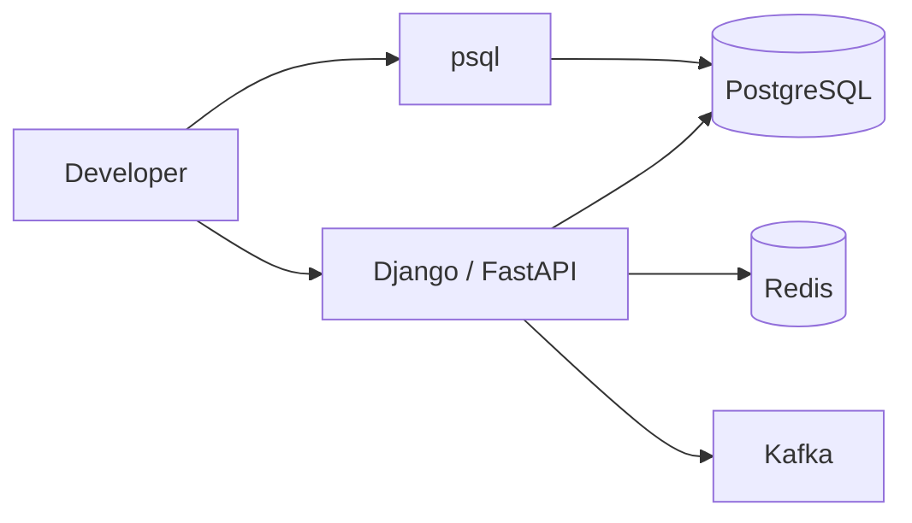

# 01- SQL CLI Fundamentals

## Overview

The SQL CLI is the most direct operational interface to a relational database.

For PostgreSQL, the primary CLI is `psql`. Backend engineers should be comfortable using it for:

- Connecting to databases
- Inspecting schemas and tables
- Running SQL
- Inspecting query plans
- Managing transactions
- Debugging permissions
- Investigating locks and connections
- Inspecting indexes and constraints
- Troubleshooting production incidents
- Executing controlled administrative operations

An ORM such as Django ORM or SQLAlchemy is the normal application interface, but it does not replace the database CLI.

A useful mental model is:

```text
Application
    ↓
Django / SQLAlchemy
    ↓
Database Driver
    ↓
PostgreSQL Wire Protocol
    ↓
PostgreSQL
```

The CLI provides another client path:

```text
Terminal
    ↓
psql
    ↓
PostgreSQL Wire Protocol
    ↓
PostgreSQL
```

Understanding `psql` therefore improves both SQL knowledge and production debugging ability.

---

## What `psql` Is

`psql` is PostgreSQL's interactive command-line client.

It is a client application, not the PostgreSQL database server itself.

```text
+-------------------+
|       psql        |
| PostgreSQL Client |
+---------+---------+
          |
          | PostgreSQL protocol
          |
+---------v---------+
| PostgreSQL Server |
+-------------------+
```

The distinction matters operationally.

Installing `psql` does not install or start a PostgreSQL server.

Likewise, a database server can be running without `psql` being installed on the application host.

---

## Why Use the SQL CLI

The CLI is particularly useful when you need direct database visibility.

### Application development

```text
Inspect schema
    ↓
Run SQL
    ↓
Check result
    ↓
Compare ORM behavior
```

### Production troubleshooting

```text
Incident
   ↓
Connect to database
   ↓
Inspect active sessions
   ↓
Inspect locks
   ↓
Inspect slow queries
   ↓
Inspect execution plan
```

### Database administration

Typical tasks include:

- Inspecting roles
- Inspecting databases
- Checking permissions
- Running migrations
- Creating maintenance scripts
- Verifying indexes
- Inspecting replication state

The CLI is therefore both a development tool and an operational tool.

---

## Installing and Verifying `psql`

Check whether the client is available:

```bash
psql --version
```

Example:

```text
psql (PostgreSQL) 17.x
```

The exact version depends on the installed PostgreSQL client.

Check the executable location:

```bash
which psql
```

On Windows:

```powershell
where.exe psql
```

The client version does not necessarily need to exactly match the server version for normal usage, but using a compatible/current client is preferable for production operations.

---

## Connecting to PostgreSQL

The most explicit connection form is:

```bash
psql \
  --host=db.example.internal \
  --port=5432 \
  --username=app_readonly \
  --dbname=orders
```

Short options are commonly used:

```bash
psql -h db.example.internal -p 5432 -U app_readonly -d orders
```

Local development may be as simple as:

```bash
psql -d orders
```

If PostgreSQL is configured for local peer authentication, the operating-system user may influence authentication.

---

## Connection Parameters

| Option | Meaning |
|---|---|
| `-h` | PostgreSQL host |
| `-p` | PostgreSQL port |
| `-U` | Database user/role |
| `-d` | Database name |
| `-W` | Prompt for password |
| `-c` | Execute one command and exit |
| `-f` | Execute commands from a file |
| `-v` | Set a `psql` variable |
| `--version` | Display client version |

Example:

```bash
psql -h localhost -p 5432 -U postgres -d app
```

---

## Password Handling

Avoid putting passwords directly into shell command arguments.

For interactive usage:

```bash
psql -h db.internal -U app_readonly -d orders -W
```

For automated environments, prefer the platform's secret-management mechanism rather than hard-coding credentials.

Possible production approaches include:

```text
AWS Secrets Manager
Kubernetes secret injection
Workload identity
Short-lived credentials
.pgpass with tightly controlled permissions
```

The PostgreSQL password should not appear in:

```text
Git
Shell history
CI logs
Container images
Application logs
Chat messages
Documentation
```

---

## Environment Variables

PostgreSQL client environment variables can reduce repetitive connection arguments.

Common variables include:

```bash
export PGHOST=db.internal
export PGPORT=5432
export PGUSER=app_readonly
export PGDATABASE=orders
```

Then:

```bash
psql
```

This is convenient for local development and controlled operational environments.

Inspect the current environment carefully before debugging authentication:

```bash
env | grep '^PG'
```

Do not expose `PGPASSWORD` in shared shell output or CI logs.

---

## Connection URI

PostgreSQL also supports connection URIs.

Example:

```bash
psql 'postgresql://app_readonly@db.internal:5432/orders'
```

With TLS requirements:

```bash
psql 'postgresql://app_readonly@db.internal:5432/orders?sslmode=require'
```

In production, avoid embedding passwords directly in command lines or scripts.

---

## Connecting Through Docker

If PostgreSQL is running in Docker:

```bash
docker ps
```

Then either connect from the host if the port is exposed:

```bash
psql -h localhost -p 5432 -U app -d orders
```

or execute `psql` inside the database container:

```bash
docker exec -it postgres psql -U app -d orders
```

The second approach is useful when the PostgreSQL client is installed only inside the database container.

---

## Connecting Through Kubernetes

For a Kubernetes deployment, port forwarding can provide a controlled development or troubleshooting path:

```bash
kubectl port-forward service/postgres 5432:5432
```

Then:

```bash
psql -h localhost -p 5432 -U app_readonly -d orders
```

Do not treat port forwarding as a production access-control mechanism.

Production access should normally use controlled network paths, identity, auditing, and operational access procedures.

---

## Understanding the `psql` Prompt

After connecting, you may see:

```text
orders=>
```

The prompt provides useful information.

For example:

```text
orders=>
```

indicates the current database.

During a transaction, the prompt can change:

```text
orders=#
```

The exact prompt is configurable, but the important operational principle is that `psql` can expose connection and transaction state.

---

## SQL vs `psql` Meta-Commands

This distinction is fundamental.

### SQL

SQL is sent to PostgreSQL:

```sql
SELECT *
FROM orders
LIMIT 10;
```

### `psql` meta-command

Meta-commands are interpreted by the `psql` client:

```text
\dt
```

For example:

```text
\dt
```

asks `psql` to display tables.

It is not SQL executed by PostgreSQL.

---

## Essential `psql` Meta-Commands

| Command | Purpose |
|---|---|
| `\l` | List databases |
| `\c` | Connect to another database |
| `\dt` | List tables |
| `\dv` | List views |
| `\di` | List indexes |
| `\df` | List functions |
| `\dn` | List schemas |
| `\du` | List roles |
| `\dp` | Display access privileges |
| `\d table` | Describe a table |
| `\d+ table` | Detailed table description |
| `\conninfo` | Show current connection |
| `\timing` | Toggle query timing |
| `\x` | Toggle expanded output |
| `\q` | Exit `psql` |
| `\?` | Help for meta-commands |
| `\h` | SQL command help |

---

## Inspecting the Current Connection

Use:

```text
\conninfo
```

This is one of the most useful commands when multiple environments exist.

It helps verify:

```text
Host
Port
Database
User
Connection method
```

A production debugging mistake is connecting successfully but to the wrong database or environment.

Always verify the connection before running mutating commands.

---

## Inspecting Databases

List databases:

```text
\l
```

Equivalent SQL can be obtained from PostgreSQL catalogs, but `\l` is faster for interactive inspection.

Connect to another database:

```text
\c reporting
```

or:

```text
\connect reporting
```

A connection is associated with one database at a time.

---

## Inspecting Schemas

List schemas:

```text
\dn
```

For more information:

```text
\dn+
```

Schemas provide namespaces inside a database.

For example:

```text
public
app
reporting
audit
```

A qualified table reference can remove ambiguity:

```sql
SELECT *
FROM app.orders;
```

Using schema-qualified names is particularly useful for operational SQL and security-sensitive scripts.

---

## Inspecting Tables

List tables:

```text
\dt
```

List tables across schemas:

```text
\dt *.*
```

Inspect a specific table:

```text
\d orders
```

Detailed output:

```text
\d+ orders
```

This can expose information such as:

- Columns
- Types
- Nullable status
- Defaults
- Constraints
- Indexes
- Storage information

---

## Inspecting a Table Before Modifying It

Before running a production mutation, inspect the target:

```text
\conninfo
\d+ app.orders
```

Then inspect representative rows:

```sql
SELECT id, status, created_at
FROM app.orders
ORDER BY created_at DESC
LIMIT 20;
```

This reduces the chance of making an incorrect assumption about schema or data.

---

## Inspecting Indexes

List indexes:

```text
\di
```

Inspect a table:

```text
\d orders
```

Index information is usually included in the table description.

For query optimization, combine this with:

```sql
EXPLAIN (ANALYZE, BUFFERS)
SELECT *
FROM app.orders
WHERE customer_id = 42;
```

The CLI is particularly useful because query investigation can be performed without changing application code.

---

## Inspecting Constraints

Table descriptions show important constraints.

For example:

```text
\d app.orders
```

may reveal:

```text
PRIMARY KEY
FOREIGN KEY
UNIQUE
CHECK
```

Constraints are security and correctness mechanisms, not merely schema documentation.

---

## Running SQL

Enter SQL directly:

```sql
SELECT id, email
FROM app.customers
ORDER BY id DESC
LIMIT 20;
```

Terminate SQL statements with:

```text
;
```

For example:

```sql
SELECT now();
```

Without a terminating semicolon, `psql` may continue waiting for additional SQL input.

---

## Running One Command Non-Interactively

Use `-c`:

```bash
psql -d orders -c 'SELECT count(*) FROM app.orders;'
```

This is useful for:

- Shell scripts
- CI/CD
- Health checks
- Operational commands
- Automation

For complex SQL, prefer a version-controlled SQL file.

---

## Running SQL Files

Create a file:

```sql
SELECT count(*)
FROM app.orders;
```

Execute it:

```bash
psql -d orders -f check_orders.sql
```

This is preferable to manually pasting large production scripts.

For controlled deployment workflows:

```text
Git
 ↓
Reviewed SQL
 ↓
CI/CD
 ↓
Controlled execution
 ↓
Audit trail
```

---

## Output Formatting

Normal output is suitable for interactive investigation.

Expanded output can be useful for wide rows:

```text
\x
```

Then:

```sql
SELECT *
FROM app.orders
LIMIT 1;
```

This displays each column vertically.

Toggle it back:

```text
\x
```

---

## Query Timing

Enable timing:

```text
\timing on
```

Then:

```sql
SELECT count(*)
FROM app.orders;
```

Example output may include:

```text
Time: 18.421 ms
```

Timing is useful for quick investigation but should not replace proper query monitoring and benchmarking.

---

## Output for Scripts

For machine-readable output, `psql` provides several options.

Example:

```bash
psql -d orders \
  --tuples-only \
  --no-align \
  -c 'SELECT id FROM app.orders LIMIT 5;'
```

Important options include:

| Option | Purpose |
|---|---|
| `-A` | Unaligned output |
| `-t` | Tuples only |
| `-q` | Quiet mode |
| `-P` | Set output formatting |
| `-F` | Set field separator |
| `-c` | Execute command |

Be careful when parsing human-oriented database output in automation. Prefer stable formats where possible.

---

## CSV Export

`psql` can export query results.

For example:

```text
\copy (
    SELECT id, email
    FROM app.customers
    ORDER BY id
) TO 'customers.csv' WITH (FORMAT csv, HEADER true)
```

`\copy` performs the file operation from the client side.

This differs from SQL `COPY`, which operates from the server side and has different filesystem and permission implications.

---

## `\copy` vs `COPY`

| Feature | `\copy` | `COPY` |
|---|---|---|
| Interface | `psql` meta-command | SQL command |
| File location | Client machine | Database server |
| Typical use | Developer/CLI export | Database-side bulk loading |
| Server filesystem access | Not required | May be required |
| Privilege model | Uses client connection | PostgreSQL server permissions |

For backend engineers, this distinction becomes important when working with Docker, Kubernetes, managed PostgreSQL, and restricted database servers.

---

## Transaction Control

The CLI is an excellent environment for learning and debugging transaction behavior.

Start a transaction:

```sql
BEGIN;
```

Run operations:

```sql
UPDATE app.orders
SET status = 'cancelled'
WHERE id = 123;
```

Inspect:

```sql
SELECT id, status
FROM app.orders
WHERE id = 123;
```

Commit:

```sql
COMMIT;
```

Or discard:

```sql
ROLLBACK;
```

---

## Safe Production Mutation Pattern

For a sensitive operation:

```sql
BEGIN;

SELECT id, status
FROM app.orders
WHERE id = 123
FOR UPDATE;

UPDATE app.orders
SET status = 'cancelled'
WHERE id = 123
  AND status = 'pending';

COMMIT;
```

The exact transaction design depends on the business invariant.

Do not blindly execute production updates simply because they are syntactically valid.

---

## Transaction Safety

Before a production mutation:

```text
Verify connection
      ↓
Inspect schema
      ↓
Run SELECT
      ↓
Estimate affected rows
      ↓
BEGIN
      ↓
Perform mutation
      ↓
Verify result
      ↓
COMMIT
```

For high-risk operations, have a reviewed rollback or recovery strategy before execution.

---

## `ON_ERROR_STOP`

When executing SQL scripts, `psql` can stop after an SQL error:

```bash
psql \
  --set ON_ERROR_STOP=1 \
  -d orders \
  -f migration.sql
```

This is important in automation because a script that continues after an unexpected SQL error can produce confusing partial outcomes.

Transaction wrapping may additionally be appropriate depending on the operations and PostgreSQL behavior involved.

---

## Shell Exit Status

Automation should check whether `psql` succeeded.

Example:

```bash
set -euo pipefail

psql \
  --set ON_ERROR_STOP=1 \
  -d orders \
  -f maintenance.sql
```

This allows CI/CD or operational scripts to fail clearly instead of silently continuing.

---

## SQL History

`psql` maintains command history for interactive use.

Useful shortcuts include:

```text
\p
```

to display the current query buffer.

```text
\e
```

to edit the current query in the configured editor.

```text
\s
```

to show command history.

Be careful with sensitive commands because interactive history can become a data-exposure surface.

Avoid entering passwords or secrets into SQL statements.

---

## Query Editing

For complex SQL:

```text
\e
```

opens the current query buffer in the configured editor.

This is preferable to repeatedly editing long SQL directly in a terminal.

For reusable operational SQL, move the query into a reviewed `.sql` file instead.

---

## Help System

SQL command help:

```text
\h SELECT
```

More generally:

```text
\h
```

`psql` command help:

```text
\?
```

This distinction is useful:

```text
\h
 ↓
PostgreSQL SQL command help

\?
 ↓
psql client command help
```

---

## Inspecting PostgreSQL Version

From SQL:

```sql
SELECT version();
```

A shorter form:

```sql
SHOW server_version;
```

From the shell:

```bash
psql --version
```

Remember:

```text
psql version
    ≠
PostgreSQL server version
```

They describe different components.

---

## Inspecting Server Configuration

Useful commands include:

```sql
SHOW max_connections;
```

```sql
SHOW statement_timeout;
```

```sql
SHOW lock_timeout;
```

```sql
SHOW work_mem;
```

You can inspect configuration settings:

```sql
SELECT name, setting, unit
FROM pg_settings
WHERE name IN (
    'max_connections',
    'statement_timeout',
    'lock_timeout',
    'work_mem'
);
```

Do not change production configuration casually from a CLI session.

Understand whether a setting is:

```text
Session-level
Role-level
Database-level
System-level
```

and whether changing it requires a reload or restart.

---

## Inspecting Active Connections

A common production troubleshooting query is:

```sql
SELECT
    pid,
    usename,
    application_name,
    client_addr,
    state,
    wait_event_type,
    wait_event,
    query_start,
    query
FROM pg_stat_activity
ORDER BY query_start NULLS LAST;
```

This helps investigate:

- Connection exhaustion
- Long-running queries
- Idle sessions
- Waiting sessions
- Application behavior

Avoid exposing query text containing sensitive data in operational dashboards or logs.

---

## Inspecting Locks

For concurrency investigations:

```sql
SELECT
    pid,
    usename,
    state,
    wait_event_type,
    wait_event,
    query
FROM pg_stat_activity
WHERE wait_event_type = 'Lock';
```

More detailed lock investigation can use:

```sql
SELECT
    pid,
    locktype,
    mode,
    granted,
    relation::regclass
FROM pg_locks
WHERE relation IS NOT NULL;
```

For production diagnosis, combine `pg_locks` with `pg_stat_activity` rather than interpreting either view in isolation.

---

## Inspecting Query Plans

The CLI is one of the best places to use `EXPLAIN`.

```sql
EXPLAIN
SELECT *
FROM app.orders
WHERE customer_id = 42;
```

For actual execution:

```sql
EXPLAIN (ANALYZE, BUFFERS)
SELECT *
FROM app.orders
WHERE customer_id = 42;
```

Important distinction:

```text
EXPLAIN
    ↓
Estimated plan

EXPLAIN ANALYZE
    ↓
Actually executes the query
```

Never use `EXPLAIN ANALYZE` casually on destructive statements.

---

## Inspecting Query Statistics

If `pg_stat_statements` is enabled, the CLI can be used to inspect query performance.

For example:

```sql
SELECT
    calls,
    total_exec_time,
    mean_exec_time,
    rows,
    query
FROM pg_stat_statements
ORDER BY total_exec_time DESC
LIMIT 20;
```

This helps identify workload-level performance problems rather than relying on one manually selected query.

---

## Security When Using the CLI

Treat CLI access as privileged operational access.

Important practices:

- Use the least-privileged role required.
- Prefer read-only roles for investigation.
- Avoid sharing administrative credentials.
- Verify the target environment.
- Use TLS for remote database access where required.
- Avoid passwords in shell history.
- Avoid sensitive values in SQL history.
- Audit privileged production access.
- Use controlled bastion or access mechanisms where appropriate.

A useful pattern is:

```text
Incident investigation
        ↓
Read-only role
        ↓
Inspect
        ↓
Escalate privilege only if required
```

---

## Read-Only Investigation Role

A read-only role can be particularly valuable for operational debugging.

Example:

```bash
psql \
  -h production-db.internal \
  -U app_readonly \
  -d orders
```

The role can inspect:

```text
Schema
Data
Query plans
Statistics
Database metadata
```

without automatically having permission to modify application data.

---

## Production Access

Do not treat `psql` as a reason to bypass operational controls.

A mature production access flow is:

```text
Engineer
   ↓
Authenticated operational access
   ↓
Authorized database role
   ↓
Audited connection
   ↓
psql
   ↓
Read-only investigation
```

For destructive actions:

```text
Incident / Change
   ↓
Review
   ↓
Explicit authorization
   ↓
Controlled SQL
   ↓
Transaction where appropriate
   ↓
Verification
   ↓
Audit
```

---

## Using `psql` With Django

Django applications normally use the ORM:

```python
Order.objects.filter(customer_id=customer_id)
```

The database ultimately receives SQL.

The CLI can help inspect the same database independently:

```bash
psql -d orders
```

This is useful when debugging:

```text
Django behavior
      ↓
Generated SQL
      ↓
Database execution
      ↓
Observed data
```

If an ORM query behaves unexpectedly, validate the database state directly rather than assuming the ORM is the source of truth.

---

## Using `psql` With FastAPI and SQLAlchemy

A FastAPI service may use SQLAlchemy:

```text
FastAPI
   ↓
SQLAlchemy
   ↓
psycopg
   ↓
PostgreSQL
```

The CLI provides an independent path:

```text
psql
   ↓
PostgreSQL
```

This is useful for distinguishing:

```text
Application bug
vs
SQL issue
vs
Database state
vs
Database performance issue
```

---

## Containerized Backend Architecture

A common local environment is:



The CLI provides a direct database inspection path without changing application code.

This makes it particularly valuable during local development and integration testing.

---

## CLI in CI/CD

`psql` is frequently used by deployment systems for controlled SQL operations.

Examples include:

```text
Migration verification
Database health checks
Schema validation
Operational migrations
Post-deployment checks
```

A CI/CD pipeline might conceptually be:

```text
Git commit
    ↓
Tests
    ↓
Build
    ↓
Deploy
    ↓
Database migration
    ↓
Verification query
    ↓
Application rollout
```

Avoid embedding unrestricted superuser credentials into CI/CD.

---

## SQL Files in Version Control

For operational SQL, prefer:

```text
scripts/
    check_replication.sql
    verify_indexes.sql
    maintenance.sql
```

over:

```text
Random commands copied from terminal history
```

Version-controlled SQL provides:

- Review
- Reproducibility
- Auditability
- Rollback planning
- Documentation
- CI validation

---

## Common CLI Workflow

A practical investigation workflow:

```bash
psql -h db.internal -U app_readonly -d orders
```

Then:

```text
\conninfo
\dn
\dt
\d+ app.orders
\timing on
```

Run the investigation query:

```sql
SELECT
    status,
    count(*)
FROM app.orders
GROUP BY status
ORDER BY status;
```

Then investigate performance:

```sql
EXPLAIN (ANALYZE, BUFFERS)
SELECT *
FROM app.orders
WHERE customer_id = 42;
```

---

## Useful Command Reference

| Goal | Command |
|---|---|
| Check client version | `psql --version` |
| Connect | `psql -h HOST -U USER -d DB` |
| Show connection | `\conninfo` |
| List databases | `\l` |
| Change database | `\c DB` |
| List schemas | `\dn` |
| List tables | `\dt` |
| Describe table | `\d table` |
| Detailed table | `\d+ table` |
| List indexes | `\di` |
| List roles | `\du` |
| Show privileges | `\dp` |
| SQL help | `\h COMMAND` |
| CLI help | `\?` |
| Timing | `\timing` |
| Expanded output | `\x` |
| Exit | `\q` |
| Execute one command | `psql -c 'SQL'` |
| Execute file | `psql -f file.sql` |
| Export client-side | `\copy` |

---

## Common Mistakes

### Connecting to the Wrong Database

The command succeeds, but the engineer is inspecting staging instead of production.

Prevent this with:

```text
\conninfo
```

before every sensitive operation.

### Using an Administrative Role for Everything

This increases blast radius.

Prefer:

```text
readonly
runtime
migration
admin
```

roles with clearly separated responsibilities.

### Running `EXPLAIN ANALYZE` Without Realizing It Executes

This is especially dangerous for:

```sql
UPDATE
DELETE
INSERT
```

`EXPLAIN ANALYZE` executes the statement.

### Copying Passwords Into Commands

This can expose credentials through:

```text
Shell history
Process inspection
CI logs
Terminal recordings
```

Use proper secret-management mechanisms.

### Running Large Queries Without Limits

An exploratory query such as:

```sql
SELECT *
FROM app.events;
```

can transfer huge amounts of data.

Prefer:

```sql
SELECT id, event_type, created_at
FROM app.events
ORDER BY created_at DESC
LIMIT 100;
```

### Treating `psql` as an ORM Replacement

The CLI is excellent for operational work, but application business logic should remain in controlled application code or migration infrastructure.

### Manually Editing Production Data Without a Recovery Plan

A syntactically correct statement can still be operationally dangerous.

Before a mutation, understand:

```text
Affected rows
Transaction behavior
Lock behavior
Rollback strategy
Replication impact
Application impact
```

---

## Production Pitfalls

### Long-Running Interactive Sessions

A forgotten transaction can hold locks and prevent cleanup.

Check transaction state and active sessions with:

```sql
SELECT
    pid,
    state,
    xact_start,
    query_start,
    query
FROM pg_stat_activity
WHERE xact_start IS NOT NULL
ORDER BY xact_start;
```

### Large Result Sets

Large CLI result sets can:

- Consume network bandwidth
- Consume terminal memory
- Increase database workload
- Slow incident response

Use projections, filters, and limits.

### Production Writes During Incidents

Incident pressure can cause unsafe manual changes.

Prefer:

```text
Observe
 ↓
Confirm
 ↓
Plan
 ↓
Execute
 ↓
Verify
```

rather than repeatedly changing data until the system appears healthy.

### Bypassing Application Rules

Direct SQL can bypass application-level validation.

Database constraints may still protect integrity, but business workflows can be violated.

Use direct SQL only when the operational procedure explicitly permits it.

---

## Performance Considerations

`psql` itself is usually not the performance bottleneck.

The important factors are:

```text
Query
 ↓
Database planner
 ↓
Execution
 ↓
I/O
 ↓
Network transfer
 ↓
Client rendering
```

A query returning millions of rows may be expensive even if the SQL execution itself is relatively fast because the client still needs to transfer and display the result.

Use:

```text
LIMIT
Projection
Filtering
Aggregation
EXPLAIN
```

to control investigation workload.

---

## Reliability Considerations

For operational SQL:

- Prefer idempotent checks.
- Use transactions for related mutations.
- Use `ON_ERROR_STOP` for scripts.
- Verify target environment.
- Record operational changes.
- Avoid unnecessary long-running transactions.
- Test scripts against representative environments.
- Have rollback or recovery procedures for destructive operations.

For repeated automation, make scripts safe to rerun whenever practical.

---

## Scalability Considerations

CLI access does not scale as an application interface.

Do not build production request paths around:

```text
API
 ↓
Shell
 ↓
psql
 ↓
Database
```

Instead:

```text
API
 ↓
Database driver / ORM
 ↓
Connection pool
 ↓
PostgreSQL
```

Use `psql` for:

```text
Human operations
Debugging
Administration
Controlled automation
```

---

## High Availability Considerations

In replicated PostgreSQL environments, confirm where the CLI connection lands.

Useful checks include:

```sql
SELECT pg_is_in_recovery();
```

Interpretation:

```text
false → primary
true  → standby
```

This is particularly important before executing mutations.

A production workflow should never assume that a hostname named `db` or `postgres` identifies the desired database role.

---

## Read Replicas

A read-only operational connection may intentionally target a replica.

For example:

```text
Production Primary
        |
        +---- Replica A
        |
        +---- Replica B
```

Replica queries may have:

- Replication lag
- Different visibility timing
- Recovery conflicts
- Read-only restrictions

Always understand whether your operational question requires primary consistency.

---

## Security Boundary

The CLI does not bypass PostgreSQL security.

When connected normally, the session is subject to:

```text
Authentication
Role membership
Privileges
RLS
Database configuration
Network controls
```

If an engineer appears able to bypass these controls, investigate the role and connection context rather than assuming `psql` provides special access.

---

## Operational Best Practices

### Before Connecting

Verify:

```text
Host
Port
Database
Role
Environment
Purpose
```

### Before Reading

Inspect:

```text
Schema
Indexes
Constraints
Relevant statistics
```

### Before Writing

Confirm:

```text
Target rows
Transaction strategy
Lock behavior
Rollback/recovery strategy
Authorization
```

### After Writing

Verify:

```text
Affected rows
Expected state
Application behavior
Replication impact
Audit trail
```

---

## A Production Investigation Pattern

Suppose an API reports that order queries are slow.

Start with:

```bash
psql -h db.internal -U app_readonly -d orders
```

Verify:

```text
\conninfo
```

Inspect:

```sql
SELECT
    pid,
    state,
    wait_event_type,
    wait_event,
    query_start,
    query
FROM pg_stat_activity
WHERE state <> 'idle'
ORDER BY query_start;
```

Then inspect the suspected query:

```sql
EXPLAIN (ANALYZE, BUFFERS)
SELECT id, status, created_at
FROM app.orders
WHERE customer_id = 42
ORDER BY created_at DESC
LIMIT 50;
```

Then correlate:

```text
Execution plan
+
Indexes
+
Statistics
+
Locks
+
Connection pool
+
Application latency
```

This is a much stronger troubleshooting method than simply adding an index because a query "looks slow."

---

## CLI as an Engineering Skill

Senior backend engineers should be able to move across abstraction layers:

```text
HTTP
 ↓
Application
 ↓
ORM
 ↓
SQL
 ↓
Database protocol
 ↓
PostgreSQL execution
 ↓
Storage
```

The CLI is the practical bridge between application-level behavior and database-level reality.

For example:

```text
Django ORM query is slow
        ↓
Inspect generated SQL
        ↓
Run SQL in psql
        ↓
EXPLAIN (ANALYZE, BUFFERS)
        ↓
Inspect indexes/statistics
        ↓
Inspect locks/connections
        ↓
Determine actual bottleneck
```

This workflow is one of the most valuable database debugging skills for backend engineers.

---

## Interview Traps

### Is `psql` the PostgreSQL server?

No.

`psql` is a PostgreSQL client.

### Is `\dt` SQL?

No.

It is a `psql` meta-command.

### Does `EXPLAIN ANALYZE` execute a query?

Yes.

It executes the statement to collect actual execution information.

### Is `psql --version` the database server version?

No.

It reports the client version.

### Does a successful `psql` connection mean you are authorized to perform every operation?

No.

PostgreSQL still evaluates role membership, ownership, privileges, RLS, and other security controls.

### Should production applications execute shell commands containing `psql`?

Generally no.

Applications should normally use a PostgreSQL driver through the application's database layer.

### Why use `psql` if an ORM exists?

Because the CLI provides direct database visibility and is invaluable for:

- Debugging
- Performance analysis
- Operational inspection
- Incident response
- Controlled database administration

---

## Key Takeaways

- **`psql` is PostgreSQL's client, not the database server:** it provides a direct operational interface to PostgreSQL without replacing application database drivers or ORMs.
- **Master the core workflow:** verify `\conninfo`, inspect schemas and tables, run controlled SQL, use transactions carefully, and investigate plans with `EXPLAIN (ANALYZE, BUFFERS)`.
- **Separate SQL from `psql` meta-commands:** SQL executes on PostgreSQL, while commands such as `\dt`, `\d`, `\du`, and `\conninfo` are interpreted by the client.
- **Treat production CLI access as privileged operational access:** use least-privilege roles, protect credentials, verify the target environment, audit sensitive operations, and avoid unsafe manual mutations.
- **Use the CLI to cross abstraction boundaries:** correlate application behavior, generated SQL, query plans, locks, connections, and database state when diagnosing backend production problems.