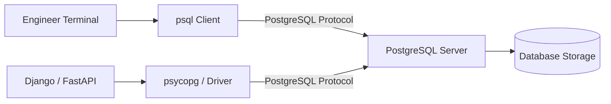
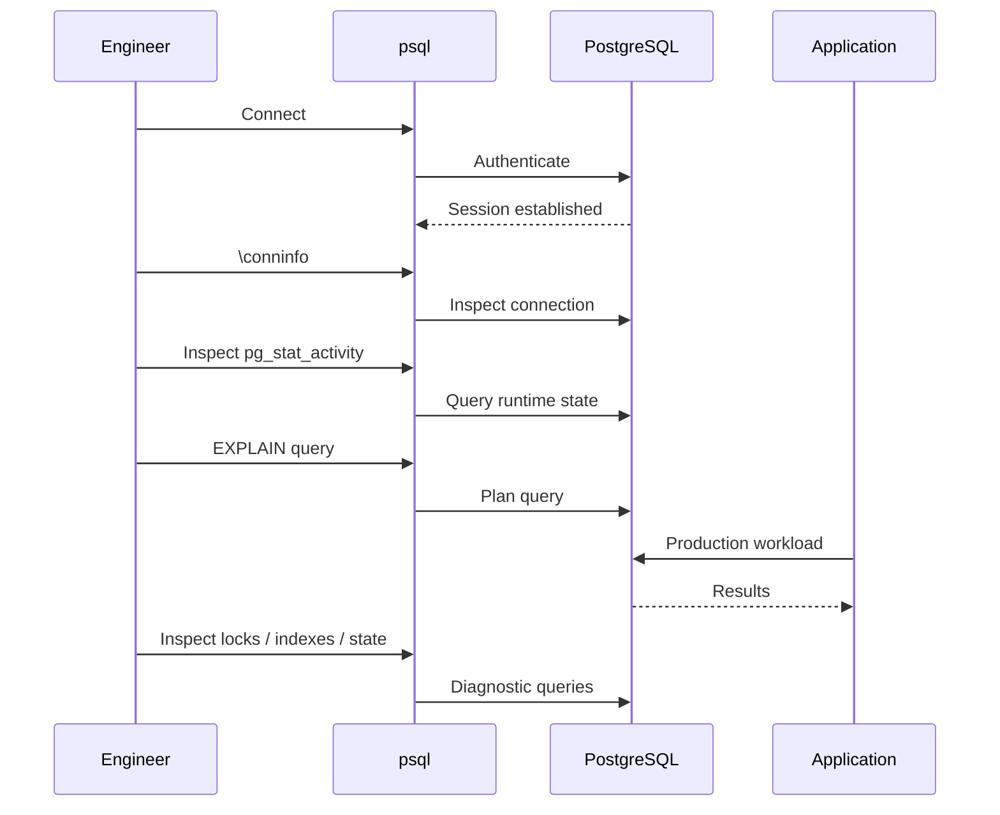

# 02- PostgreSQL psql Fundamentals

## Overview

`psql` is PostgreSQL's native interactive command-line client. It provides a direct interface to a PostgreSQL server for executing SQL, inspecting database objects, troubleshooting queries, investigating runtime behavior, and performing controlled administrative operations.

For backend engineers, `psql` is more than a SQL terminal. It is a practical diagnostic tool that connects application behavior to database internals.

A typical backend request flows through:

```text
Client
  ↓
Nginx / Load Balancer
  ↓
Django / FastAPI
  ↓
ORM / Repository Layer
  ↓
Database Driver
  ↓
PostgreSQL
```

`psql` provides an independent path:

```text
Engineer
  ↓
psql
  ↓
PostgreSQL Protocol
  ↓
PostgreSQL
```

This independent access is valuable when determining whether a problem originates in:

- Application logic
- ORM-generated SQL
- Database state
- Query planning
- Locking
- Connection management
- Permissions
- Replication
- Configuration

---

## `psql` Architecture

`psql` is a **client**, not a database server.



Both the application and `psql` communicate with the same PostgreSQL server through the PostgreSQL wire protocol.

This distinction matters operationally:

```text
psql installed
    ≠
PostgreSQL server installed

psql connection
    ≠
Database administrator privileges
```

The permissions of a `psql` session are determined by the PostgreSQL role and connection context.

---

## Why `psql` Matters for Backend Engineers

An ORM hides many database details during normal development.

For example:

```python
orders = (
    Order.objects
    .filter(customer_id=42)
    .order_by("-created_at")[:50]
)
```

The application ultimately produces SQL that PostgreSQL parses, plans, and executes.

`psql` lets you inspect that database layer directly:

```text
ORM
 ↓
Generated SQL
 ↓
psql
 ↓
EXPLAIN
 ↓
PostgreSQL execution plan
```

This makes `psql` useful for:

- SQL development
- Schema inspection
- Query optimization
- Permission debugging
- Lock investigation
- Connection investigation
- Replication troubleshooting
- Production incident response
- Controlled operational scripts

---

## Connecting to PostgreSQL

The standard connection syntax is:

```bash
psql -h HOST -p PORT -U USER -d DATABASE
```

Example:

```bash
psql \
  -h db.internal.example.com \
  -p 5432 \
  -U app_readonly \
  -d orders
```

The short options are:

| Option | Meaning |
|---|---|
| `-h` | Server hostname |
| `-p` | Server port |
| `-U` | PostgreSQL role |
| `-d` | Database name |
| `-W` | Prompt for password |
| `-c` | Execute a command |
| `-f` | Execute a SQL file |
| `-v` | Set a `psql` variable |

---

## Local Connections

A local PostgreSQL installation may allow:

```bash
psql -d orders
```

or:

```bash
psql -U postgres -d orders
```

The authentication method configured in `pg_hba.conf` determines how the connection is authenticated.

Common authentication mechanisms include:

```text
peer
password
scram-sha-256
certificate-based authentication
```

Do not assume that a successful local connection implies the same authentication behavior will work remotely.

---

## Verifying the Connection

Immediately after connecting, use:

```text
\conninfo
```

This is one of the most important operational commands.

It helps verify:

```text
Database
User
Host
Port
Connection method
```

Before executing production SQL, verify the target environment.

A dangerous operational failure is:

```text
Engineer thinks:
    staging

Actual connection:
    production
```

A simple `\conninfo` check can prevent this class of mistake.

---

## PostgreSQL Connection Strings

PostgreSQL also supports connection URIs:

```bash
psql 'postgresql://app_readonly@db.internal:5432/orders'
```

TLS options can be supplied through the connection string:

```bash
psql 'postgresql://app_readonly@db.internal:5432/orders?sslmode=require'
```

Avoid embedding passwords directly into command-line arguments.

Command-line arguments may be visible through process inspection or operational tooling.

---

## Password Handling

For interactive authentication:

```bash
psql -h db.internal -U app_readonly -d orders -W
```

For production systems, prefer managed secret mechanisms.

Common approaches include:

```text
AWS Secrets Manager
Kubernetes secret mechanisms
Workload identity
Short-lived credentials
.pgpass with restricted permissions
```

Avoid:

```text
Hard-coded passwords
Git repositories
Docker images
Shell history
CI logs
Application logs
Shared documentation
```

---

## Environment Variables

PostgreSQL clients recognize environment variables such as:

```bash
export PGHOST=db.internal
export PGPORT=5432
export PGUSER=app_readonly
export PGDATABASE=orders
```

Then:

```bash
psql
```

This can be convenient for local development and controlled operational environments.

Inspect the current PostgreSQL environment when troubleshooting:

```bash
env | grep '^PG'
```

Be careful when doing this on shared terminals or CI systems because environment variables can contain sensitive connection information.

---

## `psql` Prompt

A typical prompt may look like:

```text
orders=>
```

The prompt can be customized, but it commonly provides information about the current session.

The prompt may also indicate transaction state.

For example, after:

```sql
BEGIN;
```

the prompt can change to indicate that the session is inside a transaction.

Understanding the prompt helps prevent accidental operations in an unexpected session state.

---

## SQL vs `psql` Meta-Commands

This distinction is fundamental.

SQL is sent to PostgreSQL:

```sql
SELECT *
FROM app.orders
LIMIT 10;
```

A `psql` meta-command is interpreted locally by the `psql` client:

```text
\dt
```

The following are therefore different:

```text
\dt
```

and:

```sql
SELECT *
FROM information_schema.tables;
```

The first is a client command. The second is SQL executed by PostgreSQL.

---

## Essential `psql` Meta-Commands

| Command | Purpose |
|---|---|
| `\l` | List databases |
| `\c database` | Connect to another database |
| `\conninfo` | Show current connection |
| `\dn` | List schemas |
| `\dt` | List tables |
| `\dv` | List views |
| `\di` | List indexes |
| `\df` | List functions |
| `\du` | List roles |
| `\dp` | Display object privileges |
| `\d table` | Describe table |
| `\d+ table` | Detailed table description |
| `\timing` | Toggle execution timing |
| `\x` | Toggle expanded output |
| `\p` | Show current query buffer |
| `\e` | Edit current query |
| `\s` | Show command history |
| `\h` | SQL command help |
| `\?` | `psql` command help |
| `\q` | Exit |

---

## Listing Databases

Use:

```text
\l
```

This displays databases available to the connected role.

Connect to another database:

```text
\c reporting
```

or:

```text
\connect reporting
```

A PostgreSQL connection is associated with a specific database.

You cannot simply query arbitrary databases through the same SQL namespace as tables in the current database.

---

## Listing Schemas

List schemas:

```text
\dn
```

For additional information:

```text
\dn+
```

Schemas provide namespaces within a PostgreSQL database.

For example:

```text
public
app
reporting
audit
```

Schema-qualified SQL is often preferable for operational scripts:

```sql
SELECT *
FROM app.orders;
```

This reduces ambiguity when multiple schemas contain similarly named objects.

---

## Listing Tables

List tables in the default search scope:

```text
\dt
```

List tables across schemas:

```text
\dt *.*
```

Inspect a specific table:

```text
\d app.orders
```

Detailed information:

```text
\d+ app.orders
```

The table description can expose:

- Columns
- Data types
- Defaults
- Nullable attributes
- Constraints
- Indexes
- Storage-related metadata

---

## Inspecting Table Structure

Example:

```text
\d+ app.orders
```

A table may contain:

```text
id          bigint
customer_id bigint
status      text
created_at  timestamp with time zone
```

The same inspection should be performed before writing operational SQL.

Do not rely on memory of the schema when working against production data.

---

## Inspecting Indexes

List indexes:

```text
\di
```

Or inspect indexes associated with a table:

```text
\d app.orders
```

For query optimization, combine schema inspection with `EXPLAIN`:

```sql
EXPLAIN (ANALYZE, BUFFERS)
SELECT id, status, created_at
FROM app.orders
WHERE customer_id = 42
ORDER BY created_at DESC
LIMIT 50;
```

The important question is not merely whether an index exists, but whether PostgreSQL's chosen plan benefits from it.

---

## Inspecting Constraints

Table descriptions can reveal:

```text
PRIMARY KEY
FOREIGN KEY
UNIQUE
CHECK
```

For example:

```text
\d app.orders
```

Constraints are important because they represent database-enforced invariants.

An operational engineer should understand them before performing bulk mutations.

---

## Running SQL

Execute SQL directly:

```sql
SELECT
    id,
    status,
    created_at
FROM app.orders
ORDER BY created_at DESC
LIMIT 20;
```

Terminate the statement with:

```text
;
```

Without a terminating semicolon, `psql` may continue accepting input.

---

## Query Buffers

`psql` maintains a query buffer.

Display the current buffer:

```text
\p
```

Edit it using the configured editor:

```text
\e
```

This is useful for complex SQL statements.

For repeatable operational procedures, however, prefer a version-controlled SQL file.

---

## Query Timing

Enable timing:

```text
\timing on
```

Run:

```sql
SELECT count(*)
FROM app.orders;
```

Disable it when no longer needed:

```text
\timing off
```

Timing is useful for quick comparisons but should not be treated as a complete performance benchmark.

Query latency can vary because of:

- Cache state
- Concurrent workload
- Locks
- I/O
- Network latency
- CPU contention
- Planner behavior

---

## Expanded Output

Wide result sets are difficult to inspect horizontally.

Enable expanded output:

```text
\x
```

Then:

```sql
SELECT *
FROM app.orders
LIMIT 1;
```

Toggle it again to disable:

```text
\x
```

Expanded output is particularly useful for inspecting:

- Configuration rows
- Metadata
- Large JSON values
- Wide records

---

## Executing a Single Command

Use `-c`:

```bash
psql \
  -h db.internal \
  -U app_readonly \
  -d orders \
  -c 'SELECT count(*) FROM app.orders;'
```

This is useful for scripts and automation.

Keep shell quoting in mind when SQL contains:

```text
Quotes
Dollar-quoted strings
Shell variables
JSON
Regular expressions
```

For complex SQL, a `.sql` file is usually easier to review and maintain.

---

## Executing SQL Files

Create:

```text
check_orders.sql
```

with:

```sql
SELECT
    status,
    count(*)
FROM app.orders
GROUP BY status
ORDER BY status;
```

Execute:

```bash
psql -d orders -f check_orders.sql
```

This is preferable for reusable operational queries because the SQL can be:

- Version controlled
- Code reviewed
- Tested
- Reused
- Audited

---

## `ON_ERROR_STOP`

For scripts, stop execution when a SQL error occurs:

```bash
psql \
  --set ON_ERROR_STOP=1 \
  -d orders \
  -f maintenance.sql
```

This is particularly important in CI/CD and operational automation.

Without explicit error handling, a script can continue after an unexpected failure and produce misleading results.

---

## Transaction Handling

`psql` is useful for investigating transaction behavior.

Start a transaction:

```sql
BEGIN;
```

Run SQL:

```sql
UPDATE app.orders
SET status = 'cancelled'
WHERE id = 123;
```

Verify:

```sql
SELECT id, status
FROM app.orders
WHERE id = 123;
```

Commit:

```sql
COMMIT;
```

Or discard:

```sql
ROLLBACK;
```

---

## Safe Mutation Workflow

For a controlled production mutation:

```text
Verify connection
       ↓
Inspect schema
       ↓
Run SELECT
       ↓
Determine affected rows
       ↓
BEGIN
       ↓
Execute mutation
       ↓
Verify
       ↓
COMMIT
```

Example:

```sql
BEGIN;

UPDATE app.orders
SET status = 'cancelled'
WHERE id = 123
  AND status = 'pending';

SELECT id, status
FROM app.orders
WHERE id = 123;

COMMIT;
```

The exact transaction strategy depends on the business invariant and failure mode.

---

## Estimating Affected Rows

Before a bulk mutation, run the corresponding `SELECT`.

For example:

```sql
SELECT count(*)
FROM app.orders
WHERE status = 'pending'
  AND created_at < now() - interval '90 days';
```

Only after confirming the expected scope should a mutation be considered:

```sql
UPDATE app.orders
SET status = 'expired'
WHERE status = 'pending'
  AND created_at < now() - interval '90 days';
```

This is a simple but highly effective production safety practice.

---

## `SELECT` Before `UPDATE` or `DELETE`

A useful pattern is:

```sql
SELECT id
FROM app.orders
WHERE customer_id = 42;
```

Then:

```sql
UPDATE app.orders
SET status = 'cancelled'
WHERE customer_id = 42;
```

For high-risk operations, inspect the actual rows rather than relying only on a count.

---

## Running `EXPLAIN`

Basic plan inspection:

```sql
EXPLAIN
SELECT *
FROM app.orders
WHERE customer_id = 42;
```

This shows PostgreSQL's estimated execution plan.

For actual execution:

```sql
EXPLAIN (ANALYZE, BUFFERS)
SELECT *
FROM app.orders
WHERE customer_id = 42;
```

Important distinction:

```text
EXPLAIN
    ↓
Planning / estimated execution information

EXPLAIN ANALYZE
    ↓
Actually executes the statement
```

Never forget the second point.

---

## `EXPLAIN ANALYZE` and Mutating Statements

`EXPLAIN ANALYZE` executes the statement.

Therefore, do not casually run:

```sql
EXPLAIN ANALYZE
DELETE FROM app.orders
WHERE ...
```

or:

```sql
EXPLAIN ANALYZE
UPDATE app.orders
SET ...
WHERE ...;
```

If analyzing a mutating statement, understand the execution semantics and use a controlled transaction or an equivalent safe investigation strategy.

---

## Inspecting Active Sessions

PostgreSQL exposes session information through `pg_stat_activity`.

Example:

```sql
SELECT
    pid,
    usename,
    application_name,
    client_addr,
    state,
    wait_event_type,
    wait_event,
    query_start,
    query
FROM pg_stat_activity
ORDER BY query_start NULLS LAST;
```

This is useful for investigating:

- Connection exhaustion
- Long-running queries
- Idle sessions
- Waiting sessions
- Application connection behavior

---

## Investigating Long-Running Queries

Filter active sessions:

```sql
SELECT
    pid,
    usename,
    state,
    query_start,
    now() - query_start AS duration,
    query
FROM pg_stat_activity
WHERE state <> 'idle'
ORDER BY query_start;
```

Do not automatically terminate every long-running query.

First determine:

```text
Why is it running?
Is it expected?
Is it blocked?
Is it consuming resources?
Will terminating it cause application impact?
```

---

## Inspecting Locks

Find sessions waiting on locks:

```sql
SELECT
    pid,
    usename,
    state,
    wait_event_type,
    wait_event,
    query
FROM pg_stat_activity
WHERE wait_event_type = 'Lock';
```

Inspect locks:

```sql
SELECT
    pid,
    locktype,
    mode,
    granted,
    relation::regclass
FROM pg_locks
WHERE relation IS NOT NULL;
```

For serious incidents, correlate `pg_locks` with `pg_stat_activity`.

---

## Inspecting Blocking Sessions

PostgreSQL provides `pg_blocking_pids()` for identifying blockers.

Example:

```sql
SELECT
    pid,
    pg_blocking_pids(pid) AS blocking_pids,
    query
FROM pg_stat_activity
WHERE cardinality(pg_blocking_pids(pid)) > 0;
```

This can be much more useful than looking at lock rows without connecting them to active sessions.

---

## Inspecting Roles

List roles:

```text
\du
```

This helps identify:

- Login roles
- Role attributes
- Membership
- Administrative capabilities

For detailed investigation, PostgreSQL catalog views such as `pg_roles` can also be queried.

Example:

```sql
SELECT
    rolname,
    rolcanlogin,
    rolsuper,
    rolcreatedb,
    rolcreaterole,
    rolreplication,
    rolbypassrls
FROM pg_roles
ORDER BY rolname;
```

---

## Inspecting Privileges

Use:

```text
\dp
```

or:

```text
\dp app.*
```

This is useful when investigating:

```text
Permission denied
```

errors.

A complete permission investigation should consider:

```text
Role membership
+
Ownership
+
Direct grants
+
PUBLIC
+
Schema privileges
+
Table privileges
+
Column privileges
+
RLS
```

---

## SQL Help

PostgreSQL command help:

```text
\h
```

Specific SQL command:

```text
\h CREATE TABLE
```

or:

```text
\h SELECT
```

This is useful when you need syntax details without leaving the terminal.

---

## `psql` Help

For client commands:

```text
\?
```

This displays `psql` meta-command help.

The distinction is:

```text
\h
    ↓
PostgreSQL SQL syntax

\?
    ↓
psql client commands
```

---

## Command History

Show history:

```text
\s
```

This can be useful when reconstructing an interactive investigation.

However, history is also a potential security concern.

Do not enter:

```text
Passwords
API keys
Tokens
Private keys
Sensitive credentials
```

into interactive commands.

Use secure credential mechanisms instead.

---

## History File

`psql` maintains interactive command history depending on configuration.

Production and developer environments should be designed so that command history does not become a source of credential leakage.

Operational teams should consider:

```text
What is recorded?
Who can access it?
How long is it retained?
Can sensitive values appear in commands?
```

---

## Importing Data

PostgreSQL supports bulk data operations through `COPY`.

From `psql`, `\copy` is especially useful because the file is handled by the client.

Example:

```text
\copy app.customers(id, email) FROM 'customers.csv' WITH (FORMAT csv, HEADER true)
```

This differs from server-side SQL `COPY`.

---

## `COPY` vs `\copy`

| Characteristic | `COPY` | `\copy` |
|---|---|---|
| Type | SQL command | `psql` meta-command |
| File accessed by | PostgreSQL server | `psql` client |
| Client filesystem required | No | Yes |
| Common interactive use | Less common | Common |
| Server filesystem permissions | Relevant | Not required for client file |

This distinction becomes important in Docker, Kubernetes, and managed PostgreSQL environments.

---

## Exporting Data

Example:

```text
\copy (
    SELECT id, email
    FROM app.customers
    ORDER BY id
) TO 'customers.csv' WITH (FORMAT csv, HEADER true)
```

The output file is created on the machine running `psql`.

Be careful when exporting production data.

CSV files can contain:

```text
PII
Financial data
Internal identifiers
Sensitive business information
```

Treat exported files as sensitive production data.

---

## Output Modes

For scripting, `psql` provides output controls.

Example:

```bash
psql \
  -d orders \
  --tuples-only \
  --no-align \
  -c 'SELECT id FROM app.orders LIMIT 5;'
```

Common options include:

| Option | Purpose |
|---|---|
| `-A` | Unaligned output |
| `-t` | Tuples only |
| `-q` | Quiet mode |
| `-F` | Field separator |
| `-P` | Set output properties |

For automation, make output format explicit rather than parsing visually formatted terminal output.

---

## `psql` Variables

`psql` supports client-side variables.

Example:

```bash
psql \
  -v customer_id=42 \
  -d orders
```

Inside `psql`, variables can be referenced as:

```sql
SELECT *
FROM app.orders
WHERE customer_id = :customer_id;
```

This is a `psql` substitution mechanism, not the same thing as PostgreSQL prepared-statement parameter binding.

For untrusted application input, use proper parameterized queries through the application database driver.

---

## Connecting to a Read Replica

In a replicated environment:

```text
Primary
   |
   +---- Replica A
   |
   +---- Replica B
```

A CLI connection may target any of these endpoints.

Before making assumptions, inspect:

```sql
SELECT pg_is_in_recovery();
```

Interpretation:

```text
false → primary
true  → standby / recovery mode
```

This is particularly important before attempting a mutation.

---

## Read Replica Consistency

A replica may lag behind the primary.

Therefore:

```text
Primary write
    ↓
WAL
    ↓
Replica replay
    ↓
Replica query
```

A query through `psql` against a replica may not immediately observe a recent primary write.

When investigating data discrepancies, always determine which database instance you are connected to.

---

## Inspecting Server Version

Client version:

```bash
psql --version
```

Server version:

```sql
SHOW server_version;
```

or:

```sql
SELECT version();
```

These are different pieces of information:

```text
psql --version
    ↓
Client version

server_version
    ↓
PostgreSQL server version
```

---

## Inspecting Configuration

Useful settings can be inspected with:

```sql
SHOW max_connections;
```

```sql
SHOW statement_timeout;
```

```sql
SHOW lock_timeout;
```

```sql
SHOW work_mem;
```

For multiple settings:

```sql
SELECT
    name,
    setting,
    unit
FROM pg_settings
WHERE name IN (
    'max_connections',
    'statement_timeout',
    'lock_timeout',
    'work_mem'
)
ORDER BY name;
```

Before changing production settings, determine their scope and operational consequences.

---

## Connection Pooling

Application servers commonly use connection pooling:

```text
Django / FastAPI
       ↓
Connection Pool
       ↓
PostgreSQL
```

`psql` normally represents an individual client connection.

Therefore, CLI behavior may differ from application behavior when the application uses:

- SQLAlchemy pools
- PgBouncer
- Django persistent connections
- Multiple application replicas

When debugging connection issues, inspect both:

```text
Application pool metrics
+
pg_stat_activity
```

---

## `application_name`

PostgreSQL sessions can identify their source through `application_name`.

This can make `pg_stat_activity` significantly easier to interpret.

For example, applications may establish connections with names such as:

```text
orders-api
payments-api
celery-worker
reporting
```

Then:

```sql
SELECT
    pid,
    application_name,
    usename,
    state,
    query
FROM pg_stat_activity
ORDER BY application_name, pid;
```

This is valuable in microservice environments where many workloads share the same PostgreSQL cluster.

---

## Production Investigation Architecture

A typical incident investigation may look like:



The goal is to correlate direct database observations with application behavior.

---

## Using `psql` With Django

Django normally interacts with PostgreSQL through the ORM:

```python
Order.objects.filter(
    customer_id=42,
).order_by("-created_at")[:50]
```

When performance becomes a problem:

```text
Django ORM
    ↓
Generated SQL
    ↓
psql
    ↓
EXPLAIN
    ↓
PostgreSQL plan
```

The CLI should be used to validate database behavior independently from application code.

Useful Django debugging activities include:

- Inspecting tables
- Checking indexes
- Running generated SQL
- Comparing query plans
- Checking locks
- Checking connections
- Verifying migration results

---

## Using `psql` With FastAPI

A FastAPI service may use:

```text
FastAPI
   ↓
Service / Repository
   ↓
SQLAlchemy
   ↓
psycopg
   ↓
PostgreSQL
```

`psql` provides a direct diagnostic path:

```text
FastAPI behavior
      ↓
Generated SQL
      ↓
psql
      ↓
PostgreSQL
```

This helps isolate:

```text
Application issue
vs
SQL issue
vs
Database state
vs
Database performance issue
```

---

## Using `psql` With Docker

If PostgreSQL is running in Docker:

```bash
docker ps
```

If the port is exposed:

```bash
psql \
  -h localhost \
  -p 5432 \
  -U app \
  -d orders
```

Alternatively, run the client inside the container:

```bash
docker exec -it postgres \
  psql -U app -d orders
```

The second approach is useful when `psql` is not installed on the host.

---

## Using `psql` With Kubernetes

A controlled development or troubleshooting workflow can use port forwarding:

```bash
kubectl port-forward service/postgres 5432:5432
```

Then:

```bash
psql \
  -h localhost \
  -p 5432 \
  -U app_readonly \
  -d orders
```

For production, use an approved access path with:

```text
Authentication
Authorization
Network controls
Auditability
Secret management
```

Port forwarding itself should not be treated as the production security model.

---

## CI/CD Usage

`psql` can be used in CI/CD for:

```text
Migration verification
Schema checks
Post-deployment validation
Operational scripts
Health checks
```

Example:

```bash
set -euo pipefail

psql \
  --set ON_ERROR_STOP=1 \
  -d orders \
  -f verify_schema.sql
```

Avoid giving CI/CD unrestricted database privileges.

Prefer dedicated migration or deployment roles with narrowly defined permissions.

---

## Version-Controlled SQL

For repeatable operations:

```text
database/
    migrations/
    checks/
    maintenance/
    diagnostics/
```

Example:

```text
database/diagnostics/check_blocking.sql
database/diagnostics/check_replication.sql
database/maintenance/reindex.sql
```

Version control provides:

```text
Review
+
Auditability
+
Reproducibility
+
Change history
+
Team knowledge
```

---

## Reliability Practices

Operational SQL should be designed with failure in mind.

Prefer:

- Explicit transactions
- Idempotent operations where practical
- Controlled batch sizes
- Timeouts
- `ON_ERROR_STOP`
- Version-controlled SQL
- Read-before-write verification
- Clear rollback strategies
- Post-operation verification

Avoid large uncontrolled mutations during incidents.

---

## Performance Practices

When investigating performance:

```text
Start with evidence
       ↓
Inspect query
       ↓
EXPLAIN
       ↓
EXPLAIN ANALYZE
       ↓
Inspect BUFFERS
       ↓
Inspect indexes
       ↓
Inspect statistics
       ↓
Inspect locks
       ↓
Correlate with application metrics
```

Do not reduce every database performance problem to:

```text
"Add an index."
```

The actual bottleneck may be:

```text
Bad cardinality estimate
Lock contention
I/O
Connection exhaustion
Network transfer
Poor pagination
Large result sets
Memory pressure
Application N+1 behavior
```

---

## Security Practices

Use:

```text
Least-privilege roles
```

for CLI access.

Prefer:

```text
app_readonly
```

for routine investigation instead of:

```text
postgres
```

or another highly privileged administrative role.

Before production access, verify:

```text
Who am I?
Where am I connected?
What can I modify?
What will be audited?
```

---

## High Availability Practices

In a highly available PostgreSQL deployment:

```text
Application
    ↓
Stable database endpoint
    ↓
Current primary
```

CLI access may instead connect directly to a particular node.

Therefore, always verify:

```sql
SELECT
    current_database(),
    current_user,
    inet_server_addr(),
    inet_server_port(),
    pg_is_in_recovery();
```

This provides useful session and server context before operational work.

---

## Disaster Recovery Considerations

`psql` is often used during recovery operations, but recovery should not depend on ad-hoc terminal commands.

Production recovery should use:

```text
Documented runbook
+
Version-controlled SQL
+
Controlled credentials
+
Backup verification
+
PITR procedures
+
Post-recovery validation
```

The CLI can execute recovery verification queries, but the overall DR process should be automated and tested where possible.

---

## Common Mistakes

### Confusing `psql` With PostgreSQL

`psql` is a client.

PostgreSQL is the database server.

### Forgetting `\conninfo`

This creates environment-selection errors.

Always verify the connection before sensitive operations.

### Using `postgres` for Routine Investigation

This creates unnecessary privilege.

Use a read-only role when possible.

### Running Unbounded Queries

Avoid:

```sql
SELECT *
FROM app.events;
```

Prefer:

```sql
SELECT id, event_type, created_at
FROM app.events
ORDER BY created_at DESC
LIMIT 100;
```

### Running `EXPLAIN ANALYZE` on Destructive SQL

`EXPLAIN ANALYZE` executes the statement.

### Ignoring Transaction State

A forgotten transaction can retain locks or snapshots.

### Assuming the CLI Is the Same as the Application

Application connection pooling, role configuration, session settings, and transaction boundaries may differ.

### Exporting Sensitive Production Data

`\copy` can create local files containing production information.

Protect and dispose of exports appropriately.

---

## Production Pitfalls

### Manual Production Data Fixes

Direct SQL can bypass application-level business logic.

Before executing a fix, understand:

```text
Database constraints
Application invariants
Triggers
Foreign keys
Audit requirements
Replication
Downstream consumers
Caches
```

### Large Deletes

A large delete can generate substantial WAL, locking, vacuum work, and replication traffic.

Consider controlled batching and operational monitoring.

### Long Transactions

A transaction left open from an interactive CLI session can interfere with:

```text
VACUUM
Lock acquisition
Tuple cleanup
DDL
Replication
```

### Connecting Directly to a Replica

A replica may be read-only or lag behind.

Do not assume that a successful connection means it is the correct target for the operation.

---

## Operational Checklist

### Before Connecting

- [ ] Confirm host.
- [ ] Confirm database.
- [ ] Confirm role.
- [ ] Confirm environment.
- [ ] Confirm purpose.

### After Connecting

- [ ] Run `\conninfo`.
- [ ] Verify current database.
- [ ] Verify current role.
- [ ] Determine primary vs replica when relevant.
- [ ] Inspect required schema.

### Before Mutation

- [ ] Run the equivalent `SELECT`.
- [ ] Confirm affected rows.
- [ ] Understand locking.
- [ ] Determine transaction strategy.
- [ ] Confirm authorization.
- [ ] Have a recovery or rollback plan.

### After Mutation

- [ ] Verify resulting state.
- [ ] Check application behavior.
- [ ] Check replication impact where relevant.
- [ ] Confirm audit requirements.
- [ ] Record the operational change.

---

## Senior Engineering Workflow

When an API endpoint is slow, a senior engineer should not immediately change application code.

A stronger workflow is:

```text
API latency increases
        ↓
Application metrics
        ↓
Identify database query
        ↓
Inspect generated SQL
        ↓
Run query in psql
        ↓
EXPLAIN (ANALYZE, BUFFERS)
        ↓
Inspect indexes/statistics
        ↓
Inspect locks
        ↓
Inspect connections
        ↓
Correlate with PostgreSQL metrics
        ↓
Identify root cause
        ↓
Apply targeted change
        ↓
Measure again
```

This turns `psql` from a command-line SQL tool into a database observability and troubleshooting interface.

---

## Interview Traps

### Is `\dt` SQL?

No. It is a `psql` meta-command.

### Does `psql` require PostgreSQL to be installed locally?

No. The client can connect to a remote PostgreSQL server.

### Does `psql` bypass PostgreSQL permissions?

No. The connected role remains subject to PostgreSQL authorization mechanisms.

### Does `EXPLAIN ANALYZE` execute the query?

Yes.

### Is `\copy` the same as `COPY`?

No. `\copy` is a `psql` command that performs file handling on the client side.

### Does `psql --version` show the server version?

No. It shows the client version.

### Why use `psql when an ORM already exists?

Because it provides direct access to the database and allows engineers to separate application behavior from database behavior.

### Why is `\conninfo` important?

Because operational mistakes frequently involve connecting to the wrong database, host, role, or environment.

---

## Key Takeaways

- **`psql` is PostgreSQL's native client:** it provides direct access to SQL, metadata, query plans, runtime state, permissions, locks, and operational diagnostics.
- **Master the distinction between SQL and `psql` commands:** SQL executes on PostgreSQL, while commands such as `\d`, `\dt`, `\du`, and `\conninfo` are handled by the client.
- **Treat `psql` as an operational tool:** verify the connection, use least-privilege roles, control production mutations, protect credentials, and understand transaction and locking behavior.
- **Use `psql` to bridge application and database debugging:** combine generated SQL, `EXPLAIN`, indexes, `pg_stat_activity`, locks, connections, and replication state to identify real bottlenecks.
- **Production CLI work must be repeatable and safe:** prefer version-controlled SQL, explicit error handling, controlled transactions, verification steps, and documented recovery procedures.