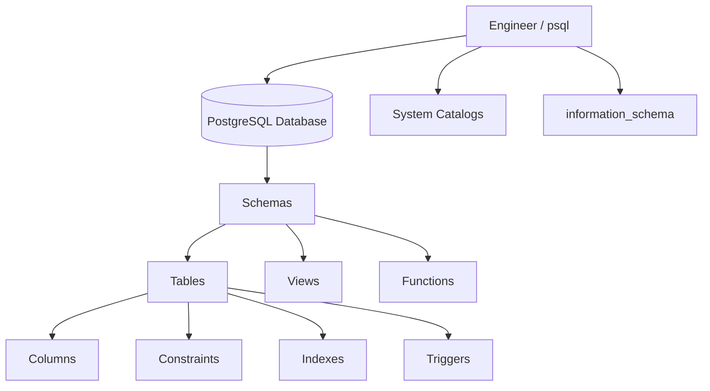
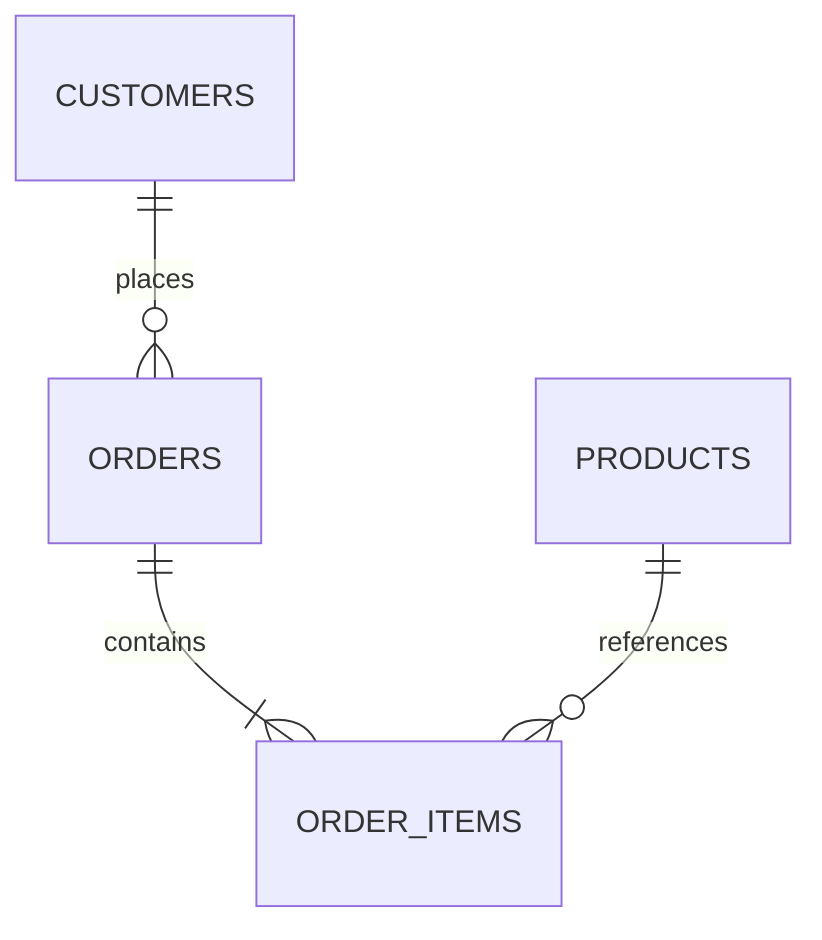

# 04- Inspecting Databases and Schemas

## Overview

Database and schema inspection is one of the most common tasks performed with the PostgreSQL CLI.

Before writing SQL against an unfamiliar database, a backend engineer should be able to answer:

```text
Which database am I connected to?
        ↓
Which schemas exist?
        ↓
Which tables exist?
        ↓
What columns do they contain?
        ↓
Which constraints protect them?
        ↓
Which indexes exist?
        ↓
Which views and functions exist?
        ↓
Which roles can access them?
```

The PostgreSQL CLI provides convenient `psql` meta-commands for interactive inspection, while PostgreSQL system catalogs and `information_schema` provide SQL-based inspection suitable for scripts, automation, and deeper analysis.

A useful distinction is:

```text
psql meta-commands
    ↓
Fast interactive inspection

System catalogs
    ↓
PostgreSQL-specific metadata and internals

information_schema
    ↓
Portable SQL metadata interface
```

For production troubleshooting, schema inspection should be combined with query plans, statistics, locks, permissions, replication state, and application behavior.

---

## Database and Schema Hierarchy

A PostgreSQL deployment can be understood as:

```text
PostgreSQL Server / Cluster
        ↓
    Databases
        ↓
     Schemas
        ↓
 Tables / Views / Sequences / Functions
        ↓
 Columns / Constraints / Indexes
```

For example:

```text
PostgreSQL
└── orders
    ├── app
    │   ├── customers
    │   ├── orders
    │   └── order_items
    ├── reporting
    │   └── daily_sales
    └── audit
        └── events
```

A schema is a namespace within a database. It is not an independent database.

---

## Database vs Schema

| Concept | Database | Schema |
|---|---|---|
| Scope | PostgreSQL database server | Inside one database |
| Contains | Schemas and database objects | Tables, views, functions, sequences, etc. |
| Connection target | Yes | No |
| Can isolate object namespaces | Yes | Yes |
| Can have privileges | Yes | Yes |
| Typical use | Application/database boundary | Logical namespace or ownership boundary |

A PostgreSQL connection connects to a **database**, not directly to a schema.

The schema is selected through the session's `search_path` and object qualification.

---

## Verify the Current Database

Before inspecting anything:

```text
\conninfo
```

Also query:

```sql
SELECT current_database();
```

This is especially important in environments containing:

```text
Development
Testing
Staging
Production
Reporting
DR
```

A successful connection to the wrong database is still an operational failure.

---

## Verify the Current Role

Check the current database role:

```sql
SELECT current_user;
```

Also inspect the session identity:

```sql
SELECT
    session_user,
    current_user;
```

These can differ when role switching is used.

For permission troubleshooting, identity should always be part of the inspection process.

---

## Inspect the PostgreSQL Server

Useful diagnostic information:

```sql
SELECT
    version(),
    current_database(),
    current_user,
    inet_server_addr(),
    inet_server_port(),
    pg_is_in_recovery();
```

This helps answer:

```text
Which server?
Which database?
Which role?
Which port?
Primary or replica?
```

---

## List Databases

Use the `psql` meta-command:

```text
\l
```

For additional information:

```text
\l+
```

This is useful when determining which databases exist on the connected PostgreSQL instance.

Remember that database visibility itself can depend on permissions and PostgreSQL configuration.

---

## Connect to Another Database

Use:

```text
\c reporting
```

or:

```text
\connect reporting
```

After switching:

```text
\conninfo
```

should be used to verify the new connection.

A schema visible in one database is not automatically available in another database.

---

## List Schemas

Use:

```text
\dn
```

For more details:

```text
\dn+
```

Typical application databases might contain:

```text
public
app
reporting
audit
```

Schemas are useful for:

- Logical organization
- Namespace separation
- Permission boundaries
- Migration ownership
- Reporting structures
- Extension-specific objects

---

## Schema Qualification

Instead of:

```sql
SELECT *
FROM orders;
```

use an explicit schema when the context matters:

```sql
SELECT *
FROM app.orders;
```

Schema-qualified names reduce ambiguity and make operational SQL easier to review.

This is especially valuable when multiple schemas contain objects with similar names.

---

## The `search_path`

PostgreSQL uses `search_path` to determine where unqualified object names are resolved.

Inspect it:

```sql
SHOW search_path;
```

Example:

```text
"$user", public
```

An unqualified query:

```sql
SELECT *
FROM orders;
```

may therefore resolve according to the configured search path.

For sensitive or privileged SQL, explicitly qualifying objects is often safer.

---

## Why `search_path` Matters

Consider:

```text
app.orders
reporting.orders
```

With an ambiguous query:

```sql
SELECT *
FROM orders;
```

the selected object depends on `search_path`.

This matters for:

- Security
- `SECURITY DEFINER` functions
- Multi-schema applications
- Migrations
- Administrative scripts
- Production debugging

A secure design should avoid relying on an unexpected search path.

---

## List Tables

Use:

```text
\dt
```

To inspect tables across schemas:

```text
\dt *.*
```

You can also target a specific schema:

```text
\dt app.*
```

This is usually the fastest way to understand an unfamiliar schema interactively.

---

## List Views

Use:

```text
\dv
```

Or across schemas:

```text
\dv *.*
```

Views can represent:

```text
Reusable queries
Reporting interfaces
Security boundaries
Compatibility layers
Abstractions over normalized tables
```

Do not assume a view is equivalent to a materialized view.

---

## List Materialized Views

Use:

```text
\dm
```

Materialized views store query results and must be refreshed.

They can be useful for:

```text
Reporting
Dashboards
Expensive aggregations
Read-heavy workloads
```

Inspect their definitions before modifying underlying tables.

---

## List Sequences

Use:

```text
\ds
```

Sequences are database objects used to generate values, commonly for surrogate identifiers.

For example, legacy `serial` columns commonly rely on sequences.

Inspecting sequences can be important when debugging:

```text
Primary key generation
Permission errors
Sequence ownership
Migration behavior
```

---

## List Functions

Use:

```text
\df
```

For more targeted inspection:

```text
\df app.*
```

Functions may implement:

- Data transformations
- Database-side business logic
- Utility operations
- Security-sensitive operations
- Trigger behavior

Functions should be inspected carefully when investigating unexpected database behavior.

---

## List Types

PostgreSQL supports custom data types.

Use:

```text
\dT
```

This can help identify:

```text
Enums
Domains
Composite types
Custom types
```

Custom types are especially relevant in PostgreSQL-heavy systems.

---

## Inspect a Table

Use:

```text
\d app.orders
```

This provides a compact description of the table.

Typical information includes:

```text
Columns
Types
Defaults
Constraints
Indexes
```

For more information:

```text
\d+ app.orders
```

---

## Understanding Table Output

A table may look conceptually like:

```text
Column       Type                     Nullable
-----------  -----------------------  --------
id           bigint                   not null
customer_id  bigint                   not null
status       text                     not null
created_at   timestamp with time zone not null
```

The description can also show:

```text
Primary key
Foreign keys
Unique constraints
Check constraints
Indexes
```

This makes `\d` one of the most useful commands for unfamiliar databases.

---

## Inspecting Columns With SQL

PostgreSQL's `information_schema` provides a portable metadata interface.

Example:

```sql
SELECT
    column_name,
    data_type,
    is_nullable,
    column_default
FROM information_schema.columns
WHERE table_schema = 'app'
  AND table_name = 'orders'
ORDER BY ordinal_position;
```

This is useful for scripts and automation because the query is SQL rather than a `psql` display command.

---

## `information_schema` vs System Catalogs

PostgreSQL exposes metadata through both:

```text
information_schema
```

and:

```text
pg_catalog
```

The distinction is useful:

| Interface | Strength |
|---|---|
| `psql` meta-commands | Fast interactive inspection |
| `information_schema` | SQL-standard metadata |
| `pg_catalog` | PostgreSQL-specific, detailed metadata |

Use `information_schema` when portability matters.

Use PostgreSQL catalogs when PostgreSQL-specific detail is required.

---

## PostgreSQL System Catalogs

PostgreSQL stores metadata in system catalogs.

Important catalogs include:

| Catalog | Purpose |
|---|---|
| `pg_database` | Databases |
| `pg_namespace` | Schemas |
| `pg_class` | Tables, indexes, views and related relations |
| `pg_attribute` | Columns |
| `pg_constraint` | Constraints |
| `pg_index` | Index metadata |
| `pg_roles` | Roles |
| `pg_proc` | Functions/procedures |
| `pg_type` | Data types |
| `pg_description` | Object comments |

The catalogs are PostgreSQL's internal metadata structures.

---

## Inspecting Schemas With `pg_namespace`

Example:

```sql
SELECT
    oid,
    nspname AS schema_name
FROM pg_namespace
ORDER BY nspname;
```

This is useful when you need PostgreSQL-specific metadata beyond what `information_schema` exposes.

---

## Inspecting Tables With `pg_class`

A simplified catalog query:

```sql
SELECT
    c.oid,
    n.nspname AS schema_name,
    c.relname AS relation_name,
    c.relkind
FROM pg_class AS c
JOIN pg_namespace AS n
    ON n.oid = c.relnamespace
WHERE n.nspname NOT IN ('pg_catalog', 'information_schema')
ORDER BY n.nspname, c.relname;
```

`relkind` distinguishes different relation types.

For everyday interactive inspection, prefer `\dt`, `\dv`, `\di`, and related commands.

---

## Inspecting Tables and Views Together

For broad catalog investigation:

```sql
SELECT
    n.nspname AS schema_name,
    c.relname AS object_name,
    c.relkind
FROM pg_class AS c
JOIN pg_namespace AS n
    ON n.oid = c.relnamespace
WHERE n.nspname NOT LIKE 'pg_%'
  AND n.nspname <> 'information_schema'
ORDER BY n.nspname, c.relname;
```

This is useful for database inventory tooling.

---

## Inspecting Indexes

List indexes:

```text
\di
```

Inspect a table:

```text
\d app.orders
```

For SQL-based inspection:

```sql
SELECT
    schemaname,
    tablename,
    indexname,
    indexdef
FROM pg_indexes
WHERE schemaname = 'app'
  AND tablename = 'orders'
ORDER BY indexname;
```

Index inspection is essential when analyzing query performance.

---

## Inspecting Constraints

Use:

```text
\d app.orders
```

For SQL-based inspection:

```sql
SELECT
    constraint_name,
    constraint_type
FROM information_schema.table_constraints
WHERE table_schema = 'app'
  AND table_name = 'orders'
ORDER BY constraint_name;
```

Constraints commonly include:

```text
PRIMARY KEY
FOREIGN KEY
UNIQUE
CHECK
```

---

## Inspecting Foreign Keys

Foreign keys are particularly important when understanding data relationships.

Example:

```sql
SELECT
    tc.constraint_name,
    tc.table_schema,
    tc.table_name,
    kcu.column_name,
    ccu.table_schema AS referenced_schema,
    ccu.table_name AS referenced_table,
    ccu.column_name AS referenced_column
FROM information_schema.table_constraints AS tc
JOIN information_schema.key_column_usage AS kcu
    ON tc.constraint_name = kcu.constraint_name
   AND tc.table_schema = kcu.table_schema
JOIN information_schema.constraint_column_usage AS ccu
    ON ccu.constraint_name = tc.constraint_name
   AND ccu.table_schema = tc.table_schema
WHERE tc.constraint_type = 'FOREIGN KEY'
  AND tc.table_schema = 'app'
ORDER BY tc.table_name, tc.constraint_name;
```

This is useful for reconstructing relationships in unfamiliar databases.

---

## Understanding a Database Schema

A useful inspection sequence is:

```text
Database
   ↓
Schemas
   ↓
Tables
   ↓
Columns
   ↓
Primary keys
   ↓
Foreign keys
   ↓
Unique constraints
   ↓
Check constraints
   ↓
Indexes
   ↓
Views / functions
```

This creates a structural map before querying business data.

---

## Schema Inspection Architecture



Different inspection interfaces provide different levels of detail over the same database metadata.

---

## Inspecting Table Size

Understanding table size is important for operational work.

PostgreSQL provides functions such as:

```sql
SELECT
    pg_size_pretty(pg_table_size('app.orders')) AS table_size,
    pg_size_pretty(pg_indexes_size('app.orders')) AS indexes_size,
    pg_size_pretty(pg_total_relation_size('app.orders')) AS total_size;
```

The distinction is useful:

```text
Table size
+
Index size
+
Other relation storage
```

can significantly affect disk usage.

---

## Finding Large Tables

A practical query:

```sql
SELECT
    schemaname,
    relname AS table_name,
    pg_size_pretty(pg_total_relation_size(relid)) AS total_size
FROM pg_catalog.pg_statio_user_tables
ORDER BY pg_total_relation_size(relid) DESC
LIMIT 20;
```

This is useful during:

```text
Storage incidents
Capacity planning
Migration planning
Partitioning decisions
Backup analysis
```

---

## Finding Large Indexes

Index storage can be inspected with:

```sql
SELECT
    schemaname,
    relname AS table_name,
    indexrelname AS index_name,
    pg_size_pretty(pg_relation_size(indexrelid)) AS index_size
FROM pg_catalog.pg_statio_user_indexes
ORDER BY pg_relation_size(indexrelid) DESC
LIMIT 20;
```

Large indexes can increase:

```text
Storage
Write amplification
Backup size
Maintenance cost
Cache pressure
```

Do not drop an index merely because it is large. First determine whether it supports important queries.

---

## Inspecting Table Statistics

PostgreSQL exposes table-level statistics through views such as:

```sql
SELECT
    schemaname,
    relname AS table_name,
    n_live_tup,
    n_dead_tup,
    last_analyze,
    last_autoanalyze,
    last_vacuum,
    last_autovacuum
FROM pg_stat_user_tables
ORDER BY n_dead_tup DESC;
```

This can help identify tables that may need investigation for:

```text
Vacuum behavior
Analyze freshness
Dead tuples
Maintenance pressure
```

These values are statistics and estimates, not necessarily exact row counts.

---

## Estimated Row Counts

For large tables, avoid assuming that:

```sql
SELECT count(*)
FROM app.orders;
```

is always cheap.

For rough inspection, catalog statistics can provide estimates.

For example:

```sql
SELECT
    reltuples AS estimated_rows
FROM pg_class
WHERE oid = 'app.orders'::regclass;
```

The estimate depends on statistics freshness and should not be treated as an exact count.

---

## Inspecting Views

List views:

```text
\dv
```

Inspect a view:

```text
\d+ app.customer_summary
```

You can also inspect its definition:

```sql
SELECT pg_get_viewdef(
    'app.customer_summary'::regclass,
    true
);
```

This helps determine whether an application is querying:

```text
Base table
View
Materialized view
```

which can materially change query behavior.

---

## Inspecting Functions

List functions:

```text
\df app.*
```

Inspect definitions when necessary:

```sql
SELECT pg_get_functiondef(
    'app.calculate_order_total(bigint)'::regprocedure
);
```

Function definitions are especially important when investigating:

```text
Triggers
Security-definer functions
Database-side business logic
Unexpected data changes
```

---

## Inspecting Triggers

Triggers are often invisible at the application layer.

Inspect a table:

```text
\d app.orders
```

For SQL-based inspection:

```sql
SELECT
    trigger_schema,
    trigger_name,
    event_manipulation,
    event_object_schema,
    event_object_table,
    action_timing,
    action_statement
FROM information_schema.triggers
WHERE event_object_schema = 'app'
  AND event_object_table = 'orders'
ORDER BY trigger_name;
```

Triggers can modify data or execute logic automatically, so they should be considered before direct production mutations.

---

## Inspecting Comments

Database objects can contain comments.

For example:

```sql
COMMENT ON TABLE app.orders IS 'Customer orders';
```

Inspecting comments can provide useful operational documentation.

PostgreSQL stores comments in `pg_description`.

Well-maintained comments can reduce the need to reverse-engineer unfamiliar schemas.

---

## Inspecting Privileges

Object privileges can be inspected with:

```text
\dp app.*
```

or:

```sql
SELECT
    grantee,
    table_schema,
    table_name,
    privilege_type
FROM information_schema.role_table_grants
WHERE table_schema = 'app'
ORDER BY table_name, grantee, privilege_type;
```

Permission inspection is particularly important when a query works for one role but fails for another.

---

## Inspecting Row-Level Security

For tables using PostgreSQL RLS:

```text
\d+ app.orders
```

can reveal row security information.

The policies can also be inspected:

```sql
SELECT
    schemaname,
    tablename,
    policyname,
    permissive,
    roles,
    cmd,
    qual,
    with_check
FROM pg_policies
WHERE schemaname = 'app'
ORDER BY tablename, policyname;
```

RLS is an additional security layer beyond ordinary table privileges.

---

## Inspecting Extensions

List installed extensions:

```text
\dx
```

Extensions can introduce:

```text
Functions
Types
Operators
Indexes
Other database objects
```

Common examples include extensions used for:

```text
UUID generation
Trigram search
Geospatial functionality
```

Before changing extension-related objects, understand which application features depend on them.

---

## Inspecting Sequences

List sequences:

```text
\ds
```

A sequence can be inspected through SQL:

```sql
SELECT
    sequence_schema,
    sequence_name
FROM information_schema.sequences
WHERE sequence_schema = 'app'
ORDER BY sequence_name;
```

Sequence permissions and ownership can matter when applications insert rows using generated identifiers.

---

## Inspecting Partitioned Tables

For partitioned applications, inspect table structure:

```text
\d+ app.events
```

Then identify partitions using PostgreSQL catalogs where required.

Partition inspection matters because:

```text
Logical table
    ↓
Parent
    ↓
Child partitions
```

means storage, indexes, statistics, and maintenance may exist at partition level.

---

## Inspecting Foreign-Key Relationships

When entering an unfamiliar database, identify relationships before making assumptions.

Conceptually:



This relationship map helps determine:

```text
Deletion impact
Join paths
Data ownership
Referential integrity
Migration dependencies
```

---

## Schema Inspection for Django

Django migrations create PostgreSQL objects that can be inspected directly.

For example:

```bash
python manage.py showmigrations
```

can be combined with:

```text
psql
```

to compare:

```text
Django migration state
vs
Actual PostgreSQL schema
```

Useful checks include:

```text
Tables
Indexes
Constraints
Columns
Sequences
```

This can reveal schema drift or incomplete deployment operations.

---

## Schema Inspection for SQLAlchemy

SQLAlchemy models describe expected application structure, but PostgreSQL remains the actual database state.

A production investigation may compare:

```text
SQLAlchemy models
        ↓
Migration history
        ↓
PostgreSQL catalogs
        ↓
Actual schema
```

The CLI is useful for validating the final database state independently.

---

## Schema Inspection in Microservices

A shared PostgreSQL cluster might contain:

```text
orders
payments
identity
reporting
audit
```

Possible boundaries include:

```text
Database per service
Schema per service
Shared schema
```

Inspecting schemas helps determine the actual architecture rather than relying solely on application documentation.

---

## Schema Ownership

Schema ownership matters for security and operational changes.

Inspect schema information:

```text
\dn+
```

Ownership influences who can:

```text
Alter objects
Drop objects
Grant privileges
Perform administrative changes
```

Ownership should therefore be part of permission investigations.

---

## Database Ownership

Database-level ownership can also affect administration.

List databases:

```text
\l+
```

When diagnosing permission issues, distinguish:

```text
Database owner
Schema owner
Table owner
Current role
Granted role
```

These are different concepts.

---

## Search Path and Security

A dangerous mistake is assuming an unqualified object name always means the intended object.

For example:

```sql
SELECT *
FROM orders;
```

may depend on:

```sql
SHOW search_path;
```

Security-sensitive functions, especially `SECURITY DEFINER` functions, require particular care because unsafe search paths can create object-resolution vulnerabilities.

For operational SQL, prefer:

```sql
SELECT *
FROM app.orders;
```

when the schema is known.

---

## Production Schema Inspection Workflow

Before investigating an unfamiliar production database:

```text
\conninfo
        ↓
current_user
        ↓
current_database
        ↓
pg_is_in_recovery()
        ↓
\dn+
        ↓
\dt *.*
        ↓
\d+ target_table
        ↓
Inspect indexes
        ↓
Inspect constraints
        ↓
Inspect privileges
        ↓
Inspect RLS / triggers if relevant
```

This produces a reliable understanding of the target before any mutation is attempted.

---

## Schema Inspection and Performance

Schema inspection should precede query optimization.

For a slow query:

```text
Query
 ↓
Identify referenced tables
 ↓
Inspect columns
 ↓
Inspect indexes
 ↓
Inspect constraints
 ↓
EXPLAIN
 ↓
Check statistics
```

For example:

```sql
SELECT
    id,
    status,
    created_at
FROM app.orders
WHERE customer_id = 42
ORDER BY created_at DESC
LIMIT 50;
```

Before proposing an index, inspect existing indexes:

```text
\d app.orders
```

Then inspect the actual plan:

```sql
EXPLAIN (ANALYZE, BUFFERS)
SELECT
    id,
    status,
    created_at
FROM app.orders
WHERE customer_id = 42
ORDER BY created_at DESC
LIMIT 50;
```

---

## Schema Inspection and Security

Schema inspection is also a security task.

Determine:

```text
Which sensitive tables exist?
Who owns them?
Who can access them?
Are RLS policies enabled?
Are there security-definer functions?
Are audit tables protected?
```

A database inventory should therefore include security metadata, not just table names.

---

## Schema Inspection and Migrations

Before running a migration, inspect the current state.

Useful checks include:

```text
Current table definition
Existing indexes
Existing constraints
Existing columns
Existing dependencies
Table size
Active sessions
```

This is especially important for large production tables because operations such as:

```text
ALTER TABLE
CREATE INDEX
DROP INDEX
```

can have locking, resource, or deployment implications.

---

## Schema Drift

Schema drift occurs when the actual database differs from the expected schema.

Possible causes:

```text
Manual production changes
Failed migrations
Partial deployments
Environment differences
Out-of-band scripts
Incorrect migration ordering
```

A mature deployment process treats schema state as version-controlled infrastructure.

CLI inspection can be used to verify the result after migrations.

---

## Comparing Environments

Suppose:

```text
Development
Staging
Production
```

are expected to have equivalent schemas.

Compare:

```text
Tables
Columns
Indexes
Constraints
Extensions
Functions
Permissions
```

Differences may explain:

```text
Works in staging
Fails in production
```

Do not assume migration history alone proves that two databases are identical.

---

## Large Production Databases

Inspection queries themselves should be lightweight.

Prefer:

```sql
SELECT
    schemaname,
    relname,
    pg_size_pretty(pg_total_relation_size(relid))
FROM pg_catalog.pg_statio_user_tables
ORDER BY pg_total_relation_size(relid) DESC
LIMIT 20;
```

over unnecessarily scanning application tables.

Metadata and catalog views are often preferable for operational inventory.

---

## Avoiding Expensive Inspection Queries

This query can be expensive on a large table:

```sql
SELECT count(*)
FROM app.events;
```

If an approximate answer is sufficient, use catalog statistics.

If exact data is required, understand the workload impact before executing the query.

Operational inspection should minimize interference with production traffic.

---

## Security Considerations

Do not assume metadata is harmless.

Schema inspection can reveal:

```text
Sensitive table names
Internal business concepts
Security structures
User information
Audit structures
Extensions
Database architecture
```

Restrict production database access and audit privileged sessions.

When exporting schema metadata, treat it as internal operational information.

---

## Reliability Considerations

Schema inspection is generally read-only, but the queries themselves still consume database resources.

During incidents:

- Avoid unbounded data scans.
- Prefer catalog queries.
- Use `LIMIT`.
- Avoid unnecessary `count(*)`.
- Avoid long transactions.
- Use read-only access when possible.
- Do not modify schema while merely investigating it.

---

## High Availability Considerations

Schema inspection can often be performed against a read replica.

However, remember:

```text
Replica
    ↓
May lag behind primary
```

If you are validating the result of a recent migration or schema change, inspect the primary or ensure that replica replay has caught up sufficiently.

For target identification:

```sql
SELECT
    inet_server_addr(),
    pg_is_in_recovery();
```

---

## Disaster Recovery Considerations

Schema inspection is useful when validating a restored database.

After recovery, verify:

```text
Databases
Schemas
Tables
Indexes
Constraints
Functions
Extensions
Roles
Privileges
RLS
```

A successful database restore does not necessarily mean the recovered environment matches the expected production configuration.

---

## Common Mistakes

### Assuming `\dt` Shows Every Database Table

It is affected by the command's schema pattern and visibility.

Use:

```text
\dt *.*
```

when a broader inspection is required.

### Confusing Database and Schema

You connect to:

```text
database
```

and operate within:

```text
schemas
```

A schema is not a separate database connection target.

### Ignoring `search_path`

Unqualified names depend on search-path resolution.

Use schema-qualified names when correctness matters.

### Inspecting Only Tables

An application can depend on:

```text
Views
Functions
Triggers
Sequences
Extensions
Indexes
Constraints
RLS
```

### Assuming ORM Models Are the Actual Schema

The database is the runtime source of truth for database state.

Compare:

```text
ORM models
+
migration history
+
actual PostgreSQL schema
```

### Running Expensive Data Queries to Understand Schema

Metadata inspection should generally use:

```text
psql meta-commands
information_schema
pg_catalog
```

rather than scanning large application tables unnecessarily.

---

## Production Pitfalls

### Inspecting the Wrong Environment

Always start with:

```text
\conninfo
```

and:

```sql
SELECT current_database(), current_user;
```

### Dropping an Apparently Unused Index

An index may support:

```text
Rare but critical query
Unique constraint
Foreign key workload
Ordering
Partial query pattern
```

Inspect query usage before removal.

### Ignoring Table Size

A schema change that is trivial on a 10 MB table may be operationally significant on a multi-terabyte table.

### Ignoring Triggers

Direct SQL can activate triggers and therefore execute additional database-side logic.

### Ignoring RLS

Two users querying the same table can observe different rows because of RLS policies.

### Assuming Replica State Is Current

Schema changes can lag on replicas just like data changes.

---

## Recommended Inspection Command Set

For routine PostgreSQL investigation:

```text
\conninfo
\l+
\dn+
\dt *.*
\dv *.*
\di *.*
\ds *.*
\df *.*
\dx
```

Then inspect the relevant object:

```text
\d+ app.orders
```

And investigate privileges when necessary:

```text
\dp app.*
```

This command set provides a strong initial database inventory.

---

## Recommended SQL Inspection Set

Useful SQL queries include:

```sql
SELECT
    current_database(),
    current_user,
    session_user,
    inet_server_addr(),
    inet_server_port(),
    pg_is_in_recovery();
```

```sql
SHOW search_path;
```

```sql
SELECT
    table_schema,
    table_name
FROM information_schema.tables
WHERE table_schema NOT IN (
    'pg_catalog',
    'information_schema'
)
ORDER BY table_schema, table_name;
```

```sql
SELECT
    schemaname,
    tablename,
    indexname,
    indexdef
FROM pg_indexes
ORDER BY schemaname, tablename, indexname;
```

These can form the basis of reusable diagnostic tooling.

---

## Building a Database Inventory

A mature engineering organization can automate schema inventory.

Conceptually:

```text
PostgreSQL
    ↓
Metadata queries
    ↓
Schema inventory
    ├── Databases
    ├── Schemas
    ├── Tables
    ├── Columns
    ├── Constraints
    ├── Indexes
    ├── Views
    ├── Functions
    ├── Extensions
    └── Privileges
```

The inventory can then be compared against:

```text
Migration definitions
Infrastructure configuration
Expected architecture
Security policy
```

This helps detect drift.

---

## Senior Engineering Perspective

Database inspection is not simply learning `\dt` and `\d`.

The deeper skill is building a mental model of the database quickly.

Given an unfamiliar PostgreSQL database, a senior engineer should be able to determine:

```text
Ownership
   ↓
Schema boundaries
   ↓
Data model
   ↓
Relationships
   ↓
Constraints
   ↓
Indexes
   ↓
Security boundaries
   ↓
Workload characteristics
   ↓
Operational risks
```

Then connect that model to the application:

```text
Django / FastAPI
       ↓
ORM / SQL
       ↓
Tables
       ↓
Indexes
       ↓
Constraints
       ↓
Transactions
       ↓
Locks
       ↓
Storage
```

This is the foundation for effective database debugging and system design.

---

## Interview Traps

### What is the difference between a database and schema?

A database is a connection-level logical container within PostgreSQL. A schema is a namespace inside a database.

### What is `\d`?

A `psql` meta-command for describing database objects.

### What is `information_schema`?

A SQL-standard metadata interface exposing information about database objects.

### What is `pg_catalog`?

PostgreSQL's system catalog namespace containing PostgreSQL-specific metadata.

### Why use `\d+` instead of only `\d`?

It provides additional object and storage-related information useful for deeper inspection.

### Why inspect constraints before changing data?

Constraints define database-enforced relationships and invariants that can affect whether a mutation succeeds and what data relationships must be preserved.

### Why inspect indexes before adding one?

An existing index may already support the query, and unnecessary indexes increase storage and write overhead.

### Why inspect triggers?

Triggers can execute additional database-side behavior that is invisible in the application's immediate SQL statement.

### Why inspect `search_path`?

Unqualified object names depend on search-path resolution, which can affect correctness and security.

### Why compare ORM models with the actual database?

Application models and migration history represent expected state; the PostgreSQL database contains the actual runtime state.

---

## Key Takeaways

- **Inspect before modifying:** verify the connection, database, role, schemas, tables, constraints, indexes, triggers, and security boundaries before executing unfamiliar production SQL.
- **Use the right metadata interface:** `psql` meta-commands are efficient for interactive work, `information_schema` provides SQL-standard metadata, and `pg_catalog` exposes PostgreSQL-specific details.
- **Understand the complete object graph:** tables are only part of a schema; views, functions, sequences, indexes, constraints, triggers, extensions, RLS policies, and privileges can materially affect application behavior.
- **Treat schema inspection as an operational skill:** combine metadata, table sizes, statistics, query plans, permissions, and replication state to understand production behavior without unnecessarily scanning application data.
- **The actual database is the runtime source of truth:** compare PostgreSQL state with Django/FastAPI models, migrations, CI/CD expectations, and environment configuration to detect schema drift and operational inconsistencies.