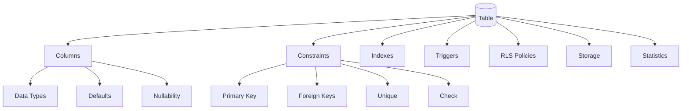

# 05- Inspecting Tables and Columns

## Overview

Inspecting tables and columns is a core PostgreSQL CLI skill for backend engineers. Before changing a query, adding an index, modifying a migration, or debugging production data, you need to understand the actual structure of the table.

A table inspection should answer:

```text
What is the table?
        ↓
Which columns exist?
        ↓
What are their data types?
        ↓
Which columns are nullable?
        ↓
What are their defaults?
        ↓
Which columns form keys?
        ↓
What constraints exist?
        ↓
Which indexes exist?
        ↓
Are there triggers, partitions, or generated values?
        ↓
Who owns and can modify the object?
```

The primary `psql` command is:

```text
\d table_name
```

For deeper information:

```text
\d+ table_name
```

SQL metadata can also be queried through:

```text
information_schema
pg_catalog
```

The important production principle is:

> Inspect the actual PostgreSQL schema rather than assuming that ORM models, migration files, or application code perfectly represent the current database state.

---

## Table Inspection Architecture

A PostgreSQL table is more than a collection of columns.



When investigating a table, inspect these related objects rather than looking only at the column list.

---

## The `\d` Command

The most important interactive command is:

```text
\d app.orders
```

It typically shows:

- Column names
- Data types
- Nullability
- Default expressions
- Constraints
- Indexes
- Related table information

Example:

```text
\d app.orders
```

Conceptually, the output may look like:

```text
                Table "app.orders"
   Column    |           Type           | Nullable | Default
-------------+--------------------------+----------+------------------------
 id          | bigint                   | not null | generated by default...
 customer_id | bigint                   | not null |
 status      | text                     | not null |
 total       | numeric(12,2)             | not null |
 created_at  | timestamp with time zone | not null | now()

Indexes:
    "orders_pkey" PRIMARY KEY, btree (id)

Foreign-key constraints:
    "orders_customer_id_fkey" FOREIGN KEY (customer_id)
        REFERENCES app.customers(id)
```

The exact formatting varies by PostgreSQL version and object definition.

---

## The `\d+` Command

Use:

```text
\d+ app.orders
```

when deeper information is useful.

It can expose additional information such as:

- Storage details
- Access method
- Persistence
- Table description
- Partition information
- Storage-related metadata

Use `\d` for quick inspection and `\d+` when investigating operational details.

---

## Listing Tables

List tables visible through the current `search_path`:

```text
\dt
```

List tables across schemas:

```text
\dt *.*
```

List tables in a specific schema:

```text
\dt app.*
```

This distinction matters because:

```text
\dt
```

does not necessarily mean:

```text
every table in the database
```

For a broad inventory, explicitly specify the schema pattern.

---

## Finding a Table

If you know only part of the name:

```text
\dt *order*
```

You can also query PostgreSQL metadata:

```sql
SELECT
    table_schema,
    table_name
FROM information_schema.tables
WHERE table_name ILIKE '%order%'
ORDER BY table_schema, table_name;
```

This is useful in unfamiliar databases where naming conventions are inconsistent.

---

## Listing Columns

A SQL-standard way to inspect columns is:

```sql
SELECT
    column_name,
    ordinal_position,
    data_type,
    is_nullable,
    column_default
FROM information_schema.columns
WHERE table_schema = 'app'
  AND table_name = 'orders'
ORDER BY ordinal_position;
```

This is useful for:

- Automation
- Schema inventory
- Migration validation
- Environment comparison
- CI/CD checks

---

## Column Order

`ordinal_position` represents the logical column order.

Example:

```text
id
customer_id
status
total
created_at
updated_at
```

Column order usually has little impact on query performance.

Do not reorder columns merely for aesthetic reasons in production.

Changing a table's physical representation can have operational implications, and application correctness should not depend on column order.

---

## Data Types

Inspecting the data type is critical.

Common PostgreSQL types include:

| Type | Typical backend use |
|---|---|
| `bigint` | Large integer identifiers |
| `integer` | Standard integers |
| `numeric` | Exact decimal values |
| `text` | Variable-length text |
| `varchar` | Length-constrained text |
| `boolean` | True/false state |
| `date` | Calendar dates |
| `timestamp` | Timestamp without timezone |
| `timestamptz` | Timestamp with timezone semantics |
| `uuid` | Globally unique identifiers |
| `jsonb` | Semi-structured JSON |
| `bytea` | Binary data |
| `array` | PostgreSQL arrays |
| `enum` | Controlled finite values |

The correct type should reflect the domain and query requirements.

---

## PostgreSQL Types vs Application Types

An ORM maps application-level types to database types.

For example:

```text
Python
  ↓
Django field / SQLAlchemy type
  ↓
PostgreSQL type
```

A Django field such as:

```python
models.DateTimeField()
```

may map to:

```text
timestamp with time zone
```

depending on the database configuration and backend.

The PostgreSQL schema remains the authoritative runtime representation.

---

## Inspecting PostgreSQL-Specific Types

`information_schema.columns` can be useful, but it may hide PostgreSQL-specific details.

For deeper inspection:

```sql
SELECT
    a.attname AS column_name,
    format_type(a.atttypid, a.atttypmod) AS data_type,
    a.attnotnull AS not_null,
    pg_get_expr(d.adbin, d.adrelid) AS default_expression
FROM pg_attribute AS a
LEFT JOIN pg_attrdef AS d
    ON d.adrelid = a.attrelid
   AND d.adnum = a.attnum
WHERE a.attrelid = 'app.orders'::regclass
  AND a.attnum > 0
  AND NOT a.attisdropped
ORDER BY a.attnum;
```

This provides PostgreSQL-specific type formatting and default expressions.

---

## Nullability

A column can allow or reject `NULL`.

Example:

```text
customer_id bigint NOT NULL
```

versus:

```text
discount numeric
```

where `NULL` may be allowed.

Inspect with:

```sql
SELECT
    column_name,
    is_nullable
FROM information_schema.columns
WHERE table_schema = 'app'
  AND table_name = 'orders'
ORDER BY ordinal_position;
```

Nullability is part of the data model, not merely a storage preference.

---

## `NULL` vs Empty Values

Do not treat these as equivalent:

```text
NULL
''
0
false
```

For example:

```sql
WHERE discount IS NULL
```

is different from:

```sql
WHERE discount = 0
```

A column inspection should therefore lead to an understanding of what `NULL` means for the domain.

---

## Column Defaults

Inspect defaults with:

```sql
SELECT
    column_name,
    column_default
FROM information_schema.columns
WHERE table_schema = 'app'
  AND table_name = 'orders'
ORDER BY ordinal_position;
```

Defaults may contain expressions such as:

```sql
now()
```

or sequence-backed/generated identifier expressions.

Defaults are executed by PostgreSQL when the column is omitted from an `INSERT`.

---

## Defaults Are Not Constraints

Consider:

```sql
created_at timestamptz DEFAULT now()
```

This does not mean:

```text
created_at can never be NULL
```

unless the column is also:

```sql
created_at timestamptz NOT NULL DEFAULT now()
```

Likewise, a default does not validate arbitrary explicitly supplied values.

This distinction matters when reviewing data integrity.

---

## Generated Columns

PostgreSQL supports generated columns.

Inspect them using table description:

```text
\d+ app.orders
```

For deeper metadata:

```sql
SELECT
    a.attname AS column_name,
    a.attgenerated
FROM pg_attribute AS a
WHERE a.attrelid = 'app.orders'::regclass
  AND a.attnum > 0
  AND NOT a.attisdropped;
```

A generated column derives its value from another expression rather than accepting an arbitrary application-provided value.

---

## Identity Columns

Modern PostgreSQL supports identity columns.

Example:

```sql
CREATE TABLE app.orders (
    id bigint GENERATED BY DEFAULT AS IDENTITY PRIMARY KEY
);
```

Inspect with:

```text
\d app.orders
```

Identity columns are preferable to manually managing identifier generation in application code.

The exact identity mode matters:

```text
GENERATED ALWAYS
GENERATED BY DEFAULT
```

They have different rules for explicitly supplied values.

---

## Primary Keys

A primary key identifies the logical row identity.

Inspect:

```text
\d app.orders
```

Example:

```text
"orders_pkey" PRIMARY KEY, btree (id)
```

A primary key provides:

- Uniqueness
- Non-null semantics
- A natural target for foreign keys
- An associated unique index

A table can have only one primary key constraint, although that key can contain multiple columns.

---

## Composite Primary Keys

A composite key may look like:

```sql
PRIMARY KEY (tenant_id, order_id)
```

This can be appropriate when identity is naturally scoped by another attribute.

However, composite keys affect:

```text
Foreign keys
Indexes
ORM mappings
API design
Joins
Pagination
Sharding
```

Do not introduce composite keys merely because they appear theoretically elegant.

---

## Unique Constraints

Inspect with:

```text
\d app.orders
```

or:

```sql
SELECT
    constraint_name,
    constraint_type
FROM information_schema.table_constraints
WHERE table_schema = 'app'
  AND table_name = 'orders';
```

Unique constraints enforce data integrity at the database level.

For example:

```sql
UNIQUE (external_order_id)
```

prevents duplicate external identifiers.

---

## Foreign Keys

Foreign keys establish relationships between tables.

Example:

```text
orders.customer_id
        ↓
customers.id
```

Inspect:

```text
\d app.orders
```

For SQL:

```sql
SELECT
    tc.constraint_name,
    kcu.column_name,
    ccu.table_schema AS referenced_schema,
    ccu.table_name AS referenced_table,
    ccu.column_name AS referenced_column
FROM information_schema.table_constraints AS tc
JOIN information_schema.key_column_usage AS kcu
    ON tc.constraint_name = kcu.constraint_name
   AND tc.table_schema = kcu.table_schema
JOIN information_schema.constraint_column_usage AS ccu
    ON ccu.constraint_name = tc.constraint_name
   AND ccu.table_schema = tc.table_schema
WHERE tc.constraint_type = 'FOREIGN KEY'
  AND tc.table_schema = 'app'
  AND tc.table_name = 'orders';
```

---

## Foreign-Key Actions

A foreign key may define actions such as:

```text
ON DELETE CASCADE
ON DELETE SET NULL
ON DELETE RESTRICT
ON DELETE NO ACTION
```

These actions can have major production consequences.

For example:

```text
DELETE customer
      ↓
CASCADE
      ↓
Delete related orders
```

Never perform destructive operations on a parent table without understanding foreign-key behavior.

---

## Check Constraints

Check constraints enforce domain rules.

Example:

```sql
CHECK (total >= 0)
```

Inspect them through:

```text
\d app.orders
```

or:

```sql
SELECT
    constraint_name,
    check_clause
FROM information_schema.check_constraints
WHERE constraint_schema = 'app';
```

Check constraints are useful because they enforce invariants regardless of whether the write comes from:

```text
Django
FastAPI
psql
Celery
Migration
Another service
```

---

## Inspecting All Constraints

A practical query:

```sql
SELECT
    constraint_name,
    constraint_type
FROM information_schema.table_constraints
WHERE table_schema = 'app'
  AND table_name = 'orders'
ORDER BY constraint_type, constraint_name;
```

For deeper PostgreSQL-specific details:

```sql
SELECT
    conname,
    contype,
    pg_get_constraintdef(oid) AS definition
FROM pg_constraint
WHERE conrelid = 'app.orders'::regclass
ORDER BY conname;
```

---

## Constraint Types in `pg_constraint`

Common `contype` values include:

| Value | Meaning |
|---|---|
| `p` | Primary key |
| `u` | Unique |
| `f` | Foreign key |
| `c` | Check |
| `x` | Exclusion |

The PostgreSQL catalog provides details not always represented directly by `information_schema`.

---

## Indexes

Indexes are separate database objects associated with tables.

Inspect:

```text
\di
```

Or:

```text
\d app.orders
```

SQL:

```sql
SELECT
    indexname,
    indexdef
FROM pg_indexes
WHERE schemaname = 'app'
  AND tablename = 'orders'
ORDER BY indexname;
```

Index inspection should be part of every serious table investigation.

---

## Why Index Inspection Matters

Suppose a query uses:

```sql
WHERE customer_id = $1
ORDER BY created_at DESC
LIMIT 50;
```

You need to know whether an index such as:

```text
(customer_id, created_at DESC)
```

already exists before creating another index.

Unnecessary indexes increase:

```text
Disk usage
INSERT cost
UPDATE cost
DELETE cost
Vacuum work
Backup size
Maintenance overhead
```

---

## Inspecting Index Definitions

The `pg_indexes` view provides index definitions:

```sql
SELECT
    schemaname,
    tablename,
    indexname,
    indexdef
FROM pg_indexes
WHERE schemaname = 'app'
  AND tablename = 'orders';
```

This is preferable to guessing index structure from an index name.

An index named:

```text
orders_customer_idx
```

does not guarantee which columns it actually contains.

---

## Index Access Methods

PostgreSQL supports multiple index access methods.

Common examples:

```text
B-tree
GIN
GiST
BRIN
Hash
```

Inspecting:

```text
\d+ app.orders
```

can help reveal index definitions.

The correct index type depends on the operator and workload rather than personal preference.

---

## Inspecting Table Statistics

A table's operational state can be inspected through:

```sql
SELECT
    relname,
    n_live_tup,
    n_dead_tup,
    last_analyze,
    last_autoanalyze,
    last_vacuum,
    last_autovacuum
FROM pg_stat_user_tables
WHERE relid = 'app.orders'::regclass;
```

These values help investigate:

```text
Statistics freshness
Dead tuples
Vacuum behavior
Analyze activity
```

They are estimates and should not be treated as exact row counts.

---

## Inspecting Table Size

For a table:

```sql
SELECT
    pg_size_pretty(pg_table_size('app.orders')) AS table_size,
    pg_size_pretty(pg_indexes_size('app.orders')) AS indexes_size,
    pg_size_pretty(pg_total_relation_size('app.orders')) AS total_size;
```

This helps determine whether a schema operation affects:

```text
Small table
Large table
Very large production table
```

The operational strategy can differ significantly between these cases.

---

## Inspecting Column Storage Characteristics

PostgreSQL-specific catalog metadata can help with deeper investigations.

For example:

```sql
SELECT
    attname AS column_name,
    attstorage,
    attcompression
FROM pg_attribute
WHERE attrelid = 'app.orders'::regclass
  AND attnum > 0
  AND NOT attisdropped
ORDER BY attnum;
```

These details are generally relevant for advanced storage and performance investigations rather than everyday schema inspection.

---

## TOAST and Large Values

PostgreSQL can use TOAST storage for large variable-length values.

Columns such as:

```text
text
jsonb
bytea
large arrays
```

may require out-of-line storage when values are sufficiently large.

This matters when investigating:

```text
Unexpected table size
Large row behavior
I/O
Storage amplification
Vacuum behavior
```

A table that appears to contain only a modest number of rows can still consume substantial storage because of large values and indexes.

---

## Inspecting Table Access Method

PostgreSQL tables normally use the heap access method.

Inspect:

```sql
SELECT
    relname,
    amname
FROM pg_class AS c
JOIN pg_am AS am
    ON am.oid = c.relam
WHERE c.oid = 'app.orders'::regclass;
```

This becomes useful when understanding PostgreSQL storage internals and specialized relation types.

---

## Partitioned Tables

A logical table may be partitioned:

```text
app.events
    ├── events_2026_01
    ├── events_2026_02
    └── events_2026_03
```

Inspect:

```text
\d+ app.events
```

For deeper catalog inspection:

```sql
SELECT
    parent.relname AS parent_table,
    child.relname AS partition
FROM pg_inherits
JOIN pg_class AS parent
    ON parent.oid = inhparent
JOIN pg_class AS child
    ON child.oid = inhrelid
WHERE parent.oid = 'app.events'::regclass
ORDER BY child.relname;
```

Partition inspection is important because indexes, statistics, storage, and maintenance can exist at partition level.

---

## Triggers

Triggers can execute database-side logic automatically.

Inspect:

```text
\d app.orders
```

Or:

```sql
SELECT
    trigger_name,
    event_manipulation,
    action_timing,
    action_statement
FROM information_schema.triggers
WHERE event_object_schema = 'app'
  AND event_object_table = 'orders'
ORDER BY trigger_name;
```

Before manually updating production data, determine whether triggers may perform:

```text
Audit logging
Derived updates
Validation
Event generation
Other side effects
```

---

## Row-Level Security

A table may have RLS enabled.

Inspect policies:

```sql
SELECT
    schemaname,
    tablename,
    policyname,
    permissive,
    roles,
    cmd,
    qual,
    with_check
FROM pg_policies
WHERE schemaname = 'app'
  AND tablename = 'orders';
```

This matters because two roles can execute the same query and observe different rows.

Table inspection should therefore include security policies when the application uses RLS.

---

## Table Ownership

Ownership influences administrative privileges.

Inspect:

```text
\dt+ app.orders
```

or query PostgreSQL catalogs when more detail is needed.

Ownership is distinct from ordinary grants.

A role may have:

```text
SELECT
```

without owning the table, while the owner has broader object-management authority.

---

## Table Privileges

Inspect privileges:

```text
\dp app.orders
```

Or:

```sql
SELECT
    grantee,
    privilege_type
FROM information_schema.role_table_grants
WHERE table_schema = 'app'
  AND table_name = 'orders'
ORDER BY grantee, privilege_type;
```

When debugging:

```text
permission denied for table orders
```

inspect:

```text
Current role
Role membership
Table privileges
Schema privileges
Ownership
RLS
```

---

## Inspecting a Table's Complete Structure

For a serious investigation:

```text
\dp app.orders
\d+ app.orders
```

Then inspect:

```text
Indexes
Constraints
Triggers
RLS policies
Table size
Statistics
Ownership
```

This produces a much more accurate model than looking only at columns.

---

## Example: Inspecting an Orders Table

Suppose the application has:

```text
customers
orders
order_items
products
```

Start with:

```text
\dt app.*
```

Then:

```text
\d+ app.orders
```

Then inspect indexes:

```sql
SELECT
    indexname,
    indexdef
FROM pg_indexes
WHERE schemaname = 'app'
  AND tablename = 'orders';
```

Then relationships:

```text
\d app.orders
```

Then size:

```sql
SELECT
    pg_size_pretty(pg_total_relation_size('app.orders'));
```

This quickly establishes the table's structural and operational characteristics.

---

## Inspecting an Unfamiliar Table

A reliable workflow is:

```text
1. Identify schema
2. Describe table
3. Inspect columns and types
4. Inspect defaults
5. Inspect primary/unique constraints
6. Inspect foreign keys
7. Inspect check constraints
8. Inspect indexes
9. Inspect triggers
10. Inspect RLS
11. Inspect size and statistics
12. Inspect ownership and privileges
```

This sequence is especially useful during incidents and migrations.

---

## Table Inspection Before a Migration

Before changing a production table:

```text
\d+ app.orders
```

Then inspect:

```text
Current columns
Current indexes
Current constraints
Foreign keys
Triggers
Partitions
Table size
```

Also check whether the table is actively used by long-running transactions or heavy workloads.

The operational risk of a schema change depends on more than the SQL statement itself.

---

## Example: Adding a Column

Suppose you want to add:

```sql
ALTER TABLE app.orders
ADD COLUMN fulfillment_status text;
```

Before doing so, inspect:

```text
Existing schema
Table size
Application compatibility
Existing indexes
Constraints
Deployment order
```

For zero-downtime deployments, application and schema changes are commonly coordinated using an expand-and-contract approach.

For example:

```text
Deploy backward-compatible schema
        ↓
Deploy application that understands both states
        ↓
Backfill if required
        ↓
Add constraints/indexes carefully
        ↓
Remove obsolete structure later
```

---

## Table Inspection Before Adding an Index

Suppose a query is slow:

```sql
SELECT
    id,
    status,
    created_at
FROM app.orders
WHERE customer_id = 42
ORDER BY created_at DESC
LIMIT 50;
```

Before creating an index:

```text
\d app.orders
```

Then:

```sql
SELECT
    indexname,
    indexdef
FROM pg_indexes
WHERE schemaname = 'app'
  AND tablename = 'orders';
```

Then inspect the query plan:

```sql
EXPLAIN (ANALYZE, BUFFERS)
SELECT
    id,
    status,
    created_at
FROM app.orders
WHERE customer_id = 42
ORDER BY created_at DESC
LIMIT 50;
```

Index design should be driven by actual workload and plans.

---

## Table Inspection and ORMs

Django and SQLAlchemy abstract much of the database schema, but they do not eliminate the need for database inspection.

The actual architecture is:

```text
Python application
      ↓
ORM
      ↓
Generated SQL
      ↓
PostgreSQL schema
      ↓
Indexes / constraints / storage
```

An ORM model may tell you what the application expects.

PostgreSQL tells you what actually exists.

This distinction is important during:

```text
Production incidents
Migration failures
Schema drift
Performance investigations
Security reviews
```

---

## Django Example

A Django model might contain:

```python
class Order(models.Model):
    customer = models.ForeignKey(
        "Customer",
        on_delete=models.PROTECT,
    )
    status = models.CharField(max_length=32)
    total = models.DecimalField(max_digits=12, decimal_places=2)
    created_at = models.DateTimeField(auto_now_add=True)
```

The corresponding PostgreSQL implementation can be inspected directly:

```text
\d+ app_order
```

Do not assume the table name, indexes, constraints, or generated SQL solely from the model definition.

Verify the actual database.

---

## FastAPI and SQLAlchemy Example

For SQLAlchemy:

```python
class Order(Base):
    __tablename__ = "orders"

    id = mapped_column(BigInteger, primary_key=True)
    customer_id = mapped_column(BigInteger, nullable=False)
    status = mapped_column(String(32), nullable=False)
```

The PostgreSQL schema should still be inspected independently:

```text
\d+ app.orders
```

Migration tooling such as Alembic defines expected changes, but the database remains the runtime state.

---

## Schema Drift Detection

Schema drift occurs when:

```text
Expected schema
        ≠
Actual schema
```

For example:

```text
Migration says:
customer_id NOT NULL

Production:
customer_id nullable
```

Possible causes include:

- Manual changes
- Failed migrations
- Incomplete deployments
- Environment-specific scripts
- Migration ordering problems

Automated schema inspection can detect these inconsistencies before they become production incidents.

---

## Comparing Column Definitions

A useful environment comparison query:

```sql
SELECT
    table_schema,
    table_name,
    column_name,
    ordinal_position,
    data_type,
    is_nullable,
    column_default
FROM information_schema.columns
WHERE table_schema = 'app'
ORDER BY table_name, ordinal_position;
```

Run against:

```text
Development
Staging
Production
```

and compare the results.

For robust automation, compare normalized metadata rather than raw CLI output.

---

## Security Considerations

Table inspection can expose sensitive structural information:

```text
Customer tables
Payment tables
Credential-related tables
Audit tables
Internal identifiers
Security policies
```

Production access should therefore follow least privilege.

Use a read-only role for routine inspection when possible.

Avoid sharing unrestricted database access merely because an engineer needs to inspect schemas.

---

## Performance Considerations

Most metadata queries are relatively lightweight, but operational inspection can still become expensive if it scans application data.

Prefer:

```text
pg_catalog
information_schema
pg_stat_* views
pg_indexes
pg_size_* functions
```

for structural investigation.

Be cautious with:

```sql
SELECT count(*)
FROM huge_table;
```

or:

```sql
SELECT *
FROM huge_table;
```

when you only need metadata.

---

## Reliability Considerations

Schema inspection should be designed to minimize production impact.

Prefer:

```text
Read-only role
Short sessions
Metadata queries
Explicit LIMIT
No unnecessary data scans
```

During an incident, avoid turning investigation into another production workload.

If a table is under severe load, inspect catalog and statistics information first.

---

## High Availability Considerations

Table metadata can be inspected from replicas, but remember that replicas can lag.

If you are validating:

```text
Recent migration
Recent index creation
Recent schema change
```

verify that the replica has replayed the relevant changes.

For critical validation:

```sql
SELECT
    pg_is_in_recovery();
```

and:

```text
\conninfo
```

should be part of the workflow.

---

## Disaster Recovery Considerations

After restoring a database, table inspection can validate structural recovery.

Check:

```text
Tables
Columns
Constraints
Indexes
Triggers
Partitions
RLS
Functions
Extensions
```

A successful restore operation is not sufficient evidence that the database is operationally equivalent to the expected environment.

---

## Common Mistakes

### Using Only `SELECT *`

`SELECT *` tells you about data values, not the complete schema.

Use:

```text
\d+
information_schema
pg_catalog
```

for structural inspection.

### Assuming ORM Models Are the Database

Models represent application intent.

The actual PostgreSQL schema may differ because of:

```text
Migrations
Manual changes
Legacy objects
Partial deployments
```

### Ignoring Indexes

Column definitions alone do not explain query performance.

Always inspect indexes when investigating query behavior.

### Ignoring Constraints

A foreign key, check constraint, or unique constraint can explain why an apparently valid mutation fails.

### Ignoring Triggers

Triggers can cause additional database-side operations that are not visible in the original SQL statement.

### Ignoring RLS

RLS can make the same query return different results for different roles.

### Assuming Defaults Guarantee Valid Data

A default only applies when a value is omitted. It does not replace `NOT NULL` or other validation constraints.

### Treating Catalog Estimates as Exact

Statistics such as `n_live_tup` are estimates and can become stale.

---

## Production Pitfalls

### Adding an Index Without Inspecting Existing Indexes

This creates redundant indexes and unnecessary write amplification.

### Adding a Constraint Without Understanding Existing Data

Existing rows may violate the proposed invariant.

Validate first.

### Changing a Large Table Without Checking Size

A migration that is trivial for a small table may have substantial locking or I/O consequences on a large production table.

### Inspecting Only the Primary

A read replica may have different replay state. Always identify the target server when recent schema changes matter.

### Assuming Table Names From ORM Models

Framework naming conventions can produce different physical names than expected.

Verify with:

```text
\dt *.*
```

### Forgetting Schema Qualification

Prefer:

```sql
app.orders
```

over:

```sql
orders
```

when the schema matters.

---

## Practical Inspection Checklist

### Connection

- [ ] Verify host with `\conninfo`.
- [ ] Verify database.
- [ ] Verify current role.
- [ ] Verify primary/replica status when relevant.

### Table

- [ ] Confirm schema.
- [ ] Run `\d+ table`.
- [ ] Check table size.
- [ ] Check partitions.

### Columns

- [ ] Check names.
- [ ] Check types.
- [ ] Check nullability.
- [ ] Check defaults.
- [ ] Check generated/identity behavior.

### Integrity

- [ ] Check primary key.
- [ ] Check unique constraints.
- [ ] Check foreign keys.
- [ ] Check check constraints.

### Performance

- [ ] Check indexes.
- [ ] Check table statistics.
- [ ] Check query plans for workload-related investigations.

### Security

- [ ] Check ownership.
- [ ] Check privileges.
- [ ] Check RLS policies.
- [ ] Check security-sensitive triggers/functions when relevant.

---

## Interview Traps

### What does `\d table` do?

It displays the structure of a database object, including columns and relevant constraints/index information.

### What is the difference between `\d` and `\d+`?

`\d` provides a standard object description, while `\d+` provides additional details such as storage-related information.

### How do you list all tables?

Use:

```text
\dt *.*
```

for a broad schema-qualified table listing.

### How do you inspect columns programmatically?

Use `information_schema.columns` for standard metadata or PostgreSQL catalogs for deeper PostgreSQL-specific information.

### Why inspect indexes before optimizing a query?

Because an appropriate index may already exist, and adding unnecessary indexes increases storage and write overhead.

### Why inspect constraints before modifying a table?

Constraints define database-enforced invariants and relationships that directly affect valid writes and migrations.

### Why can the same table return different rows to different users?

Row-Level Security policies can filter rows according to the effective database role and policy context.

### Why is the ORM not sufficient for schema inspection?

The ORM represents application-level intent, while PostgreSQL contains the actual runtime schema and may contain drift, legacy objects, manual changes, or database-side behavior.

---

## Key Takeaways

- **Use `\d` and `\d+` as the first inspection tools:** they quickly reveal the actual table structure, columns, constraints, indexes, and additional PostgreSQL metadata.
- **Inspect more than columns:** primary keys, foreign keys, unique/check constraints, indexes, triggers, partitions, RLS policies, ownership, and statistics all affect production behavior.
- **Use `information_schema` for standard metadata and `pg_catalog` for PostgreSQL-specific depth:** this distinction is important for automation, diagnostics, and advanced database investigations.
- **Treat the database as the runtime source of truth:** compare PostgreSQL's actual schema with Django/FastAPI models, migration history, and deployment expectations to detect schema drift.
- **Inspect before changing production tables:** understand size, indexes, constraints, dependencies, security policies, and workload characteristics before running migrations or performance-related changes.