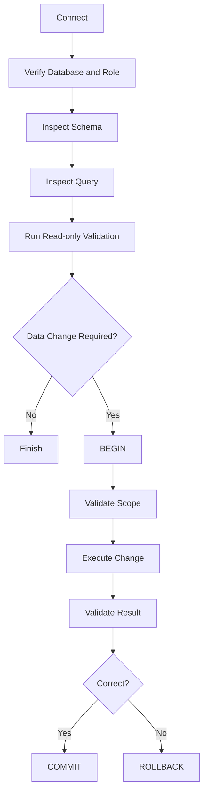
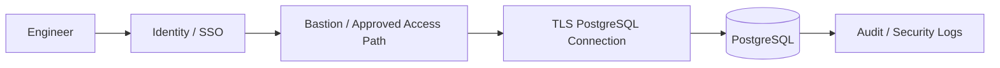

# 06- Running SQL Queries from CLI

## Overview

Running SQL directly from the CLI is one of the most useful PostgreSQL skills for backend engineers. It provides a direct path to the database without ORM abstractions, application code, or GUI tooling.

The primary PostgreSQL CLI client is `psql`. It can execute:

- Interactive SQL queries
- Single commands from the shell
- SQL files
- Transactions
- Administrative queries
- Diagnostic queries
- Schema inspection commands
- Automation scripts

A typical production investigation looks like:

```text
Terminal
   ↓
psql
   ↓
PostgreSQL wire protocol
   ↓
Authentication
   ↓
Database session
   ↓
SQL parsing/planning/execution
   ↓
Result / error
```

The important distinction is between **SQL commands** and **psql meta-commands**:

```text
SQL:
SELECT * FROM app.orders;

psql:
\d app.orders
\dt
\conninfo
```

SQL is sent to PostgreSQL. Meta-commands are interpreted locally by `psql`.

---

## Why Run SQL from the CLI?

CLI access is valuable because it gives backend engineers a low-level operational interface to PostgreSQL.

Common uses include:

| Use case | Example |
|---|---|
| Debugging | Inspect a problematic row |
| Performance | Run `EXPLAIN (ANALYZE, BUFFERS)` |
| Schema inspection | `\d+ app.orders` |
| Data validation | Check constraints or unexpected values |
| Transactions | Reproduce locking behavior |
| Administration | Inspect roles, databases, extensions |
| Incident response | Inspect active sessions |
| Automation | Execute SQL files in CI/CD |
| Migration validation | Verify post-migration state |
| Production diagnostics | Inspect database statistics |

CLI access is particularly useful when an application is unhealthy but the database itself remains reachable.

---

## Connecting with `psql`

Basic connection:

```bash
psql -h localhost -U app_user -d application
```

Common parameters:

```text
-h    PostgreSQL host
-p    PostgreSQL port
-U    PostgreSQL role
-d    Database name
```

For example:

```bash
psql \
  -h db.internal.example.com \
  -p 5432 \
  -U app_runtime \
  -d application
```

Avoid putting passwords directly into shell commands because command history and process inspection can expose them.

---

## Connection URI

PostgreSQL supports connection URIs:

```bash
psql "postgresql://app_runtime@db.internal.example.com:5432/application"
```

For production environments, credentials should normally be injected through an approved secret-management mechanism rather than embedded in shell history or scripts.

---

## Environment Variables

PostgreSQL client tools recognize environment variables such as:

```bash
export PGHOST=db.internal.example.com
export PGPORT=5432
export PGDATABASE=application
export PGUSER=app_runtime
```

Then:

```bash
psql
```

This is convenient for:

```text
Containers
CI/CD
Local development
Operational scripts
```

Do not treat environment variables as inherently secure. Process environments, CI logs, crash dumps, and debugging tools can expose them.

---

## Interactive `psql` Session

Start:

```bash
psql -h localhost -U app_runtime -d application
```

You will receive a prompt similar to:

```text
application=>
```

You can now execute SQL:

```sql
SELECT current_database();
```

The result is returned directly by PostgreSQL.

Exit with:

```text
\q
```

---

## SQL Statements vs `psql` Meta-Commands

This distinction is fundamental.

### SQL

```sql
SELECT current_user;
```

```sql
SELECT id, status
FROM app.orders
WHERE status = 'pending';
```

These statements are sent to PostgreSQL.

### Meta-Commands

```text
\dt
```

```text
\d+ app.orders
```

```text
\conninfo
```

These are interpreted by `psql`.

A common mistake is assuming that every command beginning with `\` is SQL.

---

## Running a Simple Query

Example:

```sql
SELECT
    id,
    customer_id,
    status,
    total
FROM app.orders
WHERE status = 'pending'
ORDER BY created_at DESC
LIMIT 20;
```

This is useful for operational inspection, but avoid retrieving unnecessary data from large production tables.

Prefer:

```sql
SELECT
    id,
    status,
    created_at
FROM app.orders
WHERE customer_id = $1
LIMIT 20;
```

when the query is executed through an application driver.

---

## Shell Execution with `-c`

You can execute SQL without entering interactive mode:

```bash
psql \
  -h localhost \
  -U app_runtime \
  -d application \
  -c "SELECT current_database(), current_user;"
```

This is useful for:

```text
Shell scripts
CI/CD
Containers
Health checks
Automation
```

For complex SQL, prefer a SQL file instead of a large shell-quoted string.

---

## Executing SQL Files

Create:

```text
diagnostics.sql
```

Example:

```sql
SELECT
    current_database(),
    current_user,
    pg_is_in_recovery();

SELECT
    count(*)
FROM app.orders;
```

Execute:

```bash
psql \
  -h localhost \
  -U app_runtime \
  -d application \
  -f diagnostics.sql
```

This is more maintainable than embedding large SQL statements inside shell scripts.

---

## Standard Input

SQL can also be piped into `psql`:

```bash
cat diagnostics.sql | psql \
  -h localhost \
  -U app_runtime \
  -d application
```

Or:

```bash
printf 'SELECT current_database();\n' | psql
```

For maintainability, a version-controlled SQL file is usually preferable.

---

## Executing Commands from Shell Scripts

A production-oriented shell script should fail when SQL fails.

Use:

```bash
psql \
  -v ON_ERROR_STOP=1 \
  -h "$PGHOST" \
  -U "$PGUSER" \
  -d "$PGDATABASE" \
  -f migration-check.sql
```

`ON_ERROR_STOP` is important in automation.

Without it, a script can potentially continue after a SQL error, producing misleading success behavior.

---

## `ON_ERROR_STOP`

Enable:

```text
-v ON_ERROR_STOP=1
```

Example:

```bash
psql \
  -v ON_ERROR_STOP=1 \
  -h "$PGHOST" \
  -U "$PGUSER" \
  -d "$PGDATABASE" \
  -f deploy.sql
```

This is especially important for:

```text
CI/CD
Migration validation
Deployment scripts
Operational automation
```

A reliable automation pipeline should distinguish:

```text
SQL succeeded
```

from:

```text
SQL failed
```

---

## Multiple SQL Statements

A file can contain multiple statements:

```sql
SELECT current_user;

SELECT current_database();

SELECT version();
```

Each statement is executed sequentially.

For transactional changes, explicitly use:

```sql
BEGIN;

UPDATE app.orders
SET status = 'cancelled'
WHERE id = 1001;

COMMIT;
```

---

## Transactions from CLI

A transaction allows multiple statements to succeed or fail as a unit.

Example:

```sql
BEGIN;

UPDATE app.accounts
SET balance = balance - 100
WHERE id = 1;

UPDATE app.accounts
SET balance = balance + 100
WHERE id = 2;

COMMIT;
```

If something fails:

```sql
ROLLBACK;
```

The key production rule is:

> Do not execute multi-step data modifications interactively without understanding the transaction boundary.

---

## Transaction Failure State

After a statement fails inside a PostgreSQL transaction, the transaction normally enters an aborted state.

For example:

```sql
BEGIN;

SELECT 1 / 0;

SELECT 2;
```

The second statement will not execute successfully until the transaction is ended with:

```sql
ROLLBACK;
```

This behavior prevents applications from continuing to operate on a failed transactional state.

---

## Transaction Verification

Before committing a high-impact manual change:

```sql
SELECT count(*)
FROM app.orders
WHERE status = 'pending';
```

Then perform the change inside a transaction:

```sql
BEGIN;

UPDATE app.orders
SET status = 'cancelled'
WHERE status = 'pending'
  AND created_at < now() - interval '30 days';

SELECT count(*)
FROM app.orders
WHERE status = 'cancelled'
  AND created_at < now() - interval '30 days';

ROLLBACK;
```

This allows validation without committing the change.

For production operations, be careful: even a rolled-back operation can consume resources and acquire locks while it runs.

---

## Safe Production Query Workflow

A useful workflow is:



Do not start with:

```sql
DELETE ...
```

or:

```sql
UPDATE ...
```

when the scope has not been independently validated.

---

## `SELECT` for Production Diagnostics

Prefer narrow projections:

```sql
SELECT
    id,
    status,
    created_at
FROM app.orders
WHERE customer_id = 42
ORDER BY created_at DESC
LIMIT 20;
```

Avoid:

```sql
SELECT *
FROM app.orders;
```

on a large production table.

Narrow projections reduce:

- Network transfer
- Client memory usage
- Output volume
- Accidental exposure of sensitive columns

---

## Limiting Result Sets

Always consider:

```sql
LIMIT 100;
```

when exploring production data.

For example:

```sql
SELECT
    id,
    status,
    created_at
FROM app.orders
ORDER BY created_at DESC
LIMIT 100;
```

A limit protects the client from accidentally rendering millions of rows, but it does **not** necessarily mean PostgreSQL will avoid scanning a large amount of data.

Query structure and indexes still matter.

---

## Ordering Results

If order matters, specify it:

```sql
SELECT
    id,
    created_at
FROM app.orders
ORDER BY created_at DESC
LIMIT 50;
```

Without `ORDER BY`, SQL does not guarantee a deterministic result order.

Do not assume:

```text
Physical insertion order
Primary-key order
Index order
```

will define the returned order.

---

## Pagination from CLI

Offset pagination:

```sql
SELECT
    id,
    created_at
FROM app.orders
ORDER BY created_at DESC
LIMIT 50
OFFSET 5000;
```

For large datasets, keyset pagination can be more efficient:

```sql
SELECT
    id,
    created_at
FROM app.orders
WHERE created_at < '2026-09-04T12:00:00+00:00'
ORDER BY created_at DESC
LIMIT 50;
```

The appropriate index should support the access pattern.

---

## Parameterization and CLI

Interactive `psql` is often used for manually constructed queries, but application code should not construct SQL by string interpolation.

Unsafe:

```python
query = f"SELECT * FROM orders WHERE id = {order_id}"
```

Use parameter binding through the database driver or ORM instead.

For `psql` scripts, variables can be used carefully:

```bash
psql \
  -v order_id=1001 \
  -f inspect-order.sql
```

Inside the SQL file:

```sql
SELECT
    id,
    status,
    created_at
FROM app.orders
WHERE id = :order_id;
```

`psql` variable substitution is distinct from PostgreSQL's server-side parameter binding, so do not confuse the two.

---

## `psql` Variables

You can define a variable interactively:

```text
\set order_id 1001
```

Then:

```sql
SELECT
    id,
    status,
    created_at
FROM app.orders
WHERE id = :order_id;
```

This is useful for:

```text
Repeated diagnostics
Operational scripts
Parameterized SQL templates
```

Be careful when substituting SQL fragments rather than simple values. SQL identifiers and syntax require different handling from ordinary scalar values.

---

## Formatting Query Results

`psql` provides several output modes.

Expanded display:

```text
\x
```

Then:

```sql
SELECT *
FROM app.orders
WHERE id = 1001;
```

This is useful when tables have many columns.

Turn expanded mode off:

```text
\x
```

---

## Timing Queries

Enable timing:

```text
\timing
```

Then execute:

```sql
SELECT count(*)
FROM app.orders;
```

`psql` displays execution timing.

This is useful for quick investigation, but it should not replace proper query analysis.

For deeper analysis:

```sql
EXPLAIN (ANALYZE, BUFFERS)
...
```

---

## Query Performance with `EXPLAIN`

Basic:

```sql
EXPLAIN
SELECT
    id,
    status
FROM app.orders
WHERE customer_id = 42;
```

This shows the planned execution strategy without actually executing the query.

For actual execution:

```sql
EXPLAIN (ANALYZE, BUFFERS)
SELECT
    id,
    status
FROM app.orders
WHERE customer_id = 42;
```

This provides:

- Actual execution timing
- Actual row counts
- Buffer activity
- Execution loops
- Planner estimates

Use `ANALYZE` carefully on production queries because the query actually executes.

---

## Inspecting Active Sessions

A common production diagnostic query:

```sql
SELECT
    pid,
    usename,
    application_name,
    client_addr,
    state,
    wait_event_type,
    wait_event,
    query_start,
    query
FROM pg_stat_activity
WHERE datname = current_database()
ORDER BY query_start;
```

This helps identify:

```text
Long-running queries
Idle sessions
Waiting sessions
Blocked sessions
Application sources
```

---

## Inspecting Locks

Use:

```sql
SELECT
    pid,
    locktype,
    mode,
    granted,
    relation::regclass AS relation
FROM pg_locks
WHERE relation IS NOT NULL
ORDER BY relation::regclass::text, pid;
```

For blocking relationships:

```sql
SELECT
    pid,
    pg_blocking_pids(pid) AS blocking_pids,
    wait_event_type,
    wait_event,
    query
FROM pg_stat_activity
WHERE cardinality(pg_blocking_pids(pid)) > 0;
```

This is particularly useful during:

```text
Migration incidents
Deadlocks
Lock contention
Slow writes
Connection pileups
```

---

## Inspecting Database Identity

Always verify where you are connected before running a destructive query:

```sql
SELECT
    current_database(),
    current_user,
    session_user,
    inet_server_addr(),
    inet_server_port(),
    pg_is_in_recovery();
```

This helps detect mistakes such as:

```text
Connected to production instead of staging
Connected to a replica instead of primary
Using the wrong role
Using the wrong database
```

---

## Checking the Connection

The `psql` command:

```text
\conninfo
```

shows connection information.

This should become habitual before production operations.

A simple database check:

```sql
SELECT 1;
```

confirms that the session can execute SQL, but it does not validate application-level health.

---

## Read-Only Production Access

Routine production investigation should preferably use a read-only role.

For example:

```text
app_readonly
```

can be granted appropriate `SELECT` privileges without receiving write permissions.

This reduces the blast radius of:

```text
Human error
Credential compromise
Incorrect scripts
Accidental updates/deletes
```

Read-only access is a security control, not merely a convenience.

---

## Running SQL in Docker

If PostgreSQL is running inside Docker:

```bash
docker exec -it postgres \
  psql -U app_runtime -d application
```

For a non-interactive command:

```bash
docker exec postgres \
  psql -U app_runtime -d application \
  -c "SELECT current_database();"
```

The exact container name and authentication configuration depend on the deployment.

---

## Running SQL in Kubernetes

For a PostgreSQL pod:

```bash
kubectl exec -it postgres-0 -- \
  psql -U app_runtime -d application
```

For a diagnostic query:

```bash
kubectl exec postgres-0 -- \
  psql -U app_runtime -d application \
  -c "SELECT pg_is_in_recovery();"
```

In managed PostgreSQL environments, such as AWS RDS, you generally connect over the network rather than executing `psql` inside the database host.

---

## CI/CD Usage

SQL execution is common in deployment pipelines.

Example:

```bash
psql \
  -v ON_ERROR_STOP=1 \
  "$DATABASE_URL" \
  -f verify-schema.sql
```

A validation file might contain:

```sql
DO $$
BEGIN
    IF NOT EXISTS (
        SELECT 1
        FROM information_schema.columns
        WHERE table_schema = 'app'
          AND table_name = 'orders'
          AND column_name = 'fulfillment_status'
    ) THEN
        RAISE EXCEPTION 'Required column is missing';
    END IF;
END;
$$;
```

This turns database assumptions into explicit deployment checks.

---

## Running Migrations from CLI

Frameworks typically provide their own migration commands.

For Django:

```bash
python manage.py migrate
```

For Alembic:

```bash
alembic upgrade head
```

These are usually preferable to manually reproducing application migrations with ad-hoc SQL.

Direct `psql` is most appropriate when:

```text
Inspecting
Validating
Diagnosing
Executing controlled operational SQL
```

rather than bypassing migration ownership.

---

## SQL Files in Git

Operational SQL should be version controlled when it is reusable or business-critical.

Example:

```text
sql/
├── diagnostics/
│   ├── active_queries.sql
│   ├── blocking_sessions.sql
│   └── table_sizes.sql
├── maintenance/
│   └── archive_orders.sql
└── validation/
    └── verify_schema.sql
```

Benefits include:

- Code review
- Reproducibility
- Auditability
- Version history
- Consistent execution

Avoid storing production passwords or other secrets in these files.

---

## Output Formats

`psql` supports several useful output modes.

Common commands include:

```text
\x
\a
\t
\pset format csv
```

For example:

```text
\pset format csv
```

can make output easier to consume programmatically.

You can also redirect output:

```bash
psql \
  -d application \
  -c "SELECT id, status FROM app.orders LIMIT 100" \
  > orders.txt
```

Be careful when exporting production data because CLI output can contain sensitive information.

---

## CSV Export with `\copy`

For client-side exports:

```text
\copy (
    SELECT
        id,
        status,
        created_at
    FROM app.orders
    WHERE created_at >= current_date - interval '1 day'
) TO 'orders.csv' WITH (FORMAT csv, HEADER true)
```

`\copy` operates through the client, so the destination file is created on the machine running `psql`.

This differs from server-side:

```sql
COPY
```

which operates from the PostgreSQL server's perspective.

---

## Monitoring Query Duration

For a quick session-level timing measurement:

```text
\timing on
```

For workload-level monitoring, PostgreSQL statistics such as `pg_stat_statements` are more useful.

A senior engineer should distinguish:

```text
One query observed manually
```

from:

```text
Aggregate query behavior across production traffic
```

---

## Query Logging

For deeper operational analysis, database logs can provide:

```text
Errors
Slow queries
Connections
Disconnections
DDL
Other configured events
```

CLI execution can therefore be correlated with PostgreSQL logs using:

```text
Timestamp
Database
Role
Application name
PID
Request or incident context
```

Avoid logging sensitive query parameters unnecessarily.

---

## Setting `application_name`

A useful connection setting is:

```text
application_name
```

For example:

```bash
psql \
  "postgresql://app_runtime@db.internal/application?application_name=manual-diagnostics"
```

Then `pg_stat_activity` can identify the session:

```sql
SELECT
    pid,
    usename,
    application_name,
    state,
    query
FROM pg_stat_activity
WHERE application_name = 'manual-diagnostics';
```

This is useful during production debugging and incident response.

---

## Query Cancellation

A long-running query can sometimes be cancelled without terminating the entire database session.

From SQL:

```sql
SELECT pg_cancel_backend(12345);
```

Terminating the backend is stronger:

```sql
SELECT pg_terminate_backend(12345);
```

These operations require appropriate privileges.

Prefer cancellation when the goal is simply to stop a running query.

Termination should be treated as a higher-impact operational action because it disconnects the session and can cause transactional rollback.

---

## Query Timeouts

For a controlled session:

```sql
SET statement_timeout = '30s';
```

For lock acquisition:

```sql
SET lock_timeout = '5s';
```

These controls are particularly useful for manual production operations.

For example:

```sql
BEGIN;

SET LOCAL statement_timeout = '30s';
SET LOCAL lock_timeout = '5s';

UPDATE app.orders
SET status = 'cancelled'
WHERE id = 1001;

COMMIT;
```

Using `SET LOCAL` limits the settings to the current transaction.

---

## Manual Data Changes

Manual writes should be treated as production code.

Before:

```sql
UPDATE app.orders
SET status = 'cancelled'
WHERE customer_id = 42;
```

first validate:

```sql
SELECT
    id,
    customer_id,
    status
FROM app.orders
WHERE customer_id = 42;
```

Then consider the expected affected row count:

```sql
SELECT count(*)
FROM app.orders
WHERE customer_id = 42;
```

Then perform the update inside a transaction when appropriate.

---

## Guarding Updates and Deletes

Avoid:

```sql
DELETE FROM app.orders;
```

unless a complete-table deletion is explicitly intended and operationally approved.

Prefer precise predicates:

```sql
DELETE FROM app.orders
WHERE id = 1001;
```

For high-risk operations, validate the same predicate first:

```sql
SELECT count(*)
FROM app.orders
WHERE id = 1001;
```

Then execute the modification.

---

## `RETURNING`

PostgreSQL supports `RETURNING` for DML.

Example:

```sql
UPDATE app.orders
SET status = 'cancelled'
WHERE id = 1001
RETURNING id, status, updated_at;
```

This is useful because the database can return the affected row without requiring a separate query.

It can reduce round trips and make manual operations easier to validate.

---

## Atomic SQL Operations

Prefer database-side atomic expressions when possible.

Instead of:

```text
SELECT balance
        ↓
calculate in application
        ↓
UPDATE balance
```

use:

```sql
UPDATE app.accounts
SET balance = balance - 100
WHERE id = 1
  AND balance >= 100
RETURNING balance;
```

This avoids a race between reading and updating the value.

CLI experimentation is a good way to understand these concurrency patterns directly.

---

## Working with JSONB

PostgreSQL JSONB can be queried directly from `psql`.

Example:

```sql
SELECT
    id,
    metadata->>'source' AS source
FROM app.orders
WHERE metadata->>'source' = 'partner';
```

Inspecting JSON queries from the CLI is useful when debugging application behavior involving:

```text
Django JSONField
SQLAlchemy JSONB
Event payloads
Metadata
Flexible attributes
```

---

## Working with Arrays

Example:

```sql
SELECT
    id,
    tags
FROM app.products
WHERE 'python' = ANY(tags);
```

The appropriate index depends on the query pattern and array operator.

CLI inspection combined with:

```sql
EXPLAIN (ANALYZE, BUFFERS)
```

is the correct way to investigate performance.

---

## Working with Dates and Time Zones

Prefer explicit timestamp semantics.

Example:

```sql
SELECT
    id,
    created_at
FROM app.orders
WHERE created_at >= now() - interval '24 hours';
```

Inspect the session timezone:

```sql
SHOW timezone;
```

Do not assume the CLI session's timezone matches:

```text
Application timezone
Database server timezone
User timezone
```

For production diagnostics, understand the timestamp type and timezone configuration before interpreting results.

---

## CLI and Connection Pooling

A `psql` session normally represents one PostgreSQL client connection.

Application architecture may instead use:

```text
Django
    ↓
Connection reuse / pooling
    ↓
PostgreSQL

FastAPI
    ↓
SQLAlchemy pool
    ↓
PostgreSQL
```

Therefore, a CLI session may behave differently from application traffic with respect to:

```text
Connection lifetime
Session state
Prepared statements
Transactions
Pool exhaustion
Application name
Role
Timeouts
```

Do not assume behavior observed in a single `psql` session automatically represents pooled application behavior.

---

## CLI vs ORM

| Operation | CLI | ORM |
|---|---|---|
| Schema inspection | Excellent | Limited |
| Ad-hoc diagnostics | Excellent | Awkward |
| Production investigation | Excellent with controls | Often indirect |
| Application business logic | Poor fit | Excellent |
| Migrations | Possible | Preferred through migration tooling |
| Query plans | Excellent | Usually indirect |
| Database administration | Strong | Not intended |
| Reusable application queries | Not appropriate | Preferred |

Use the right abstraction for the task.

---

## Security Considerations

CLI database access is privileged operational access.

Protect:

```text
Credentials
Connection strings
Shell history
SQL files
CSV exports
Terminal recordings
CI logs
```

Use:

- Least-privileged roles
- Read-only access for routine inspection
- TLS for remote connections
- Approved bastions or private networking
- Centralized audit logging
- Short-lived credentials where possible
- MFA/identity controls around access to production infrastructure

Never assume that hiding the database behind a private subnet is sufficient security.

---

## Production Access Architecture

A common AWS-oriented model is:



In Kubernetes, access may instead go through:

```text
Engineer
   ↓
Identity / Kubernetes RBAC
   ↓
Controlled cluster access
   ↓
PostgreSQL endpoint
```

The exact architecture depends on the organization's security model.

---

## High Availability Considerations

Before running a write:

```sql
SELECT pg_is_in_recovery();
```

If it returns:

```text
true
```

the server is operating as a recovery/standby instance.

For a critical operation, also verify:

```text
\conninfo
current_user
current_database()
```

Do not rely solely on hostnames such as:

```text
db-primary
db-prod
database
```

because connection routing can change during failover.

---

## Disaster Recovery Considerations

CLI access is often valuable during recovery operations.

After restoring a database, verify:

```sql
SELECT
    current_database(),
    current_user,
    pg_is_in_recovery();
```

Then inspect:

```text
Schemas
Tables
Columns
Constraints
Indexes
Extensions
Roles
RLS policies
Application-critical data
```

A successful database process startup does not prove that the restored environment is application-ready.

---

## Performance and Scalability

The CLI itself is not normally the scalability bottleneck.

The risk comes from the SQL being executed.

Avoid manually running expensive operations such as:

```sql
SELECT *
FROM huge_table;
```

or:

```sql
SELECT count(*)
FROM huge_table;
```

during peak production traffic without understanding the workload.

For large systems, consider:

```text
Indexes
Partition pruning
Query plans
Replica usage
Read replicas
OLAP systems
Materialized views
Aggregations
Sampling
```

Use a read replica for safe analytical inspection when replica freshness is acceptable.

---

## Cost Considerations

Manual CLI queries can create indirect infrastructure costs through:

- CPU
- Memory
- Storage I/O
- Network transfer
- Replica lag
- Additional database capacity
- Log volume

A diagnostic query that runs once may be harmless, while the same query embedded into an application endpoint can become a major production cost driver.

---

## Common Mistakes and Pitfalls

### Running Queries Against the Wrong Database

Always check:

```text
\conninfo
```

and:

```sql
SELECT current_database(), current_user, pg_is_in_recovery();
```

before high-impact operations.

### Using `SELECT *`

It exposes unnecessary columns and can generate excessive output.

Prefer explicit columns.

### Forgetting `ORDER BY`

Result order is not guaranteed without it.

### Using `LIMIT` as a Performance Guarantee

`LIMIT` restricts returned rows but does not guarantee a cheap execution plan.

### Running `EXPLAIN ANALYZE` Carelessly

`ANALYZE` executes the query.

Do not use it blindly on destructive statements.

### Forgetting Transactions

Manual multi-step modifications can leave partially completed work if transaction boundaries are not explicit.

### Running DDL Without Understanding Locks

Operations such as `ALTER TABLE` can acquire locks that affect production traffic.

### Ignoring Read Replicas

A replica may be stale or reject writes.

Always know which server you are connected to.

### Hard-Coding Production Credentials

Never commit:

```text
Passwords
Connection strings
Access tokens
Private keys
```

into SQL scripts or repositories.

### Using String Interpolation in Application SQL

Manual CLI experimentation is not a justification for unsafe SQL construction in Python applications.

### Forgetting `ON_ERROR_STOP`

Automation can continue after a SQL failure if errors are not configured to stop execution.

### Exporting Sensitive Data

Commands such as:

```text
\copy
```

can create local files containing production data.

Treat those files as sensitive artifacts.

---

## Practical Production Workflow

When investigating a production database:

```text
1. Establish approved access.
2. Connect using the least-privileged role.
3. Run \conninfo.
4. Verify database, role, and server state.
5. Inspect the relevant schema.
6. Run narrow read-only queries.
7. Check query plans when performance is involved.
8. Inspect locks and active sessions when concurrency is involved.
9. Set appropriate timeouts for manual operations.
10. Use explicit transactions for controlled writes.
11. Validate affected rows before committing.
12. Record the operational action through approved audit mechanisms.
```

The objective is not merely to make the SQL execute.

The objective is to make the operation:

```text
Correct
Safe
Observable
Reproducible
Reversible where possible
```

---

## Recommended CLI Command Reference

| Command | Purpose |
|---|---|
| `psql` | Start interactive client |
| `psql -c` | Execute one or more SQL commands |
| `psql -f file.sql` | Execute SQL file |
| `\q` | Exit |
| `\conninfo` | Show connection information |
| `\dt` | List tables |
| `\d table` | Describe table |
| `\d+ table` | Detailed table description |
| `\di` | List indexes |
| `\du` | List roles |
| `\dp` | Display privileges |
| `\dn` | List schemas |
| `\dx` | List extensions |
| `\timing` | Toggle query timing |
| `\x` | Toggle expanded display |
| `\copy` | Client-side copy/export |
| `\set` | Set psql variable |

---

## Recommended Diagnostic SQL

A compact production diagnostic set:

```sql
SELECT
    current_database(),
    current_user,
    session_user,
    inet_server_addr(),
    inet_server_port(),
    pg_is_in_recovery();
```

Active sessions:

```sql
SELECT
    pid,
    usename,
    application_name,
    client_addr,
    state,
    wait_event_type,
    wait_event,
    query_start,
    query
FROM pg_stat_activity
WHERE datname = current_database()
ORDER BY query_start;
```

Blocking sessions:

```sql
SELECT
    pid,
    pg_blocking_pids(pid) AS blocking_pids,
    wait_event_type,
    wait_event,
    query
FROM pg_stat_activity
WHERE cardinality(pg_blocking_pids(pid)) > 0;
```

Table size:

```sql
SELECT
    pg_size_pretty(pg_table_size('app.orders')) AS table_size,
    pg_size_pretty(pg_indexes_size('app.orders')) AS indexes_size,
    pg_size_pretty(pg_total_relation_size('app.orders')) AS total_size;
```

These queries provide a useful starting point for many production investigations.

---

## Senior Engineering Perspective

Running SQL from the CLI is not primarily about memorizing `psql` commands.

The senior-level skill is understanding the consequences of executing SQL against a live system.

Before running a query, consider:

```text
Which database?
Which server?
Which role?
Which transaction?
Which locks?
How many rows?
Which indexes?
How much I/O?
What happens under concurrency?
Can the operation be rolled back?
Could it affect replicas?
Could it expose sensitive data?
How will the operation be audited?
```

A good database engineer thinks about the query and the system around the query simultaneously.

The CLI is simply the direct interface that makes those database behaviors visible.

---

## Key Takeaways

- **Use `psql` as a direct PostgreSQL diagnostic and operational interface:** distinguish SQL statements from `psql` meta-commands and use SQL files for repeatable operations.
- **Verify context before touching production:** check `\conninfo`, database, role, server address, and `pg_is_in_recovery()` before high-impact queries.
- **Treat manual writes as production code:** validate the scope first, use explicit transactions and timeouts, verify affected rows, and commit only after confirming the result.
- **Use the CLI for database-level investigation:** combine `EXPLAIN (ANALYZE, BUFFERS)`, `pg_stat_activity`, `pg_locks`, schema inspection, and statistics rather than relying on application-level observations alone.
- **Secure and automate CLI access:** use least-privileged roles, protect credentials and exports, enable `ON_ERROR_STOP` in automation, and keep reusable SQL under version control.