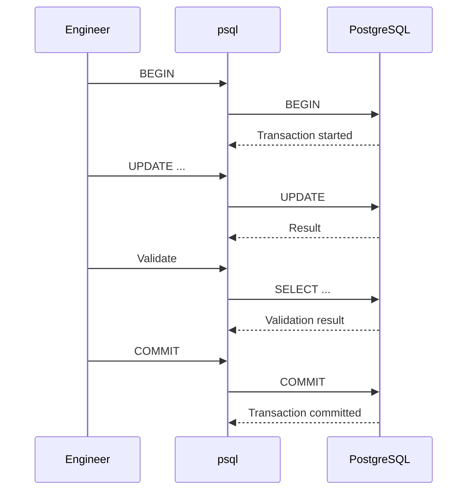
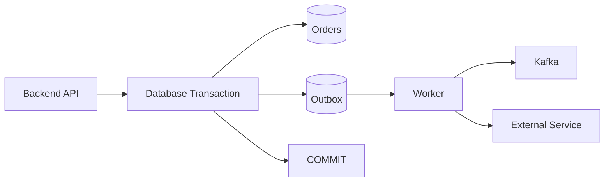

# 08- Transactions from CLI

## Overview

Transactions are one of the most important capabilities to understand when running SQL manually from the PostgreSQL CLI. A transaction defines a boundary within which multiple database operations are treated as a single unit of work.

From `psql`, transactions are controlled with:

```sql
BEGIN;
COMMIT;
ROLLBACK;
```

A typical transactional operation looks like:



The CLI is particularly useful for learning and debugging transaction behavior because you can observe:

- Transaction boundaries
- Locks
- Isolation behavior
- Rollbacks
- Savepoints
- Concurrent sessions
- Blocking
- Statement failures
- Transaction duration

A senior engineer should treat a manual production transaction with the same discipline as application transaction code.

---

## Why Transactions Matter

Without a transaction boundary, multiple independent statements can leave the database partially modified.

Consider transferring money:

```text
Debit account A
      ↓
Credit account B
```

If the debit succeeds but the credit fails, the system is inconsistent.

A transaction provides:

```text
BEGIN
  ↓
Debit A
  ↓
Credit B
  ↓
COMMIT
```

Either the complete unit succeeds or the transaction can be rolled back.

Transactions therefore protect database consistency while also defining important concurrency and visibility behavior.

---

## Transaction Lifecycle

A PostgreSQL transaction commonly follows:

```text
Idle
  ↓
BEGIN
  ↓
In Transaction
  ├── SQL statements
  ├── SAVEPOINT
  ├── validation
  └── locks
  ↓
COMMIT
  or
ROLLBACK
  ↓
Idle
```

The lifecycle matters because locks, snapshots, and transactional changes are tied to the transaction.

A transaction that remains open for a long time can therefore affect other workloads even if it is not actively executing SQL.

---

## Starting a Transaction

Use:

```sql
BEGIN;
```

Equivalent syntax includes:

```sql
START TRANSACTION;
```

For normal CLI work, `BEGIN` is concise and widely used.

Example:

```sql
BEGIN;

SELECT current_user;

SELECT count(*)
FROM app.orders;
```

The transaction remains open until:

```sql
COMMIT;
```

or:

```sql
ROLLBACK;
```

---

## Committing a Transaction

Use:

```sql
COMMIT;
```

to make the transaction's changes durable and visible according to PostgreSQL's transactional semantics.

Example:

```sql
BEGIN;

UPDATE app.orders
SET status = 'cancelled'
WHERE id = 1001;

COMMIT;
```

Once committed, the change is no longer reversible through `ROLLBACK`.

Operational recovery would require another corrective operation or restoration process.

---

## Rolling Back a Transaction

Use:

```sql
ROLLBACK;
```

to discard changes made during the current transaction.

Example:

```sql
BEGIN;

UPDATE app.orders
SET status = 'cancelled'
WHERE id = 1001;

ROLLBACK;
```

The update is undone.

This makes transactions particularly useful for controlled production changes where you want to validate the affected rows before committing.

---

## Validate Before Commit

A useful manual workflow is:

```sql
BEGIN;

UPDATE app.orders
SET status = 'cancelled'
WHERE id = 1001
RETURNING id, status;

SELECT
    id,
    status
FROM app.orders
WHERE id = 1001;

COMMIT;
```

For an uncertain operation:

```sql
BEGIN;

UPDATE app.orders
SET status = 'cancelled'
WHERE customer_id = 42;

SELECT count(*)
FROM app.orders
WHERE customer_id = 42;

ROLLBACK;
```

This allows you to inspect the result without committing it.

However, `ROLLBACK` does not make the operation free. The database still performs work, consumes resources, and may acquire locks while the transaction is running.

---

## Autocommit in `psql`

By default, `psql` operates with autocommit behavior.

A standalone statement such as:

```sql
UPDATE app.orders
SET status = 'cancelled'
WHERE id = 1001;
```

is committed automatically if it succeeds.

Conceptually:

```text
Statement
   ↓
Implicit transaction
   ↓
Execute
   ↓
Commit
```

To group multiple statements, explicitly start a transaction:

```sql
BEGIN;
```

This distinction is critical during manual operations.

---

## Checking Transaction State

`psql` exposes transaction state through its prompt.

You may see a prompt such as:

```text
application=>
```

for an idle session and:

```text
application=*>
```

when inside a transaction.

After a transaction enters an error state, the prompt can indicate that state as well.

The prompt is useful operational feedback, but it should not replace explicit transaction discipline.

---

## Failed Transactions

Consider:

```sql
BEGIN;

SELECT 1 / 0;

SELECT current_database();
```

After the division-by-zero error, the transaction is aborted.

PostgreSQL will reject subsequent statements until the transaction is ended.

Use:

```sql
ROLLBACK;
```

to return the session to a usable state.

This behavior prevents a transaction from continuing after an error as if the previous statement had succeeded.

---

## Savepoints

A savepoint creates a rollback point inside a transaction.

Example:

```sql
BEGIN;

UPDATE app.orders
SET status = 'processing'
WHERE id = 1001;

SAVEPOINT before_optional_change;

UPDATE app.orders
SET status = 'completed'
WHERE id = 1001;

ROLLBACK TO SAVEPOINT before_optional_change;

COMMIT;
```

The first update remains committed, while the second update is rolled back.

Savepoints are useful when part of a larger transaction may need to be discarded without abandoning the entire transaction.

---

## Releasing Savepoints

After reaching a point where a savepoint is no longer needed:

```sql
RELEASE SAVEPOINT before_optional_change;
```

Example:

```sql
BEGIN;

UPDATE app.orders
SET status = 'processing'
WHERE id = 1001;

SAVEPOINT validation_point;

SELECT *
FROM app.orders
WHERE id = 1001;

RELEASE SAVEPOINT validation_point;

COMMIT;
```

Savepoints should be used intentionally rather than as a substitute for sensible transaction boundaries.

---

## Transaction Isolation

A transaction also defines how it interacts with concurrent transactions.

PostgreSQL supports:

| Isolation level | Typical purpose |
|---|---|
| `READ COMMITTED` | Default general-purpose workload |
| `REPEATABLE READ` | Consistent transaction-level snapshot |
| `SERIALIZABLE` | Strongest isolation with possible serialization failures |
| `READ UNCOMMITTED` | Behaves like `READ COMMITTED` in PostgreSQL |

Check the current setting:

```sql
SHOW transaction_isolation;
```

The appropriate isolation level depends on the correctness requirements of the operation.

---

## Setting Isolation from CLI

Start a transaction with a specific isolation level:

```sql
BEGIN TRANSACTION ISOLATION LEVEL REPEATABLE READ;
```

Or:

```sql
BEGIN TRANSACTION ISOLATION LEVEL SERIALIZABLE;
```

For example:

```sql
BEGIN TRANSACTION ISOLATION LEVEL REPEATABLE READ;

SELECT
    count(*)
FROM app.orders;

SELECT
    sum(total)
FROM app.orders;

COMMIT;
```

Both reads operate against the transaction's consistent snapshot.

---

## `READ COMMITTED`

PostgreSQL's default isolation level is:

```text
READ COMMITTED
```

Each statement generally sees a snapshot reflecting data committed before that statement began.

Therefore, two statements in the same transaction can observe different committed data if another transaction commits between them.

Example:

```sql
BEGIN;

SELECT count(*)
FROM app.orders;

-- Another session commits an INSERT here.

SELECT count(*)
FROM app.orders;

COMMIT;
```

The two counts can differ.

This behavior is important when writing manual diagnostics and application transaction logic.

---

## `REPEATABLE READ`

At:

```text
REPEATABLE READ
```

the transaction uses a stable snapshot for its reads.

Example:

```sql
BEGIN TRANSACTION ISOLATION LEVEL REPEATABLE READ;

SELECT count(*)
FROM app.orders;

-- Other transactions may commit changes.

SELECT count(*)
FROM app.orders;

COMMIT;
```

The transaction's snapshot remains consistent.

This is useful for operations requiring a coherent view of a dataset.

Long-running repeatable-read transactions should be avoided unless the consistency requirement justifies them.

---

## `SERIALIZABLE`

Use:

```sql
BEGIN TRANSACTION ISOLATION LEVEL SERIALIZABLE;
```

when the business operation requires serializable behavior.

The tradeoff is that concurrent transactions can fail with serialization errors.

Applications must therefore be prepared to retry appropriate transactions.

A CLI operator should not blindly retry such operations without checking whether the operation is safe to repeat.

---

## Transaction Access Modes

PostgreSQL also supports:

```text
READ WRITE
READ ONLY
```

For example:

```sql
BEGIN READ ONLY;

SELECT *
FROM app.orders
LIMIT 100;

COMMIT;
```

A read-only transaction is useful for controlled diagnostics and consistent read workloads.

You can also combine options:

```sql
BEGIN TRANSACTION ISOLATION LEVEL REPEATABLE READ READ ONLY;
```

---

## Transaction-Level Timeouts

Manual production transactions should often have bounded execution time.

For example:

```sql
BEGIN;

SET LOCAL statement_timeout = '30s';
SET LOCAL lock_timeout = '5s';

UPDATE app.orders
SET status = 'cancelled'
WHERE id = 1001;

COMMIT;
```

`statement_timeout` limits statement execution time.

`lock_timeout` limits how long a statement waits to acquire a lock.

These solve different problems.

---

## Transaction Timeout

PostgreSQL also supports:

```text
idle_in_transaction_session_timeout
```

This protects against sessions that remain idle while holding an open transaction.

For example:

```sql
SET idle_in_transaction_session_timeout = '60s';
```

This is particularly relevant to:

```text
Interactive sessions
Application connection pools
Operational scripts
```

An abandoned transaction can retain resources and prevent normal cleanup.

---

## Why Long Transactions Are Dangerous

A transaction can be problematic even while doing nothing.

Example:

```text
BEGIN;
-- Engineer leaves terminal open
```

The session may remain:

```text
idle in transaction
```

Long-running transactions can:

- Retain snapshots
- Delay cleanup of old row versions
- Hold locks
- Increase storage pressure
- Block schema operations
- Increase replication impact
- Increase recovery complexity

Avoid leaving production transactions open while investigating unrelated issues.

---

## Inspecting Open Transactions

Use:

```sql
SELECT
    pid,
    usename,
    application_name,
    state,
    xact_start,
    query_start,
    wait_event_type,
    wait_event,
    query
FROM pg_stat_activity
WHERE xact_start IS NOT NULL
ORDER BY xact_start;
```

Look specifically for:

```text
idle in transaction
```

and unusually old `xact_start` values.

---

## Transaction and Locking

Transactions define the lifetime of many locks.

For example:

```sql
BEGIN;

SELECT *
FROM app.orders
WHERE id = 1001
FOR UPDATE;
```

The row lock remains held until:

```sql
COMMIT;
```

or:

```sql
ROLLBACK;
```

This means a CLI transaction can unintentionally block application traffic if it holds locks for too long.

---

## `SELECT FOR UPDATE`

A common concurrency-control pattern:

```sql
BEGIN;

SELECT
    id,
    status
FROM app.orders
WHERE id = 1001
FOR UPDATE;

UPDATE app.orders
SET status = 'processing'
WHERE id = 1001;

COMMIT;
```

The row is locked for the duration of the transaction.

Use this when the operation requires serialized modification of a specific row.

Do not use row locks merely because they appear safer; unnecessary locking reduces concurrency.

---

## `SKIP LOCKED`

PostgreSQL supports:

```sql
FOR UPDATE SKIP LOCKED
```

This is useful for queue-like workloads.

Example:

```sql
BEGIN;

SELECT
    id
FROM app.jobs
WHERE status = 'pending'
ORDER BY id
FOR UPDATE SKIP LOCKED
LIMIT 10;

COMMIT;
```

Multiple workers can claim different available rows without waiting on already-locked rows.

This pattern is useful in:

```text
Celery-style database queues
Background workers
Batch processors
Task dispatch systems
```

---

## `NOWAIT`

Another option is:

```sql
FOR UPDATE NOWAIT
```

Example:

```sql
BEGIN;

SELECT
    id
FROM app.orders
WHERE id = 1001
FOR UPDATE NOWAIT;
```

If the row is already locked, PostgreSQL returns an error instead of waiting.

This is useful when an operational command must fail quickly rather than block.

---

## Transactional Data Changes

A controlled manual update should look like:

```sql
BEGIN;

SET LOCAL statement_timeout = '30s';
SET LOCAL lock_timeout = '5s';

SELECT
    id,
    status
FROM app.orders
WHERE id = 1001
FOR UPDATE;

UPDATE app.orders
SET status = 'cancelled'
WHERE id = 1001
RETURNING id, status;

COMMIT;
```

The sequence is deliberate:

```text
Start transaction
    ↓
Set safety limits
    ↓
Lock/inspect target
    ↓
Modify
    ↓
Validate returned result
    ↓
Commit
```

---

## Atomic Updates

Many operations should be expressed as one SQL statement rather than a read-modify-write sequence.

Avoid:

```text
SELECT balance
UPDATE balance
```

when concurrency matters.

Prefer:

```sql
UPDATE app.accounts
SET balance = balance - 100
WHERE id = 1
  AND balance >= 100
RETURNING balance;
```

This lets PostgreSQL enforce the condition atomically.

---

## Transactions and Application Code

A CLI transaction and an application transaction use the same database transaction mechanisms.

For Django:

```python
from django.db import transaction

with transaction.atomic():
    ...
```

For SQLAlchemy:

```python
with session.begin():
    ...
```

The underlying PostgreSQL concepts remain:

```text
BEGIN
SQL statements
COMMIT / ROLLBACK
```

The framework merely provides an application-level abstraction around them.

---

## Transaction Boundaries in APIs

A typical backend request:

```text
HTTP request
    ↓
Authentication
    ↓
Business logic
    ↓
Database transaction
    ↓
Commit
    ↓
HTTP response
```

The transaction should normally be limited to the database work that must be atomic.

Avoid:

```text
BEGIN
  ↓
Database update
  ↓
HTTP request to another service
  ↓
Wait 20 seconds
  ↓
COMMIT
```

This unnecessarily holds database resources while waiting for external systems.

---

## External Calls Inside Transactions

Avoid:

```text
BEGIN
  ↓
UPDATE database
  ↓
Call payment API
  ↓
Call Kafka
  ↓
Call another microservice
  ↓
COMMIT
```

The transaction cannot atomically include those external systems.

Prefer patterns such as:

```text
Database transaction
    ↓
State change + outbox event
    ↓
COMMIT
    ↓
Asynchronous delivery
```

This separates database atomicity from distributed-system coordination.

---

## Transactional Outbox

A common architecture:



Example:

```sql
BEGIN;

UPDATE app.orders
SET status = 'confirmed'
WHERE id = 1001;

INSERT INTO app.outbox_events (
    aggregate_id,
    event_type,
    payload
)
VALUES (
    1001,
    'order.confirmed',
    '{"order_id": 1001}'
);

COMMIT;
```

The database state and outbox record are committed atomically.

---

## Transaction Retry Behavior

Some transactions can fail due to concurrency:

```text
Serialization failure
Deadlock
Connection failure
Lock timeout
```

Retries are not universally safe.

Before retrying, determine:

```text
Was the transaction committed?
Is the operation idempotent?
Can duplicate side effects occur?
Was an external system involved?
```

An uncertain commit outcome is especially important.

---

## Uncertain Commit

Suppose:

```text
Client
  ↓
COMMIT
  ↓
Network failure
```

The client may not know whether PostgreSQL committed the transaction.

The correct response is not necessarily:

```text
Immediately execute everything again
```

Instead, use an idempotency mechanism or query the resulting state where possible.

This is one reason production write workflows should use stable identifiers and explicit state transitions.

---

## Deadlocks from CLI

Two sessions can create a deadlock.

Session A:

```sql
BEGIN;

UPDATE app.accounts
SET balance = balance - 100
WHERE id = 1;
```

Session B:

```sql
BEGIN;

UPDATE app.accounts
SET balance = balance - 100
WHERE id = 2;
```

If they subsequently try to acquire the other's row lock:

```text
A waits for B
B waits for A
```

PostgreSQL detects the cycle and aborts one transaction.

The general prevention strategy is consistent lock ordering.

---

## Observing Transaction Blocking

Find blocked sessions:

```sql
SELECT
    pid,
    pg_blocking_pids(pid) AS blocking_pids,
    xact_start,
    query_start,
    wait_event_type,
    wait_event,
    query
FROM pg_stat_activity
WHERE cardinality(pg_blocking_pids(pid)) > 0;
```

Then inspect the blocking session.

A senior operator should identify:

```text
Who is blocked?
Who is blocking?
How long?
Which transaction?
Which query?
Why does the transaction remain open?
```

---

## Transactional DDL

PostgreSQL supports transactional DDL for many operations.

For example:

```sql
BEGIN;

CREATE TABLE app.import_test (
    id bigint PRIMARY KEY
);

ROLLBACK;
```

The table creation can be rolled back.

However, not every PostgreSQL operation behaves identically, and some commands have special transaction restrictions.

Always verify the specific command before designing a migration around transactional rollback.

---

## DDL and Locking

Transactional does not mean:

```text
No blocking
```

For example, an `ALTER TABLE` can acquire locks that conflict with application queries.

Therefore:

```text
Transactional
```

and:

```text
Operationally safe
```

are separate properties.

A migration can be fully transactional while still causing significant production impact.

---

## Manual Migration Pattern

For controlled schema work:

```sql
BEGIN;

SET LOCAL lock_timeout = '5s';
SET LOCAL statement_timeout = '30s';

ALTER TABLE app.orders
ADD COLUMN fulfillment_status text;

COMMIT;
```

The timeout prevents the operation from waiting indefinitely for conflicting locks.

For large production tables, however, migration strategy must consider the exact PostgreSQL operation, table size, existing workload, and deployment model.

---

## Transaction and Connection Pooling

Application pools keep connections available for reuse.

A transaction must not accidentally remain open when a connection is returned to the pool.

Conceptually:

```text
Request
   ↓
Acquire connection
   ↓
BEGIN
   ↓
SQL
   ↓
COMMIT / ROLLBACK
   ↓
Return connection
```

A leaked transaction can contaminate the next request using that connection.

Frameworks generally provide transaction management to prevent this, but database-level observability remains important.

---

## CLI Sessions vs Pooled Applications

A CLI session is normally dedicated to the operator.

An application connection may be reused by many requests over time.

Therefore, be especially careful with session state such as:

```text
Transaction state
SET parameters
Temporary tables
Advisory locks
Prepared statements
Role changes
```

A manual experiment that changes session state can behave differently from a request handled through a connection pool.

---

## Read-Only Transactions for Diagnostics

For a complex consistent read:

```sql
BEGIN TRANSACTION ISOLATION LEVEL REPEATABLE READ READ ONLY;

SELECT count(*)
FROM app.orders;

SELECT sum(total)
FROM app.orders;

COMMIT;
```

This can provide a consistent analytical view.

However, long-lived snapshots can increase storage pressure by preventing cleanup of row versions that remain potentially visible to the transaction.

---

## Transaction and Replication

Committed changes generate WAL that can be replayed by replicas.

A large transaction can therefore produce:

```text
Large WAL volume
     ↓
Replica replay workload
     ↓
Replication lag
```

A transaction that updates millions of rows is not equivalent operationally to millions of small independent transactions.

Large transactions can also make failure recovery and rollback more expensive.

---

## Large Data Changes

Avoid blindly executing:

```sql
BEGIN;

UPDATE app.orders
SET status = 'archived';

COMMIT;
```

against a huge production table.

Potential consequences include:

```text
Long transaction
Large WAL generation
Lock pressure
Replica lag
Large rollback
Vacuum interference
High I/O
```

Depending on requirements, controlled batching may be safer:

```text
Batch
  ↓
Commit
  ↓
Next batch
```

But batching changes transaction semantics, so it must be designed around the application's correctness requirements.

---

## Savepoints vs Smaller Transactions

Savepoints provide partial rollback within one transaction.

Smaller transactions provide separate commit boundaries.

They solve different problems.

| Technique | Purpose |
|---|---|
| `SAVEPOINT` | Partial rollback within one transaction |
| Smaller transaction | Reduce transaction duration/resource retention |
| `ROLLBACK` | Discard entire transaction |
| `COMMIT` | Finalize transaction |

Do not use savepoints merely to hide an oversized transaction.

---

## Transaction Monitoring

Important PostgreSQL information includes:

```text
pg_stat_activity
pg_locks
pg_stat_replication
```

Useful fields include:

```text
xact_start
query_start
state
wait_event
wait_event_type
application_name
backend_xid
backend_xmin
```

Monitoring should identify:

- Long transactions
- Idle transactions
- Blocked sessions
- Lock contention
- Replica impact
- Aborted connections

---

## Production Transaction Checklist

Before starting a manual production transaction:

```text
[ ] Verify database
[ ] Verify server
[ ] Verify role
[ ] Verify primary/replica state
[ ] Inspect target rows
[ ] Estimate affected row count
[ ] Inspect constraints
[ ] Inspect indexes
[ ] Understand triggers
[ ] Understand RLS
[ ] Set appropriate timeouts
[ ] Define rollback strategy
[ ] Consider lock impact
[ ] Consider replica impact
[ ] Validate result before commit
```

During the transaction:

```text
[ ] Keep scope narrow
[ ] Avoid external calls
[ ] Avoid unnecessary queries
[ ] Monitor blocking if the operation is significant
[ ] Do not leave the terminal unattended
```

---

## Security Considerations

Manual transactions can bypass application-level workflows.

An operator might have direct access to:

```text
Customer records
Financial data
Authentication data
Audit records
Internal state
```

Use:

- Least-privileged roles
- Read-only roles for diagnostics
- Approved production access paths
- TLS
- Centralized auditing
- Change approval for high-risk operations
- Restricted credentials
- Data minimization

Do not use a superuser simply because a query is failing with a permissions error.

---

## Reliability Considerations

Reliable manual operations should be:

```text
Explicit
Bounded
Observable
Idempotent where possible
Reversible where possible
```

A good operational SQL script should define:

```text
Preconditions
Transaction boundary
Expected affected rows
Validation
Commit/rollback behavior
Failure behavior
```

For example:

```sql
BEGIN;

SET LOCAL lock_timeout = '5s';
SET LOCAL statement_timeout = '30s';

UPDATE app.orders
SET status = 'cancelled'
WHERE id = 1001
  AND status = 'pending'
RETURNING id, status;

COMMIT;
```

The condition:

```sql
AND status = 'pending'
```

acts as an important concurrency guard.

---

## Disaster Recovery Considerations

Transactions interact with recovery through WAL.

After a failure:

```text
Committed transactions
```

are recovered according to PostgreSQL's durability and recovery mechanisms, while uncommitted work is rolled back during crash recovery.

This is one of the fundamental reasons transactions are central to database reliability.

For disaster recovery, remember:

```text
Database transaction
```

does not automatically include:

```text
Redis
Kafka
External APIs
Object storage
Other databases
```

Cross-system consistency requires distributed-system patterns.

---

## Common Mistakes

### Forgetting `BEGIN`

A manual sequence of updates may execute as independent transactions.

### Forgetting `COMMIT`

A successful transaction that is never committed does not produce the intended durable result.

### Forgetting `ROLLBACK` After an Error

An aborted PostgreSQL transaction remains unusable until it is rolled back.

### Leaving a Transaction Open

An idle transaction can retain locks and snapshots and interfere with maintenance.

### Holding Locks While Investigating

Do not execute:

```sql
BEGIN;

SELECT ...
FOR UPDATE;
```

and then spend ten minutes researching what to do next.

### Running External Calls Inside Transactions

Database transactions cannot atomically include arbitrary HTTP APIs, Kafka, Redis, or other databases.

### Assuming `ROLLBACK` Makes a Query Free

The database still performed the work and may have consumed substantial resources.

### Retrying Every Transaction Failure

Serialization failures and deadlocks can be retryable, but retries must respect idempotency and uncertain commit outcomes.

### Using One Huge Transaction for Massive Data Changes

Large transactions can create WAL, locking, vacuum, replication, and recovery problems.

### Assuming Transactional DDL Means Zero Downtime

Transactional DDL can still acquire blocking locks.

---

## Interview Traps

### What happens when a statement fails inside a PostgreSQL transaction?

The transaction enters an aborted state. Subsequent statements generally fail until `ROLLBACK` or an appropriate savepoint rollback is used.

### What is autocommit?

Each standalone statement is committed automatically when successful unless an explicit transaction has been started.

### Why use `SAVEPOINT`?

It provides a partial rollback point inside a larger transaction.

### What is the default PostgreSQL isolation level?

`READ COMMITTED`.

### Can two statements in the same `READ COMMITTED` transaction see different data?

Yes. Each statement generally obtains its own snapshot.

### Why are long-running transactions dangerous?

They can retain snapshots and locks, interfere with cleanup, increase storage pressure, and affect replication and concurrency.

### Does a transaction make external systems atomic?

No. PostgreSQL cannot automatically include HTTP APIs, Kafka, Redis, or another database in the same local transaction.

### Why can a committed transaction still produce an uncertain client result?

The client may lose the network connection during or immediately after `COMMIT` and cannot determine from the response whether PostgreSQL committed. Idempotency and state verification are needed.

### Does transactional DDL guarantee non-blocking migrations?

No. Transactional execution and lock behavior are separate concerns.

---

## Key Takeaways

- **Use explicit transaction boundaries for multi-step manual changes:** `BEGIN`, validate the work, then `COMMIT` or `ROLLBACK` deliberately.
- **Keep production transactions short and bounded:** long transactions can retain locks and snapshots, increase WAL/storage pressure, interfere with vacuum, and contribute to replica lag.
- **Understand concurrency, not just atomicity:** isolation levels, row locks, savepoints, `NOWAIT`, `SKIP LOCKED`, and serialization failures determine how transactions behave under concurrent workloads.
- **Do not extend database transactions across external systems:** use patterns such as the transactional outbox when database state must reliably produce Kafka or other external events.
- **Treat CLI transactions as production operations:** verify the target server and role, use appropriate timeouts, validate affected rows, consider rollback and retry behavior, and audit high-impact changes.