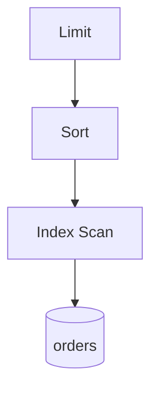
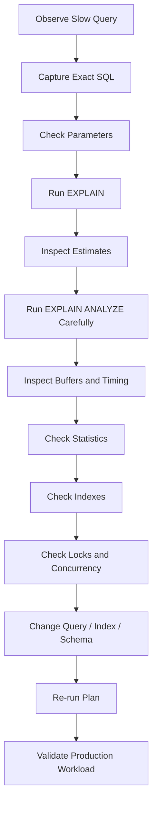

# 09- EXPLAIN and Query Diagnostics

## Overview

`EXPLAIN` is PostgreSQL's primary tool for understanding how a SQL statement will be executed. It exposes the database's chosen execution plan and, when used with `ANALYZE`, allows you to compare the planner's estimates with actual execution behavior.

For backend engineers, `EXPLAIN` is the bridge between:

```text
Application query
      ↓
Generated SQL
      ↓
PostgreSQL planner
      ↓
Execution plan
      ↓
CPU / memory / I/O / locks
      ↓
Observed latency
```

It is especially important when diagnosing:

- Slow API endpoints
- ORM-generated queries
- Missing or ineffective indexes
- Incorrect row-count estimates
- Expensive joins
- Large sequential scans
- Sorts and aggregations
- Poor pagination
- Query regressions after deployments
- Production latency spikes

The most useful production command is often:

```sql
EXPLAIN (ANALYZE, BUFFERS)
SELECT ...
```

However, `EXPLAIN ANALYZE` actually executes the statement. This makes the distinction between plan inspection and actual execution operationally important.

---

## Why Query Diagnostics Matter

A query being slow does not automatically mean:

```text
"Missing index"
```

Performance can be affected by:

```text
Query structure
      ↓
Cardinality estimates
      ↓
Planner decision
      ↓
Access path
      ↓
Join strategy
      ↓
Sort / aggregation
      ↓
Memory
      ↓
Disk I/O
      ↓
Concurrency
      ↓
Locking
      ↓
Network transfer
```

A senior engineer diagnoses the complete path rather than applying an isolated optimization rule.

---

## `EXPLAIN`

Basic usage:

```sql
EXPLAIN
SELECT
    id,
    status
FROM app.orders
WHERE customer_id = 42;
```

`EXPLAIN` shows the planned operations without executing the query.

A simplified output might look like:

```text
Index Scan using orders_customer_id_idx on orders
  Index Cond: (customer_id = 42)
```

The planner has determined that an index scan is likely cheaper than scanning the entire table.

---

## `EXPLAIN ANALYZE`

Use:

```sql
EXPLAIN (ANALYZE)
SELECT
    id,
    status
FROM app.orders
WHERE customer_id = 42;
```

Unlike plain `EXPLAIN`, this executes the query and reports actual execution statistics.

Typical information includes:

```text
Planning Time
Execution Time
Actual rows
Actual loops
Actual timing
```

This allows comparison between:

```text
Estimated behavior
```

and:

```text
Actual behavior
```

That comparison is central to query diagnosis.

---

## The Critical Difference

| Command | Executes query? | Shows estimates? | Shows actual execution? |
|---|---:|---:|---:|
| `EXPLAIN` | No | Yes | No |
| `EXPLAIN ANALYZE` | Yes | Yes | Yes |
| `EXPLAIN (BUFFERS)` | No | Yes | No |
| `EXPLAIN (ANALYZE, BUFFERS)` | Yes | Yes | Yes |

For production read queries, `EXPLAIN (ANALYZE, BUFFERS)` is extremely useful.

For writes, be careful:

```sql
EXPLAIN (ANALYZE)
UPDATE ...
```

actually performs the update.

---

## `EXPLAIN (ANALYZE, BUFFERS)`

A practical diagnostic query:

```sql
EXPLAIN (ANALYZE, BUFFERS)
SELECT
    id,
    customer_id,
    status,
    created_at
FROM app.orders
WHERE customer_id = 42
ORDER BY created_at DESC
LIMIT 50;
```

`BUFFERS` reports buffer activity such as:

```text
shared hit
shared read
shared dirtied
shared written
```

This helps determine whether the query is primarily using cached pages or requiring physical reads.

---

## Planning vs Execution

`EXPLAIN ANALYZE` reports both:

```text
Planning Time
Execution Time
```

Example:

```text
Planning Time: 0.300 ms
Execution Time: 42.100 ms
```

For normal OLTP queries, execution usually dominates.

However, complex queries can also have meaningful planning overhead.

This matters when investigating:

```text
Highly dynamic SQL
Very large joins
Many relations
Generated ORM queries
Frequent short-lived queries
```

---

## Reading an Execution Plan

A plan is a tree.

For example:

```text
Limit
  -> Sort
       -> Index Scan
```

The database executes lower-level operations and feeds their results into parent operations.

Conceptually:



When diagnosing a plan, work through the tree and identify:

- Expensive nodes
- Unexpected row counts
- Large loops
- Sequential scans
- Sorts
- Hash operations
- Nested loops
- Excessive buffer reads

---

## Cost Estimates

A plan might contain:

```text
cost=0.42..125.73
```

These are PostgreSQL planner cost units.

They are not:

```text
milliseconds
```

The planner compares relative costs between possible execution strategies.

Do not interpret:

```text
cost=100
```

as:

```text
100 ms
```

---

## Startup Cost vs Total Cost

A cost range such as:

```text
cost=0.42..125.73
```

contains:

```text
startup cost
total cost
```

Startup cost estimates work required before producing the first row.

Total cost estimates the cost of producing all expected rows.

This distinction matters for queries using:

```sql
LIMIT
```

because producing the first few rows quickly can be more valuable than minimizing total work.

---

## Actual Time

With `ANALYZE`, you may see:

```text
actual time=0.050..12.300
```

These values are in milliseconds.

The first value represents the approximate time until the node begins returning rows, while the second represents the time associated with producing its result.

For practical diagnosis, focus on where significant time is accumulated rather than treating every node independently.

---

## Rows and Cardinality

A plan may show:

```text
rows=100
```

and with `ANALYZE`:

```text
actual rows=10000
```

This is a major diagnostic signal.

The planner expected:

```text
100 rows
```

but encountered:

```text
10000 rows
```

That estimate error can cause the planner to choose an inappropriate join strategy or access path.

---

## Cardinality Estimation

PostgreSQL estimates how many rows each operation will produce.

It uses information such as:

```text
Table statistics
Column statistics
Most common values
Histograms
Distinct-value estimates
Extended statistics
Constraints
Predicate selectivity
```

The planner depends heavily on these estimates.

A wrong estimate can produce a wrong plan even when appropriate indexes exist.

---

## `ANALYZE` and Statistics

PostgreSQL collects statistics through `ANALYZE`.

Manual:

```sql
ANALYZE app.orders;
```

Autovacuum/autonalyze normally maintains statistics automatically.

After major data distribution changes, statistics may become stale or insufficiently representative.

This can lead to:

```text
Wrong cardinality estimates
Poor join selection
Unexpected sequential scans
Unexpected nested loops
```

---

## Inspecting Statistics

For table-level statistics:

```sql
SELECT
    relname,
    n_live_tup,
    n_dead_tup,
    last_analyze,
    last_autoanalyze
FROM pg_stat_user_tables
WHERE relid = 'app.orders'::regclass;
```

For column statistics:

```sql
SELECT
    attname,
    n_distinct,
    most_common_vals,
    most_common_freqs
FROM pg_stats
WHERE schemaname = 'app'
  AND tablename = 'orders';
```

Statistics are estimates rather than exact row counts.

---

## Sequential Scan

A plan such as:

```text
Seq Scan on orders
```

means PostgreSQL is scanning table pages sequentially.

This is not automatically bad.

A sequential scan can be the best plan when:

```text
Table is small
Large percentage of rows is required
Predicate is not selective
Sequential I/O is cheaper
```

The mistake is assuming:

```text
Seq Scan = bad
Index Scan = good
```

The planner chooses based on estimated total cost.

---

## Index Scan

Example:

```text
Index Scan using orders_customer_id_idx on orders
```

The database uses an index to locate relevant rows.

Index scans are often useful for selective predicates such as:

```sql
WHERE customer_id = 42
```

but can become inefficient if the query ultimately needs a large percentage of the table.

---

## Bitmap Heap Scan

PostgreSQL may choose:

```text
Bitmap Heap Scan
```

when many rows match an indexed predicate.

Conceptually:

```text
Index
  ↓
Bitmap of matching heap pages
  ↓
Heap page reads
  ↓
Rows
```

This can be more efficient than repeatedly performing random heap lookups.

A bitmap plan is not an indication that PostgreSQL failed to use an index.

---

## Index-Only Scan

PostgreSQL can sometimes satisfy a query entirely from an index:

```text
Index Only Scan
```

This can reduce heap access.

Example:

```sql
SELECT
    customer_id,
    created_at
FROM app.orders
WHERE customer_id = 42;
```

if an appropriate index contains the required information.

Index-only scans still depend on PostgreSQL's visibility information and table maintenance state.

---

## Filter vs Index Cond

A plan may contain:

```text
Index Cond:
```

and:

```text
Filter:
```

For example:

```text
Index Cond: (customer_id = 42)
Filter: (status = 'pending')
```

The index is being used to locate candidate rows, while the filter is applied afterward.

This distinction can reveal whether an index fully supports the query predicate.

---

## Sargability

A predicate is easier for an index to exploit when the indexed column can be used directly.

Potentially problematic:

```sql
WHERE lower(email) = 'user@example.com'
```

if the only index is:

```text
(email)
```

A matching expression index can make this access pattern efficient:

```sql
CREATE INDEX users_lower_email_idx
ON app.users (lower(email));
```

The correct solution depends on the query workload and semantics.

---

## Sorting

A plan may contain:

```text
Sort
```

Example:

```text
Sort
  Sort Key: created_at DESC
```

Sorting can consume:

```text
CPU
Memory
Temporary disk
```

For large datasets, an appropriate index may eliminate or reduce the need for an explicit sort.

For example:

```text
(customer_id, created_at DESC)
```

may support:

```sql
WHERE customer_id = 42
ORDER BY created_at DESC
LIMIT 50;
```

---

## External Sorts

If a sort exceeds available working memory, PostgreSQL may use temporary files.

A plan can reveal this behavior with:

```text
Sort Method: external merge
```

This indicates disk-backed sorting.

Increasing memory can help in some cases, but the better solution may be:

```text
Better index
More selective predicate
Smaller result set
Query redesign
```

Do not blindly increase `work_mem`.

---

## `work_mem`

`work_mem` controls memory available to individual query operations such as:

```text
Sort
Hash
```

It is not simply:

```text
memory allocated per connection
```

A single query can perform multiple operations that each consume memory.

Therefore, setting `work_mem` too aggressively can cause substantial aggregate memory consumption under concurrency.

---

## Hash Operations

A plan may contain:

```text
Hash
Hash Join
HashAggregate
```

These operations can use memory and potentially temporary disk storage.

Example:

```text
Hash Join
  Hash
    Seq Scan
```

Hash joins are often effective for equality joins over suitably sized datasets.

The planner chooses them based on estimated costs.

---

## Nested Loop

A nested-loop plan conceptually does:

```text
For each row from outer relation:
    execute/look up matching rows in inner relation
```

It can be excellent when:

```text
Outer relation is small
Inner relation has an efficient index
```

It can be disastrous when:

```text
Outer relation is large
Inner operation is expensive
```

A common diagnostic signal is:

```text
actual rows
loops
```

where an apparently inexpensive inner node is executed thousands of times.

---

## Merge Join

A merge join works by processing sorted inputs.

It can be effective when:

```text
Inputs are already ordered
Useful indexes provide ordering
Large relations are being joined
```

The plan may contain sorting steps if the inputs are not already appropriately ordered.

---

## Join Strategy Comparison

| Join | Strength | Typical risk |
|---|---|---|
| Nested Loop | Excellent for small outer + indexed inner | Expensive repeated inner work |
| Hash Join | Strong for large equality joins | Memory/hash spill |
| Merge Join | Efficient with sorted inputs | Sorting overhead |

Do not choose a join algorithm manually by default. Diagnose why PostgreSQL selected it and whether its estimates are correct.

---

## `loops`

Consider:

```text
Index Scan
(actual time=0.010..0.020 rows=5 loops=10000)
```

The node looks cheap per execution, but:

```text
5 rows × 10,000 loops
```

means the operation executes many times.

`loops` is particularly important when diagnosing nested-loop plans.

Always consider:

```text
Per-loop cost
×
Number of loops
```

rather than looking only at one execution.

---

## `Rows Removed by Filter`

Plans can show:

```text
Rows Removed by Filter: 900000
```

This can indicate that PostgreSQL is processing many rows only to discard them later.

Possible improvements include:

```text
Better index
More selective predicate
Query rewrite
Partition pruning
Data-model change
```

Do not automatically create an index without understanding the broader workload.

---

## Buffers

With:

```sql
EXPLAIN (ANALYZE, BUFFERS)
```

you may see:

```text
Buffers: shared hit=1000 read=50
```

Conceptually:

```text
shared hit
```

means pages were found in PostgreSQL's shared buffers.

```text
shared read
```

means pages had to be read into shared buffers.

Buffer information helps distinguish CPU-heavy behavior from I/O-heavy behavior.

---

## Temporary Buffers

Plans can also expose temporary buffer activity.

This can occur when operations such as:

```text
Sorts
Hash operations
Materialization
```

spill or use temporary relations.

Large temporary activity can indicate insufficient memory for the operation or an inefficient query plan.

---

## `WAL` Information

For write queries, PostgreSQL can report WAL-related information when appropriate options are enabled in `EXPLAIN`.

For example:

```sql
EXPLAIN (ANALYZE, BUFFERS, WAL)
UPDATE app.orders
SET status = 'cancelled'
WHERE customer_id = 42;
```

This can help investigate the write amplification and WAL generated by a modification.

Use this carefully because `ANALYZE` executes the statement.

---

## `VERBOSE`

Use:

```sql
EXPLAIN (VERBOSE)
SELECT ...
```

`VERBOSE` provides additional plan details, including more explicit relation and output information.

It is useful when:

```text
Complex joins
Views
Inherited relations
Partitioned tables
Expression-heavy queries
```

make the standard plan difficult to interpret.

---

## `COSTS`

Costs are shown by default.

You can explicitly control them:

```sql
EXPLAIN (COSTS false)
SELECT ...
```

This can make plans easier to read when you are primarily interested in execution structure.

---

## `SETTINGS`

Use:

```sql
EXPLAIN (ANALYZE, BUFFERS, SETTINGS)
SELECT ...
FROM app.orders
WHERE customer_id = 42;
```

This can expose planner-related settings that differed from their default values.

This is useful when debugging environments where:

```text
work_mem
enable_* settings
random_page_cost
effective_cache_size
parallel settings
```

may differ.

---

## `FORMAT`

PostgreSQL supports different output formats.

For JSON:

```sql
EXPLAIN (FORMAT JSON)
SELECT
    id
FROM app.orders
WHERE customer_id = 42;
```

Common formats include:

```text
TEXT
XML
JSON
YAML
```

JSON is particularly useful for:

```text
Automated tooling
CI checks
Plan comparison
Performance dashboards
Programmatic analysis
```

---

## JSON Plans

A JSON plan can be consumed by tooling rather than parsed from human-readable text.

Example:

```sql
EXPLAIN (ANALYZE, BUFFERS, FORMAT JSON)
SELECT
    id,
    status
FROM app.orders
WHERE customer_id = 42;
```

This is useful when building automated query-regression analysis.

---

## Query Diagnostics Workflow

A production-oriented workflow:



Do not jump directly from:

```text
"API is slow"
```

to:

```text
"Add an index"
```

---

## Capturing the Exact Query

ORMs generate SQL.

For Django, inspect the actual SQL being executed rather than reasoning only from:

```python
Order.objects.filter(
    customer_id=customer_id,
)
```

For SQLAlchemy, inspect the generated statement and bound parameters appropriately.

The diagnostic sequence should be:

```text
Application behavior
      ↓
Exact SQL
      ↓
Parameters
      ↓
EXPLAIN
      ↓
Actual execution
```

Different parameter values can produce different optimal plans.

---

## Query Parameters Matter

Consider:

```sql
WHERE customer_id = $1
```

The optimal plan can depend on the value of `$1`.

For example:

```text
Customer A → 5 rows
Customer B → 5,000,000 rows
```

The same SQL structure can therefore behave differently depending on data distribution and plan selection.

This is especially relevant to prepared statements and parameter-sensitive workloads.

---

## Query Diagnostics and ORMs

An ORM does not eliminate database-level optimization.

Typical architecture:

```text
Django / FastAPI
       ↓
ORM
       ↓
Generated SQL
       ↓
PostgreSQL Planner
       ↓
Execution Plan
```

When a Django endpoint is slow:

```text
Do not inspect only Python code.
Do not inspect only ORM syntax.
```

Inspect:

```text
SQL
Parameters
Plan
Indexes
Statistics
Database contention
```

---

## N+1 Query Diagnosis

Suppose an API executes:

```text
1 query for orders
+
N queries for customers
```

The database may execute many individually fast queries while the endpoint remains slow.

Application-level query-count tooling should therefore be combined with database-level diagnostics.

The correct optimization may be:

```text
select_related
prefetch_related
JOIN
batch loading
```

rather than an index.

---

## Query Count vs Query Cost

These are different problems.

Example:

```text
1000 queries × 1 ms = ~1000 ms
```

versus:

```text
1 query × 5 seconds = ~5 seconds
```

The first is an application/query-pattern problem.

The second is a query execution problem.

Both require different diagnostics.

---

## Pagination Diagnostics

Offset pagination:

```sql
SELECT
    id,
    created_at
FROM app.orders
ORDER BY created_at DESC
LIMIT 50
OFFSET 500000;
```

can become expensive because PostgreSQL may still need to process a large number of preceding rows.

Keyset pagination:

```sql
SELECT
    id,
    created_at
FROM app.orders
WHERE created_at < $1
ORDER BY created_at DESC
LIMIT 50;
```

can scale better when supported by an appropriate index.

Use `EXPLAIN` to verify rather than assuming.

---

## Partition Pruning

For partitioned tables, inspect whether PostgreSQL is pruning irrelevant partitions.

A plan might show:

```text
Append
  -> Scan partition_2026_09
```

rather than scanning every partition.

If pruning does not occur, investigate:

```text
Partition key
Predicate structure
Data types
Parameterization
Planner behavior
Partition design
```

Partitioning is not automatically beneficial unless queries can exploit it.

---

## Materialization

Plans can contain:

```text
Materialize
```

This can allow PostgreSQL to cache intermediate results for repeated consumption within the query.

Materialization is not inherently bad.

As with every plan node, determine:

```text
Why was it selected?
How many rows?
How many loops?
How much memory?
How much time?
```

---

## CTE Diagnostics

Common Table Expressions can affect planning and execution depending on PostgreSQL version and whether the CTE is materialized.

You may explicitly request:

```sql
WITH recent_orders AS MATERIALIZED (
    SELECT *
    FROM app.orders
    WHERE created_at >= now() - interval '7 days'
)
SELECT ...
```

or:

```sql
WITH recent_orders AS NOT MATERIALIZED (
    SELECT *
    FROM app.orders
    WHERE created_at >= now() - interval '7 days'
)
SELECT ...
```

Use these deliberately. Do not assume a CTE is always an optimization boundary.

---

## Parallel Query

PostgreSQL can use parallel execution for suitable workloads.

Plans may contain:

```text
Gather
Gather Merge
Parallel Seq Scan
Parallel Hash Join
```

Parallelism can help large analytical queries but is often unnecessary or counterproductive for small OLTP queries.

Consider:

```text
Query size
CPU availability
Concurrency
Parallel worker settings
Workload type
```

---

## Query Plan Stability

A query can become slower without application code changing.

Possible causes:

```text
Data growth
Data distribution change
Statistics change
Index changes
Configuration changes
Different parameter values
Cache state
Planner version
Database version
```

This is why query diagnostics should be repeated over time rather than treated as a one-time exercise.

---

## Plan Regression

A plan regression occurs when a query's execution strategy becomes materially worse.

Example:

```text
Before:
Index Scan → 20 ms

After:
Seq Scan → 4 seconds
```

Potential causes include:

```text
Incorrect statistics
Data distribution change
Index removal
Configuration change
Planner estimate change
Parameter-sensitive planning
```

Monitor high-value query patterns rather than individual queries only.

---

## `pg_stat_statements`

`pg_stat_statements` provides aggregate query statistics.

It can expose information such as:

```text
Calls
Total execution time
Mean execution time
Rows
Shared block hits
Shared block reads
```

A useful query:

```sql
SELECT
    query,
    calls,
    total_exec_time,
    mean_exec_time,
    rows
FROM pg_stat_statements
ORDER BY total_exec_time DESC
LIMIT 20;
```

This identifies queries consuming substantial cumulative database time.

---

## Total Time vs Mean Time

A query with:

```text
mean = 2 ms
calls = 10,000,000
```

may matter more than:

```text
mean = 2 seconds
calls = 10
```

depending on workload and business impact.

Use both:

```text
Total execution time
Mean execution time
Call count
Rows
I/O
```

when prioritizing optimization.

---

## Query Diagnostics and Locks

A query can be slow because it is waiting, not because execution itself is expensive.

Inspect:

```sql
SELECT
    pid,
    state,
    wait_event_type,
    wait_event,
    query_start,
    query
FROM pg_stat_activity
WHERE datname = current_database();
```

A plan showing:

```text
Execution Time: 5 ms
```

does not explain an API request that spent:

```text
5 seconds waiting for a lock
```

Database execution time and end-to-end request latency are different measurements.

---

## Query Diagnostics and Connection Pools

An API can be slow before PostgreSQL even starts executing the query.

For example:

```text
HTTP request
   ↓
Wait for application DB connection
   ↓
Acquire connection
   ↓
Execute query
   ↓
Return result
```

If the connection pool is exhausted, `EXPLAIN` will not reveal that problem.

Use:

```text
Application pool metrics
pg_stat_activity
Database metrics
Distributed tracing
```

alongside query plans.

---

## Query Diagnostics and Network Latency

`EXPLAIN` measures database-side execution, not the entire API request.

Total latency can include:

```text
Connection acquisition
Network
Database execution
Result serialization
ORM object construction
Business logic
JSON serialization
Response transfer
```

Therefore:

```text
EXPLAIN says 20 ms
```

does not imply:

```text
API response = 20 ms
```

Correlate database metrics with application tracing.

---

## Query Diagnostics in Production

A safer workflow is:

```text
1. Identify the exact query.
2. Run plain EXPLAIN first.
3. Inspect estimated rows and access paths.
4. Check indexes and statistics.
5. Use EXPLAIN ANALYZE only when safe.
6. Include BUFFERS for I/O analysis.
7. Check active sessions and locks.
8. Compare behavior across representative parameters.
9. Test changes outside peak traffic where possible.
10. Re-measure using production-like workload.
```

For destructive statements, do not casually run `EXPLAIN ANALYZE`.

---

## Production Safety

Before:

```sql
EXPLAIN (ANALYZE)
DELETE FROM app.orders
WHERE ...
```

remember:

```text
ANALYZE executes the DELETE.
```

For a destructive operation, use alternatives such as:

```sql
EXPLAIN
DELETE FROM app.orders
WHERE ...;
```

or test against a safe environment.

If actual execution is required for a controlled write test, use an explicit rollback strategy only when the operation and side effects are fully understood.

---

## `EXPLAIN ANALYZE` and Side Effects

A query can trigger:

```text
INSERT
UPDATE
DELETE
Triggers
Foreign-key actions
Functions
External side effects through database extensions/functions
```

Therefore, `EXPLAIN ANALYZE` is not automatically safe just because it is called `EXPLAIN`.

For production diagnostics, understand whether the statement has side effects before executing it.

---

## Security Considerations

Query plans can expose:

```text
Table names
Column names
Query structure
Application behavior
Data-dependent information
```

Production plan output should therefore be treated as operational information.

Avoid sharing raw diagnostic output publicly if it contains:

```text
Sensitive identifiers
Internal schema details
Customer-related predicates
Secrets accidentally embedded in queries
```

Also ensure that database roles used for diagnostics have only the privileges required.

---

## Reliability Considerations

A diagnostic query should not make an incident worse.

Avoid:

```text
Unbounded SELECTs
Large exports
Unnecessary ANALYZE
Long transactions
Unbounded EXPLAIN ANALYZE
Heavy catalog scans
Aggressive configuration changes
```

Prefer:

```text
Read-only diagnostics
Representative samples
Bounded result sets
Appropriate timeouts
Read replicas when suitable
```

---

## High Availability Considerations

For read-only diagnostics, a replica may reduce primary load.

However:

```text
Replica may lag
```

and:

```text
Replica execution environment
```

may differ from the primary.

Use replicas when the diagnostic question permits stale data.

For diagnosing a primary-only issue, inspect the primary carefully and account for production impact.

---

## Disaster Recovery Considerations

Query plans can change after:

```text
Restore
Failover
Data redistribution
Index rebuild
Statistics changes
Configuration changes
```

After restoring a database, collect fresh statistics where appropriate and verify important query plans.

Do not assume that a restored environment will have exactly the same cache state or planner behavior as the original system.

---

## Cost Considerations

Poor query plans can directly increase infrastructure cost through:

```text
CPU
Memory
Storage I/O
Replica capacity
Database instance size
Network traffic
Operational overhead
```

Optimizing a high-frequency query can sometimes delay a database scaling event.

However, query optimization should not become an excuse to under-provision infrastructure when the workload genuinely requires more capacity.

---

## Common Mistakes

### Assuming Every Sequential Scan Is Bad

A sequential scan can be the optimal plan for small tables or low-selectivity queries.

### Assuming Every Index Scan Is Good

An index can be slower than a sequential scan when many rows match.

### Treating Cost as Milliseconds

Planner costs are relative estimates, not wall-clock time.

### Running `EXPLAIN ANALYZE` on Production Writes

`ANALYZE` executes the statement.

### Looking Only at Execution Time

A query can spend most of its latency waiting for locks or a connection.

### Ignoring `loops`

A cheap inner operation executed thousands of times can dominate the query.

### Ignoring Cardinality Estimates

Large estimate errors often explain unexpected join or scan choices.

### Adding an Index Immediately

The real problem may be:

```text
Statistics
Query shape
Lock contention
Data distribution
Connection pool
Network
```

### Increasing `work_mem` Globally

This can create large aggregate memory usage under concurrency.

### Optimizing One Query in Isolation

A new index can improve one endpoint while slowing writes and increasing storage cost across the entire system.

### Testing With Unrepresentative Data

A plan that works on staging with 10,000 rows may fail with 500 million production rows.

### Ignoring ORM Query Generation

The ORM abstraction can hide:

```text
N+1 queries
Unexpected joins
Large projections
Subqueries
```

Inspect the actual SQL.

---

## Production Query Diagnosis Checklist

### Query

- [ ] Capture exact SQL.
- [ ] Capture representative parameters.
- [ ] Check query frequency.
- [ ] Check result size.

### Plan

- [ ] Run `EXPLAIN`.
- [ ] Inspect access paths.
- [ ] Inspect join strategy.
- [ ] Compare estimated vs actual rows.
- [ ] Inspect `loops`.
- [ ] Inspect filters.
- [ ] Inspect sorting.
- [ ] Inspect aggregation.
- [ ] Inspect parallelism.

### Resources

- [ ] Check `BUFFERS`.
- [ ] Check CPU.
- [ ] Check memory.
- [ ] Check temporary files.
- [ ] Check I/O.

### Database State

- [ ] Check statistics freshness.
- [ ] Check indexes.
- [ ] Check table size.
- [ ] Check locks.
- [ ] Check long-running transactions.
- [ ] Check connection pool behavior.
- [ ] Check replica lag if relevant.

### Application

- [ ] Check ORM-generated SQL.
- [ ] Check N+1 behavior.
- [ ] Check connection acquisition time.
- [ ] Check serialization/network time.
- [ ] Check endpoint-level tracing.

---

## Practical Diagnostic Example

Suppose an endpoint executes:

```sql
SELECT
    id,
    customer_id,
    status,
    created_at
FROM app.orders
WHERE customer_id = 42
  AND status = 'pending'
ORDER BY created_at DESC
LIMIT 50;
```

Start with:

```sql
EXPLAIN
SELECT
    id,
    customer_id,
    status,
    created_at
FROM app.orders
WHERE customer_id = 42
  AND status = 'pending'
ORDER BY created_at DESC
LIMIT 50;
```

Then, when safe:

```sql
EXPLAIN (ANALYZE, BUFFERS)
SELECT
    id,
    customer_id,
    status,
    created_at
FROM app.orders
WHERE customer_id = 42
  AND status = 'pending'
ORDER BY created_at DESC
LIMIT 50;
```

Suppose the plan shows:

```text
Seq Scan
Rows Removed by Filter: 5,000,000
actual rows=50
```

Investigate:

```text
Selectivity
Existing indexes
Statistics
Data distribution
Ordering requirements
```

A potential index might be:

```sql
CREATE INDEX CONCURRENTLY orders_customer_status_created_idx
ON app.orders (customer_id, status, created_at DESC);
```

But the index should only be introduced after confirming the workload and existing index strategy.

---

## Measuring Before and After

Never stop at:

```text
"The query looks better."
```

Measure:

```text
Before
    ↓
Plan
    ↓
Latency
    ↓
Buffers
    ↓
Rows
    ↓
After
    ↓
Plan
    ↓
Latency
    ↓
Buffers
```

Also evaluate:

```text
Write overhead
Index size
Other query plans
Replica impact
Storage cost
```

A successful optimization improves the system, not merely one execution plan.

---

## Senior Query Optimization Heuristic

A useful decision sequence is:

```text
Is the query itself correct?
        ↓
Is the exact SQL known?
        ↓
Are parameters representative?
        ↓
Are estimates accurate?
        ↓
Is the access path appropriate?
        ↓
Is the join strategy appropriate?
        ↓
Are indexes appropriate?
        ↓
Are statistics current?
        ↓
Is the query waiting on locks/resources?
        ↓
Is the database the actual latency bottleneck?
        ↓
Would query/schema changes improve the workload globally?
```

This avoids premature optimization.

---

## Interview Traps

### What does `EXPLAIN` do?

It shows PostgreSQL's planned execution strategy without executing the query.

### What does `EXPLAIN ANALYZE` do?

It executes the query and reports actual execution statistics alongside planner estimates.

### Why is `EXPLAIN ANALYZE` dangerous for writes?

Because the statement actually executes, so `UPDATE`, `DELETE`, and other side-effecting statements can modify production data.

### What does `BUFFERS` tell you?

It provides information about PostgreSQL buffer activity, helping distinguish cached-page access from reads, writes, and other I/O behavior.

### Is a sequential scan always bad?

No. It can be the cheapest strategy for small tables or queries that need a large fraction of the table.

### Why might PostgreSQL ignore an index?

The planner may estimate that a sequential scan or another access path is cheaper, especially when selectivity is low or statistics indicate many matching rows.

### What does a large difference between estimated and actual rows indicate?

It indicates a cardinality-estimation problem, often related to statistics, data distribution, correlations, or query predicates.

### Why are `loops` important?

A node that is inexpensive per execution can become expensive when executed thousands or millions of times, particularly inside nested loops.

### Does `EXPLAIN` measure API latency?

No. It measures database planning/execution behavior, not application connection acquisition, network transfer, ORM processing, serialization, or other request-level latency.

### Why can a query be fast in `EXPLAIN ANALYZE` but slow in production?

Production latency can be dominated by concurrency, locks, connection-pool waits, cache state, parameter differences, I/O pressure, or workload volume that is not represented by the isolated test.

---

## Key Takeaways

- **Use `EXPLAIN` to understand the planner and `EXPLAIN (ANALYZE, BUFFERS)` to compare estimates with real execution:** always remember that `ANALYZE` executes the statement.
- **Diagnose the complete execution plan:** inspect access paths, cardinality estimates, joins, loops, filters, sorting, aggregation, buffers, and parallelism rather than assuming every slow query needs an index.
- **Treat cardinality estimation as a first-class diagnostic signal:** large differences between estimated and actual rows can lead PostgreSQL toward inefficient plans and often point to statistics or data-distribution problems.
- **Correlate database plans with application behavior:** ORM-generated SQL, N+1 queries, connection-pool waits, locks, network latency, serialization, and concurrency can all contribute to API latency without appearing in `EXPLAIN`.
- **Optimize the workload, not just one query:** validate improvements with representative data and parameters, then evaluate index size, write amplification, replica impact, resource consumption, and other affected queries.