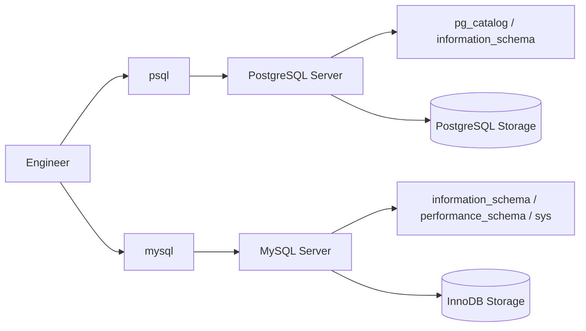
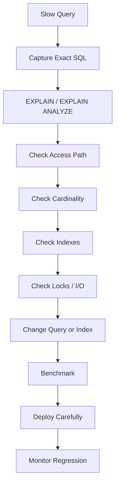

# 11- MySQL CLI Equivalents

## Overview

Backend engineers frequently work across PostgreSQL and MySQL. The SQL language overlaps substantially, but the command-line tools, administrative commands, metadata interfaces, session behavior, and operational workflows differ.

The primary MySQL CLI is `mysql`. MySQL also provides utilities such as `mysqldump`, `mysqladmin`, and `mysqlcheck` for administration and maintenance.

The goal is not to memorize two unrelated command sets. The useful engineering skill is recognizing the same operational intent across database systems:

```text
Connect
  ↓
Inspect server/database/schema
  ↓
Inspect sessions and locks
  ↓
Inspect indexes and storage
  ↓
Run diagnostics
  ↓
Perform controlled administration
```

This is particularly useful when moving between:

- PostgreSQL and MySQL
- Django projects using different database backends
- FastAPI services
- Microservices with heterogeneous databases
- Docker/Kubernetes environments
- AWS RDS and Aurora deployments
- Production incident response

---

## PostgreSQL vs MySQL CLI Architecture



The important architectural difference is that the CLI is a client.

It communicates with the database server over the database protocol. Administrative SQL is still executed by the server.

---

## Command Equivalence Reference

The following table covers the most commonly needed PostgreSQL-to-MySQL CLI translations.

| Intent | PostgreSQL | MySQL |
|---|---|---|
| Start CLI | `psql` | `mysql` |
| Show databases | `\l` | `SHOW DATABASES;` |
| Connect database | `\c appdb` | `USE appdb;` |
| Show current database | `SELECT current_database();` | `SELECT DATABASE();` |
| Show current user | `SELECT current_user;` | `SELECT CURRENT_USER();` |
| Show server version | `SELECT version();` | `SELECT VERSION();` |
| Show tables | `\dt` | `SHOW TABLES;` |
| Describe table | `\d users` | `DESCRIBE users;` |
| Detailed table DDL | `\d+ users` | `SHOW CREATE TABLE users;` |
| Show indexes | `\di` | `SHOW INDEX FROM users;` |
| Show views | `\dv` | `SHOW FULL TABLES WHERE Table_type = 'VIEW';` |
| Show databases/schema metadata | `\dn` | `SHOW DATABASES;` / `information_schema` |
| Show users/roles | `\du` | `mysql.user` / `SHOW GRANTS` |
| Show privileges | `\dp` | `SHOW GRANTS FOR ...;` |
| Show active sessions | `pg_stat_activity` | `SHOW PROCESSLIST;` / `performance_schema` |
| Show server variables | `SHOW ALL` / `pg_settings` | `SHOW VARIABLES;` |
| Show session variables | `SHOW ...` | `SHOW SESSION VARIABLES;` |
| Show locks | `pg_locks` | `performance_schema.data_locks` |
| Show blocking | `pg_blocking_pids()` | `performance_schema.data_lock_waits` |
| Analyze query | `EXPLAIN` | `EXPLAIN` |
| Analyze actual execution | `EXPLAIN ANALYZE` | `EXPLAIN ANALYZE` |
| Database size | `pg_database_size()` | `information_schema` / filesystem-aware metrics |
| Table size | `pg_total_relation_size()` | `information_schema.TABLES` |
| Vacuum | `VACUUM` | No direct equivalent |
| Analyze statistics | `ANALYZE` | `ANALYZE TABLE` |
| Rebuild index | `REINDEX` | `ALTER TABLE ...` / engine-specific maintenance |
| Create database | `CREATE DATABASE` / `createdb` | `CREATE DATABASE` |
| Drop database | `DROP DATABASE` / `dropdb` | `DROP DATABASE` |
| Create user | `CREATE ROLE` / `createuser` | `CREATE USER` |
| Dump database | `pg_dump` | `mysqldump` |
| Check readiness | `pg_isready` | `mysqladmin ping` |

The equivalences represent operational intent, not necessarily identical implementation.

---

## Connecting to MySQL

Basic connection:

```bash
mysql -u app_runtime -p appdb
```

Specify host and port:

```bash
mysql \
    -h db.example.internal \
    -P 3306 \
    -u app_runtime \
    -p \
    appdb
```

PostgreSQL equivalent:

```bash
psql \
    -h db.example.internal \
    -p 5432 \
    -U app_runtime \
    -d appdb
```

The connection lifecycle remains conceptually similar:

```text
DNS
  ↓
TCP connection
  ↓
TLS negotiation if enabled
  ↓
Authentication
  ↓
Authorization
  ↓
Database session
```

---

## Verify the MySQL Connection

Immediately after connecting, inspect the target:

```sql
SELECT
    DATABASE(),
    CURRENT_USER(),
    USER(),
    VERSION();
```

You can also use:

```sql
STATUS;
```

or:

```text
\s
```

inside the MySQL client.

The distinction between `USER()` and `CURRENT_USER()` is important.

- `USER()` identifies the client-supplied account identity.
- `CURRENT_USER()` identifies the account MySQL uses for authentication and privilege checking.

This is useful when diagnosing account and privilege behavior.

---

## MySQL CLI Meta-Commands

Unlike `psql`, MySQL does not use PostgreSQL's backslash command system.

Common MySQL client commands include:

```text
help
status
connect
use
source
system
warnings
show warnings
quit
exit
```

Examples:

```text
status
```

```text
use appdb
```

```text
source ./migration.sql
```

```text
\q
```

The exact command set varies somewhat by MySQL client version and environment.

---

## List Databases

MySQL:

```sql
SHOW DATABASES;
```

PostgreSQL:

```text
\l
```

For metadata:

```sql
SELECT
    SCHEMA_NAME
FROM information_schema.SCHEMATA
ORDER BY SCHEMA_NAME;
```

MySQL commonly uses the terms **database** and **schema** interchangeably at the SQL namespace level.

This differs from PostgreSQL, where a database contains multiple schemas.

---

## Database vs Schema

This distinction matters when moving between PostgreSQL and MySQL.

### PostgreSQL

```text
Cluster
  └── Database
       ├── Schema
       │    ├── Table
       │    └── View
       └── Schema
```

### MySQL

```text
MySQL Server
  ├── Database / Schema
  │    ├── Table
  │    └── View
  └── Database / Schema
```

In MySQL:

```sql
USE appdb;
```

selects the current database.

In PostgreSQL:

```text
\c appdb
```

changes the database connection itself.

This distinction becomes important for multi-database applications and migration tooling.

---

## Select a Database

MySQL:

```sql
USE appdb;
```

Verify:

```sql
SELECT DATABASE();
```

PostgreSQL:

```text
\c appdb
```

Verify:

```sql
SELECT current_database();
```

A safe administrative workflow always verifies the selected database after changing context.

---

## List Tables

MySQL:

```sql
SHOW TABLES;
```

All tables and views can be inspected through:

```sql
SELECT
    TABLE_SCHEMA,
    TABLE_NAME,
    TABLE_TYPE
FROM information_schema.TABLES
WHERE TABLE_SCHEMA = DATABASE()
ORDER BY TABLE_NAME;
```

PostgreSQL:

```text
\dt
```

---

## Inspect a Table

MySQL:

```sql
DESCRIBE app.orders;
```

or:

```sql
SHOW COLUMNS FROM app.orders;
```

More detailed DDL:

```sql
SHOW CREATE TABLE app.orders;
```

`SHOW CREATE TABLE` is particularly useful because it exposes the actual table definition, including details such as:

```text
Columns
Primary key
Indexes
Foreign keys
Engine
Character set
Collation
Constraints
```

PostgreSQL equivalent:

```text
\d+ app.orders
```

---

## Inspect Columns Through `information_schema`

```sql
SELECT
    COLUMN_NAME,
    DATA_TYPE,
    IS_NULLABLE,
    COLUMN_DEFAULT,
    COLUMN_TYPE
FROM information_schema.COLUMNS
WHERE TABLE_SCHEMA = DATABASE()
  AND TABLE_NAME = 'orders'
ORDER BY ORDINAL_POSITION;
```

This is useful for scripts and automated schema inspection because the result is SQL data rather than client-specific formatting.

---

## Inspect Indexes

MySQL:

```sql
SHOW INDEX FROM app.orders;
```

More structured inspection:

```sql
SELECT
    INDEX_NAME,
    COLUMN_NAME,
    NON_UNIQUE,
    SEQ_IN_INDEX
FROM information_schema.STATISTICS
WHERE TABLE_SCHEMA = DATABASE()
  AND TABLE_NAME = 'orders'
ORDER BY INDEX_NAME, SEQ_IN_INDEX;
```

PostgreSQL equivalent:

```text
\di
```

or:

```sql
SELECT
    schemaname,
    tablename,
    indexname,
    indexdef
FROM pg_indexes;
```

---

## Inspect Foreign Keys

Use:

```sql
SELECT
    CONSTRAINT_NAME,
    COLUMN_NAME,
    REFERENCED_TABLE_NAME,
    REFERENCED_COLUMN_NAME
FROM information_schema.KEY_COLUMN_USAGE
WHERE TABLE_SCHEMA = DATABASE()
  AND TABLE_NAME = 'orders'
  AND REFERENCED_TABLE_NAME IS NOT NULL
ORDER BY CONSTRAINT_NAME, ORDINAL_POSITION;
```

For the actual table definition:

```sql
SHOW CREATE TABLE app.orders;
```

The latter is often easier for operational inspection because it shows the complete DDL.

---

## Inspect Views

List views:

```sql
SHOW FULL TABLES
WHERE Table_type = 'VIEW';
```

Inspect the definition:

```sql
SHOW CREATE VIEW app.customer_summary;
```

PostgreSQL equivalent:

```text
\dv
```

---

## Inspect Triggers

MySQL:

```sql
SHOW TRIGGERS;
```

For a specific database:

```sql
SELECT
    TRIGGER_NAME,
    EVENT_MANIPULATION,
    EVENT_OBJECT_TABLE,
    ACTION_TIMING,
    ACTION_STATEMENT
FROM information_schema.TRIGGERS
WHERE TRIGGER_SCHEMA = DATABASE();
```

Triggers can introduce hidden write behavior.

When debugging unexpected database changes, inspect them alongside:

```text
Application code
Stored procedures
Foreign-key cascades
Triggers
Scheduled jobs
```

---

## Inspect Stored Procedures and Functions

Procedures:

```sql
SHOW PROCEDURE STATUS
WHERE Db = DATABASE();
```

Functions:

```sql
SHOW FUNCTION STATUS
WHERE Db = DATABASE();
```

Inspect a procedure:

```sql
SHOW CREATE PROCEDURE app.process_order;
```

Inspect a function:

```sql
SHOW CREATE FUNCTION app.calculate_total;
```

Stored program privileges and execution context should be considered during security reviews.

---

## Inspect Users and Roles

MySQL account metadata is stored in the `mysql` system database.

For example:

```sql
SELECT
    User,
    Host
FROM mysql.user
ORDER BY User, Host;
```

However, querying system tables directly should not be your only privilege-management workflow.

Use:

```sql
SHOW GRANTS FOR 'app_runtime'@'%';
```

to inspect effective grants associated with an account.

---

## Show Grants

MySQL:

```sql
SHOW GRANTS FOR 'app_runtime'@'%';
```

For the current account:

```sql
SHOW GRANTS;
```

This is one of the most useful commands for permission troubleshooting.

PostgreSQL equivalent:

```text
\dp
```

plus role and privilege inspection through PostgreSQL catalogs.

---

## MySQL Privilege Model

MySQL account identity includes both:

```text
User
Host
```

For example:

```text
'app_runtime'@'10.0.10.%'
```

and:

```text
'app_runtime'@'%'
```

are distinct account definitions.

This is a major difference from PostgreSQL's role model.

When troubleshooting MySQL access, inspect both the username and host matching rules.

---

## Grant Example

A runtime application account might receive:

```sql
GRANT SELECT, INSERT, UPDATE, DELETE
ON appdb.*
TO 'app_runtime'@'10.0.10.%';
```

Inspect:

```sql
SHOW GRANTS FOR 'app_runtime'@'10.0.10.%';
```

Avoid granting broad administrative privileges to application accounts.

---

## Inspect Server Variables

MySQL:

```sql
SHOW VARIABLES;
```

Filter:

```sql
SHOW VARIABLES LIKE 'max_connections';
```

Multiple variables:

```sql
SELECT
    VARIABLE_NAME,
    VARIABLE_VALUE
FROM performance_schema.global_variables
WHERE VARIABLE_NAME IN (
    'max_connections',
    'innodb_buffer_pool_size',
    'wait_timeout'
)
ORDER BY VARIABLE_NAME;
```

PostgreSQL equivalent:

```sql
SELECT
    name,
    setting,
    source
FROM pg_settings;
```

---

## Global vs Session Variables

Inspect global value:

```sql
SHOW GLOBAL VARIABLES LIKE 'max_connections';
```

Inspect session value:

```sql
SHOW SESSION VARIABLES LIKE 'autocommit';
```

Set a session value:

```sql
SET SESSION sql_mode = 'STRICT_TRANS_TABLES';
```

Some variables can be changed dynamically; others require configuration changes or restart depending on the variable and MySQL version.

Always verify the variable's scope before changing it.

---

## Inspect Active Sessions

MySQL:

```sql
SHOW PROCESSLIST;
```

More detail:

```sql
SHOW FULL PROCESSLIST;
```

For programmatic inspection:

```sql
SELECT
    PROCESSLIST_ID,
    PROCESSLIST_USER,
    PROCESSLIST_HOST,
    PROCESSLIST_DB,
    PROCESSLIST_COMMAND,
    PROCESSLIST_TIME,
    PROCESSLIST_STATE,
    PROCESSLIST_INFO
FROM performance_schema.threads
WHERE TYPE = 'FOREGROUND';
```

`performance_schema` provides substantially richer observability than relying only on `SHOW PROCESSLIST`.

---

## Find Long-Running Queries

A simple diagnostic:

```sql
SHOW FULL PROCESSLIST;
```

For structured analysis:

```sql
SELECT
    PROCESSLIST_ID,
    PROCESSLIST_USER,
    PROCESSLIST_DB,
    PROCESSLIST_TIME,
    PROCESSLIST_STATE,
    PROCESSLIST_INFO
FROM performance_schema.threads
WHERE TYPE = 'FOREGROUND'
  AND PROCESSLIST_COMMAND <> 'Sleep'
ORDER BY PROCESSLIST_TIME DESC;
```

Investigate:

```text
Query duration
State
User
Database
Client
SQL text
Lock waits
Transaction state
```

Do not terminate a query merely because it has been running for a long time. Long-running analytical operations can be legitimate.

---

## Terminate a MySQL Session

MySQL provides:

```sql
KILL CONNECTION 12345;
```

or:

```sql
KILL QUERY 12345;
```

Conceptually:

| MySQL | Purpose |
|---|---|
| `KILL QUERY` | Stop the current query |
| `KILL CONNECTION` | Terminate the connection |

This is broadly analogous to PostgreSQL:

```sql
SELECT pg_cancel_backend(12345);
```

and:

```sql
SELECT pg_terminate_backend(12345);
```

Always identify the correct connection before killing it.

---

## Inspect InnoDB Locks

For InnoDB workloads, inspect:

```sql
SELECT *
FROM performance_schema.data_locks;
```

Lock waits:

```sql
SELECT *
FROM performance_schema.data_lock_waits;
```

A useful diagnostic is to correlate:

```text
Waiting transaction
        ↓
Blocking transaction
        ↓
Connection/thread
        ↓
SQL statement
        ↓
Application instance
```

The exact columns available depend on MySQL version and `performance_schema` configuration.

---

## Inspect InnoDB Transactions

```sql
SELECT
    trx_id,
    trx_state,
    trx_started,
    trx_wait_started,
    trx_mysql_thread_id,
    trx_query
FROM information_schema.innodb_trx
ORDER BY trx_started;
```

This is particularly useful for investigating:

```text
Long-running transactions
Lock contention
Transaction waits
Unexpected open transactions
```

---

## MySQL Query Execution Plans

Basic plan:

```sql
EXPLAIN
SELECT *
FROM orders
WHERE customer_id = 42;
```

For modern MySQL versions, actual execution analysis is available through:

```sql
EXPLAIN ANALYZE
SELECT *
FROM orders
WHERE customer_id = 42;
```

This provides execution information rather than only the optimizer's estimated plan.

Compare with PostgreSQL:

```sql
EXPLAIN (ANALYZE, BUFFERS)
SELECT ...
```

The syntax and plan output differ, but the engineering objective is the same:

```text
Estimate
    ↓
Actual execution
    ↓
Rows
    ↓
Access path
    ↓
Join strategy
    ↓
Cost / latency
```

---

## Explain Output: What to Inspect

For MySQL, pay attention to:

```text
access type
possible_keys
key
key_len
rows
filtered
Extra
```

Modern MySQL can also expose richer plan information through JSON output.

Example:

```sql
EXPLAIN FORMAT=JSON
SELECT
    customer_id,
    COUNT(*)
FROM orders
GROUP BY customer_id;
```

Do not optimize based solely on whether an index appears in `possible_keys`.

The important question is which access path the optimizer actually selected and why.

---

## MySQL Query Optimization Workflow



The same production principles apply regardless of database engine.

---

## Table Statistics and Size

MySQL table metadata can be inspected through:

```sql
SELECT
    TABLE_SCHEMA,
    TABLE_NAME,
    TABLE_ROWS,
    DATA_LENGTH,
    INDEX_LENGTH,
    DATA_FREE
FROM information_schema.TABLES
WHERE TABLE_SCHEMA = DATABASE()
ORDER BY (DATA_LENGTH + INDEX_LENGTH) DESC;
```

Convert bytes:

```sql
SELECT
    TABLE_NAME,
    ROUND(
        (DATA_LENGTH + INDEX_LENGTH) / 1024 / 1024,
        2
    ) AS total_mb
FROM information_schema.TABLES
WHERE TABLE_SCHEMA = DATABASE()
ORDER BY (DATA_LENGTH + INDEX_LENGTH) DESC;
```

For InnoDB, `TABLE_ROWS` can be an estimate rather than an exact row count.

Do not use it as a replacement for:

```sql
SELECT COUNT(*)
```

when exactness is required.

---

## `ANALYZE TABLE`

MySQL provides:

```sql
ANALYZE TABLE app.orders;
```

This updates optimizer statistics.

It is conceptually related to PostgreSQL:

```sql
ANALYZE app.orders;
```

but the storage engine and optimizer implementation differ.

After substantial data-distribution changes, verify whether statistics are accurate enough for the optimizer's decisions.

---

## MySQL Maintenance vs PostgreSQL VACUUM

There is no direct MySQL equivalent of PostgreSQL `VACUUM`.

The reason is architectural.

PostgreSQL uses MVCC storage and background vacuuming to process dead tuples.

InnoDB uses a different MVCC and undo architecture.

Therefore:

```text
PostgreSQL VACUUM
```

should not be translated mechanically into:

```text
MySQL command X
```

For MySQL/InnoDB, investigate the actual problem:

```text
Undo history
Purge lag
Table fragmentation
Statistics
Index health
Disk usage
Buffer pool pressure
```

and select the appropriate operation.

---

## MySQL Table Optimization

MySQL supports:

```sql
OPTIMIZE TABLE app.orders;
```

Its effect depends on the storage engine and table characteristics.

For InnoDB, it may rebuild the table and reclaim space in situations where rebuilding is appropriate.

It can be an expensive operation.

Before running it in production, evaluate:

```text
Table size
Available disk
Locking behavior
I/O capacity
Replication impact
Maintenance window
Alternative approaches
```

Do not use `OPTIMIZE TABLE` as a generic response to every performance problem.

---

## Check Database Readiness

MySQL provides:

```bash
mysqladmin ping \
    -h db.example.internal \
    -u app_runtime \
    -p
```

PostgreSQL equivalent:

```bash
pg_isready \
    -h db.example.internal \
    -p 5432
```

Both primarily answer whether the server is accepting connections.

They do not prove:

```text
Application authorization
Schema correctness
Query performance
Replication health
Business functionality
```

---

## MySQL Dump and Restore

Logical dump:

```bash
mysqldump \
    -h db.example.internal \
    -u backup_user \
    -p \
    appdb > appdb.sql
```

Restore:

```bash
mysql \
    -h db.example.internal \
    -u restore_user \
    -p \
    appdb < appdb.sql
```

PostgreSQL equivalent:

```bash
pg_dump appdb > appdb.sql
```

and:

```bash
psql appdb < appdb.sql
```

For large production databases, logical dumps should be evaluated against physical backup and point-in-time recovery capabilities.

---

## Run SQL From a File

MySQL:

```bash
mysql \
    -u app_migration \
    -p \
    appdb < migration.sql
```

Inside the client:

```text
source migration.sql
```

PostgreSQL:

```bash
psql \
    -U app_migration \
    -d appdb \
    -f migration.sql
```

Both approaches are useful in:

```text
CI/CD
Migration tooling
Operational scripts
Disaster recovery
Local development
```

Production migrations should normally be managed through version-controlled migration systems rather than ad hoc shell commands.

---

## Importing CSV Data

MySQL supports:

```sql
LOAD DATA INFILE '/path/orders.csv'
INTO TABLE app.orders
FIELDS TERMINATED BY ','
OPTIONALLY ENCLOSED BY '"'
LINES TERMINATED BY '\n'
IGNORE 1 ROWS;
```

Client-side loading can use:

```sql
LOAD DATA LOCAL INFILE '/local/path/orders.csv'
INTO TABLE app.orders
FIELDS TERMINATED BY ','
OPTIONALLY ENCLOSED BY '"'
LINES TERMINATED BY '\n'
IGNORE 1 ROWS;
```

`LOCAL` changes where the file is read from and has security implications.

Enable it only when required and under controlled configuration.

---

## MySQL Configuration Security

The MySQL client can read connection settings from configuration files.

For example:

```text
~/.my.cnf
```

A controlled configuration may look like:

```ini
[client]
host=db.example.internal
port=3306
user=app_runtime
```

Do not store production passwords in source control.

Protect credential files with appropriate filesystem permissions.

In containerized environments, prefer:

```text
AWS Secrets Manager
Kubernetes Secrets with appropriate controls
Workload identity
External secret managers
```

where appropriate.

---

## Docker Usage

Connect to a MySQL container:

```bash
docker exec -it mysql \
    mysql -u root -p appdb
```

Inspect logs:

```bash
docker logs mysql
```

Inspect containers:

```bash
docker ps
```

As with PostgreSQL, direct container access should not become an uncontrolled production administration mechanism.

---

## Kubernetes Usage

Find MySQL pods:

```bash
kubectl get pods -n database
```

Connect:

```bash
kubectl exec -it mysql-0 -n database -- \
    mysql -u app_runtime -p appdb
```

Inspect logs:

```bash
kubectl logs mysql-0 -n database
```

For production, prefer a controlled access path and a managed service when operational requirements justify it.

---

## AWS MySQL Considerations

For Amazon RDS for MySQL or Aurora MySQL, AWS controls the underlying infrastructure.

You generally administer the database through:

```text
mysql
AWS APIs
CloudWatch
RDS/Aurora configuration
Backup/recovery mechanisms
```

Do not assume that self-managed MySQL operations requiring host-level access are available.

The same principle applies when comparing:

```text
Self-managed MySQL on EC2
RDS MySQL
Aurora MySQL
```

The operational boundary is different in each model.

---

## Django and FastAPI Context

Django can use either PostgreSQL or MySQL through its database abstraction layer.

For example:

```python
DATABASES = {
    "default": {
        "ENGINE": "django.db.backends.mysql",
        "NAME": "appdb",
        "USER": "app_runtime",
        "HOST": "db.example.internal",
        "PORT": "3306",
    }
}
```

The ORM abstracts much of the SQL syntax, but it does not abstract database behavior.

The backend engineer still needs to understand:

```text
Indexes
Transactions
Isolation
Locks
Execution plans
Connection pooling
Constraints
Replication
Database-specific SQL
```

FastAPI applications using SQLAlchemy have the same architectural concern.

---

## Connection Pooling

MySQL connection pools exist at the application/driver layer.

A typical architecture is:

```text
FastAPI / Django
      ↓
Connection Pool
      ↓
MySQL
```

At scale:

```text
Kubernetes Pods × Worker Processes × Pool Size
```

can create a large number of database connections.

For example:

```text
20 pods
× 4 worker processes
× 10 connections
= 800 potential connections
```

Always size pools against the actual MySQL connection capacity.

Do not configure application pools independently in every service.

---

## Read Replicas

MySQL read replicas can support read scaling.

Typical architecture:

```text
                    ┌── Read Replica 1
                    │
Application ──→ Primary
                    │
                    └── Read Replica 2
```

However, asynchronous replication can introduce:

```text
Replica lag
Read-after-write inconsistency
Stale reads
Failover complexity
```

A backend service should route reads according to consistency requirements rather than blindly sending all `SELECT` statements to replicas.

---

## Administrative Commands and Replication

Large operations can affect replication.

For example:

```text
Large UPDATE
    ↓
Redo / binary log generation
    ↓
Primary I/O
    ↓
Replication transport
    ↓
Replica apply
    ↓
Potential lag
```

Monitor replication before and during large maintenance operations.

Do not assume that a command that is inexpensive on the primary is equally inexpensive for replicas.

---

## Security Considerations

MySQL CLI administration should follow the same principles as PostgreSQL administration:

- Use dedicated administrative accounts.
- Avoid routine `root` usage.
- Separate runtime and migration permissions.
- Use TLS for remote connections.
- Protect client credentials.
- Restrict network access.
- Audit privileged operations.
- Avoid exposing MySQL directly to the public internet.
- Use read-only accounts for diagnostics where possible.
- Control production shell access.

For MySQL specifically, remember that the account's host component affects authentication and privilege matching.

---

## Reliability and High Availability

CLI administration should understand the database topology before modifying state.

Useful checks include:

```sql
SHOW VARIABLES LIKE 'read_only';
```

and:

```sql
SHOW VARIABLES LIKE 'super_read_only';
```

Depending on the topology and MySQL version, these can help determine whether a server is configured to reject ordinary writes.

Replication-specific status should also be inspected using the facilities appropriate to the MySQL version and replication architecture.

Do not assume that a server accepting connections is necessarily the correct write target.

---

## Production Administrative Workflow

```text
Identify incident or task
        ↓
Verify environment
        ↓
Verify host and database
        ↓
Verify account
        ↓
Determine primary / replica
        ↓
Inspect active sessions
        ↓
Assess locks and transactions
        ↓
Assess replication impact
        ↓
Set appropriate timeouts
        ↓
Execute smallest safe operation
        ↓
Verify result
        ↓
Monitor application and database
```

This workflow is more valuable than memorizing isolated commands.

---

## PostgreSQL-to-MySQL Diagnostic Translation

When moving between engines, think in terms of diagnostic questions.

| Question | PostgreSQL | MySQL |
|---|---|---|
| Where am I connected? | `\conninfo` | `status` / `SELECT DATABASE()` |
| Which DB? | `current_database()` | `DATABASE()` |
| Which user? | `current_user` | `CURRENT_USER()` |
| What tables exist? | `\dt` | `SHOW TABLES` |
| What is this table? | `\d table` | `SHOW CREATE TABLE table` |
| What indexes exist? | `\di` / `pg_indexes` | `SHOW INDEX FROM table` |
| Who is connected? | `pg_stat_activity` | `SHOW FULL PROCESSLIST` |
| What is blocking? | `pg_blocking_pids()` | `performance_schema.data_lock_waits` |
| What locks exist? | `pg_locks` | `performance_schema.data_locks` |
| What are server settings? | `pg_settings` | `SHOW VARIABLES` |
| What is the execution plan? | `EXPLAIN` | `EXPLAIN` |
| What actually happened? | `EXPLAIN ANALYZE` | `EXPLAIN ANALYZE` |
| Update statistics | `ANALYZE` | `ANALYZE TABLE` |
| Logical backup | `pg_dump` | `mysqldump` |
| Readiness check | `pg_isready` | `mysqladmin ping` |

---

## Common Mistakes When Switching Engines

### Treating MySQL and PostgreSQL as CLI-Compatible

The SQL may look similar, but administrative commands and system catalogs differ substantially.

### Assuming Database and Schema Mean the Same Thing

PostgreSQL has databases containing schemas.

MySQL commonly uses database and schema as equivalent namespace concepts.

### Looking Only at `SHOW PROCESSLIST`

For serious production diagnostics, use `performance_schema` and related instrumentation.

### Searching for a MySQL Equivalent of `VACUUM`

There is no one-to-one equivalent. Understand the storage engine problem first.

### Assuming `OPTIMIZE TABLE` Fixes Performance

It can be useful for specific storage situations but is not a generic query-performance operation.

### Ignoring the MySQL Account Host

These are distinct:

```text
'user'@'%'
'user'@'10.0.0.%'
'user'@'localhost'
```

Host matching can completely change authentication behavior.

### Using `root` for Applications

Application accounts should have narrowly scoped privileges.

### Ignoring InnoDB Lock Diagnostics

A slow request may actually be waiting on a transaction or row lock.

### Assuming `EXPLAIN` Means the Query Executed

Plain `EXPLAIN` describes the optimizer's plan.

Use `EXPLAIN ANALYZE` when actual execution information is required and the operation is safe to execute.

### Running Destructive Commands During Peak Traffic

Administrative operations consume shared resources and may create locking or replication pressure.

---

## Interview Traps

### What is the MySQL equivalent of `psql`?

The primary MySQL interactive CLI is:

```bash
mysql
```

### What is the MySQL equivalent of `\dt`?

```sql
SHOW TABLES;
```

### What is the equivalent of PostgreSQL `\d table`?

Common MySQL options are:

```sql
DESCRIBE table;
```

and, for the complete definition:

```sql
SHOW CREATE TABLE table;
```

### What is the MySQL equivalent of `pg_stat_activity`?

A simple equivalent is:

```sql
SHOW FULL PROCESSLIST;
```

For deeper instrumentation, use `performance_schema`.

### What is the MySQL equivalent of `pg_locks`?

For InnoDB locking diagnostics, inspect:

```sql
performance_schema.data_locks
```

and related Performance Schema views.

### What is the MySQL equivalent of `pg_blocking_pids()`?

There is no single identical function. MySQL lock-wait relationships can be investigated using:

```sql
performance_schema.data_lock_waits
```

along with transaction and thread metadata.

### What is the MySQL equivalent of `VACUUM`?

There is no direct equivalent. InnoDB uses different MVCC, undo, and purge mechanisms.

### What is the MySQL equivalent of `ANALYZE`?

A commonly used operation is:

```sql
ANALYZE TABLE table_name;
```

### What is the MySQL equivalent of `pg_dump`?

```bash
mysqldump
```

### What should you verify before running an administrative command?

At minimum:

```text
Host
Database
User
Primary/replica state
Active transactions
Locks
Replication
Expected operational impact
```

---

## Practical Cross-Database Cheat Sheet

### Connection

```bash
# PostgreSQL
psql -h host -p 5432 -U user -d appdb

# MySQL
mysql -h host -P 3306 -u user -p appdb
```

### Current Database

```sql
-- PostgreSQL
SELECT current_database();

-- MySQL
SELECT DATABASE();
```

### Current User

```sql
-- PostgreSQL
SELECT current_user;

-- MySQL
SELECT CURRENT_USER();
```

### Tables

```text
# PostgreSQL
\dt

# MySQL
SHOW TABLES;
```

### Table Definition

```text
# PostgreSQL
\d app.orders

# MySQL
SHOW CREATE TABLE app.orders;
```

### Indexes

```sql
-- PostgreSQL
SELECT indexname, indexdef
FROM pg_indexes
WHERE tablename = 'orders';

-- MySQL
SHOW INDEX FROM app.orders;
```

### Active Sessions

```sql
-- PostgreSQL
SELECT *
FROM pg_stat_activity;

-- MySQL
SHOW FULL PROCESSLIST;
```

### Query Plan

```sql
-- PostgreSQL
EXPLAIN (ANALYZE, BUFFERS)
SELECT *
FROM orders
WHERE customer_id = 42;

-- MySQL
EXPLAIN ANALYZE
SELECT *
FROM orders
WHERE customer_id = 42;
```

### Update Statistics

```sql
-- PostgreSQL
ANALYZE app.orders;

-- MySQL
ANALYZE TABLE app.orders;
```

### Logical Backup

```bash
# PostgreSQL
pg_dump appdb > appdb.sql

# MySQL
mysqldump appdb > appdb.sql
```

---

## Production Decision Framework

When administering either database, use this sequence:

1. **Identify the database engine and version.**
2. **Verify the exact production target.**
3. **Determine whether the server is primary, replica, or standalone.**
4. **Inspect active sessions and transaction state.**
5. **Understand locks and replication impact.**
6. **Choose the engine-specific administrative operation.**
7. **Use the least disruptive mechanism available.**
8. **Apply appropriate timeouts and operational bounds.**
9. **Monitor during execution.**
10. **Verify the resulting database and application state.**

The command syntax is engine-specific; the operational reasoning is largely transferable.

---

## Key Takeaways

- **Translate operational intent, not command syntax:** `psql` and `mysql` provide different interfaces, but the core workflow of connection, inspection, diagnosis, maintenance, and verification is shared.
- **Know the metadata systems:** PostgreSQL relies heavily on `pg_catalog` and `pg_stat_*`, while MySQL administration commonly uses `information_schema`, `performance_schema`, and `sys`.
- **Understand storage-engine differences:** MySQL/InnoDB does not have a direct `VACUUM` equivalent, so maintenance decisions must be based on InnoDB's MVCC, undo, purge, statistics, and storage behavior.
- **Treat production CLI access as privileged operations:** verify the target, account, topology, locks, transactions, replication impact, and recovery path before making changes.
- **Use database-specific diagnostics even when application architecture is shared:** Django, FastAPI, Docker, Kubernetes, AWS, Redis, Kafka, and Celery may remain the same while database internals and operational commands change significantly.