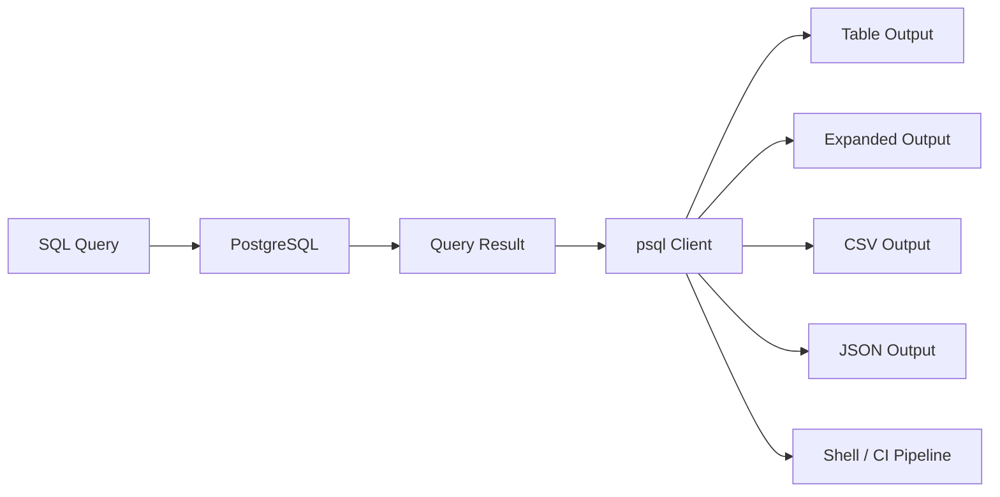

# 13- CLI Output Formatting

## Overview

CLI output formatting determines how database query results are rendered for humans, scripts, logs, and operational tooling.

For PostgreSQL, `psql` provides several output modes that are useful for different situations:

```text
Interactive investigation
        ↓
Human-readable table
        ↓
Expanded / vertical output
        ↓
Machine-readable output
        ↓
CSV / JSON
        ↓
CI/CD / automation
```

Good output formatting is not cosmetic. It affects:

- Readability during incidents
- Accuracy when interpreting results
- Shell scripting reliability
- Log volume
- Network and terminal usability
- Data export workflows
- Security and sensitive-data exposure

A senior backend engineer should know when to optimize output for a human and when to produce stable, machine-readable output for automation.

---

## `psql` Output Architecture

`psql` receives query results from PostgreSQL and then formats them on the client side.



The database returns rows and metadata.

`psql` controls much of the terminal presentation.

This means changing:

```text
\x
\pset
\t
\A
```

does not change how PostgreSQL executes the query.

It changes how the client displays the result.

---

## Default Table Output

A normal query:

```sql
SELECT
    id,
    email,
    status,
    created_at
FROM app.customers
ORDER BY id
LIMIT 10;
```

produces tabular output similar to:

```text
  id  |        email         | status  |       created_at
------+----------------------+---------+------------------------
 101  | user1@example.com   | active  | 2026-09-01 10:00:00+00
 102  | user2@example.com   | active  | 2026-09-01 10:05:00+00
```

This is usually the best format for interactive investigation.

Advantages:

- Easy to scan
- Column names are visible
- Rows are aligned
- Suitable for moderate result sizes

Limitations:

- Wide rows become difficult to read
- Not ideal for scripts
- Large text fields can make the terminal unwieldy

---

## Expanded Display

Enable expanded output:

```text
\x on
```

Then:

```sql
SELECT
    id,
    email,
    status,
    created_at
FROM app.customers
WHERE id = 101;
```

Output becomes conceptually:

```text
-[ RECORD 1 ]-------------------------
id         | 101
email      | user1@example.com
status     | active
created_at | 2026-09-01 10:00:00+00
```

This is useful for:

- Wide rows
- JSON-heavy records
- Configuration records
- Incident investigation
- Inspecting one or a few records

Disable it:

```text
\x off
```

Toggle it:

```text
\x
```

---

## Automatic Expanded Mode

`psql` can use automatic expanded display:

```text
\x auto
```

With automatic mode, `psql` decides whether expanded output is appropriate based on the terminal width and result shape.

This is often convenient for interactive sessions.

For repeatable scripts, explicit output configuration is usually preferable.

---

## Border Styles

`psql` supports different border styles.

Inspect the current setting:

```text
\pset border
```

Set a border:

```text
\pset border 1
```

or:

```text
\pset border 2
```

Border styles mainly affect human-readable presentation.

They should not be relied upon when writing scripts that parse output.

---

## Table Alignment

Default aligned output is useful for humans:

```text
\pset format aligned
```

For example:

```text
 id | status  | amount
----+---------+--------
  1 | paid    | 100.00
  2 | pending | 250.00
```

For machine processing, unaligned output is often better.

---

## Unaligned Output

Enable:

```text
\pset format unaligned
```

or:

```text
\A
```

Output becomes similar to:

```text
1|paid|100.00
2|pending|250.00
```

This is useful for shell pipelines and simple scripts.

The field separator can also be configured:

```text
\pset fieldsep ','
```

However, for actual CSV data, prefer PostgreSQL's CSV output mechanisms rather than manually creating CSV with separators.

---

## Tuples-Only Output

Disable headers and footers:

```text
\t on
```

or:

```text
\pset tuples_only on
```

Example:

```bash
psql \
    -d appdb \
    -At \
    -c "SELECT id FROM app.customers WHERE status = 'active';"
```

Output:

```text
101
102
103
```

This is particularly useful when passing query results to shell commands.

---

## Common Shell Pipeline

For example:

```bash
psql \
    -d appdb \
    -At \
    -c "SELECT id FROM app.customers WHERE status = 'active';" |
while read -r customer_id; do
    echo "Processing ${customer_id}"
done
```

The important design principle is:

```text
Database
    ↓
Stable machine-readable output
    ↓
Shell pipeline
```

Do not build automation around visually formatted table output.

---

## `psql` Command-Line Output Flags

Common flags:

| Flag | Purpose |
|---|---|
| `-A` | Unaligned output |
| `-t` | Tuples only |
| `-q` | Quiet mode |
| `-X` | Do not read startup file |
| `-P` | Set `\pset` options |
| `-F` | Set field separator |
| `-R` | Set record separator |
| `-o` | Write query output to file |
| `-f` | Execute commands from file |
| `-c` | Execute command |
| `-v` | Set `psql` variable |
| `--csv` | Use CSV output |

A compact diagnostic command:

```bash
psql \
    -d appdb \
    -At \
    -c "SELECT COUNT(*) FROM app.orders;"
```

---

## CSV Output

For CSV output:

```bash
psql \
    --csv \
    -d appdb \
    -c "SELECT id, email, status FROM app.customers;"
```

This is preferable to trying to construct CSV manually using:

```text
\pset fieldsep ','
```

because proper CSV requires correct handling of:

```text
Quotes
Embedded commas
Newlines
Escaping
NULL values
```

---

## CSV Export with `\copy`

For a client-side CSV export:

```text
\copy (
    SELECT
        id,
        email,
        status,
        created_at
    FROM app.customers
    WHERE status = 'active'
) TO './active-customers.csv' WITH (FORMAT csv, HEADER true)
```

This is useful because the output file is created on the machine running `psql`.

Conceptually:

```text
PostgreSQL
    ↓
Query result
    ↓
psql
    ↓
Local CSV file
```

This differs from server-side `COPY`.

---

## `COPY` vs `\copy`

| Feature | `COPY` | `\copy` |
|---|---|---|
| Executed by | PostgreSQL server | `psql` client |
| File location | Server filesystem | Client filesystem |
| Useful for | Server-controlled bulk operations | Local exports/imports |
| Filesystem permissions | PostgreSQL server user | CLI user's OS permissions |
| Common developer use | Less convenient | Very convenient |

Example server-side operation:

```sql
COPY app.customers
TO '/var/lib/postgresql/customers.csv'
WITH (FORMAT csv, HEADER true);
```

Example client-side operation:

```text
\copy app.customers TO './customers.csv' WITH (FORMAT csv, HEADER true)
```

Choose based on where the file should exist and which system has permission to access it.

---

## JSON Output

For structured query results, PostgreSQL can produce JSON directly.

Single JSON object:

```sql
SELECT json_build_object(
    'id', id,
    'email', email,
    'status', status
)
FROM app.customers
WHERE id = 101;
```

JSON array:

```sql
SELECT json_agg(
    json_build_object(
        'id', id,
        'email', email,
        'status', status
    )
)
FROM app.customers
WHERE status = 'active';
```

For JSONB:

```sql
SELECT jsonb_agg(
    jsonb_build_object(
        'id', id,
        'email', email
    )
)
FROM app.customers
WHERE status = 'active';
```

This is useful when the downstream consumer expects JSON rather than human-readable SQL output.

---

## JSON vs CSV

| Requirement | Preferred format |
|---|---|
| Human inspection | Aligned table |
| Wide single record | Expanded |
| Simple shell value | Tuples-only |
| Spreadsheet/data exchange | CSV |
| Structured API-like output | JSON |
| Bulk data loading | `COPY` / `\copy` |
| CI/CD scalar check | Unaligned + tuples-only |

Choose the format according to the consumer.

---

## Output to a File

Inside `psql`:

```text
\o query-results.txt
```

Run:

```sql
SELECT
    id,
    email,
    status
FROM app.customers
LIMIT 100;
```

Stop redirection:

```text
\o
```

Everything printed by `psql` during redirection may be written to the specified file, depending on the command and output mode.

For predictable exports, prefer explicit export facilities such as:

```text
\copy
--csv
```

rather than relying on terminal output capture.

---

## Command-Line Output File

Use:

```bash
psql \
    -d appdb \
    -o query-results.txt \
    -c "SELECT id, email FROM app.customers LIMIT 100;"
```

This is useful for:

```text
Operational reports
Debugging
CI artifacts
Temporary diagnostics
```

Be careful with files containing:

```text
Customer information
Tokens
Emails
Internal identifiers
Financial information
```

They may remain on developer machines, CI runners, or shared systems.

---

## Quiet Mode

Use:

```bash
psql \
    -q \
    -d appdb \
    -c "SELECT COUNT(*) FROM app.orders;"
```

Quiet mode reduces some client-generated output.

This is useful in automation where unnecessary messages make output harder to consume.

For scripts, combine it with explicit output formatting:

```bash
psql \
    -qAt \
    -d appdb \
    -c "SELECT COUNT(*) FROM app.orders;"
```

---

## Machine-Readable Output

For automation, a common pattern is:

```bash
psql \
    -X \
    -qAt \
    -v ON_ERROR_STOP=1 \
    -d appdb \
    -c "SELECT COUNT(*) FROM app.orders;"
```

The options provide a more predictable execution environment:

```text
-X
    Ignore user startup configuration

-q
    Quiet mode

-A
    Unaligned output

-t
    Tuples only

-v ON_ERROR_STOP=1
    Stop when SQL errors occur
```

This is much safer for CI/CD than parsing human-formatted output.

---

## Why `-X` Matters in Automation

`psql` can read a startup configuration file such as:

```text
~/.psqlrc
```

That file may contain:

```text
Formatting changes
Aliases
Variables
Hooks
Display configuration
```

An engineer's local `.psqlrc` can therefore change command behavior or output.

For reproducible automation:

```bash
psql -X ...
```

prevents the user's startup file from affecting the session.

This is a small option with significant value in CI/CD.

---

## Field Separators

For unaligned output:

```text
\pset fieldsep '|'
```

or:

```bash
psql \
    -A \
    -F $'\t' \
    -t \
    -d appdb \
    -c "SELECT id, email FROM app.customers;"
```

However, custom separators are not a replacement for CSV when field values can contain the separator.

Use:

```text
--csv
```

or:

```text
\copy ... WITH (FORMAT csv)
```

when interoperable CSV is required.

---

## Record Separators

The record separator can be configured:

```text
\pset recordsep '\n'
```

This can be useful for specialized shell processing.

For robust automation, however, prefer formats where delimiters and escaping are well-defined rather than relying on ad hoc parsing.

---

## Null Display

`psql` can customize how `NULL` values are displayed.

For example:

```text
\pset null '<NULL>'
```

Then:

```sql
SELECT
    id,
    email,
    deleted_at
FROM app.customers
LIMIT 5;
```

A result might distinguish:

```text
NULL
```

from an empty string:

```text
''
```

This distinction is useful during data-quality investigations.

Be careful when using customized NULL markers in scripts.

---

## Pager Usage

Large output can be sent through a pager.

Check:

```text
\pset pager
```

Enable:

```text
\pset pager on
```

Disable:

```text
\pset pager off
```

A pager is useful for:

```text
Long catalog output
Large query plans
Configuration inspection
Schema inspection
```

For automation, disable interactive paging:

```bash
psql \
    -P pager=off \
    -d appdb \
    -c "SELECT ...;"
```

A CI job should never unexpectedly wait for an interactive pager.

---

## Query Timing

Enable timing:

```text
\timing on
```

Example:

```sql
SELECT COUNT(*)
FROM app.orders;
```

Output may include:

```text
Time: 52.314 ms
```

This is useful for interactive diagnostics.

It is not a complete benchmark because measured time can include:

```text
Query execution
Result transfer
Client rendering
Network latency
Server load
Cache state
```

For serious performance analysis, use:

```sql
EXPLAIN (ANALYZE, BUFFERS)
```

and workload-level metrics.

---

## Query Plans and Output Formatting

Query plans can become very wide.

Use:

```text
\x on
```

before:

```sql
EXPLAIN (ANALYZE, BUFFERS, FORMAT JSON)
SELECT
    id,
    email
FROM app.customers
WHERE status = 'active';
```

For automation, JSON plans are easier to process than terminal-formatted plans.

Example:

```sql
EXPLAIN (
    ANALYZE,
    BUFFERS,
    FORMAT JSON
)
SELECT
    id,
    email
FROM app.customers
WHERE status = 'active';
```

This can integrate with:

```text
Performance tooling
CI checks
Plan analysis
Regression detection
```

---

## Output Formatting for Incident Response

During an incident, optimize for information density.

Instead of:

```sql
SELECT *
FROM pg_stat_activity;
```

use:

```sql
SELECT
    pid,
    usename,
    application_name,
    state,
    now() - query_start AS duration,
    wait_event_type,
    wait_event,
    left(query, 200) AS query
FROM pg_stat_activity
WHERE state <> 'idle'
ORDER BY query_start;
```

Then:

```text
\x auto
```

or:

```text
\x on
```

depending on the result width.

The goal is to make the important operational fields immediately visible.

---

## Output Formatting for CI/CD

CI should favor:

```text
Stable
Minimal
Machine-readable
Deterministic
Non-interactive
```

Example:

```bash
result="$(
    psql \
        -X \
        -qAt \
        -v ON_ERROR_STOP=1 \
        -d appdb \
        -c "SELECT COUNT(*) FROM app.orders;"
)"

echo "Orders: ${result}"
```

A migration verification step could use:

```bash
psql \
    -X \
    -qAt \
    -v ON_ERROR_STOP=1 \
    -d appdb \
    -c "SELECT to_regclass('app.orders');"
```

Then the shell can evaluate the result without parsing table borders or headers.

---

## Output Formatting for Kubernetes

A diagnostic command:

```bash
kubectl exec -i postgres-0 -n database -- \
    psql \
    -X \
    -qAt \
    -U app_readonly \
    -d appdb \
    -c "SELECT COUNT(*) FROM app.orders;"
```

This is useful because the output is compact and does not depend on terminal width.

For interactive investigation:

```bash
kubectl exec -it postgres-0 -n database -- \
    psql \
    -U app_readonly \
    -d appdb
```

Then use:

```text
\x auto
```

for wide records.

---

## Output Formatting for Shell Scripts

Prefer:

```bash
psql -X -qAt ...
```

over:

```bash
psql ...
```

when the result is consumed by a shell script.

For example:

```bash
customer_count="$(
    psql \
        -X \
        -qAt \
        -v ON_ERROR_STOP=1 \
        -d appdb \
        -c "SELECT COUNT(*) FROM app.customers;"
)"

if [ "$customer_count" -gt 0 ]; then
    echo "Customers exist"
fi
```

This is much less fragile than parsing:

```text
customer_count
--------------
123
(1 row)
```

---

## Avoid Parsing Human-Readable Output

Do not build scripts around:

```text
psql table borders
column alignment
row-count footer
pager output
terminal width
```

Human output is optimized for humans.

Automation should use:

```text
-q
-A
-t
--csv
JSON
explicit separators
```

depending on the requirement.

---

## Output Formatting and Security

CLI output can expose sensitive information.

A query such as:

```sql
SELECT *
FROM app.users;
```

may expose:

```text
Email addresses
Phone numbers
Internal identifiers
Authentication metadata
Personal information
```

Output can also be persisted accidentally through:

```text
Shell history
Terminal recording
CI logs
Command logs
Pager buffers
Redirected files
Chat transcripts
```

Use narrow projections:

```sql
SELECT
    id,
    status
FROM app.users
LIMIT 100;
```

and use read-only, least-privileged accounts for diagnostics.

---

## Prevent Sensitive Data in CI Logs

Avoid:

```bash
psql -c "SELECT email, password_hash FROM app.users;"
```

inside CI.

Even if the database connection is secure, the resulting output can become a long-lived CI artifact or log.

Prefer:

```sql
SELECT COUNT(*)
FROM app.users
WHERE status = 'active';
```

or another aggregate that answers the operational question without exposing records.

---

## Large Result Sets

Do not use CLI output as a replacement for a data-export pipeline.

This is risky:

```bash
psql -d appdb -c "SELECT * FROM huge_table;"
```

Potential effects include:

```text
Large database workload
High network transfer
Terminal flooding
High local memory usage
Large logs
Accidental sensitive-data exposure
```

For large datasets, use:

```text
\copy
COPY
pg_dump
ETL pipelines
Object storage
Analytics systems
```

depending on the actual requirement.

---

## Formatting and Performance

Formatting itself can consume client-side resources.

For a query returning millions of rows:

```text
Database execution
    ↓
Network transfer
    ↓
psql formatting
    ↓
Terminal rendering
```

The database query may finish efficiently while the CLI remains busy rendering the result.

Therefore:

```sql
SELECT ...
LIMIT 100;
```

is often preferable during interactive investigation.

For bulk export, use an appropriate bulk-transfer mechanism rather than terminal rendering.

---

## Configuration Reference

| Setting | Example | Primary use |
|---|---|---|
| Expanded | `\x auto` | Wide result inspection |
| Format | `\pset format aligned` | Human-readable tables |
| Unaligned | `\A` | Simple machine output |
| Tuples only | `\t` | Remove headers |
| Field separator | `\pset fieldsep '|'` | Custom delimited output |
| NULL display | `\pset null '<NULL>'` | Distinguish NULL values |
| Pager | `\pset pager off` | Non-interactive sessions |
| Timing | `\timing on` | Interactive timing |
| Output file | `\o results.txt` | Redirect client output |
| CSV | `--csv` | Structured CSV |
| Quiet | `-q` | Reduce client chatter |
| No startup file | `-X` | Reproducible automation |
| Error stop | `ON_ERROR_STOP=1` | Fail scripts on SQL errors |

---

## Recommended Modes by Use Case

| Use case | Recommended mode |
|---|---|
| Explore a table | Aligned output |
| Inspect one wide row | `\x on` |
| Inspect varying-width records | `\x auto` |
| Incident response | Explicit columns + bounded result + `\x auto` |
| Shell scalar | `-At` |
| CI/CD | `-X -qAt -v ON_ERROR_STOP=1` |
| CSV export | `--csv` or `\copy ... FORMAT csv` |
| Large data export | `COPY` / `\copy` |
| Query plan automation | `FORMAT JSON` |
| Human-readable report | Aligned output / CSV |
| Sensitive-data investigation | Narrow projection + read-only role |

---

## Common Mistakes

### Parsing Aligned Output

This is fragile:

```bash
psql -c "SELECT id FROM app.customers;" | awk ...
```

Table borders, headers, spacing, and footers can break the parser.

Use:

```bash
psql -At -c "SELECT id FROM app.customers;"
```

instead.

### Forgetting `-X` in CI

A developer's `.psqlrc` can change output behavior.

Use:

```bash
psql -X ...
```

for reproducible automation.

### Forgetting `ON_ERROR_STOP`

A SQL failure may otherwise not cause the desired script failure behavior.

Use:

```bash
-v ON_ERROR_STOP=1
```

for scripts where SQL errors must stop execution.

### Using Custom Separators for Real CSV

A comma separator does not automatically provide correct CSV escaping.

Use:

```text
--csv
```

or:

```text
\copy ... WITH (FORMAT csv)
```

### Dumping Large Tables to the Terminal

Use an export mechanism instead.

### Leaving the Pager Enabled in CI

Non-interactive jobs can hang or produce unusable output.

Use:

```bash
-P pager=off
```

when appropriate.

### Selecting Sensitive Columns During Debugging

Only retrieve the data necessary to answer the operational question.

### Treating CLI Timing as a Benchmark

Use query plans and workload-level observability for serious performance analysis.

### Assuming `\x` Changes Query Performance

It only changes client-side presentation.

### Using Human Output for Automation

Human-readable formatting is not a stable machine interface.

---

## Production Output Strategy

A useful operational standard is:

```text
Interactive engineer
    ↓
Aligned / expanded output

Shell script
    ↓
Unaligned + tuples-only

CI/CD
    ↓
-X + quiet + tuples-only + explicit error handling

Data export
    ↓
CSV / COPY / \copy

Structured diagnostics
    ↓
JSON

Performance analysis
    ↓
EXPLAIN / JSON plan
```

This separation keeps interactive workflows convenient without making automation dependent on terminal presentation.

---

## Practical Incident Example

Suppose an API reports unusually high order-processing latency.

Start with:

```sql
SELECT
    pid,
    usename,
    application_name,
    state,
    now() - query_start AS duration,
    wait_event_type,
    wait_event,
    left(query, 250) AS query
FROM pg_stat_activity
WHERE state <> 'idle'
ORDER BY query_start;
```

For a wide result:

```text
\x auto
```

Then investigate the suspected query:

```sql
EXPLAIN (
    ANALYZE,
    BUFFERS,
    FORMAT JSON
)
SELECT
    id,
    customer_id,
    status,
    created_at
FROM app.orders
WHERE customer_id = 123
ORDER BY created_at DESC
LIMIT 100;
```

The output can then be:

```text
Human-readable
    → \x auto

Machine-readable
    → FORMAT JSON
```

The database query remains the same; the representation is optimized for the consumer.

---

## Senior Engineering Perspective

Output formatting should be treated as part of the interface between PostgreSQL and the operator or automation system.

The right question is not:

> Which `psql` formatting option looks best?

The better question is:

```text
Who consumes this output?
        ↓
Human?
Shell?
CI?
Monitoring?
Data pipeline?
Application?
        ↓
Choose the appropriate representation
```

This leads to a robust rule:

```text
Human → readable
Automation → deterministic
Data export → structured
Performance tooling → machine-readable
Sensitive investigation → minimal
```

A well-designed CLI workflow minimizes both operational ambiguity and accidental system impact.

---

## Key Takeaways

- **Choose output format based on the consumer:** aligned and expanded output are optimized for humans, while tuples-only, CSV, and JSON are better for automation and structured processing.
- **Make automation deterministic:** use options such as `-X`, `-q`, `-A`, `-t`, and `ON_ERROR_STOP=1` instead of parsing human-oriented terminal output.
- **Use `\copy` and CSV for exports:** do not dump large datasets through terminal formatting, and do not treat custom separators as a substitute for proper CSV encoding.
- **Treat CLI output as a security boundary:** select only required columns, use least-privileged accounts, and avoid exposing sensitive data in terminals, CI logs, or exported files.
- **Separate presentation from database performance:** `psql` formatting changes client-side rendering; use `EXPLAIN`, `EXPLAIN ANALYZE`, statistics, and workload metrics for actual query-performance analysis.