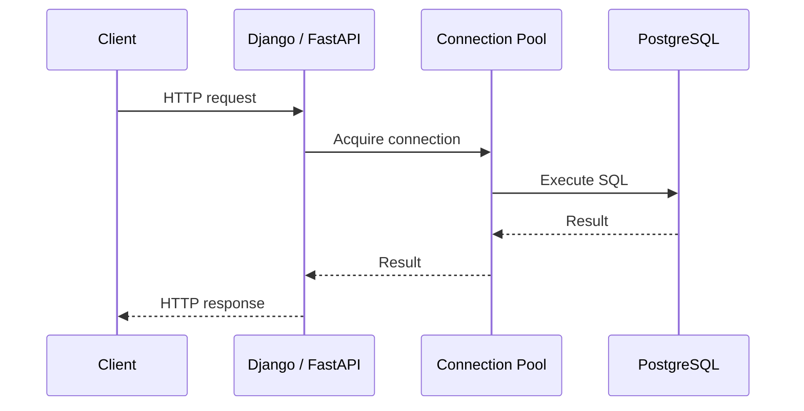
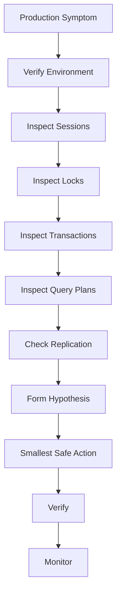

# 14- Practical SQL CLI Workflows

## Overview

Practical SQL CLI work is less about individual commands and more about developing repeatable workflows for investigation, validation, troubleshooting, maintenance, and controlled production operations.

For PostgreSQL, `psql` is the primary interface. A useful operational workflow combines:

```text
Verify target
    ↓
Inspect state
    ↓
Form a hypothesis
    ↓
Run a bounded query
    ↓
Inspect execution / locks / statistics
    ↓
Make the smallest safe change
    ↓
Verify
    ↓
Monitor
```

The same workflow applies whether the database is accessed from:

- A developer workstation
- Docker
- Kubernetes
- AWS
- A bastion host
- CI/CD
- An incident-response environment

The SQL changes, but the engineering discipline should remain consistent.

---

## The Production CLI Mindset

Before running SQL against a production database, answer:

```text
Where am I?
Who am I?
What database am I connected to?
Is this the primary?
What data will this query touch?
Could it acquire locks?
Could it consume significant resources?
Could it expose sensitive information?
How will I verify the result?
```

A useful first command is:

```text
\conninfo
```

Follow it with:

```sql
SELECT
    current_database(),
    current_user,
    inet_server_addr(),
    inet_server_port(),
    pg_is_in_recovery();
```

Do not skip this because the terminal prompt "looks familiar."

---

## Establishing a Safe Session

A production diagnostic session should generally use a dedicated read-only role.

Example:

```bash
psql \
    -h db.example.internal \
    -p 5432 \
    -U app_readonly \
    -d appdb
```

Immediately verify:

```sql
SELECT
    current_database() AS database,
    current_user AS user,
    inet_server_addr() AS server,
    pg_is_in_recovery() AS is_replica;
```

For a read-only diagnostic transaction:

```sql
BEGIN READ ONLY;

SET LOCAL statement_timeout = '5s';

SELECT
    ...
;

COMMIT;
```

This creates useful safety boundaries, but least privilege remains the primary control.

---

## Workflow: Inspect an Unknown Database

When connecting to an unfamiliar environment, inspect progressively.

```text
Connection
    ↓
Database
    ↓
Schemas
    ↓
Tables
    ↓
Columns
    ↓
Constraints
    ↓
Indexes
    ↓
Triggers / Functions
    ↓
Privileges / RLS
```

Start with:

```text
\conninfo
\l+
\dn+
```

Then:

```text
\dt *.*
\dv *.*
\di *.*
```

Inspect a specific table:

```text
\d+ app.orders
```

This prevents assumptions based on outdated migration files or ORM models.

---

## Workflow: Understand a Table Before Querying It

Start with:

```text
\d+ app.orders
```

Inspect:

```text
Columns
Types
Nullability
Defaults
Primary key
Foreign keys
Indexes
Triggers
```

Then inspect index definitions:

```sql
SELECT
    indexname,
    indexdef
FROM pg_indexes
WHERE schemaname = 'app'
  AND tablename = 'orders'
ORDER BY indexname;
```

Then inspect approximate table size:

```sql
SELECT
    pg_size_pretty(pg_relation_size('app.orders')) AS table_size,
    pg_size_pretty(pg_indexes_size('app.orders')) AS index_size,
    pg_size_pretty(pg_total_relation_size('app.orders')) AS total_size;
```

This provides enough context to design a safe diagnostic query.

---

## Workflow: Find a Specific Record

Suppose an API reports an order ID of `12345`.

Start narrowly:

```sql
SELECT
    id,
    customer_id,
    status,
    total_amount,
    created_at,
    updated_at
FROM app.orders
WHERE id = 12345;
```

Avoid:

```sql
SELECT *
FROM app.orders
WHERE id = 12345;
```

unless every column is genuinely required.

For a production investigation, narrow projections reduce accidental exposure and make the result easier to interpret.

---

## Workflow: Investigate Record History

Start with timestamps:

```sql
SELECT
    id,
    status,
    created_at,
    updated_at
FROM app.orders
WHERE id = 12345;
```

If the application maintains an audit table:

```sql
SELECT
    occurred_at,
    actor_id,
    action,
    metadata
FROM app.audit_events
WHERE resource_type = 'order'
  AND resource_id = '12345'
ORDER BY occurred_at DESC
LIMIT 100;
```

This combines current state with historical state.

A database query alone cannot reconstruct history if the system never recorded the required events.

---

## Workflow: Find Recent Records

Use an explicit time boundary:

```sql
SELECT
    id,
    status,
    created_at
FROM app.orders
WHERE created_at >= now() - INTERVAL '1 hour'
ORDER BY created_at DESC
LIMIT 100;
```

For a fixed operational window:

```sql
SELECT
    id,
    status,
    created_at
FROM app.orders
WHERE created_at >= TIMESTAMPTZ '2026-09-04 00:00:00+00'
  AND created_at < TIMESTAMPTZ '2026-09-05 00:00:00+00'
ORDER BY created_at DESC
LIMIT 100;
```

Half-open ranges are usually preferable for time windows:

```text
[start, end)
```

because adjacent windows do not overlap.

---

## Workflow: Find Data Anomalies

Suppose every completed order should have a non-null payment reference.

```sql
SELECT
    id,
    payment_id,
    status
FROM app.orders
WHERE status = 'completed'
  AND payment_id IS NULL
ORDER BY id
LIMIT 100;
```

This is useful for:

```text
Data-quality checks
Migration validation
Incident investigation
Background-job failures
Application bugs
```

The CLI becomes a lightweight operational data-quality tool.

---

## Workflow: Detect Duplicates

For duplicate business identifiers:

```sql
SELECT
    external_id,
    COUNT(*) AS occurrences
FROM app.orders
WHERE external_id IS NOT NULL
GROUP BY external_id
HAVING COUNT(*) > 1
ORDER BY occurrences DESC;
```

Inspect the affected rows:

```sql
SELECT
    id,
    external_id,
    status,
    created_at
FROM app.orders
WHERE external_id = 'external-123'
ORDER BY created_at;
```

If duplicates should be impossible, investigate whether the database has an appropriate unique constraint.

Do not immediately delete duplicate rows.

First determine:

```text
Which record is authoritative?
Are other tables referencing them?
Did the application retry?
Was the operation concurrent?
Should uniqueness be enforced by the database?
```

---

## Workflow: Validate a Foreign-Key Relationship

Find orders referencing a customer:

```sql
SELECT
    id,
    customer_id,
    status
FROM app.orders
WHERE customer_id = 123
ORDER BY id
LIMIT 100;
```

Find customers with no orders:

```sql
SELECT
    c.id,
    c.email
FROM app.customers AS c
LEFT JOIN app.orders AS o
    ON o.customer_id = c.id
WHERE o.id IS NULL
LIMIT 100;
```

If the schema contains a foreign key, orphaned rows should normally be impossible unless constraints were bypassed, disabled, or the data was introduced through another mechanism.

---

## Workflow: Validate a Migration

After deploying a schema migration, verify the actual database.

Check the table:

```text
\d+ app.orders
```

Check indexes:

```sql
SELECT
    indexname,
    indexdef
FROM pg_indexes
WHERE schemaname = 'app'
  AND tablename = 'orders';
```

Check a new column:

```sql
SELECT
    column_name,
    data_type,
    is_nullable,
    column_default
FROM information_schema.columns
WHERE table_schema = 'app'
  AND table_name = 'orders'
  AND column_name = 'processed_at';
```

The principle is:

```text
Migration applied
    ≠
Application assumption

Verify actual database state.
```

---

## Workflow: Validate an Index

First inspect the index:

```sql
SELECT
    indexname,
    indexdef
FROM pg_indexes
WHERE schemaname = 'app'
  AND tablename = 'orders';
```

Then test the relevant query:

```sql
EXPLAIN (ANALYZE, BUFFERS)
SELECT
    id,
    status
FROM app.orders
WHERE customer_id = 123
ORDER BY created_at DESC
LIMIT 100;
```

Look for:

```text
Scan type
Index used
Estimated rows
Actual rows
Loops
Buffers
Execution time
```

Do not conclude that an index is useful merely because it exists.

---

## Workflow: Investigate a Slow Query

Start with the exact SQL.

Then:

```sql
EXPLAIN
SELECT
    id,
    customer_id,
    status
FROM app.orders
WHERE customer_id = 123
ORDER BY created_at DESC
LIMIT 100;
```

If safe:

```sql
EXPLAIN (ANALYZE, BUFFERS)
SELECT
    id,
    customer_id,
    status
FROM app.orders
WHERE customer_id = 123
ORDER BY created_at DESC
LIMIT 100;
```

Investigate:

```text
Estimated rows vs actual rows
Sequential scans
Index scans
Bitmap scans
Sort operations
Join algorithms
Buffer reads/hits
Temporary I/O
Execution time
```

Then correlate with workload-level information such as:

```sql
SELECT
    queryid,
    calls,
    total_exec_time,
    mean_exec_time,
    rows,
    shared_blks_read,
    shared_blks_hit,
    query
FROM pg_stat_statements
ORDER BY total_exec_time DESC
LIMIT 20;
```

---

## Workflow: Investigate High API Latency

Do not assume:

```text
API slow
    =
SQL slow
```

The actual path is:



Investigate each component:

```text
Request latency
Connection acquisition
Query execution
Lock waits
Result transfer
Serialization
Application processing
```

A query may execute quickly while the application waits for a connection.

---

## Workflow: Find Connection Pool Pressure

Inspect PostgreSQL sessions:

```sql
SELECT
    usename,
    application_name,
    state,
    COUNT(*) AS connections
FROM pg_stat_activity
GROUP BY
    usename,
    application_name,
    state
ORDER BY connections DESC;
```

Then inspect total connections:

```sql
SELECT COUNT(*)
FROM pg_stat_activity;
```

Compare against:

```sql
SHOW max_connections;
```

For application pools, calculate the aggregate potential:

```text
Pods
× Worker processes
× Pool size
```

A service with:

```text
20 pods
× 4 workers
× 10 connections
```

can potentially create:

```text
800 connections
```

before considering other services.

---

## Workflow: Find Long-Running Queries

```sql
SELECT
    pid,
    usename,
    application_name,
    state,
    now() - query_start AS duration,
    wait_event_type,
    wait_event,
    left(query, 300) AS query
FROM pg_stat_activity
WHERE state <> 'idle'
  AND query_start IS NOT NULL
ORDER BY query_start;
```

A long-running query is not automatically problematic.

Determine:

```text
Expected or unexpected?
Read or write?
Blocking others?
Consuming excessive resources?
Reporting workload?
Migration?
```

---

## Workflow: Find Long-Running Transactions

```sql
SELECT
    pid,
    usename,
    application_name,
    state,
    now() - xact_start AS transaction_age,
    wait_event_type,
    wait_event,
    left(query, 300) AS query
FROM pg_stat_activity
WHERE xact_start IS NOT NULL
ORDER BY xact_start;
```

Pay special attention to:

```text
idle in transaction
```

Long-running transactions can prevent cleanup of old row versions and contribute to:

```text
Table growth
Vacuum pressure
Replication issues
Lock retention
Resource consumption
```

---

## Workflow: Investigate Blocking

Start with blocked sessions:

```sql
SELECT
    pid,
    pg_blocking_pids(pid) AS blocking_pids,
    wait_event_type,
    wait_event,
    left(query, 300) AS query
FROM pg_stat_activity
WHERE cardinality(pg_blocking_pids(pid)) > 0;
```

Then inspect the blocking PID:

```sql
SELECT
    pid,
    usename,
    application_name,
    state,
    xact_start,
    query_start,
    wait_event_type,
    wait_event,
    query
FROM pg_stat_activity
WHERE pid = 12345;
```

The workflow is:

```text
Blocked session
    ↓
Blocking PID
    ↓
Blocking transaction
    ↓
Application source
    ↓
Root cause
```

Do not terminate a session before understanding the transaction.

---

## Workflow: Handle a Blocking Incident

First attempt to identify the cause.

If the current query is the problem:

```sql
SELECT pg_cancel_backend(12345);
```

If the session itself must be terminated:

```sql
SELECT pg_terminate_backend(12345);
```

Afterward verify:

```sql
SELECT
    pid,
    state,
    query
FROM pg_stat_activity
WHERE pid = 12345;
```

Then verify application behavior.

Terminating a backend is an operational action, not merely a SQL command.

---

## Workflow: Investigate Failed Background Jobs

Suppose Celery reports repeated failures.

Check application state:

```sql
SELECT
    id,
    status,
    updated_at
FROM app.orders
WHERE status = 'processing'
ORDER BY updated_at
LIMIT 100;
```

Look for stale records:

```sql
SELECT
    id,
    status,
    updated_at
FROM app.orders
WHERE status = 'processing'
  AND updated_at < now() - INTERVAL '30 minutes'
ORDER BY updated_at
LIMIT 100;
```

Then correlate with:

```text
Celery logs
Application logs
Request IDs
Database transactions
Locks
Kafka events
```

The CLI provides database evidence; it does not replace application-level observability.

---

## Workflow: Investigate a Queue Table

A PostgreSQL-backed worker queue may use:

```sql
SELECT
    id,
    status,
    available_at
FROM app.jobs
WHERE status = 'pending'
  AND available_at <= now()
ORDER BY available_at, id
LIMIT 100;
```

Workers may claim work using:

```sql
SELECT
    id
FROM app.jobs
WHERE status = 'pending'
  AND available_at <= now()
ORDER BY available_at, id
FOR UPDATE SKIP LOCKED
LIMIT 10;
```

`SKIP LOCKED` allows concurrent workers to avoid waiting for rows already claimed by another worker.

This pattern is useful for queue-like workloads but should be designed carefully around:

```text
Retries
Visibility timeout
Failure handling
Idempotency
Starvation
Transaction duration
```

---

## Workflow: Investigate a Stuck Queue

Check queue depth:

```sql
SELECT
    status,
    COUNT(*) AS jobs
FROM app.jobs
GROUP BY status
ORDER BY status;
```

Check oldest pending work:

```sql
SELECT
    id,
    available_at,
    created_at
FROM app.jobs
WHERE status = 'pending'
ORDER BY available_at, id
LIMIT 20;
```

Check processing age:

```sql
SELECT
    id,
    worker_id,
    updated_at,
    now() - updated_at AS processing_age
FROM app.jobs
WHERE status = 'processing'
ORDER BY updated_at
LIMIT 20;
```

Then correlate with worker health.

---

## Workflow: Investigate Data Growth

Inspect the largest tables:

```sql
SELECT
    schemaname,
    relname,
    pg_size_pretty(
        pg_total_relation_size(relid)
    ) AS total_size
FROM pg_stat_user_tables
ORDER BY pg_total_relation_size(relid) DESC
LIMIT 20;
```

Inspect table/index breakdown:

```sql
SELECT
    pg_size_pretty(pg_relation_size('app.orders')) AS table_size,
    pg_size_pretty(pg_indexes_size('app.orders')) AS index_size,
    pg_size_pretty(pg_total_relation_size('app.orders')) AS total_size;
```

Then investigate:

```text
Data growth
Index growth
Dead tuples
Retention
Partitioning
Archive strategy
Large JSON fields
Audit history
```

Do not immediately delete data simply because disk usage increased.

---

## Workflow: Investigate Table Statistics

Inspect table statistics:

```sql
SELECT
    relname,
    n_live_tup,
    n_dead_tup,
    last_vacuum,
    last_autovacuum,
    last_analyze,
    last_autoanalyze
FROM pg_stat_user_tables
WHERE schemaname = 'app'
ORDER BY n_dead_tup DESC;
```

This can identify tables that may need investigation for:

```text
Dead tuple accumulation
Autovacuum behavior
Statistics freshness
Write-heavy workloads
Long-running transactions
```

If statistics are stale after a significant data change:

```sql
ANALYZE app.orders;
```

---

## Workflow: Validate a Data Backfill

Suppose a migration populated a new column.

Check nulls:

```sql
SELECT COUNT(*)
FROM app.orders
WHERE processed_at IS NULL;
```

Check distribution:

```sql
SELECT
    DATE(processed_at) AS processing_date,
    COUNT(*) AS rows
FROM app.orders
WHERE processed_at IS NOT NULL
GROUP BY DATE(processed_at)
ORDER BY processing_date;
```

For large tables, avoid repeatedly scanning the entire dataset during business hours.

Use bounded checks or precomputed metrics where possible.

---

## Workflow: Safely Run a Data Correction

A controlled correction should generally be:

```text
Identify exact rows
    ↓
Inspect current values
    ↓
Define intended state
    ↓
Use transaction
    ↓
Perform smallest change
    ↓
Verify affected rows
    ↓
Commit
```

Example:

```sql
BEGIN;

SET LOCAL statement_timeout = '5s';

SELECT
    id,
    status
FROM app.orders
WHERE id = 12345
FOR UPDATE;

UPDATE app.orders
SET status = 'cancelled'
WHERE id = 12345
  AND status = 'pending';

SELECT
    id,
    status
FROM app.orders
WHERE id = 12345;

COMMIT;
```

The `WHERE` clause should encode the expected current state when possible.

This reduces the risk of overwriting a concurrent state transition.

---

## Workflow: Use Conditional Updates for Safety

Instead of:

```sql
UPDATE app.orders
SET status = 'cancelled'
WHERE id = 12345;
```

prefer when business rules permit:

```sql
UPDATE app.orders
SET status = 'cancelled'
WHERE id = 12345
  AND status = 'pending';
```

Then inspect:

```sql
SELECT
    id,
    status
FROM app.orders
WHERE id = 12345;
```

If the update affects zero rows, investigate rather than assuming failure.

The record may have transitioned concurrently.

---

## Workflow: Roll Back a Diagnostic Write

When experimenting with a controlled change:

```sql
BEGIN;

UPDATE app.orders
SET status = 'cancelled'
WHERE id = 12345;

SELECT
    id,
    status
FROM app.orders
WHERE id = 12345;

ROLLBACK;
```

This is useful when validating the behavior of a statement without committing it.

Do not assume rollback is sufficient for every database-side side effect. Consider triggers, external integrations, notifications, sequences, and application behavior.

---

## Workflow: Investigate Replica Lag

First identify whether the server is a replica:

```sql
SELECT pg_is_in_recovery();
```

On the primary, inspect replication:

```sql
SELECT
    pid,
    application_name,
    client_addr,
    state,
    sync_state,
    write_lag,
    flush_lag,
    replay_lag
FROM pg_stat_replication;
```

Large lag can affect:

```text
Read-after-write behavior
Reporting freshness
Failover readiness
Read routing
```

If an API reads immediately after writing, ensure the application does not route that read to a lagging replica when strong read-after-write behavior is required.

---

## Workflow: Validate Read Routing

A service may use:

```text
Writes → Primary
Reads  → Replicas
```

Test the primary:

```sql
SELECT
    inet_server_addr(),
    pg_is_in_recovery();
```

Run the same query against a replica.

If results differ, investigate:

```text
Replication lag
Transaction visibility
Application routing
Caching
Connection pooling
```

Do not assume different results indicate data corruption.

---

## Workflow: Investigate N+1 Queries

Suppose an API endpoint loads customers and then their orders.

Inspect application query logging first.

Then reproduce the expensive query:

```sql
EXPLAIN (ANALYZE, BUFFERS)
SELECT
    o.id,
    o.customer_id,
    o.created_at
FROM app.orders AS o
WHERE o.customer_id = 123;
```

The database may execute each individual query efficiently while the application performs hundreds of them.

The complete diagnosis requires:

```text
Request trace
+
Application query count
+
SQL execution time
+
Database plan
```

---

## Workflow: Validate ORM SQL

For Django:

```python
queryset = (
    Order.objects
    .filter(customer_id=123)
    .order_by("-created_at")[:100]
)

print(queryset.query)
```

Take the generated SQL and inspect it at the database layer.

Then:

```sql
EXPLAIN (ANALYZE, BUFFERS)
SELECT
    ...
;
```

The purpose is to connect:

```text
ORM abstraction
    ↓
Generated SQL
    ↓
Database plan
    ↓
Actual execution
```

This is one of the most useful debugging skills for ORM-heavy applications.

---

## Workflow: Export a Diagnostic Dataset

Use `\copy` rather than printing a large dataset:

```text
\copy (
    SELECT
        id,
        status,
        created_at
    FROM app.orders
    WHERE created_at >= CURRENT_DATE - INTERVAL '1 day'
) TO './orders-last-day.csv'
WITH (FORMAT csv, HEADER true)
```

This keeps the result structured.

For sensitive data, consider whether the export is actually necessary.

A local CSV containing production customer data becomes another security boundary.

---

## Workflow: Compare Environments

A migration may work in staging but fail in production due to schema drift.

Check indexes:

```sql
SELECT
    schemaname,
    tablename,
    indexname,
    indexdef
FROM pg_indexes
WHERE schemaname NOT IN (
    'pg_catalog',
    'information_schema'
)
ORDER BY schemaname, tablename, indexname;
```

Check columns:

```sql
SELECT
    table_schema,
    table_name,
    column_name,
    data_type,
    is_nullable
FROM information_schema.columns
WHERE table_schema NOT IN (
    'pg_catalog',
    'information_schema'
)
ORDER BY table_schema, table_name, ordinal_position;
```

Export the results from both environments and compare them.

This can reveal:

```text
Missing migrations
Unexpected indexes
Different column types
Schema drift
Environment-specific changes
```

---

## Workflow: Run Repeatable Diagnostics

Store common diagnostics in version-controlled SQL files.

Example:

```sql
-- diagnostics/orders.sql

SELECT
    status,
    COUNT(*) AS order_count
FROM app.orders
GROUP BY status
ORDER BY status;
```

Run:

```bash
psql \
    -X \
    -q \
    -v ON_ERROR_STOP=1 \
    -d appdb \
    -f diagnostics/orders.sql
```

Advantages:

- Repeatable
- Reviewable
- Version-controlled
- Easier to share
- Less operator error

Avoid putting environment-specific secrets inside SQL files.

---

## Workflow: Build a Shell Diagnostic

Example:

```bash
#!/usr/bin/env bash

set -euo pipefail

psql \
    -X \
    -qAt \
    -v ON_ERROR_STOP=1 \
    -d appdb \
    -c "
        SELECT
            current_database(),
            current_user,
            pg_is_in_recovery();
    "
```

For automation, use:

```text
-X
-q
-A
-t
ON_ERROR_STOP
```

as appropriate.

Do not depend on the formatting of interactive terminal output.

---

## Workflow: Validate Deployment Health

After a deployment:

```text
Application deployed
    ↓
Migration completed
    ↓
Database schema verified
    ↓
Critical query verified
    ↓
Connection pool healthy
    ↓
Replication healthy
    ↓
Application metrics healthy
```

A simple database check:

```sql
SELECT 1;
```

is useful but insufficient.

A better deployment verification might inspect an actual application table:

```sql
SELECT
    EXISTS (
        SELECT 1
        FROM information_schema.tables
        WHERE table_schema = 'app'
          AND table_name = 'orders'
    );
```

The appropriate health check should match the failure mode being tested.

---

## Workflow: Investigate Application Errors

Suppose logs contain:

```text
database connection timeout
```

Start with:

```sql
SELECT
    COUNT(*) AS connections
FROM pg_stat_activity;
```

Then:

```sql
SHOW max_connections;
```

Then inspect connection distribution:

```sql
SELECT
    usename,
    application_name,
    state,
    COUNT(*) AS connections
FROM pg_stat_activity
GROUP BY
    usename,
    application_name,
    state
ORDER BY connections DESC;
```

Possible causes include:

```text
Pool exhaustion
Connection leaks
Too many pods
Long-running transactions
Database saturation
Network issues
Connection storms
```

Do not increase `max_connections` blindly.

---

## Workflow: Investigate Lock Timeouts

Check waiting sessions:

```sql
SELECT
    pid,
    usename,
    application_name,
    state,
    wait_event_type,
    wait_event,
    query_start,
    left(query, 300) AS query
FROM pg_stat_activity
WHERE wait_event_type = 'Lock'
ORDER BY query_start;
```

Then:

```sql
SELECT
    pid,
    pg_blocking_pids(pid) AS blocking_pids
FROM pg_stat_activity
WHERE wait_event_type = 'Lock';
```

Investigate the blocking transaction before modifying timeout settings.

Increasing timeouts can hide contention rather than fix it.

---

## Workflow: Safely Investigate a Production Incident

A practical incident workflow:



The order matters.

Start with observation.

Only make changes after you understand enough of the system to predict their consequences.

---

## Production CLI Safety Rules

### Verify the Target

```sql
SELECT
    current_database(),
    current_user,
    inet_server_addr(),
    pg_is_in_recovery();
```

### Prefer Read-Only Access

Use a dedicated role such as:

```text
app_readonly
```

### Bound Queries

Prefer:

```sql
LIMIT 100
```

over unrestricted result sets.

### Use Timeouts

For controlled diagnostics:

```sql
SET LOCAL statement_timeout = '5s';
```

### Avoid Long Transactions

Do not leave:

```text
BEGIN;
```

open while investigating unrelated issues.

### Minimize Data Exposure

Select only required columns.

### Avoid Blind Writes

Use conditions that encode expected current state.

### Verify After Changes

Do not assume a successful SQL response means the system is healthy.

---

## Security Considerations

CLI access is privileged access.

Protect against:

```text
Credential leakage
Sensitive-data exposure
Unauthorized production access
Uncontrolled exports
Shell history exposure
CI log exposure
Overprivileged database roles
```

Use:

```text
Read-only roles
Short-lived credentials where possible
TLS
Centralized secret management
Audit logging
Network restrictions
Controlled bastion access
```

Never paste production secrets into SQL scripts.

---

## Reliability and High Availability

CLI operations can affect HA systems.

Consider:

```text
Primary load
Replica lag
WAL generation
Failover state
Connection routing
Long-running transactions
Locks
Maintenance impact
```

For example:

```text
Large UPDATE
    ↓
More WAL
    ↓
Higher I/O
    ↓
Replica replay workload
    ↓
Potential lag
    ↓
Read-after-write issues
```

An administrative operation can therefore create application-level symptoms even when the SQL command itself succeeds.

---

## Disaster Recovery Considerations

Before major production changes, know:

```text
Backup availability
Point-in-time recovery capability
Recovery owner
Recovery procedure
Replication topology
RPO
RTO
```

A replica is not automatically a backup.

A logical export is not automatically a complete disaster-recovery solution.

The recovery architecture should be designed independently from routine CLI workflows.

---

## Cost Considerations

CLI operations consume production resources.

Expensive queries can increase:

```text
CPU utilization
Storage I/O
Network traffic
Cloud database cost
Replica workload
Backup/WAL volume
```

A query that runs for several minutes on a large AWS database can have a meaningful operational cost.

Use:

```text
Bounded queries
Appropriate indexes
Read replicas when appropriate
Off-peak maintenance
Analytics systems for heavy reporting
```

when justified by the workload.

---

## Common Mistakes

### Running `SELECT *` on Large Tables

It creates unnecessary database and network work.

### Forgetting `LIMIT`

Interactive investigations should usually be bounded.

### Running `EXPLAIN ANALYZE` on Arbitrary SQL

It executes the statement.

### Leaving Transactions Open

An abandoned transaction can retain locks and old row versions.

### Killing Sessions Without Investigation

The session may be performing a legitimate migration or critical operation.

### Changing `max_connections` to Fix Pool Exhaustion

Connection pressure may be caused by application architecture rather than insufficient database capacity.

### Using the Primary for Every Diagnostic Query

Expensive read-only investigations can increase production load.

### Treating Replica Results as Current

Replication can be asynchronous.

### Modifying Data Without a Conditional Predicate

Concurrent application activity can make the original assumption invalid.

### Exporting Sensitive Data to a Laptop

A CSV file becomes another copy of production data that must be protected.

### Using Ad Hoc SQL Instead of Version-Controlled Diagnostics

Repeatable operational knowledge should be captured as code.

---

## Practical Workflow Matrix

| Situation | First action | Deeper investigation |
|---|---|---|
| Unknown database | `\conninfo` | Catalog inspection |
| Missing record | Narrow `SELECT` | Application/audit history |
| Duplicate data | `GROUP BY ... HAVING` | Constraints/concurrency |
| Slow query | `EXPLAIN` | `EXPLAIN ANALYZE`, buffers, stats |
| API latency | Application trace | Pool + SQL + locks |
| Lock timeout | `pg_blocking_pids()` | Transaction/root-cause analysis |
| Connection errors | `pg_stat_activity` | Pool sizing/network/database limits |
| Replica issue | `pg_is_in_recovery()` | `pg_stat_replication` |
| Migration validation | `\d+` / catalogs | Schema comparison |
| Large database | Size queries | Growth/retention/index analysis |
| Queue backlog | Group by status | Worker/transaction investigation |
| Data correction | Inspect + transaction | Conditional update + verification |
| Export | `\copy` | Data security/retention |
| Deployment verification | Targeted SQL check | Application/database health |

---

## Senior Engineering Principles

A mature CLI workflow follows several principles.

### Observe Before Mutating

Prefer:

```text
SELECT
EXPLAIN
pg_stat_activity
pg_locks
catalog inspection
```

before making changes.

### Make Queries Bounded

Use:

```text
LIMIT
narrow predicates
explicit projections
timeouts
```

where appropriate.

### Make Writes Conditional

Encode expected state:

```sql
UPDATE ...
WHERE id = ...
  AND status = 'expected_state';
```

### Keep Transactions Short

Long transactions increase operational risk.

### Separate Diagnosis From Remediation

First establish:

```text
What is happening?
Why is it happening?
```

Then decide:

```text
What should change?
```

### Prefer Repeatability

Store recurring diagnostics in version-controlled SQL or operational tooling.

### Correlate Layers

Database symptoms should be correlated with:

```text
Application
Connection pool
Network
Infrastructure
Queue systems
Caching
Replication
```

A database is part of the backend system, not an isolated component.

---

## Key Takeaways

- **Use repeatable workflows instead of isolated CLI commands:** verify the target, inspect state, form a hypothesis, run bounded diagnostics, make the smallest safe change, and verify the result.
- **Treat production SQL as an operational workload:** consider locks, transactions, CPU, I/O, network transfer, replication, connection pools, security, and recovery before running expensive queries or maintenance.
- **Prefer observation before mutation:** `pg_stat_activity`, `pg_locks`, catalog queries, `EXPLAIN`, and replication metadata provide evidence that should guide remediation.
- **Make production writes defensive:** use short transactions, conditional predicates, appropriate timeouts, explicit verification, and idempotent procedures wherever possible.
- **Connect CLI evidence to the whole backend system:** correlate PostgreSQL behavior with Django/FastAPI, Celery/Kafka, Redis, Kubernetes, AWS infrastructure, connection pools, and application observability.