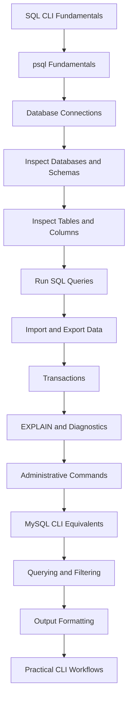
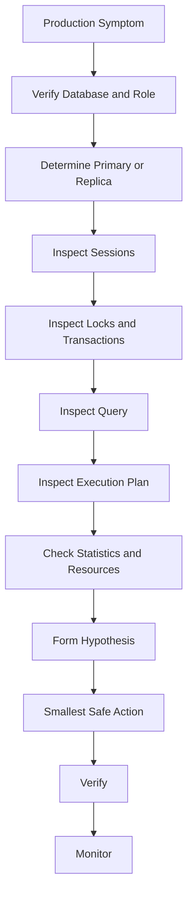

# README

## Overview

The `13- CLI` section develops the practical PostgreSQL command-line skills required to work directly with databases from a terminal.

The goal is not to memorize `psql` commands. The goal is to become comfortable using the CLI as an engineering interface for:

- Database inspection
- Schema exploration
- SQL execution
- Query diagnostics
- Transaction control
- Data import and export
- Administrative investigation
- Production troubleshooting
- CI/CD automation
- Controlled operational changes

The CLI sits between backend engineers and the database server:

```text
Developer / Operator
        │
        ▼
     psql CLI
        │
        ├── SQL
        ├── Meta-commands
        ├── Output formatting
        └── Script execution
        │
        ▼
 PostgreSQL Server
        │
        ├── Query processing
        ├── Transactions
        ├── Locks
        ├── Storage
        ├── Replication
        └── Security
```

A senior backend engineer should be able to move comfortably between an ORM, raw SQL, `psql`, database observability, and production infrastructure.

## Navigation

| # | Section | Layer | Description |
|---|---|---|---|
| 01 | [CLI](./README.md) | Production Engineering | PostgreSQL psql CLI, database inspection, diagnostics, and operational workflows |
| 02 | [01- SQL CLI Fundamentals](./01-%20SQL%20CLI%20Fundamentals.md) | Production Engineering | PostgreSQL CLI fundamentals and psql workflow |
| 03 | [02- PostgreSQL psql Fundamentals](./02-%20PostgreSQL%20psql%20Fundamentals.md) | Production Engineering | PostgreSQL-specific psql behavior and configuration |
| 04 | [03- Connecting to a Database](./03-%20Connecting%20to%20a%20Database.md) | Production Engineering | Database connection lifecycle and troubleshooting |
| 05 | [04- Inspecting Databases and Schemas](./04-%20Inspecting%20Databases%20and%20Schemas.md) | Production Engineering | Database, schema, object, and catalog inspection |
| 06 | [05- Inspecting Tables and Columns](./05-%20Inspecting%20Tables%20and%20Columns.md) | Production Engineering | Table structure, columns, constraints, indexes, and metadata |
| 07 | [06- Running SQL Queries from CLI](./06-%20Running%20SQL%20Queries%20from%20CLI.md) | Production Engineering | Executing SQL interactively and from scripts |
| 08 | [07- Importing and Exporting Data](./07-%20Importing%20and%20Exporting%20Data.md) | Production Engineering | COPY, \copy, CSV, dumps, and data movement |
| 09 | [08- Transactions from CLI](./08-%20Transactions%20from%20CLI.md) | Production Engineering | Transactions, isolation, savepoints, locks, and CLI safety |
| 10 | [09- EXPLAIN and Query Diagnostics](./09-%20EXPLAIN%20and%20Query%20Diagnostics.md) | Production Engineering | Query plans, execution analysis, buffers, and performance |
| 11 | [10- PostgreSQL Administrative Commands](./10-%20PostgreSQL%20Administrative%20Commands.md) | Production Engineering | PostgreSQL administrative and operational commands |
| 12 | [11- MySQL CLI Equivalents](./11-%20MySQL%20CLI%20Equivalents.md) | Production Engineering | Mapping common MySQL CLI workflows to PostgreSQL |
| 13 | [12- CLI Querying and Filtering](./12-%20CLI%20Querying%20and%20Filtering.md) | Production Engineering | Filtering, joins, aggregation, pagination, and practical querying |
| 14 | [13- CLI Output Formatting](./13-%20CLI%20Output%20Formatting.md) | Production Engineering | Human-readable, CSV, JSON, and automation-friendly output |
| 15 | [14- Practical SQL CLI Workflows](./14-%20Practical%20SQL%20CLI%20Workflows.md) | Production Engineering | Production diagnostics, migrations, incidents, and operational workflows |

---

## What This Section Covers

The CLI section progresses from basic PostgreSQL interaction to production-oriented operational workflows.

| Document | Focus |
|---|---|
| `01- SQL CLI Fundamentals.md` | PostgreSQL CLI fundamentals and `psql` workflow |
| `02- PostgreSQL psql Fundamentals.md` | PostgreSQL-specific `psql` behavior and configuration |
| `03- Connecting to a Database.md` | Database connection lifecycle and troubleshooting |
| `04- Inspecting Databases and Schemas.md` | Database, schema, object, and catalog inspection |
| `05- Inspecting Tables and Columns.md` | Table structure, columns, constraints, indexes, and metadata |
| `06- Running SQL Queries from CLI.md` | Executing SQL interactively and from scripts |
| `07- Importing and Exporting Data.md` | `COPY`, `\copy`, CSV, dumps, and data movement |
| `08- Transactions from CLI.md` | Transactions, isolation, savepoints, locks, and CLI safety |
| `09- EXPLAIN and Query Diagnostics.md` | Query plans, execution analysis, buffers, and performance |
| `10- PostgreSQL Administrative Commands.md` | PostgreSQL administrative and operational commands |
| `11- MySQL CLI Equivalents.md` | Mapping common MySQL CLI workflows to PostgreSQL |
| `12- CLI Querying and Filtering.md` | Filtering, joins, aggregation, pagination, and practical querying |
| `13- CLI Output Formatting.md` | Human-readable, CSV, JSON, and automation-friendly output |
| `14- Practical SQL CLI Workflows.md` | Production diagnostics, migrations, incidents, and operational workflows |

---

## Recommended Learning Path

Follow the documents in order.



The recommended progression is:

```text
Connect
  ↓
Inspect
  ↓
Query
  ↓
Modify safely
  ↓
Diagnose
  ↓
Automate
  ↓
Operate production systems
```

---

## CLI Mental Model

`psql` is a PostgreSQL client, not the database itself.

```text
Terminal
   │
   ▼
psql process
   │
   ├── Client-side commands
   │     ├── \dt
   │     ├── \d
   │     ├── \x
   │     └── \copy
   │
   └── SQL sent to server
         │
         ▼
   PostgreSQL backend
         │
         ├── Parse
         ├── Plan
         ├── Execute
         ├── Transaction processing
         └── Storage / WAL / locks
```

This distinction matters when troubleshooting.

For example:

```text
\x
```

changes `psql` output formatting.

It does not change PostgreSQL query execution.

Likewise:

```sql
EXPLAIN (ANALYZE, BUFFERS)
SELECT ...
```

is SQL executed by PostgreSQL and therefore has database-side effects because `ANALYZE` actually executes the statement.

---

## Connecting to PostgreSQL

A typical connection:

```bash
psql \
    -h db.example.internal \
    -p 5432 \
    -U app_readonly \
    -d appdb
```

The connection involves:

```text
DNS
 ↓
TCP
 ↓
TLS, if configured
 ↓
PostgreSQL authentication
 ↓
Database authorization
 ↓
PostgreSQL session
```

Once connected, verify the environment:

```text
\conninfo
```

Then:

```sql
SELECT
    current_database(),
    current_user,
    inet_server_addr(),
    inet_server_port(),
    pg_is_in_recovery();
```

This should be routine before production investigation.

---

## Inspecting Database Structure

Start broadly:

```text
\l+
\dn+
\dt *.*
```

Then inspect a specific object:

```text
\d+ app.orders
```

Inspect indexes:

```text
\di *.*
```

Inspect functions:

```text
\df *.*
```

Inspect extensions:

```text
\dx
```

The CLI can therefore be used to reconstruct the actual database structure rather than relying only on:

```text
Django models
SQLAlchemy models
Migration files
Documentation
```

The live database is the runtime source of truth.

---

## Querying Data

A normal query:

```sql
SELECT
    id,
    customer_id,
    status,
    created_at
FROM app.orders
WHERE status = 'pending'
ORDER BY created_at DESC
LIMIT 100;
```

Production-oriented CLI querying emphasizes:

- Explicit columns
- Selective predicates
- Bounded result sets
- Deterministic ordering
- Appropriate indexes
- Minimal sensitive-data exposure

Avoid using:

```sql
SELECT *
FROM app.orders;
```

as a default diagnostic pattern.

---

## Filtering and Aggregation

Filtering:

```sql
SELECT
    id,
    email
FROM app.customers
WHERE status = 'active'
  AND created_at >= CURRENT_DATE - INTERVAL '7 days'
LIMIT 100;
```

Aggregation:

```sql
SELECT
    status,
    COUNT(*) AS order_count
FROM app.orders
GROUP BY status
ORDER BY order_count DESC;
```

Data-quality investigation:

```sql
SELECT
    external_id,
    COUNT(*) AS occurrences
FROM app.orders
GROUP BY external_id
HAVING COUNT(*) > 1
ORDER BY occurrences DESC;
```

These patterns are particularly useful for production debugging.

---

## Query Diagnostics

A senior engineer should not stop at:

```sql
SELECT ...
```

When performance matters, inspect the plan:

```sql
EXPLAIN
SELECT
    id,
    customer_id,
    status
FROM app.orders
WHERE customer_id = 123
ORDER BY created_at DESC
LIMIT 100;
```

For actual execution:

```sql
EXPLAIN (ANALYZE, BUFFERS)
SELECT
    id,
    customer_id,
    status
FROM app.orders
WHERE customer_id = 123
ORDER BY created_at DESC
LIMIT 100;
```

Investigate:

```text
Estimated rows
Actual rows
Loops
Scan type
Join strategy
Sort operations
Buffer hits
Buffer reads
Execution time
```

Use `EXPLAIN ANALYZE` carefully because the statement is executed.

---

## Runtime Investigation

The CLI can inspect PostgreSQL runtime state.

Active sessions:

```sql
SELECT
    pid,
    usename,
    application_name,
    state,
    now() - query_start AS duration,
    wait_event_type,
    wait_event,
    left(query, 300) AS query
FROM pg_stat_activity
WHERE state <> 'idle'
ORDER BY query_start;
```

Blocking:

```sql
SELECT
    pid,
    pg_blocking_pids(pid) AS blocking_pids,
    wait_event_type,
    wait_event,
    left(query, 300) AS query
FROM pg_stat_activity
WHERE cardinality(pg_blocking_pids(pid)) > 0;
```

Locks:

```sql
SELECT
    pid,
    locktype,
    mode,
    granted,
    relation::regclass AS relation,
    waitstart
FROM pg_locks
ORDER BY granted, waitstart;
```

These are core incident-response skills.

---

## Transaction Workflows

Transactions can be controlled directly from `psql`.

```sql
BEGIN;

UPDATE app.orders
SET status = 'cancelled'
WHERE id = 12345
  AND status = 'pending';

SELECT
    id,
    status
FROM app.orders
WHERE id = 12345;

COMMIT;
```

For testing without committing:

```sql
BEGIN;

UPDATE app.orders
SET status = 'cancelled'
WHERE id = 12345;

SELECT
    id,
    status
FROM app.orders
WHERE id = 12345;

ROLLBACK;
```

For safer diagnostics:

```sql
BEGIN READ ONLY;

SET LOCAL statement_timeout = '5s';

SELECT
    id,
    status
FROM app.orders
WHERE customer_id = 123
LIMIT 100;

COMMIT;
```

---

## Import and Export

PostgreSQL provides both server-side and client-side data movement.

Client-side:

```text
\copy
```

Example:

```text
\copy (
    SELECT
        id,
        status,
        created_at
    FROM app.orders
    WHERE status = 'completed'
) TO './completed-orders.csv'
WITH (FORMAT csv, HEADER true)
```

Server-side:

```sql
COPY app.orders
TO '/var/lib/postgresql/orders.csv'
WITH (FORMAT csv, HEADER true);
```

The key distinction is:

```text
COPY
→ PostgreSQL server filesystem

\copy
→ psql client filesystem
```

For database-level backup and restore, use appropriate tools such as:

```text
pg_dump
pg_restore
pg_dumpall
```

rather than treating CSV exports as complete backups.

---

## Output Formatting

Human-readable output:

```text
SELECT ...
```

Expanded:

```text
\x auto
```

Machine-readable:

```bash
psql -X -qAt -d appdb -c "SELECT COUNT(*) FROM app.orders;"
```

CSV:

```bash
psql --csv -d appdb -c "SELECT id, status FROM app.orders;"
```

JSON query results can be generated directly from PostgreSQL:

```sql
SELECT json_agg(
    json_build_object(
        'id', id,
        'status', status
    )
)
FROM app.orders
WHERE status = 'pending';
```

Choose output based on the consumer:

| Consumer | Recommended output |
|---|---|
| Engineer | Aligned table |
| Wide record | Expanded |
| Shell | Unaligned + tuples-only |
| CI/CD | Deterministic machine-readable output |
| Data exchange | CSV |
| Structured tooling | JSON |
| Query-plan tooling | JSON `EXPLAIN` |

---

## Administrative Workflows

Administrative CLI work should be approached differently from ordinary querying.

Common activities include:

```text
Inspect active connections
Inspect locks
Inspect long-running transactions
Inspect replication
Inspect database size
Inspect indexes
Inspect vacuum statistics
Inspect configuration
Validate migrations
Cancel problematic queries
Terminate sessions when justified
```

Example connection investigation:

```sql
SELECT
    usename,
    application_name,
    state,
    COUNT(*) AS connections
FROM pg_stat_activity
GROUP BY
    usename,
    application_name,
    state
ORDER BY connections DESC;
```

Example replication inspection:

```sql
SELECT
    pid,
    application_name,
    client_addr,
    state,
    sync_state,
    write_lag,
    flush_lag,
    replay_lag
FROM pg_stat_replication;
```

Administrative operations should use appropriate privileges and should be auditable.

---

## Production Diagnostic Workflow

A reliable production workflow:



Do not start with mutation.

Start with evidence.

---

## Backend Application Integration

The CLI becomes especially valuable when working with Django or FastAPI.

Typical Django path:

```text
HTTP request
    ↓
Django view/service
    ↓
Django ORM
    ↓
Generated SQL
    ↓
PostgreSQL
```

CLI investigation lets you inspect the database independently of the ORM.

For example, a Django queryset:

```python
orders = (
    Order.objects
    .filter(customer_id=123)
    .order_by("-created_at")[:100]
)
```

can be correlated with its generated SQL and then investigated using:

```sql
EXPLAIN (ANALYZE, BUFFERS)
SELECT ...;
```

This creates a complete debugging chain:

```text
API
 ↓
ORM
 ↓
SQL
 ↓
Execution plan
 ↓
Runtime behavior
```

---

## CLI and Connection Pools

A database issue may appear to be a SQL issue when the actual problem is connection pressure.

Inspect:

```sql
SELECT COUNT(*)
FROM pg_stat_activity;
```

Compare:

```sql
SHOW max_connections;
```

Then group connections:

```sql
SELECT
    application_name,
    usename,
    state,
    COUNT(*) AS connections
FROM pg_stat_activity
GROUP BY
    application_name,
    usename,
    state
ORDER BY connections DESC;
```

For Kubernetes:

```text
Pods
×
Worker processes
×
Pool size
=
Potential database connections
```

A service deployed across many pods can exhaust database connections even when each individual pod appears correctly configured.

---

## CLI and Replication

Always know whether you are querying:

```text
Primary
Replica
```

Check:

```sql
SELECT pg_is_in_recovery();
```

On the primary:

```sql
SELECT
    application_name,
    state,
    sync_state,
    replay_lag
FROM pg_stat_replication;
```

A replica can be useful for expensive read-only investigations, but it may be stale.

Therefore:

```text
Strong consistency required
    → Primary

Staleness acceptable
    → Replica may be appropriate
```

---

## CLI and Kubernetes

A typical interactive session:

```bash
kubectl exec -it postgres-0 -n database -- \
    psql -U app_readonly -d appdb
```

For automation:

```bash
kubectl exec -i postgres-0 -n database -- \
    psql \
    -X \
    -qAt \
    -U app_readonly \
    -d appdb \
    -c "SELECT COUNT(*) FROM app.orders;"
```

Operational recommendations:

- Prefer read-only roles
- Avoid production superuser access for routine diagnostics
- Use controlled access paths
- Audit privileged sessions
- Avoid exporting sensitive data unnecessarily

---

## CLI and CI/CD

CLI operations are useful for:

```text
Migration verification
Schema validation
Deployment health checks
Data-quality checks
Operational automation
```

A robust script:

```bash
psql \
    -X \
    -qAt \
    -v ON_ERROR_STOP=1 \
    -d appdb \
    -c "SELECT COUNT(*) FROM app.orders;"
```

Important properties:

```text
-X
→ Ignore user startup configuration

-q
→ Quiet mode

-A
→ Unaligned output

-t
→ Tuples only

ON_ERROR_STOP=1
→ Stop on SQL errors
```

Do not parse visually formatted table output in automation.

---

## CLI and Security

Database CLI access is privileged access.

Important controls include:

```text
Least-privileged roles
Read-only diagnostic accounts
TLS
Credential management
Network restrictions
Audit logging
Sensitive-data minimization
```

Avoid:

```bash
psql -c "SELECT * FROM app.users;"
```

when the table contains sensitive information.

Prefer:

```sql
SELECT
    COUNT(*)
FROM app.users
WHERE status = 'active';
```

The best diagnostic query is often the one that answers the question without retrieving the underlying sensitive records.

---

## CLI and Incident Response

During an incident, prioritize:

```text
Safety
Speed
Evidence
Reproducibility
Minimal mutation
```

A practical workflow:

```text
Verify target
    ↓
Inspect active sessions
    ↓
Inspect blocking
    ↓
Inspect long transactions
    ↓
Inspect query plans
    ↓
Check replication
    ↓
Correlate with application telemetry
    ↓
Apply smallest safe remediation
    ↓
Verify recovery
```

Useful sources of evidence include:

```text
pg_stat_activity
pg_locks
pg_stat_replication
pg_stat_user_tables
pg_stat_statements
EXPLAIN
Application logs
Distributed traces
Connection-pool metrics
Kubernetes metrics
AWS database metrics
```

---

## Common Operational Patterns

### Find Active Queries

```sql
SELECT
    pid,
    usename,
    application_name,
    state,
    now() - query_start AS duration,
    left(query, 250) AS query
FROM pg_stat_activity
WHERE state <> 'idle'
ORDER BY query_start;
```

### Find Blocking

```sql
SELECT
    pid,
    pg_blocking_pids(pid) AS blocking_pids,
    left(query, 250) AS query
FROM pg_stat_activity
WHERE cardinality(pg_blocking_pids(pid)) > 0;
```

### Find Large Tables

```sql
SELECT
    schemaname,
    relname,
    pg_size_pretty(
        pg_total_relation_size(relid)
    ) AS total_size
FROM pg_stat_user_tables
ORDER BY pg_total_relation_size(relid) DESC
LIMIT 20;
```

### Find Dead Tuples

```sql
SELECT
    schemaname,
    relname,
    n_live_tup,
    n_dead_tup,
    last_autovacuum
FROM pg_stat_user_tables
ORDER BY n_dead_tup DESC
LIMIT 20;
```

### Check Replication

```sql
SELECT
    application_name,
    state,
    sync_state,
    write_lag,
    flush_lag,
    replay_lag
FROM pg_stat_replication;
```

---

## Common Mistakes

### Connecting to the Wrong Database

Always verify:

```text
\conninfo
```

and:

```sql
SELECT current_database(), current_user;
```

### Running Unbounded Queries

Use:

```sql
LIMIT 100;
```

when investigating interactively.

### Running Heavy Queries on the Primary

Use a suitable replica when consistency requirements allow.

### Assuming the ORM Is the Database

The ORM generates SQL; PostgreSQL still determines execution behavior.

### Ignoring Connection Pooling

High application latency may come from connection acquisition rather than query execution.

### Treating Replica Data as Current

Asynchronous replication can introduce lag.

### Modifying Data Without a Condition

Use predicates that encode expected state.

### Killing Sessions Without Understanding Them

A session may belong to a migration, backup, or legitimate long-running operation.

### Leaving Transactions Open

Long-running transactions can retain locks and old row versions.

### Exposing Production Data Through CLI Output

Terminal output, CI logs, CSV exports, and shell history can become data-leak surfaces.

---

## Production Safety Checklist

Before a production CLI operation:

- [ ] Confirm host and database.
- [ ] Confirm current database role.
- [ ] Determine primary vs replica.
- [ ] Understand expected row count.
- [ ] Select only required columns.
- [ ] Consider indexes and execution cost.
- [ ] Consider locks and transaction duration.
- [ ] Set an appropriate timeout where appropriate.
- [ ] Use read-only access for diagnostics.
- [ ] Avoid exposing sensitive data.
- [ ] Use transactions for controlled writes.
- [ ] Verify the result after changes.
- [ ] Monitor application and database behavior afterward.

---

## CLI Engineering Principles

The most useful CLI habits are operational rather than syntactic.

### Verify Before Acting

Never trust the environment implicitly.

### Observe Before Mutating

Prefer:

```text
SELECT
EXPLAIN
pg_stat_activity
pg_locks
Catalog queries
```

before changing data or configuration.

### Bound Everything

Bound:

```text
Rows
Execution time
Transaction scope
Result size
Operational blast radius
```

### Automate Repeatable Work

Move recurring diagnostics into:

```text
Version-controlled SQL
Shell scripts
CI/CD
Runbooks
Operational tooling
```

### Treat Database Access as Production Code

CLI commands can:

```text
Change state
Acquire locks
Consume resources
Generate WAL
Affect replicas
Expose sensitive information
```

They deserve the same engineering discipline as application code.

---

## Interview Perspective

CLI knowledge is often a proxy for practical database maturity.

Be prepared to explain:

- What `psql` does versus what PostgreSQL does.
- How to verify which database and server you are connected to.
- How to inspect tables, indexes, constraints, and roles.
- How to investigate a slow query.
- How `EXPLAIN ANALYZE` differs from `EXPLAIN`.
- How to find blocking sessions.
- How to investigate long-running transactions.
- How to inspect replication lag.
- How to safely perform a production data correction.
- How to produce machine-readable output in CI/CD.
- How to distinguish `COPY` from `\copy`.
- Why a replica is not necessarily current.
- Why a connection-pool problem can look like a database performance problem.
- How CLI access should be secured in production.

The senior-level answer should connect commands to system behavior rather than merely listing syntax.

---

## Practical CLI Decision Framework

When facing a database problem, use:

```text
What am I trying to learn?
        │
        ├── Schema?
        │      → \d / catalogs
        │
        ├── Data?
        │      → SELECT
        │
        ├── Performance?
        │      → EXPLAIN / pg_stat_statements
        │
        ├── Blocking?
        │      → pg_stat_activity / pg_locks
        │
        ├── Replication?
        │      → pg_stat_replication
        │
        ├── Connections?
        │      → pg_stat_activity
        │
        ├── Data movement?
        │      → COPY / \copy / pg_dump
        │
        └── Production remediation?
               → Transaction + least privilege + verification
```

This turns CLI usage from command memorization into systematic diagnosis.

---

## Section Completion Standard

After completing this section, the CLI should be usable as a practical database engineering interface.

The expected progression is:

```text
Connect confidently
        ↓
Inspect accurately
        ↓
Query precisely
        ↓
Format results appropriately
        ↓
Diagnose performance and concurrency
        ↓
Validate migrations
        ↓
Automate repeatable checks
        ↓
Perform controlled production operations
```

The end goal is not to become a database administrator through `psql`.

The goal is to become a backend engineer who can reason directly about the database when application abstractions are insufficient.

---

## Key Takeaways

- **Treat `psql` as an engineering interface:** use it to connect, inspect, query, diagnose, automate, and perform controlled database operations rather than merely running ad hoc SQL.
- **Build a production-safe workflow:** verify the target, observe database state, bound queries, use least privilege, minimize mutations, and verify every operational change.
- **Connect CLI behavior to PostgreSQL internals:** query plans, transactions, locks, replication, connection pools, storage, and WAL explain what the application experiences.
- **Use the CLI across the backend stack:** correlate PostgreSQL evidence with Django/FastAPI, Celery/Kafka, Redis, Kubernetes, CI/CD, and AWS observability.
- **Senior CLI proficiency is diagnostic proficiency:** the important skill is knowing which evidence to collect, how to interpret it, and how to act without creating a larger production problem.