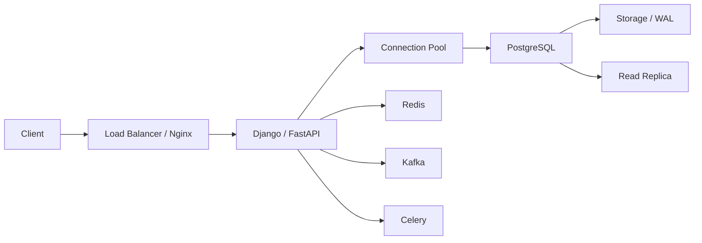
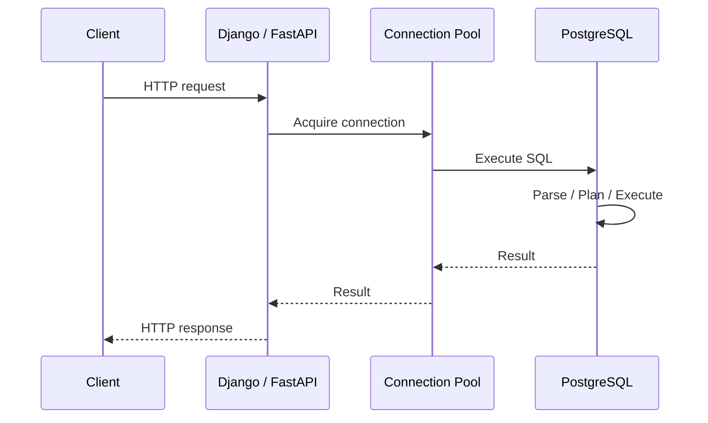
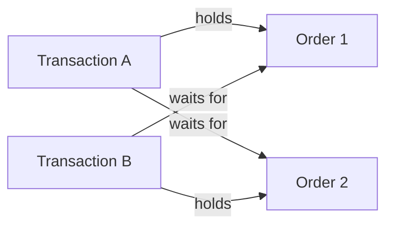
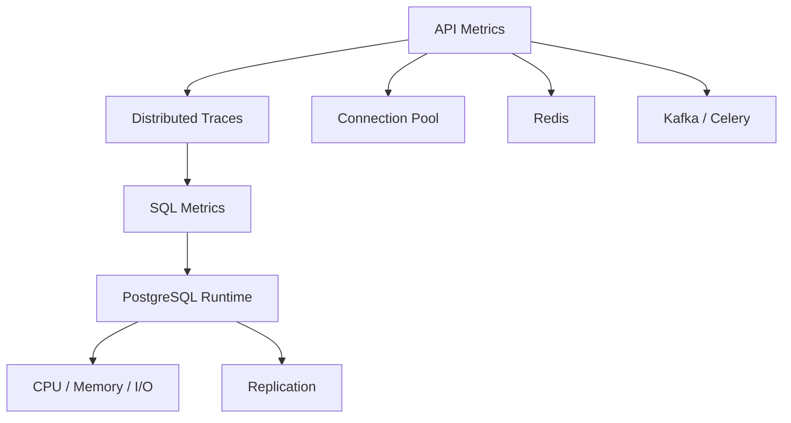
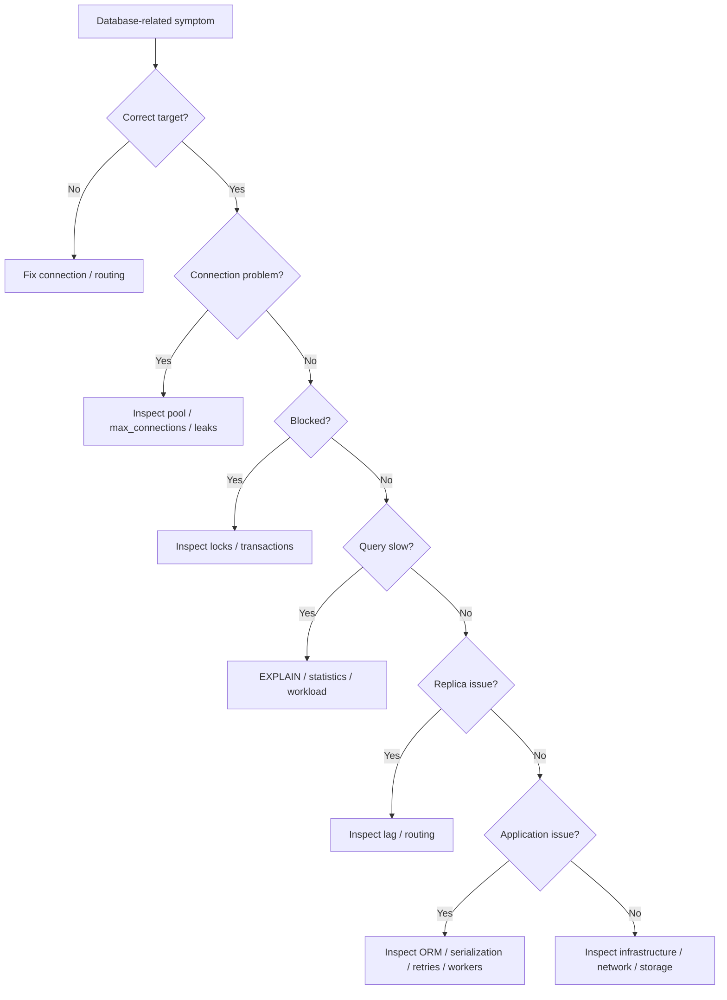

# 01- SQL Troubleshooting Methodology

## Overview

SQL troubleshooting is the systematic process of identifying, isolating, and resolving database-related failures without relying on guesswork.

In production backend systems, a database symptom can originate from many different layers:

```text
Client
  ↓
Nginx / Load Balancer
  ↓
Django / FastAPI
  ↓
Connection Pool
  ↓
PostgreSQL
  ↓
Storage / WAL / Replication
```

A slow API does not necessarily mean a slow SQL query. A timeout does not necessarily mean the database is overloaded. A missing record does not necessarily mean data loss.

The core troubleshooting discipline is:

```text
Symptom
  ↓
Verify
  ↓
Measure
  ↓
Localize
  ↓
Form hypothesis
  ↓
Test hypothesis
  ↓
Remediate
  ↓
Verify recovery
  ↓
Prevent recurrence
```

The objective is to reduce uncertainty as quickly as possible while minimizing production impact.

---

## Troubleshooting Mindset

A strong troubleshooting process separates:

- **Symptoms** — what users or systems observe
- **Evidence** — measurable facts
- **Hypotheses** — possible explanations
- **Tests** — actions that distinguish between hypotheses
- **Remediation** — changes intended to restore service
- **Prevention** — changes that reduce recurrence

For example:

```text
Symptom:
API latency increased from 100 ms to 4 seconds.

Possible hypotheses:
- SQL became slower
- Connection pool is exhausted
- Queries are blocked
- Database CPU is saturated
- Replica is lagging
- Network latency increased
- Application serialization is slow

Evidence:
- Request traces
- Pool metrics
- pg_stat_activity
- pg_locks
- EXPLAIN
- Database CPU/I/O
- Replication metrics
```

Do not jump directly from symptom to remediation.

---

## First Principles

Before investigating a database issue, answer five questions:

| Question | Why it matters |
|---|---|
| What changed? | Recent deployments often narrow the search space |
| Who is affected? | Determines blast radius |
| When did it start? | Enables correlation with events |
| Which database path is affected? | Separates primary, replica, cache, and application paths |
| What is the measurable symptom? | Prevents vague troubleshooting |

Useful incident metadata:

```text
Start time
Affected endpoints
Affected tenants
Database host
Primary/replica
Application version
Migration version
Query fingerprint
Error rate
Latency
Connection count
CPU
Memory
I/O
Replication lag
```

---

## Establish the Failure Boundary

The first goal is to determine where the failure occurs.



Possible boundaries include:

```text
Client → API
API → Connection Pool
Connection Pool → Database
Database → Storage
Primary → Replica
Application → Redis
Application → Kafka
Application → Celery
```

A senior engineer asks:

> Which boundary is actually failing?

---

## Establish a Timeline

Build a timeline before changing anything.

Example:

```text
10:02  Deployment started
10:05  New application version live
10:07  API p95 latency increased
10:08  Database CPU increased
10:09  Connection count increased
10:10  Lock waits appeared
10:12  Error rate increased
```

This is much more useful than:

```text
"The database is slow."
```

Correlate database symptoms with:

- Deployments
- Migrations
- Traffic changes
- Batch jobs
- Kafka consumers
- Celery workers
- Configuration changes
- Infrastructure events
- Failovers
- Replication changes

---

## Verify the Target

Before running diagnostics:

```text
\conninfo
```

Then:

```sql
SELECT
    current_database() AS database,
    current_user AS user,
    inet_server_addr() AS server,
    inet_server_port() AS port,
    pg_is_in_recovery() AS is_replica;
```

This prevents one of the most dangerous operational mistakes:

```text
Investigating the wrong database.
```

The same hostname pattern may exist across:

```text
Development
Staging
Production
Primary
Replica
Disaster recovery
```

Never rely solely on shell prompts, aliases, or connection names.

---

## Identify the Blast Radius

Determine whether the issue affects:

```text
One request
One endpoint
One service
One tenant
One database
One replica
All application instances
Entire platform
```

For example:

```text
One endpoint slow
    ↓
Likely application/query-specific

All endpoints slow
    ↓
Investigate database, network, pool, or infrastructure

Only reads slow
    ↓
Investigate replicas/cache/read path

Only writes slow
    ↓
Investigate primary, locks, WAL, storage

Only one tenant slow
    ↓
Investigate tenant size/noisy neighbor/data distribution
```

This classification dramatically reduces the search space.

---

## Classify the Symptom

A useful first classification:

| Symptom | Initial investigation |
|---|---|
| High latency | Query, pool, locks, CPU, I/O |
| Timeout | Pool, network, locks, statement execution |
| Connection failure | Network, credentials, capacity, database availability |
| Deadlock | Lock ordering and transaction structure |
| Lock timeout | Blocking transaction |
| High CPU | Query workload, plans, concurrency |
| High I/O | Large scans, checkpoints, storage pressure |
| Replica lag | WAL generation, replay, long queries |
| Missing data | Transaction state, routing, replica lag, cache |
| Duplicate data | Concurrency, constraints, retry behavior |
| Migration failure | Locks, schema state, permissions |
| Disk full | Table/index/WAL growth, retention |
| High connection count | Pool sizing, leaks, deployment scaling |

---

## Application-to-Database Request Path

For a typical Django or FastAPI request:



Measure each stage independently.

For example:

```text
Request latency = 4 s

Connection acquisition = 2.5 s
Database execution     = 50 ms
Serialization          = 20 ms
Network                 = 30 ms
```

The database query is not the primary bottleneck.

The connection pool is.

---

## Check Connection Pressure

Inspect current connections:

```sql
SELECT
    COUNT(*) AS connections
FROM pg_stat_activity;
```

Compare:

```sql
SHOW max_connections;
```

Break down by application:

```sql
SELECT
    usename,
    application_name,
    state,
    COUNT(*) AS connections
FROM pg_stat_activity
GROUP BY
    usename,
    application_name,
    state
ORDER BY connections DESC;
```

For Kubernetes, estimate:

```text
Potential connections
=
pods × worker processes × pool size
```

Example:

```text
20 pods
× 4 workers
× 10 connections
=
800 possible connections
```

This can exceed database capacity even if each individual application instance looks correctly configured.

---

## Check Connection Pool Exhaustion

A pool can be exhausted before PostgreSQL reaches `max_connections`.

Typical causes:

```text
Long-running queries
Connection leaks
Long transactions
Too-small pool
Sudden traffic spike
Worker concurrency increase
Database latency increase
```

A common cascade:

```text
Slow SQL
  ↓
Connections remain occupied longer
  ↓
Pool fills
  ↓
Requests wait for connections
  ↓
API latency increases
  ↓
More requests accumulate
  ↓
System becomes slower
```

This is why connection metrics should be examined alongside SQL latency.

---

## Inspect Active Sessions

```sql
SELECT
    pid,
    usename,
    application_name,
    client_addr,
    state,
    now() - query_start AS query_duration,
    now() - xact_start AS transaction_duration,
    wait_event_type,
    wait_event,
    left(query, 300) AS query
FROM pg_stat_activity
WHERE state <> 'idle'
ORDER BY query_start;
```

Pay attention to:

```text
Long-running queries
Long-running transactions
idle in transaction
Lock waits
Unexpected application names
Unexpected users
Unexpected clients
```

Do not assume the oldest query is necessarily the root cause.

---

## Identify Long-Running Transactions

```sql
SELECT
    pid,
    usename,
    application_name,
    state,
    now() - xact_start AS transaction_age,
    wait_event_type,
    wait_event,
    left(query, 300) AS query
FROM pg_stat_activity
WHERE xact_start IS NOT NULL
ORDER BY xact_start;
```

Long transactions can contribute to:

```text
Lock retention
MVCC cleanup delays
Dead tuple growth
Vacuum pressure
Replication conflicts
Connection pool pressure
```

A query may have finished while its transaction remains open.

---

## Investigate `idle in transaction`

Find sessions:

```sql
SELECT
    pid,
    usename,
    application_name,
    now() - xact_start AS transaction_age,
    left(query, 300) AS last_query
FROM pg_stat_activity
WHERE state = 'idle in transaction'
ORDER BY xact_start;
```

Common causes:

```text
Application exception path
Missing transaction cleanup
Slow external API call inside transaction
Manual CLI session
Connection pool misuse
```

A particularly dangerous pattern is:

```text
BEGIN
 ↓
Database query
 ↓
External HTTP call
 ↓
Waiting
 ↓
COMMIT
```

The database transaction remains open while the external service responds.

Keep transaction scope as short as practical.

---

## Investigate Blocking

Find blocked sessions:

```sql
SELECT
    pid,
    pg_blocking_pids(pid) AS blocking_pids,
    wait_event_type,
    wait_event,
    left(query, 300) AS query
FROM pg_stat_activity
WHERE cardinality(pg_blocking_pids(pid)) > 0;
```

Then inspect the blocker:

```sql
SELECT
    pid,
    usename,
    application_name,
    state,
    xact_start,
    query_start,
    wait_event_type,
    wait_event,
    left(query, 500) AS query
FROM pg_stat_activity
WHERE pid = 12345;
```

The investigation should answer:

```text
Who is blocked?
Who is blocking?
What transaction owns the lock?
Why is that transaction still open?
Which application code created it?
```

---

## Lock Troubleshooting

Inspect locks:

```sql
SELECT
    pid,
    locktype,
    mode,
    granted,
    relation::regclass AS relation,
    transactionid,
    waitstart
FROM pg_locks
ORDER BY granted, waitstart;
```

A lock is not automatically a problem.

Locks are necessary for correctness.

The problem is usually:

```text
Unexpected lock
+
Unexpected duration
+
Unexpected contention
```

Investigate lock topology rather than trying to eliminate locking entirely.

---

## Deadlock Troubleshooting

Deadlocks occur when transactions wait on each other.

Example:

```text
Transaction A
    locks Order 1
    waits for Order 2

Transaction B
    locks Order 2
    waits for Order 1
```



Typical prevention:

```text
Consistent lock ordering
Short transactions
Avoid unnecessary locks
Avoid external calls inside transactions
Retry safely after deadlock errors
```

For example, always lock records in ascending ID order rather than allowing different code paths to choose arbitrary ordering.

---

## Query Performance Investigation

Start with the exact SQL.

Then:

```sql
EXPLAIN
SELECT
    id,
    customer_id,
    status,
    created_at
FROM app.orders
WHERE customer_id = 123
ORDER BY created_at DESC
LIMIT 100;
```

If safe:

```sql
EXPLAIN (ANALYZE, BUFFERS)
SELECT
    id,
    customer_id,
    status,
    created_at
FROM app.orders
WHERE customer_id = 123
ORDER BY created_at DESC
LIMIT 100;
```

Investigate:

```text
Estimated rows
Actual rows
Scan type
Join strategy
Sort operations
Loops
Buffer hits
Buffer reads
Execution time
```

---

## Estimated vs Actual Rows

A major troubleshooting signal is:

```text
Estimated rows ≠ Actual rows
```

For example:

```text
Planner estimate: 10 rows
Actual rows:      500,000 rows
```

The planner may choose a poor execution strategy because its assumptions are wrong.

Possible causes:

```text
Stale statistics
Data distribution changes
Correlated columns
Skewed values
Missing extended statistics
Highly selective predicates
Parameter-sensitive workloads
```

Investigate statistics before blindly adding indexes.

---

## Query Plan Regression

A query can become slower without any application code change.

Possible reasons:

```text
Table growth
Data distribution changed
Statistics changed
Index changed
Planner estimates changed
Configuration changed
Cache behavior changed
Different parameter values
Different execution plan
```

Therefore:

```text
"SQL did not change"
```

does not imply:

```text
"Query performance cannot change."
```

---

## Check Query Statistics

If `pg_stat_statements` is enabled:

```sql
SELECT
    queryid,
    calls,
    total_exec_time,
    mean_exec_time,
    rows,
    shared_blks_read,
    shared_blks_hit,
    query
FROM pg_stat_statements
ORDER BY total_exec_time DESC
LIMIT 20;
```

Different rankings answer different questions.

### Highest Total Time

```sql
ORDER BY total_exec_time DESC
```

Useful for finding workload-level database consumers.

### Highest Average Time

```sql
ORDER BY mean_exec_time DESC
```

Useful for identifying individually expensive queries.

### Highest Call Count

```sql
ORDER BY calls DESC
```

Useful for identifying high-frequency queries.

A query that takes 2 ms but runs 10 million times can matter more than a query that takes 5 seconds and runs once.

---

## Check Buffer Behavior

With:

```sql
EXPLAIN (ANALYZE, BUFFERS)
SELECT ...;
```

look at:

```text
shared hit
shared read
temp read
temp written
```

A large number of disk reads can indicate I/O pressure or insufficient cache effectiveness.

A large number of buffer hits does not automatically mean the query is efficient.

A query can perform millions of in-memory page accesses and still be expensive.

---

## Check for Large Scans

A sequential scan is not inherently bad.

For a small table:

```text
Sequential scan
```

may be cheaper than using an index.

Troubleshooting should ask:

```text
How many rows?
How many pages?
How selective is the predicate?
Is the query returning most rows?
Is the table cached?
Is the index useful?
```

Avoid the rule:

> Sequential scan = bad.

The planner chooses based on estimated cost.

---

## Check Sorting

A query such as:

```sql
SELECT
    id,
    created_at
FROM app.orders
WHERE customer_id = 123
ORDER BY created_at DESC
LIMIT 100;
```

may require sorting if the available access path does not provide the requested order.

Investigate:

```sql
EXPLAIN (ANALYZE, BUFFERS)
SELECT
    id,
    created_at
FROM app.orders
WHERE customer_id = 123
ORDER BY created_at DESC
LIMIT 100;
```

An appropriate composite index may eliminate unnecessary sorting.

---

## Check Statistics

Inspect table statistics:

```sql
SELECT
    schemaname,
    relname,
    n_live_tup,
    n_dead_tup,
    last_analyze,
    last_autoanalyze,
    last_vacuum,
    last_autovacuum
FROM pg_stat_user_tables
ORDER BY n_dead_tup DESC;
```

If statistics are stale after a controlled data change:

```sql
ANALYZE app.orders;
```

Do not treat `ANALYZE` as a universal performance fix.

First establish whether planner statistics are actually part of the problem.

---

## Check Table and Index Growth

```sql
SELECT
    schemaname,
    relname,
    pg_size_pretty(
        pg_total_relation_size(relid)
    ) AS total_size
FROM pg_stat_user_tables
ORDER BY pg_total_relation_size(relid) DESC
LIMIT 20;
```

For a specific table:

```sql
SELECT
    pg_size_pretty(pg_relation_size('app.orders')) AS table_size,
    pg_size_pretty(pg_indexes_size('app.orders')) AS index_size,
    pg_size_pretty(pg_total_relation_size('app.orders')) AS total_size;
```

Unexpected growth can explain:

```text
Slower scans
Longer backups
Higher I/O
Higher storage cost
Vacuum pressure
Replication workload
```

---

## Check Replication

Determine whether the current server is a replica:

```sql
SELECT pg_is_in_recovery();
```

On the primary:

```sql
SELECT
    pid,
    application_name,
    client_addr,
    state,
    sync_state,
    write_lag,
    flush_lag,
    replay_lag
FROM pg_stat_replication;
```

Replica lag can cause:

```text
Stale reads
Read-after-write failures
Reporting delays
Failover concerns
```

Do not interpret stale replica data as immediate evidence of data loss.

---

## Read-After-Write Troubleshooting

Consider:

```text
POST /orders
    ↓
Write → Primary
    ↓
HTTP response
    ↓
GET /orders/123
    ↓
Read → Replica
```

If replication is asynchronous:

```text
Write committed
        ↓
Replica has not replayed WAL yet
        ↓
GET does not see the record
```

Possible solutions include:

```text
Route critical read to primary
Use session/request consistency
Use LSN-aware routing
Delay or retry when appropriate
Use cache invalidation carefully
```

The correct solution depends on the consistency requirement.

---

## Missing Data Investigation

When a record appears missing, investigate in this order:

```text
Correct database?
    ↓
Correct primary/replica?
    ↓
Correct tenant?
    ↓
Correct transaction state?
    ↓
Correct query predicate?
    ↓
Replica lag?
    ↓
Cache?
    ↓
Application authorization?
```

Example:

```sql
SELECT
    id,
    tenant_id,
    status,
    created_at
FROM app.orders
WHERE id = 12345;
```

Then verify:

```sql
SELECT
    current_database(),
    current_user,
    pg_is_in_recovery();
```

A missing record can be a routing or authorization issue rather than a storage issue.

---

## Duplicate Data Investigation

Find duplicates:

```sql
SELECT
    external_id,
    COUNT(*) AS occurrences
FROM app.orders
WHERE external_id IS NOT NULL
GROUP BY external_id
HAVING COUNT(*) > 1
ORDER BY occurrences DESC;
```

Then investigate:

```text
Application retries
Concurrent requests
Missing unique constraint
Incorrect idempotency design
Race conditions
Message redelivery
Partial transaction failures
```

The long-term solution is often stronger than deleting duplicates.

For example:

```text
Idempotency key
+
Unique constraint
+
Atomic transaction
```

provides a stronger correctness boundary.

---

## Data Correction Troubleshooting

Never start with:

```sql
DELETE ...
```

or:

```sql
UPDATE ...
```

First:

```text
Identify exact rows
Inspect current state
Understand references
Determine desired state
Check application activity
Check constraints
Plan rollback/recovery
```

Then use a transaction where appropriate:

```sql
BEGIN;

SET LOCAL statement_timeout = '5s';

UPDATE app.orders
SET status = 'cancelled'
WHERE id = 12345
  AND status = 'pending';

SELECT
    id,
    status
FROM app.orders
WHERE id = 12345;

COMMIT;
```

A conditional predicate protects against overwriting an unexpected concurrent state.

---

## Troubleshooting Migrations

A migration failure can be caused by:

```text
Lock contention
Long-running transactions
Insufficient privileges
Existing invalid data
Duplicate values
Missing dependencies
Long table rewrite
Disk pressure
Replication impact
```

Inspect active sessions:

```sql
SELECT
    pid,
    usename,
    application_name,
    state,
    now() - query_start AS duration,
    wait_event_type,
    wait_event,
    left(query, 300) AS query
FROM pg_stat_activity
WHERE state <> 'idle'
ORDER BY query_start;
```

Inspect the schema:

```text
\d+ app.orders
```

Do not rerun a failed migration blindly without understanding whether it partially changed the database state.

---

## Troubleshooting Schema Drift

Compare actual database metadata with:

```text
Django migrations
SQLAlchemy models
Infrastructure definitions
Deployment version
Expected indexes
Expected constraints
```

Inspect columns:

```sql
SELECT
    table_schema,
    table_name,
    column_name,
    data_type,
    is_nullable
FROM information_schema.columns
WHERE table_schema = 'app'
ORDER BY table_name, ordinal_position;
```

Inspect indexes:

```sql
SELECT
    schemaname,
    tablename,
    indexname,
    indexdef
FROM pg_indexes
WHERE schemaname = 'app'
ORDER BY tablename, indexname;
```

Schema drift should be detected through deployment automation where possible rather than only during incidents.

---

## Troubleshooting Connection Failures

Classify the failure.

```text
DNS failure
    ↓
TCP connection failure
    ↓
TLS failure
    ↓
Authentication failure
    ↓
Authorization failure
    ↓
Connection capacity
```

Test basic connectivity:

```bash
psql \
    -h db.example.internal \
    -p 5432 \
    -U app_readonly \
    -d appdb
```

Then:

```sql
SELECT 1;
```

Possible causes:

| Failure | Examples |
|---|---|
| Network | Security group, routing, DNS, firewall |
| TLS | Certificate or hostname validation |
| Authentication | Password, IAM, `pg_hba.conf` |
| Authorization | Missing database/schema/table privilege |
| Capacity | `max_connections`, pool exhaustion |
| Availability | Database restart/failover |

Do not change database settings before determining which layer failed.

---

## Troubleshooting Timeouts

Different timeouts indicate different problems.

| Timeout | Likely area |
|---|---|
| Connection timeout | Network / endpoint / connection establishment |
| Pool timeout | Application connection pool |
| `lock_timeout` | Waiting for a lock |
| `statement_timeout` | Query execution exceeded limit |
| HTTP timeout | End-to-end request path |

For example:

```text
HTTP timeout
    ↓
Could be pool wait
    ↓
Could be lock wait
    ↓
Could be query execution
    ↓
Could be network
```

A timeout value alone does not identify the root cause.

---

## Troubleshooting High CPU

High database CPU can originate from:

```text
Expensive queries
Too many queries
Bad query plans
Large joins
Sorting
Aggregation
High concurrency
Connection churn
Background jobs
```

Start with workload evidence:

```sql
SELECT
    queryid,
    calls,
    total_exec_time,
    mean_exec_time,
    rows,
    query
FROM pg_stat_statements
ORDER BY total_exec_time DESC
LIMIT 20;
```

Then inspect individual plans.

Avoid immediately scaling the database vertically.

Scaling may provide temporary relief while the underlying workload problem remains.

---

## Troubleshooting High I/O

Investigate:

```text
Sequential scans
Large table growth
Index scans with poor locality
Sorts spilling to disk
Checkpoint behavior
Vacuum activity
Backup/export activity
Replication
```

Use:

```sql
EXPLAIN (ANALYZE, BUFFERS)
SELECT ...;
```

and correlate with infrastructure metrics.

The database execution plan and cloud-level I/O metrics should tell a consistent story.

---

## Troubleshooting Disk Pressure

Check database size:

```sql
SELECT
    pg_size_pretty(pg_database_size(current_database()));
```

Find large relations:

```sql
SELECT
    schemaname,
    relname,
    pg_size_pretty(
        pg_total_relation_size(relid)
    ) AS total_size
FROM pg_stat_user_tables
ORDER BY pg_total_relation_size(relid) DESC
LIMIT 20;
```

Investigate:

```text
Tables
Indexes
TOAST
WAL
Temporary files
Backups
Logs
Retention
Replication slots
```

Do not delete files directly from the PostgreSQL data directory.

Use PostgreSQL-aware maintenance and storage-management procedures.

---

## Troubleshooting WAL Growth

Unexpected WAL growth can result from:

```text
Heavy writes
Long-running replication lag
Inactive replication slots
Large transactions
Bulk operations
Maintenance operations
Archiving failures
```

Replication slots can retain WAL needed by a consumer.

Therefore:

```text
WAL growth
    ↓
Check write workload
    ↓
Check replicas
    ↓
Check replication slots
    ↓
Check archiving
    ↓
Check long transactions
```

WAL should not be manually deleted from PostgreSQL's managed directories.

---

## Troubleshooting Background Workers

For Celery or Kafka consumers, database symptoms can originate from worker behavior.

Example:

```text
Consumer concurrency increases
    ↓
More database connections
    ↓
More concurrent writes
    ↓
More lock contention
    ↓
More WAL
    ↓
Replica lag
```

Check:

```text
Worker count
Consumer lag
Database connections
Transaction duration
Lock waits
Write throughput
Retry rate
```

A database incident may therefore be caused by an application-worker configuration change.

---

## Troubleshooting Cache Inconsistency

Redis can introduce another source of apparent database inconsistency.

Typical path:

```text
Application
   ↓
Redis cache
   ↓
PostgreSQL
```

A stale cache can make users see old data even when PostgreSQL is correct.

Investigate:

```text
Cache TTL
Invalidation
Write ordering
Cache-aside behavior
Negative caching
Replica reads
```

A useful question is:

> Is the database wrong, or is the application serving stale data?

---

## Troubleshooting Kafka-Database Consistency

A Kafka consumer may process the same event more than once.

Example:

```text
Kafka event
    ↓
Consumer
    ↓
Database transaction
    ↓
Consumer crash before offset commit
    ↓
Event redelivered
```

If the database operation is not idempotent, duplicates can occur.

Investigate:

```text
Message key
Event ID
Consumer offset
Database transaction
Unique constraints
Idempotency keys
Retry behavior
```

At-least-once delivery requires application-side idempotency where duplicate processing is possible.

---

## Troubleshooting Query Count Problems

An endpoint may be slow because it executes too many queries rather than because one query is slow.

Example:

```text
Request
  ↓
1 customer query
  ↓
100 order queries
  ↓
100 payment queries
```

This can become an N+1 or cascading query problem.

Investigate:

```text
Request trace
SQL count
Query fingerprints
Mean query latency
Total database time
```

The optimization may involve:

```text
select_related
prefetch_related
batch queries
joins
projections
read models
```

rather than adding an index to every individual query.

---

## Troubleshooting ORM Problems

For Django, inspect generated SQL:

```python
queryset = (
    Order.objects
    .filter(customer_id=123)
    .order_by("-created_at")[:100]
)

print(queryset.query)
```

Then analyze the SQL directly:

```sql
EXPLAIN (ANALYZE, BUFFERS)
SELECT ...;
```

For SQLAlchemy, inspect generated statements through SQLAlchemy logging or explicit statement compilation.

The debugging chain is:

```text
ORM
 ↓
Generated SQL
 ↓
PostgreSQL planner
 ↓
Execution plan
 ↓
Runtime behavior
```

Do not troubleshoot the ORM and database as unrelated systems.

---

## Troubleshooting Security Failures

Database errors can also be authorization failures.

Examples:

```text
permission denied for table
permission denied for schema
password authentication failed
no pg_hba.conf entry
```

Inspect the current identity:

```sql
SELECT
    current_user,
    session_user;
```

Check effective privileges where appropriate:

```sql
SELECT has_table_privilege(
    current_user,
    'app.orders',
    'SELECT'
);
```

Security troubleshooting should preserve least privilege.

Do not solve:

```text
permission denied
```

by granting:

```text
SUPERUSER
```

---

## Troubleshooting Production Performance Safely

Before running an expensive diagnostic query:

```text
How large is the table?
Is this the primary?
Could this scan millions of rows?
Will this acquire locks?
Could result transfer be large?
Is the query read-only?
Can I use a replica?
Can I add a timeout?
```

For controlled diagnostics:

```sql
BEGIN READ ONLY;

SET LOCAL statement_timeout = '5s';

SELECT
    ...
;

COMMIT;
```

This does not eliminate risk, but it creates useful boundaries.

---

## Hypothesis-Driven Troubleshooting

Suppose the hypothesis is:

> The API is slow because the database is blocked.

Test it.

```sql
SELECT
    pid,
    pg_blocking_pids(pid) AS blocking_pids,
    wait_event_type,
    wait_event,
    left(query, 300) AS query
FROM pg_stat_activity
WHERE cardinality(pg_blocking_pids(pid)) > 0;
```

If no relevant blocking exists, reject the hypothesis.

Move to:

```text
Connection pool
Query execution
CPU
I/O
Network
Application processing
```

This is faster than randomly changing:

```text
Timeouts
Indexes
Connections
Database size
Cache settings
```

---

## Evidence Matrix

A useful incident technique is to maintain a small evidence table.

| Observation | Supports | Weakens |
|---|---|---|
| Pool wait increased | Pool exhaustion | Pure SQL execution issue |
| Query time increased | SQL/database issue | Pure pool issue |
| Lock waits increased | Contention | CPU-only hypothesis |
| CPU increased with query time | Expensive workload | Network-only hypothesis |
| Replica lag increased | Replication/write pressure | Primary-only issue |
| Only one tenant affected | Data skew/noisy neighbor | Global database failure |
| All endpoints affected | Shared infrastructure | Single-query issue |
| Error began after migration | Schema/migration hypothesis | Unrelated workload change |

This keeps troubleshooting evidence-driven.

---

## Remediation Strategy

Prefer the smallest action that addresses the demonstrated root cause.

### Temporary Mitigation

Examples:

```text
Route reads away from overloaded replica
Pause non-critical workers
Reduce batch concurrency
Cancel an identified runaway query
Scale application capacity
Increase temporary infrastructure capacity
```

### Permanent Fix

Examples:

```text
Correct query
Add appropriate index
Fix transaction boundaries
Fix connection-pool sizing
Improve idempotency
Correct replication routing
Change schema design
Improve observability
Add workload isolation
```

Do not confuse mitigation with root-cause resolution.

---

## Query Cancellation vs Session Termination

Cancel a running query:

```sql
SELECT pg_cancel_backend(12345);
```

Terminate the backend session:

```sql
SELECT pg_terminate_backend(12345);
```

Conceptually:

```text
Cancel query
→ Stop current query
→ Keep session alive

Terminate backend
→ End PostgreSQL session
```

Use termination carefully.

A session may belong to:

```text
Migration
Backup
Critical application workflow
Replication-related process
Administrative operation
```

Understand the target before terminating it.

---

## Post-Remediation Verification

After remediation, verify the original symptom.

If latency was the issue:

```text
p50
p95
p99
```

If connections were the issue:

```text
Active connections
Pool wait
Connection acquisition latency
```

If locks were the issue:

```text
Blocked sessions
Lock wait time
Transaction age
```

If replicas were the issue:

```text
Replay lag
Read freshness
Failover readiness
```

Do not stop at:

```text
"Command succeeded."
```

The system must recover.

---

## Observability Requirements

Effective SQL troubleshooting requires visibility across layers.



Useful PostgreSQL sources include:

```text
pg_stat_activity
pg_locks
pg_stat_replication
pg_stat_user_tables
pg_stat_statements
EXPLAIN
```

Application-level sources include:

```text
Request latency
Database span duration
Connection acquisition latency
Query count
Error rate
Retry rate
Queue lag
Cache hit ratio
```

---

## Metrics That Matter

| Area | Useful metrics |
|---|---|
| API | p50/p95/p99 latency, errors |
| Pool | Active, idle, waiting, acquisition latency |
| Database | CPU, memory, I/O, connections |
| SQL | Calls, total time, mean time, rows |
| Locks | Waiters, wait duration |
| Transactions | Age, duration, idle-in-transaction |
| Replication | Write/flush/replay lag |
| Storage | Used capacity, growth rate |
| WAL | Generation, retention, archive status |
| Workers | Concurrency, retries, queue lag |
| Redis | Hit ratio, latency, evictions |
| Kafka | Consumer lag, retries |

Metrics should support diagnosis rather than merely report infrastructure health.

---

## Security Considerations

Troubleshooting often requires elevated access.

Use:

```text
Read-only diagnostic roles
Least privilege
Controlled production access
Audit logging
Short-lived credentials
TLS
Sensitive-data minimization
```

Avoid logging:

```text
Passwords
Tokens
Secrets
Full sensitive rows
Personal data
Unbounded production query output
```

When sharing evidence during an incident, redact sensitive information before sending it to:

```text
Chat
Tickets
Slack
Email
CI artifacts
Incident documents
```

---

## Reliability and High Availability

Troubleshooting must account for failure domains.

Consider:

```text
Primary failure
Replica failure
AZ failure
Network partition
Connection pool failure
Application deployment
Database restart
Storage failure
Replication interruption
```

Do not solve a primary overload problem by blindly sending more traffic to a replica if that replica is already lagging.

Do not assume failover automatically fixes application behavior.

After failover, verify:

```text
Application endpoint
Connection pools
DNS/service discovery
Write routing
Read routing
Replication
Transactions
Background workers
```

---

## Disaster Recovery Considerations

Some incidents are not solved by query changes.

Know:

```text
RPO
RTO
Backup availability
PITR capability
Recovery environment
Replication topology
Recovery ownership
```

A production troubleshooting runbook should clearly distinguish:

```text
Performance incident
Availability incident
Data-integrity incident
Security incident
Disaster-recovery event
```

The remediation strategy differs substantially between them.

---

## Cost and Scalability

Troubleshooting should consider the cost of both the problem and the fix.

Examples:

```text
Vertical scaling
→ More database capacity, higher cost

Read replicas
→ Read scaling, additional infrastructure

Caching
→ Lower database load, cache complexity

Indexing
→ Faster reads, additional storage/write cost

Partitioning
→ Better lifecycle and pruning, operational complexity

Sharding
→ Write/storage scaling, significant application complexity
```

A technically successful optimization can still be a poor architecture if its operational cost exceeds its benefit.

---

## Common Troubleshooting Mistakes

### "The Database Is Slow"

This is too vague.

Identify:

```text
Which database?
Which query?
Which workload?
Which time period?
Which latency component?
```

### Adding an Index Immediately

The problem may be:

```text
Locks
Pool exhaustion
Bad estimates
Too many queries
I/O saturation
```

### Increasing Timeouts

A larger timeout can increase resource retention and make overload worse.

### Increasing `max_connections`

This can move the failure from connection rejection to database resource exhaustion.

### Killing Long Queries Blindly

The query may be a legitimate migration or analytical workload.

### Running `EXPLAIN ANALYZE` on Arbitrary Production Writes

`ANALYZE` executes the statement.

### Running Huge Diagnostic Queries

Your diagnostic query can become the incident.

### Ignoring Replicas

Stale reads and replication lag can look like data inconsistency.

### Ignoring Application Behavior

Retries, workers, ORM behavior, and connection pools can generate database symptoms.

### Fixing the Symptom Only

A cancelled query may restore service temporarily while the underlying workload continues.

---

## Production Troubleshooting Checklist

### Establish Context

- [ ] Identify affected service.
- [ ] Identify affected endpoint or workflow.
- [ ] Record incident start time.
- [ ] Identify recent deployments or migrations.
- [ ] Determine blast radius.

### Verify Database

- [ ] Confirm host.
- [ ] Confirm database.
- [ ] Confirm role.
- [ ] Confirm primary/replica.
- [ ] Confirm environment.

### Inspect Runtime

- [ ] Check active sessions.
- [ ] Check connection count.
- [ ] Check long-running transactions.
- [ ] Check lock waits.
- [ ] Check replication.
- [ ] Check database resource metrics.

### Inspect Queries

- [ ] Identify expensive query fingerprints.
- [ ] Compare estimated and actual rows.
- [ ] Inspect execution plans.
- [ ] Inspect buffer behavior.
- [ ] Check statistics.
- [ ] Check table/index growth.

### Remediate

- [ ] Apply the smallest safe mitigation.
- [ ] Avoid unnecessary privilege escalation.
- [ ] Avoid uncontrolled writes.
- [ ] Verify the original symptom.
- [ ] Monitor after remediation.

### Prevent

- [ ] Document root cause.
- [ ] Add missing metrics.
- [ ] Add alerts if appropriate.
- [ ] Fix application behavior.
- [ ] Fix schema/query design.
- [ ] Update the operational runbook.

---

## Senior Troubleshooting Framework

A mature engineer can reduce most database incidents to a few dimensions:

```text
Latency
Throughput
Concurrency
Contention
Capacity
Consistency
Availability
Correctness
```

For example:

```text
High latency
    ↓
Is it execution time?
    ↓
If not → pool / network / application

High execution time
    ↓
Is the plan inefficient?
    ↓
If not → resource saturation / concurrency

Plan inefficient
    ↓
Are estimates wrong?
    ↓
Are indexes appropriate?
    ↓
Is query shape correct?

Concurrency problem
    ↓
Locks?
Connections?
Transactions?
Workers?

Correctness problem
    ↓
Transaction?
Constraint?
Idempotency?
Replica lag?
Cache?
Authorization?
```

This framework is more reliable than memorizing isolated troubleshooting commands.

---

## Interview Perspective

A strong SQL troubleshooting answer should describe a process, not a command list.

For a slow API backed by PostgreSQL:

```text
1. Establish when the problem started and its blast radius.
2. Verify database endpoint, role, and primary/replica state.
3. Separate request latency from connection acquisition and SQL execution.
4. Inspect active sessions, locks, and transaction age.
5. Identify expensive query fingerprints.
6. Inspect execution plans and estimated vs actual rows.
7. Correlate database behavior with CPU, I/O, replication, and application metrics.
8. Form and test a specific hypothesis.
9. Apply the smallest safe mitigation.
10. Verify recovery and address the root cause.
```

This demonstrates production maturity because it shows:

```text
Evidence
+
Isolation
+
Hypothesis
+
Controlled action
+
Verification
```

rather than:

```text
"Add an index."
```

---

## Practical Decision Tree



The tree is not a rigid procedure.

It is a way to avoid jumping between unrelated theories.

---

## Troubleshooting Principles

### Measure Before Optimizing

Use evidence instead of intuition.

### Localize Before Fixing

Identify the failing boundary.

### Prefer Reversible Actions

A temporary routing change or query cancellation is often safer than an irreversible data modification.

### Keep Operational Queries Bounded

Diagnostic work should not become a new production incident.

### Correlate Multiple Signals

A database metric alone rarely explains the complete application symptom.

### Preserve Evidence

Capture:

```text
Queries
Plans
Metrics
Logs
Timestamps
Configuration
Deployment versions
```

before the state changes.

### Fix Root Causes

A successful mitigation is not necessarily a successful resolution.

---

## Key Takeaways

- **Troubleshoot systematically:** start with the symptom and timeline, verify the target, identify the failure boundary, gather evidence, test hypotheses, remediate, and verify recovery.
- **Separate database execution from the rest of the request path:** connection-pool waits, locks, replication, network latency, ORM behavior, workers, and serialization can all appear as SQL problems.
- **Use PostgreSQL observability aggressively:** `pg_stat_activity`, `pg_locks`, `pg_stat_statements`, replication statistics, table statistics, and `EXPLAIN (ANALYZE, BUFFERS)` provide evidence for different classes of failures.
- **Make production remediation controlled:** use least privilege, bounded diagnostics, short transactions, defensive writes, appropriate timeouts, and reversible actions whenever possible.
- **Senior troubleshooting connects symptoms to architecture:** performance, concurrency, consistency, availability, scalability, security, and cost must be considered together rather than treating SQL as an isolated component.