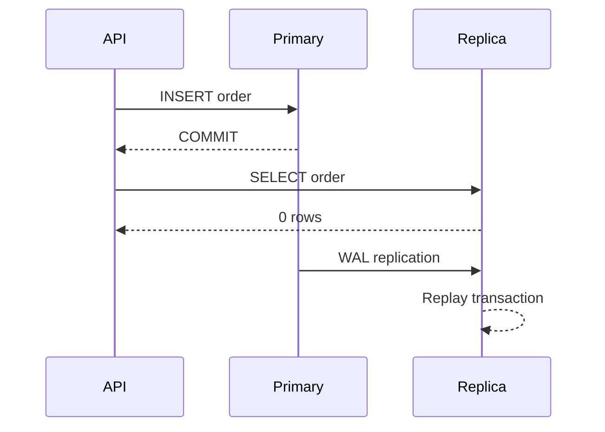
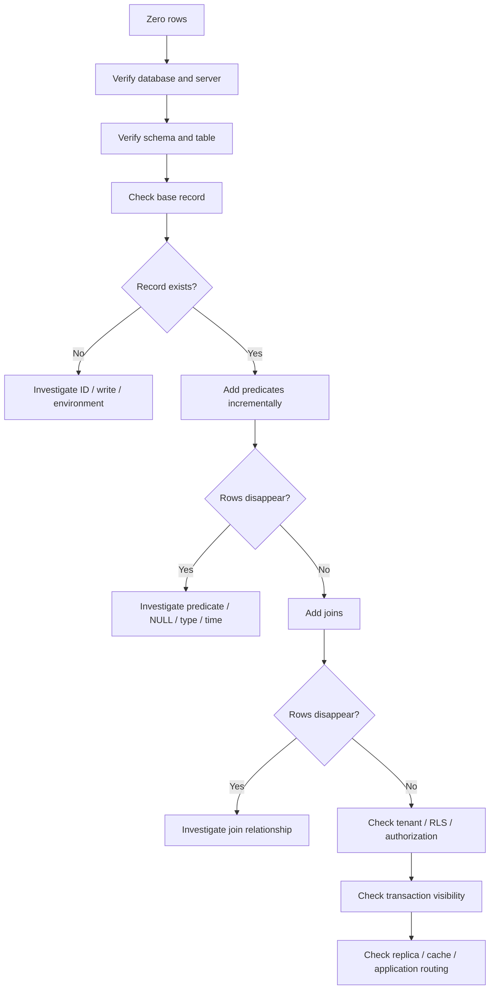

# 02- Query Returns No Rows

## Overview

A query that returns no rows is one of the most common SQL troubleshooting problems.

The SQL may be syntactically correct and execute successfully while returning an empty result set because the requested data does not satisfy the query's predicates, joins, visibility rules, transaction state, or routing assumptions.

The important distinction is:

```text
Query failed
    ≠
Query succeeded but returned zero rows
```

A zero-row result is often a **data, predicate, join, visibility, consistency, or application-routing problem**, not a database failure.

A production investigation should move from the simplest explanation toward deeper system-level causes:

```text
Correct database?
      ↓
Correct table/schema?
      ↓
Does the data exist?
      ↓
Does the predicate match?
      ↓
Do joins eliminate it?
      ↓
Are NULL semantics involved?
      ↓
Is tenant/authorization filtering involved?
      ↓
Is the transaction committed?
      ↓
Are you reading a replica?
      ↓
Is Redis/cache stale?
      ↓
Is application behavior changing the query?
```

---

## What Zero Rows Actually Means

Consider:

```sql
SELECT *
FROM app.orders
WHERE id = 12345;
```

If PostgreSQL returns:

```text
(0 rows)
```

the database successfully processed the statement.

It does **not** tell you why the row was not returned.

Possible explanations include:

| Cause | Example |
|---|---|
| Row does not exist | Wrong ID |
| Wrong database | Connected to staging |
| Wrong schema | Querying another table |
| Predicate mismatch | `status = 'active'` but row is `pending` |
| `NULL` semantics | `column = NULL` |
| Join filtering | `INNER JOIN` removes the row |
| Tenant filtering | Wrong `tenant_id` |
| RLS | Row-level policy excludes it |
| Uncommitted transaction | Another session has not committed |
| Replica lag | Read replica has not replayed the write |
| Cache | Application serves stale or missing cached data |
| Application query mutation | ORM adds additional predicates |
| Time boundary | Timestamp predicate excludes the row |

The troubleshooting goal is to identify which condition is true.

---

## First Verify the Environment

Before inspecting the query itself, verify where you are connected.

In `psql`:

```text
\conninfo
```

Then:

```sql
SELECT
    current_database() AS database,
    current_user AS user,
    inet_server_addr() AS server,
    inet_server_port() AS port,
    pg_is_in_recovery() AS is_replica;
```

This immediately answers:

```text
Which database?
Which role?
Which server?
Primary or replica?
```

A surprising number of "missing data" incidents are caused by querying:

```text
Wrong environment
Wrong database
Wrong schema
Wrong replica
```

Never assume the shell prompt or connection alias is sufficient evidence.

---

## Verify the Schema and Table

Check the search path:

```sql
SHOW search_path;
```

List tables:

```text
\dt *.*
```

Inspect the expected table:

```text
\d+ app.orders
```

Use an explicitly qualified table when troubleshooting:

```sql
SELECT *
FROM app.orders
WHERE id = 12345;
```

instead of relying on:

```sql
SELECT *
FROM orders
WHERE id = 12345;
```

This removes ambiguity caused by `search_path`.

---

## Verify That the Record Exists

Start with the simplest possible lookup.

```sql
SELECT
    id,
    tenant_id,
    status,
    created_at
FROM app.orders
WHERE id = 12345;
```

If it returns zero rows, remove assumptions one at a time.

For example:

```sql
SELECT
    COUNT(*)
FROM app.orders;
```

Then:

```sql
SELECT
    MIN(id),
    MAX(id),
    COUNT(*)
FROM app.orders;
```

This does not prove the requested record exists, but it establishes whether the table contains data and whether the requested identifier is plausible.

---

## Simplify the Query

When a complex query returns no rows, reduce it progressively.

Start with:

```sql
SELECT *
FROM app.orders
WHERE id = 12345;
```

Then add predicates:

```sql
SELECT *
FROM app.orders
WHERE id = 12345
  AND status = 'completed';
```

Then joins:

```sql
SELECT
    o.id,
    o.status,
    c.email
FROM app.orders AS o
JOIN app.customers AS c
    ON c.id = o.customer_id
WHERE o.id = 12345
  AND o.status = 'completed';
```

This identifies the condition that eliminates the row.

A useful diagnostic technique is:

```text
Base row exists
    ↓
Add predicate A
    ↓
Still exists?
    ↓
Add predicate B
    ↓
Still exists?
    ↓
Add JOIN
    ↓
Still exists?
```

---

## Predicate Debugging

Suppose:

```sql
SELECT *
FROM app.orders
WHERE customer_id = 123
  AND status = 'completed'
  AND created_at >= CURRENT_DATE - INTERVAL '30 days';
```

returns nothing.

Test each condition independently:

```sql
SELECT COUNT(*)
FROM app.orders
WHERE customer_id = 123;
```

```sql
SELECT COUNT(*)
FROM app.orders
WHERE customer_id = 123
  AND status = 'completed';
```

```sql
SELECT COUNT(*)
FROM app.orders
WHERE customer_id = 123
  AND status = 'completed'
  AND created_at >= CURRENT_DATE - INTERVAL '30 days';
```

The first query that changes from non-zero to zero identifies the relevant predicate.

---

## Inspect the Actual Row State

If you know the ID, inspect all relevant columns:

```sql
SELECT
    id,
    customer_id,
    tenant_id,
    status,
    created_at,
    updated_at,
    deleted_at
FROM app.orders
WHERE id = 12345;
```

This can reveal:

```text
Wrong tenant
Unexpected status
Soft deletion
Unexpected timestamp
NULL value
Different foreign key
```

Avoid debugging with only the column used in the failing predicate.

The complete row often explains the mismatch.

---

## `NULL` and Three-Valued Logic

One of the most common causes of unexpected empty results is incorrect `NULL` comparison.

This does not work as expected:

```sql
SELECT *
FROM app.orders
WHERE deleted_at = NULL;
```

Use:

```sql
SELECT *
FROM app.orders
WHERE deleted_at IS NULL;
```

Similarly:

```sql
WHERE deleted_at IS NOT NULL
```

must be used instead of:

```sql
WHERE deleted_at != NULL
```

SQL uses three-valued logic:

```text
TRUE
FALSE
UNKNOWN
```

Comparisons involving `NULL` generally produce `UNKNOWN`, which does not satisfy a `WHERE` condition.

---

## Boolean and Nullable Conditions

Consider:

```sql
WHERE is_active = TRUE;
```

This excludes:

```text
FALSE
NULL
```

If the business logic treats `NULL` differently, make the behavior explicit.

For example:

```sql
WHERE is_active IS NOT FALSE;
```

means:

```text
TRUE
or
NULL
```

The correct expression depends on the application's business semantics.

Do not replace predicates mechanically without understanding what `NULL` represents.

---

## Empty Strings vs `NULL`

These are different:

```text
NULL
''
'   '
```

Investigate:

```sql
SELECT
    COUNT(*) FILTER (WHERE email IS NULL) AS null_email,
    COUNT(*) FILTER (WHERE email = '') AS empty_email
FROM app.customers;
```

Applications may normalize empty values differently from the database.

Django, FastAPI, serializers, validation layers, and database defaults can all influence what values are stored.

---

## Type and Representation Mismatches

A logically correct value can still fail to match because the stored representation differs.

Examples:

```text
UUID formatting
Case sensitivity
Whitespace
Numeric vs text representation
Timezone interpretation
Enum values
JSON structure
```

Inspect the actual type:

```sql
SELECT
    column_name,
    data_type
FROM information_schema.columns
WHERE table_schema = 'app'
  AND table_name = 'orders'
  AND column_name IN ('id', 'status', 'created_at');
```

Do not solve a representation mismatch by adding arbitrary casts until you understand why the mismatch exists.

---

## Case Sensitivity

For ordinary PostgreSQL `text` comparisons:

```sql
SELECT *
FROM app.customers
WHERE email = 'USER@example.com';
```

does not generally match:

```text
user@example.com
```

if the stored values differ in case.

For case-insensitive requirements, use a deliberate strategy such as:

```sql
WHERE lower(email) = lower($1);
```

or an appropriate data type/indexing strategy.

For production systems, normalization at write time is often preferable when the business field has a defined canonical representation.

---

## Whitespace and Normalization

A value may appear identical in application logs while containing whitespace.

Inspect:

```sql
SELECT
    id,
    '[' || username || ']' AS visible_value,
    length(username) AS value_length
FROM app.users
WHERE id = 123;
```

This can expose:

```text
'john'
'john '
' john'
```

Do not normalize production data blindly.

First determine whether whitespace is legitimate or indicates an application validation defect.

---

## Time and Timestamp Filters

Time predicates frequently cause zero-row results.

Example:

```sql
SELECT *
FROM app.orders
WHERE created_at >= '2026-09-04'
  AND created_at < '2026-09-05';
```

This half-open interval is generally safer than:

```sql
WHERE created_at BETWEEN
    '2026-09-04 00:00:00'
    AND
    '2026-09-04 23:59:59';
```

The latter can mishandle fractional seconds and timestamp precision.

For production debugging, inspect:

```sql
SELECT
    MIN(created_at),
    MAX(created_at)
FROM app.orders;
```

Then inspect the exact boundary values.

---

## Time Zone Problems

A timestamp can appear correct in:

```text
Application logs
Database
Browser
Monitoring system
```

while representing different instants because of timezone conversion.

Inspect PostgreSQL settings:

```sql
SHOW timezone;
```

Inspect the stored value:

```sql
SELECT
    created_at,
    created_at AT TIME ZONE 'UTC' AS utc_time
FROM app.orders
WHERE id = 12345;
```

Be explicit about whether a business requirement means:

```text
UTC instant
User-local date
Server-local date
Calendar day in a specific timezone
```

---

## `INNER JOIN` Can Remove Existing Rows

Suppose the order exists:

```sql
SELECT *
FROM app.orders
WHERE id = 12345;
```

But this returns nothing:

```sql
SELECT
    o.id,
    c.email
FROM app.orders AS o
JOIN app.customers AS c
    ON c.id = o.customer_id
WHERE o.id = 12345;
```

The order may exist while its referenced customer does not.

Test the relationship:

```sql
SELECT
    id,
    customer_id
FROM app.orders
WHERE id = 12345;
```

Then:

```sql
SELECT
    id,
    email
FROM app.customers
WHERE id = (
    SELECT customer_id
    FROM app.orders
    WHERE id = 12345
);
```

If the second query returns nothing, the join explains the empty result.

---

## `LEFT JOIN` as a Diagnostic Tool

Temporarily change:

```sql
JOIN
```

to:

```sql
LEFT JOIN
```

to determine whether the joined table is eliminating the base row.

```sql
SELECT
    o.id,
    o.customer_id,
    c.id AS matched_customer_id,
    c.email
FROM app.orders AS o
LEFT JOIN app.customers AS c
    ON c.id = o.customer_id
WHERE o.id = 12345;
```

If:

```text
o.id exists
c.id is NULL
```

the join relationship is the issue.

Do not permanently change an `INNER JOIN` to `LEFT JOIN` simply to make records appear. The original join may correctly represent a required relationship.

---

## Join Predicate Errors

A query may contain a valid but incorrect join condition.

For example:

```sql
JOIN app.customers AS c
    ON c.id = o.id
```

when the intended relationship is:

```sql
JOIN app.customers AS c
    ON c.id = o.customer_id
```

The query can execute successfully and return zero rows.

When debugging joins, verify:

```text
Join columns
Data types
Foreign-key relationship
Cardinality
Nullability
Business relationship
```

---

## Additional `WHERE` Conditions After a `LEFT JOIN`

This is a common subtle bug:

```sql
SELECT
    o.id,
    c.email
FROM app.orders AS o
LEFT JOIN app.customers AS c
    ON c.id = o.customer_id
WHERE c.status = 'active';
```

The `WHERE` condition eliminates rows where `c` is `NULL`, effectively making the result behave like an inner join for that condition.

If the intention is to constrain the joined table while preserving unmatched orders:

```sql
SELECT
    o.id,
    c.email
FROM app.orders AS o
LEFT JOIN app.customers AS c
    ON c.id = o.customer_id
   AND c.status = 'active';
```

The location of predicates matters.

---

## `EXISTS` and Relationship Checks

When the requirement is "return rows where a related record exists", `EXISTS` can make the intent explicit:

```sql
SELECT
    o.id,
    o.status
FROM app.orders AS o
WHERE o.customer_id = 123
  AND EXISTS (
      SELECT 1
      FROM app.payments AS p
      WHERE p.order_id = o.id
        AND p.status = 'captured'
  );
```

If this returns no rows, independently test:

```sql
SELECT
    o.id
FROM app.orders AS o
WHERE o.customer_id = 123;
```

and:

```sql
SELECT
    p.order_id,
    p.status
FROM app.payments AS p
WHERE p.order_id IN (
    SELECT id
    FROM app.orders
    WHERE customer_id = 123
);
```

This isolates whether the relationship or status condition is responsible.

---

## `NOT IN` and `NULL`

`NOT IN` can produce surprising results when the subquery contains `NULL`.

For example:

```sql
WHERE customer_id NOT IN (
    SELECT customer_id
    FROM app.blocked_customers
);
```

If the subquery contains `NULL`, SQL's three-valued logic can cause rows to become `UNKNOWN` rather than `TRUE`.

When the intended semantics are "there is no matching row", prefer `NOT EXISTS`:

```sql
WHERE NOT EXISTS (
    SELECT 1
    FROM app.blocked_customers AS b
    WHERE b.customer_id = c.id
);
```

This is both clearer semantically and safer around `NULL`.

---

## `WHERE` vs `HAVING`

Aggregation can produce an empty result because filtering occurs at the wrong stage.

`WHERE` filters rows before grouping:

```sql
SELECT
    customer_id,
    COUNT(*) AS order_count
FROM app.orders
WHERE status = 'completed'
GROUP BY customer_id;
```

`HAVING` filters groups after aggregation:

```sql
SELECT
    customer_id,
    COUNT(*) AS order_count
FROM app.orders
GROUP BY customer_id
HAVING COUNT(*) >= 10;
```

If no customer has ten qualifying orders, the query correctly returns zero rows.

Debug by inspecting intermediate counts.

---

## `DISTINCT`, `GROUP BY`, and Aggregation

A query may appear to "lose" data because the final projection changes the result shape.

Example:

```sql
SELECT DISTINCT status
FROM app.orders;
```

returns statuses, not orders.

Similarly:

```sql
SELECT
    customer_id,
    COUNT(*)
FROM app.orders
GROUP BY customer_id;
```

returns one row per customer.

When debugging, compare:

```text
Base row count
Filtered row count
Grouped row count
Final result count
```

Do not compare row counts across queries that intentionally have different result cardinalities.

---

## Soft Deletes

Many backend applications implement soft deletion:

```text
deleted_at IS NULL
```

A record may physically exist:

```sql
SELECT *
FROM app.orders
WHERE id = 12345;
```

but the application may use:

```sql
SELECT *
FROM app.orders
WHERE id = 12345
  AND deleted_at IS NULL;
```

Check:

```sql
SELECT
    id,
    deleted_at
FROM app.orders
WHERE id = 12345;
```

Django managers and application repositories may automatically add similar filters.

Always distinguish:

```text
Record does not physically exist
```

from:

```text
Record exists but is logically deleted
```

---

## Tenant Filtering

Multi-tenant applications commonly include:

```sql
WHERE tenant_id = $1
```

A row can exist but belong to another tenant.

Inspect:

```sql
SELECT
    id,
    tenant_id
FROM app.orders
WHERE id = 12345;
```

Then verify the request context:

```text
Authenticated user
Tenant ID
Organization membership
Service identity
Database role
```

Never remove tenant filtering merely to make a query return a row.

The correct question is:

> Should this caller be allowed to see the row?

---

## Row-Level Security

PostgreSQL Row-Level Security can make an existing row invisible to a role.

Inspect policies:

```sql
SELECT
    schemaname,
    tablename,
    policyname,
    permissive,
    roles,
    cmd,
    qual,
    with_check
FROM pg_policies
WHERE schemaname = 'app'
  AND tablename = 'orders';
```

Verify the current role:

```sql
SELECT current_user;
```

RLS is evaluated in addition to ordinary table privileges.

Therefore:

```text
Row exists
+
SELECT privilege exists
+
RLS policy excludes row
=
Query returns zero rows
```

Do not disable RLS casually in production.

---

## Application Authorization

The database may contain the row while the API intentionally hides it.

Typical flow:

```text
HTTP request
    ↓
Authentication
    ↓
Tenant resolution
    ↓
Authorization
    ↓
ORM filters
    ↓
SQL
    ↓
PostgreSQL
```

For example, Django may effectively generate:

```sql
SELECT ...
FROM app.orders
WHERE id = $1
  AND tenant_id = $2
  AND deleted_at IS NULL;
```

The user may report:

> "Order 12345 does not exist."

The database may actually contain it, but the application correctly prevents that user from seeing it.

---

## Transaction Visibility

Suppose one session inserts:

```sql
BEGIN;

INSERT INTO app.orders (
    id,
    customer_id,
    status
)
VALUES (
    12345,
    100,
    'pending'
);
```

Before:

```sql
COMMIT;
```

another transaction generally cannot see the uncommitted row under PostgreSQL's normal transaction visibility rules.

The second session may therefore return:

```text
(0 rows)
```

while the first session can see the row.

The troubleshooting question becomes:

```text
Has the write committed?
Which transaction is reading?
Which isolation level is active?
```

---

## Uncommitted Writes

When a write appears successful but a subsequent read returns nothing, inspect the transaction boundary.

Typical application mistake:

```text
Write
 ↓
No commit
 ↓
Request ends / connection state changes
 ↓
Other request cannot see data
```

With Django:

```python
from django.db import transaction

with transaction.atomic():
    Order.objects.create(
        id=12345,
        customer_id=100,
        status="pending",
    )
```

The database commit occurs when the atomic block successfully completes.

For SQLAlchemy, the application must explicitly manage the transaction according to its configured session/unit-of-work pattern.

The key is not the framework syntax.

The key is knowing where the transaction begins and commits.

---

## Replica Lag

A particularly important production scenario:



The write succeeded on the primary, but the replica had not replayed it yet.

Verify:

```sql
SELECT pg_is_in_recovery();
```

On the primary:

```sql
SELECT
    application_name,
    state,
    sync_state,
    write_lag,
    flush_lag,
    replay_lag
FROM pg_stat_replication;
```

Do not interpret a stale replica read as immediate evidence of data loss.

---

## Read-After-Write Consistency

An API may write to the primary and read from a replica:

```text
POST /orders
    ↓
Primary

GET /orders/12345
    ↓
Replica
```

This creates a read-after-write consistency problem if replication is asynchronous.

Possible solutions:

- Route the immediate read to the primary.
- Use request/session-level consistency.
- Use LSN-aware routing where appropriate.
- Retry briefly when bounded staleness is acceptable.
- Design the API around explicit consistency requirements.

Do not use arbitrary sleeps as a general consistency mechanism.

---

## Cache-Related Empty Results

The database may contain the row while Redis contains a stale negative result.

Example:

```text
GET /orders/12345
    ↓
Redis
    ↓
"not found"
```

even though:

```sql
SELECT *
FROM app.orders
WHERE id = 12345;
```

returns the row.

Investigate:

```text
Cache key
Cache TTL
Negative caching
Invalidation
Write ordering
Replica routing
Cache population
```

The application data path may be:

```text
API
 ↓
Redis
 ↓
PostgreSQL
```

rather than:

```text
API
 ↓
PostgreSQL
```

---

## ORM-Generated Filters

The SQL you think the application executes may not be the SQL it actually executes.

Django example:

```python
queryset = Order.objects.filter(id=12345)
```

Inspect the generated SQL when debugging:

```python
print(queryset.query)
```

Look for:

```text
tenant filters
soft-delete filters
joins
ordering
annotations
permissions
default managers
```

For SQLAlchemy, inspect the generated statement through SQLAlchemy's SQL logging or compiled statement representation.

Always troubleshoot the **actual SQL and parameters**, not just the source-level ORM expression.

---

## Parameter Mismatch

A query may be correct while the application supplies the wrong parameter.

Example:

```sql
SELECT *
FROM app.orders
WHERE id = $1;
```

The SQL is fine.

But the application may send:

```text
$1 = 12346
```

when the requested record is:

```text
12345
```

Capture safely:

```text
Query fingerprint
Parameter types
Non-sensitive parameter values
Request ID
Tenant ID
Application version
```

Do not log secrets or sensitive values merely to make troubleshooting easier.

---

## Prepared Statements and Parameter Types

Prepared statements can make parameter typing relevant.

For example, application code may send a value with a different type than expected.

Inspect the schema:

```sql
SELECT
    column_name,
    data_type
FROM information_schema.columns
WHERE table_schema = 'app'
  AND table_name = 'orders'
  AND column_name = 'id';
```

Prefer correctly typed parameters over relying on arbitrary casts.

A type mismatch that still allows the query to execute can be harder to identify than an explicit database error.

---

## Search and Pattern Matching

A search may return no rows because the matching semantics differ from user expectations.

Example:

```sql
WHERE name LIKE 'john'
```

matches the exact pattern `john`, not arbitrary strings containing `john`.

For substring matching:

```sql
WHERE name LIKE '%john%';
```

For case-insensitive matching in PostgreSQL:

```sql
WHERE name ILIKE '%john%';
```

For production workloads, understand the indexing implications of leading wildcards:

```text
LIKE 'john%'
```

can be indexed with appropriate strategy more readily than:

```text
LIKE '%john%'
```

Do not change search semantics solely to make a test pass.

---

## JSON and Nested Data

A row may exist while a JSON predicate does not match the actual structure.

Inspect the stored value:

```sql
SELECT
    id,
    metadata
FROM app.orders
WHERE id = 12345;
```

Then test the JSON expression independently.

For example:

```sql
SELECT *
FROM app.orders
WHERE metadata @> '{"source": "mobile"}';
```

Verify whether the stored JSON actually contains:

```json
{
  "source": "mobile"
}
```

rather than:

```json
{
  "source": {
    "name": "mobile"
  }
}
```

JSON path assumptions are a common source of zero-row results.

---

## Query Debugging Workflow

Use this sequence:



The sequence intentionally starts with simple explanations.

---

## Production Diagnostic Query Set

### Verify Environment

```sql
SELECT
    current_database(),
    current_user,
    inet_server_addr(),
    inet_server_port(),
    pg_is_in_recovery();
```

### Check Base Record

```sql
SELECT
    id,
    tenant_id,
    status,
    deleted_at,
    created_at,
    updated_at
FROM app.orders
WHERE id = 12345;
```

### Check Related Record

```sql
SELECT
    c.id,
    c.email,
    c.status
FROM app.customers AS c
WHERE c.id = (
    SELECT customer_id
    FROM app.orders
    WHERE id = 12345
);
```

### Check RLS

```sql
SELECT
    policyname,
    cmd,
    roles,
    qual,
    with_check
FROM pg_policies
WHERE schemaname = 'app'
  AND tablename = 'orders';
```

### Check Replica State

```sql
SELECT pg_is_in_recovery();
```

These queries should be adapted to the specific schema rather than copied blindly.

---

## A Practical Example

Suppose an API returns:

```text
GET /orders/12345

404 Not Found
```

The first database query returns:

```sql
SELECT *
FROM app.orders
WHERE id = 12345;
```

Result:

```text
1 row
```

Therefore the row exists.

Next inspect:

```sql
SELECT
    id,
    tenant_id,
    status,
    deleted_at
FROM app.orders
WHERE id = 12345;
```

Suppose:

```text
tenant_id = 42
deleted_at = NULL
status = completed
```

The request belongs to tenant `99`.

The application query is effectively:

```sql
SELECT *
FROM app.orders
WHERE id = 12345
  AND tenant_id = 99
  AND deleted_at IS NULL;
```

Result:

```text
0 rows
```

The database is behaving correctly.

The problem is either:

```text
Incorrect tenant context
```

or:

```text
The caller is not authorized to access tenant 42's order
```

This distinction matters operationally and from a security perspective.

---

## Common Mistakes

### Assuming Zero Rows Means Missing Data

The row may exist but be excluded by:

```text
Predicate
Join
Tenant
RLS
Soft delete
Replica lag
Cache
```

### Debugging the Full Query First

Start with the base table and add complexity incrementally.

### Ignoring `NULL`

Use:

```sql
IS NULL
IS NOT NULL
```

rather than equality operators.

### Forgetting `INNER JOIN` Semantics

An existing base row can disappear when the joined row is missing.

### Changing `INNER JOIN` to `LEFT JOIN` Permanently

Use `LEFT JOIN` as a diagnostic technique when appropriate, not as a workaround for incorrect data modeling.

### Removing Tenant Filters

Never bypass tenant isolation just to prove that a record exists.

### Disabling RLS

Do not weaken a security boundary during routine debugging.

### Ignoring Replica Lag

A write on the primary may not immediately appear on an asynchronous replica.

### Ignoring the Cache

The API may never reach PostgreSQL.

### Assuming ORM Code Equals SQL

Managers, scopes, joins, authorization, and soft-delete filters can alter the final query.

### Using Broad Debug Queries

Avoid:

```sql
SELECT *
FROM app.orders;
```

on large production tables.

Use targeted columns and predicates.

---

## Security Considerations

Zero-row troubleshooting often involves sensitive data.

Follow:

- Least-privilege database access
- Read-only roles for diagnostics
- Tenant isolation
- RLS policies
- Controlled production access
- Sensitive-data redaction
- Audit logging for privileged access

Do not prove that a record exists by exposing it to an unauthorized user.

A secure system may intentionally produce:

```text
0 rows
```

or:

```text
404 Not Found
```

to avoid leaking resource existence.

---

## Performance Considerations

A zero-row query can still be expensive.

For example:

```sql
SELECT *
FROM app.orders
WHERE some_unindexed_expression = 'value';
```

may scan a large table even when it returns:

```text
0 rows
```

Use:

```sql
EXPLAIN
SELECT ...;
```

to understand the access path.

If necessary and safe:

```sql
EXPLAIN (ANALYZE, BUFFERS)
SELECT ...;
```

Investigate:

```text
Sequential scans
Rows removed by filter
Index usage
Actual vs estimated rows
Buffer reads
Execution time
```

"Returns no rows" describes the result cardinality, not the cost of producing that result.

---

## Reliability Considerations

For production systems, distinguish between:

```text
No rows because the data is absent
```

and:

```text
No rows because the read path is stale or filtered
```

The latter can occur through:

```text
Replica lag
Cache inconsistency
Transaction isolation
Application routing
Tenant context
RLS
```

This distinction is particularly important for distributed systems where the write and read paths are not necessarily served by the same database session.

---

## Troubleshooting Checklist

### Environment

- [ ] Confirm database.
- [ ] Confirm server.
- [ ] Confirm role.
- [ ] Confirm primary vs replica.
- [ ] Confirm schema and `search_path`.

### Data

- [ ] Query the base table directly.
- [ ] Verify the identifier.
- [ ] Inspect the complete relevant row.
- [ ] Check soft-delete columns.
- [ ] Check tenant ownership.

### Query

- [ ] Remove predicates temporarily.
- [ ] Add predicates one at a time.
- [ ] Check `NULL` semantics.
- [ ] Check data types.
- [ ] Check timestamps and timezone.
- [ ] Check case and whitespace.
- [ ] Inspect joins.
- [ ] Inspect aggregation.

### Security and Visibility

- [ ] Check tenant context.
- [ ] Check RLS policies.
- [ ] Check application authorization.
- [ ] Verify current database role.

### Distributed Systems

- [ ] Check transaction commit state.
- [ ] Check replica lag.
- [ ] Check read routing.
- [ ] Check Redis/cache behavior.
- [ ] Check application-generated SQL.

### Verification

- [ ] Reproduce with the exact parameters.
- [ ] Confirm the original failure.
- [ ] Verify the root cause.
- [ ] Verify the fix without weakening security boundaries.

---

## Interview Perspective

A strong answer to:

> "A SQL query returns zero rows, but you know the data exists. How would you troubleshoot it?"

should follow a structured approach:

```text
1. Verify the database, schema, server, and role.
2. Query the base table directly using the exact identifier.
3. Inspect the actual row values.
4. Remove predicates and add them back incrementally.
5. Check NULL, type, case, whitespace, and timestamp semantics.
6. Investigate INNER JOIN and aggregation behavior.
7. Check tenant filters, soft deletes, authorization, and RLS.
8. Verify transaction visibility and commit state.
9. Determine whether the read is coming from a lagging replica.
10. Check Redis or other caches.
11. Inspect the actual ORM-generated SQL and parameters.
12. Verify the fix without bypassing security or consistency requirements.
```

The senior-level insight is:

> **"The row exists" is not enough. You must determine whether the current execution context is supposed to see that row.**

---

## Senior Troubleshooting Heuristic

When a query returns no rows, reason through these layers:

```text
Existence
   ↓
Location
   ↓
Predicate
   ↓
Relationship
   ↓
Visibility
   ↓
Consistency
   ↓
Application behavior
```

Where:

```text
Existence
→ Does the row physically exist?

Location
→ Am I querying the correct database/table/server?

Predicate
→ Does every filter match?

Relationship
→ Are joins or subqueries eliminating it?

Visibility
→ Do tenant filters, RLS, or authorization exclude it?

Consistency
→ Has the transaction committed and has the replica caught up?

Application behavior
→ Is the ORM, cache, or routing changing what the user sees?
```

This model prevents premature conclusions and scales well from local debugging to distributed production systems.

---

## Key Takeaways

- **Zero rows is a result, not a root cause:** systematically distinguish missing data from predicate, join, visibility, transaction, replica, cache, and application-routing problems.
- **Simplify before investigating complexity:** verify the environment, query the base record, and add predicates and joins incrementally to identify exactly where rows disappear.
- **Visibility is part of correctness:** tenant filters, RLS, soft deletes, authorization, transaction boundaries, and replica consistency can legitimately make an existing row invisible.
- **Debug the real execution path:** correlate SQL with ORM-generated queries, parameters, connection routing, Redis, replicas, and application behavior rather than examining the SQL statement in isolation.
- **Never weaken security to prove existence:** use least-privileged diagnostic access and preserve tenant isolation, RLS, authorization, and other production security boundaries during troubleshooting.