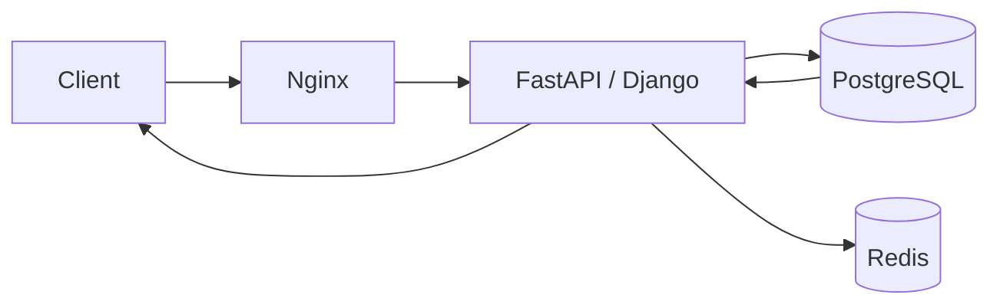
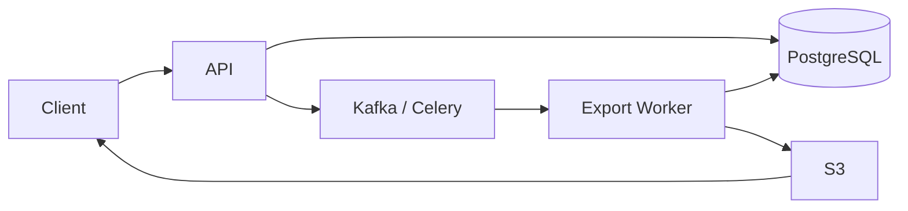
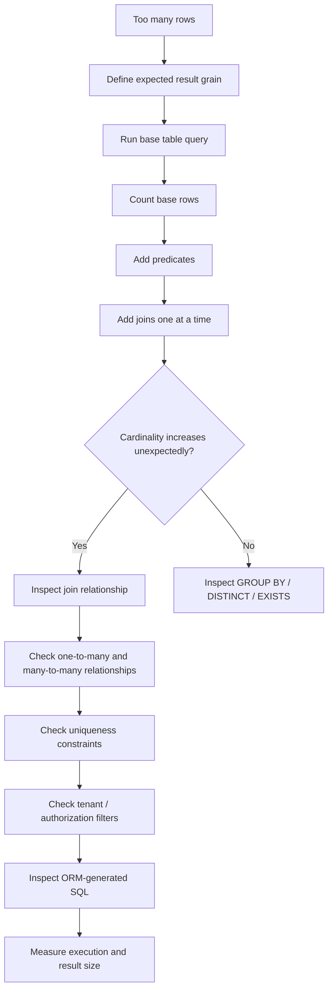

# 03- Query Returns Too Many Rows

## Overview

A query returning too many rows is usually a **correctly executed query with incorrect result cardinality**.

The database is not necessarily malfunctioning. More commonly, the SQL does not express the intended relationship, uniqueness assumption, filtering rule, or aggregation boundary.

Typical causes include:

- Missing or incomplete `WHERE` predicates
- Incorrect join conditions
- One-to-many or many-to-many joins multiplying rows
- Missing `DISTINCT`
- Incorrect `GROUP BY`
- Joining before filtering
- Duplicate source data
- Incorrect assumptions about uniqueness
- Correlated subqueries or `EXISTS` logic
- ORM relationship expansion
- Missing tenant or authorization filters
- Incorrect pagination
- Accidental Cartesian products

The key distinction is:

```text
Too many rows
    ≠
Database returned duplicate data
```

The database returns the rows requested by the relational expression. If the result is larger than expected, first determine **which relational operation increased cardinality**.

---

## Result Cardinality

Cardinality is the number of rows produced by a query or intermediate operation.

For example:

```sql
SELECT *
FROM app.customers
WHERE id = 123;
```

may be expected to return exactly one row.

But:

```sql
SELECT *
FROM app.orders
WHERE customer_id = 123;
```

may legitimately return many rows.

Before debugging, define the expected cardinality:

| Requirement | Expected cardinality |
|---|---:|
| Lookup customer by primary key | 0 or 1 |
| Find all customer orders | 0..N |
| Find customer's current subscription | 0 or 1 |
| Find products in a category | 0..N |
| Check whether a payment exists | 0 or 1 or boolean |
| Count customer's orders | Exactly 1 aggregate row |

Many SQL bugs begin with an undefined assumption such as:

> "This query should return one row."

The database needs a reason why that should be true.

---

## Start With the Expected Relationship

Before modifying SQL, identify the relationship between entities.

For example:

```text
Customer
   │
   └── 1 : N ──> Orders
```

A customer can legitimately produce multiple rows after joining orders.

Similarly:

```text
Order
   │
   └── 1 : N ──> Order Items
```

Joining both tables can multiply rows.

A senior-level SQL investigation starts by asking:

```text
What is the grain of this result?

One row per customer?
One row per order?
One row per order item?
One row per customer-order pair?
One row per aggregated group?
```

If the query does not preserve the intended grain, the result can become unexpectedly large.

---

## Verify the Base Query

Start with the simplest query possible.

```sql
SELECT
    id,
    customer_id,
    status
FROM app.orders
WHERE customer_id = 123;
```

Check:

```sql
SELECT COUNT(*)
FROM app.orders
WHERE customer_id = 123;
```

If the count itself is higher than expected, the issue may be the data model or the filter.

If the base query returns the expected number of rows but the final query does not, investigate the operations added afterward.

---

## Add Query Operations Incrementally

A useful debugging pattern is:

```text
Base table
    ↓
WHERE
    ↓
JOIN
    ↓
Additional JOIN
    ↓
GROUP BY
    ↓
HAVING
    ↓
DISTINCT
    ↓
ORDER BY / LIMIT
```

Measure cardinality after each logical step.

For example:

```sql
SELECT COUNT(*)
FROM app.orders
WHERE customer_id = 123;
```

Then:

```sql
SELECT COUNT(*)
FROM app.orders AS o
JOIN app.customers AS c
    ON c.id = o.customer_id
WHERE o.customer_id = 123;
```

Then add additional joins one at a time.

The first operation that increases the count unexpectedly is usually the strongest lead.

---

## The Most Common Cause: Join Multiplication

Consider:

```text
Customer
  1
  │
  ├── Order A
  ├── Order B
  └── Order C
```

Joining the customer to orders produces three rows.

That is expected.

Now suppose each order has multiple items:

```text
Order A → Item 1, Item 2
Order B → Item 3, Item 4, Item 5
```

Joining:

```text
customers
    JOIN orders
    JOIN order_items
```

produces:

```text
Order A × 2
Order B × 3
```

The result is now five rows.

If another one-to-many table is joined, multiplication can become much larger.

---

## Diagnosing Join Multiplication

Suppose:

```sql
SELECT
    o.id,
    oi.id AS item_id
FROM app.orders AS o
JOIN app.order_items AS oi
    ON oi.order_id = o.id
WHERE o.customer_id = 123;
```

Inspect the number of items per order:

```sql
SELECT
    o.id,
    COUNT(oi.id) AS item_count
FROM app.orders AS o
JOIN app.order_items AS oi
    ON oi.order_id = o.id
WHERE o.customer_id = 123
GROUP BY o.id
ORDER BY item_count DESC;
```

If the application expected one row per order, this query is at the wrong grain.

The database is correctly returning one row per:

```text
order × order_item
```

not one row per order.

---

## Query Grain

Always identify the intended grain explicitly.

For example:

```text
Expected:
one row per order

Actual:
one row per order item
```

This is one of the most useful concepts for diagnosing SQL cardinality problems.

Consider:

```sql
SELECT
    o.id,
    oi.product_id,
    oi.quantity
FROM app.orders AS o
JOIN app.order_items AS oi
    ON oi.order_id = o.id;
```

The natural grain is:

```text
order item
```

If you need one row per order, aggregate:

```sql
SELECT
    o.id,
    COUNT(oi.id) AS item_count,
    SUM(oi.quantity) AS total_quantity
FROM app.orders AS o
JOIN app.order_items AS oi
    ON oi.order_id = o.id
GROUP BY o.id;
```

The query has intentionally changed the grain back to:

```text
order
```

---

## Incomplete Join Conditions

A join can multiply rows when the relationship is under-specified.

Incorrect:

```sql
JOIN app.order_items AS oi
    ON oi.order_id = o.id
```

may be correct for an order-to-items relationship.

But consider a table where the relationship requires multiple columns:

```text
tenant_id
order_id
```

An incomplete join such as:

```sql
ON oi.order_id = o.id
```

can match rows belonging to other tenants.

The intended relationship may require:

```sql
ON oi.order_id = o.id
AND oi.tenant_id = o.tenant_id
```

The exact condition depends on the schema and constraints.

When debugging excessive rows, inspect:

- Foreign keys
- Composite keys
- Unique constraints
- Tenant boundaries
- Join columns
- Data types
- Relationship cardinality

---

## Cartesian Products

A Cartesian product occurs when rows from two relations are combined without a valid relationship condition.

For example:

```sql
SELECT
    o.id,
    c.id
FROM app.orders AS o
CROSS JOIN app.customers AS c;
```

If there are:

```text
10,000 orders
10,000 customers
```

the result can contain:

```text
100,000,000 rows
```

An accidental Cartesian product can happen when a join condition is missing or incorrectly constructed.

Bad:

```sql
FROM app.orders AS o,
     app.customers AS c
```

Prefer explicit joins:

```sql
FROM app.orders AS o
JOIN app.customers AS c
    ON c.id = o.customer_id
```

Explicit `JOIN` syntax makes relationships much easier to review.

---

## Many-to-Many Relationships

Many-to-many relationships naturally multiply rows.

For example:

```text
users
  ↕
user_roles
  ↕
roles
```

A user with three roles produces three rows when joining through the relationship table.

Similarly:

```text
orders
  ↕
order_tags
  ↕
tags
```

can produce multiple rows per order.

If the requirement is:

> "Return orders that have at least one matching tag."

do not necessarily join the tag rows into the result.

Use `EXISTS` when only existence matters:

```sql
SELECT
    o.id,
    o.status
FROM app.orders AS o
WHERE EXISTS (
    SELECT 1
    FROM app.order_tags AS ot
    JOIN app.tags AS t
        ON t.id = ot.tag_id
    WHERE ot.order_id = o.id
      AND t.name = 'priority'
);
```

This preserves the order-level grain.

---

## `EXISTS` vs `JOIN`

Use a `JOIN` when you need columns from the related relation or intentionally want its rows.

Use `EXISTS` when the requirement is primarily:

```text
Does a related record exist?
```

Compare:

```sql
SELECT
    o.id
FROM app.orders AS o
JOIN app.order_tags AS ot
    ON ot.order_id = o.id
JOIN app.tags AS t
    ON t.id = ot.tag_id
WHERE t.name = 'priority';
```

with:

```sql
SELECT
    o.id
FROM app.orders AS o
WHERE EXISTS (
    SELECT 1
    FROM app.order_tags AS ot
    JOIN app.tags AS t
        ON t.id = ot.tag_id
    WHERE ot.order_id = o.id
      AND t.name = 'priority'
);
```

If an order has multiple matching tag rows, the `JOIN` can produce multiple copies of the order.

`EXISTS` expresses the business requirement more directly.

---

## `DISTINCT` Is Not a Universal Fix

A common response to duplicate-looking results is:

```sql
SELECT DISTINCT ...
```

This can hide the symptom without fixing the underlying query.

Suppose:

```sql
SELECT DISTINCT
    o.id,
    oi.product_id
FROM app.orders AS o
JOIN app.order_items AS oi
    ON oi.order_id = o.id;
```

If an order contains different products, the rows are legitimately distinct.

`DISTINCT` cannot turn:

```text
multiple order items
```

into:

```text
one order
```

unless the selected columns are identical.

Before using `DISTINCT`, ask:

> Why are multiple rows being generated?

---

## When `DISTINCT` Is Appropriate

`DISTINCT` is appropriate when the result genuinely requires unique projected values.

For example:

```sql
SELECT DISTINCT
    customer_id
FROM app.orders;
```

The requirement is:

```text
one row per unique customer
```

That is a valid use.

For PostgreSQL, `DISTINCT ON` can be useful for selecting one row according to a deterministic ordering:

```sql
SELECT DISTINCT ON (customer_id)
    customer_id,
    id,
    created_at
FROM app.orders
ORDER BY customer_id, created_at DESC, id DESC;
```

This returns the latest order per customer according to the specified ordering.

The ordering must be deliberate. "First row" without deterministic ordering is not a reliable business rule.

---

## Aggregation as a Cardinality Tool

If the intended result is one row per entity, aggregation can express that explicitly.

Example:

```sql
SELECT
    customer_id,
    COUNT(*) AS order_count,
    MAX(created_at) AS latest_order_at
FROM app.orders
GROUP BY customer_id;
```

The result grain is:

```text
one row per customer_id
```

The important question is not:

> "How do I remove duplicates?"

It is:

> "What should one result row represent?"

---

## Incorrect `GROUP BY`

Aggregation can also create too many rows if too many columns are grouped.

Suppose:

```sql
GROUP BY customer_id, status
```

produces:

```text
one row per customer + status
```

not:

```text
one row per customer
```

For example:

```sql
SELECT
    customer_id,
    status,
    COUNT(*) AS order_count
FROM app.orders
GROUP BY customer_id, status;
```

A customer with three statuses produces three rows.

If the requirement is one row per customer, the grouping must reflect that requirement.

---

## Window Functions and Duplicate Results

Window functions preserve row cardinality.

For example:

```sql
SELECT
    customer_id,
    id,
    created_at,
    ROW_NUMBER() OVER (
        PARTITION BY customer_id
        ORDER BY created_at DESC, id DESC
    ) AS row_number
FROM app.orders;
```

This still returns every order.

To select only the latest order:

```sql
WITH ranked_orders AS (
    SELECT
        customer_id,
        id,
        created_at,
        ROW_NUMBER() OVER (
            PARTITION BY customer_id
            ORDER BY created_at DESC, id DESC
        ) AS row_number
    FROM app.orders
)
SELECT
    customer_id,
    id,
    created_at
FROM ranked_orders
WHERE row_number = 1;
```

The window function creates the ranking; the outer filter reduces cardinality.

---

## One-to-One Assumptions Must Be Enforced

Suppose application code assumes:

```text
one user → one active profile
```

but the database does not enforce uniqueness.

The query:

```sql
SELECT
    u.id,
    p.id AS profile_id
FROM app.users AS u
JOIN app.profiles AS p
    ON p.user_id = u.id
WHERE u.id = 123;
```

can return multiple rows.

If the business rule truly requires one profile per user, enforce it with a unique constraint or index.

For example:

```sql
CREATE UNIQUE INDEX profiles_user_id_uidx
ON app.profiles (user_id);
```

This is stronger than relying on application code to maintain uniqueness.

---

## Soft Deletes and Duplicate Logical Records

Suppose a system historically created multiple records for the same business identifier:

```text
customer_id
external_reference
deleted_at
```

A query may return multiple physical rows even though the application thinks there is one active record.

Investigate:

```sql
SELECT
    external_reference,
    COUNT(*)
FROM app.payments
GROUP BY external_reference
HAVING COUNT(*) > 1;
```

Then include business-state filters when appropriate:

```sql
WHERE deleted_at IS NULL
```

But do not use soft-delete filtering to hide a data-integrity problem that should instead be fixed with a constraint.

---

## Missing Tenant Filters

Multi-tenant applications are particularly vulnerable to excessive results.

Incorrect:

```sql
SELECT *
FROM app.orders
WHERE status = 'pending';
```

This returns pending orders across every tenant.

The intended query may be:

```sql
SELECT *
FROM app.orders
WHERE tenant_id = $1
  AND status = 'pending';
```

This is not merely a correctness issue.

It can become a severe security vulnerability if one tenant can retrieve another tenant's data.

Tenant boundaries should be enforced consistently through:

- Application authorization
- Database constraints
- RLS where appropriate
- Repository/query patterns
- Automated tests

---

## Row-Level Security

PostgreSQL Row-Level Security can provide an additional database-level boundary.

For example, an application may use a tenant-aware policy:

```sql
CREATE POLICY tenant_orders_policy
ON app.orders
USING (
    tenant_id = current_setting('app.tenant_id')::uuid
);
```

If RLS is correctly configured, a query without an explicit tenant predicate may still return only rows permitted by the active policy.

However, do not rely on RLS as a replacement for understanding the application query.

When investigating cardinality, inspect both:

```text
SQL predicates
```

and:

```text
RLS policies
```

---

## `LEFT JOIN` and Cardinality

A `LEFT JOIN` preserves rows from the left relation even when the right relation has no match.

But if the right relation contains multiple matches, it still multiplies rows.

For example:

```sql
SELECT
    c.id,
    o.id
FROM app.customers AS c
LEFT JOIN app.orders AS o
    ON o.customer_id = c.id;
```

A customer with five orders produces five rows.

`LEFT JOIN` means:

```text
Preserve unmatched left rows
```

It does **not** mean:

```text
One output row per left row
```

This distinction is frequently misunderstood.

---

## Filtering the Joined Table

Consider:

```sql
SELECT
    c.id,
    o.id
FROM app.customers AS c
LEFT JOIN app.orders AS o
    ON o.customer_id = c.id
WHERE o.status = 'completed';
```

The `WHERE` clause removes rows where `o` is `NULL`, effectively changing the practical behavior toward an inner join for that condition.

If you need:

```text
all customers
+
only completed orders
```

put the condition in the join:

```sql
SELECT
    c.id,
    o.id
FROM app.customers AS c
LEFT JOIN app.orders AS o
    ON o.customer_id = c.id
   AND o.status = 'completed';
```

This controls both semantics and resulting cardinality.

---

## Correlated Subqueries

Correlated subqueries can sometimes be replaced with joins or aggregation, but the key concern is understanding whether the subquery is scalar or set-valued.

A scalar subquery must return at most one row:

```sql
SELECT
    c.id,
    (
        SELECT o.created_at
        FROM app.orders AS o
        WHERE o.customer_id = c.id
        ORDER BY o.created_at DESC, o.id DESC
        LIMIT 1
    ) AS latest_order_at
FROM app.customers AS c;
```

The `LIMIT 1` establishes the scalar requirement.

Without it, multiple matching orders would cause a runtime error rather than silently return too many rows.

---

## Pagination Does Not Fix Incorrect Cardinality

Suppose an endpoint expects one result per customer but the query joins orders and returns:

```text
customer × order
```

Adding:

```sql
LIMIT 20;
```

does not fix the query.

It merely returns the first 20 incorrect rows.

Pagination should be applied to the correct result grain.

For example:

```text
Wrong:
customer × order → LIMIT 20

Correct:
customer → LIMIT 20
```

Then load related data separately or use an appropriate aggregation strategy.

---

## `LIMIT 1` Is Not a Data Integrity Fix

Another common workaround is:

```sql
SELECT *
FROM app.profiles
WHERE user_id = 123
LIMIT 1;
```

This suppresses multiple results but does not answer:

```text
Which profile is correct?
Why are multiple profiles present?
Is there a uniqueness violation?
```

If one profile is expected, enforce uniqueness.

If multiple profiles are valid and one must be selected, define a deterministic business rule:

```sql
ORDER BY created_at DESC, id DESC
LIMIT 1;
```

The ordering must represent the actual requirement.

---

## ORM-Induced Row Multiplication

Django ORM can generate joins that multiply rows.

For example:

```python
Customer.objects.filter(
    orders__status="completed",
)
```

can produce multiple customer rows when a customer has multiple completed orders.

If the API needs unique customers:

```python
Customer.objects.filter(
    orders__status="completed",
).distinct()
```

But `distinct()` should be used because the required result is one row per customer, not merely because duplicates "look wrong".

For more complex cases, `Exists` can better express the requirement:

```python
from django.db.models import Exists, OuterRef

completed_orders = Order.objects.filter(
    customer_id=OuterRef("pk"),
    status="completed",
)

customers = Customer.objects.annotate(
    has_completed_order=Exists(completed_orders),
).filter(
    has_completed_order=True,
)
```

This preserves the customer-level grain.

---

## Querysets and Relationship Expansion

Django methods such as:

```python
select_related()
prefetch_related()
```

have different effects.

`select_related()` uses SQL joins for suitable foreign-key/one-to-one relationships.

`prefetch_related()` generally performs additional queries and combines the results in Python.

If an API unexpectedly returns duplicate parent objects, inspect whether the queryset introduces a one-to-many join.

Do not assume:

```text
More joins = better performance
```

or:

```text
prefetch_related = SQL join
```

They solve different problems.

---

## FastAPI and SQLAlchemy

With SQLAlchemy, inspect the actual SQL generated by the ORM.

A query involving:

```python
select(Order).join(Order.items)
```

can produce one database row per matching order item even when the application is conceptually loading orders.

For debugging, inspect:

```text
Generated SQL
Join relationships
Selected columns
Result processing
```

The application-level object model does not change SQL cardinality.

---

## Inspect the Actual SQL

For ORM-generated queries, capture:

```text
SQL statement
Parameters
Database
Database role
Request ID
Application version
```

Avoid logging sensitive parameter values indiscriminately.

For PostgreSQL, tools such as:

```text
EXPLAIN
EXPLAIN ANALYZE
pg_stat_statements
```

can help determine how the database executes the query.

---

## Use `EXPLAIN` to Understand Row Multiplication

For a complex query:

```sql
EXPLAIN (ANALYZE, BUFFERS)
SELECT
    o.id,
    oi.id
FROM app.orders AS o
JOIN app.order_items AS oi
    ON oi.order_id = o.id
WHERE o.customer_id = 123;
```

Inspect:

```text
actual rows
loops
join type
estimated rows
actual rows
```

A large difference between:

```text
estimated rows
```

and:

```text
actual rows
```

can indicate statistics or correlation problems, but first determine whether the high cardinality is logically expected.

Query optimization should not be confused with query correctness.

---

## Data Integrity Checks

If a relationship is expected to be unique, verify the database.

For example:

```sql
SELECT
    user_id,
    COUNT(*)
FROM app.profiles
GROUP BY user_id
HAVING COUNT(*) > 1;
```

For business identifiers:

```sql
SELECT
    external_id,
    COUNT(*)
FROM app.payments
GROUP BY external_id
HAVING COUNT(*) > 1;
```

These queries help distinguish:

```text
SQL bug
```

from:

```text
Data integrity problem
```

If uniqueness is a business invariant, enforce it at the database layer where possible.

---

## Production Performance

Too many rows can create significant system-level problems even when the SQL is logically correct.

Large result sets cause:

```text
Database CPU
Database I/O
Network transfer
Driver memory usage
ORM object construction
Application CPU
JSON serialization
API response size
Client latency
```

For an API, returning 500,000 rows may be technically correct but operationally unacceptable.

Prefer:

- Pagination
- Filtering
- Projection
- Aggregation
- Keyset pagination
- Streaming where appropriate
- Asynchronous exports for large datasets

---

## Avoid `SELECT *`

When debugging, this can be useful:

```sql
SELECT *
FROM app.orders
WHERE customer_id = 123;
```

But production application queries should generally select only required columns:

```sql
SELECT
    id,
    status,
    created_at
FROM app.orders
WHERE customer_id = $1;
```

Reducing columns decreases:

```text
Disk reads
Memory usage
Network transfer
Driver decoding
Serialization cost
```

The biggest issue with too many rows is often not only row count but total result size.

---

## Large Result Sets and APIs

For REST APIs, define explicit pagination.

Offset pagination:

```sql
SELECT
    id,
    status,
    created_at
FROM app.orders
WHERE customer_id = $1
ORDER BY created_at DESC, id DESC
LIMIT 50
OFFSET 1000;
```

For large or frequently changing datasets, keyset pagination is generally more scalable:

```sql
SELECT
    id,
    status,
    created_at
FROM app.orders
WHERE customer_id = $1
  AND (created_at, id) < ($2, $3)
ORDER BY created_at DESC, id DESC
LIMIT 50;
```

The cursor represents the last row from the previous page.

The ordering and index must support the access pattern.

---

## Backend Architecture

A typical production path is:



An excessive-row problem can propagate through every layer:

```text
SQL returns 100,000 rows
        ↓
ORM creates 100,000 objects
        ↓
Python serializes 100,000 objects
        ↓
Response becomes very large
        ↓
Network latency increases
        ↓
Worker memory increases
        ↓
Request may time out
```

The correct fix is often at the SQL/result-grain level rather than increasing API timeouts.

---

## Async Processing for Large Exports

If the business requirement genuinely requires millions of rows, do not necessarily return them through a synchronous HTTP request.

A better architecture can be:



The API can return an export job identifier.

The worker can generate the result asynchronously and place the output in object storage.

This prevents large result sets from exhausting web-server resources.

---

## Security Considerations

Excessive rows can become a security issue when the query crosses authorization boundaries.

Particularly dangerous cases include:

```text
Missing tenant filter
Missing user ownership filter
Incorrect JOIN to authorization tables
Overly broad admin query
Incorrect RLS policy
```

For example:

```sql
SELECT *
FROM app.documents
WHERE status = 'active';
```

may expose every tenant's active documents.

The correct query may require:

```sql
WHERE tenant_id = $1
  AND status = 'active';
```

Security filtering should be treated as part of query correctness, not as an optional application feature.

---

## Reliability Considerations

Large result sets can cause:

- Request timeouts
- Worker memory exhaustion
- Connection pool occupation
- Network saturation
- Proxy buffering
- API gateway limits
- Client failures
- Increased database contention

A query that suddenly returns 10× more rows after a deployment should be investigated as a production regression.

Useful metrics include:

```text
Rows returned
Query duration
Bytes returned
Database CPU
Connection pool utilization
API response size
API latency
Timeout rate
```

---

## Troubleshooting Workflow

Use a structured process:



The key technique is **incremental cardinality analysis**.

---

## Production Diagnostic Checklist

### Result Semantics

- [ ] Define what one output row represents.
- [ ] Define expected minimum and maximum cardinality.
- [ ] Identify one-to-one, one-to-many, and many-to-many relationships.

### Query

- [ ] Run the base table query.
- [ ] Count rows before joins.
- [ ] Add predicates incrementally.
- [ ] Add joins one at a time.
- [ ] Inspect join conditions.
- [ ] Check `GROUP BY`.
- [ ] Check `DISTINCT`.
- [ ] Check `EXISTS`.
- [ ] Check subqueries.

### Data Integrity

- [ ] Verify foreign keys.
- [ ] Verify unique constraints.
- [ ] Check for duplicate business identifiers.
- [ ] Check soft-delete semantics.
- [ ] Verify tenant ownership.

### Application

- [ ] Inspect generated ORM SQL.
- [ ] Inspect parameters safely.
- [ ] Check serializer behavior.
- [ ] Check pagination.
- [ ] Check `select_related()` / `prefetch_related()` behavior.

### Production

- [ ] Measure query execution time.
- [ ] Measure result size.
- [ ] Inspect connection usage.
- [ ] Check API response size.
- [ ] Check memory usage.
- [ ] Use asynchronous exports for genuinely large datasets.

---

## Common Mistakes and Pitfalls

### Adding `DISTINCT` Immediately

Why it happens:

```text
Rows look duplicated
```

Why it is dangerous:

```text
The join relationship may still be incorrect.
```

Better approach:

```text
Find the operation that multiplied cardinality.
```

### Using `LIMIT 1` to Hide Duplicates

Why it happens:

```text
The API expects one row.
```

Why it is dangerous:

```text
An arbitrary row may be selected.
```

Better approach:

```text
Enforce uniqueness or define deterministic selection rules.
```

### Ignoring Query Grain

Why it happens:

```text
The developer thinks in objects rather than relational rows.
```

Better approach:

```text
Explicitly define whether the result is per customer,
order, item, event, or aggregate.
```

### Missing Join Predicates

Why it happens:

```text
Only part of a composite relationship is joined.
```

Better approach:

```text
Verify foreign keys and complete relationship predicates.
```

### Forgetting Tenant Filters

Why it happens:

```text
The query works in a single-tenant development environment.
```

Better approach:

```text
Make tenant isolation a first-class query invariant.
```

### Using `SELECT *` for Large Results

Why it happens:

```text
It is convenient during development.
```

Better approach:

```text
Project only the columns required by the consumer.
```

### Applying Pagination Before Defining Correct Grain

Why it happens:

```text
The result is too large.
```

Better approach:

```text
Fix cardinality first, then paginate the correct result set.
```

### Assuming the ORM Returns One Object Per SQL Row

ORMs may deduplicate or materialize relationships differently depending on the query and API.

Always inspect the SQL and understand the result processing semantics.

---

## Interview Traps

### "The query returns duplicate rows. Should I use `DISTINCT`?"

A strong answer:

> First determine why multiple rows exist. `DISTINCT` is appropriate only when duplicate projected values are semantically unwanted. It should not hide an incorrect join or missing uniqueness constraint.

### "Why does a join return more rows than the left table?"

Because joins do not preserve one-to-one cardinality automatically.

If one left row matches three right rows:

```text
1 × 3 = 3 output rows
```

### "How do you return one row per parent when joining children?"

Possible strategies include:

- `GROUP BY` and aggregation
- `EXISTS`
- Window functions
- `DISTINCT ON` in PostgreSQL
- A carefully defined subquery
- Separate queries / prefetching
- Enforcing uniqueness if the relationship should actually be one-to-one

### "Is `LEFT JOIN` one row per left row?"

No.

It preserves unmatched left rows but still produces multiple rows when multiple right-side matches exist.

### "Does `LIMIT` solve an excessive-result problem?"

No.

It limits the output but does not correct the query's semantics.

---

## Senior-Level Reasoning

When a query returns too many rows, think in terms of **cardinality propagation**:

```text
Base relation
     ↓
Predicate selectivity
     ↓
Join cardinality
     ↓
Aggregation
     ↓
Projection
     ↓
Final result
```

For every join, ask:

```text
What is the relationship?

1:1
1:N
N:1
N:N
```

For every result, ask:

```text
What does one row represent?
```

For every uniqueness assumption, ask:

```text
Where is it enforced?
```

A production-grade answer should consider both:

```text
Logical correctness
```

and:

```text
Operational cost
```

because returning too many rows can cause correctness, security, latency, memory, and scalability problems simultaneously.

---

## Key Takeaways

- **Define result grain first:** know whether one row represents a customer, order, item, relationship, or aggregate before diagnosing cardinality.
- **Join multiplication is the primary suspect:** one-to-many and many-to-many joins legitimately multiply rows, while incomplete join predicates can multiply them incorrectly.
- **Do not hide cardinality bugs with `DISTINCT` or `LIMIT 1`:** identify the underlying relationship and enforce uniqueness when the business invariant requires it.
- **Treat excessive rows as a production concern:** large result sets increase database work, network traffic, ORM memory, serialization cost, latency, and connection-pool pressure.
- **Cardinality and authorization are linked:** missing tenant or ownership predicates can turn an excessive-row bug into a serious data-isolation vulnerability.