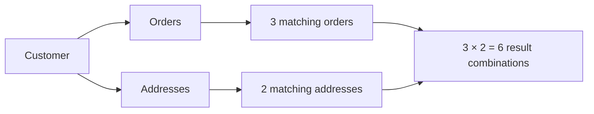
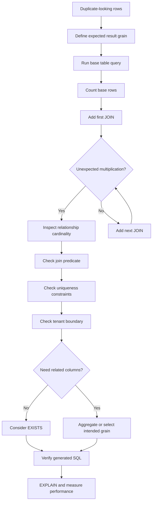

# 04- Duplicate Rows After JOIN

## Overview

Duplicate-looking rows after a `JOIN` are one of the most common SQL correctness problems in backend systems.

In most cases, the database is not actually duplicating a row. The join is producing multiple valid combinations because the relationship between the joined tables is one-to-many or many-to-many, or because the join condition does not uniquely identify the intended relationship.

The critical distinction is:

```text
Duplicate-looking result
        ≠
Duplicate physical row
```

For example:

```text
customers
    │
    └── 1:N ──> orders
```

If one customer has five orders:

```sql
SELECT
    c.id,
    o.id
FROM app.customers AS c
JOIN app.orders AS o
    ON o.customer_id = c.id
WHERE c.id = 100;
```

the result contains five rows.

Nothing was duplicated. The relational operation correctly produced:

```text
customer 100 × order 1
customer 100 × order 2
customer 100 × order 3
customer 100 × order 4
customer 100 × order 5
```

The real troubleshooting question is:

> **What does one result row represent, and does that match the intended result grain?**

---

## Why JOINs Produce Multiple Rows

A join combines rows that satisfy a relationship condition.

For a one-to-many relationship:

```text
Parent: 1 row
Child:  N matching rows

Result:
1 × N = N rows
```

For multiple one-to-many relationships:

```text
Customer
  ├── Orders
  └── Addresses
```

suppose:

```text
1 customer
3 orders
2 addresses
```

Joining both tables can produce:

```text
3 × 2 = 6 rows
```

This is known as **join multiplication**.

It becomes especially important when constructing:

- API queries
- Reporting queries
- Django ORM querysets
- SQLAlchemy queries
- Analytics queries
- Authorization queries
- Multi-tenant queries

---

## Result Grain

The most important concept when diagnosing duplicate rows is **result grain**.

Result grain describes what one output row represents.

Examples:

| Query | Result grain |
|---|---|
| Customer by primary key | Customer |
| Customer joined to orders | Customer-order |
| Order joined to items | Order-item |
| Customer joined to orders and items | Customer-order-item |
| `GROUP BY customer_id` | Customer |
| `SELECT DISTINCT customer_id` | Unique customer |
| Latest order per customer | Customer |

Suppose an API requires:

```text
One row per customer
```

but the query returns:

```text
One row per customer-order
```

then the query is operating at the wrong grain.

Adding `DISTINCT` may hide the issue in some cases, but understanding the grain is the real solution.

---

## A Simple Example

Consider:

```text
customers
+-----+----------+
| id  | name     |
+-----+----------+
| 100 | Alice    |
+-----+----------+

orders
+-----+-------------+
| id  | customer_id |
+-----+-------------+
| 501 | 100         |
| 502 | 100         |
| 503 | 100         |
+-----+-------------+
```

Query:

```sql
SELECT
    c.id,
    c.name,
    o.id AS order_id
FROM app.customers AS c
JOIN app.orders AS o
    ON o.customer_id = c.id
WHERE c.id = 100;
```

Result:

```text
100 | Alice | 501
100 | Alice | 502
100 | Alice | 503
```

The customer appears three times, but each row represents a different customer-order relationship.

---

## Physical Duplicates vs Join Multiplication

These are different problems.

### Join Multiplication

The underlying data may be perfectly valid:

```text
customer 100
    ├── order 501
    ├── order 502
    └── order 503
```

The join correctly returns three rows.

### Physical Duplicate Data

The database may contain invalid repeated records:

```text
user_id | profile_id
--------+-----------
100     | 1
100     | 2
```

when the business rule requires exactly one profile per user.

Detect this with:

```sql
SELECT
    user_id,
    COUNT(*) AS profile_count
FROM app.profiles
GROUP BY user_id
HAVING COUNT(*) > 1;
```

The correct response is different:

```text
Join multiplication
→ Fix query semantics.

Invalid duplicate data
→ Fix data integrity and enforce constraints.
```

---

## Diagnose the Base Relation First

Start with the left-side relation.

```sql
SELECT
    id,
    name
FROM app.customers
WHERE id = 100;
```

Then count:

```sql
SELECT COUNT(*)
FROM app.customers
WHERE id = 100;
```

If the base query already returns multiple rows, the join may not be the problem.

If the base query returns one row, add joins one at a time.

---

## Add JOINs Incrementally

For a complex query:

```sql
SELECT ...
FROM customers c
JOIN orders o ...
JOIN order_items oi ...
JOIN payments p ...
JOIN addresses a ...
```

do not debug the entire statement simultaneously.

Use:

```text
customers
    ↓
customers + orders
    ↓
customers + orders + order_items
    ↓
customers + orders + order_items + payments
    ↓
customers + orders + order_items + payments + addresses
```

Measure the cardinality at each stage.

For example:

```sql
SELECT COUNT(*)
FROM app.customers AS c
WHERE c.id = 100;
```

Then:

```sql
SELECT COUNT(*)
FROM app.customers AS c
JOIN app.orders AS o
    ON o.customer_id = c.id
WHERE c.id = 100;
```

Then:

```sql
SELECT COUNT(*)
FROM app.customers AS c
JOIN app.orders AS o
    ON o.customer_id = c.id
JOIN app.order_items AS oi
    ON oi.order_id = o.id
WHERE c.id = 100;
```

The join that causes the unexpected cardinality increase is the primary investigation point.

---

## One-to-Many JOIN

Consider:

```text
customers
    1
    │
    N
orders
```

Query:

```sql
SELECT
    c.id,
    c.name,
    o.id AS order_id
FROM app.customers AS c
JOIN app.orders AS o
    ON o.customer_id = c.id;
```

One customer can legitimately produce many result rows.

Use this pattern when the application actually needs order-level information.

Do not try to force one row per customer if the requirement is actually to return orders.

---

## Many-to-Many JOIN

Many-to-many relationships can multiply rows even more.

Example:

```text
users
  ↕
user_roles
  ↕
roles
```

A user with:

```text
3 roles
```

produces three rows when joined through the relationship table.

Another common example:

```text
orders
  ↕
order_tags
  ↕
tags
```

An order with multiple matching tags can appear multiple times.

---

## Multiple One-to-Many JOINs

This is one of the most dangerous patterns.

Suppose:

```text
Customer 100
    ├── 3 Orders
    └── 2 Addresses
```

Query:

```sql
SELECT
    c.id,
    o.id AS order_id,
    a.id AS address_id
FROM app.customers AS c
LEFT JOIN app.orders AS o
    ON o.customer_id = c.id
LEFT JOIN app.addresses AS a
    ON a.customer_id = c.id
WHERE c.id = 100;
```

Possible result:

```text
100 | 501 | 1
100 | 501 | 2
100 | 502 | 1
100 | 502 | 2
100 | 503 | 1
100 | 503 | 2
```

The result has:

```text
3 × 2 = 6 rows
```

This is not necessarily a database problem.

The query is representing:

```text
customer × order × address
```

rather than:

```text
customer
```

---

## The Cartesian Effect of Multiple Relationships

Conceptually:



When multiple independent one-to-many relationships are joined at the same level, their multiplicities can multiply.

This is one of the most important causes of unexpectedly large result sets.

---

## Incomplete JOIN Conditions

A join can also produce duplicates because the relationship predicate is incomplete.

Suppose records are tenant-scoped:

```text
tenant_id
customer_id
```

An incorrect join might use:

```sql
ON o.customer_id = c.id
```

when the relationship requires:

```sql
ON o.customer_id = c.id
AND o.tenant_id = c.tenant_id
```

Without the tenant predicate, rows from multiple tenants may match.

This is both a correctness and security concern.

---

## Non-Unique JOIN Columns

A common mistake is joining on a column that is not unique.

For example:

```sql
JOIN app.customers AS c
    ON c.email = o.customer_email
```

If multiple customer records share the same email, one order can match multiple customers.

Inspect:

```sql
SELECT
    email,
    COUNT(*)
FROM app.customers
GROUP BY email
HAVING COUNT(*) > 1;
```

If the application requires email uniqueness, enforce it with an appropriate unique constraint or index.

Do not assume a column is unique merely because application code normally treats it as unique.

---

## Foreign Keys Do Not Guarantee Uniqueness

A foreign key usually guarantees:

```text
Child references an existing parent
```

It does **not** guarantee:

```text
One child per parent
```

For example:

```text
orders.customer_id → customers.id
```

allows:

```text
Customer 100
  ├── Order 1
  ├── Order 2
  └── Order 3
```

If you require one-to-one behavior, use a unique constraint on the referencing column.

---

## Enforcing One-to-One Relationships

Suppose:

```text
user → profile
```

must be one-to-one.

Enforce:

```sql
CREATE UNIQUE INDEX profiles_user_id_uidx
ON app.profiles (user_id);
```

Now the database prevents multiple profiles for the same user.

This is preferable to:

```python
# Application assumption only
profile = Profile.objects.get(user_id=user_id)
```

if the database does not enforce uniqueness.

The database should enforce important invariants whenever practical.

---

## Using `EXISTS` Instead of JOIN

Sometimes the query does not need columns from the joined table.

Requirement:

> Find customers who have at least one completed order.

A join:

```sql
SELECT
    c.id,
    c.name
FROM app.customers AS c
JOIN app.orders AS o
    ON o.customer_id = c.id
WHERE o.status = 'completed';
```

can return the same customer multiple times.

Use `EXISTS`:

```sql
SELECT
    c.id,
    c.name
FROM app.customers AS c
WHERE EXISTS (
    SELECT 1
    FROM app.orders AS o
    WHERE o.customer_id = c.id
      AND o.status = 'completed'
);
```

Now the result naturally remains at:

```text
one row per customer
```

because the requirement is existence, not order retrieval.

---

## `EXISTS` Is Often the Better Semantic Model

Use:

```sql
JOIN
```

when you need to combine rows and retrieve attributes from the related relation.

Use:

```sql
EXISTS
```

when the requirement is:

```text
Does at least one matching record exist?
```

Use:

```sql
NOT EXISTS
```

when the requirement is:

```text
Does no matching record exist?
```

This can make both correctness and intent clearer.

---

## `DISTINCT` as a Controlled Solution

`DISTINCT` removes duplicate rows from the projected result.

Example:

```sql
SELECT DISTINCT
    c.id,
    c.name
FROM app.customers AS c
JOIN app.orders AS o
    ON o.customer_id = c.id
WHERE o.status = 'completed';
```

If a customer has multiple completed orders, the projected:

```text
c.id
c.name
```

values are identical, so `DISTINCT` can produce one customer row.

This is valid when the requirement is:

```text
Return unique customers having completed orders.
```

But it is not a universal join-fix mechanism.

---

## Why `DISTINCT` Can Hide Problems

Suppose:

```sql
SELECT DISTINCT
    c.id,
    c.name,
    o.status
FROM ...
```

If one customer has:

```text
pending
completed
```

orders, the rows are still distinct.

`DISTINCT` will not produce one customer.

More importantly, adding `DISTINCT` may hide:

- Incorrect join conditions
- Unexpected data relationships
- Missing tenant filters
- Wrong query grain
- Data integrity violations

Use it because uniqueness is part of the intended result, not because duplicate rows are visually inconvenient.

---

## PostgreSQL `DISTINCT ON`

PostgreSQL provides:

```sql
DISTINCT ON
```

which is useful when selecting one deterministic row per group.

Example:

```sql
SELECT DISTINCT ON (customer_id)
    customer_id,
    id,
    status,
    created_at
FROM app.orders
ORDER BY
    customer_id,
    created_at DESC,
    id DESC;
```

This returns the latest order per customer according to:

```text
created_at DESC
id DESC
```

The ordering is important.

Without deterministic ordering, the selected row should not be treated as a reliable business result.

---

## Window Functions

Window functions provide another way to select one row from each group.

```sql
WITH ranked_orders AS (
    SELECT
        customer_id,
        id,
        status,
        created_at,
        ROW_NUMBER() OVER (
            PARTITION BY customer_id
            ORDER BY created_at DESC, id DESC
        ) AS row_number
    FROM app.orders
)
SELECT
    customer_id,
    id,
    status,
    created_at
FROM ranked_orders
WHERE row_number = 1;
```

This explicitly says:

```text
Partition by customer
Order newest first
Assign row numbers
Keep row 1
```

This is often clearer when the selection rule is more complex than "distinct values".

---

## Aggregation

If the result should contain one row per parent, aggregate child records.

```sql
SELECT
    c.id,
    c.name,
    COUNT(o.id) AS order_count,
    MAX(o.created_at) AS latest_order_at
FROM app.customers AS c
LEFT JOIN app.orders AS o
    ON o.customer_id = c.id
GROUP BY
    c.id,
    c.name;
```

The result grain is:

```text
one row per customer
```

The child relationship has been intentionally collapsed.

---

## Pre-Aggregating Child Tables

When multiple one-to-many relationships are involved, pre-aggregation can prevent multiplication.

Instead of:

```text
customer
  × orders
  × payments
```

aggregate each child relation first:

```sql
WITH order_summary AS (
    SELECT
        customer_id,
        COUNT(*) AS order_count
    FROM app.orders
    GROUP BY customer_id
),
payment_summary AS (
    SELECT
        customer_id,
        SUM(amount) AS total_paid
    FROM app.payments
    GROUP BY customer_id
)
SELECT
    c.id,
    c.name,
    COALESCE(o.order_count, 0) AS order_count,
    COALESCE(p.total_paid, 0) AS total_paid
FROM app.customers AS c
LEFT JOIN order_summary AS o
    ON o.customer_id = c.id
LEFT JOIN payment_summary AS p
    ON p.customer_id = c.id;
```

Each derived relation has:

```text
one row per customer
```

so the final joins remain at customer grain.

This pattern is particularly useful in reporting and dashboard queries.

---

## Aggregation Before JOIN vs After JOIN

Consider:

```text
Customer
  ├── Orders
  └── Payments
```

Joining both raw child relations:

```text
customer × orders × payments
```

can multiply rows before aggregation.

Instead:

```text
orders → aggregate by customer
payments → aggregate by customer
                ↓
             customer
```

This reduces intermediate cardinality and can significantly improve correctness and performance.

---

## `LEFT JOIN` Does Not Prevent Duplicates

A common misconception is:

> "I used `LEFT JOIN`, so I should get one row per left-side record."

False.

`LEFT JOIN` guarantees that unmatched left rows are preserved.

It does not guarantee one output row per left row.

If three right-side rows match:

```text
1 left row × 3 right rows = 3 output rows
```

Example:

```sql
SELECT
    c.id,
    o.id
FROM app.customers AS c
LEFT JOIN app.orders AS o
    ON o.customer_id = c.id
WHERE c.id = 100;
```

A customer with three orders still produces three rows.

---

## Filtering the Right Side

If only certain child records matter, filter them deliberately.

For example:

```sql
SELECT
    c.id,
    o.id
FROM app.customers AS c
LEFT JOIN app.orders AS o
    ON o.customer_id = c.id
   AND o.status = 'completed'
WHERE c.id = 100;
```

This differs from:

```sql
SELECT
    c.id,
    o.id
FROM app.customers AS c
LEFT JOIN app.orders AS o
    ON o.customer_id = c.id
WHERE c.id = 100
  AND o.status = 'completed';
```

The second form removes rows where no matching order exists, which changes the practical semantics of the outer join.

Understanding predicate placement is essential when controlling result cardinality.

---

## ORM Duplicate Rows

Django ORM can generate duplicate parent rows when filtering across a one-to-many relationship.

For example:

```python
customers = Customer.objects.filter(
    orders__status="completed",
)
```

If a customer has multiple completed orders, the underlying SQL can produce multiple customer rows.

If the requirement is unique customers:

```python
customers = Customer.objects.filter(
    orders__status="completed",
).distinct()
```

However, if the requirement is simply:

```text
customers who have at least one completed order
```

an `Exists` expression can more directly represent the requirement:

```python
from django.db.models import Exists, OuterRef

completed_orders = Order.objects.filter(
    customer_id=OuterRef("pk"),
    status="completed",
)

customers = Customer.objects.annotate(
    has_completed_order=Exists(completed_orders),
).filter(
    has_completed_order=True,
)
```

The important skill is understanding the SQL relationship behind the ORM expression.

---

## `select_related()` and `prefetch_related()`

Django relationship loading can also create confusion.

`select_related()` uses SQL joins for suitable single-valued relationships:

```text
ForeignKey
OneToOneField
```

`prefetch_related()` generally performs separate queries and combines related objects in application memory.

Do not assume:

```text
ORM object graph
=
SQL result shape
```

When debugging duplicate parent objects, inspect:

```text
Generated SQL
JOINs
Result cardinality
ORM materialization
```

---

## SQLAlchemy

With SQLAlchemy, a query such as:

```python
select(Order).join(Order.items)
```

can produce multiple database rows for one order because the SQL result is at:

```text
order-item grain
```

The ORM's result handling and eager-loading strategy can affect how those rows are materialized.

When debugging, inspect:

- Generated SQL
- Join conditions
- Selected columns
- Relationship cardinality
- Result-processing behavior

Do not fix an ORM symptom without understanding the SQL being executed.

---

## Debugging With Counts

A powerful technique is comparing counts at different levels.

For example:

```sql
SELECT COUNT(*)
FROM app.orders
WHERE customer_id = 100;
```

Then:

```sql
SELECT COUNT(DISTINCT customer_id)
FROM app.orders
WHERE customer_id = 100;
```

And:

```sql
SELECT
    customer_id,
    COUNT(*) AS rows_per_customer
FROM app.orders
WHERE customer_id = 100
GROUP BY customer_id;
```

This tells you:

```text
Physical row count
Distinct parent count
Rows per parent
```

For a join:

```sql
SELECT
    o.id,
    COUNT(*) AS joined_rows
FROM app.orders AS o
JOIN app.order_items AS oi
    ON oi.order_id = o.id
GROUP BY o.id
HAVING COUNT(*) > 1;
```

This identifies orders that produce multiple joined rows.

---

## Find Which JOIN Causes Multiplication

For a query containing multiple joins:

```sql
SELECT
    COUNT(*) AS rows
FROM app.customers AS c;
```

Then:

```sql
SELECT
    COUNT(*) AS rows
FROM app.customers AS c
JOIN app.orders AS o
    ON o.customer_id = c.id;
```

Then:

```sql
SELECT
    COUNT(*) AS rows
FROM app.customers AS c
JOIN app.orders AS o
    ON o.customer_id = c.id
JOIN app.order_items AS oi
    ON oi.order_id = o.id;
```

Then:

```sql
SELECT
    COUNT(*) AS rows
FROM app.customers AS c
JOIN app.orders AS o
    ON o.customer_id = c.id
JOIN app.order_items AS oi
    ON oi.order_id = o.id
JOIN app.payments AS p
    ON p.order_id = o.id;
```

The transition:

```text
100 rows
→ 500 rows
→ 2,000 rows
→ 8,000 rows
```

immediately identifies where multiplication occurs.

---

## Inspect the Data Relationship

Once a problematic join is identified, inspect the relationship directly.

```sql
SELECT
    o.id,
    COUNT(oi.id) AS item_count
FROM app.orders AS o
LEFT JOIN app.order_items AS oi
    ON oi.order_id = o.id
WHERE o.customer_id = 100
GROUP BY o.id
ORDER BY item_count DESC;
```

This reveals whether multiple child records are legitimate.

Then ask:

```text
Should the query return each item?
Should it return each order?
Should it return one customer?
Should it return an aggregate?
```

The answer determines the correct SQL pattern.

---

## Query Plans

Once the logical correctness is understood, inspect performance.

```sql
EXPLAIN
SELECT
    c.id,
    o.id,
    oi.id
FROM app.customers AS c
JOIN app.orders AS o
    ON o.customer_id = c.id
JOIN app.order_items AS oi
    ON oi.order_id = o.id
WHERE c.id = 100;
```

For controlled diagnostics:

```sql
EXPLAIN (ANALYZE, BUFFERS)
SELECT
    c.id,
    o.id,
    oi.id
FROM app.customers AS c
JOIN app.orders AS o
    ON o.customer_id = c.id
JOIN app.order_items AS oi
    ON oi.order_id = o.id
WHERE c.id = 100;
```

Inspect:

```text
estimated rows
actual rows
loops
join type
filtering
buffer activity
```

A query can be logically correct but expensive because the intermediate join result is huge.

---

## Performance Impact of Join Multiplication

Join multiplication can create substantial costs:

```text
More intermediate rows
    ↓
More CPU
    ↓
More memory
    ↓
More sorting/hashing
    ↓
More network transfer
    ↓
More ORM materialization
    ↓
More API serialization
```

For example:

```text
1,000 customers
× 20 orders
× 5 items
=
100,000 intermediate rows
```

Even if the API ultimately needs only:

```text
1,000 customer summaries
```

the database may process far more rows than necessary.

Pre-aggregation, `EXISTS`, or separate queries can sometimes avoid this.

---

## Indexes and Join Performance

Indexes do not prevent join multiplication.

An index can make matching rows faster to find, but if ten rows legitimately match, the database still has to process those ten rows.

For common foreign-key joins, appropriate indexes on referencing columns are often important:

```sql
CREATE INDEX orders_customer_id_idx
ON app.orders (customer_id);
```

For composite relationships:

```sql
CREATE INDEX orders_tenant_customer_idx
ON app.orders (tenant_id, customer_id);
```

Index design should follow actual query predicates and join patterns.

---

## Security Considerations

Unexpectedly large join results can become data-isolation vulnerabilities.

For multi-tenant systems, ensure relationships include the correct tenant boundary where the schema requires it.

Example:

```sql
JOIN app.orders AS o
    ON o.customer_id = c.id
   AND o.tenant_id = c.tenant_id
```

Also verify:

```text
Tenant predicates
Authorization predicates
RLS policies
Ownership checks
Soft-delete rules
```

A query that returns extra rows across tenant boundaries is not merely a performance problem.

It can expose customer data.

---

## Large Result Sets in APIs

If a join unexpectedly multiplies rows, the API can suffer from:

- Large response payloads
- Increased JSON serialization
- Higher memory consumption
- Longer request times
- Connection pool occupation
- Proxy buffering
- Gateway timeouts

Avoid solving this with:

```sql
LIMIT 100;
```

until the query's grain is correct.

Otherwise, the API may return:

```text
100 customer-order-item rows
```

when it intended:

```text
100 customers
```

---

## Better API Query Design

If an endpoint needs:

```text
Customer summary
+
Order count
+
Latest order
```

do not necessarily join every order row into the response.

A better query can aggregate:

```sql
SELECT
    c.id,
    c.name,
    COUNT(o.id) AS order_count,
    MAX(o.created_at) AS latest_order_at
FROM app.customers AS c
LEFT JOIN app.orders AS o
    ON o.customer_id = c.id
GROUP BY
    c.id,
    c.name;
```

The SQL result now matches the API contract:

```text
one row per customer
```

---

## When Separate Queries Are Better

Trying to retrieve an entire object graph in one SQL query can create large Cartesian-style intermediate results.

For example:

```text
Customer
  ├── Orders
  ├── Addresses
  └── Tags
```

A single query can multiply:

```text
customers × orders × addresses × tags
```

Separate queries can sometimes be more efficient:

```text
Query 1 → customers
Query 2 → orders for those customers
Query 3 → addresses for those customers
Query 4 → tags for those customers
```

This is one reason ORMs provide prefetching mechanisms.

The correct architecture depends on:

```text
Data volume
Latency requirements
Number of relationships
API shape
Database load
Application memory
Caching
```

---

## Production Troubleshooting Workflow

Use this process:



The workflow separates:

```text
Logical correctness
```

from:

```text
Performance optimization
```

Do not optimize a query whose result semantics are still wrong.

---

## Common Mistakes

### Assuming the Database Duplicated Rows

Usually the join generated multiple valid combinations.

Inspect the relationship before blaming storage or PostgreSQL.

### Using `DISTINCT` Immediately

`DISTINCT` can hide incorrect join logic or data-quality problems.

First identify why multiple rows exist.

### Joining Multiple One-to-Many Tables

Independent one-to-many joins can multiply each other.

Consider pre-aggregation or separate queries.

### Joining on Non-Unique Columns

Joining on:

```text
email
name
status
external reference
```

without uniqueness guarantees can create unexpected matches.

### Forgetting Composite Join Keys

If the relationship is scoped by:

```text
tenant_id + entity_id
```

joining only on:

```text
entity_id
```

can match unrelated rows.

### Using `LIMIT 1`

This hides multiple matches without defining which row is correct.

If one row is required, enforce uniqueness or define deterministic ordering.

### Confusing `LEFT JOIN` With One-to-One Behavior

`LEFT JOIN` preserves unmatched left rows but does not limit the number of matching right rows.

### Ignoring Result Grain

If the application expects:

```text
one row per customer
```

but the SQL naturally produces:

```text
one row per customer-order-item
```

the query is operating at the wrong grain.

---

## Interview Traps

### "Why does a JOIN create duplicate rows?"

A strong answer:

> A join does not necessarily duplicate rows. It returns one result row for each matching combination. In one-to-many or many-to-many relationships, one parent row can legitimately match multiple child rows.

### "How do you fix duplicate rows after a JOIN?"

First determine the intended result grain and why the join produces multiple matches. Then choose the appropriate strategy:

- Correct the join predicate.
- Use `EXISTS` when only existence matters.
- Aggregate child rows.
- Use `DISTINCT` when uniqueness of the projected result is the actual requirement.
- Use `DISTINCT ON` or window functions for deterministic one-row-per-group selection.
- Enforce uniqueness at the database level when the relationship should be one-to-one.

### "Does `DISTINCT` fix duplicate joins?"

Not necessarily.

It removes duplicate projected rows but does not fix:

```text
Incorrect relationships
Missing predicates
Data integrity problems
Wrong result grain
```

### "Why can two one-to-many joins produce more rows than expected?"

Because the matching cardinalities can multiply.

If one parent has:

```text
3 orders
2 addresses
```

the combined join can produce:

```text
3 × 2 = 6 rows
```

### "When would you use `EXISTS` instead of JOIN?"

When the requirement is to determine whether a matching related record exists and no columns from that related relation are required.

---

## Senior-Level Heuristic

When duplicate-looking rows appear after a join, reason through these questions:

```text
1. What should one result row represent?
2. How many rows exist in the base relation?
3. What is the cardinality of each relationship?
4. Which JOIN first increases cardinality?
5. Is the JOIN condition complete?
6. Are the JOIN columns actually unique?
7. Are multiple one-to-many relationships being joined together?
8. Does the query need related columns or only existence?
9. Should child rows be aggregated?
10. Is the business invariant enforced by constraints?
11. Is tenant isolation preserved?
12. Is the final result size operationally acceptable?
```

The goal is not:

```text
"Remove duplicates."
```

The goal is:

```text
"Produce the correct relation at the intended grain."
```

That distinction is fundamental to senior-level SQL work.

---

## Production Checklist

### Query Semantics

- [ ] Define the intended result grain.
- [ ] Identify expected cardinality.
- [ ] Verify the base relation.
- [ ] Add joins incrementally.
- [ ] Identify which join increases cardinality.

### Relationship Integrity

- [ ] Verify foreign keys.
- [ ] Verify unique constraints.
- [ ] Check one-to-one vs one-to-many relationships.
- [ ] Check many-to-many relationships.
- [ ] Validate composite join conditions.
- [ ] Check whether join columns are actually unique.

### Query Design

- [ ] Use `EXISTS` for existence checks.
- [ ] Aggregate child rows when the result is parent-level.
- [ ] Use `DISTINCT` only when semantically appropriate.
- [ ] Use deterministic ordering with one-row-per-group logic.
- [ ] Consider pre-aggregating independent child relations.

### Application

- [ ] Inspect generated ORM SQL.
- [ ] Verify Django queryset behavior.
- [ ] Verify SQLAlchemy relationship loading.
- [ ] Check serialization and response shape.
- [ ] Confirm pagination operates on the correct grain.

### Security

- [ ] Verify tenant predicates.
- [ ] Verify authorization filters.
- [ ] Check RLS policies.
- [ ] Ensure joins cannot cross tenant boundaries.

### Performance

- [ ] Inspect intermediate cardinality.
- [ ] Use `EXPLAIN` where appropriate.
- [ ] Check actual vs estimated rows.
- [ ] Check result size.
- [ ] Avoid unnecessarily large object graphs.
- [ ] Consider asynchronous exports for genuinely large datasets.

---

## Key Takeaways

- **JOINs do not inherently duplicate rows:** they produce one row per matching combination, so one-to-many and many-to-many relationships naturally increase cardinality.
- **Result grain is the central debugging concept:** explicitly determine whether one row should represent a customer, order, item, relationship, or aggregate.
- **Do not blindly use `DISTINCT` or `LIMIT 1`:** correct the join, use `EXISTS`, aggregate, or enforce uniqueness according to the actual business requirement.
- **Multiple one-to-many joins can multiply each other:** pre-aggregate independent child relations or use separate queries when a single join would create unnecessarily large intermediate results.
- **Treat cardinality as a production and security concern:** excessive joins can increase resource usage and, when tenant predicates are missing, can expose data across isolation boundaries.