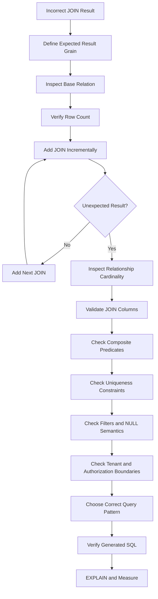

# 05- Incorrect JOIN Results

## Overview

Incorrect `JOIN` results are usually caused by a mismatch between the intended relationship and the relationship expressed by the SQL query.

A query can be syntactically valid, execute successfully, use indexes, and still return the wrong data.

Common causes include:

- Joining on the wrong columns.
- Missing part of a composite relationship.
- Using the wrong join type.
- Filtering at the wrong stage.
- Joining non-unique columns.
- Accidentally creating a many-to-many relationship.
- Missing tenant or authorization predicates.
- Confusing business relationships with physical foreign keys.
- Using `LEFT JOIN` while filtering the right table in `WHERE`.
- Joining historical or soft-deleted records unintentionally.
- Assuming a foreign key implies uniqueness.

The correct troubleshooting approach is to reason about **relationship cardinality, join predicates, result grain, and business semantics** rather than simply looking for duplicate rows.

---

## What a JOIN Actually Does

A join combines rows from two relations according to a join predicate.

For example:

```sql
SELECT
    c.id,
    c.name,
    o.id AS order_id
FROM app.customers AS c
JOIN app.orders AS o
    ON o.customer_id = c.id;
```

Conceptually:

```text
customers
    │
    │ customer_id = id
    ▼
orders
```

If one customer has three orders, that customer participates in three matching combinations.

The database is not deciding which relationship you intended. It evaluates the predicate you provided.

This means:

```text
Correct SQL syntax
        ≠
Correct business result
```

---

## Result Grain

Before debugging an incorrect join, define what one output row should represent.

Examples:

| Requirement | Expected grain |
|---|---|
| Customer list | One row per customer |
| Customer orders | One row per customer-order |
| Order items | One row per order-item |
| Latest order per customer | One row per customer |
| Customer revenue | One row per customer |
| User permissions | One row per user-permission |
| Tenant members | One row per tenant-user |

If the query returns a different grain, the result may look incorrect even though every individual join condition is technically valid.

A useful question is:

> **What real-world entity or relationship does one result row represent?**

---

## Verify the Relationship Before the JOIN

Inspect the schema.

```sql
\d app.customers
\d app.orders
```

Check:

- Primary keys
- Foreign keys
- Unique constraints
- Composite constraints
- Nullable foreign keys
- Indexes
- Soft-delete columns
- Tenant identifiers

For PostgreSQL, foreign-key metadata can also be inspected through the catalog:

```sql
SELECT
    conname,
    conrelid::regclass AS child_table,
    confrelid::regclass AS parent_table,
    pg_get_constraintdef(oid) AS definition
FROM pg_constraint
WHERE contype = 'f'
ORDER BY conrelid::regclass::text, conname;
```

Do not assume that the column name alone tells you the complete relationship.

---

## Wrong JOIN Column

Consider:

```text
orders
+----+-------------+
| id | customer_id |
+----+-------------+
| 10 | 100         |
| 11 | 101         |
+----+-------------+

customers
+-----+-------+
| id  | name  |
+-----+-------+
| 100 | Alice |
| 101 | Bob   |
+-----+-------+
```

The correct join is:

```sql
ON o.customer_id = c.id
```

An incorrect join such as:

```sql
ON o.id = c.id
```

may still execute successfully but represents an entirely different relationship.

This is one of the most dangerous SQL bugs because the database has no way to know that the selected columns are semantically wrong.

---

## Missing Part of a Composite Relationship

Suppose records are scoped by tenant:

```text
tenant_id
customer_id
```

and an order belongs to a customer within a tenant.

A potentially incorrect join is:

```sql
ON o.customer_id = c.id
```

If IDs are only unique within a tenant, the complete relationship is:

```sql
ON o.tenant_id = c.tenant_id
AND o.customer_id = c.id
```

Without the tenant predicate, the query can match records belonging to different tenants.

This is simultaneously:

- A correctness problem.
- A multi-tenant isolation problem.
- A security vulnerability.

---

## Composite Keys and Natural Relationships

The same issue appears outside multi-tenancy.

Suppose:

```text
warehouse_id
product_id
```

together identify inventory.

The relationship is:

```sql
ON i.warehouse_id = p.warehouse_id
AND i.product_id = p.id
```

Joining only on:

```sql
ON i.product_id = p.id
```

may match inventory from multiple warehouses.

The general rule is:

> If the business relationship is defined by multiple attributes, the JOIN predicate must preserve all attributes required to identify that relationship.

---

## Joining Non-Unique Columns

A frequent source of incorrect results is joining on a column that is not unique.

For example:

```sql
SELECT
    o.id,
    c.id
FROM app.orders AS o
JOIN app.customers AS c
    ON c.email = o.customer_email;
```

If multiple customer rows have the same email, one order can match multiple customers.

Check:

```sql
SELECT
    email,
    COUNT(*) AS count
FROM app.customers
GROUP BY email
HAVING COUNT(*) > 1;
```

If email is supposed to be unique, enforce that business invariant:

```sql
CREATE UNIQUE INDEX customers_email_uidx
ON app.customers (email);
```

Do not rely exclusively on application-level assumptions.

---

## Foreign Key Does Not Mean One-to-One

Consider:

```text
orders.customer_id → customers.id
```

The foreign key guarantees that an order references a valid customer, assuming the constraint is enforced.

It does not mean:

```text
customer → one order
```

A customer can have:

```text
Order 1
Order 2
Order 3
```

Therefore:

```sql
JOIN orders
```

naturally changes the result grain from:

```text
customer
```

to:

```text
customer-order
```

Understanding cardinality is essential before interpreting the result as incorrect.

---

## One-to-One vs One-to-Many

| Relationship | Parent matches | Typical JOIN result |
|---|---:|---|
| One-to-one | 0 or 1 child | At most one child row |
| One-to-many | 0 to N children | Multiple rows possible |
| Many-to-many | N to M rows | Potentially many combinations |

Database constraints should support the intended relationship.

For a one-to-one relationship:

```sql
CREATE UNIQUE INDEX profiles_user_id_uidx
ON app.profiles (user_id);
```

Without such a constraint, the database may allow the data relationship to drift away from the application's assumptions.

---

## INNER JOIN vs LEFT JOIN

The join type changes which unmatched rows survive.

### INNER JOIN

```sql
SELECT
    c.id,
    o.id
FROM app.customers AS c
JOIN app.orders AS o
    ON o.customer_id = c.id;
```

Only customers with matching orders appear.

### LEFT JOIN

```sql
SELECT
    c.id,
    o.id
FROM app.customers AS c
LEFT JOIN app.orders AS o
    ON o.customer_id = c.id;
```

All customers appear.

Customers without orders receive `NULL` for the order columns.

The choice should follow the business requirement rather than being treated as a performance or style preference.

---

## The LEFT JOIN + WHERE Trap

This is a common production bug.

Consider:

```sql
SELECT
    c.id,
    o.id
FROM app.customers AS c
LEFT JOIN app.orders AS o
    ON o.customer_id = c.id
WHERE o.status = 'completed';
```

The `WHERE` condition rejects rows where:

```text
o.status IS NULL
```

so customers without orders are removed.

This makes the query behave like an inner join for that condition.

If the requirement is:

> Return every customer, but only attach completed orders.

use:

```sql
SELECT
    c.id,
    o.id
FROM app.customers AS c
LEFT JOIN app.orders AS o
    ON o.customer_id = c.id
   AND o.status = 'completed';
```

Predicate placement is part of query semantics.

---

## NULL and JOIN Conditions

`NULL` does not behave like an ordinary value in SQL.

This does not match rows where both columns are `NULL`:

```sql
ON a.reference_id = b.reference_id
```

because:

```text
NULL = NULL
```

evaluates to unknown rather than true.

When null-safe equality is actually required, PostgreSQL provides:

```sql
ON a.reference_id IS NOT DISTINCT FROM b.reference_id
```

Use this deliberately.

Do not replace ordinary equality joins with null-safe comparisons without understanding the business meaning.

---

## Filtering Before vs After JOIN

Consider:

```sql
SELECT
    c.id,
    o.id
FROM app.customers AS c
JOIN app.orders AS o
    ON o.customer_id = c.id
WHERE o.status = 'completed';
```

For an inner join, PostgreSQL can often transform equivalent predicates internally.

For outer joins, predicate placement can change semantics.

Compare:

```sql
LEFT JOIN orders o
    ON o.customer_id = c.id
   AND o.status = 'completed'
```

with:

```sql
LEFT JOIN orders o
    ON o.customer_id = c.id
WHERE o.status = 'completed'
```

They are not equivalent.

When debugging, explicitly ask:

```text
Should the filter affect matching?
or
Should the filter remove the entire result row?
```

---

## Soft Deletes

Backend systems frequently use:

```text
deleted_at
is_deleted
archived_at
status
```

Suppose:

```sql
SELECT
    c.id,
    o.id
FROM app.customers AS c
JOIN app.orders AS o
    ON o.customer_id = c.id;
```

If archived orders should not participate, add the appropriate predicate:

```sql
SELECT
    c.id,
    o.id
FROM app.customers AS c
JOIN app.orders AS o
    ON o.customer_id = c.id
   AND o.deleted_at IS NULL;
```

For `LEFT JOIN`, putting this condition in `ON` versus `WHERE` can again change whether customers without active orders remain.

---

## Historical Rows

Incorrect joins can occur when a table stores multiple versions of an entity.

For example:

```text
customer_addresses
------------------
customer_id
address_id
valid_from
valid_to
```

A query that joins only on:

```sql
customer_id
```

may match multiple historical addresses.

The business relationship might instead require:

```text
current address
```

or:

```text
address valid at a particular timestamp
```

For temporal data, the join must reflect the temporal requirement.

---

## Joining Current State

If the table contains historical records but only the current version should match, define the current-state rule explicitly.

For example:

```sql
JOIN app.customer_addresses AS a
    ON a.customer_id = c.id
   AND a.valid_to IS NULL
```

If multiple rows can still satisfy that condition, the data model may need a stronger invariant.

Do not assume:

```text
valid_to IS NULL
```

automatically means one row per customer.

Verify it:

```sql
SELECT
    customer_id,
    COUNT(*)
FROM app.customer_addresses
WHERE valid_to IS NULL
GROUP BY customer_id
HAVING COUNT(*) > 1;
```

---

## Many-to-Many Relationship Errors

Consider:

```text
users
  │
  ▼
user_roles
  │
  ▼
roles
```

A query joining all three tables can correctly produce one row per:

```text
user-role
```

If the API expects one row per user, the query must aggregate or otherwise collapse the relationship.

For example:

```sql
SELECT
    u.id,
    array_agg(r.name ORDER BY r.name) AS roles
FROM app.users AS u
JOIN app.user_roles AS ur
    ON ur.user_id = u.id
JOIN app.roles AS r
    ON r.id = ur.role_id
GROUP BY u.id;
```

The result grain is now:

```text
one row per user
```

---

## Accidental Many-to-Many Joins

Suppose:

```text
customers
  ├── orders
  └── addresses
```

Both relationships are one-to-many.

Joining both raw tables:

```sql
SELECT
    c.id,
    o.id AS order_id,
    a.id AS address_id
FROM app.customers AS c
LEFT JOIN app.orders AS o
    ON o.customer_id = c.id
LEFT JOIN app.addresses AS a
    ON a.customer_id = c.id;
```

creates combinations between orders and addresses.

If a customer has:

```text
3 orders
2 addresses
```

the join can produce:

```text
3 × 2 = 6 rows
```

This is often mistaken for duplicate data.

---

## Use EXISTS for Existence Requirements

Suppose the requirement is:

> Return customers who have at least one completed order.

A join:

```sql
SELECT
    c.id,
    c.name
FROM app.customers AS c
JOIN app.orders AS o
    ON o.customer_id = c.id
WHERE o.status = 'completed';
```

can return a customer multiple times.

Use:

```sql
SELECT
    c.id,
    c.name
FROM app.customers AS c
WHERE EXISTS (
    SELECT 1
    FROM app.orders AS o
    WHERE o.customer_id = c.id
      AND o.status = 'completed'
);
```

This better expresses the business requirement:

```text
Does a matching row exist?
```

rather than:

```text
Return every matching child row.
```

---

## Use NOT EXISTS for Absence

For:

> Customers with no completed orders.

Use:

```sql
SELECT
    c.id,
    c.name
FROM app.customers AS c
WHERE NOT EXISTS (
    SELECT 1
    FROM app.orders AS o
    WHERE o.customer_id = c.id
      AND o.status = 'completed'
);
```

This is usually clearer than constructing an outer join and testing for `NULL`.

---

## Aggregation to Preserve Parent Grain

If the requirement is one row per customer with order statistics:

```sql
SELECT
    c.id,
    c.name,
    COUNT(o.id) AS order_count,
    MAX(o.created_at) AS latest_order_at
FROM app.customers AS c
LEFT JOIN app.orders AS o
    ON o.customer_id = c.id
GROUP BY
    c.id,
    c.name;
```

The child relationship is intentionally reduced into:

```text
count
latest timestamp
```

rather than returned as individual rows.

---

## Pre-Aggregation for Multiple Relationships

When multiple child relations are independent, aggregate each one before joining.

```sql
WITH order_summary AS (
    SELECT
        customer_id,
        COUNT(*) AS order_count
    FROM app.orders
    WHERE status = 'completed'
    GROUP BY customer_id
),
payment_summary AS (
    SELECT
        customer_id,
        SUM(amount) AS total_paid
    FROM app.payments
    GROUP BY customer_id
)
SELECT
    c.id,
    c.name,
    COALESCE(o.order_count, 0) AS order_count,
    COALESCE(p.total_paid, 0) AS total_paid
FROM app.customers AS c
LEFT JOIN order_summary AS o
    ON o.customer_id = c.id
LEFT JOIN payment_summary AS p
    ON p.customer_id = c.id;
```

Each summary has:

```text
one row per customer
```

so the final joins cannot multiply orders against payments.

---

## One Row Per Group

When the requirement is:

> Return the latest order for every customer.

A plain join is insufficient because a customer may have many orders.

PostgreSQL supports:

```sql
SELECT DISTINCT ON (customer_id)
    customer_id,
    id,
    status,
    created_at
FROM app.orders
ORDER BY
    customer_id,
    created_at DESC,
    id DESC;
```

The ordering defines which row wins.

A portable alternative is a window function:

```sql
WITH ranked_orders AS (
    SELECT
        customer_id,
        id,
        status,
        created_at,
        ROW_NUMBER() OVER (
            PARTITION BY customer_id
            ORDER BY created_at DESC, id DESC
        ) AS rn
    FROM app.orders
)
SELECT
    customer_id,
    id,
    status,
    created_at
FROM ranked_orders
WHERE rn = 1;
```

The `id` tie-breaker makes the selection deterministic when timestamps are equal.

---

## Incorrect JOIN Due to Missing Status Predicate

Suppose only active memberships should participate:

```sql
SELECT
    u.id,
    t.id
FROM app.users AS u
JOIN app.team_memberships AS tm
    ON tm.user_id = u.id
JOIN app.teams AS t
    ON t.id = tm.team_id;
```

If historical or revoked memberships remain in the table, the query can return teams the user should no longer belong to.

The relationship may require:

```sql
JOIN app.team_memberships AS tm
    ON tm.user_id = u.id
   AND tm.status = 'active'
```

Authorization-related joins deserve especially careful review because stale relationship rows can become access-control bugs.

---

## Incorrect JOIN in Multi-Tenant Systems

Consider:

```text
tenant_id
user_id
```

A dangerous query is:

```sql
SELECT
    u.id,
    o.id
FROM app.users AS u
JOIN app.orders AS o
    ON o.user_id = u.id;
```

If user IDs are not globally unique or the order relationship is tenant-scoped, the join may cross tenant boundaries.

Use the complete relationship:

```sql
SELECT
    u.id,
    o.id
FROM app.users AS u
JOIN app.orders AS o
    ON o.tenant_id = u.tenant_id
   AND o.user_id = u.id;
```

For systems using PostgreSQL Row Level Security, RLS should provide an additional database-level boundary, not replace correct relationship predicates.

---

## Debugging JOINs Incrementally

A practical debugging workflow is:

```text
Base table
    ↓
Verify expected rows
    ↓
Add one JOIN
    ↓
Check cardinality
    ↓
Inspect matching records
    ↓
Validate predicate
    ↓
Add next JOIN
    ↓
Repeat
```

Start with:

```sql
SELECT COUNT(*)
FROM app.customers;
```

Then:

```sql
SELECT COUNT(*)
FROM app.customers AS c
JOIN app.orders AS o
    ON o.customer_id = c.id;
```

Then add the next relationship.

Do not debug a ten-table query by changing five joins simultaneously.

---

## Find the First Problematic JOIN

Suppose the query contains:

```text
customers
→ orders
→ order_items
→ payments
→ addresses
```

Measure each stage:

```sql
SELECT COUNT(*)
FROM app.customers AS c;
```

```sql
SELECT COUNT(*)
FROM app.customers AS c
JOIN app.orders AS o
    ON o.customer_id = c.id;
```

```sql
SELECT COUNT(*)
FROM app.customers AS c
JOIN app.orders AS o
    ON o.customer_id = c.id
JOIN app.order_items AS oi
    ON oi.order_id = o.id;
```

Continue until the unexpected result appears.

The first cardinality jump often identifies the relationship requiring investigation.

---

## Inspect Matching Rows Directly

After identifying the problematic relationship:

```sql
SELECT
    c.id AS customer_id,
    o.id AS order_id
FROM app.customers AS c
JOIN app.orders AS o
    ON o.customer_id = c.id
WHERE c.id = 100
ORDER BY o.id;
```

Then inspect the child count:

```sql
SELECT
    customer_id,
    COUNT(*) AS order_count
FROM app.orders
WHERE customer_id = 100
GROUP BY customer_id;
```

This separates:

```text
Incorrect join predicate
```

from:

```text
Correct one-to-many relationship
```

---

## Compare Expected and Actual Cardinality

Useful diagnostic queries include:

```sql
SELECT COUNT(*)
FROM app.customers;
```

```sql
SELECT COUNT(DISTINCT c.id)
FROM app.customers AS c
JOIN app.orders AS o
    ON o.customer_id = c.id;
```

```sql
SELECT
    c.id,
    COUNT(*) AS joined_rows
FROM app.customers AS c
JOIN app.orders AS o
    ON o.customer_id = c.id
GROUP BY c.id
HAVING COUNT(*) > 1;
```

If:

```text
COUNT(*) > COUNT(DISTINCT parent_id)
```

the result contains multiple rows per parent.

That may be expected or may indicate an incorrect query grain.

---

## Inspect Data Integrity

When a join unexpectedly matches multiple rows, inspect uniqueness.

```sql
SELECT
    customer_id,
    COUNT(*)
FROM app.profiles
GROUP BY customer_id
HAVING COUNT(*) > 1;
```

For composite relationships:

```sql
SELECT
    tenant_id,
    customer_id,
    COUNT(*)
FROM app.customer_profiles
GROUP BY tenant_id, customer_id
HAVING COUNT(*) > 1;
```

If the relationship should be unique, enforce it:

```sql
CREATE UNIQUE INDEX customer_profiles_tenant_customer_uidx
ON app.customer_profiles (tenant_id, customer_id);
```

The best fix for a data invariant is often a database constraint rather than query logic.

---

## ORM-Generated JOINs

Django and SQLAlchemy can generate complex joins without the developer writing SQL directly.

For Django:

```python
customers = Customer.objects.filter(
    orders__status="completed",
)
```

The underlying SQL may contain a join that returns multiple rows for the same customer.

If the requirement is unique customers:

```python
customers = Customer.objects.filter(
    orders__status="completed",
).distinct()
```

For existence semantics, Django's `Exists` expression can be more explicit:

```python
from django.db.models import Exists, OuterRef

completed_orders = Order.objects.filter(
    customer_id=OuterRef("pk"),
    status="completed",
)

customers = Customer.objects.annotate(
    has_completed_order=Exists(completed_orders),
).filter(
    has_completed_order=True,
)
```

For SQLAlchemy, inspect the generated SQL when relationship loading or explicit joins produce unexpected results.

The debugging sequence should be:

```text
ORM query
    ↓
Generated SQL
    ↓
JOIN predicates
    ↓
Database result grain
    ↓
ORM result materialization
```

---

## JOINs and API Pagination

Incorrect joins can break pagination.

Suppose the API requires:

```text
20 customers per page
```

but the query joins orders:

```sql
SELECT
    c.id,
    c.name,
    o.id AS order_id
FROM app.customers AS c
LEFT JOIN app.orders AS o
    ON o.customer_id = c.id
ORDER BY c.id
LIMIT 20;
```

The database may return:

```text
20 customer-order rows
```

rather than:

```text
20 customers
```

If some customers have many orders, a page may contain far fewer unique customers than expected.

Pagination should operate at the intended result grain.

For parent-level APIs, keyset pagination over the parent relation is often safer than paginating an unnecessarily expanded join.

---

## JOINs and Performance

Incorrect joins can become performance incidents even when the returned data looks correct.

Consider:

```text
1 customer
× 1,000 orders
× 50 items
```

The intermediate result can reach:

```text
50,000 rows
```

for one customer.

With additional independent relationships, cardinality can grow much faster.

Use:

```sql
EXPLAIN (ANALYZE, BUFFERS)
```

to inspect:

- Estimated rows
- Actual rows
- Join algorithms
- Loops
- Filters
- Buffer activity
- Intermediate cardinality

A logically incorrect join should be fixed first. Performance tuning should follow semantic correctness.

---

## Indexes Do Not Fix Incorrect JOINs

An index can make an incorrect join execute faster.

For example:

```sql
CREATE INDEX orders_customer_id_idx
ON app.orders (customer_id);
```

can improve:

```sql
ON o.customer_id = c.id
```

but it cannot make:

```sql
ON o.id = c.id
```

semantically correct.

Always distinguish:

```text
Query performance
```

from:

```text
Query correctness
```

---

## Security Considerations

Incorrect joins can expose data beyond the intended authorization boundary.

Pay particular attention to joins involving:

- Tenants
- Users
- Roles
- Permissions
- Organizations
- Billing accounts
- Private resources
- Soft-deleted records

For example:

```sql
JOIN app.orders AS o
    ON o.customer_id = c.id
```

may be insufficient if tenant identity is part of the relationship.

Security-sensitive queries should be reviewed for:

```text
Tenant isolation
Authorization predicates
RLS policies
Active/inactive relationships
Soft deletion
Ownership boundaries
```

A query that returns the wrong tenant's data is a security incident, not merely a SQL bug.

---

## Production Troubleshooting Workflow

Use a disciplined sequence:



The important principle is:

> Change one semantic variable at a time.

---

## Common Mistakes

### Joining on Familiar-Looking Columns

Columns with similar names do not necessarily represent the same relationship.

**Avoid it:** inspect foreign keys, constraints, and domain semantics.

### Joining on a Non-Unique Attribute

Joining on email, name, status, or another non-unique field can create multiple matches.

**Avoid it:** use stable keys and enforce uniqueness when required.

### Missing Composite Predicates

Ignoring `tenant_id`, `warehouse_id`, `organization_id`, or another relationship component can match unrelated records.

**Avoid it:** identify the complete business key.

### Assuming Foreign Keys Guarantee One-to-One

Foreign keys generally establish referential integrity, not uniqueness.

**Avoid it:** use a unique constraint when the relationship must be one-to-one.

### Using LEFT JOIN and Filtering in WHERE

A right-side predicate in `WHERE` can eliminate unmatched rows and change outer-join semantics.

**Avoid it:** place predicates in `ON` when they define which right-side rows should match.

### Using DISTINCT to Hide Incorrect Logic

`DISTINCT` can suppress visible symptoms without fixing the relationship.

**Avoid it:** identify the actual result grain first.

### Using LIMIT 1 Without Ordering

`LIMIT 1` does not define which matching row should be selected.

**Avoid it:** use deterministic ordering or enforce uniqueness.

### Ignoring Soft Deletes

Historical or deleted relationships can participate in joins.

**Avoid it:** include lifecycle predicates where required.

### Forgetting Tenant Isolation

A join that omits tenant boundaries can return cross-tenant data.

**Avoid it:** include the complete tenant-scoped relationship and use RLS where appropriate.

### Debugging the Entire Query at Once

Large SQL statements make it difficult to identify the first incorrect relationship.

**Avoid it:** add joins incrementally and measure cardinality.

---

## Interview Traps

### "Why can a valid JOIN return incorrect results?"

Because SQL validates syntax and relational operations, not business intent. The join may use the wrong columns, an incomplete relationship, incorrect cardinality assumptions, or inappropriate filtering.

### "Does a foreign key guarantee that a JOIN returns one row?"

No. A foreign key normally guarantees referential integrity, not uniqueness. A parent can have many child rows.

### "Why does a LEFT JOIN sometimes behave like an INNER JOIN?"

A predicate in the `WHERE` clause referencing the right-side table can reject `NULL` values generated for unmatched rows.

### "How would you debug an incorrect JOIN?"

Define the expected result grain, inspect the base relation, add joins incrementally, compare cardinality, validate predicates and constraints, inspect relationship data, check tenant/security boundaries, and then inspect the execution plan.

### "When should you use EXISTS instead of JOIN?"

When the requirement is to test whether at least one related row exists and attributes from the related table are not required in the result.

### "Why can two one-to-many joins produce unexpectedly large results?"

Because independent child relations can multiply each other. A parent with three orders and two addresses can produce six joined combinations.

---

## Senior-Level Reasoning

When a JOIN result looks wrong, reason through:

```text
What should one row represent?
        ↓
What is the base relation?
        ↓
What is the cardinality of each relationship?
        ↓
Which JOIN first changes cardinality?
        ↓
Are the join columns correct?
        ↓
Are they unique?
        ↓
Is the relationship composite?
        ↓
Are lifecycle/status predicates required?
        ↓
Are NULL semantics involved?
        ↓
Are tenant/security boundaries preserved?
        ↓
Does the query need rows or only existence?
        ↓
Should child rows be aggregated?
        ↓
Does the database enforce the intended invariant?
```

Senior SQL troubleshooting is less about memorizing join syntax and more about mapping:

```text
Business relationship
        ↓
Data model
        ↓
Relational cardinality
        ↓
JOIN predicate
        ↓
Result grain
        ↓
Application behavior
```

If these layers agree, incorrect join results become much easier to diagnose.

---

## Production Checklist

### Relationship

- [ ] Identify the actual business relationship.
- [ ] Inspect foreign keys and constraints.
- [ ] Determine one-to-one, one-to-many, or many-to-many cardinality.
- [ ] Verify whether the relationship is composite.
- [ ] Verify uniqueness assumptions.

### JOIN

- [ ] Validate every join column.
- [ ] Check for incomplete predicates.
- [ ] Check NULL behavior.
- [ ] Check join type.
- [ ] Check predicate placement.
- [ ] Check soft-delete and lifecycle conditions.

### Result

- [ ] Define the expected result grain.
- [ ] Compare `COUNT(*)` with `COUNT(DISTINCT ...)`.
- [ ] Identify unexpected cardinality increases.
- [ ] Avoid arbitrary `DISTINCT` or `LIMIT 1`.
- [ ] Use aggregation or window functions when appropriate.
- [ ] Use `EXISTS` for existence requirements.

### Security

- [ ] Verify tenant boundaries.
- [ ] Verify authorization relationships.
- [ ] Verify active memberships.
- [ ] Check RLS policies.
- [ ] Confirm soft-deleted resources cannot leak.

### Application

- [ ] Inspect generated Django SQL.
- [ ] Inspect generated SQLAlchemy SQL.
- [ ] Verify API result grain.
- [ ] Verify pagination operates at the intended grain.
- [ ] Check response size and serialization cost.

### Performance

- [ ] Use `EXPLAIN (ANALYZE, BUFFERS)` when appropriate.
- [ ] Inspect estimated vs actual rows.
- [ ] Check intermediate cardinality.
- [ ] Verify indexes support the actual join predicates.
- [ ] Avoid unnecessarily expanding multiple one-to-many relationships.

## Key Takeaways

- **JOIN correctness depends on relationship semantics:** use the correct columns, complete composite predicates, and the actual business relationship rather than relying on similarly named fields.
- **Result grain is the primary debugging tool:** determine what one row should represent and identify the JOIN that first changes the expected cardinality.
- **Join type and predicate placement matter:** especially with `LEFT JOIN`, moving a right-side condition between `ON` and `WHERE` can change the result set.
- **Use the query pattern that matches the requirement:** `EXISTS` for existence, aggregation for parent-level summaries, and deterministic window functions or `DISTINCT ON` for one-row-per-group selection.
- **Treat incorrect joins as production risks:** they can cause performance problems, broken pagination, incorrect business data, and cross-tenant or authorization-boundary data exposure.