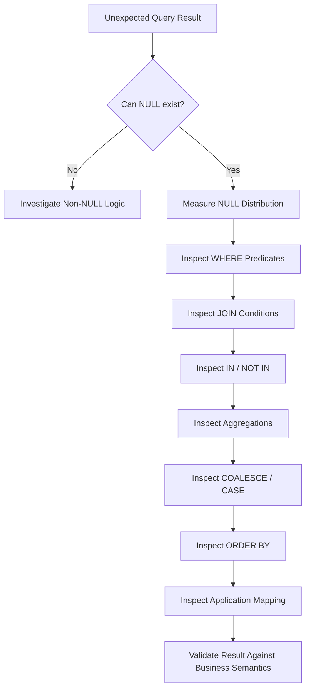

# 06- NULL Related Query Problems

## Overview

`NULL` is one of the most common sources of SQL query bugs because it represents **unknown or missing information**, not an ordinary value.

SQL uses three-valued logic:

```text
TRUE
FALSE
UNKNOWN
```

This affects:

- `WHERE`
- `JOIN`
- `NOT`
- `IN`
- `NOT IN`
- Aggregations
- Ordering
- Unique constraints
- Outer joins
- Subqueries
- Application-side result handling

A query involving `NULL` can be syntactically correct and still produce surprising results.

The most important rule is:

> **Never compare `NULL` with `=` or `<>`. Use `IS NULL`, `IS NOT NULL`, or an explicitly null-safe comparison when appropriate.**

---

## What NULL Means

`NULL` generally represents the absence of a known value.

It is not equivalent to:

```text
0
''
FALSE
'NULL'
```

For example:

```text
discount = NULL
```

means the discount is unknown or absent.

It does not mean:

```text
discount = 0
```

These values have different business meanings.

A robust schema should distinguish between:

```text
NULL → value is absent/unknown/not applicable
0    → known numeric value of zero
''   → known empty string
FALSE → known boolean false
```

---

## Three-Valued Logic

Ordinary programming languages typically reason with:

```text
TRUE
FALSE
```

SQL also has:

```text
UNKNOWN
```

For example:

```sql
SELECT NULL = NULL;
```

does not produce `TRUE`.

The comparison evaluates to:

```text
UNKNOWN
```

Similarly:

```sql
SELECT NULL = 10;
```

produces:

```text
UNKNOWN
```

and:

```sql
SELECT NULL <> 10;
```

also produces:

```text
UNKNOWN
```

This behavior explains many seemingly incorrect queries.

---

## Why WHERE Causes Confusion

A `WHERE` clause keeps rows only when its predicate evaluates to `TRUE`.

It does not keep:

```text
FALSE
UNKNOWN
```

Therefore:

```sql
SELECT *
FROM app.customers
WHERE email = NULL;
```

returns no rows.

The predicate:

```sql
email = NULL
```

evaluates to `UNKNOWN` for a `NULL` email.

Use:

```sql
SELECT *
FROM app.customers
WHERE email IS NULL;
```

instead.

---

## IS NULL and IS NOT NULL

Use:

```sql
IS NULL
```

to find missing values:

```sql
SELECT
    id,
    email
FROM app.customers
WHERE email IS NULL;
```

Use:

```sql
IS NOT NULL
```

to find known values:

```sql
SELECT
    id,
    email
FROM app.customers
WHERE email IS NOT NULL;
```

These are the standard predicates for NULL testing.

---

## NULL Comparison Reference

| Expression | Result when value is NULL |
|---|---|
| `value = NULL` | `UNKNOWN` |
| `value <> NULL` | `UNKNOWN` |
| `value > NULL` | `UNKNOWN` |
| `value < NULL` | `UNKNOWN` |
| `value IS NULL` | `TRUE` |
| `value IS NOT NULL` | `FALSE` |

The distinction between equality and `IS NULL` is fundamental.

---

## NULL and NOT

Consider:

```sql
SELECT *
FROM app.customers
WHERE NOT email = 'alice@example.com';
```

A row with:

```text
email = NULL
```

does not match.

Why?

```text
email = 'alice@example.com'
→ UNKNOWN

NOT UNKNOWN
→ UNKNOWN
```

`WHERE` removes it.

This means:

```sql
WHERE NOT condition
```

does not necessarily mean:

```text
everything that does not satisfy condition
```

when `NULL` is involved.

If `NULL` should explicitly be included:

```sql
SELECT *
FROM app.customers
WHERE email <> 'alice@example.com'
   OR email IS NULL;
```

---

## NULL and IN

Consider:

```sql
SELECT *
FROM app.orders
WHERE status IN ('pending', 'processing');
```

A `NULL` status does not match either value.

That is normally expected.

The more dangerous case is `NOT IN`.

---

## NOT IN and NULL

Consider:

```sql
SELECT *
FROM app.customers
WHERE id NOT IN (
    SELECT customer_id
    FROM app.orders
);
```

If the subquery contains a `NULL`:

```text
100
101
NULL
```

the `NOT IN` predicate can evaluate to `UNKNOWN` for candidate values that are not equal to any non-null value.

This can cause the query to return no rows or fewer rows than expected.

For anti-join semantics, prefer `NOT EXISTS`:

```sql
SELECT *
FROM app.customers AS c
WHERE NOT EXISTS (
    SELECT 1
    FROM app.orders AS o
    WHERE o.customer_id = c.id
);
```

`NOT EXISTS` does not suffer from the same `NULL` semantics as `NOT IN`.

---

## NOT IN vs NOT EXISTS

| Requirement | Preferred pattern |
|---|---|
| Match known values | `IN` |
| Exclude known values | `NOT IN` when NULL is impossible/controlled |
| Check existence | `EXISTS` |
| Check absence | `NOT EXISTS` |

If the subquery column is guaranteed `NOT NULL`, `NOT IN` may be perfectly valid.

For production SQL, however, `NOT EXISTS` is often the clearer choice for relational absence checks.

---

## NULL in JOIN Conditions

Ordinary equality joins do not match two `NULL` values.

Consider:

```sql
SELECT
    a.id,
    b.id
FROM app.a AS a
JOIN app.b AS b
    ON a.reference_id = b.reference_id;
```

If:

```text
a.reference_id = NULL
b.reference_id = NULL
```

the rows do not match.

This is because:

```text
NULL = NULL
→ UNKNOWN
```

not `TRUE`.

---

## Null-Safe Equality in PostgreSQL

PostgreSQL provides:

```sql
IS NOT DISTINCT FROM
```

for null-safe equality.

Example:

```sql
SELECT
    a.id,
    b.id
FROM app.a AS a
JOIN app.b AS b
    ON a.reference_id IS NOT DISTINCT FROM b.reference_id;
```

Now:

```text
10 = 10
→ TRUE

NULL compared with NULL
→ TRUE
```

while:

```text
10 compared with NULL
→ FALSE
```

Use this only when treating two `NULL` values as equivalent matches is actually the desired business semantics.

---

## NULL-Safe Inequality

PostgreSQL also provides:

```sql
IS DISTINCT FROM
```

Example:

```sql
SELECT *
FROM app.customers
WHERE email IS DISTINCT FROM 'alice@example.com';
```

This treats `NULL` as a comparable state rather than producing `UNKNOWN`.

For example:

| `email` | `email IS DISTINCT FROM 'alice@example.com'` |
|---|---:|
| `alice@example.com` | `FALSE` |
| `bob@example.com` | `TRUE` |
| `NULL` | `TRUE` |

This can be useful for change detection and synchronization logic.

---

## NULL and LEFT JOIN

Outer joins introduce another common NULL problem.

Consider:

```sql
SELECT
    c.id,
    o.id AS order_id
FROM app.customers AS c
LEFT JOIN app.orders AS o
    ON o.customer_id = c.id;
```

For a customer without orders:

```text
customer_id | order_id
------------+---------
100         | NULL
```

The `NULL` does not mean the customer itself is missing.

It means:

```text
No matching row existed on the right side of the LEFT JOIN.
```

This distinction is important when interpreting query results.

---

## LEFT JOIN + WHERE NULL Trap

Suppose the requirement is:

> Return customers with no orders.

A common pattern is:

```sql
SELECT
    c.id,
    c.name
FROM app.customers AS c
LEFT JOIN app.orders AS o
    ON o.customer_id = c.id
WHERE o.id IS NULL;
```

This is valid when `o.id` is guaranteed non-null for every real order, such as a primary key.

The result represents:

```text
Customers for which no matching order row exists
```

This is a common and useful anti-join pattern.

---

## Filtering the Right Side of a LEFT JOIN

Consider:

```sql
SELECT
    c.id,
    o.id
FROM app.customers AS c
LEFT JOIN app.orders AS o
    ON o.customer_id = c.id
WHERE o.status = 'completed';
```

Customers without orders are removed because:

```text
o.status = NULL
→ UNKNOWN
```

If the requirement is:

> Keep all customers, but only match completed orders.

use:

```sql
SELECT
    c.id,
    o.id
FROM app.customers AS c
LEFT JOIN app.orders AS o
    ON o.customer_id = c.id
   AND o.status = 'completed';
```

This preserves unmatched customers.

---

## NULL and Aggregation

Aggregate functions have specific NULL behavior.

For example:

```sql
SELECT
    COUNT(*),
    COUNT(discount),
    SUM(discount),
    AVG(discount)
FROM app.orders;
```

Typically:

```text
COUNT(*)       → counts rows
COUNT(discount) → counts non-NULL discount values
SUM(discount)  → ignores NULL values
AVG(discount)  → ignores NULL values
```

Therefore:

```text
COUNT(*)
```

and:

```text
COUNT(column)
```

are not interchangeable.

---

## COUNT and NULL

Suppose:

```text
orders
+----+----------+
| id | discount |
+----+----------+
| 1  | 10       |
| 2  | NULL     |
| 3  | 5        |
+----+----------+
```

Then:

```sql
SELECT
    COUNT(*) AS total_orders,
    COUNT(discount) AS discounted_orders
FROM app.orders;
```

returns conceptually:

```text
total_orders | discounted_orders
-------------+------------------
3            | 2
```

This is often useful when distinguishing:

```text
number of rows
```

from:

```text
number of rows containing a known value
```

---

## SUM and AVG With All NULL Values

If an aggregate such as:

```sql
SUM(amount)
```

has no non-null input values, the result can be `NULL`.

For API responses or reports, you may want:

```sql
SELECT
    COALESCE(SUM(amount), 0) AS total_amount
FROM app.payments
WHERE customer_id = 100;
```

This converts:

```text
NULL
```

to:

```text
0
```

only at the presentation or calculation boundary where that semantic conversion is appropriate.

Do not blindly replace every `NULL` with zero.

---

## COALESCE

`COALESCE` returns the first non-null expression.

```sql
SELECT
    COALESCE(discount, 0) AS discount
FROM app.orders;
```

If:

```text
discount = NULL
```

the expression returns:

```text
0
```

Multiple fallbacks are possible:

```sql
SELECT
    COALESCE(
        preferred_email,
        backup_email,
        'unknown@example.com'
    ) AS contact_email
FROM app.customers;
```

Use `COALESCE` when the fallback has a meaningful business interpretation.

---

## COALESCE and Type Semantics

Be careful with fallback values.

For numeric data:

```sql
COALESCE(amount, 0)
```

is usually straightforward.

For timestamps:

```sql
COALESCE(deleted_at, now())
```

may be semantically misleading because it changes:

```text
unknown/not deleted
```

into:

```text
current time
```

The query may execute correctly while producing incorrect business meaning.

---

## NULLIF

`NULLIF` converts a value to `NULL` when two expressions are equal.

Example:

```sql
SELECT NULLIF(total_amount, 0)
FROM app.orders;
```

This can be useful when zero should be treated as an absent denominator or special state.

For example:

```sql
SELECT
    revenue / NULLIF(order_count, 0) AS revenue_per_order
FROM app.daily_metrics;
```

If:

```text
order_count = 0
```

the denominator becomes `NULL` rather than causing division by zero.

---

## CASE and NULL

`CASE` expressions must account for NULL explicitly when necessary.

This:

```sql
CASE email
    WHEN NULL THEN 'missing'
    ELSE 'present'
END
```

does not work as an ordinary NULL test.

Use:

```sql
CASE
    WHEN email IS NULL THEN 'missing'
    ELSE 'present'
END
```

For searched conditions, `IS NULL` is the correct form.

---

## Simple CASE vs Searched CASE

Simple form:

```sql
CASE status
    WHEN 'pending' THEN 'waiting'
    WHEN 'completed' THEN 'done'
    ELSE 'other'
END
```

Searched form:

```sql
CASE
    WHEN status IS NULL THEN 'unknown'
    WHEN status = 'pending' THEN 'waiting'
    WHEN status = 'completed' THEN 'done'
    ELSE 'other'
END
```

The searched form is preferable when conditions involve:

- `NULL`
- Ranges
- Multiple columns
- Complex predicates

---

## NULL and ORDER BY

By default, NULL ordering depends on the database and sort direction.

PostgreSQL provides explicit control:

```sql
ORDER BY last_login DESC NULLS LAST;
```

or:

```sql
ORDER BY last_login ASC NULLS FIRST;
```

For APIs, reports, and dashboards, explicitly specifying NULL placement can make behavior deterministic and easier to reason about.

---

## NULL and Pagination

Suppose an API sorts by:

```sql
ORDER BY last_login DESC NULLS LAST;
```

If keyset pagination is used, NULL handling becomes part of the pagination boundary.

A cursor based only on:

```text
last_login
```

may not be sufficient when NULL values are possible.

Senior-level pagination design should consider:

```text
Sort direction
NULL ordering
Tie-breaker
Cursor encoding
Stable ordering
```

A unique secondary key is often necessary for deterministic ordering.

---

## NULL and Unique Constraints

In PostgreSQL, ordinary unique constraints generally allow multiple `NULL` values because NULLs are not considered equal under normal SQL equality semantics.

For example:

```sql
CREATE TABLE app.users (
    id bigint PRIMARY KEY,
    external_id text UNIQUE
);
```

Multiple rows can have:

```text
external_id = NULL
```

while non-null external IDs must be unique.

If the requirement is different, PostgreSQL provides additional mechanisms such as:

```sql
CREATE UNIQUE INDEX ...
```

with appropriate predicates, or newer PostgreSQL null-distinctness options where supported by the target version.

Always verify the database version and desired semantics before relying on NULL uniqueness behavior.

---

## Partial Unique Indexes

A common production requirement is:

> Only active records must have a unique value.

For example:

```sql
CREATE UNIQUE INDEX customers_active_email_uidx
ON app.customers (email)
WHERE deleted_at IS NULL;
```

This allows historical/deleted rows to retain the same email while enforcing uniqueness among active customers.

This is often better than trying to encode lifecycle semantics entirely in application code.

---

## NULL and Foreign Keys

Foreign keys commonly allow NULL unless the referencing column is declared `NOT NULL`.

For example:

```sql
CREATE TABLE app.orders (
    id bigint PRIMARY KEY,
    customer_id bigint REFERENCES app.customers(id)
);
```

This allows:

```text
customer_id = NULL
```

which can represent:

```text
order has no assigned customer
```

If every order must have a customer:

```sql
customer_id bigint NOT NULL REFERENCES app.customers(id)
```

The database should enforce the invariant.

---

## NULL and NOT NULL

Use `NOT NULL` when absence is not a valid business state.

Example:

```sql
CREATE TABLE app.orders (
    id bigint PRIMARY KEY,
    customer_id bigint NOT NULL,
    created_at timestamptz NOT NULL DEFAULT now()
);
```

Benefits include:

- Stronger data integrity
- Simpler query logic
- More predictable joins
- Clearer application contracts
- Better assumptions for query optimization

Do not make every column `NOT NULL` automatically.

If a value can legitimately be unknown or not applicable, `NULL` may be the correct representation.

---

## NULL in Dynamic Application Queries

Backend applications often construct optional filters.

For example, an API might support:

```text
GET /customers?deleted=false
```

and:

```text
GET /customers
```

The SQL must distinguish between:

```text
No filter requested
```

and:

```text
Filter for NULL
```

Do not generate:

```sql
WHERE deleted_at = NULL
```

Generate the appropriate predicate:

```sql
WHERE deleted_at IS NULL
```

or omit the filter entirely when the API parameter is not supplied.

---

## Django and NULL

Django maps Python's:

```python
None
```

to SQL `NULL`.

For example:

```python
Customer.objects.filter(deleted_at__isnull=True)
```

generates the appropriate `IS NULL` semantics.

Do not write application logic assuming:

```python
field == None
```

has the same meaning as arbitrary SQL equality.

Use Django's explicit query expressions:

```python
field__isnull=True
field__isnull=False
```

for database NULL checks.

---

## Django `exclude()` and NULL

Be careful with:

```python
Customer.objects.exclude(email="alice@example.com")
```

when `email` can be NULL.

SQL's three-valued logic means NULL rows may not behave like ordinary values that are simply "not Alice".

If the business requirement is:

```text
All customers except Alice, including customers with no email
```

express the requirement explicitly rather than relying on intuitive boolean reasoning.

---

## FastAPI and API Serialization

Database NULL values commonly become:

```json
null
```

in REST API responses.

Example:

```json
{
  "id": 100,
  "email": null,
  "deleted_at": null
}
```

Do not automatically convert every database NULL into:

```json
""
```

or:

```json
0
```

because that destroys semantic information.

API contracts should explicitly define whether fields can be null.

---

## NULL and JSON

PostgreSQL JSON/JSONB introduces another distinction:

```text
SQL NULL
```

versus:

```text
JSON null
```

For example:

```sql
SELECT '{"email": null}'::jsonb;
```

contains a JSON value whose property is explicitly:

```text
email: null
```

while a SQL column itself can be:

```text
NULL
```

These are different states.

When building APIs, carefully distinguish:

```text
property absent
property present with JSON null
column itself SQL NULL
```

depending on the application's semantics.

---

## NULL and Redis/Kafka

The distinction can become important when database state is propagated to other systems.

For example:

```text
PostgreSQL
    ↓
Kafka event
    ↓
Consumer
    ↓
Redis / Search / Read Model
```

An event may need to distinguish:

```text
field omitted
```

from:

```text
field explicitly cleared
```

from:

```text
field never existed
```

This is particularly important for partial updates and event-driven synchronization.

Do not assume that serializing SQL NULL into JSON automatically preserves the business meaning required by downstream consumers.

---

## NULL and Search Conditions

A query such as:

```sql
WHERE email LIKE '%@example.com'
```

does not match NULL emails.

The predicate becomes:

```text
UNKNOWN
```

If NULL emails need separate handling:

```sql
WHERE email LIKE '%@example.com'
   OR email IS NULL;
```

Whether this is correct depends on the business requirement.

---

## NULL and Arithmetic

Arithmetic involving NULL generally produces NULL.

For example:

```sql
SELECT price + discount
FROM app.products;
```

If:

```text
discount = NULL
```

the result is:

```text
NULL
```

If NULL means "no discount" in the business model:

```sql
SELECT
    price + COALESCE(discount, 0) AS final_price
FROM app.products;
```

Again, this should be an intentional semantic decision.

---

## NULL and Boolean Columns

A nullable boolean has three states:

```text
TRUE
FALSE
NULL
```

This can be useful when:

```text
TRUE  = confirmed
FALSE = explicitly rejected
NULL  = not yet decided
```

But if the application really has only:

```text
enabled
disabled
```

a nullable boolean creates unnecessary complexity.

Prefer:

```sql
enabled boolean NOT NULL DEFAULT false
```

when a third state has no business meaning.

---

## Nullable Boolean Queries

For a nullable boolean:

```sql
WHERE enabled = true
```

returns only true values.

It does not return:

```text
FALSE
NULL
```

For:

```text
enabled IS NOT TRUE
```

PostgreSQL provides a useful way to match both:

```text
FALSE
NULL
```

when that is the intended semantic meaning.

Similarly:

```sql
enabled IS NOT FALSE
```

matches:

```text
TRUE
NULL
```

Use these predicates deliberately rather than relying on implicit boolean behavior.

---

## NULL and Indexes

NULL values can participate in indexes, but query behavior and index design depend on the database and predicate.

For PostgreSQL:

```sql
CREATE INDEX customers_deleted_at_idx
ON app.customers (deleted_at);
```

can support queries involving `deleted_at`, including appropriate `IS NULL` predicates.

For a common soft-delete workload:

```sql
SELECT *
FROM app.customers
WHERE deleted_at IS NULL;
```

a partial index may be more useful:

```sql
CREATE INDEX customers_active_idx
ON app.customers (id)
WHERE deleted_at IS NULL;
```

The right index depends on:

```text
Selectivity
Query predicates
Result columns
Table size
Data distribution
Write frequency
```

Use `EXPLAIN` to validate actual behavior.

---

## Debugging NULL Problems

When a query unexpectedly returns zero or too few rows, inspect NULL distribution first.

```sql
SELECT
    COUNT(*) AS total_rows,
    COUNT(email) AS non_null_emails,
    COUNT(*) - COUNT(email) AS null_emails
FROM app.customers;
```

For multiple columns:

```sql
SELECT
    COUNT(*) FILTER (WHERE email IS NULL) AS null_emails,
    COUNT(*) FILTER (WHERE phone IS NULL) AS null_phones,
    COUNT(*) FILTER (WHERE deleted_at IS NULL) AS active_rows
FROM app.customers;
```

This quickly reveals whether NULL is affecting the result.

---

## Debugging JOIN NULLs

Inspect both sides:

```sql
SELECT
    COUNT(*) FILTER (WHERE customer_id IS NULL) AS null_customer_ids,
    COUNT(*) AS total_orders
FROM app.orders;
```

Then inspect unmatched records:

```sql
SELECT
    o.id,
    o.customer_id
FROM app.orders AS o
LEFT JOIN app.customers AS c
    ON c.id = o.customer_id
WHERE c.id IS NULL;
```

If the foreign key is enforced and not nullable, this should normally return no rows.

Unexpected results may indicate:

- Missing constraints
- Legacy data
- Disabled validation during migration
- Incorrect join conditions
- Different database/schema than expected

---

## A Systematic NULL Troubleshooting Workflow



A practical sequence is:

1. Identify which columns can contain NULL.
2. Count NULL and non-NULL values.
3. Replace implicit equality assumptions with explicit NULL predicates.
4. Inspect joins and subqueries.
5. Check `NOT IN` and outer joins.
6. Inspect aggregation behavior.
7. Check application serialization and ORM expressions.
8. Validate the result against the business requirement.

---

## Common NULL Query Mistakes

### Using `= NULL`

Incorrect:

```sql
WHERE deleted_at = NULL
```

Correct:

```sql
WHERE deleted_at IS NULL
```

### Using `<>` to Find Non-NULL Values

Incorrect:

```sql
WHERE email <> 'alice@example.com'
```

This does not include NULL emails.

If NULL should be included:

```sql
WHERE email <> 'alice@example.com'
   OR email IS NULL;
```

### Using NOT IN With Nullable Data

Potentially dangerous:

```sql
WHERE id NOT IN (
    SELECT customer_id
    FROM orders
);
```

Prefer:

```sql
WHERE NOT EXISTS (
    SELECT 1
    FROM orders AS o
    WHERE o.customer_id = c.id
);
```

### Assuming NULL = NULL

Incorrect:

```sql
ON a.code = b.code
```

if NULL-to-NULL matching is required.

PostgreSQL:

```sql
ON a.code IS NOT DISTINCT FROM b.code
```

### Using COALESCE Everywhere

This:

```sql
COALESCE(value, 0)
```

changes semantics.

Use it only when zero genuinely represents the intended fallback.

### Ignoring Nullable Booleans

A nullable boolean has three states.

If the application needs only two states, use `NOT NULL`.

### Filtering a LEFT JOIN in WHERE

A right-side predicate can eliminate unmatched rows.

Move relationship-specific filters into `ON` when preserving the outer join is required.

### Assuming NULL Means Empty

These are different:

```text
NULL
''
' '
0
FALSE
```

The schema and API contract should define their meanings.

---

## Security Considerations

NULL-related bugs can affect authorization and data isolation.

For example, an authorization query that incorrectly interprets:

```text
NULL tenant_id
```

as:

```text
no tenant restriction
```

can become dangerous.

Avoid security logic such as:

```sql
WHERE tenant_id = :tenant_id
   OR tenant_id IS NULL;
```

unless NULL explicitly represents a globally accessible resource and that behavior is intentional.

For multi-tenant systems, clearly distinguish:

```text
tenant-specific resource
global resource
missing tenant assignment
invalid tenant state
```

and enforce the intended invariant through constraints, authorization logic, and where appropriate PostgreSQL RLS.

---

## Performance Considerations

NULL predicates are not inherently slow.

Performance depends on:

- Table size
- Selectivity
- Index structure
- Statistics
- Query shape
- Join cardinality
- Result size

Use:

```sql
EXPLAIN (ANALYZE, BUFFERS)
```

when investigating production query performance.

For frequently queried nullable columns, consider whether a partial index matches the workload:

```sql
CREATE INDEX customers_active_idx
ON app.customers (id)
WHERE deleted_at IS NULL;
```

Do not add indexes merely because a column contains NULL values.

---

## Production Design Guidelines

Use nullable columns when absence is a meaningful state.

Use `NOT NULL` when the business invariant requires a value.

Prefer database constraints over application assumptions:

```text
NOT NULL
UNIQUE
FOREIGN KEY
CHECK
```

Use explicit predicates:

```text
IS NULL
IS NOT NULL
IS DISTINCT FROM
IS NOT DISTINCT FROM
```

Use `EXISTS` and `NOT EXISTS` when expressing existence semantics.

Be deliberate with:

```text
COALESCE
NULLIF
CASE
COUNT(column)
LEFT JOIN
NOT IN
```

For API design, explicitly define whether a field can be:

```text
missing
null
empty
zero
false
```

For event-driven systems, preserve the distinction between:

```text
field omitted
field explicitly cleared
field has a value
```

when downstream consumers depend on it.

---

## Production Checklist

### Query Logic

- [ ] Identify nullable columns.
- [ ] Use `IS NULL` and `IS NOT NULL`.
- [ ] Review `NOT`, `<>`, and comparison predicates.
- [ ] Review `IN` and `NOT IN`.
- [ ] Prefer `NOT EXISTS` for absence checks when appropriate.
- [ ] Review NULL behavior in joins.
- [ ] Review outer-join predicates.

### Aggregation

- [ ] Distinguish `COUNT(*)` from `COUNT(column)`.
- [ ] Understand NULL behavior of `SUM`, `AVG`, `MIN`, and `MAX`.
- [ ] Use `COALESCE` only with intentional semantics.
- [ ] Use `NULLIF` where zero/NULL conversion is required.

### Schema

- [ ] Use `NOT NULL` where required.
- [ ] Define nullable boolean semantics.
- [ ] Enforce uniqueness where appropriate.
- [ ] Validate foreign-key nullability.
- [ ] Document meaningful NULL states.

### Application

- [ ] Verify Django `__isnull` usage.
- [ ] Inspect generated ORM SQL.
- [ ] Verify FastAPI/API nullability contracts.
- [ ] Distinguish SQL NULL from JSON `null`.
- [ ] Preserve null semantics in Kafka events and Redis read models when required.

### Security

- [ ] Review NULL tenant identifiers.
- [ ] Review NULL authorization attributes.
- [ ] Validate RLS behavior.
- [ ] Do not treat NULL as an implicit authorization bypass.

### Performance

- [ ] Inspect NULL distribution.
- [ ] Use `EXPLAIN` for important queries.
- [ ] Consider partial indexes for highly selective nullable predicates.
- [ ] Avoid unnecessary `COALESCE` expressions that change query semantics.
- [ ] Validate performance against production-like data distributions.

## Key Takeaways

- **`NULL` is not an ordinary value:** SQL uses three-valued logic, so equality and inequality comparisons with NULL produce `UNKNOWN`; use `IS NULL` and `IS NOT NULL`.
- **`NOT IN`, JOINs, outer joins, and aggregations require special care:** NULL can change results in ways that are not obvious from ordinary boolean reasoning.
- **Use explicit semantic operators and patterns:** `EXISTS`, `NOT EXISTS`, `IS DISTINCT FROM`, `IS NOT DISTINCT FROM`, `COALESCE`, and `NULLIF` each solve different NULL-related requirements.
- **Model NULL intentionally:** use `NOT NULL` when absence is invalid, and ensure API, ORM, JSON, Kafka, and Redis representations preserve the intended distinction between missing, null, empty, and zero values.
- **Treat NULL bugs as correctness and security issues:** especially in authorization, multi-tenant joins, soft deletes, pagination, and database constraints.