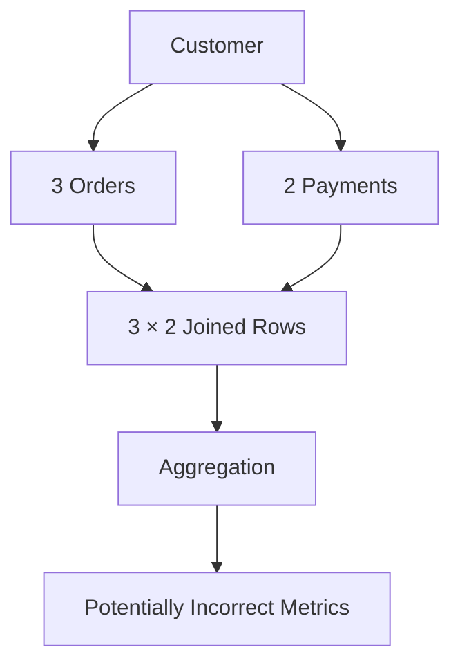
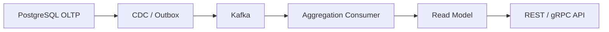
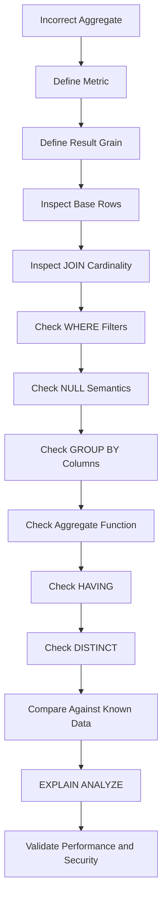

# 07- Aggregation and GROUP BY Problems

## Overview

Aggregation bugs are often caused by a mismatch between the **desired result grain** and the grouping performed by the query.

Common problems include:

- Missing columns in `GROUP BY`.
- Grouping at the wrong level.
- Counting joined rows instead of business entities.
- Double-counting caused by one-to-many joins.
- Confusing `COUNT(*)` with `COUNT(column)`.
- Misusing `WHERE` and `HAVING`.
- Filtering rows before aggregation when the requirement is to filter groups.
- Aggregating nullable values incorrectly.
- Using `DISTINCT` to hide join multiplication.
- Returning nondeterministic or misleading representative values.
- Applying pagination to an aggregated result incorrectly.
- Calculating metrics after a join that has already multiplied the underlying facts.

The central debugging question is:

> **What should one aggregated row represent, and which rows should contribute to that result?**

---

## Aggregation and Result Grain

Aggregation transforms multiple input rows into fewer output rows.

For example:

```sql
SELECT
    customer_id,
    COUNT(*) AS order_count
FROM app.orders
GROUP BY customer_id;
```

The result grain is:

```text
one row per customer
```

Without:

```sql
GROUP BY customer_id
```

there is no customer-level grouping.

The grouping columns define the identity of each output group.

A useful mental model is:

```text
Raw rows
   ↓
FROM / JOIN
   ↓
WHERE
   ↓
GROUP BY
   ↓
Aggregate functions
   ↓
HAVING
   ↓
SELECT / ORDER BY
   ↓
Result
```

The important consequence is that **joins happen before aggregation**. If a join multiplies rows, the aggregate operates on the multiplied result unless the query deliberately prevents that.

---

## SQL Query Processing Order

A simplified logical processing order is:

```text
FROM
  ↓
JOIN / ON
  ↓
WHERE
  ↓
GROUP BY
  ↓
HAVING
  ↓
SELECT
  ↓
DISTINCT
  ↓
ORDER BY
  ↓
LIMIT / OFFSET
```

This explains several common mistakes.

For example:

```sql
SELECT
    customer_id,
    COUNT(*) AS order_count
FROM app.orders
WHERE status = 'completed'
GROUP BY customer_id
HAVING COUNT(*) >= 10;
```

The query first removes non-completed orders, then groups the remaining rows, then keeps groups having at least ten completed orders.

Conceptually:

```text
all orders
   ↓
WHERE status = completed
   ↓
completed orders
   ↓
GROUP BY customer
   ↓
customer groups
   ↓
HAVING count >= 10
   ↓
final customers
```

---

## GROUP BY Defines the Output Grain

Consider:

```sql
SELECT
    customer_id,
    status,
    COUNT(*) AS order_count
FROM app.orders
GROUP BY
    customer_id,
    status;
```

This produces:

```text
one row per customer + status
```

not:

```text
one row per customer
```

If customer `100` has:

```text
5 completed orders
2 pending orders
```

the query returns two rows:

```text
100 | completed | 5
100 | pending   | 2
```

Adding another grouping column always potentially increases the number of groups.

---

## The Most Important Aggregation Question

Before writing:

```sql
GROUP BY ...
```

write down:

```text
One result row represents ______.
```

Examples:

```text
One row = customer
One row = customer + month
One row = order
One row = tenant + day
One row = product
One row = product + warehouse
```

Then choose grouping columns that uniquely identify that grain.

---

## Selecting Non-Aggregated Columns

A common mistake is:

```sql
SELECT
    customer_id,
    status,
    COUNT(*)
FROM app.orders
GROUP BY customer_id;
```

In PostgreSQL, this is rejected because `status` is neither:

- grouped, nor
- aggregated.

The database cannot determine which status should represent a customer having multiple statuses.

Correct alternatives depend on the requirement.

### Group by status

```sql
SELECT
    customer_id,
    status,
    COUNT(*) AS order_count
FROM app.orders
GROUP BY
    customer_id,
    status;
```

### Aggregate status

For example:

```sql
SELECT
    customer_id,
    MAX(created_at) AS latest_order_at
FROM app.orders
GROUP BY customer_id;
```

Then retrieve the associated order using an appropriate one-row-per-group technique if needed.

Do not arbitrarily add columns to `GROUP BY` merely to make the query execute. That changes the result grain.

---

## Functional Dependencies

PostgreSQL can sometimes allow a non-grouped column when it is functionally dependent on grouped columns.

For example, when grouping by a table's primary key, other columns of that same relation may be recognized as functionally dependent.

Conceptually:

```text
customer.id → customer.name
```

because `id` uniquely identifies a customer.

However, this should not be used as a substitute for understanding grouping semantics.

When queries become complex, explicit grouping or a clearer query structure is often easier to maintain.

---

## COUNT Variants

These expressions are not equivalent:

```sql
COUNT(*)
COUNT(id)
COUNT(email)
COUNT(DISTINCT customer_id)
```

They answer different questions.

| Expression | Meaning |
|---|---|
| `COUNT(*)` | Number of rows |
| `COUNT(column)` | Number of non-NULL values |
| `COUNT(DISTINCT column)` | Number of distinct non-NULL values |
| `COUNT(DISTINCT a, b)` | Distinct combinations where supported |
| `COUNT(*) FILTER (...)` | Number of rows satisfying a condition |

Use the expression that matches the business metric.

---

## COUNT(*) vs COUNT(column)

Suppose:

```text
orders
+----+----------+
| id | coupon   |
+----+----------+
| 1  | SAVE10   |
| 2  | NULL     |
| 3  | SAVE20   |
+----+----------+
```

Then:

```sql
SELECT
    COUNT(*) AS total_orders,
    COUNT(coupon) AS orders_with_coupon
FROM app.orders;
```

returns conceptually:

```text
total_orders | orders_with_coupon
-------------+-------------------
3            | 2
```

`COUNT(column)` ignores NULL values.

---

## COUNT(DISTINCT)

Suppose:

```text
orders
+----+-------------+
| id | customer_id |
+----+-------------+
| 1  | 100         |
| 2  | 100         |
| 3  | 101         |
+----+-------------+
```

This:

```sql
SELECT COUNT(*)
FROM app.orders;
```

returns:

```text
3
```

while:

```sql
SELECT COUNT(DISTINCT customer_id)
FROM app.orders;
```

returns:

```text
2
```

The first counts orders.

The second counts unique customers represented by those orders.

---

## COUNT(DISTINCT) Does Not Always Fix Double Counting

Suppose you calculate revenue:

```sql
SELECT
    SUM(o.total_amount)
FROM app.orders AS o
JOIN app.order_items AS oi
    ON oi.order_id = o.id;
```

If an order has five items, its row may appear five times.

The query can therefore calculate:

```text
order total × number of items
```

rather than actual revenue.

Changing another metric to:

```sql
COUNT(DISTINCT o.id)
```

does not fix the duplicated `SUM`.

The aggregation must operate on the correct grain.

---

## Join Multiplication Before Aggregation

This is one of the most important aggregation problems.

Suppose:

```text
Customer
   │
   ├── Orders
   │
   └── Payments
```

A customer has:

```text
3 orders
2 payments
```

A raw join can produce:

```text
3 × 2 = 6 rows
```

If the query then calculates:

```sql
SUM(o.total_amount)
```

each order can be counted multiple times.

Conceptually:



The database is aggregating the rows you gave it.

The mistake happened before the aggregate.

---

## Prevent Double Counting With Pre-Aggregation

Instead of joining raw orders and payments:

```text
customer × orders × payments
```

aggregate each relation first.

```sql
WITH order_summary AS (
    SELECT
        customer_id,
        SUM(total_amount) AS order_revenue
    FROM app.orders
    GROUP BY customer_id
),
payment_summary AS (
    SELECT
        customer_id,
        SUM(amount) AS paid_amount
    FROM app.payments
    GROUP BY customer_id
)
SELECT
    c.id,
    COALESCE(o.order_revenue, 0) AS order_revenue,
    COALESCE(p.paid_amount, 0) AS paid_amount
FROM app.customers AS c
LEFT JOIN order_summary AS o
    ON o.customer_id = c.id
LEFT JOIN payment_summary AS p
    ON p.customer_id = c.id;
```

Now each derived table has:

```text
one row per customer
```

so the final joins cannot multiply order totals against payment totals.

---

## Aggregate at the Correct Grain

Suppose the business requirement is:

> Total revenue per customer.

This is appropriate:

```sql
SELECT
    customer_id,
    SUM(total_amount) AS revenue
FROM app.orders
GROUP BY customer_id;
```

If the requirement is:

> Revenue per customer per month.

the grain changes:

```sql
SELECT
    customer_id,
    date_trunc('month', created_at) AS month,
    SUM(total_amount) AS revenue
FROM app.orders
GROUP BY
    customer_id,
    date_trunc('month', created_at);
```

Adding the month changes the result from:

```text
customer
```

to:

```text
customer + month
```

This is intentional dimensionality.

---

## WHERE vs HAVING

`WHERE` filters individual input rows before grouping.

`HAVING` filters groups after aggregation.

Example:

```sql
SELECT
    customer_id,
    COUNT(*) AS order_count
FROM app.orders
WHERE status = 'completed'
GROUP BY customer_id
HAVING COUNT(*) >= 10;
```

The semantics are:

```text
Only completed orders
        ↓
Group by customer
        ↓
Count orders
        ↓
Keep customers with >= 10
```

Using `WHERE COUNT(*) >= 10` is invalid because the aggregate does not exist at that logical stage.

---

## WHERE vs HAVING Comparison

| Requirement | Use |
|---|---|
| Filter individual orders | `WHERE` |
| Filter customers after counting orders | `HAVING` |
| Filter rows before aggregation | `WHERE` |
| Filter aggregated groups | `HAVING` |

Prefer `WHERE` for row-level filtering whenever possible because reducing input rows before aggregation can reduce work.

---

## Incorrect HAVING Logic

Suppose:

> Find customers with at least ten completed orders.

Correct:

```sql
SELECT
    customer_id,
    COUNT(*) AS order_count
FROM app.orders
WHERE status = 'completed'
GROUP BY customer_id
HAVING COUNT(*) >= 10;
```

A common incorrect approach is:

```sql
SELECT
    customer_id,
    COUNT(*) AS order_count
FROM app.orders
GROUP BY customer_id
HAVING status = 'completed'
   AND COUNT(*) >= 10;
```

This is wrong because `status` is not a group-level value unless it is grouped or aggregated.

The question is whether `status` applies to:

```text
individual rows
```

or:

```text
the resulting group
```

---

## Conditional Aggregation

Conditional aggregation is useful when multiple metrics should be calculated from the same grouped input.

PostgreSQL supports:

```sql
SELECT
    customer_id,
    COUNT(*) AS total_orders,
    COUNT(*) FILTER (
        WHERE status = 'completed'
    ) AS completed_orders,
    COUNT(*) FILTER (
        WHERE status = 'cancelled'
    ) AS cancelled_orders
FROM app.orders
GROUP BY customer_id;
```

This produces one row per customer:

```text
customer
total orders
completed orders
cancelled orders
```

It avoids scanning or grouping the same relation separately for each metric in many cases.

---

## FILTER vs CASE

Portable SQL often uses:

```sql
SUM(
    CASE
        WHEN status = 'completed' THEN total_amount
        ELSE 0
    END
)
```

PostgreSQL provides the cleaner:

```sql
SUM(total_amount) FILTER (
    WHERE status = 'completed'
)
```

Both can express conditional aggregation.

The PostgreSQL `FILTER` syntax is often easier to read when targeting PostgreSQL specifically.

---

## NULL and Aggregation

Aggregate functions treat NULL differently.

For example:

```sql
SELECT
    COUNT(*) AS rows,
    COUNT(amount) AS amounts_present,
    SUM(amount) AS total_amount,
    AVG(amount) AS average_amount
FROM app.payments;
```

Generally:

```text
COUNT(*)       → counts rows
COUNT(amount)  → counts non-NULL amounts
SUM(amount)    → ignores NULL inputs
AVG(amount)    → ignores NULL inputs
```

If all input values for `SUM` are NULL, the result can itself be NULL.

Use:

```sql
COALESCE(SUM(amount), 0)
```

only when zero is the intended business meaning.

---

## Aggregating After LEFT JOIN

Consider:

```sql
SELECT
    c.id,
    COUNT(*) AS order_count
FROM app.customers AS c
LEFT JOIN app.orders AS o
    ON o.customer_id = c.id
GROUP BY c.id;
```

This has a subtle problem.

A customer with no orders still produces one NULL-extended row from the `LEFT JOIN`, so:

```sql
COUNT(*)
```

returns:

```text
1
```

for that customer.

If the requirement is the number of actual orders, use:

```sql
SELECT
    c.id,
    COUNT(o.id) AS order_count
FROM app.customers AS c
LEFT JOIN app.orders AS o
    ON o.customer_id = c.id
GROUP BY c.id;
```

Because:

```text
o.id = NULL
```

for the unmatched row, `COUNT(o.id)` returns:

```text
0
```

This is a very common aggregation bug.

---

## SUM After LEFT JOIN

Similarly:

```sql
SELECT
    c.id,
    SUM(o.total_amount) AS revenue
FROM app.customers AS c
LEFT JOIN app.orders AS o
    ON o.customer_id = c.id
GROUP BY c.id;
```

Customers without orders may receive:

```text
NULL
```

for revenue.

If the API/reporting contract requires zero:

```sql
SELECT
    c.id,
    COALESCE(SUM(o.total_amount), 0) AS revenue
FROM app.customers AS c
LEFT JOIN app.orders AS o
    ON o.customer_id = c.id
GROUP BY c.id;
```

This is an intentional semantic conversion:

```text
No orders
→ no aggregate input
→ NULL
→ 0 for reporting
```

---

## Aggregating Distinct Entities

Suppose an order has multiple items:

```sql
SELECT
    COUNT(o.id)
FROM app.orders AS o
JOIN app.order_items AS oi
    ON oi.order_id = o.id;
```

This counts joined rows, not necessarily orders.

Use:

```sql
SELECT
    COUNT(DISTINCT o.id)
FROM app.orders AS o
JOIN app.order_items AS oi
    ON oi.order_id = o.id;
```

when the metric is:

```text
number of distinct orders having items
```

But for large datasets, `COUNT(DISTINCT ...)` can still be expensive.

If the business requirement is existence, `EXISTS` can sometimes be clearer:

```sql
SELECT COUNT(*)
FROM app.orders AS o
WHERE EXISTS (
    SELECT 1
    FROM app.order_items AS oi
    WHERE oi.order_id = o.id
);
```

The best formulation depends on the data model and execution plan.

---

## GROUP BY and JOINs

Suppose:

```sql
SELECT
    c.id,
    COUNT(o.id)
FROM app.customers AS c
JOIN app.orders AS o
    ON o.customer_id = c.id
GROUP BY c.id;
```

This is normally straightforward because each order belongs to one customer.

Now add order items:

```sql
SELECT
    c.id,
    COUNT(o.id)
FROM app.customers AS c
JOIN app.orders AS o
    ON o.customer_id = c.id
JOIN app.order_items AS oi
    ON oi.order_id = o.id
GROUP BY c.id;
```

Now an order with ten items can contribute ten joined rows.

The query may count:

```text
order-item relationships
```

instead of:

```text
orders
```

Use:

```sql
COUNT(DISTINCT o.id)
```

or restructure the query depending on the metric.

---

## Grouping Before Joining

Sometimes aggregation should happen before the join.

For example:

```sql
WITH order_summary AS (
    SELECT
        customer_id,
        COUNT(*) AS order_count,
        SUM(total_amount) AS revenue
    FROM app.orders
    GROUP BY customer_id
)
SELECT
    c.id,
    c.name,
    COALESCE(o.order_count, 0) AS order_count,
    COALESCE(o.revenue, 0) AS revenue
FROM app.customers AS c
LEFT JOIN order_summary AS o
    ON o.customer_id = c.id;
```

This keeps the aggregation at:

```text
customer grain
```

before adding customer attributes.

---

## GROUP BY and Date Bucketing

Time-based reporting commonly introduces grouping mistakes.

For example:

```sql
SELECT
    date_trunc('day', created_at) AS day,
    COUNT(*) AS orders
FROM app.orders
GROUP BY date_trunc('day', created_at)
ORDER BY day;
```

This creates:

```text
one row per day
```

For monthly reporting:

```sql
SELECT
    date_trunc('month', created_at) AS month,
    COUNT(*) AS orders
FROM app.orders
GROUP BY date_trunc('month', created_at)
ORDER BY month;
```

Be careful with time zones when timestamps represent business-local time.

---

## Time Zones and Aggregation

If the application reports metrics in a business timezone, grouping raw UTC timestamps by day may produce incorrect business dates.

For PostgreSQL:

```sql
SELECT
    date_trunc(
        'day',
        created_at AT TIME ZONE 'Asia/Kolkata'
    ) AS business_day,
    COUNT(*) AS orders
FROM app.orders
GROUP BY
    date_trunc(
        'day',
        created_at AT TIME ZONE 'Asia/Kolkata'
    )
ORDER BY business_day;
```

The exact timezone should come from the business requirement rather than the application server's local timezone.

For multi-tenant systems, tenant-specific timezone requirements can make reporting architecture more complex.

---

## GROUP BY and Pagination

Aggregated queries can be paginated:

```sql
SELECT
    customer_id,
    COUNT(*) AS order_count
FROM app.orders
GROUP BY customer_id
ORDER BY customer_id
LIMIT 50;
```

Here pagination applies to:

```text
customer groups
```

which is appropriate if the API returns customers.

However, pagination should be applied only after the intended aggregation.

Do not paginate raw rows first and assume the resulting page represents complete customer aggregates.

For large reporting APIs, keyset pagination is often preferable to large `OFFSET` values.

---

## ORDER BY Aggregated Results

To find customers with the most orders:

```sql
SELECT
    customer_id,
    COUNT(*) AS order_count
FROM app.orders
GROUP BY customer_id
ORDER BY order_count DESC;
```

For deterministic ordering when counts tie:

```sql
ORDER BY
    order_count DESC,
    customer_id ASC;
```

Stable tie-breaking is important for:

- Pagination
- APIs
- Reports
- Reproducible tests
- Caching

---

## Top-N Aggregation

A common production query is:

```sql
SELECT
    customer_id,
    SUM(total_amount) AS revenue
FROM app.orders
WHERE created_at >= CURRENT_DATE - INTERVAL '30 days'
GROUP BY customer_id
ORDER BY revenue DESC, customer_id
LIMIT 100;
```

This means:

```text
Filter recent orders
    ↓
Group by customer
    ↓
Calculate revenue
    ↓
Sort groups
    ↓
Return top 100
```

The `LIMIT` applies to groups, not raw orders.

---

## GROUP BY and DISTINCT

These are related but not interchangeable.

`DISTINCT`:

```sql
SELECT DISTINCT customer_id
FROM app.orders;
```

means:

```text
Return unique customer IDs.
```

`GROUP BY`:

```sql
SELECT
    customer_id,
    COUNT(*) AS order_count
FROM app.orders
GROUP BY customer_id;
```

means:

```text
Create customer groups and calculate metrics.
```

Use `GROUP BY` when you need aggregate calculations.

Use `DISTINCT` when you only need unique projected values.

---

## DISTINCT Can Hide Join Problems

Consider:

```sql
SELECT DISTINCT
    c.id,
    c.name
FROM app.customers AS c
JOIN app.orders AS o
    ON o.customer_id = c.id;
```

This may return the desired unique customers.

But if the query later adds:

```sql
o.status
```

the result changes because different statuses create distinct projected rows.

More importantly, `DISTINCT` may hide the fact that the underlying join has a much larger cardinality than necessary.

Use it intentionally rather than as a generic duplicate remover.

---

## Window Functions vs GROUP BY

`GROUP BY` collapses rows.

Window functions calculate across a group while preserving individual rows.

Example:

```sql
SELECT
    customer_id,
    id AS order_id,
    total_amount,
    SUM(total_amount) OVER (
        PARTITION BY customer_id
    ) AS customer_revenue
FROM app.orders;
```

This returns:

```text
one row per order
+
customer-level aggregate
```

whereas:

```sql
SELECT
    customer_id,
    SUM(total_amount)
FROM app.orders
GROUP BY customer_id;
```

returns:

```text
one row per customer
```

Choose based on the required output grain.

---

## GROUP BY and Latest-Row Requirements

A common mistake is:

```sql
SELECT
    customer_id,
    MAX(created_at),
    status
FROM app.orders
GROUP BY customer_id;
```

The query cannot determine which `status` corresponds to the maximum timestamp.

The requirement is actually:

```text
latest order per customer
```

Use a deterministic row-selection technique:

```sql
WITH ranked_orders AS (
    SELECT
        customer_id,
        id,
        status,
        created_at,
        ROW_NUMBER() OVER (
            PARTITION BY customer_id
            ORDER BY created_at DESC, id DESC
        ) AS rn
    FROM app.orders
)
SELECT
    customer_id,
    id,
    status,
    created_at
FROM ranked_orders
WHERE rn = 1;
```

Aggregation alone does not automatically preserve relationships between aggregated values and non-aggregated columns.

---

## Correlated Metrics

Suppose an API needs:

```text
customer
order count
latest order
```

Trying to solve everything through one large join can create unnecessary multiplication.

A structured approach can use separate derived relations:

```sql
WITH order_counts AS (
    SELECT
        customer_id,
        COUNT(*) AS order_count
    FROM app.orders
    GROUP BY customer_id
),
latest_orders AS (
    SELECT DISTINCT ON (customer_id)
        customer_id,
        id,
        created_at
    FROM app.orders
    ORDER BY customer_id, created_at DESC, id DESC
)
SELECT
    c.id,
    COALESCE(oc.order_count, 0) AS order_count,
    lo.id AS latest_order_id,
    lo.created_at AS latest_order_at
FROM app.customers AS c
LEFT JOIN order_counts AS oc
    ON oc.customer_id = c.id
LEFT JOIN latest_orders AS lo
    ON lo.customer_id = c.id;
```

Each derived relation has a known grain.

That makes the final join easier to reason about.

---

## ORM Aggregation Problems

Django annotations can become incorrect when joins multiply rows.

For example:

```python
from django.db.models import Count

customers = Customer.objects.annotate(
    order_count=Count("orders"),
)
```

This is straightforward.

But adding another one-to-many relationship:

```python
customers = Customer.objects.annotate(
    order_count=Count("orders"),
    payment_count=Count("payments"),
)
```

can cause join multiplication depending on the generated SQL.

If a customer has:

```text
3 orders
2 payments
```

a combined join can produce:

```text
6 intermediate rows
```

and both counts may become inflated.

Django provides:

```python
Count("orders", distinct=True)
```

which can help for distinct entity counts.

However, `distinct=True` should not be treated as a universal solution for every aggregate, especially for sums and more complex metrics.

Inspect the generated SQL and validate the result against known data.

---

## Django Query Inspection

For a queryset:

```python
queryset = Customer.objects.annotate(
    order_count=Count("orders"),
)

print(queryset.query)
```

In production debugging, prefer structured query logging or database observability rather than relying on ad hoc prints.

The important goal is to inspect:

```text
Generated JOINs
GROUP BY
Aggregate expressions
WHERE predicates
Parameters
```

---

## SQLAlchemy Aggregation

SQLAlchemy requires the same relational reasoning.

Example:

```python
from sqlalchemy import func, select

stmt = (
    select(
        Order.customer_id,
        func.count(Order.id).label("order_count"),
    )
    .group_by(Order.customer_id)
)
```

The ORM does not change SQL aggregation semantics.

If relationships are joined before aggregation, the same cardinality problems occur as with handwritten SQL.

Always reason about:

```text
SQL generated
→ joined rows
→ grouping
→ aggregate
→ ORM result
```

---

## Aggregation in REST APIs

A reporting endpoint might expose:

```http
GET /customers/metrics
```

with:

```json
[
  {
    "customer_id": 100,
    "order_count": 42,
    "revenue": "12500.00"
  }
]
```

The SQL should have a clearly defined grain:

```text
one row per customer
```

The API contract should not require the frontend to deduplicate or reconstruct incorrect aggregates.

If the dataset is large, consider:

```text
Precomputed metrics
Materialized views
OLAP systems
Asynchronous report generation
Caching
```

rather than recalculating expensive aggregations on every request.

---

## Materialized Views and Precomputed Aggregates

For expensive reporting queries, PostgreSQL materialized views can move computation away from request time.

Conceptually:

```text
Transactional tables
        ↓
Aggregation
        ↓
Materialized view
        ↓
Reporting API
```

Example:

```sql
CREATE MATERIALIZED VIEW reporting.customer_daily_metrics AS
SELECT
    customer_id,
    created_at::date AS business_date,
    COUNT(*) AS order_count,
    SUM(total_amount) AS revenue
FROM app.orders
GROUP BY
    customer_id,
    created_at::date;
```

Refresh strategy becomes part of the architecture:

```sql
REFRESH MATERIALIZED VIEW reporting.customer_daily_metrics;
```

For production systems, consider freshness requirements, refresh duration, locking behavior, concurrent refresh capabilities, indexing, and whether an OLAP/warehouse architecture is more appropriate.

---

## Aggregation and OLAP

Large aggregations are often analytical workloads.

If a production system repeatedly performs:

```text
billions of rows
→ large GROUP BY
→ multiple dimensions
→ historical reporting
```

on the transactional database, it can interfere with OLTP traffic.

Consider separating workloads:

```text
PostgreSQL OLTP
      ↓
CDC / Kafka / batch pipeline
      ↓
Warehouse / OLAP
      ↓
Reporting queries
```

This is particularly important for:

- Financial reporting
- Product analytics
- Historical dashboards
- Customer analytics
- Operational BI

---

## Aggregation Performance

Aggregation performance depends on:

- Input row count
- Number of groups
- Join cardinality
- Sort requirements
- Hash table size
- Memory availability
- Parallelism
- Indexes
- Data distribution

Inspect plans with:

```sql
EXPLAIN (ANALYZE, BUFFERS)
SELECT
    customer_id,
    COUNT(*) AS order_count
FROM app.orders
WHERE created_at >= CURRENT_DATE - INTERVAL '30 days'
GROUP BY customer_id;
```

Look for:

```text
Seq Scan
Index Scan
Bitmap Heap Scan
HashAggregate
GroupAggregate
Sort
Parallel workers
Actual rows
Memory usage
Disk spill
```

---

## HashAggregate vs GroupAggregate

PostgreSQL can use different aggregation strategies.

A hash-based aggregation conceptually builds:

```text
group key → aggregate state
```

while grouped/sorted aggregation processes rows in group order.

A query plan may contain:

```text
HashAggregate
```

or:

```text
GroupAggregate
```

The planner chooses based on estimated costs and available resources.

Do not assume that one strategy is always faster.

Incorrect row-count estimates can lead the planner toward a poor plan.

---

## Aggregation and Memory

Hash aggregation requires memory for group state.

A query with:

```text
millions of distinct groups
```

can require substantial memory.

If memory is insufficient, PostgreSQL may spill intermediate data to temporary storage depending on the execution strategy and version.

Monitor:

```text
Execution time
Temporary file usage
Disk I/O
Memory
Concurrency
```

Do not simply increase `work_mem` globally.

A large `work_mem` value can multiply memory consumption across:

```text
connections
queries
sorts
hashes
parallel workers
```

and create system-wide memory pressure.

---

## Indexes and Aggregation

Indexes do not automatically make aggregation fast.

For:

```sql
SELECT
    customer_id,
    COUNT(*)
FROM app.orders
GROUP BY customer_id;
```

PostgreSQL may still choose a sequential scan because reading the entire table is efficient.

Indexes become more useful when aggregation includes selective predicates:

```sql
SELECT
    customer_id,
    COUNT(*)
FROM app.orders
WHERE tenant_id = 100
  AND created_at >= CURRENT_DATE - INTERVAL '7 days'
GROUP BY customer_id;
```

The appropriate index depends on actual workload and data distribution.

Validate with `EXPLAIN`.

---

## Security and Aggregation

Aggregated results can still leak sensitive information.

For example:

```text
COUNT(*)
SUM(amount)
AVG(salary)
```

may reveal information even when individual records are not returned.

In multi-tenant systems:

```sql
GROUP BY customer_id
```

does not automatically provide tenant isolation.

Ensure the query respects:

```text
tenant_id
authorization
RLS
resource visibility
```

before aggregation.

A missing tenant predicate can produce cross-tenant metrics.

---

## Aggregation and RLS

When PostgreSQL Row Level Security is used, aggregation operates over rows visible to the executing role under the applicable policies.

This can be useful for tenant isolation.

However, the complete security model still needs to account for:

- Table ownership
- `BYPASSRLS`
- `FORCE ROW LEVEL SECURITY`
- Application authorization
- Connection pooling
- Tenant context

Do not assume that an aggregation query is automatically safe merely because it returns summarized data.

---

## Reliability and Data Correctness

Aggregated metrics are often used for:

- Billing
- Financial reports
- Quotas
- Usage limits
- Dashboards
- SLA measurements

A small aggregation error can therefore become a business-critical issue.

For important metrics:

- Define the metric mathematically.
- Define the data grain.
- Identify inclusion/exclusion rules.
- Handle NULL explicitly.
- Account for duplicate relationships.
- Define timezone semantics.
- Validate against known datasets.
- Add regression tests.
- Monitor unexpected metric changes.

For financial calculations, avoid relying on floating-point semantics where exact decimal arithmetic is required.

---

## Aggregation in Event-Driven Systems

Aggregated read models are common with Kafka and Celery.

Example:



The consumer may maintain:

```text
customer_id
order_count
revenue
last_order_at
```

This can reduce expensive runtime aggregation.

However, event-driven aggregation introduces:

- Event ordering concerns
- Duplicate delivery
- Idempotency
- Replay handling
- Backfills
- Late events
- Schema evolution
- Eventual consistency

The aggregate must have a clear reconciliation strategy against the source of truth.

---

## Idempotent Aggregation

For asynchronous aggregation, avoid assuming every event arrives exactly once.

A consumer should be designed around an appropriate delivery model.

For example:

```text
Event
    ↓
Deduplication / idempotency
    ↓
Update aggregate
    ↓
Commit processing state
```

If the aggregate is derived from PostgreSQL data, periodic reconciliation jobs can detect divergence.

Celery jobs can be useful for:

```text
Backfills
Reconciliation
Materialized aggregate refresh
Large report generation
```

---

## Testing Aggregation Queries

Test more than the happy path.

Include:

```text
No rows
One row
Multiple rows per group
NULL values
Duplicate relationships
Multiple statuses
Multiple tenants
Soft-deleted records
Boundary timestamps
Timezone boundaries
Large groups
Zero-valued amounts
```

For example, verify:

```text
customer with no orders → 0 orders
customer with 3 orders   → 3 orders
customer with 3 orders + 2 payments → no double-counting
```

Known fixtures are especially valuable for detecting join-induced aggregate errors.

---

## Production Troubleshooting Workflow

Use this sequence:



A practical debugging checklist is:

1. What does one result row represent?
2. What rows should contribute to the metric?
3. Are joins multiplying those rows?
4. Is the grouping key correct?
5. Is `COUNT(*)` or `COUNT(column)` appropriate?
6. Should the metric use `COUNT(DISTINCT ...)`?
7. Are NULL values meaningful?
8. Should filtering happen in `WHERE` or `HAVING`?
9. Are independent one-to-many relationships being joined?
10. Does the query preserve tenant and authorization boundaries?

---

## Common Mistakes and Pitfalls

### Grouping at the Wrong Grain

```sql
GROUP BY customer_id, status
```

when the requirement is:

```text
one row per customer
```

creates multiple customer rows.

**Fix:** group only by attributes that define the intended result grain.

### Counting Joined Rows Instead of Entities

```sql
COUNT(*)
```

after a one-to-many join counts joined rows.

**Fix:** use the correct entity count or restructure the query.

### Using COUNT(*) After LEFT JOIN

A customer with no orders can still produce one NULL-extended row.

**Fix:**

```sql
COUNT(o.id)
```

when counting actual orders.

### Double-Counting SUM

Joining orders to items or payments before summing can multiply order amounts.

**Fix:** aggregate at the required grain before joining independent relationships.

### Using DISTINCT as a Universal Fix

`DISTINCT` can hide join multiplication but does not necessarily fix aggregate semantics.

**Fix:** identify the correct relationship and aggregation grain.

### Using WHERE Instead of HAVING

`WHERE` operates before grouping.

**Fix:** use `HAVING` for conditions on aggregate groups.

### Using HAVING for Row-Level Filtering

This can force unnecessary aggregation work or produce incorrect semantics.

**Fix:** filter source rows with `WHERE` when the condition does not depend on the aggregate.

### Assuming MAX(timestamp) Identifies the Whole Row

This:

```sql
MAX(created_at)
```

does not automatically retrieve the corresponding order status or ID.

**Fix:** use `ROW_NUMBER()`, `DISTINCT ON`, or another deterministic row-selection strategy.

### Ignoring NULL

`COUNT(column)`, `SUM`, `AVG`, and `LEFT JOIN` all have NULL-related behavior that can change metrics.

**Fix:** define NULL semantics explicitly.

### Ignoring Time Zones

Grouping UTC timestamps by calendar date can produce incorrect business-day metrics.

**Fix:** convert timestamps according to the reporting timezone before bucketing.

### Paginating Before Aggregation

Paginating raw rows before grouping can produce incomplete aggregates.

**Fix:** aggregate at the required grain first, then paginate the groups.

---

## Interview Traps

### "What is the difference between WHERE and HAVING?"

`WHERE` filters input rows before aggregation. `HAVING` filters groups after aggregation.

### "Why does COUNT(*) return 1 for a customer with no orders after LEFT JOIN?"

Because the outer join preserves the customer and produces a NULL-extended row. `COUNT(*)` counts that row. `COUNT(o.id)` ignores the NULL order ID and returns zero.

### "Why is SUM incorrect after joining order_items?"

Because each order can appear once per item. The order amount is therefore repeated in the joined relation before `SUM` runs.

### "Does COUNT(DISTINCT) solve all aggregation problems?"

No. It can solve distinct-entity counting, but it does not automatically correct duplicated sums, incorrect filters, wrong grouping, or bad business logic.

### "Why can't you select an arbitrary status with MAX(created_at)?"

Because the aggregate returns the maximum timestamp, not the complete row associated with that timestamp. A deterministic row-selection technique is required.

### "Why can adding a GROUP BY column change the result dramatically?"

Because the grouping key defines the output grain. Adding a column splits existing groups into smaller groups.

---

## Senior-Level Heuristic

When an aggregate looks wrong, reason through the complete pipeline:

```text
Business metric
      ↓
Expected result grain
      ↓
Source rows
      ↓
JOIN cardinality
      ↓
WHERE filtering
      ↓
GROUP BY key
      ↓
Aggregate function
      ↓
NULL semantics
      ↓
HAVING
      ↓
Result ordering/pagination
```

For every metric, be able to answer:

```text
What exactly is being counted?
What exactly is being summed?
At what grain?
From which rows?
After which joins?
Under which tenant/security boundary?
With which NULL semantics?
For which time zone?
```

If those questions cannot be answered, the query is not yet well-defined.

---

## Production Checklist

### Metric Definition

- [ ] Define the business metric precisely.
- [ ] Define the expected result grain.
- [ ] Define inclusion and exclusion rules.
- [ ] Define NULL semantics.
- [ ] Define timezone semantics for time-based metrics.

### JOINs

- [ ] Inspect join cardinality.
- [ ] Check one-to-many relationships.
- [ ] Check many-to-many relationships.
- [ ] Check for independent child joins.
- [ ] Prevent double-counting with pre-aggregation where appropriate.

### Aggregation

- [ ] Choose the correct aggregate function.
- [ ] Distinguish `COUNT(*)` from `COUNT(column)`.
- [ ] Use `COUNT(DISTINCT ...)` only when distinct entities are required.
- [ ] Use `FILTER` or conditional aggregation for conditional metrics.
- [ ] Use `COALESCE` only when the fallback is semantically correct.

### GROUP BY

- [ ] Verify grouping columns match the intended grain.
- [ ] Avoid adding columns merely to satisfy syntax.
- [ ] Check whether functional dependencies are being relied upon.
- [ ] Verify one-row-per-group requirements.

### Filtering

- [ ] Use `WHERE` for source-row filtering.
- [ ] Use `HAVING` for aggregate-group filtering.
- [ ] Verify outer-join predicate placement.

### Application

- [ ] Inspect generated Django SQL.
- [ ] Inspect SQLAlchemy SQL.
- [ ] Validate API response grain.
- [ ] Test pagination at the aggregated grain.
- [ ] Avoid reconstructing incorrect aggregates in application code.

### Security

- [ ] Preserve tenant boundaries.
- [ ] Verify authorization filters.
- [ ] Validate RLS behavior.
- [ ] Consider whether aggregate values can leak sensitive information.

### Performance

- [ ] Use `EXPLAIN (ANALYZE, BUFFERS)`.
- [ ] Inspect actual row counts.
- [ ] Check join multiplication.
- [ ] Check aggregation strategy and memory usage.
- [ ] Watch for temporary-file or disk-spill behavior.
- [ ] Consider materialized views or OLAP for expensive recurring reports.

### Reliability

- [ ] Test NULL and empty-result cases.
- [ ] Test duplicate relationships.
- [ ] Test multiple child relationships.
- [ ] Test timezone boundaries.
- [ ] Add regression tests for critical metrics.
- [ ] Reconcile asynchronous aggregates against source data.

## Key Takeaways

- **Define the metric and result grain before writing `GROUP BY`:** every aggregate should have a precise answer to what one output row represents and which source rows contribute to it.
- **Joins happen before aggregation:** one-to-many and many-to-many joins can multiply rows and silently produce incorrect `COUNT`, `SUM`, and other metrics.
- **Choose aggregate semantics deliberately:** `COUNT(*)`, `COUNT(column)`, `COUNT(DISTINCT ...)`, conditional aggregation, and NULL handling answer different business questions.
- **Use `WHERE` and `HAVING` according to query stage:** filter source rows before grouping with `WHERE`, and filter aggregate groups with `HAVING`.
- **Treat important aggregates as production data products:** validate security boundaries, timezone and NULL semantics, execution plans, performance, API grain, and reconciliation for asynchronous or precomputed metrics.