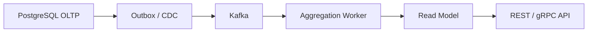
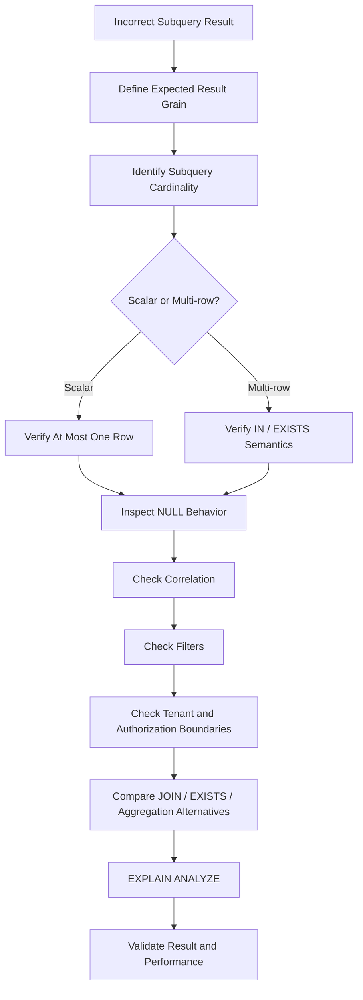

# 08- Subquery Problems

## Overview

Subqueries are powerful, but they introduce another layer of query semantics that can easily produce incorrect results or poor execution plans.

A subquery is a query nested inside another SQL statement:

```sql
SELECT ...
FROM ...
WHERE customer_id IN (
    SELECT customer_id
    FROM app.orders
);
```

Subqueries commonly appear in:

- `WHERE`
- `HAVING`
- `FROM`
- `SELECT`
- `INSERT`
- `UPDATE`
- `DELETE`
- `EXISTS`
- `IN`
- `NOT EXISTS`
- `NOT IN`
- Scalar expressions
- Common table expressions and derived relations

The most common problems are not syntax errors. They are semantic mistakes such as:

- Using `=` when a subquery can return multiple rows.
- Using `NOT IN` with nullable data.
- Accidentally creating correlated subqueries that execute repeatedly.
- Returning the wrong result grain.
- Using a subquery where a join or `EXISTS` better represents the requirement.
- Aggregating at the wrong level.
- Applying filters at the wrong query level.
- Assuming a subquery always executes once per outer row.
- Returning inconsistent results because the subquery is not deterministic.
- Creating expensive nested-loop behavior on large datasets.

The key principle is:

> **Choose a subquery pattern based on the relationship and business question, not merely because the SQL is valid.**

---

## Subquery Types

Subqueries can be classified by how they relate to the outer query.

| Type | Relationship to outer query | Common use |
|---|---|---|
| Uncorrelated subquery | Independent of outer row | `IN`, scalar lookup, derived data |
| Correlated subquery | References outer query | Per-row existence or lookup |
| Scalar subquery | Expected to return one value | Latest timestamp, configuration value |
| Multi-row subquery | Returns multiple values | `IN`, `ANY`, `ALL` |
| `EXISTS` subquery | Tests existence | Authorization, relationship checks |
| `NOT EXISTS` subquery | Tests absence | Anti-joins |
| Derived table | Subquery in `FROM` | Pre-aggregation |
| Subquery in `SELECT` | Calculates a value per result row | Related metrics |

Understanding the expected cardinality of a subquery is critical.

---

## Uncorrelated Subqueries

An uncorrelated subquery does not reference the outer query.

Example:

```sql
SELECT
    id,
    name
FROM app.customers
WHERE id IN (
    SELECT customer_id
    FROM app.orders
    WHERE status = 'completed'
);
```

The inner query can be evaluated independently:

```sql
SELECT customer_id
FROM app.orders
WHERE status = 'completed';
```

The outer query then uses those values.

This is useful when the requirement naturally reads as:

```text
Customers whose IDs belong to the set of customers having completed orders.
```

The optimizer may transform the query internally, so do not assume the database literally materializes the subquery first.

---

## Correlated Subqueries

A correlated subquery references a column from the outer query.

Example:

```sql
SELECT
    c.id,
    c.name
FROM app.customers AS c
WHERE EXISTS (
    SELECT 1
    FROM app.orders AS o
    WHERE o.customer_id = c.id
      AND o.status = 'completed'
);
```

The inner query refers to:

```text
c.id
```

from the outer query.

Conceptually:

```text
Customer 100 → Does order exist?
Customer 101 → Does order exist?
Customer 102 → Does order exist?
```

The important point is that this is a **logical correlation**. It does not necessarily mean PostgreSQL physically executes the inner query from scratch once per outer row.

The optimizer can transform suitable correlated subqueries into joins or semi-join plans.

---

## EXISTS for Existence Checks

If the requirement is:

> Find customers who have at least one completed order.

Prefer:

```sql
SELECT
    c.id,
    c.name
FROM app.customers AS c
WHERE EXISTS (
    SELECT 1
    FROM app.orders AS o
    WHERE o.customer_id = c.id
      AND o.status = 'completed'
);
```

The important semantics are:

```text
Return customer
if at least one matching order exists.
```

You do not need to retrieve every order row.

---

## JOIN vs EXISTS

A join:

```sql
SELECT
    c.id,
    c.name
FROM app.customers AS c
JOIN app.orders AS o
    ON o.customer_id = c.id
WHERE o.status = 'completed';
```

can produce multiple rows for a customer with multiple completed orders.

`EXISTS` naturally preserves customer grain:

```sql
SELECT
    c.id,
    c.name
FROM app.customers AS c
WHERE EXISTS (
    SELECT 1
    FROM app.orders AS o
    WHERE o.customer_id = c.id
      AND o.status = 'completed'
);
```

Use `JOIN` when related rows are part of the result.

Use `EXISTS` when existence is the actual requirement.

---

## NOT EXISTS for Absence

To find customers with no completed orders:

```sql
SELECT
    c.id,
    c.name
FROM app.customers AS c
WHERE NOT EXISTS (
    SELECT 1
    FROM app.orders AS o
    WHERE o.customer_id = c.id
      AND o.status = 'completed'
);
```

This expresses:

```text
There must not exist a matching order.
```

It is generally easier to reason about than manually reconstructing the same logic through nullable outer-join columns.

---

## NOT IN and NULL Problems

One of the most dangerous subquery patterns is:

```sql
WHERE customer_id NOT IN (
    SELECT customer_id
    FROM app.orders
)
```

If the subquery contains `NULL`, SQL's three-valued logic can produce unexpected results.

For example:

```text
100
101
NULL
```

can cause the `NOT IN` predicate to evaluate to `UNKNOWN` for candidate values not matching the non-null entries.

This can result in missing rows.

Prefer:

```sql
WHERE NOT EXISTS (
    SELECT 1
    FROM app.orders AS o
    WHERE o.customer_id = c.id
)
```

when expressing relational absence.

---

## IN vs EXISTS

Both can express membership or relationship conditions.

### IN

```sql
SELECT *
FROM app.customers
WHERE id IN (
    SELECT customer_id
    FROM app.orders
    WHERE status = 'completed'
);
```

### EXISTS

```sql
SELECT *
FROM app.customers AS c
WHERE EXISTS (
    SELECT 1
    FROM app.orders AS o
    WHERE o.customer_id = c.id
      AND o.status = 'completed'
);
```

Neither is universally faster.

The correct choice depends on:

- Query semantics
- Nullability
- Cardinality
- Indexes
- Statistics
- Data distribution
- Execution plan

Prefer the form that clearly expresses the requirement, then validate performance with `EXPLAIN`.

---

## Scalar Subqueries

A scalar subquery is expected to return exactly one value.

Example:

```sql
SELECT
    c.id,
    (
        SELECT MAX(o.created_at)
        FROM app.orders AS o
        WHERE o.customer_id = c.id
    ) AS latest_order_at
FROM app.customers AS c;
```

The aggregate guarantees one scalar result for each customer.

Scalar subqueries are useful for:

- Single related values
- Aggregates
- Configuration lookups
- Derived attributes

But they can become expensive when used carelessly for large result sets.

---

## Scalar Subquery Returning Multiple Rows

This is a common runtime error:

```sql
SELECT
    c.id,
    (
        SELECT o.status
        FROM app.orders AS o
        WHERE o.customer_id = c.id
    ) AS status
FROM app.customers AS c;
```

If a customer has multiple orders, the subquery returns multiple rows.

A scalar subquery requires at most one row.

The correct solution depends on the requirement.

For the latest order:

```sql
SELECT
    c.id,
    (
        SELECT o.status
        FROM app.orders AS o
        WHERE o.customer_id = c.id
        ORDER BY o.created_at DESC, o.id DESC
        LIMIT 1
    ) AS latest_order_status
FROM app.customers AS c;
```

The ordering defines which row should be selected.

---

## LIMIT 1 Is Not a General Fix

This:

```sql
LIMIT 1
```

can technically force a scalar subquery to return one row, but it does not automatically make the query correct.

Bad:

```sql
SELECT
    (
        SELECT status
        FROM app.orders
        WHERE customer_id = c.id
        LIMIT 1
    )
FROM app.customers AS c;
```

Which order should be selected?

The answer is undefined from the business perspective.

Better:

```sql
SELECT
    (
        SELECT status
        FROM app.orders AS o
        WHERE o.customer_id = c.id
        ORDER BY o.created_at DESC, o.id DESC
        LIMIT 1
    )
FROM app.customers AS c;
```

Now the requirement is:

```text
latest order status
```

rather than:

```text
some order status
```

---

## Subquery in SELECT vs JOIN

Consider:

```sql
SELECT
    c.id,
    (
        SELECT COUNT(*)
        FROM app.orders AS o
        WHERE o.customer_id = c.id
    ) AS order_count
FROM app.customers AS c;
```

This clearly expresses the requirement:

```text
one row per customer
+
order count
```

An equivalent grouped query is:

```sql
SELECT
    c.id,
    COUNT(o.id) AS order_count
FROM app.customers AS c
LEFT JOIN app.orders AS o
    ON o.customer_id = c.id
GROUP BY c.id;
```

Both can be valid.

The better option depends on:

- Number of customers
- Number of orders
- Indexes
- Query plan
- Additional metrics
- Result grain

Do not rewrite subqueries into joins mechanically.

---

## Derived Tables

A subquery in `FROM` creates a derived relation.

Example:

```sql
SELECT
    customer_id,
    order_count
FROM (
    SELECT
        customer_id,
        COUNT(*) AS order_count
    FROM app.orders
    GROUP BY customer_id
) AS order_summary;
```

The inner query produces:

```text
one row per customer
```

The outer query can then treat it as a relation.

This is especially useful for:

- Pre-aggregation
- Filtering aggregated results
- Isolating query stages
- Controlling result grain

---

## Pre-Aggregation With Derived Tables

Suppose the application needs:

```text
customer
order count
payment total
```

Joining raw orders and payments can multiply rows.

Instead:

```sql
SELECT
    c.id,
    COALESCE(o.order_count, 0) AS order_count,
    COALESCE(p.payment_total, 0) AS payment_total
FROM app.customers AS c
LEFT JOIN (
    SELECT
        customer_id,
        COUNT(*) AS order_count
    FROM app.orders
    GROUP BY customer_id
) AS o
    ON o.customer_id = c.id
LEFT JOIN (
    SELECT
        customer_id,
        SUM(amount) AS payment_total
    FROM app.payments
    GROUP BY customer_id
) AS p
    ON p.customer_id = c.id;
```

Each subquery establishes:

```text
one row per customer
```

before the final join.

This prevents independent one-to-many relationships from multiplying each other's metrics.

---

## Subquery in HAVING

Subqueries can be used to compare group-level metrics.

Example:

```sql
SELECT
    customer_id,
    SUM(total_amount) AS revenue
FROM app.orders
GROUP BY customer_id
HAVING SUM(total_amount) > (
    SELECT AVG(customer_revenue)
    FROM (
        SELECT
            customer_id,
            SUM(total_amount) AS customer_revenue
        FROM app.orders
        GROUP BY customer_id
    ) AS customer_totals
);
```

This identifies customers whose revenue is above the average customer revenue.

For complex analytical logic, a CTE can sometimes make the stages easier to understand and test.

---

## CTEs and Subqueries

A common table expression:

```sql
WITH customer_totals AS (
    SELECT
        customer_id,
        SUM(total_amount) AS revenue
    FROM app.orders
    GROUP BY customer_id
)
SELECT *
FROM customer_totals
WHERE revenue > 10000;
```

is conceptually similar to a derived table but can make multi-stage SQL more readable.

CTEs are useful for:

- Naming intermediate relations
- Complex transformations
- Recursive queries
- Pre-aggregation
- Multi-stage reporting logic

Do not assume a CTE is always materialized or always faster. PostgreSQL can inline suitable CTEs, while explicit materialization can also be requested when appropriate.

---

## Correlated Subquery Performance

Consider:

```sql
SELECT
    c.id,
    (
        SELECT COUNT(*)
        FROM app.orders AS o
        WHERE o.customer_id = c.id
    ) AS order_count
FROM app.customers AS c;
```

Logically, this calculates an order count for every customer.

With a large customer table, performance depends heavily on the plan and available indexes.

An index such as:

```sql
CREATE INDEX orders_customer_id_idx
ON app.orders (customer_id);
```

can be important.

However, the existence of an index does not guarantee the best plan.

Compare the actual execution plan:

```sql
EXPLAIN (ANALYZE, BUFFERS)
SELECT
    c.id,
    (
        SELECT COUNT(*)
        FROM app.orders AS o
        WHERE o.customer_id = c.id
    ) AS order_count
FROM app.customers AS c;
```

Then compare with the grouped form.

---

## Correlation Does Not Automatically Mean N Queries

A common misconception is:

> "A correlated subquery always runs once per outer row."

That is a useful mental model for understanding semantics, but not a reliable description of PostgreSQL's physical execution.

The optimizer can transform suitable subqueries into:

- Semi joins
- Anti joins
- Hash-based strategies
- Nested loops
- Other equivalent execution plans

Always inspect:

```sql
EXPLAIN
```

rather than assuming execution behavior from SQL syntax alone.

---

## Subquery and JOIN Equivalence

Some queries can be expressed using either a subquery or a join.

Example:

```sql
SELECT *
FROM app.customers AS c
WHERE EXISTS (
    SELECT 1
    FROM app.orders AS o
    WHERE o.customer_id = c.id
);
```

can often be represented as a semi-join conceptually.

The choice should prioritize:

```text
Correct semantics
Readability
Result grain
Null behavior
Optimizer flexibility
Performance
```

SQL style rules such as:

```text
"Always use JOIN"
```

or:

```text
"Subqueries are always slow"
```

are poor engineering heuristics.

---

## Subquery Returning Duplicate Values

A subquery used with `IN` can return duplicates:

```sql
WHERE c.id IN (
    SELECT o.customer_id
    FROM app.orders AS o
)
```

If a customer has many orders, the inner query may contain:

```text
100
100
100
101
101
```

This is still logically valid for `IN`.

The membership test does not require unique values.

Adding:

```sql
SELECT DISTINCT customer_id
```

may be unnecessary unless it changes the plan or serves another semantic purpose.

Do not add `DISTINCT` automatically.

---

## Subquery With Incorrect Filtering

Consider:

```sql
SELECT
    c.id
FROM app.customers AS c
WHERE c.id IN (
    SELECT o.customer_id
    FROM app.orders AS o
);
```

If the requirement is:

```text
Customers with completed orders
```

the subquery must include:

```sql
WHERE o.status = 'completed'
```

Otherwise, cancelled or pending orders also qualify.

The query can be syntactically perfect while violating the business requirement.

---

## Correlated Subquery and Tenant Isolation

Multi-tenant queries must preserve tenant boundaries.

Potentially unsafe:

```sql
SELECT
    c.id,
    (
        SELECT COUNT(*)
        FROM app.orders AS o
        WHERE o.customer_id = c.id
    ) AS order_count
FROM app.customers AS c;
```

If the relationship is tenant-scoped, include the complete relationship:

```sql
SELECT
    c.id,
    (
        SELECT COUNT(*)
        FROM app.orders AS o
        WHERE o.tenant_id = c.tenant_id
          AND o.customer_id = c.id
    ) AS order_count
FROM app.customers AS c;
```

For security-sensitive systems, also account for PostgreSQL RLS and application authorization.

A subquery is not exempt from tenant isolation rules.

---

## Subqueries and NULL

NULL semantics apply inside subqueries just as they do elsewhere.

Potentially dangerous:

```sql
WHERE c.id NOT IN (
    SELECT o.customer_id
    FROM app.orders AS o
)
```

If `o.customer_id` can be NULL, the result can be surprising.

A safer relational formulation is:

```sql
WHERE NOT EXISTS (
    SELECT 1
    FROM app.orders AS o
    WHERE o.customer_id = c.id
)
```

When troubleshooting subquery results, always inspect nullable columns participating in:

```text
IN
NOT IN
comparisons
JOIN predicates
```

---

## Subqueries and Aggregation

Consider:

```sql
SELECT
    c.id
FROM app.customers AS c
WHERE (
    SELECT COUNT(*)
    FROM app.orders AS o
    WHERE o.customer_id = c.id
) >= 10;
```

This asks:

```text
Does this customer have at least ten orders?
```

An equivalent aggregation approach is:

```sql
SELECT
    customer_id
FROM app.orders
GROUP BY customer_id
HAVING COUNT(*) >= 10;
```

The best form depends on what other customer attributes and relationships the outer query needs.

---

## Subqueries and Latest-Row Problems

A common requirement is:

> Find each customer's latest order.

A problematic approach is:

```sql
SELECT
    c.id,
    (
        SELECT MAX(o.created_at)
        FROM app.orders AS o
        WHERE o.customer_id = c.id
    ) AS latest_order_at
FROM app.customers AS c;
```

This correctly finds the timestamp, but not the complete order.

If the API also needs:

```text
order ID
status
total amount
```

use a deterministic row-selection strategy.

For PostgreSQL:

```sql
SELECT DISTINCT ON (customer_id)
    customer_id,
    id,
    status,
    total_amount,
    created_at
FROM app.orders
ORDER BY
    customer_id,
    created_at DESC,
    id DESC;
```

Then join that result to customers.

---

## Subqueries in UPDATE

Subqueries can be useful for data corrections and bulk updates.

Example:

```sql
UPDATE app.customers AS c
SET has_orders = EXISTS (
    SELECT 1
    FROM app.orders AS o
    WHERE o.customer_id = c.id
);
```

This expresses:

```text
Set customer flag based on whether a related order exists.
```

However, storing derived state introduces consistency responsibilities.

If `has_orders` is derived from orders, consider whether it should instead be computed at read time or maintained through an event-driven/materialized model.

---

## Subqueries in DELETE

Example:

```sql
DELETE FROM app.customers AS c
WHERE NOT EXISTS (
    SELECT 1
    FROM app.orders AS o
    WHERE o.customer_id = c.id
);
```

This can be useful, but production deletes require careful consideration of:

- Foreign keys
- Cascades
- Audit requirements
- Soft deletion
- Lock duration
- Batch size
- Transaction duration
- Replication impact
- Recovery requirements

For large tables, do not assume one massive `DELETE` is operationally safe.

---

## Subqueries and Data Modification Safety

Before executing:

```sql
UPDATE ...
WHERE ...
```

or:

```sql
DELETE ...
WHERE ...
```

with a subquery, first run the equivalent `SELECT`.

Example:

```sql
SELECT c.id
FROM app.customers AS c
WHERE NOT EXISTS (
    SELECT 1
    FROM app.orders AS o
    WHERE o.customer_id = c.id
);
```

Validate:

```text
row count
sample IDs
tenant boundaries
business conditions
```

Then perform the modification inside an appropriately scoped transaction.

---

## Subquery Problems in ORMs

Django and SQLAlchemy can generate subqueries from high-level expressions.

Django example:

```python
from django.db.models import Exists, OuterRef

completed_orders = Order.objects.filter(
    customer_id=OuterRef("pk"),
    status="completed",
)

customers = Customer.objects.filter(
    Exists(completed_orders),
)
```

This is often an excellent representation of existence semantics.

Django can also generate scalar subqueries:

```python
from django.db.models import OuterRef, Subquery

latest_order = Order.objects.filter(
    customer_id=OuterRef("pk"),
).order_by(
    "-created_at",
    "-id",
)

customers = Customer.objects.annotate(
    latest_order_status=Subquery(
        latest_order.values("status")[:1]
    )
)
```

The `[:1]` limits the scalar subquery to one row, while the ordering defines which row is selected.

---

## ORM N+1 vs SQL Subqueries

A subquery inside SQL is not the same as issuing separate database queries from Python.

Bad application pattern:

```python
for customer in customers:
    customer.orders.count()
```

This can create:

```text
1 query for customers
+
N queries for orders
```

A SQL subquery or annotation can keep the work inside the database.

However, keeping everything in one SQL statement is not automatically better.

The correct comparison is:

```text
Application-level N+1
vs
Single SQL statement
vs
Prefetching
vs
Precomputed read model
```

Measure actual production behavior.

---

## Subqueries and REST APIs

Suppose:

```http
GET /customers
```

requires:

```json
[
  {
    "id": 100,
    "order_count": 42,
    "has_completed_order": true
  }
]
```

A single query can calculate these values:

```sql
SELECT
    c.id,
    (
        SELECT COUNT(*)
        FROM app.orders AS o
        WHERE o.customer_id = c.id
    ) AS order_count,
    EXISTS (
        SELECT 1
        FROM app.orders AS o
        WHERE o.customer_id = c.id
          AND o.status = 'completed'
    ) AS has_completed_order
FROM app.customers AS c;
```

This keeps the result at:

```text
one row per customer
```

and avoids application-side N+1 queries.

For very large datasets, precomputed metrics or dedicated read models may still be preferable.

---

## Subqueries and Pagination

If the outer query is paginated:

```sql
SELECT
    c.id,
    (
        SELECT COUNT(*)
        FROM app.orders AS o
        WHERE o.customer_id = c.id
    ) AS order_count
FROM app.customers AS c
ORDER BY c.id
LIMIT 50;
```

the outer result contains:

```text
50 customers
```

and each customer receives its metric.

This is different from paginating the orders before aggregation.

Always determine:

```text
What relation is being paginated?
What relation is being aggregated?
What is the API result grain?
```

---

## Query Plans for Subqueries

Use:

```sql
EXPLAIN
```

to understand how PostgreSQL executes the query.

For controlled diagnostics:

```sql
EXPLAIN (ANALYZE, BUFFERS)
SELECT
    c.id,
    (
        SELECT COUNT(*)
        FROM app.orders AS o
        WHERE o.customer_id = c.id
    ) AS order_count
FROM app.customers AS c;
```

Look for:

- Nested loops
- Index scans
- Sequential scans
- Actual rows
- Loops
- SubPlan nodes
- InitPlan nodes
- Buffer activity
- Execution time

A correlated scalar subquery may appear as a `SubPlan`.

An uncorrelated scalar subquery may appear as an `InitPlan`.

The exact plan depends on the query and PostgreSQL version.

---

## SubPlan and InitPlan

PostgreSQL execution plans can expose internal subquery strategies.

Conceptually:

```text
InitPlan
→ executed once or in a way independent of outer rows

SubPlan
→ associated with an expression evaluated as part of the outer plan
```

Do not interpret these labels as rigid guarantees about the number of physical executions in every situation.

Use:

```text
EXPLAIN ANALYZE
```

and inspect:

```text
loops
actual rows
execution time
```

to understand what actually happened.

---

## Subquery Performance Problems

Common causes include:

- Missing indexes on correlated predicates.
- High outer-row cardinality.
- Expensive aggregates per outer row.
- Large intermediate results.
- Poor cardinality estimates.
- Correlation preventing an efficient plan.
- Repeated scans of large relations.
- Complex nested subqueries.
- Excessive sorting.
- Memory or I/O pressure.

Do not assume the solution is always:

```text
replace subquery with JOIN
```

Instead compare equivalent formulations.

---

## Indexing Correlated Subqueries

For:

```sql
SELECT
    c.id,
    (
        SELECT COUNT(*)
        FROM app.orders AS o
        WHERE o.customer_id = c.id
    )
FROM app.customers AS c;
```

an index such as:

```sql
CREATE INDEX orders_customer_id_idx
ON app.orders (customer_id);
```

can support efficient lookup by customer.

If the predicate includes additional conditions:

```sql
WHERE o.customer_id = c.id
  AND o.status = 'completed'
```

the appropriate index may differ.

For example:

```sql
CREATE INDEX orders_customer_status_idx
ON app.orders (customer_id, status);
```

Do not add indexes without validating the workload and execution plan.

---

## Subqueries and Query Optimization

Optimization should follow this order:

```text
Correctness
    ↓
Result grain
    ↓
Cardinality
    ↓
Query shape
    ↓
Indexes
    ↓
Execution plan
    ↓
Resource usage
```

A subquery that produces correct results but takes too long is a performance problem.

A subquery that is fast but returns incorrect data is a correctness problem.

Never optimize the wrong result.

---

## Subqueries and Security

Subqueries can participate directly in authorization logic.

Example:

```sql
SELECT
    d.id,
    d.name
FROM app.documents AS d
WHERE EXISTS (
    SELECT 1
    FROM app.document_members AS dm
    WHERE dm.document_id = d.id
      AND dm.user_id = $1
      AND dm.status = 'active'
);
```

This expresses:

```text
Return document only if the user has an active membership.
```

Security-sensitive subqueries should verify:

- Tenant boundaries
- User identity
- Membership status
- Resource ownership
- RLS
- Soft deletion
- Revocation state

Do not assume a subquery is secure merely because it is hidden inside another query.

---

## Authorization and NOT EXISTS

Negative authorization checks require special care.

For example:

```sql
WHERE NOT EXISTS (
    SELECT 1
    FROM app.blocked_users AS b
    WHERE b.user_id = u.id
)
```

means:

```text
No blocking record exists.
```

If the application has multiple exclusion sources:

```text
blocked user
revoked membership
disabled tenant
expired permission
```

all relevant conditions must be considered.

Security logic should be tested with both:

```text
allowed
denied
```

cases.

---

## Subqueries and Microservices

In a microservice architecture, avoid using subqueries to cross service boundaries.

A SQL subquery operates inside the same database system.

It cannot safely represent:

```text
Service A PostgreSQL
        +
Service B PostgreSQL
```

without introducing a distributed data architecture.

Instead use:

```text
API composition
Events
Kafka
Read models
CDC
Data warehouse
```

depending on consistency requirements.

Database ownership boundaries should remain explicit.

---

## Subqueries and Redis

Redis can reduce repeated expensive query work when data is cacheable.

For example:

```text
API
 ↓
Redis cache
 ↓ miss
PostgreSQL query with subqueries
 ↓
Redis
```

Do not move every subquery result into Redis.

Caching introduces:

- Staleness
- Invalidation
- Stampedes
- Memory cost
- Consistency trade-offs

Use caching for stable, expensive, frequently requested results where the consistency model is acceptable.

---

## Subqueries and Kafka/Celery

Expensive recurring aggregation can be moved from request time into asynchronous processing.

Example:



This is useful when:

```text
The metric is expensive
The metric does not need real-time precision
Read latency matters
The workload is predictable
```

However, the resulting read model becomes eventually consistent.

Critical metrics should have reconciliation and backfill strategies.

---

## Production Troubleshooting Workflow

Use this sequence:



When debugging:

1. Run the inner query independently.
2. Inspect its row count and NULL values.
3. Determine whether it should return zero, one, or many rows.
4. Check references to outer columns.
5. Validate filters and join conditions.
6. Compare the subquery against an equivalent join or aggregation where useful.
7. Inspect the execution plan.
8. Test against known edge cases.

---

## Common Mistakes

### Using `=` With a Multi-Row Subquery

Incorrect:

```sql
WHERE customer_id = (
    SELECT customer_id
    FROM app.orders
)
```

If multiple rows are returned, the query fails.

Use:

```sql
IN
```

or:

```sql
EXISTS
```

depending on the requirement.

### Using NOT IN With Nullable Data

Potentially incorrect:

```sql
WHERE id NOT IN (
    SELECT customer_id
    FROM orders
)
```

Use `NOT EXISTS` for robust absence semantics.

### Assuming Correlated Means N Physical Queries

The optimizer can transform correlated subqueries.

Use `EXPLAIN ANALYZE` to determine actual execution behavior.

### Using LIMIT 1 Without Ordering

This chooses an arbitrary matching row from a business perspective.

Use deterministic ordering.

### Using MAX to Retrieve Another Column

`MAX(created_at)` does not automatically identify the corresponding status or ID.

Use `DISTINCT ON`, `ROW_NUMBER()`, or another deterministic row-selection strategy.

### Replacing Every Subquery With a JOIN

A join can change result grain and introduce duplicate rows.

Use the relational construct that matches the requirement.

### Adding DISTINCT Automatically

Duplicates inside an `IN` subquery generally do not change membership semantics.

Do not add unnecessary `DISTINCT` without evidence.

### Ignoring NULL

Subqueries inherit SQL's three-valued logic.

Check nullable columns in:

```text
IN
NOT IN
comparisons
```

### Ignoring Tenant Context

A correlated subquery must preserve the same tenant boundary as the outer query.

### Assuming One SQL Statement Is Always Better

A large query can become difficult to optimize and operate.

Sometimes separate queries, precomputed read models, or OLAP systems are the better architecture.

---

## Interview Traps

### "What is the difference between EXISTS and IN?"

`IN` tests whether a value belongs to a set returned by a subquery. `EXISTS` tests whether at least one matching row exists. Both can often express similar requirements, but their NULL semantics and optimization opportunities differ.

### "Why is NOT IN dangerous with NULL?"

If the subquery contains NULL, comparisons can evaluate to `UNKNOWN`, causing expected rows to be excluded. `NOT EXISTS` avoids this particular NULL trap.

### "Does a correlated subquery always execute once for every outer row?"

No. Correlation describes a logical dependency. PostgreSQL's optimizer can transform suitable subqueries into other execution strategies.

### "When should you use a scalar subquery?"

When the expression logically requires one value per outer row and the subquery is guaranteed or constrained to return at most one row.

### "Why is LIMIT 1 not enough?"

Because it limits cardinality without necessarily defining which row represents the business requirement. Deterministic ordering or a uniqueness constraint may be required.

### "Are subqueries slower than JOINs?"

Not inherently. Performance depends on query shape, optimizer transformations, indexes, cardinality, statistics, and data distribution.

### "How do you debug a subquery returning unexpected results?"

Run the inner query independently, inspect its cardinality and NULL behavior, verify correlation and predicates, compare equivalent relational formulations, and inspect the execution plan.

---

## Senior-Level Heuristic

When troubleshooting a subquery, answer these questions:

```text
What is the business question?
        ↓
What is the expected result grain?
        ↓
Should the subquery return:
    zero rows?
    one row?
    many rows?
        ↓
Is it correlated?
        ↓
Are NULL values possible?
        ↓
Is this existence, membership, aggregation, or row selection?
        ↓
Are filters applied at the correct level?
        ↓
Are tenant and authorization boundaries preserved?
        ↓
Would JOIN, EXISTS, aggregation, or pre-aggregation express
the requirement more clearly?
        ↓
What does EXPLAIN ANALYZE show?
```

Senior SQL development requires understanding that subqueries are not merely syntax variations.

They are different ways of expressing relational operations.

The right question is not:

```text
"Can I write this as a subquery?"
```

It is:

```text
"What relational operation does the business requirement actually need?"
```

---

## Production Checklist

### Semantics

- [ ] Define the expected result grain.
- [ ] Identify whether the subquery is scalar or multi-row.
- [ ] Verify whether zero rows are valid.
- [ ] Verify whether multiple rows are valid.
- [ ] Confirm the business meaning of the subquery.

### NULL

- [ ] Check nullable columns.
- [ ] Avoid `NOT IN` when nullable data can affect semantics.
- [ ] Use `IS NULL` / `IS NOT NULL` where appropriate.
- [ ] Understand NULL behavior in comparisons.

### Correlation

- [ ] Identify outer-query references.
- [ ] Verify correlated predicates.
- [ ] Include tenant boundaries where required.
- [ ] Check for missing authorization conditions.

### Query Design

- [ ] Use `EXISTS` for existence.
- [ ] Use `NOT EXISTS` for absence.
- [ ] Use `IN` for membership where appropriate.
- [ ] Use scalar subqueries only when one value is required.
- [ ] Use deterministic ordering with `LIMIT 1`.
- [ ] Pre-aggregate independent one-to-many relationships when needed.

### Application

- [ ] Inspect generated Django SQL.
- [ ] Verify Django `Subquery` and `Exists` semantics.
- [ ] Inspect SQLAlchemy-generated SQL.
- [ ] Avoid application-level N+1 queries.
- [ ] Ensure API result grain matches the query.

### Security

- [ ] Verify tenant isolation.
- [ ] Verify authorization predicates.
- [ ] Check active/revoked relationships.
- [ ] Validate RLS behavior.
- [ ] Test both authorized and unauthorized cases.

### Performance

- [ ] Use `EXPLAIN`.
- [ ] Use `EXPLAIN (ANALYZE, BUFFERS)` for controlled diagnostics.
- [ ] Inspect actual rows and loops.
- [ ] Check indexes supporting correlated predicates.
- [ ] Compare equivalent query formulations.
- [ ] Watch for expensive repeated aggregation.
- [ ] Consider materialized aggregates or OLAP for recurring large analytical workloads.

### Reliability

- [ ] Test zero-row subquery cases.
- [ ] Test one-row cases.
- [ ] Test multi-row cases.
- [ ] Test NULL cases.
- [ ] Test large datasets.
- [ ] Add regression tests for critical business queries.
- [ ] Reconcile asynchronous or precomputed aggregates against source data.

## Key Takeaways

- **Choose subqueries by semantics and cardinality:** know whether the inner query should return zero, one, or many rows before selecting `=`, `IN`, `EXISTS`, or a scalar subquery.
- **Prefer `EXISTS` and `NOT EXISTS` for relationship existence:** they naturally express existence and avoid the major NULL trap associated with `NOT IN`.
- **Correlation is logical, not necessarily physical repetition:** PostgreSQL can transform correlated subqueries, so use `EXPLAIN ANALYZE` rather than assuming an N-query execution model.
- **Do not hide row-selection problems with `LIMIT 1`:** define deterministic ordering or enforce uniqueness when exactly one related record is required.
- **Treat subqueries as part of the complete production design:** validate result grain, tenant/security boundaries, ORM-generated SQL, execution plans, API behavior, and scalability before choosing between subqueries, joins, aggregation, or precomputed read models.