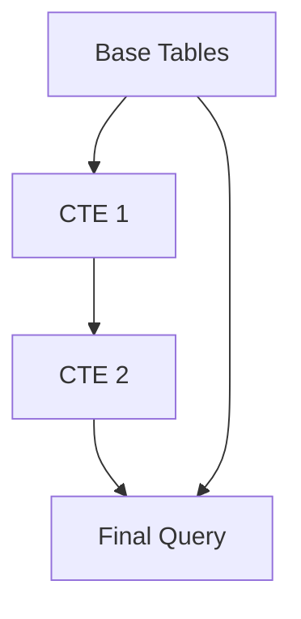
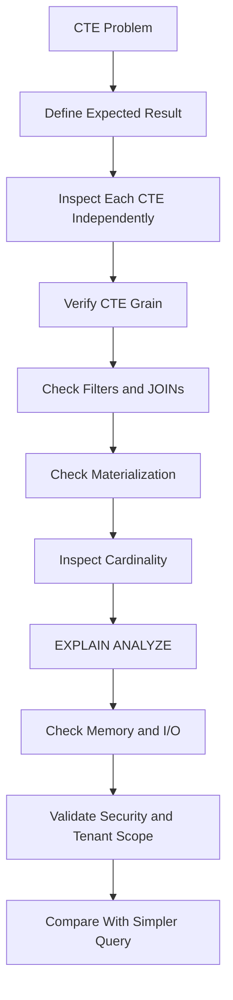

# 09- CTE Problems

## Overview

Common Table Expressions (CTEs) provide a named intermediate query result using the `WITH` clause.

They are useful for:

- Breaking complex SQL into logical stages.
- Pre-aggregating data before joins.
- Reusing intermediate relations.
- Writing recursive queries.
- Structuring data modification statements.
- Improving readability of complex reporting queries.

Example:

```sql
WITH customer_totals AS (
    SELECT
        customer_id,
        COUNT(*) AS order_count,
        SUM(total_amount) AS revenue
    FROM app.orders
    GROUP BY customer_id
)
SELECT
    c.id,
    c.name,
    COALESCE(ct.order_count, 0) AS order_count,
    COALESCE(ct.revenue, 0) AS revenue
FROM app.customers AS c
LEFT JOIN customer_totals AS ct
    ON ct.customer_id = c.id;
```

The CTE establishes an intermediate relation:

```text
orders
  ↓
aggregate by customer
  ↓
customer_totals
  ↓
join with customers
  ↓
API/report result
```

CTEs are primarily a **query-structuring mechanism**, not automatically a performance optimization.

A major troubleshooting mistake is assuming:

> "The CTE runs first and stores its results."

That is not generally how modern PostgreSQL executes every CTE.

---

## CTE Mental Model

A CTE gives a complex query a named relational stage.



For example:

```sql
WITH recent_orders AS (
    SELECT *
    FROM app.orders
    WHERE created_at >= CURRENT_DATE - INTERVAL '30 days'
),
customer_totals AS (
    SELECT
        customer_id,
        SUM(total_amount) AS revenue
    FROM recent_orders
    GROUP BY customer_id
)
SELECT *
FROM customer_totals
WHERE revenue >= 10000;
```

Conceptually:

```text
orders
  ↓
recent_orders
  ↓
customer_totals
  ↓
final filter
```

The important distinction is between:

```text
logical query structure
```

and:

```text
physical execution plan
```

The SQL describes the former.

The optimizer determines the latter.

---

## Why CTEs Exist

CTEs solve several engineering problems.

### Readability

Instead of one deeply nested statement:

```sql
SELECT ...
FROM (
    SELECT ...
    FROM (
        SELECT ...
    ) AS x
) AS y;
```

you can name each stage:

```sql
WITH base_data AS (...),
     aggregated_data AS (...)
SELECT ...
FROM aggregated_data;
```

### Controlled Query Structure

CTEs make it easier to express:

```text
filter
→ transform
→ aggregate
→ join
→ filter again
```

### Recursive Queries

Recursive CTEs support hierarchical data such as:

```text
organization
→ departments
→ teams
→ employees
```

### Data Modification

PostgreSQL supports data-modifying statements inside CTEs, which can be useful for coordinated operations.

---

## CTE vs Subquery

A derived subquery:

```sql
SELECT *
FROM (
    SELECT
        customer_id,
        COUNT(*) AS order_count
    FROM app.orders
    GROUP BY customer_id
) AS customer_totals;
```

can often be expressed as:

```sql
WITH customer_totals AS (
    SELECT
        customer_id,
        COUNT(*) AS order_count
    FROM app.orders
    GROUP BY customer_id
)
SELECT *
FROM customer_totals;
```

The important difference is usually **structure and readability**, not an assumption that one is automatically faster.

| Technique | Typical strength |
|---|---|
| Subquery | Local, compact transformation |
| CTE | Named multi-stage query |
| `EXISTS` | Relationship existence |
| `JOIN` | Combining relations |
| Window function | Aggregate while preserving rows |
| Materialized view | Persisted/precomputed result |

---

## CTE Materialization

One of the most important PostgreSQL CTE concepts is materialization.

Modern PostgreSQL can inline suitable CTEs into the surrounding query instead of materializing them as a separate intermediate result.

You can explicitly request behavior:

```sql
WITH recent_orders AS MATERIALIZED (
    SELECT *
    FROM app.orders
    WHERE created_at >= CURRENT_DATE - INTERVAL '30 days'
)
SELECT *
FROM recent_orders
WHERE total_amount > 1000;
```

Or:

```sql
WITH recent_orders AS NOT MATERIALIZED (
    SELECT *
    FROM app.orders
    WHERE created_at >= CURRENT_DATE - INTERVAL '30 days'
)
SELECT *
FROM recent_orders
WHERE total_amount > 1000;
```

The choice matters because materialization can create an optimization boundary.

---

## MATERIALIZED

`MATERIALIZED` tells PostgreSQL to compute the CTE as a separate intermediate result.

Example:

```sql
WITH expensive_data AS MATERIALIZED (
    SELECT
        customer_id,
        expensive_expression
    FROM app.large_table
)
SELECT *
FROM expensive_data
WHERE customer_id = 100;
```

Potential advantages:

- Avoids recomputing the CTE when referenced multiple times.
- Can deliberately establish an optimization boundary.
- Can make a complex query's execution behavior more predictable.

Potential limitations:

- Can prevent useful predicate pushdown.
- Can create a large intermediate result.
- Can require additional memory or temporary I/O.
- Can make selective outer predicates less effective.

Do not use `MATERIALIZED` simply because the query contains a CTE.

---

## NOT MATERIALIZED

`NOT MATERIALIZED` allows PostgreSQL to treat the CTE more like an inline subquery where appropriate.

Example:

```sql
WITH recent_orders AS NOT MATERIALIZED (
    SELECT *
    FROM app.orders
    WHERE created_at >= CURRENT_DATE - INTERVAL '30 days'
)
SELECT *
FROM recent_orders
WHERE customer_id = 100;
```

This can allow outer restrictions to participate in optimization.

It is useful when:

- The CTE is referenced once.
- Predicate pushdown is valuable.
- The intermediate result would otherwise be unnecessarily large.

Again, the execution plan should determine whether it is beneficial.

---

## When CTE Materialization Can Hurt Performance

Consider:

```sql
WITH all_orders AS MATERIALIZED (
    SELECT *
    FROM app.orders
)
SELECT *
FROM all_orders
WHERE customer_id = 100;
```

If `orders` contains millions of rows but only a small fraction belongs to customer `100`, forcing the entire CTE to be materialized can be wasteful.

A direct query:

```sql
SELECT *
FROM app.orders
WHERE customer_id = 100;
```

allows PostgreSQL to use an appropriate index and avoid processing unrelated rows.

The problem is not "CTEs are slow."

The problem is:

```text
unnecessary optimization boundary
+
large intermediate result
```

---

## Predicate Pushdown

Suppose:

```sql
WITH order_data AS (
    SELECT *
    FROM app.orders
)
SELECT *
FROM order_data
WHERE customer_id = 100;
```

When the CTE is inlined, PostgreSQL can often effectively reason about:

```sql
SELECT *
FROM app.orders
WHERE customer_id = 100;
```

This is predicate pushdown or equivalent optimizer reasoning.

However, explicit materialization can prevent such transformations.

For performance troubleshooting, ask:

```text
Can the outer filter reach the base table?
```

---

## CTEs and Indexes

A CTE does not create an index.

This:

```sql
WITH recent_orders AS (
    SELECT *
    FROM app.orders
    WHERE created_at >= CURRENT_DATE - INTERVAL '7 days'
)
SELECT *
FROM recent_orders
WHERE customer_id = 100;
```

does not mean `recent_orders` has an index on `customer_id`.

Index availability comes from the underlying physical relations or explicitly created temporary structures.

If the query is slow, inspect:

```sql
EXPLAIN (ANALYZE, BUFFERS)
...
```

rather than assuming the CTE is indexed.

---

## CTEs and Result Grain

CTEs are especially useful for controlling result grain.

Suppose the requirement is:

```text
one row per customer
```

Create that grain explicitly:

```sql
WITH customer_orders AS (
    SELECT
        customer_id,
        COUNT(*) AS order_count
    FROM app.orders
    GROUP BY customer_id
)
SELECT
    c.id,
    c.name,
    COALESCE(co.order_count, 0) AS order_count
FROM app.customers AS c
LEFT JOIN customer_orders AS co
    ON co.customer_id = c.id;
```

The CTE guarantees:

```text
customer_orders
= one row per customer
```

This prevents later joins from accidentally treating raw order rows as customer-level data.

---

## CTEs for Preventing Aggregate Double Counting

Consider:

```text
customer
├── orders
└── payments
```

Joining both child relations directly can produce:

```text
orders × payments
```

per customer.

Instead:

```sql
WITH order_totals AS (
    SELECT
        customer_id,
        SUM(total_amount) AS order_revenue
    FROM app.orders
    GROUP BY customer_id
),
payment_totals AS (
    SELECT
        customer_id,
        SUM(amount) AS paid_amount
    FROM app.payments
    GROUP BY customer_id
)
SELECT
    c.id,
    COALESCE(o.order_revenue, 0) AS order_revenue,
    COALESCE(p.paid_amount, 0) AS paid_amount
FROM app.customers AS c
LEFT JOIN order_totals AS o
    ON o.customer_id = c.id
LEFT JOIN payment_totals AS p
    ON p.customer_id = c.id;
```

Each CTE establishes a stable grain before the final join.

---

## Multiple CTEs

Multiple CTEs are useful when each stage has a distinct responsibility.

```sql
WITH recent_orders AS (
    SELECT
        id,
        customer_id,
        total_amount,
        created_at
    FROM app.orders
    WHERE created_at >= CURRENT_DATE - INTERVAL '30 days'
),
customer_totals AS (
    SELECT
        customer_id,
        COUNT(*) AS order_count,
        SUM(total_amount) AS revenue
    FROM recent_orders
    GROUP BY customer_id
),
qualified_customers AS (
    SELECT
        customer_id,
        order_count,
        revenue
    FROM customer_totals
    WHERE revenue >= 10000
)
SELECT
    c.id,
    c.name,
    qc.order_count,
    qc.revenue
FROM app.customers AS c
JOIN qualified_customers AS qc
    ON qc.customer_id = c.id;
```

This structure is easier to troubleshoot because each relation has a clear purpose.

---

## CTE Problems Caused by Incorrect Grain

A CTE can be syntactically correct while establishing the wrong grain.

Incorrect:

```sql
WITH order_summary AS (
    SELECT
        customer_id,
        status,
        COUNT(*) AS order_count
    FROM app.orders
    GROUP BY
        customer_id,
        status
)
SELECT
    customer_id,
    SUM(order_count)
FROM order_summary
GROUP BY customer_id;
```

This may be correct if the intermediate status-level grouping is intentional.

But if the requirement is simply:

```text
one row per customer
```

the extra dimension adds unnecessary complexity.

Prefer:

```sql
WITH order_summary AS (
    SELECT
        customer_id,
        COUNT(*) AS order_count
    FROM app.orders
    GROUP BY customer_id
)
SELECT *
FROM order_summary;
```

Always document mentally:

```text
CTE grain = ?
```

before joining it elsewhere.

---

## CTEs and WHERE/HAVING

Consider:

```sql
WITH customer_totals AS (
    SELECT
        customer_id,
        SUM(total_amount) AS revenue
    FROM app.orders
    WHERE status = 'completed'
    GROUP BY customer_id
)
SELECT *
FROM customer_totals
WHERE revenue >= 10000;
```

The first filter:

```sql
WHERE status = 'completed'
```

controls source rows.

The second:

```sql
WHERE revenue >= 10000
```

operates on the already aggregated relation.

A CTE can therefore make query-stage boundaries explicit.

---

## CTEs and Window Functions

CTEs are useful when a window function produces an intermediate result that must then be filtered.

For example:

```sql
WITH ranked_orders AS (
    SELECT
        o.*,
        ROW_NUMBER() OVER (
            PARTITION BY customer_id
            ORDER BY created_at DESC, id DESC
        ) AS row_number
    FROM app.orders AS o
)
SELECT
    id,
    customer_id,
    status,
    created_at
FROM ranked_orders
WHERE row_number = 1;
```

This gives:

```text
one latest order per customer
```

The CTE makes the window-function result available to the outer query.

---

## CTEs for Latest-Row Problems

A common requirement is:

> Return the latest order for every customer.

One PostgreSQL-specific approach is:

```sql
WITH latest_orders AS (
    SELECT DISTINCT ON (customer_id)
        customer_id,
        id,
        status,
        total_amount,
        created_at
    FROM app.orders
    ORDER BY
        customer_id,
        created_at DESC,
        id DESC
)
SELECT
    c.id,
    c.name,
    lo.id AS latest_order_id,
    lo.status AS latest_order_status,
    lo.created_at AS latest_order_at
FROM app.customers AS c
LEFT JOIN latest_orders AS lo
    ON lo.customer_id = c.id;
```

The CTE establishes:

```text
one row per customer
```

before joining it to the customer relation.

---

## Recursive CTEs

Recursive CTEs are designed for hierarchical or graph-like traversal.

Example:

```sql
WITH RECURSIVE employee_tree AS (
    SELECT
        id,
        manager_id,
        name,
        0 AS depth
    FROM app.employees
    WHERE id = $1

    UNION ALL

    SELECT
        e.id,
        e.manager_id,
        e.name,
        et.depth + 1
    FROM app.employees AS e
    JOIN employee_tree AS et
        ON e.manager_id = et.id
)
SELECT
    id,
    manager_id,
    name,
    depth
FROM employee_tree
ORDER BY depth, id;
```

The recursive structure is:

```text
Starting employee
       ↓
Direct reports
       ↓
Their reports
       ↓
Continue until no more rows
```

Recursive CTEs are useful for:

- Organizational hierarchies
- Category trees
- Folder structures
- Dependency graphs
- Graph traversal

They require careful termination and cycle handling.

---

## Recursive CTE Cycle Problems

Bad hierarchical data can contain cycles:

```text
A → B
B → C
C → A
```

A naive recursive query can repeatedly traverse the cycle.

Production recursive queries should consider:

- Cycle detection
- Maximum depth
- Data integrity constraints
- Termination conditions
- Resource limits

For hierarchical business data, preventing cycles at the data-model level is often preferable where possible.

---

## Recursive CTE Depth

A recursive query can become expensive when the hierarchy is very deep or broad.

Monitor:

```text
Number of rows generated
Depth
Execution time
Memory
Temporary I/O
```

Do not use recursive SQL simply because a relationship happens to be hierarchical.

For extremely large or frequently traversed graphs, specialized data models or precomputed paths may be more appropriate.

---

## CTEs and Data Modification

PostgreSQL allows data-modifying statements in CTEs.

For example:

```sql
WITH deleted_sessions AS (
    DELETE FROM app.sessions
    WHERE expires_at < now()
    RETURNING id
)
SELECT COUNT(*)
FROM deleted_sessions;
```

This can be useful when one operation needs the result of another modification.

`RETURNING` provides the affected rows to the surrounding statement.

Use this carefully in production because data-modifying CTEs participate in the same statement and transaction semantics as the main statement.

---

## Data-Modifying CTEs and Transaction Semantics

A statement such as:

```sql
WITH deleted_rows AS (
    DELETE FROM app.orders
    WHERE id = $1
    RETURNING id
)
INSERT INTO app.order_deletions (order_id)
SELECT id
FROM deleted_rows;
```

can coordinate related database changes.

This is different from:

```text
application query
→ application logic
→ second query
```

because the database can execute the operation as one statement.

However, do not use data-modifying CTEs as a substitute for understanding transaction boundaries, constraints, locks, and error behavior.

---

## CTEs and Transaction Safety

A CTE does not create an independent transaction.

For example:

```sql
WITH updated AS (
    UPDATE app.orders
    SET status = 'cancelled'
    WHERE id = $1
    RETURNING id
)
SELECT *
FROM updated;
```

The statement participates in the transaction containing it.

If the surrounding transaction rolls back, the update rolls back as well.

This is important when CTEs are used inside:

- Django `transaction.atomic()`
- SQLAlchemy transactions
- API request transactions
- Celery jobs
- Migration operations

---

## CTEs and Django

Django's core ORM does not provide arbitrary SQL CTE construction in the same way handwritten PostgreSQL SQL does.

For advanced CTE-based queries, options can include:

- Raw SQL.
- Database views.
- Materialized views.
- Carefully chosen ORM constructs.
- Third-party CTE extensions where their maintenance and compatibility are acceptable.

For example:

```python
from django.db import connection

with connection.cursor() as cursor:
    cursor.execute(
        """
        WITH customer_totals AS (
            SELECT
                customer_id,
                COUNT(*) AS order_count
            FROM app_order
            GROUP BY customer_id
        )
        SELECT customer_id, order_count
        FROM customer_totals
        WHERE order_count >= %s
        """,
        [10],
    )

    rows = cursor.fetchall()
```

Use parameter binding for values.

Do not construct dynamic SQL through string interpolation.

---

## CTEs and FastAPI

FastAPI does not change PostgreSQL CTE behavior.

A service layer can execute a parameterized CTE through SQLAlchemy:

```python
from sqlalchemy import text

stmt = text(
    """
    WITH customer_totals AS (
        SELECT
            customer_id,
            COUNT(*) AS order_count
        FROM app.orders
        GROUP BY customer_id
    )
    SELECT
        customer_id,
        order_count
    FROM customer_totals
    WHERE order_count >= :minimum_orders
    """
)

result = session.execute(
    stmt,
    {"minimum_orders": 10},
)
```

The database remains responsible for query planning and execution.

---

## CTEs and N+1 Queries

A CTE can sometimes help consolidate logic into one SQL statement.

Instead of:

```text
GET customers
→ query orders for each customer
→ calculate metrics in Python
```

you can compute the relationship in PostgreSQL:

```text
customers
→ CTE aggregation
→ single SQL statement
→ API response
```

However, CTEs should not be introduced solely to eliminate N+1 behavior.

Other valid approaches include:

- Django annotations
- `select_related`
- `prefetch_related`
- `Exists`
- Aggregation
- Read models
- Materialized views

Choose based on query complexity and workload.

---

## CTEs and Microservices

CTEs operate inside one database engine.

They cannot directly solve:

```text
Service A database
+
Service B database
```

cross-service data requirements.

For cross-service reporting, use appropriate architecture such as:

```text
Outbox
→ Kafka
→ Consumer
→ Read model
```

or:

```text
CDC
→ Data pipeline
→ Warehouse
```

Do not turn database boundaries into hidden distributed joins.

---

## CTEs and Redis

A CTE may calculate an expensive API response that is then cached:

```text
API request
    ↓
Redis
    ↓ cache miss
PostgreSQL CTE query
    ↓
Redis
    ↓
API response
```

This can work well for expensive, repeatedly requested metrics.

However:

```text
CTE
+
cache
```

creates two separate performance/consistency mechanisms.

Consider:

- Cache TTL
- Invalidation
- Staleness
- Cache stampede
- Query cost
- Data freshness

Do not cache incorrect query semantics.

---

## CTEs and Kafka/Celery

Complex aggregations can be moved out of request processing.

For example:


A CTE can be part of:

```text
reconciliation
backfill
batch aggregation
report generation
```

The asynchronous architecture should still preserve:

- Idempotency
- Ordering where required
- Retry safety
- Backfill capability
- Observability
- Reconciliation

---

## CTEs and Large Data Processing

A CTE is not a replacement for a data pipeline.

If a query processes:

```text
hundreds of millions or billions of rows
```

consider whether the workload belongs in:

- PostgreSQL OLTP
- A read replica
- A reporting database
- An OLAP warehouse
- A materialized view
- A batch pipeline

Moving a complex query into a CTE does not reduce the underlying data volume by itself.

---

## CTE Performance Diagnostics

Use:

```sql
EXPLAIN (ANALYZE, BUFFERS)
```

to investigate.

Example:

```sql
EXPLAIN (ANALYZE, BUFFERS)
WITH customer_totals AS (
    SELECT
        customer_id,
        SUM(total_amount) AS revenue
    FROM app.orders
    WHERE created_at >= CURRENT_DATE - INTERVAL '30 days'
    GROUP BY customer_id
)
SELECT
    c.id,
    c.name,
    ct.revenue
FROM app.customers AS c
JOIN customer_totals AS ct
    ON ct.customer_id = c.id
WHERE ct.revenue >= 10000;
```

Inspect:

- Actual rows
- Estimated rows
- Join cardinality
- Aggregate strategy
- Sorts
- Hash operations
- Buffer reads
- Temporary I/O
- Execution time
- Parallelism

---

## CTE Performance Problems

Common causes include:

| Problem | Why it hurts |
|---|---|
| Forced materialization | Creates an optimization boundary |
| Large intermediate result | Consumes memory/I/O |
| Poor filter placement | Processes unnecessary rows |
| Repeated expensive CTE | Can increase work depending on usage |
| Wrong grouping grain | Produces excessive groups |
| Large recursive traversal | Can explode result cardinality |
| Missing indexes | Makes base-table access expensive |
| OLTP used for analytics | Competes with transactional workload |

The solution should be based on the execution plan rather than a generic CTE rule.

---

## CTEs and Query Planner Estimates

CTEs can make complex queries easier to read, but the optimizer still needs accurate cardinality estimates.

Incorrect estimates can affect:

- Join strategy
- Join order
- Aggregation strategy
- Parallelism
- Memory decisions

Keep statistics healthy:

```sql
ANALYZE app.orders;
```

For frequently changing large tables, PostgreSQL's autovacuum/analyze configuration should be tuned appropriately.

---

## CTEs and Partitioning

CTEs do not automatically prevent partition pruning.

For example:

```sql
WITH recent_orders AS (
    SELECT *
    FROM app.orders
    WHERE created_at >= CURRENT_DATE - INTERVAL '7 days'
)
SELECT COUNT(*)
FROM recent_orders;
```

If `orders` is partitioned by `created_at`, PostgreSQL may prune irrelevant partitions when the query structure permits it.

However, query transformations, functions, casts, or materialization choices can affect optimization.

Use:

```sql
EXPLAIN
```

to verify partition pruning rather than assuming it occurs.

---

## CTEs and Read Replicas

Complex CTE queries can be appropriate for read replicas when:

```text
The query is read-only
The replica has acceptable lag
The workload should be isolated from the primary
```

However, a replica is not automatically an analytics system.

Large CTE-based reports can still:

- Consume CPU
- Consume memory
- Generate I/O
- Increase replica lag indirectly through resource contention
- Conflict with WAL replay in some scenarios

For heavy analytics, dedicated OLAP infrastructure is often more appropriate.

---

## CTEs and Security

A CTE does not bypass authorization.

All referenced tables still participate in the database security model.

However, complex CTEs can make security conditions harder to see.

For multi-tenant queries:

```sql
WITH tenant_orders AS (
    SELECT
        customer_id,
        SUM(total_amount) AS revenue
    FROM app.orders
    WHERE tenant_id = $1
    GROUP BY customer_id
)
SELECT *
FROM tenant_orders;
```

Ensure the tenant boundary is enforced consistently.

If PostgreSQL RLS is used, understand how:

```text
role
→ table ownership
→ RLS policy
→ session context
→ pooling
```

affects visibility.

Do not rely solely on application-provided CTE filters when database-level isolation is required.

---

## CTEs and SQL Injection

CTEs do not change SQL injection rules.

Unsafe:

```python
query = f"""
WITH customer_totals AS (
    SELECT customer_id, COUNT(*)
    FROM orders
    WHERE tenant_id = {tenant_id}
    GROUP BY customer_id
)
SELECT *
FROM customer_totals;
"""
```

Use parameter binding:

```python
query = """
WITH customer_totals AS (
    SELECT
        customer_id,
        COUNT(*) AS order_count
    FROM app.orders
    WHERE tenant_id = %s
    GROUP BY customer_id
)
SELECT
    customer_id,
    order_count
FROM customer_totals;
"""

cursor.execute(query, [tenant_id])
```

Dynamic identifiers require separate allowlisting and identifier-safe SQL construction.

---

## CTEs and Production Reliability

For production CTE queries, consider:

- `statement_timeout`
- Connection pool limits
- Replica capacity
- Query concurrency
- Memory usage
- Temporary-file generation
- Lock behavior for modifying CTEs
- Transaction duration
- Retry behavior
- API timeout alignment

A query that normally completes in two seconds may become expensive when hundreds of requests execute concurrently.

The relevant production metric is not only:

```text
single-query latency
```

but:

```text
query latency × concurrency × resource consumption
```

---

## CTEs and Transactions

Long-running CTE queries inside transactions can keep resources occupied.

For example:

```text
API request
  ↓
BEGIN
  ↓
large CTE query
  ↓
additional updates
  ↓
COMMIT
```

The transaction may hold locks or snapshots longer than necessary.

Keep transaction boundaries aligned with the business operation.

Avoid wrapping large analytical reads in unnecessarily long write transactions.

---

## CTE Troubleshooting Workflow

Use this sequence:



When debugging a complex CTE:

1. Run each CTE's inner query independently.
2. Inspect its row count.
3. Determine its result grain.
4. Check whether joins multiply rows.
5. Verify filters.
6. Check whether `MATERIALIZED` or `NOT MATERIALIZED` is relevant.
7. Compare against an equivalent subquery or direct query.
8. Run `EXPLAIN (ANALYZE, BUFFERS)`.
9. Validate security and tenant boundaries.
10. Test under realistic data volume.

---

## Common Mistakes and Pitfalls

### Assuming Every CTE Is Materialized

Modern PostgreSQL can inline suitable CTEs.

**Fix:** inspect the plan and explicitly use `MATERIALIZED` or `NOT MATERIALIZED` only when the behavior is intentionally required.

### Assuming CTEs Are Always Faster

A CTE improves structure, not necessarily performance.

**Fix:** optimize based on the execution plan.

### Using MATERIALIZED Everywhere

Forced materialization can prevent predicate pushdown and create large intermediate results.

**Fix:** use it when there is a specific reason.

### Ignoring CTE Grain

A CTE that returns:

```text
customer + status
```

cannot be treated as:

```text
customer
```

without accounting for the additional dimension.

**Fix:** define the grain of every important CTE.

### Joining Independent Aggregates at Raw Grain

This can create:

```text
orders × payments
```

and inflate metrics.

**Fix:** aggregate each independent relationship before joining.

### Using CTEs to Hide a Bad Query

Breaking a poor query into ten CTEs does not automatically improve its semantics or performance.

**Fix:** use CTEs to make relational stages explicit, not to hide complexity.

### Building Huge CTE Chains

A long chain can become difficult to optimize and maintain.

**Fix:** keep each CTE focused and remove stages that do not add semantic value.

### Recursive CTE Without Cycle Protection

Bad hierarchical data can cause excessive traversal.

**Fix:** enforce hierarchy integrity and implement appropriate cycle/depth controls.

### Using CTEs for Cross-Service Joins

A CTE cannot replace distributed data architecture.

**Fix:** use APIs, events, CDC, read models, or OLAP pipelines.

### Ignoring Security in Intermediate Relations

Tenant or authorization filters can be lost in one CTE stage.

**Fix:** treat every CTE as part of the complete authorization and data-isolation path.

### Running Large CTE Reports on OLTP

A complex analytical CTE can consume significant production database resources.

**Fix:** use replicas, materialized views, reporting databases, or OLAP infrastructure according to workload requirements.

---

## Interview Traps

### "Are CTEs always materialized?"

No. PostgreSQL can inline suitable non-recursive CTEs. `MATERIALIZED` and `NOT MATERIALIZED` can influence this behavior.

### "Are CTEs faster than subqueries?"

Not inherently. They are primarily a query-structuring mechanism. Performance depends on the resulting execution plan.

### "Why can MATERIALIZED make a query slower?"

It can prevent predicate pushdown and other optimizations, forcing PostgreSQL to compute and retain a larger intermediate result than necessary.

### "When would you use MATERIALIZED?"

When deliberately creating an optimization boundary is useful, or when avoiding repeated computation of a CTE referenced multiple times is beneficial.

### "What is the biggest mistake when using CTEs for aggregation?"

Losing track of result grain and then joining or aggregating the CTE as if it represented a different grain.

### "Can CTEs be used for UPDATE and DELETE?"

Yes. PostgreSQL supports data-modifying statements inside CTEs, including `RETURNING`.

### "Can a CTE solve a microservices data join?"

No. CTEs operate within the database query context. Cross-service data requires an appropriate distributed data architecture.

### "How do you troubleshoot a slow CTE?"

Inspect each CTE's cardinality and grain, verify filters and joins, inspect materialization behavior, and use `EXPLAIN (ANALYZE, BUFFERS)`.

---

## Senior-Level Heuristic

Treat each CTE as a named relational contract.

For every CTE, know:

```text
Input relations
      ↓
Filtering
      ↓
Transformation
      ↓
JOIN cardinality
      ↓
Aggregation
      ↓
Output grain
      ↓
Expected row count
```

Then ask:

```text
Can the optimizer push predicates into it?
Is materialization helping or hurting?
Is the intermediate result larger than necessary?
Is this CTE referenced once or multiple times?
Could a simpler query express the same operation?
Does the workload belong on the OLTP database?
```

A good CTE should make the query's **relational reasoning clearer**.

A bad CTE often makes a query appear organized while hiding:

```text
wrong grain
large intermediate results
unnecessary joins
poor filtering
security gaps
```

Senior-level SQL work is therefore not about using CTEs more often.

It is about using them when they make the data flow and execution trade-offs easier to reason about.

---

## Production Checklist

### Query Semantics

- [ ] Define the business requirement.
- [ ] Define the final result grain.
- [ ] Define the grain of every important CTE.
- [ ] Verify join cardinality.
- [ ] Verify aggregation semantics.
- [ ] Validate NULL behavior.

### CTE Design

- [ ] Give each CTE a clear responsibility.
- [ ] Avoid unnecessary CTE layers.
- [ ] Avoid treating CTEs as automatic performance optimizations.
- [ ] Check whether `MATERIALIZED` is intentional.
- [ ] Check whether `NOT MATERIALIZED` could improve optimization.
- [ ] Validate recursive CTE termination.

### Performance

- [ ] Run `EXPLAIN`.
- [ ] Run controlled `EXPLAIN (ANALYZE, BUFFERS)`.
- [ ] Inspect estimated vs actual rows.
- [ ] Check join cardinality.
- [ ] Check aggregate strategy.
- [ ] Check memory and temporary I/O.
- [ ] Check predicate pushdown.
- [ ] Check partition pruning where applicable.
- [ ] Avoid large analytical CTEs on OLTP workloads.

### Application

- [ ] Inspect SQL generated by Django or SQLAlchemy.
- [ ] Use parameter binding.
- [ ] Avoid application-level N+1 patterns.
- [ ] Align API pagination with the final result grain.
- [ ] Keep transaction boundaries appropriate.

### Security

- [ ] Preserve tenant boundaries.
- [ ] Verify authorization filters.
- [ ] Validate RLS behavior.
- [ ] Do not interpolate values into SQL.
- [ ] Secure dynamic identifiers separately from values.

### Reliability

- [ ] Set appropriate query and transaction timeouts.
- [ ] Consider connection-pool capacity.
- [ ] Test realistic concurrency.
- [ ] Monitor long-running queries.
- [ ] Consider replica impact for heavy read workloads.
- [ ] Test recursive queries against malformed hierarchies.

### Architecture

- [ ] Use CTEs for query composition, not as a substitute for architecture.
- [ ] Use materialized views for appropriate repeated aggregates.
- [ ] Use read replicas for suitable read isolation.
- [ ] Use OLAP/reporting systems for large analytical workloads.
- [ ] Use Kafka/CDC/read models when cross-service aggregation is required.

## Key Takeaways

- **A CTE is primarily a query-structuring tool, not a guaranteed optimization:** PostgreSQL may inline suitable CTEs, so never assume materialization or performance characteristics from syntax alone.
- **Result grain must be explicit at every CTE boundary:** incorrect grouping or join cardinality can propagate wrong results into the final query.
- **`MATERIALIZED` and `NOT MATERIALIZED` are performance tools:** use them intentionally based on predicate pushdown, reuse, intermediate-result size, and actual execution plans.
- **Complex CTEs require production-level diagnostics:** inspect cardinality, memory, I/O, execution plans, concurrency, transaction duration, and workload placement.
- **Use CTEs to make relational reasoning clearer:** when the real problem is cross-service aggregation, OLAP scale, caching, or precomputed data, solve it at the architecture level rather than adding more SQL layers.