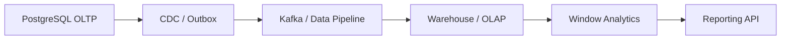
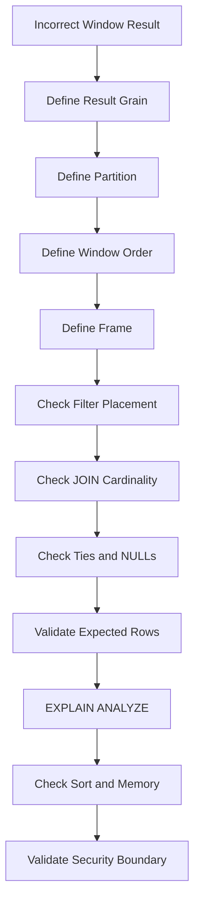

# 10- Window Function Problems

## Overview

Window functions are one of the most useful SQL features for solving problems where calculations must be performed across related rows **without collapsing those rows into a single result row**.

They are commonly used for:

- Ranking records.
- Finding the latest or earliest row per group.
- Calculating running totals.
- Comparing a row with the previous or next row.
- Calculating percentages within a group.
- Detecting changes between events.
- Paginating ranked results.
- Building reporting and analytics queries.

A window function has the general form:

```sql
function(...) OVER (
    PARTITION BY ...
    ORDER BY ...
    ROWS ...
)
```

The most important distinction is:

```text
GROUP BY
→ collapses rows

Window function
→ preserves rows
```

For example:

```sql
SELECT
    customer_id,
    id AS order_id,
    total_amount,
    SUM(total_amount) OVER (
        PARTITION BY customer_id
    ) AS customer_revenue
FROM app.orders;
```

The result still contains one row per order, while `customer_revenue` is calculated across all orders belonging to that customer.

Many window-function bugs occur because the developer does not clearly define:

```text
Partition
Order
Frame
Result grain
Tie-breaking behavior
```

---

## Window Function Mental Model

A useful conceptual pipeline is:

```text
FROM / JOIN
    ↓
WHERE
    ↓
GROUP BY / HAVING
    ↓
Window functions
    ↓
SELECT / DISTINCT
    ↓
ORDER BY
    ↓
LIMIT / OFFSET
```

Window functions operate over the rows that remain after earlier relational operations.

This matters because:

```sql
WHERE status = 'completed'
```

changes which rows are available to the window function.

Similarly:

```sql
GROUP BY customer_id
```

changes the rows on which the window function operates.

A window function does not magically access rows filtered out earlier in the query.

---

## GROUP BY vs Window Functions

Consider:

```sql
SELECT
    customer_id,
    SUM(total_amount) AS revenue
FROM app.orders
GROUP BY customer_id;
```

This returns:

```text
one row per customer
```

A window function:

```sql
SELECT
    customer_id,
    id AS order_id,
    total_amount,
    SUM(total_amount) OVER (
        PARTITION BY customer_id
    ) AS customer_revenue
FROM app.orders;
```

returns:

```text
one row per order
+
customer-level revenue
```

| Requirement | Typical approach |
|---|---|
| One row per customer | `GROUP BY` |
| Keep every order and show customer total | Window function |
| Rank orders within customer | `ROW_NUMBER()` / `RANK()` |
| Running customer revenue | Windowed `SUM()` |
| Previous order | `LAG()` |
| Next order | `LEAD()` |
| Latest row per customer | `ROW_NUMBER()` / `DISTINCT ON` |

The correct choice depends on the desired result grain.

---

## Anatomy of a Window Function

Example:

```sql
SUM(total_amount) OVER (
    PARTITION BY customer_id
    ORDER BY created_at, id
    ROWS BETWEEN UNBOUNDED PRECEDING AND CURRENT ROW
)
```

Each component has a distinct role.

| Component | Purpose |
|---|---|
| `SUM(total_amount)` | Calculation |
| `PARTITION BY customer_id` | Defines independent groups |
| `ORDER BY created_at, id` | Defines row sequence |
| `ROWS ...` | Defines the window frame |

A useful mental model is:

```text
PARTITION BY
    ↓
Which rows belong together?

ORDER BY
    ↓
In what order are they evaluated?

Frame
    ↓
Which rows within that partition contribute to this row's calculation?
```

---

## PARTITION BY Problems

`PARTITION BY` defines independent windows.

Example:

```sql
SELECT
    customer_id,
    id,
    total_amount,
    SUM(total_amount) OVER (
        PARTITION BY customer_id
    ) AS customer_total
FROM app.orders;
```

Every customer's orders are evaluated independently.

Without:

```sql
PARTITION BY customer_id
```

the window spans the entire result set:

```sql
SELECT
    customer_id,
    id,
    total_amount,
    SUM(total_amount) OVER () AS global_total
FROM app.orders;
```

This is a common mistake when a developer expects per-customer calculations but accidentally calculates a global metric.

---

## Missing PARTITION BY

Suppose the requirement is:

> Rank orders within each customer.

Incorrect:

```sql
ROW_NUMBER() OVER (
    ORDER BY created_at DESC
)
```

This ranks all orders globally.

Correct:

```sql
ROW_NUMBER() OVER (
    PARTITION BY customer_id
    ORDER BY created_at DESC, id DESC
)
```

Now every customer gets an independent sequence:

```text
customer 100 → 1, 2, 3
customer 101 → 1, 2, 3
```

The absence of `PARTITION BY` is often a semantic bug rather than a syntax error.

---

## Incorrect PARTITION BY

Suppose the requirement is:

```text
rank products within each category
```

This:

```sql
RANK() OVER (
    PARTITION BY category_id
    ORDER BY price DESC
)
```

is appropriate.

But:

```sql
RANK() OVER (
    PARTITION BY category_id, warehouse_id
    ORDER BY price DESC
)
```

changes the grain of the ranking.

Now products are ranked independently within:

```text
category + warehouse
```

Adding a partition column is not a harmless optimization.

It changes the business semantics.

---

## ORDER BY Inside OVER vs Final ORDER BY

These are different.

```sql
SELECT
    id,
    customer_id,
    created_at,
    ROW_NUMBER() OVER (
        PARTITION BY customer_id
        ORDER BY created_at DESC
    ) AS row_number
FROM app.orders
ORDER BY created_at DESC;
```

The `ORDER BY` inside `OVER` determines:

```text
window calculation order
```

The final `ORDER BY` determines:

```text
result presentation order
```

Changing the final order does not necessarily change the ranking.

Changing the window `ORDER BY` changes the calculation.

---

## Missing Deterministic Tie-Breaking

Consider:

```sql
ROW_NUMBER() OVER (
    PARTITION BY customer_id
    ORDER BY created_at DESC
)
```

If two orders have identical timestamps, their relative order is not fully defined.

For deterministic results:

```sql
ROW_NUMBER() OVER (
    PARTITION BY customer_id
    ORDER BY created_at DESC, id DESC
)
```

Use a stable unique tie-breaker where the business logic requires deterministic row selection.

This is particularly important for:

- Latest-row queries.
- APIs.
- Pagination.
- Reproducible tests.
- Batch processing.

---

## ROW_NUMBER

`ROW_NUMBER()` assigns a unique sequence number within each window.

Example:

```sql
SELECT
    customer_id,
    id AS order_id,
    created_at,
    ROW_NUMBER() OVER (
        PARTITION BY customer_id
        ORDER BY created_at DESC, id DESC
    ) AS row_number
FROM app.orders;
```

Result conceptually:

```text
customer | order | row_number
---------+-------+-----------
100      | 501   | 1
100      | 499   | 2
101      | 600   | 1
101      | 590   | 2
```

This is one of the most useful patterns for:

```text
one row per group
```

---

## Latest Row Per Group

A common production requirement is:

> Get the latest order for every customer.

Use:

```sql
WITH ranked_orders AS (
    SELECT
        o.*,
        ROW_NUMBER() OVER (
            PARTITION BY customer_id
            ORDER BY created_at DESC, id DESC
        ) AS row_number
    FROM app.orders AS o
)
SELECT
    id,
    customer_id,
    status,
    total_amount,
    created_at
FROM ranked_orders
WHERE row_number = 1;
```

The window function first establishes:

```text
rank within customer
```

The outer query then selects:

```text
rank = 1
```

Window-function results cannot generally be filtered directly in the same query's `WHERE` clause, so a subquery or CTE is commonly used.

---

## Why WHERE Cannot Directly Filter a Window Function

This is invalid:

```sql
SELECT
    id,
    customer_id,
    ROW_NUMBER() OVER (
        PARTITION BY customer_id
        ORDER BY created_at DESC
    ) AS row_number
FROM app.orders
WHERE row_number = 1;
```

The alias is not available at the logical stage where `WHERE` operates.

Use:

```sql
WITH ranked_orders AS (
    SELECT
        id,
        customer_id,
        created_at,
        ROW_NUMBER() OVER (
            PARTITION BY customer_id
            ORDER BY created_at DESC, id DESC
        ) AS row_number
    FROM app.orders
)
SELECT *
FROM ranked_orders
WHERE row_number = 1;
```

This makes the query stages explicit.

---

## PostgreSQL QUALIFY Consideration

Some SQL systems provide `QUALIFY` to filter window-function results directly.

PostgreSQL does not provide a native `QUALIFY` clause.

Therefore, PostgreSQL commonly uses:

```sql
WITH ranked AS (...)
SELECT ...
FROM ranked
WHERE row_number = 1;
```

or a derived table:

```sql
SELECT *
FROM (
    SELECT
        *,
        ROW_NUMBER() OVER (
            PARTITION BY customer_id
            ORDER BY created_at DESC, id DESC
        ) AS row_number
    FROM app.orders
) AS ranked
WHERE row_number = 1;
```

Do not copy `QUALIFY` syntax from another database into PostgreSQL.

---

## RANK vs DENSE_RANK vs ROW_NUMBER

These functions behave differently when values tie.

Suppose scores are:

```text
100
100
90
80
```

| Function | Result |
|---|---|
| `ROW_NUMBER()` | `1, 2, 3, 4` |
| `RANK()` | `1, 1, 3, 4` |
| `DENSE_RANK()` | `1, 1, 2, 3` |

Use:

- `ROW_NUMBER()` when exactly one row should receive each position.
- `RANK()` when tied rows should share a rank and gaps should exist.
- `DENSE_RANK()` when tied rows should share a rank without gaps.

Choosing the wrong function can produce incorrect business rankings.

---

## Top-N Per Group

Suppose:

> Return the three highest-value orders per customer.

Use:

```sql
WITH ranked_orders AS (
    SELECT
        o.*,
        ROW_NUMBER() OVER (
            PARTITION BY customer_id
            ORDER BY total_amount DESC, id DESC
        ) AS row_number
    FROM app.orders AS o
)
SELECT
    id,
    customer_id,
    total_amount
FROM ranked_orders
WHERE row_number <= 3;
```

This pattern is extremely common in backend reporting.

---

## Top-N With Ties

If the requirement is:

> Return every order whose amount is within the top three ranks per customer, including ties.

`RANK()` may be more appropriate:

```sql
WITH ranked_orders AS (
    SELECT
        o.*,
        RANK() OVER (
            PARTITION BY customer_id
            ORDER BY total_amount DESC
        ) AS order_rank
    FROM app.orders AS o
)
SELECT *
FROM ranked_orders
WHERE order_rank <= 3;
```

This can return more than three rows per customer when ties occur.

The difference is semantic:

```text
ROW_NUMBER
→ maximum N rows

RANK
→ maximum N ranking positions
```

---

## LAG

`LAG()` accesses a previous row in the window ordering.

Example:

```sql
SELECT
    customer_id,
    id AS order_id,
    created_at,
    total_amount,
    LAG(total_amount) OVER (
        PARTITION BY customer_id
        ORDER BY created_at, id
    ) AS previous_order_amount
FROM app.orders;
```

This is useful for:

- Comparing events.
- Detecting changes.
- Calculating deltas.
- Measuring intervals.
- Analyzing customer behavior.

The first row in each partition has no previous row, so the result is `NULL`.

---

## LEAD

`LEAD()` accesses a subsequent row.

```sql
SELECT
    customer_id,
    id AS order_id,
    created_at,
    LEAD(created_at) OVER (
        PARTITION BY customer_id
        ORDER BY created_at, id
    ) AS next_order_at
FROM app.orders;
```

This can calculate:

```text
time until next event
```

or identify:

```text
last event in a sequence
```

For the final row of a partition, `LEAD()` returns `NULL` unless a default is supplied.

---

## LAG and LEAD With Defaults

You can provide a default:

```sql
LAG(total_amount, 1, 0) OVER (
    PARTITION BY customer_id
    ORDER BY created_at, id
)
```

But be careful.

A default of `0` means:

```text
No previous row
```

is represented as:

```text
0
```

That may be semantically different from:

```text
Previous row exists and amount = 0
```

Preserve `NULL` when absence itself carries meaning.

---

## Running Totals

A running total can be calculated with:

```sql
SELECT
    customer_id,
    id AS order_id,
    created_at,
    total_amount,
    SUM(total_amount) OVER (
        PARTITION BY customer_id
        ORDER BY created_at, id
        ROWS BETWEEN UNBOUNDED PRECEDING AND CURRENT ROW
    ) AS running_revenue
FROM app.orders;
```

Conceptually:

```text
Order 1 → 100
Order 2 → 250
Order 3 → 400
```

where each row includes the cumulative total up to that point.

---

## Window Frame Problems

Window functions with ordering can have an implicit frame.

This matters particularly for aggregate window functions.

Compare:

```sql
SUM(total_amount) OVER (
    PARTITION BY customer_id
    ORDER BY created_at
)
```

with:

```sql
SUM(total_amount) OVER (
    PARTITION BY customer_id
    ORDER BY created_at
    ROWS BETWEEN UNBOUNDED PRECEDING AND CURRENT ROW
)
```

The explicit `ROWS` frame communicates that the running calculation is based on physical ordered rows.

Explicit frames are often preferable when correctness depends on row-by-row progression.

---

## RANGE vs ROWS

`ROWS` and `RANGE` are not interchangeable.

`ROWS` operates based on physical row positions in the ordered result.

`RANGE` groups peer rows according to the ordering value.

For example, if two orders have the same timestamp:

```text
10:00 → 100
10:00 → 200
10:05 → 300
```

a `RANGE` frame can treat both `10:00` rows as peers, while `ROWS` can advance one row at a time.

For deterministic running totals, an explicit `ROWS` frame plus a deterministic ordering is often the clearest choice.

---

## Running Total With Duplicate Ordering Values

Potentially ambiguous:

```sql
SUM(total_amount) OVER (
    ORDER BY created_at
)
```

If multiple rows share the same `created_at`, peer behavior can produce results that do not match a row-by-row interpretation.

Prefer:

```sql
SUM(total_amount) OVER (
    ORDER BY created_at, id
    ROWS BETWEEN UNBOUNDED PRECEDING AND CURRENT ROW
)
```

Now each row has a deterministic position.

---

## Moving Averages

Window functions can calculate rolling metrics.

Example:

```sql
SELECT
    business_date,
    revenue,
    AVG(revenue) OVER (
        ORDER BY business_date
        ROWS BETWEEN 6 PRECEDING AND CURRENT ROW
    ) AS seven_day_average
FROM reporting.daily_revenue
ORDER BY business_date;
```

This calculates a seven-row rolling average.

Be careful with missing calendar dates.

If a reporting table lacks a row for a day,:

```text
7 PRECEDING
```

means seven previous rows, not necessarily seven previous calendar days.

For true calendar windows, a complete date series may be required.

---

## Percentage of Group

Suppose:

> Show each order and its percentage of the customer's total revenue.

```sql
SELECT
    customer_id,
    id AS order_id,
    total_amount,
    total_amount
        / NULLIF(
            SUM(total_amount) OVER (
                PARTITION BY customer_id
            ),
            0
        ) AS revenue_share
FROM app.orders;
```

The denominator is calculated across the customer's partition.

`NULLIF(..., 0)` protects against division by zero.

For financial APIs, format and round the result according to the required decimal semantics rather than relying on floating-point presentation.

---

## Comparing a Row With the Group Average

```sql
SELECT
    customer_id,
    id AS order_id,
    total_amount,
    AVG(total_amount) OVER (
        PARTITION BY customer_id
    ) AS customer_average
FROM app.orders;
```

You can then compare:

```text
order amount
vs
customer average
```

If filtering based on that window result is required, use a CTE:

```sql
WITH order_metrics AS (
    SELECT
        customer_id,
        id AS order_id,
        total_amount,
        AVG(total_amount) OVER (
            PARTITION BY customer_id
        ) AS customer_average
    FROM app.orders
)
SELECT *
FROM order_metrics
WHERE total_amount > customer_average;
```

---

## Window Functions After GROUP BY

Window functions can operate on aggregated rows.

Example:

```sql
SELECT
    customer_id,
    COUNT(*) AS order_count,
    SUM(COUNT(*)) OVER () AS total_orders
FROM app.orders
GROUP BY customer_id;
```

The inner aggregation produces:

```text
one row per customer
```

The window function then operates over those customer-level rows.

This is a powerful pattern for:

```text
aggregate + global aggregate
```

without another application query.

---

## Percentage of Total After GROUP BY

For customer revenue share:

```sql
SELECT
    customer_id,
    SUM(total_amount) AS revenue,
    SUM(total_amount)
        / NULLIF(
            SUM(SUM(total_amount)) OVER (),
            0
        ) AS revenue_share
FROM app.orders
GROUP BY customer_id;
```

Conceptually:

```text
orders
  ↓
customer aggregation
  ↓
customer rows
  ↓
window over customer rows
  ↓
percentage of global revenue
```

This is different from applying the window directly to raw order rows.

---

## Window Functions and Filtering

Because window functions are evaluated after `WHERE`, this query:

```sql
SELECT
    customer_id,
    total_amount,
    RANK() OVER (
        PARTITION BY customer_id
        ORDER BY total_amount DESC
    ) AS rank
FROM app.orders
WHERE status = 'completed';
```

ranks only completed orders.

If the requirement is:

> Rank all orders, then return only completed orders with their original global rank.

the query must be structured differently:

```sql
WITH ranked_orders AS (
    SELECT
        customer_id,
        id,
        status,
        total_amount,
        RANK() OVER (
            PARTITION BY customer_id
            ORDER BY total_amount DESC
        ) AS rank
    FROM app.orders
)
SELECT *
FROM ranked_orders
WHERE status = 'completed';
```

The placement of the filter changes the window's input set.

---

## This Is a Common Production Bug

These two queries are not equivalent.

### Filter before ranking

```sql
WITH ranked AS (
    SELECT
        *,
        ROW_NUMBER() OVER (
            PARTITION BY customer_id
            ORDER BY created_at DESC
        ) AS rn
    FROM app.orders
    WHERE status = 'completed'
)
SELECT *
FROM ranked
WHERE rn = 1;
```

Meaning:

```text
latest completed order
```

### Rank before filtering

```sql
WITH ranked AS (
    SELECT
        *,
        ROW_NUMBER() OVER (
            PARTITION BY customer_id
            ORDER BY created_at DESC
        ) AS rn
    FROM app.orders
)
SELECT *
FROM ranked
WHERE status = 'completed'
  AND rn = 1;
```

Meaning:

```text
latest order, only if that latest order is completed
```

If the latest order is pending but the previous order is completed:

```text
First query → previous completed order
Second query → no row
```

The query structure must match the business requirement.

---

## Window Functions and DISTINCT

Applying `DISTINCT` after a window calculation can change the result in unexpected ways.

For example:

```sql
SELECT DISTINCT
    customer_id,
    ROW_NUMBER() OVER (
        PARTITION BY customer_id
        ORDER BY created_at
    ) AS rn
FROM app.orders;
```

The window result itself makes rows distinct in many cases.

If the requirement is:

```text
unique customers
```

a window function may be the wrong tool.

Choose the operation that matches the desired result grain.

---

## Window Functions and Pagination

Window functions are frequently used for ranked APIs.

Example:

```sql
WITH ranked_orders AS (
    SELECT
        o.*,
        ROW_NUMBER() OVER (
            PARTITION BY customer_id
            ORDER BY created_at DESC, id DESC
        ) AS rn
    FROM app.orders AS o
)
SELECT *
FROM ranked_orders
WHERE rn <= 20;
```

This is not ordinary API pagination.

It means:

```text
20 rows per customer
```

If the endpoint is:

```http
GET /orders?page=2
```

you may instead need keyset pagination or a normal ordered query.

Do not confuse:

```text
Top-N per partition
```

with:

```text
Global page N
```

---

## Window Functions and Keyset Pagination

For ordinary large-table pagination:

```sql
SELECT
    id,
    customer_id,
    created_at,
    total_amount
FROM app.orders
WHERE (created_at, id) < ($1, $2)
ORDER BY
    created_at DESC,
    id DESC
LIMIT 50;
```

This often avoids the cost of large `OFFSET` values.

A window function is usually unnecessary unless the API specifically needs:

```text
rank
position
running metric
previous/next row
```

Use the simplest query that satisfies the API contract.

---

## Window Functions and JOIN Multiplication

Window functions operate on the rows produced by the preceding `FROM` and `JOIN` stages.

Consider:

```sql
SELECT
    o.customer_id,
    o.id,
    SUM(o.total_amount) OVER (
        PARTITION BY o.customer_id
    ) AS customer_revenue
FROM app.orders AS o
JOIN app.order_items AS oi
    ON oi.order_id = o.id;
```

If an order has multiple items, the order appears multiple times.

The window sum therefore sees duplicated order rows.

The result can be inflated.

The solution is not necessarily to add `DISTINCT`.

Instead, establish the correct order-level grain before applying the window calculation.

---

## Pre-Aggregation Before Window Functions

If the calculation should operate on orders:

```sql
WITH order_totals AS (
    SELECT
        id AS order_id,
        customer_id,
        total_amount
    FROM app.orders
)
SELECT
    customer_id,
    order_id,
    total_amount,
    SUM(total_amount) OVER (
        PARTITION BY customer_id
    ) AS customer_revenue
FROM order_totals;
```

If joins are required, ensure they do not multiply the intended input grain.

The general rule is:

```text
Correct source grain
        ↓
JOINs
        ↓
Window calculation
```

or:

```text
Raw relations
        ↓
Pre-aggregation
        ↓
Correct grain
        ↓
Window calculation
```

depending on the requirement.

---

## Window Functions and NULL Values

Window aggregates generally follow the NULL behavior of their aggregate function.

For example:

```sql
AVG(total_amount) OVER (
    PARTITION BY customer_id
)
```

ignores NULL amounts.

`LAG()` and `LEAD()` return NULL when there is no corresponding row unless a default is supplied.

Do not replace NULL with zero without checking the business meaning.

For example:

```text
No previous event
```

is not necessarily equivalent to:

```text
Previous event had value 0
```

---

## Window Functions and Time Zones

For time-based windows:

```sql
ORDER BY created_at
```

the timestamp semantics must be well-defined.

For reporting based on business-local dates, convert timestamps according to the reporting timezone before grouping or ordering when appropriate.

Be especially careful when calculating:

```text
daily rankings
rolling windows
previous business day
session intervals
```

The application server's timezone should not silently define business semantics.

---

## Window Functions and Data Modification

Window functions can be used in data-selection logic for updates through a CTE.

For example, to identify duplicate records:

```sql
WITH duplicates AS (
    SELECT
        id,
        ROW_NUMBER() OVER (
            PARTITION BY customer_id, email
            ORDER BY created_at DESC, id DESC
        ) AS rn
    FROM app.customer_emails
)
DELETE FROM app.customer_emails AS e
USING duplicates AS d
WHERE e.id = d.id
  AND d.rn > 1;
```

This is a destructive operation.

Before executing it in production:

- Run the CTE as a `SELECT`.
- Verify the rows selected.
- Check foreign keys.
- Check audit requirements.
- Use an appropriate transaction.
- Consider batching large deletes.

---

## Window Functions and Django

Django supports several window expressions.

Example:

```python
from django.db.models import F, Window
from django.db.models.functions import RowNumber

orders = Order.objects.annotate(
    row_number=Window(
        expression=RowNumber(),
        partition_by=[F("customer_id")],
        order_by=[
            F("created_at").desc(),
            F("id").desc(),
        ],
    )
)
```

For filtering and complex ranking, inspect the SQL generated by the ORM.

Do not assume that a Python expression's structure tells you exactly how PostgreSQL will execute it.

---

## Django and Latest-Per-Group Queries

A window expression can represent:

```text
row number within customer
```

but application-level filtering must respect Django and database capabilities.

For PostgreSQL-specific solutions, `DISTINCT ON` can sometimes be simpler:

```sql
SELECT DISTINCT ON (customer_id)
    customer_id,
    id,
    status,
    created_at
FROM app.orders
ORDER BY
    customer_id,
    created_at DESC,
    id DESC;
```

The choice between:

```text
ROW_NUMBER
DISTINCT ON
```

depends on whether you need:

```text
general ranking
multiple top rows
portable SQL
PostgreSQL-specific optimization
```

---

## Window Functions and FastAPI

FastAPI does not change SQL semantics.

A service using SQLAlchemy can execute a window query:

```python
from sqlalchemy import func, select

stmt = select(
    Order.customer_id,
    Order.id,
    Order.total_amount,
    func.row_number().over(
        partition_by=Order.customer_id,
        order_by=(Order.created_at.desc(), Order.id.desc()),
    ).label("row_number"),
)
```

The API layer should expose a stable result contract.

For expensive analytics, consider whether the query should execute synchronously on the request path or through:

```text
Celery
Kafka consumers
materialized views
read models
OLAP systems
```

---

## Window Functions and Redis

Caching can help repeated analytical queries:

```text
API
 ↓
Redis
 ↓ cache miss
PostgreSQL window query
 ↓
Redis
 ↓
API
```

But cache correctness still depends on the underlying query.

For ranking or real-time metrics, define acceptable staleness.

Do not cache rapidly changing rankings indefinitely.

---

## Window Functions and Kafka

Window-like calculations can also be implemented as streaming state.

For example:

```text
Kafka events
    ↓
Consumer
    ↓
Per-customer state
    ↓
Running metric
    ↓
Read model
```

This differs from SQL window functions because:

```text
SQL
→ evaluates a finite relational dataset

Streaming
→ maintains state as events arrive
```

Streaming introduces:

- Event ordering
- Late events
- Duplicate events
- Reprocessing
- State recovery
- Exactly-once/idempotency considerations

Do not replace SQL analytics with streaming merely because both can calculate rankings or running totals.

---

## Performance Considerations

Window functions can be expensive because PostgreSQL may need to:

```text
Read rows
→ partition/order them
→ maintain window state
→ produce results
```

Performance depends on:

- Number of input rows.
- Number of partitions.
- Partition size.
- Window ordering.
- Sort requirements.
- Memory.
- Disk spill.
- Parallel execution opportunities.
- Join cardinality.
- Filtering before the window.

A selective `WHERE` clause can dramatically reduce window workload.

---

## Sorting and Window Performance

Consider:

```sql
ROW_NUMBER() OVER (
    PARTITION BY customer_id
    ORDER BY created_at DESC, id DESC
)
```

The database needs an ordered representation suitable for the window operation.

A useful index may be:

```sql
CREATE INDEX orders_customer_created_id_idx
ON app.orders (
    customer_id,
    created_at DESC,
    id DESC
);
```

However, PostgreSQL may still choose another strategy depending on:

- Filter selectivity
- Table size
- Statistics
- Required output
- Existing ordering
- Cost estimates

Do not assume an index eliminates every sort.

Use:

```sql
EXPLAIN (ANALYZE, BUFFERS)
```

to validate.

---

## Window Functions and Memory

Large partitions can require significant memory.

Examples:

```text
one customer with millions of orders
one tenant with huge event volume
one category containing most products
```

A query with:

```sql
PARTITION BY tenant_id
```

can create extremely large logical partitions for large tenants.

Monitor:

- Sort memory.
- Temporary files.
- Disk I/O.
- Query duration.
- Concurrent execution.
- Large-partition skew.

A single hot partition can dominate query cost.

---

## Window Functions and Partition Skew

Consider a multi-tenant system:

```text
Tenant A → 100 rows
Tenant B → 200 rows
Tenant C → 500 million rows
```

A window:

```sql
PARTITION BY tenant_id
```

does not distribute the work evenly simply because there are many tenants.

Tenant C can dominate:

```text
sort
memory
I/O
execution time
```

For very large tenants, consider:

- Precomputed metrics.
- Partitioning.
- Read models.
- Dedicated reporting infrastructure.
- Tenant-specific workload isolation.

---

## EXPLAIN for Window Problems

Use:

```sql
EXPLAIN (ANALYZE, BUFFERS)
SELECT
    customer_id,
    id,
    ROW_NUMBER() OVER (
        PARTITION BY customer_id
        ORDER BY created_at DESC, id DESC
    ) AS rn
FROM app.orders;
```

Inspect:

```text
WindowAgg
Sort
Incremental Sort
Index Scan
Seq Scan
Actual rows
Loops
Temporary I/O
Execution time
```

The exact plan depends on PostgreSQL version and query shape.

The goal is to determine:

```text
How many rows reach the window?
How much sorting is required?
How large are partitions?
Is the input unnecessarily large?
Is the query spilling to disk?
```

---

## Filter Early When Semantically Correct

If the requirement is:

```text
Latest completed order
```

filter before ranking:

```sql
WITH ranked_orders AS (
    SELECT
        o.*,
        ROW_NUMBER() OVER (
            PARTITION BY customer_id
            ORDER BY created_at DESC, id DESC
        ) AS rn
    FROM app.orders AS o
    WHERE status = 'completed'
)
SELECT *
FROM ranked_orders
WHERE rn = 1;
```

This can reduce:

```text
rows
→ sorting
→ window processing
```

But only do this if the filter is semantically part of the ranking population.

Optimization must not change the business definition.

---

## Window Functions and Materialized Views

Repeated expensive window calculations can sometimes be moved into a materialized reporting layer.

For example:

```text
OLTP tables
    ↓
Aggregation / ranking
    ↓
Materialized view
    ↓
Reporting API
```

This can be useful when:

- Data changes less frequently than it is read.
- Queries are expensive.
- Slightly stale results are acceptable.
- Rankings are requested frequently.

Refresh strategy must consider:

- Refresh duration.
- Concurrent access.
- Freshness.
- Index maintenance.
- Resource consumption.

---

## Window Functions and OLAP

Large analytical window operations can be inappropriate for an OLTP primary.

Examples include:

```text
billions of events
large historical ranges
multiple partitions
multiple ranking dimensions
rolling calculations
```

A common architecture is:



This isolates analytical resource consumption from transactional workloads.

---

## Security Considerations

Window functions do not bypass authorization.

However, the rows available to the window determine the calculated result.

Suppose a user should only see rows from tenant `100`.

If unauthorized rows are included before:

```sql
SUM(...) OVER (...)
```

the aggregate can leak information even if the final API hides individual rows.

Security therefore needs to be enforced before or at the appropriate database visibility boundary.

Consider:

- Tenant predicates.
- Application authorization.
- PostgreSQL RLS.
- Database roles.
- Sensitive aggregate leakage.
- Connection-pool tenant context.

Aggregated information can still be sensitive.

---

## Window Functions and RLS

With PostgreSQL Row Level Security, window functions operate over rows visible under the applicable policies.

This can be useful for tenant-scoped analytics.

However, validate:

```text
current role
RLS policy
table ownership
BYPASSRLS
FORCE ROW LEVEL SECURITY
tenant context
connection pooling
```

Do not assume that filtering the final result is enough to prevent aggregate leakage.

The protected row set must be correct before the window calculation.

---

## Reliability Considerations

Critical window-function reports should have tests covering:

```text
Empty partitions
Single-row partitions
Ties
NULL values
Duplicate timestamps
Large partitions
Multiple tenants
Boundary dates
Missing dates
Late-arriving data
```

For metrics used in billing or financial reporting:

- Define rounding rules.
- Define timezone semantics.
- Define inclusion rules.
- Validate against known data.
- Reconcile against source records.

Do not rely on a visually plausible dashboard to validate correctness.

---

## Production Troubleshooting Workflow

Use this sequence:



When debugging:

1. Run the base query without the window function.
2. Confirm the input row set.
3. Confirm the intended partition.
4. Confirm the window ordering.
5. Add a deterministic tie-breaker.
6. Check the frame for aggregate windows.
7. Verify filter placement.
8. Check joins for row multiplication.
9. Compare against a small hand-verifiable dataset.
10. Inspect `EXPLAIN (ANALYZE, BUFFERS)` for production-scale behavior.

---

## Common Mistakes and Pitfalls

### Missing PARTITION BY

Ranking intended to be per customer becomes global ranking.

**Fix:** explicitly define the business partition.

### Adding Too Many Partition Columns

`PARTITION BY customer_id, status` can unintentionally create separate rankings for each status.

**Fix:** partition only by dimensions that define the intended independent population.

### Confusing Window ORDER BY With Final ORDER BY

The two orders serve different purposes.

**Fix:** inspect the `ORDER BY` inside `OVER` separately from the query's final ordering.

### Missing Tie-Breaker

Equal timestamps or amounts can lead to nondeterministic row selection.

**Fix:** add a stable unique column such as `id`.

### Using RANK Instead of ROW_NUMBER

`RANK()` preserves ties and can return more than N rows.

**Fix:** use `ROW_NUMBER()` when the requirement is exactly N rows per partition.

### Using ROW_NUMBER Instead of RANK

`ROW_NUMBER()` arbitrarily separates tied values into different positions.

**Fix:** use `RANK()` or `DENSE_RANK()` when ties are semantically meaningful.

### Filtering at the Wrong Stage

Filtering before ranking and filtering after ranking can produce different results.

**Fix:** determine whether the filter applies to the ranking population or only to the final output.

### Ignoring Window Frames

Running totals can behave unexpectedly with duplicate ordering values.

**Fix:** define an explicit frame when row-by-row behavior matters.

### Using a Window Function After a Multiplying JOIN

A one-to-many join can duplicate rows before the window calculation.

**Fix:** establish the intended grain before applying the window.

### Treating ROWS as Calendar Days

`ROWS BETWEEN 6 PRECEDING AND CURRENT ROW` means seven rows, not necessarily seven calendar days.

**Fix:** build a complete time series when calendar semantics are required.

### Using Window Functions for Simple Pagination

A window function is unnecessary for ordinary keyset pagination.

**Fix:** use indexed keyset predicates when ranking is not required.

### Running Huge Windows on OLTP

Large partitions and historical analytics can consume substantial database resources.

**Fix:** consider replicas, materialized views, read models, or OLAP systems.

### Assuming an Index Guarantees Fast Windows

An index may help, but PostgreSQL can still need sorting or choose another plan.

**Fix:** verify the actual execution plan.

---

## Interview Traps

### "What is the difference between GROUP BY and a window function?"

`GROUP BY` collapses rows into groups. Window functions calculate across related rows while preserving the input row grain.

### "Why can't I use a window function directly in WHERE?"

Because window functions are evaluated after the `WHERE` stage. Use a CTE or derived table to filter the computed window value.

### "What is the difference between ROW_NUMBER, RANK, and DENSE_RANK?"

`ROW_NUMBER()` gives every row a unique position. `RANK()` gives ties the same rank and leaves gaps. `DENSE_RANK()` gives ties the same rank without gaps.

### "Why is ORDER BY inside OVER different from the final ORDER BY?"

The window `ORDER BY` determines the calculation sequence. The final `ORDER BY` determines result presentation.

### "Why can a running total be wrong with duplicate timestamps?"

The window ordering may contain peers with no deterministic row sequence, and the default frame can treat peers differently from a row-by-row calculation.

### "How do you get the latest row per group?"

Common approaches include:

```text
ROW_NUMBER() OVER (...)
DISTINCT ON (...) in PostgreSQL
```

The choice depends on the requirement and database capabilities.

### "Can a window function be used after GROUP BY?"

Yes. The window function operates on the rows produced by the grouping stage.

### "Can a window function cause duplicate results?"

The window function itself does not multiply rows, but joins or other operations before it can multiply the input rows and therefore change the calculated result.

### "Are window functions always expensive?"

No. Cost depends on input cardinality, partition size, ordering, sorting, filtering, memory, and the execution plan.

---

## Senior-Level Heuristic

For every window function, explicitly identify four things:

```text
1. Result grain
2. Partition
3. Ordering
4. Frame
```

Then inspect the input:

```text
Base tables
    ↓
JOIN cardinality
    ↓
WHERE filtering
    ↓
GROUP BY
    ↓
Window input
    ↓
Partition
    ↓
Ordering
    ↓
Frame
    ↓
Window result
```

Ask:

```text
What does one output row represent?

Which rows should compete with each other?

What defines the order?

What happens when values tie?

What happens at partition boundaries?

What happens with NULL?

Does the frame mean rows or value ranges?

Are filters applied before or after the calculation?

Could a JOIN have multiplied the input?

How large can the biggest partition become?

Does the API really need a window function?
```

This reasoning prevents most serious window-function bugs.

The most important senior-level insight is:

> **A window function is only as correct as the row set and ordering supplied to it.**

If the input grain is wrong, the partition is wrong, or the ordering is nondeterministic, the window calculation can be perfectly valid SQL and still produce incorrect business results.

---

## Production Checklist

### Semantics

- [ ] Define the result grain.
- [ ] Define the partition.
- [ ] Define the ordering.
- [ ] Define the frame when applicable.
- [ ] Define tie behavior.
- [ ] Define NULL behavior.

### Ranking

- [ ] Use `ROW_NUMBER()` for unique positions.
- [ ] Use `RANK()` when ties should share positions with gaps.
- [ ] Use `DENSE_RANK()` when ties should share positions without gaps.
- [ ] Add deterministic tie-breakers when required.

### Latest / Top-N

- [ ] Use `ROW_NUMBER()` for one or N rows per group.
- [ ] Use `RANK()` when tied values should all qualify.
- [ ] Use an outer query or CTE to filter window results.
- [ ] Consider PostgreSQL `DISTINCT ON` for simple latest-row queries.

### Frames

- [ ] Understand the default frame.
- [ ] Use explicit `ROWS` frames for deterministic row-by-row calculations.
- [ ] Distinguish `ROWS` from `RANGE`.
- [ ] Verify duplicate ordering values.

### Query Structure

- [ ] Inspect the input before adding the window function.
- [ ] Check JOIN cardinality.
- [ ] Verify filter placement.
- [ ] Verify GROUP BY happens at the intended stage.
- [ ] Avoid unnecessary `DISTINCT`.

### Performance

- [ ] Use `EXPLAIN (ANALYZE, BUFFERS)`.
- [ ] Inspect sort operations.
- [ ] Inspect temporary I/O.
- [ ] Check largest partition size.
- [ ] Check actual row counts.
- [ ] Evaluate indexes supporting filters and ordering.
- [ ] Test realistic production-scale data.

### Application

- [ ] Inspect Django-generated SQL.
- [ ] Inspect SQLAlchemy-generated SQL.
- [ ] Ensure API result grain is correct.
- [ ] Do not confuse Top-N-per-group with pagination.
- [ ] Consider precomputed read models for expensive recurring metrics.

### Security

- [ ] Preserve tenant boundaries.
- [ ] Verify authorization before aggregation.
- [ ] Validate RLS behavior.
- [ ] Consider aggregate information leakage.
- [ ] Verify connection-pool tenant context.

### Reliability

- [ ] Test empty partitions.
- [ ] Test single-row partitions.
- [ ] Test ties.
- [ ] Test NULL values.
- [ ] Test duplicate timestamps.
- [ ] Test large partitions.
- [ ] Test timezone boundaries.
- [ ] Reconcile critical reporting metrics against source data.

### Architecture

- [ ] Avoid large analytical windows on OLTP primaries when possible.
- [ ] Consider read replicas for suitable workloads.
- [ ] Consider materialized views for repeated calculations.
- [ ] Consider Kafka/read models for asynchronous derived metrics.
- [ ] Consider OLAP infrastructure for large historical analytics.

## Key Takeaways

- **Define the four dimensions of every window calculation:** result grain, partition, ordering, and frame determine whether the calculation matches the business requirement.
- **Window functions preserve rows while `GROUP BY` collapses them:** use windows for rankings, running metrics, comparisons, and top-N-per-group problems where the underlying rows must remain visible.
- **Filter placement and JOIN cardinality are critical:** rows removed before a window are unavailable to it, while multiplying joins can silently corrupt window aggregates.
- **Make ranking deterministic:** use the appropriate `ROW_NUMBER`, `RANK`, or `DENSE_RANK` function and add stable tie-breakers when selecting specific rows.
- **Treat large window operations as production workloads:** validate execution plans, partition sizes, sorting, memory, tenant isolation, API semantics, and whether OLTP, materialized views, read models, or OLAP is the right execution layer.